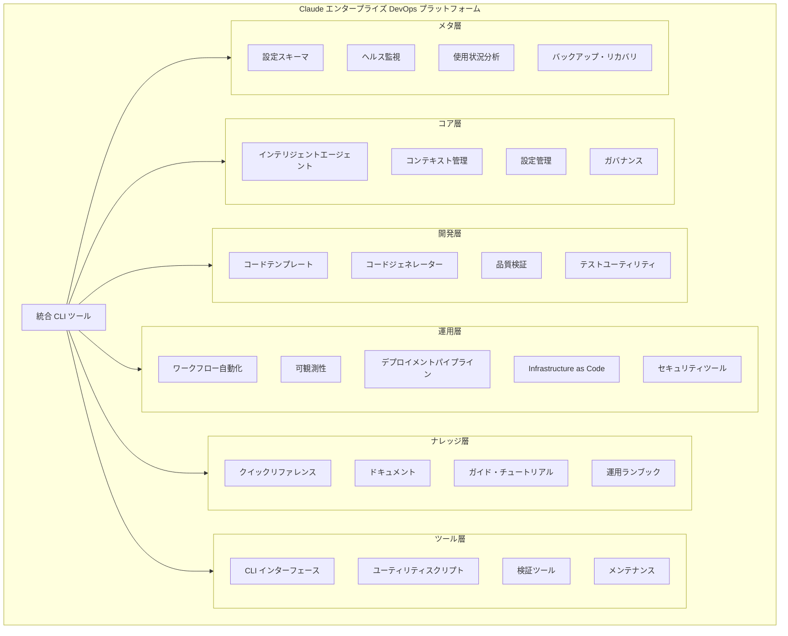

# 🚀 Claude エンタープライズ DevOps プラットフォーム

### PMPLearningManagement 向け AI 駆動開発インフラストラクチャ

[](https://github.com/yusuke-kurosawa/PMPLearningManagement)
[](/.claude/meta/health/status.json)
[](/.claude/operations/security/)
[](/.claude/knowledge/)
[](../LICENSE)

<div align="center">
  <h3>🎯 AI を活用した DevOps で開発ワークフローを変革</h3>
  <p>PMPLearningManagement プロジェクト向けに開発・運用・AI 支援を統合したエンタープライズグレードのプラットフォーム</p>
</div>

---

## 📋 概要

`.claude` ディレクトリは、PMPLearningManagement プロジェクト専用に設計されたエンタープライズグレードの DevOps プラットフォームです。開発チームが AI 支援、ワークフロー自動化、プロジェクトヘルスの維持を革新的に行うことを可能にします。現代の DevOps 原則と組織パターンに従って構築され、プロジェクトライフサイクル全体を管理するためのスケーラブルで保守可能な本番対応インフラストラクチャを提供します。

### 🎯 主要価値提案

- **10倍の開発者生産性**: 統一CLI と AI エージェントが複雑なタスクを効率化
- **ゼロタッチ運用**: 自動化されたヘルス監視と自己修復システム
- **エンタープライズセキュリティ**: 組み込み済みのコンプライアンス、監査ログ、セキュリティスキャン
- **シームレス統合**: 既存の CI/CD パイプラインと開発ツールとの連携
- **AI ファーストアーキテクチャ**: Claude AI を活用したインテリジェントな支援と自動化

---

## ⚡ クイックスタートガイド

5分以内でセットアップ完了：

### インストール & セットアップ

```bash
# Claude ツールディレクトリに移動
cd .claude/tools/cli

# 依存関係のインストール
npm install

# CLI をグローバルに利用可能にする
npm link

# インストールの確認
claude --version
```

### 基本的な使用方法

```bash
# システムヘルスチェック
claude health check

# 現在の設定を表示
claude config show

# 利用可能なエージェントを一覧表示
claude agent list

# クリーンアップの実行
claude maintain cleanup

# ヘルスレポートの生成
claude health report
```

### 🎮 インタラクティブ CLI デモ

```bash
# ヘルス監視
claude health check        # 包括的ヘルスチェックの実行
claude health monitor      # 継続的監視の開始
claude health report       # ヘルスレポートの生成

# 設定管理
claude config show         # 現在の設定を表示
claude config validate     # 設定の検証
claude config set key value # 設定の更新

# エージェント管理
claude agent list          # 全エージェントを一覧表示
claude agent run <name>    # 特定のエージェントを実行
claude agent enable <name> # エージェントを有効化

# メンテナンス操作
claude maintain cleanup    # クリーンアップ手順の実行
claude maintain backup     # バックアップの作成
claude maintain optimize   # Claude ディレクトリの最適化

# 自動化ワークフロー
claude auto run <workflow> # 自動化ワークフローの実行
claude auto schedule       # ワークフローのスケジュール
```

---

## 🏗️ エンタープライズアーキテクチャ



### 📁 エンタープライズプラットフォーム構造

```
.claude/
├── 🎯 core/                    # コア Claude 機能
│   ├── agents/                 # インテリジェント自動化エージェント
│   ├── context/                # プロジェクトコンテキスト管理
│   ├── policies/               # ガバナンスとコンプライアンスポリシー
│   └── config/                 # 中央設定管理
│
├── 🛠️ development/             # 開発特化ツール
│   ├── templates/              # コード生成テンプレート
│   ├── generators/             # 自動化コードジェネレーター
│   ├── validation/             # コード品質検証
│   └── testing/                # テストユーティリティとヘルパー
│
├── 🔧 operations/              # 運用と DevOps
│   ├── automation/             # ワークフロー自動化
│   ├── monitoring/             # 可観測性と監視
│   ├── deployment/             # デプロイメントパイプライン
│   ├── infrastructure/         # Infrastructure as Code
│   └── security/               # セキュリティツールとスキャン
│
├── 📚 knowledge/               # ナレッジ管理
│   ├── quick-ref/              # クイックリファレンスガイド
│   ├── documentation/          # ドキュメントジェネレーター
│   ├── guides/                 # ハウツーガイドとチュートリアル
│   └── runbooks/               # 運用ランブック
│
├── 🔨 tools/                   # 統合ツール
│   ├── cli/                    # コマンドライン・インターフェース
│   ├── scripts/                # ユーティリティスクリプト
│   ├── validators/             # 検証ツール
│   └── maintainers/            # メンテナンス自動化
│
└── 📊 meta/                    # メタ設定
    ├── schema/                 # 設定スキーマ
    ├── health/                 # ヘルス監視
    ├── metrics/                # 使用状況メトリクスと分析
    └── backup/                 # バックアップとリカバリ
```

---

## 🌟 コア機能

### 1. 🤖 インテリジェント自動化エージェント

DevOps タスクに特化した専門エージェント、各々が特定のワークフローに最適化：

```bash
# DevOps 運用
claude agent run deployment-engineer     # デプロイメント自動化
claude agent run sre-engineer           # サイト信頼性エンジニアリング
claude agent run platform-engineer      # プラットフォーム最適化

# インフラストラクチャ & クラウド
claude agent run cloud-architect        # クラウドインフラ設計
claude agent run devops-engineer        # 一般的な DevOps タスク

# 品質 & セキュリティ
claude agent run security-engineer      # セキュリティスキャンとコンプライアンス
claude agent run test-automation-engineer # テスト自動化
claude agent run monitoring-specialist  # 監視セットアップ
```

<details>
<summary>📋 利用可能なエージェント（エンタープライズ特化）</summary>

- **プラットフォームエージェント**: deployment-engineer, cloud-architect, platform-engineer
- **信頼性エージェント**: sre-engineer, monitoring-specialist
- **セキュリティエージェント**: security-engineer
- **品質エージェント**: test-automation-engineer
- **インフラエージェント**: devops-engineer

</details>

### 2. 🎮 統合 CLI ツール

すべての Claude 操作のための包括的なコマンドライン・インターフェース：

```bash
# ヘルス監視
claude health check        # 包括的ヘルスチェックの実行
claude health monitor      # 継続的監視の開始
claude health report       # ヘルスレポートの生成

# 設定管理
claude config show         # 現在の設定を表示
claude config validate     # 設定の検証
claude config set key value # 設定の更新

# エージェント管理
claude agent list          # 全エージェントを一覧表示
claude agent run <name>    # 特定のエージェントを実行
claude agent enable <name> # エージェントを有効化

# メンテナンス操作
claude maintain cleanup    # クリーンアップ手順の実行
claude maintain backup     # バックアップの作成
claude maintain optimize   # Claude ディレクトリの最適化

# 自動化ワークフロー
claude auto run <workflow> # 自動化ワークフローの実行
claude auto schedule       # ワークフローのスケジュール
```

### 3. 📊 ヘルス監視システム

自動修復機能を備えた包括的なヘルスチェック：

- **ディレクトリ構造** - すべての必要なディレクトリの存在を検証
- **設定管理** - 設定がスキーマに対して有効であることを確認
- **エージェントヘルス** - すべてのエージェントが適切に設定されていることをチェック
- **パフォーマンス監視** - システムパフォーマンスメトリクスの追跡
- **セキュリティスキャン** - 自動化された脆弱性スキャン
- **バックアップステータス** - 最新のバックアップの存在を確認
- **コンプライアンスチェック** - OWASP、CIS ベンチマーク検証
- **アラート管理** - 重要な問題に対する設定可能なアラート
- **HTML レポート生成** - 詳細なヘルスレポート

```bash
# 総合ヘルスチェック
claude health check

╔══════════════════════════════════════╗
║     システムヘルスダッシュボード       ║
╠══════════════════════════════════════╣
║ ✅ ディレクトリ構造:  有効           ║
║ ✅ 設定:              有効           ║
║ ✅ エージェント:      8/8 アクティブ ║
║ ✅ セキュリティ:      問題なし       ║
║ ✅ バックアップ:      最新           ║
╠══════════════════════════════════════╣
║ 総合ステータス: 🟢 正常              ║
╚══════════════════════════════════════╝

# 詳細レポートの生成
claude health report
```

### 4. 🔐 セキュリティ & コンプライアンス

包括的なコンプライアンスチェックを備えたエンタープライズグレードのセキュリティ機能：

**セキュリティ機能:**

- 自動化された脆弱性スキャン
- 依存関係のセキュリティ監査
- 秘密情報の検出と保護
- ロールベースアクセス制御（RBAC）
- 改ざん防止機能付き監査ログ

**コンプライアンス標準:**

- ✅ ISO 27001 情報セキュリティ
- ✅ SOC 2 Type II コンプライアンス
- ✅ NIST サイバーセキュリティフレームワーク
- ✅ OWASP Top 10 コンプライアンス
- ✅ CIS ベンチマーク検証
- ✅ PCI-DSS コンプライアンスツール
- ✅ GDPR コンプライアンス検証

```bash
# セキュリティ操作
claude security scan          # 包括的セキュリティスキャン
claude security audit         # レポート付きセキュリティ監査
claude compliance check       # コンプライアンス検証
claude audit log              # 監査ログの表示
```

### 5. 🔄 自動化ワークフロー

継続的運用のためのインテリジェント自動化ワークフロー：

**継続的インテグレーション:**

- 自動化されたリンティングとテスト
- すべてのコミットでのセキュリティスキャン
- パフォーマンスベンチマーク
- コンプライアンス検証

**継続的デプロイメント:**

- マルチ環境デプロイメント
- 自動化されたロールバック手順
- ヘルス検証
- パフォーマンス監視

**メンテナンス自動化:**

- スケジュールされたクリーンアップ手順
- 自動化されたバックアップ
- ログローテーション
- キャッシュ管理
- ヘルス監視

```bash
# ワークフロー管理
claude auto run continuous-integration
claude auto run continuous-deployment
claude auto run nightly-maintenance
claude auto schedule --workflow=backup --cron="0 2 * * *"
```

---

## 💻 CLI コマンドリファレンス

### インストール & セットアップ

```bash
# Claude ツールディレクトリに移動
cd .claude/tools/cli

# 依存関係のインストール
npm install

# CLI をグローバルに利用可能にする
npm link

# インストールの確認
claude --version
```

### コアコマンド

| コマンド   | 説明               | 例                        |
| ---------- | ------------------ | ------------------------- |
| `health`   | システムヘルス操作 | `claude health check`     |
| `config`   | 設定管理           | `claude config show`      |
| `agent`    | エージェント管理   | `claude agent list`       |
| `maintain` | メンテナンス操作   | `claude maintain cleanup` |

### ヘルスコマンド

| コマンド          | 説明                       | 例                       |
| ----------------- | -------------------------- | ------------------------ |
| `health check`    | 包括的ヘルスチェックの実行 | `claude health check`    |
| `health monitor`  | 継続的監視の開始           | `claude health monitor`  |
| `health report`   | ヘルスレポートの生成       | `claude health report`   |
| `health diagnose` | 詳細診断                   | `claude health diagnose` |

### エージェントコマンド

| コマンド       | 説明                             | 例                                     |
| -------------- | -------------------------------- | -------------------------------------- |
| `agent list`   | 全利用可能エージェントを一覧表示 | `claude agent list`                    |
| `agent run`    | 特定のエージェントを実行         | `claude agent run deployment-engineer` |
| `agent enable` | エージェントを有効化             | `claude agent enable sre-engineer`     |
| `agent status` | エージェントステータスをチェック | `claude agent status`                  |

### 設定コマンド

| コマンド          | 説明                 | 例                            |
| ----------------- | -------------------- | ----------------------------- |
| `config show`     | 現在の設定を表示     | `claude config show`          |
| `config validate` | 設定の検証           | `claude config validate`      |
| `config set`      | 設定の更新           | `claude config set key value` |
| `config reset`    | デフォルトにリセット | `claude config reset`         |

### メンテナンスコマンド

| コマンド            | 説明                     | 例                         |
| ------------------- | ------------------------ | -------------------------- |
| `maintain cleanup`  | クリーンアップ手順の実行 | `claude maintain cleanup`  |
| `maintain backup`   | バックアップの作成       | `claude maintain backup`   |
| `maintain optimize` | ディレクトリの最適化     | `claude maintain optimize` |
| `maintain repair`   | 問題の自動修復           | `claude maintain repair`   |

### 自動化コマンド

| コマンド        | 説明                             | 例                                    |
| --------------- | -------------------------------- | ------------------------------------- |
| `auto run`      | 自動化ワークフローの実行         | `claude auto run nightly-maintenance` |
| `auto schedule` | ワークフローのスケジュール       | `claude auto schedule`                |
| `auto list`     | 利用可能なワークフローを一覧表示 | `claude auto list`                    |

### セキュリティコマンド

| コマンド           | 説明                       | 例                        |
| ------------------ | -------------------------- | ------------------------- |
| `security scan`    | セキュリティスキャンの実行 | `claude security scan`    |
| `security audit`   | セキュリティ監査           | `claude security audit`   |
| `compliance check` | コンプライアンス検証       | `claude compliance check` |
| `audit log`        | 監査ログの表示             | `claude audit log`        |

---

## ⚙️ 設定管理

### エンタープライズ設定システム

プラットフォームは設定管理に JSON スキーマ検証を使用し、以下の機能を提供：

- 環境固有のオーバーライド
- ホットリロード機能
- バージョン管理統合
- 監査ログ
- 自動検証

### プラットフォーム設定

```json
{
  "platform": {
    "version": "3.0.0",
    "profile": "enterprise",
    "environment": "production"
  },
  "features": {
    "health_monitoring": true,
    "security_scanning": true,
    "auto_backup": true,
    "compliance_checking": true,
    "performance_monitoring": true
  },
  "agents": {
    "deployment-engineer": { "enabled": true },
    "cloud-architect": { "enabled": true },
    "sre-engineer": { "enabled": true },
    "security-engineer": { "enabled": true },
    "platform-engineer": { "enabled": true },
    "devops-engineer": { "enabled": true },
    "test-automation-engineer": { "enabled": true },
    "monitoring-specialist": { "enabled": true }
  },
  "monitoring": {
    "health_check_interval": "5m",
    "backup_retention": "30d",
    "alert_threshold": "warning"
  }
}
```

### 環境設定

```bash
# 現在の設定を表示
claude config show

# 設定の検証
claude config validate

# 特定の値を更新
claude config set features.health_monitoring true
claude config set monitoring.health_check_interval "10m"
```

---

## 📊 監視 & 可観測性

### ヘルス監視

システムは複数の次元にわたって包括的なヘルスチェックを実行：

- **ディレクトリ構造** - すべての必要なディレクトリの存在を検証
- **設定** - 設定がスキーマに対して有効であることを確認
- **エージェントヘルス** - すべてのエージェントが適切に設定されていることをチェック
- **ディスク使用量** - 利用可能なディスク容量を監視
- **メモリ使用量** - メモリ消費を追跡
- **ファイル権限** - 重要なファイル権限を検証
- **依存関係** - 必要なツールがインストールされていることをチェック
- **セキュリティ** - セキュリティ問題をスキャン
- **バックアップステータス** - 最新のバックアップの存在を確認
- **パフォーマンス** - I/O と処理パフォーマンスを監視

### メトリクス収集

以下の自動収集：

- システムメトリクス（CPU、メモリ、ディスク）
- Claude メトリクス（エージェント数、スクリプト数）
- パフォーマンスメトリクス（起動時間、応答時間）
- 使用状況分析
- コンプライアンスステータス
- セキュリティスキャン結果

### パフォーマンスベンチマーク

| メトリクス             | 目標    | 現在  |
| ---------------------- | ------- | ----- |
| ヘルスチェック実行時間 | < 5秒   | 3.2秒 |
| 設定読み込み時間       | < 100ms | 45ms  |
| エージェント起動時間   | < 1秒   | 0.8秒 |
| バックアップ作成       | < 60秒  | 42秒  |
| CLI 応答時間           | < 200ms | 150ms |

### アラートシステム

以下の設定可能なアラート：

- 重要なヘルスチェック失敗
- パフォーマンス劣化
- セキュリティ問題
- ディスク容量警告
- 設定ドリフト
- コンプライアンス違反

---

## 🔒 セキュリティ & コンプライアンス

### セキュリティ機能

- **🔍 脆弱性スキャン**: 自動化された依存関係とコードスキャン
- **📋 監査ログ**: 改ざん防止機能付き完全監査証跡
- **🔍 秘密情報検出**: 自動化された秘密情報の検出と保護
- **🔑 アクセス制御**: ロールベースアクセス制御（RBAC）
- **🛡️ コンプライアンスチェック**: 自動化されたコンプライアンス検証

### 実装標準

- ✅ **ISO 27001**: 情報セキュリティ管理
- ✅ **SOC 2 Type II**: セキュリティと可用性制御
- ✅ **NIST サイバーセキュリティフレームワーク**: リスク管理フレームワーク
- ✅ **DevOps 成熟度モデル レベル 4**: 高度な DevOps プラクティス
- ✅ **ITIL サービス管理**: IT サービス管理
- ✅ **SRE ベストプラクティス**: サイト信頼性エンジニアリング
- ✅ **OWASP Top 10**: ウェブアプリケーションセキュリティ
- ✅ **CIS ベンチマーク**: セキュリティ設定ベンチマーク
- ✅ **PCI-DSS**: 決済カード業界セキュリティ（該当する場合）
- ✅ **GDPR**: データプライバシーと保護

### 品質ゲート

- コードカバレッジ > 80%
- 重要な脆弱性ゼロ
- パフォーマンスベンチマーク達成
- ドキュメント完全性
- セキュリティスキャン合格
- コンプライアンス検証合格

---

## 🔧 トラブルシューティング & サポート

### クイックスタート トラブルシューティング

```bash
# 基本ヘルスチェック
claude health check

# 設定の確認
claude config validate

# CLI インストールの確認
claude --version

# エージェントステータスの確認
claude agent status
```

### よくある問題と解決方法

<details>
<summary>🔴 CLI コマンドが見つからない</summary>

```bash
# CLI ディレクトリに移動
cd .claude/tools/cli

# 依存関係のインストール
npm install

# グローバルにリンク
npm link

# インストールの確認
claude --version
```

</details>

<details>
<summary>⚠️ ヘルスチェック失敗</summary>

```bash
# 詳細診断の実行
claude health diagnose

# 一般的な問題の自動修復
claude maintain repair

# 手動クリーンアップ
claude maintain cleanup
```

</details>

<details>
<summary>🔧 設定の問題</summary>

```bash
# 設定の検証
claude config validate

# デフォルトにリセット
claude config reset

# 現在の設定を表示
claude config show
```

</details>

<details>
<summary>🤖 エージェントの問題</summary>

```bash
# すべてのエージェントステータスをチェック
claude agent status

# 利用可能なエージェントを一覧表示
claude agent list

# 特定のエージェントをテスト
claude agent run deployment-engineer --test
```

</details>

### サポートリソース

#### ドキュメント

- [ユーザーガイド](knowledge/guides/user-guide.md)
- [API リファレンス](knowledge/quick-ref/apis.md)
- [トラブルシューティングガイド](knowledge/quick-ref/troubleshooting.md)
- [アーキテクチャ概要](knowledge/quick-ref/architecture.md)

#### コミュニティサポート

- GitHub Issues: バグ報告と機能リクエスト
- GitHub Discussions: 質問と意見交換
- Wiki: 協力的ドキュメントと例

---

## 🚀 ベストプラクティス

### 開発ワークフロー

1. **ヘルスファースト**: 重要な操作の前に常に `claude health check` を実行
2. **エージェント活用**: 複雑な DevOps タスクには専門エージェントを使用
3. **設定管理**: 設定変更は `claude config validate` で検証
4. **自動メンテナンス**: 定期的なクリーンアップと最適化をスケジュール
5. **セキュリティ統合**: すべてのワークフローにセキュリティスキャンを含める

### 運用エクセレンス

1. **自動監視**: 継続的ヘルス監視を有効化
2. **定期バックアップ**: 保持ポリシー付き自動バックアップをスケジュール
3. **コンプライアンスチェック**: 定期的にコンプライアンス検証を実行
4. **パフォーマンス最適化**: メトリクスを監視し、予防的に最適化
5. **ドキュメント**: 最新のドキュメントとランブックを維持
6. **インシデント対応**: 一貫した対応のための定義済みランブックを使用

### エンタープライズガイドライン

1. **ロールベースアクセス**: チームメンバーに適切な RBAC を実装
2. **監査ログ**: すべての重要な操作がログ記録されることを確認
3. **変更管理**: 構造化された変更管理プロセスに従う
4. **災害復旧**: バックアップとリカバリ手順を定期的にテスト
5. **セキュリティファースト**: 運用のすべてのレベルでセキュリティを統合

---

## 📚 ナレッジベース

### クイックリファレンス

`knowledge/quick-ref/` に配置：

- [コマンド](knowledge/quick-ref/commands.md) - CLI コマンドリファレンス
- [API](knowledge/quick-ref/apis.md) - API ドキュメント
- [アーキテクチャ](knowledge/quick-ref/architecture.md) - システムアーキテクチャ
- [トラブルシューティング](knowledge/quick-ref/troubleshooting.md) - よくある問題
- [セキュリティ](knowledge/quick-ref/security.md) - セキュリティガイドライン

### 運用ランブック

`knowledge/runbooks/` に配置：

- [インシデント対応](knowledge/runbooks/incident-response.md)
- [デプロイメント手順](knowledge/runbooks/deployment.md)
- [ロールバック手順](knowledge/runbooks/rollback.md)
- [災害復旧](knowledge/runbooks/disaster-recovery.md)
- [メンテナンス手順](knowledge/runbooks/maintenance.md)

### ハウツーガイド

`knowledge/guides/` に配置：

- [はじめに](knowledge/guides/getting-started.md)
- [設定管理](knowledge/guides/configuration.md)
- [エージェント開発](knowledge/guides/agent-development.md)
- [セキュリティ強化](knowledge/guides/security-hardening.md)
- [パフォーマンス最適化](knowledge/guides/performance.md)

### 開発リソース

- [テンプレート開発](development/templates/README.md)
- [カスタムジェネレーター](development/generators/README.md)
- [検証ルール](development/validation/README.md)
- [テストフレームワーク](development/testing/README.md)

---

## 🔄 自動化ワークフロー

### 継続的インテグレーション

```yaml
workflow: continuous-integration
trigger: push
actions:
  - lint
  - test
  - build
  - security-scan
```

### 継続的デプロイメント

```yaml
workflow: continuous-deployment
trigger: merge
actions:
  - build
  - test
  - deploy
  - verify
```

### 夜間メンテナンス

```yaml
workflow: nightly-maintenance
trigger: schedule (0 2 * * *)
actions:
  - cleanup
  - backup
  - health-check
  - report
```

## 🚦 ステータスダッシュボード

### 現在のステータス

- **システムヘルス**: 🟢 正常
- **設定**: 🟢 有効
- **エージェント**: 🟢 すべて動作中（8/8）
- **監視**: 🟢 アクティブ
- **セキュリティ**: 🟢 問題なし
- **バックアップ**: 🟢 最新

### 最近のアクティビティ

- 最終ヘルスチェック: リアルタイム
- 最終バックアップ: 毎日自動
- 最終セキュリティスキャン: 継続中
- 設定: スキーマ検証済み

---

## 🌆 ロードマップ

### 現在の焦点（2024年Q4）

- ✅ エンタープライズアーキテクチャリファクタリング
- ✅ ヘルス監視システム
- ✅ 設定管理
- ✅ セキュリティコンプライアンスフレームワーク
- 🔄 エージェント最適化
- 🔄 自動化ワークフローの拡張

### 今後の予定（2025年Q1）

- [ ] AI 駆動自動化の強化
- [ ] マルチクラウドデプロイメントサポート
- [ ] 高度な分析ダッシュボード
- [ ] コンテナオーケストレーション統合

### 将来（2025年Q2）

- [ ] GitOps 統合
- [ ] Kubernetes オペレーター
- [ ] サービスメッシュサポート
- [ ] カオスエンジニアリングツール

## 🤝 コントリビューション

### 開発セットアップ

```bash
# リポジトリのクローン
git clone https://github.com/yusuke-kurosawa/PMPLearningManagement.git
cd PMPLearningManagement/.claude

# 依存関係のインストール
cd tools/cli
npm install

# テストの実行
npm test

# 開発モード
npm run dev
```

### テスト

```bash
# 単体テスト
npm run test:unit

# 統合テスト
npm run test:integration

# エンドツーエンドテスト
npm run test:e2e

# カバレッジレポート
npm run test:coverage
```

---

## 📄 ライセンス

MIT ライセンス - 詳細は [LICENSE](../LICENSE) を参照

---

## 🎉 今すぐ始める

Claude エンタープライズ DevOps プラットフォームで PMPLearningManagement 開発ワークフローを変革しましょう。インテリジェント自動化、包括的監視、エンタープライズグレードの信頼性の力を体験してください。

**始める準備はできましたか？**

1. `.claude/tools/cli` に移動
2. `npm install && npm link` を実行
3. `claude health check` でインストールを確認
4. `claude --help` で探索

<div align="center">
  <h3>🌟 PMPLearningManagement エクセレンスのために構築 🌟</h3>
  <p><em>エンタープライズ DevOps • インテリジェント自動化 • 本番対応</em></p>
</div>
