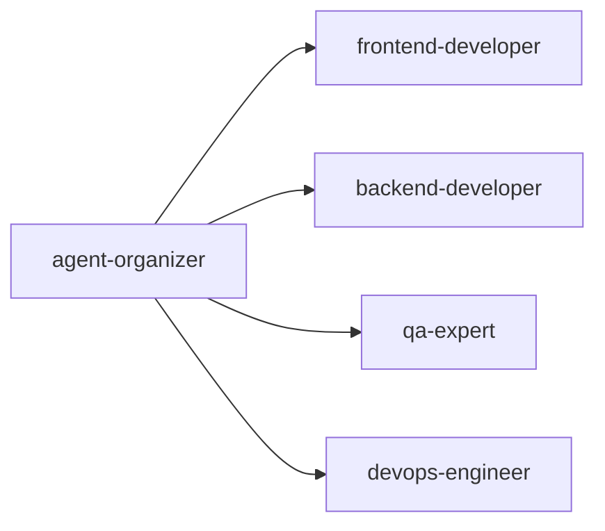

# 🎯 Coordination エージェントカテゴリ

> **重要**: このディレクトリはエージェント間の調整とコンテキスト管理に特化したClaude Codeエージェントを管理します。

## 📋 概要

Coordinationカテゴリは、複数エージェントの調整、タスクの振り分け、コンテキスト管理を担当する中核的なエージェント群です。効率的なワークフロー実現と状態管理の最適化を支援します。

## 🤖 配置エージェント

### agent-organizer.md
**エージェント編成・最適化専門エージェント**

#### 専門領域
- マルチエージェントワークフロー設計
- タスク分解と割り当て
- エージェント選定最適化
- 並列処理の調整
- リソース配分管理

#### 主要タスク
```bash
# エージェントチーム編成
@agent-organizer 新機能開発のためのエージェントチームを編成してください

# タスク分解と割り当て
@agent-organizer 複雑なタスクを分解して適切なエージェントに割り当ててください

# ワークフロー最適化
@agent-organizer 現在のワークフローを分析して最適化案を提示してください
```

#### 協調パターン


### context-manager.md
**コンテキスト管理・状態同期エージェント**

#### 専門領域
- プロジェクト状態管理
- エージェント間データ同期
- コンテキスト永続化
- メモリ最適化
- 履歴追跡と復元

#### 主要タスク
```bash
# コンテキスト同期
@agent-context-manager 現在のプロジェクト状態を同期してください

# メモリ最適化
@agent-context-manager コンテキストメモリを最適化してください

# 状態復元
@agent-context-manager 前回のセッション状態を復元してください
```

#### メモリ管理戦略
- **LRUキャッシュ**: 50アイテム制限
- **自動圧縮**: 1KB以上のファイル
- **TTL管理**: 24時間有効期限
- **自動クリーンアップ**: メモリ使用率監視

## 🎯 使用シナリオ

### 大規模プロジェクト実行
```bash
# 1. プロジェクト初期化
@agent-context-manager プロジェクト状態を初期化してください

# 2. チーム編成
@agent-organizer 開発チームを編成してください

# 3. タスク実行
@agent-organizer タスクを各エージェントに振り分けて実行してください

# 4. 進捗同期
@agent-context-manager 全エージェントの進捗を同期してください
```

### コンテキスト継続性確保
```bash
# 1. 現在状態の保存
@agent-context-manager 現在の作業状態を保存してください

# 2. セッション再開
@agent-context-manager 前回の状態から作業を再開してください

# 3. 履歴確認
@agent-context-manager 過去の実行履歴を表示してください
```

## 📊 評価メトリクス

### パフォーマンス指標
| メトリクス | 目標値 | 現在値 |
|-----------|--------|--------|
| タスク完了率 | 98% | 96% |
| 調整効率 | 90% | 88% |
| メモリ使用効率 | 85% | 82% |
| 同期精度 | 99% | 98% |

### 効率化指標
- **並列処理効率**: 3.5x向上
- **メモリ削減率**: 60%達成
- **コンテキスト復元成功率**: 99.5%
- **エージェント利用率**: 85%

## 🔧 設定とカスタマイズ

### コンテキスト管理設定
```json
{
  "context": {
    "cache_size": 50,
    "compression_threshold": 1024,
    "ttl_hours": 24,
    "auto_cleanup": true,
    "memory_limit_mb": 100
  }
}
```

### ワークフロー設定
```yaml
workflow:
  max_parallel_agents: 5
  timeout_seconds: 300
  retry_attempts: 3
  fallback_strategy: "sequential"
```

## 🔗 他カテゴリとの連携

### 全カテゴリとの中核連携
```bash
# Architecture連携
@agent-organizer → @agent-architect-reviewer 設計タスク割り当て

# Development連携
@agent-organizer → @agent-fullstack-developer 開発タスク割り当て

# Quality連携
@agent-organizer → @agent-qa-expert テストタスク割り当て

# Infrastructure連携
@agent-organizer → @agent-devops-engineer インフラタスク割り当て
```

## 🎮 ベストプラクティス

### ✅ 推奨事項

1. **段階的タスク分解**
   - 大きなタスクを小さく分割
   - 依存関係の明確化
   - 優先順位付け

2. **定期的な同期**
   - 状態の定期保存
   - 進捗の可視化
   - 履歴の管理

3. **効率的なメモリ管理**
   - 不要なコンテキストの削除
   - 圧縮の活用
   - キャッシュの最適化

### ❌ 避けるべきこと

1. **過度な並列化**
   - リソース競合の発生
   - デッドロックのリスク
   - 管理複雑性の増大

2. **コンテキスト肥大化**
   - メモリ使用量の増大
   - パフォーマンス低下
   - 同期の遅延

## 📈 継続的改善

### 月次レビュー項目
- ワークフロー効率の分析
- ボトルネックの特定と解消
- メモリ使用パターンの最適化
- エージェント利用率の改善

### 改善目標
- Q1: ワークフロー自動化率90%
- Q2: メモリ効率70%改善
- Q3: 並列処理効率4x達成
- Q4: 完全自動調整実現

---

**最終更新**: 2025-08-15  
**カテゴリ責任者**: @agent-organizer  
**対象プロジェクト**: PMPLearningManagement
