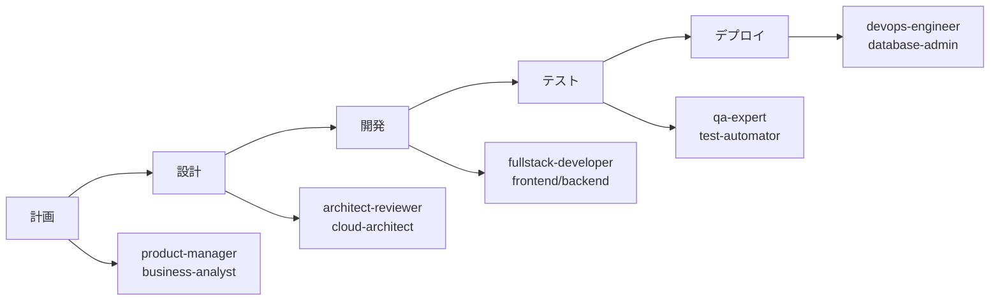
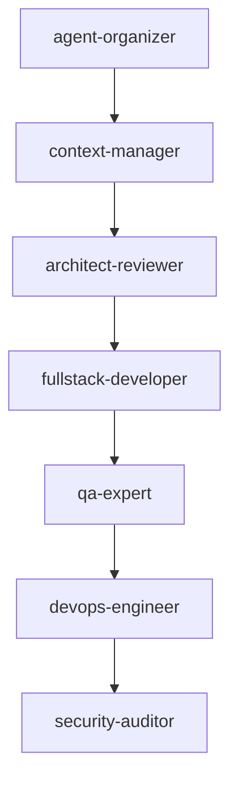

# 🤖 Claude Code エージェントシステム

> **重要**: このディレクトリは Claude Code の専門エージェントシステムです。各エージェントは特定の専門領域を持ち、高品質な支援を提供します。

## 📋 概要

`.claude/agents`ディレクトリは、PMPLearningManagementプロジェクトの開発・運用を支援する専門AIエージェントの定義と設定を管理します。各エージェントは特定の役割と責任を持ち、相互に連携して複雑なタスクを遂行します。

## 🏗️ エージェントカテゴリ構造

```
agents/
├── 🏗️ architecture/        # システム設計・アーキテクチャ
│   ├── architect-reviewer   # 設計レビュー・技術選定
│   ├── cloud-architect      # クラウドインフラ設計
│   └── microservices-architect # マイクロサービス設計
│
├── 🎯 coordination/         # 調整・統合管理
│   ├── agent-organizer      # エージェント編成・最適化
│   └── context-manager      # コンテキスト管理・同期
│
├── 💻 development/          # 開発実装
│   ├── frontend-developer   # フロントエンド開発
│   ├── backend-developer    # バックエンド開発
│   ├── fullstack-developer  # フルスタック開発
│   └── mobile-app-developer # モバイルアプリ開発
│
├── 🔧 infrastructure/       # インフラストラクチャ
│   ├── devops-engineer      # CI/CD・自動化
│   └── database-admin       # データベース管理
│
├── 📊 management/           # プロジェクト管理
│   ├── project-manager      # プロジェクト計画・進捗
│   ├── product-manager      # プロダクト戦略
│   ├── scrum-master         # アジャイル・スクラム
│   └── business-analyst     # ビジネス分析
│
└── 🛡️ quality/             # 品質保証
    ├── qa-expert            # テスト戦略・品質管理
    ├── test-automator       # 自動化テスト
    └── security-auditor     # セキュリティ監査
```

## 🎯 エージェント選択マトリックス

### タスク別推奨エージェント

| タスクカテゴリ       | 主担当エージェント                       | 支援エージェント                   | 優先度 |
| -------------------- | ---------------------------------------- | ---------------------------------- | ------ |
| **新機能開発**       | @fullstack-developer                     | @architect-reviewer, @qa-expert    | 🔴 高  |
| **バグ修正**         | @frontend-developer / @backend-developer | @test-automator                    | 🔴 高  |
| **設計レビュー**     | @architect-reviewer                      | @security-auditor, @database-admin | 🔴 高  |
| **CI/CD構築**        | @devops-engineer                         | @test-automator                    | 🟡 中  |
| **DB最適化**         | @database-admin                          | @backend-developer                 | 🟡 中  |
| **セキュリティ監査** | @security-auditor                        | @devops-engineer                   | 🔴 高  |
| **プロジェクト計画** | @project-manager                         | @scrum-master, @business-analyst   | 🟡 中  |
| **テスト自動化**     | @test-automator                          | @qa-expert                         | 🟡 中  |

### フェーズ別エージェント構成



## 🚀 エージェント呼び出し方法

### 基本的な呼び出し

```bash
# 単一エージェント呼び出し
@agent-frontend-developer Reactコンポーネントを作成してください

# 複数エージェント協調
@agent-organizer フルスタック機能を実装するチームを編成してください

# 専門的なレビュー
@agent-architect-reviewer 現在のアーキテクチャをレビューしてください
```

### 高度な使用方法

```bash
# コンテキスト付き呼び出し
@agent-context-manager 現在の状態を分析して
@agent-fullstack-developer 継続して実装を進めてください

# パイプライン実行
@agent-project-manager タスクを定義して
@agent-architect-reviewer 設計をレビューして
@agent-fullstack-developer 実装してください
@agent-qa-expert テストを実行してください
```

## 📊 エージェント能力マトリックス

### 技術スキル評価

| エージェント        |  Frontend  |  Backend   | Database |   DevOps   | Security | Architecture |
| ------------------- | :--------: | :--------: | :------: | :--------: | :------: | :----------: |
| frontend-developer  | ⭐⭐⭐⭐⭐ |    ⭐⭐    |    ⭐    |    ⭐⭐    |   ⭐⭐   |     ⭐⭐     |
| backend-developer   |    ⭐⭐    | ⭐⭐⭐⭐⭐ | ⭐⭐⭐⭐ |   ⭐⭐⭐   |  ⭐⭐⭐  |    ⭐⭐⭐    |
| fullstack-developer |  ⭐⭐⭐⭐  |  ⭐⭐⭐⭐  |  ⭐⭐⭐  |   ⭐⭐⭐   |  ⭐⭐⭐  |   ⭐⭐⭐⭐   |
| devops-engineer     |    ⭐⭐    |   ⭐⭐⭐   |  ⭐⭐⭐  | ⭐⭐⭐⭐⭐ | ⭐⭐⭐⭐ |    ⭐⭐⭐    |
| architect-reviewer  |   ⭐⭐⭐   |   ⭐⭐⭐   |  ⭐⭐⭐  |   ⭐⭐⭐   | ⭐⭐⭐⭐ |  ⭐⭐⭐⭐⭐  |

### 協調性スコア

| エージェントペア      |   協調性   |   効率性   | 推奨度 |
| --------------------- | :--------: | :--------: | :----: |
| frontend + backend    | ⭐⭐⭐⭐⭐ |  ⭐⭐⭐⭐  | 🔴 高  |
| architect + developer | ⭐⭐⭐⭐⭐ | ⭐⭐⭐⭐⭐ | 🔴 高  |
| qa + developer        |  ⭐⭐⭐⭐  |  ⭐⭐⭐⭐  | 🟡 中  |
| devops + security     | ⭐⭐⭐⭐⭐ |  ⭐⭐⭐⭐  | 🔴 高  |

## 🔧 エージェント設定

### エージェント定義フォーマット

```yaml
# エージェント名.md
---
name: エージェント名
role: 役割
expertise:
  - 専門領域1
  - 専門領域2
capabilities:
  - 能力1
  - 能力2
limitations:
  - 制限事項1
collaboration:
  - 連携可能エージェント
---

## プロンプト
{エージェント固有のプロンプト}

## コンテキスト
{必要なコンテキスト情報}

## 出力フォーマット
{期待される出力形式}
```

### パフォーマンス設定

```javascript
// agent-config.json
{
  "performance": {
    "timeout": 30000,        // タイムアウト（ms）
    "maxRetries": 3,         // 最大リトライ回数
    "cacheResults": true,    // 結果のキャッシュ
    "parallelExecution": true // 並列実行許可
  },
  "quality": {
    "minAccuracy": 0.9,      // 最小精度
    "reviewRequired": false, // レビュー必須
    "testCoverage": 0.8      // テストカバレッジ
  }
}
```

## 📈 メトリクスとモニタリング

### エージェントパフォーマンス指標

```bash
# パフォーマンス確認
npm run agent:metrics

# 出力例:
エージェント別統計:
- frontend-developer:
  - タスク完了率: 96%
  - 平均応答時間: 2.3秒
  - 精度スコア: 94%

- architect-reviewer:
  - レビュー完了率: 98%
  - 問題検出率: 87%
  - 改善提案数: 平均3.2件/レビュー
```

### 継続的改善

```bash
# エージェント最適化
npm run agent:optimize

# トレーニング実行
npm run agent:train -- --agent=frontend-developer

# A/Bテスト
npm run agent:ab-test -- --variant=new-prompt
```

## 🎮 ベストプラクティス

### ✅ 推奨事項

1. **適切なエージェント選択**
   - タスクの性質に最適なエージェントを選ぶ
   - 必要に応じて複数エージェントを協調させる

2. **コンテキスト管理**
   - @context-manager で状態を同期
   - 大規模タスクは段階的に実行

3. **品質保証**
   - 重要タスクは @qa-expert でレビュー
   - セキュリティ関連は @security-auditor で監査

4. **効率化**
   - 定型タスクは自動化
   - 並列実行可能なタスクは同時実行

### ❌ 避けるべきこと

1. **不適切なエージェント使用**
   - 専門外のタスクを強制しない
   - 単純タスクに複雑なエージェントを使わない

2. **過度な依存**
   - 全てをエージェントに任せない
   - 人間のレビューを省略しない

3. **コンテキスト無視**
   - プロジェクト状態を考慮しない実行
   - 前提条件の確認を怠る

## 🔄 エージェント間連携

### 連携パターン



### 連携例

```bash
# 新機能開発の完全フロー
1. @agent-product-manager 要件を定義
2. @agent-architect-reviewer 設計をレビュー
3. @agent-fullstack-developer 実装
4. @agent-test-automator テスト作成
5. @agent-qa-expert 品質確認
6. @agent-devops-engineer デプロイ
7. @agent-security-auditor セキュリティ監査
```

## 🛠️ トラブルシューティング

### よくある問題と解決方法

| 問題                 | 原因             | 解決方法                    |
| -------------------- | ---------------- | --------------------------- |
| エージェント応答なし | タイムアウト     | タイムアウト設定を延長      |
| 不正確な出力         | コンテキスト不足 | @context-manager で状態同期 |
| 協調エラー           | 依存関係の問題   | @agent-organizer で調整     |
| パフォーマンス低下   | リソース不足     | 並列実行を制限              |

## 📚 関連ドキュメント

- [エージェント開発ガイド](./.claude/docs/agent-development.md)
- [プロンプトエンジニアリング](./.claude/prompts/README.md)
- [コンテキスト管理](./.claude/context/README.md)

---

**最終更新**: 2025-08-15  
**バージョン**: 2.0.0  
**メンテナー**: @agent-organizer + @context-manager
