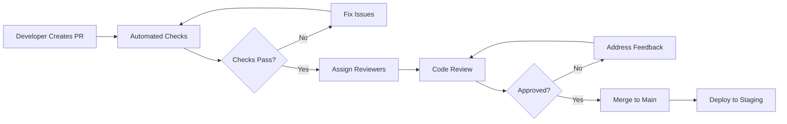
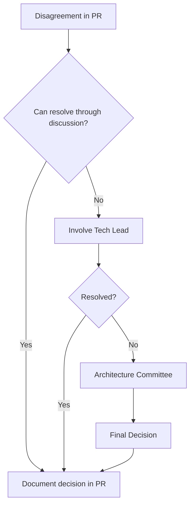

# 🔍 Code Review Process Policy

## Document Information

- **Version**: 1.0.0
- **Last Updated**: 2025-08-15
- **Status**: Active
- **Compliance Level**: 🟡 Important (Mandatory for all code changes)
- **Owner**: DevOps Team
- **Review Cycle**: Quarterly

## 1. Executive Summary

This policy establishes a comprehensive code review process to ensure code quality, knowledge sharing, and continuous improvement across the development team. All code changes must undergo peer review before merging to protected branches.

## 2. Review Philosophy

### Core Principles

- **Constructive**: Focus on improving code, not criticizing developers
- **Educational**: Use reviews as learning opportunities
- **Collaborative**: Foster team collaboration and knowledge sharing
- **Efficient**: Balance thoroughness with development velocity
- **Objective**: Base feedback on established standards and best practices

## 3. Review Process Workflow

### 3.1 Standard Review Flow



### 3.2 Pull Request Creation

#### PR Template

```markdown
## Description

Brief description of changes and why they're needed.

## Type of Change

- [ ] Bug fix (non-breaking change)
- [ ] New feature (non-breaking change)
- [ ] Breaking change (fix or feature that would cause existing functionality to not work as expected)
- [ ] Documentation update
- [ ] Performance improvement
- [ ] Refactoring

## Related Issues

Closes #(issue number)

## Testing

- [ ] Unit tests pass
- [ ] Integration tests pass
- [ ] Manual testing completed
- [ ] Test coverage maintained/improved

## Checklist

- [ ] Code follows project style guidelines
- [ ] Self-review completed
- [ ] Comments added for complex logic
- [ ] Documentation updated
- [ ] No new warnings generated
- [ ] Dependent changes merged

## Screenshots (if applicable)

[Add screenshots for UI changes]

## Performance Impact

[Describe any performance implications]

## Security Considerations

[List any security implications]
```

### 3.3 Reviewer Assignment

#### Automatic Assignment Rules

```yaml
# CODEOWNERS file
# Global owners
* @devops-team

# Frontend
/src/components/ @frontend-team
/src/styles/ @frontend-team @design-team

# Backend
/src/server/ @backend-team
/src/api/ @backend-team @security-team

# Infrastructure
/infrastructure/ @devops-team @sre-team
/.github/workflows/ @devops-team

# Documentation
/docs/ @tech-writers @dev-team
*.md @tech-writers
```

#### Reviewer Selection Criteria

- **Domain expertise**: At least one reviewer familiar with the codebase area
- **Seniority balance**: Mix of senior and junior reviewers for knowledge transfer
- **Availability**: Consider reviewer workload and timezone
- **Rotation**: Ensure review responsibilities are distributed fairly

## 4. Review Standards

### 4.1 Review Scope

#### Must Review

- **Business Logic**: Correctness and edge cases
- **Security**: Vulnerabilities and data protection
- **Performance**: Efficiency and scalability
- **Tests**: Coverage and quality
- **Documentation**: Accuracy and completeness
- **Architecture**: Pattern adherence and design principles

#### Should Review

- **Code Style**: Consistency with standards
- **Naming**: Clarity and conventions
- **Comments**: Helpfulness and accuracy
- **Refactoring**: Opportunities for improvement
- **Dependencies**: Necessity and alternatives

#### May Review

- **Formatting**: Minor style preferences
- **Personal preferences**: Non-standard approaches
- **Future improvements**: Nice-to-have enhancements

### 4.2 Review Checklist

```markdown
## Functionality

- [ ] Code accomplishes the intended goal
- [ ] Edge cases are handled
- [ ] Error handling is appropriate
- [ ] No regression introduced

## Code Quality

- [ ] Follows coding standards
- [ ] DRY principle applied
- [ ] SOLID principles followed
- [ ] No code smells

## Security

- [ ] Input validation implemented
- [ ] No sensitive data exposed
- [ ] Authentication/authorization correct
- [ ] OWASP guidelines followed

## Performance

- [ ] No unnecessary operations
- [ ] Efficient algorithms used
- [ ] Database queries optimized
- [ ] Caching considered

## Testing

- [ ] Adequate test coverage
- [ ] Tests are meaningful
- [ ] Edge cases tested
- [ ] Mocks used appropriately

## Documentation

- [ ] Code is self-documenting
- [ ] Complex logic explained
- [ ] API documentation updated
- [ ] README updated if needed
```

## 5. Review Guidelines

### 5.1 For Reviewers

#### Good Review Comments

````javascript
// ✅ GOOD: Specific, actionable, educational
"Consider using `useMemo` here to prevent unnecessary recalculations on each render.
The current implementation recalculates on every render even when dependencies haven't changed.
Example:
```js
const expensiveValue = useMemo(() => calculateExpensive(data), [data]);
```"

// ✅ GOOD: Suggesting alternatives with reasoning
"This could be simplified using the optional chaining operator:
`user?.address?.city` instead of `user && user.address && user.address.city`.
This improves readability and reduces the chance of errors."

// ✅ GOOD: Pointing out potential issues
"This async operation isn't wrapped in a try-catch. If the API call fails,
it will result in an unhandled promise rejection. Consider adding error handling."
````

#### Poor Review Comments

```javascript
// ❌ BAD: Vague, unhelpful
"This doesn't look right."

// ❌ BAD: Personal preference without justification
"I don't like this approach."

// ❌ BAD: Overly critical or harsh
"This code is terrible. Did you even test this?"

// ❌ BAD: Nitpicking without value
"Add a space here." (Use automated formatters instead)
```

### 5.2 For Authors

#### Responding to Feedback

```markdown
# ✅ GOOD: Acknowledge and explain

"Good catch! I've updated the error handling as suggested.
I chose to use a try-catch with a user-friendly error message."

# ✅ GOOD: Respectful disagreement with reasoning

"I understand your concern, but I chose this approach because [reasoning].
However, I'm open to discussing alternatives if you still have concerns."

# ✅ GOOD: Asking for clarification

"I'm not sure I understand the issue. Could you provide an example
of the problem case you're thinking of?"

# ❌ BAD: Defensive or dismissive

"It works fine on my machine."
"That's not important."
```

## 6. Review Timelines

### 6.1 SLA (Service Level Agreement)

| PR Size                   | Initial Review | Follow-up Review | Final Approval |
| ------------------------- | -------------- | ---------------- | -------------- |
| Small (<100 lines)        | 4 hours        | 2 hours          | 1 hour         |
| Medium (100-500 lines)    | 8 hours        | 4 hours          | 2 hours        |
| Large (500-1000 lines)    | 24 hours       | 8 hours          | 4 hours        |
| Extra Large (>1000 lines) | 48 hours       | 12 hours         | 6 hours        |

### 6.2 Priority Levels

```yaml
P0 - Critical (Production Down):
  initial_review: 30 minutes
  approval: 1 hour
  reviewers: 2 senior engineers

P1 - High (Security/Major Bug):
  initial_review: 2 hours
  approval: 4 hours
  reviewers: 1 senior + 1 any level

P2 - Medium (Feature/Enhancement):
  initial_review: 8 hours
  approval: 24 hours
  reviewers: 2 any level

P3 - Low (Documentation/Refactoring):
  initial_review: 24 hours
  approval: 48 hours
  reviewers: 1 any level
```

## 7. Approval Requirements

### 7.1 Approval Matrix

| Change Type       | Required Approvals       | Blocking Reviews                         | Auto-merge Eligible |
| ----------------- | ------------------------ | ---------------------------------------- | ------------------- |
| Hotfix            | 1 Senior                 | Security team for security changes       | No                  |
| Feature           | 2 Team members           | Architecture team for structural changes | No                  |
| Bug Fix           | 1 Team member            | QA team for test changes                 | Yes                 |
| Documentation     | 1 Any                    | Tech writers for user docs               | Yes                 |
| Dependency Update | 1 Senior + Security scan | Security team                            | No                  |
| Configuration     | 2 Senior                 | DevOps team                              | No                  |

### 7.2 Special Conditions

```yaml
protected_branches:
  main:
    required_reviews: 2
    dismiss_stale_reviews: true
    require_code_owner_reviews: true
    require_up_to_date: true

  develop:
    required_reviews: 1
    dismiss_stale_reviews: false
    require_up_to_date: false

  release/*:
    required_reviews: 2
    require_qa_approval: true
    require_security_scan: true
```

## 8. Automated Checks

### 8.1 Required CI Checks

```yaml
required_checks:
  - name: 'Unit Tests'
    threshold: 'All passing'
    blocking: true

  - name: 'Integration Tests'
    threshold: 'All passing'
    blocking: true

  - name: 'Code Coverage'
    threshold: '≥80%'
    blocking: true

  - name: 'Security Scan'
    threshold: 'No high/critical'
    blocking: true

  - name: 'Linting'
    threshold: 'No errors'
    blocking: true

  - name: 'Type Check'
    threshold: 'No errors'
    blocking: true

  - name: 'Build'
    threshold: 'Successful'
    blocking: true
```

### 8.2 Optional Checks

```yaml
optional_checks:
  - name: 'Performance Test'
    threshold: 'No regression >10%'

  - name: 'Accessibility Scan'
    threshold: 'WCAG 2.1 AA'

  - name: 'Bundle Size'
    threshold: '<500KB increase'

  - name: 'Documentation Build'
    threshold: 'Successful'
```

## 9. Review Metrics

### 9.1 Key Performance Indicators

```javascript
const reviewMetrics = {
  // Efficiency Metrics
  averageTimeToFirstReview: '< 8 hours',
  averageTimeToApproval: '< 24 hours',
  averagePRSize: '< 400 lines',

  // Quality Metrics
  defectEscapeRate: '< 5%',
  postMergeIssues: '< 2%',
  reviewCoverage: '100%',

  // Participation Metrics
  reviewParticipationRate: '> 90%',
  averageReviewersPerPR: '≥ 2',
  reviewLoadBalance: 'Gini < 0.3',

  // Effectiveness Metrics
  commentsAddressed: '> 95%',
  reviewIterations: '< 3',
  approvalOverrides: '< 1%',
}
```

### 9.2 Review Quality Score

```javascript
// Calculate review quality score
const calculateReviewQuality = (review) => {
  const factors = {
    comprehensiveness: review.areasReviewed.length / totalAreas,
    specificity: review.actionableComments / review.totalComments,
    timeliness: Math.max(0, 1 - review.responseTime / sla),
    constructiveness: review.helpfulMarks / review.totalComments,
    coverage: review.linesReviewed / review.totalLines,
  }

  return Object.values(factors).reduce((a, b) => a + b) / 5
}
```

## 10. Conflict Resolution

### 10.1 Escalation Path



### 10.2 Dispute Resolution Process

1. **Discussion Phase** (24 hours)
   - Parties discuss in PR comments
   - Focus on technical merits
   - Document pros/cons

2. **Mediation Phase** (24 hours)
   - Tech lead facilitates discussion
   - Gather additional opinions
   - Seek compromise

3. **Arbitration Phase** (48 hours)
   - Architecture committee reviews
   - Makes binding decision
   - Documents rationale

## 11. Knowledge Sharing

### 11.1 Review Learning Opportunities

```markdown
## Weekly Review Highlights

- Most interesting PR of the week
- Common issues found
- Best review comment
- Learning moments

## Monthly Review Workshop

- Deep dive into complex PRs
- Review best practices
- Tool demonstrations
- Q&A session
```

### 11.2 Mentorship Through Reviews

```yaml
junior_developer_reviews:
  pairing: true
  shadow_reviews: 5
  guided_reviews: 10
  independent_reviews: supervised

mentorship_practices:
  - Pair review sessions
  - Review comment explanations
  - Code walkthrough meetings
  - Review feedback reviews
```

## 12. Tool Configuration

### 12.1 GitHub Settings

```json
{
  "branch_protection": {
    "required_status_checks": {
      "strict": true,
      "contexts": ["continuous-integration", "security-scan"]
    },
    "required_pull_request_reviews": {
      "required_approving_review_count": 2,
      "dismiss_stale_reviews": true,
      "require_code_owner_reviews": true
    },
    "enforce_admins": true,
    "restrictions": null
  }
}
```

### 12.2 Review Tools

```yaml
tools:
  github:
    - Pull Requests
    - Code scanning
    - Security advisories

  integrations:
    - SonarQube: Code quality analysis
    - Codecov: Coverage tracking
    - Snyk: Security scanning
    - DeepSource: Automated review

  browser_extensions:
    - Refined GitHub
    - OctoLinker
    - GitHub Code Review Assistant
```

## 13. Emergency Procedures

### 13.1 Hotfix Process

```bash
# Hotfix review process
1. Create PR with [HOTFIX] prefix
2. Tag with P0 priority
3. Alert on-call reviewer via Slack
4. Single approval from senior engineer
5. Deploy immediately after merge
6. Retrospective within 48 hours
```

### 13.2 Override Authority

```yaml
override_scenarios:
  production_down:
    approver: VP Engineering
    documentation: Required within 24 hours

  security_breach:
    approver: Security Lead
    documentation: Immediate

  data_corruption:
    approver: Data Team Lead
    documentation: Required within 12 hours
```

## 14. Compliance and Audit

### 14.1 Audit Trail

All reviews must maintain:

- Timestamp of all actions
- Reviewer identities
- Comments and responses
- Approval status changes
- Override justifications

### 14.2 Compliance Checks

```bash
# Monthly compliance audit
npm run audit:reviews

# Generates report including:
# - Reviews without approvals
# - Overridden reviews
# - SLA violations
# - Policy exceptions
```

## 15. Continuous Improvement

### 15.1 Feedback Collection

```javascript
// Quarterly review survey
const reviewSurvey = {
  questions: [
    'How satisfied are you with the review process?',
    'Average time spent on reviews per week?',
    'Quality of feedback received?',
    'Areas for improvement?',
  ],
  frequency: 'quarterly',
  anonymous: true,
  actionThreshold: '< 7/10 satisfaction',
}
```

### 15.2 Process Optimization

- Monthly metrics review
- Quarterly process retrospective
- Annual policy revision
- Continuous tool evaluation

## 16. Training Requirements

### 16.1 Onboarding

New team members must complete:

1. Code review best practices training (2 hours)
2. Shadow 5 reviews with senior developer
3. Submit 3 practice reviews for feedback
4. Pass review process quiz (80% minimum)

### 16.2 Ongoing Education

- Quarterly review workshops
- Annual best practices refresh
- Tool update training as needed
- Mentorship program participation

## 17. Version History

| Version | Date       | Changes         | Author      |
| ------- | ---------- | --------------- | ----------- |
| 1.0.0   | 2025-08-15 | Initial version | DevOps Team |

---

**Approval**: DevOps Team Lead  
**Effective Date**: 2025-08-15  
**Next Review**: 2025-11-15
