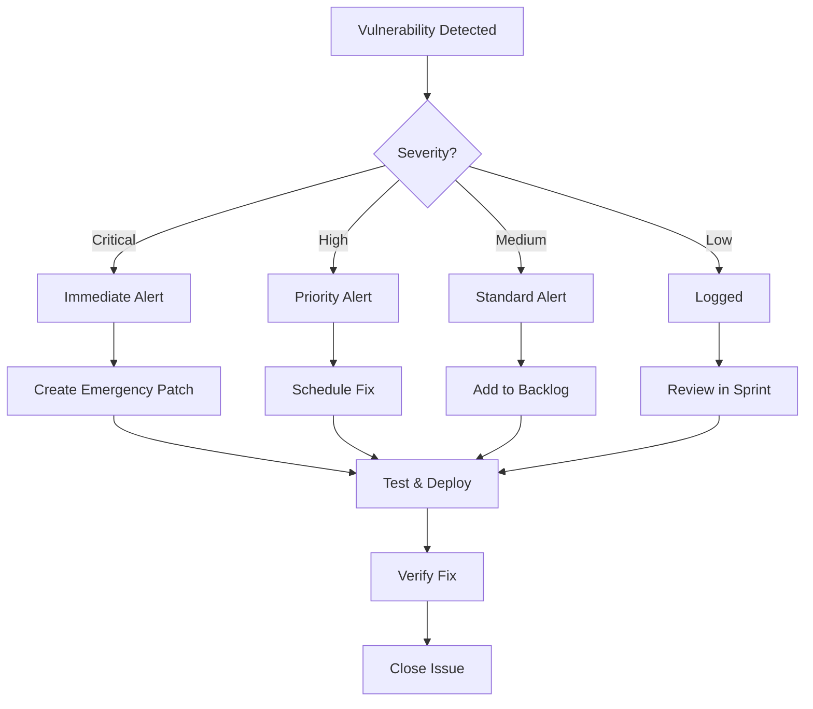

# Security Standards & Compliance Rules

## 📋 Overview

This document defines comprehensive security standards, scanning requirements, compliance rules, and vulnerability management procedures for the PMPLearningManagement project.

## 🎯 Security Objectives

### Primary Goals

- **Zero Critical Vulnerabilities**: In production code
- **Rapid Remediation**: <24h for critical, <7d for high
- **Continuous Monitoring**: Real-time threat detection
- **Compliance**: Meet OWASP, PCI-DSS, GDPR standards
- **Security by Design**: Shift-left security approach

## 🔒 Security Framework

### Security Layers

```yaml
security_layers:
  code_level:
    - Static Application Security Testing (SAST)
    - Software Composition Analysis (SCA)
    - Secret Detection
    - License Compliance

  build_level:
    - Container Security Scanning
    - Infrastructure as Code Scanning
    - Dependency Vulnerability Scanning
    - Binary Analysis

  runtime_level:
    - Dynamic Application Security Testing (DAST)
    - Runtime Application Self-Protection (RASP)
    - Web Application Firewall (WAF)
    - Intrusion Detection System (IDS)

  operational_level:
    - Security Information Event Management (SIEM)
    - Threat Intelligence
    - Incident Response
    - Security Orchestration (SOAR)
```

## 🛡️ Vulnerability Management

### Severity Levels & SLAs

| Severity | CVSS Score | Response Time | Resolution Time | Approval Required |
| -------- | ---------- | ------------- | --------------- | ----------------- |
| Critical | 9.0-10.0   | 1 hour        | 24 hours        | CISO              |
| High     | 7.0-8.9    | 4 hours       | 7 days          | Security Lead     |
| Medium   | 4.0-6.9    | 24 hours      | 30 days         | Team Lead         |
| Low      | 0.1-3.9    | 7 days        | 90 days         | Developer         |
| Info     | 0.0        | 30 days       | Best effort     | None              |

### Vulnerability Response Workflow



## 🔍 Security Scanning

### SAST Configuration

```yaml
# .security/sast-config.yml
sast:
  tools:
    - name: SonarQube
      config:
        quality_gate: STRICT
        rules:
          - category: VULNERABILITY
            severity: BLOCKER
            action: fail_build
          - category: BUG
            severity: CRITICAL
            action: fail_build
          - category: SECURITY_HOTSPOT
            severity: HIGH
            action: warn

    - name: Semgrep
      config:
        rulesets:
          - r/javascript.lang.security
          - r/typescript.lang.security
          - r/react.security
          - r/nodejs.security
        custom_rules: .semgrep/
        severity_threshold: ERROR

    - name: ESLint Security
      config:
        plugins:
          - security
          - no-unsanitized
          - no-secrets
        rules:
          security/detect-object-injection: error
          security/detect-non-literal-regexp: error
          security/detect-unsafe-regex: error
          security/detect-eval-with-expression: error
```

### SCA Configuration

```yaml
# .security/sca-config.yml
sca:
  dependency_check:
    - tool: npm audit
      config:
        level: high
        production: true
        fix: auto

    - tool: Snyk
      config:
        severity_threshold: high
        fail_on: upgradable
        monitor: true
        patches: true

    - tool: WhiteSource
      config:
        policies:
          - action: reject
            licenses: [GPL, AGPL]
          - action: warn
            licenses: [LGPL, MPL]
          - action: approve
            licenses: [MIT, Apache-2.0, BSD]
        vulnerabilities:
          cvss_threshold: 7.0
          age_limit: 365
```

### Container Scanning

```yaml
# .security/container-config.yml
container_scanning:
  tools:
    - name: Trivy
      config:
        severity: HIGH,CRITICAL
        ignore_unfixed: false
        scan_targets:
          - os_packages
          - language_packages
          - secrets
        exit_code: 1

    - name: Clair
      config:
        severity_threshold: High
        whitelist: .clair-whitelist

    - name: Anchore
      config:
        policy_bundle: strict
        fail_on_policy: true
```

## 🔐 Secret Management

### Secret Detection Rules

```yaml
secret_detection:
  patterns:
    - name: AWS Access Key
      pattern: 'AKIA[0-9A-Z]{16}'
      severity: critical

    - name: GitHub Token
      pattern: 'ghp_[0-9a-zA-Z]{36}'
      severity: critical

    - name: Private Key
      pattern: '-----BEGIN (RSA|DSA|EC|PGP) PRIVATE KEY-----'
      severity: critical

    - name: API Key
      pattern: 'api[_-]?key[_-]?[=:]\s*["\']?[0-9a-zA-Z]{32,}'
      severity: high

    - name: Password in URL
      pattern: '://[^:]+:[^@]+@'
      severity: high
```

### Secret Management Implementation

```javascript
// src/security/secretManager.js
class SecretManager {
  constructor() {
    this.vault = process.env.NODE_ENV === 'production' ? new HashiCorpVault() : new LocalVault()
  }

  async getSecret(key) {
    // Audit log access
    await this.auditLog({
      action: 'SECRET_ACCESS',
      key,
      timestamp: new Date().toISOString(),
      user: process.env.USER,
    })

    // Retrieve secret
    const secret = await this.vault.get(key)

    // Return with TTL
    return {
      value: secret,
      ttl: 3600,
      rotateAt: Date.now() + 86400 * 1000,
    }
  }

  async rotateSecret(key) {
    const newSecret = await this.generateSecret()
    await this.vault.update(key, newSecret)

    // Notify dependent services
    await this.notifyRotation(key)

    return newSecret
  }

  validateSecretComplexity(secret) {
    const rules = {
      minLength: 32,
      requireUppercase: true,
      requireLowercase: true,
      requireNumbers: true,
      requireSymbols: true,
      noCommonPatterns: true,
    }

    // Validation logic
    return this.validator.validate(secret, rules)
  }
}
```

## 🛠️ Security Headers

### Required Headers Configuration

```javascript
// src/security/headers.js
module.exports = {
  // Content Security Policy
  'Content-Security-Policy': [
    "default-src 'self'",
    "script-src 'self' 'unsafe-inline' https://trusted-cdn.com",
    "style-src 'self' 'unsafe-inline'",
    "img-src 'self' data: https:",
    "font-src 'self' data:",
    "connect-src 'self' https://api.example.com",
    "frame-ancestors 'none'",
    "base-uri 'self'",
    "form-action 'self'",
    'upgrade-insecure-requests',
  ].join('; '),

  // Strict Transport Security
  'Strict-Transport-Security': 'max-age=31536000; includeSubDomains; preload',

  // Other Security Headers
  'X-Frame-Options': 'DENY',
  'X-Content-Type-Options': 'nosniff',
  'X-XSS-Protection': '1; mode=block',
  'Referrer-Policy': 'strict-origin-when-cross-origin',
  'Permissions-Policy': 'geolocation=(), microphone=(), camera=()',

  // Remove dangerous headers
  'X-Powered-By': null,
  Server: null,
}
```

### Header Validation Script

```javascript
// scripts/validate-security-headers.js
const requiredHeaders = [
  'Content-Security-Policy',
  'Strict-Transport-Security',
  'X-Frame-Options',
  'X-Content-Type-Options',
  'X-XSS-Protection',
  'Referrer-Policy',
]

async function validateHeaders(url) {
  const response = await fetch(url, { method: 'HEAD' })
  const headers = response.headers
  const missing = []
  const invalid = []

  requiredHeaders.forEach((header) => {
    if (!headers.get(header)) {
      missing.push(header)
    }
  })

  // Validate CSP
  const csp = headers.get('Content-Security-Policy')
  if (csp && !csp.includes('default-src')) {
    invalid.push('CSP missing default-src directive')
  }

  // Validate HSTS
  const hsts = headers.get('Strict-Transport-Security')
  if (hsts && !hsts.includes('max-age=')) {
    invalid.push('HSTS missing max-age directive')
  }

  return {
    url,
    missing,
    invalid,
    score: ((requiredHeaders.length - missing.length) / requiredHeaders.length) * 100,
  }
}
```

## 🔑 Authentication & Authorization

### Authentication Requirements

```yaml
authentication:
  password_policy:
    min_length: 12
    max_length: 128
    require_uppercase: true
    require_lowercase: true
    require_numbers: true
    require_symbols: true
    no_common_passwords: true
    no_user_info: true
    history: 5
    max_age_days: 90

  mfa:
    required_for: [admin, privileged_users]
    methods: [totp, sms, email]
    backup_codes: 10

  session:
    timeout_minutes: 30
    absolute_timeout_hours: 8
    concurrent_sessions: 3
    secure_cookie: true
    same_site: strict

  lockout:
    max_attempts: 5
    lockout_duration_minutes: 30
    reset_after_hours: 24
```

### Authorization Implementation

```javascript
// src/security/authorization.js
class AuthorizationService {
  constructor() {
    this.policies = new PolicyEngine()
    this.rbac = new RBACEngine()
  }

  async authorize(user, resource, action) {
    // Check rate limiting
    if (await this.isRateLimited(user)) {
      throw new RateLimitError('Too many requests')
    }

    // Check user permissions
    const hasPermission = await this.rbac.check(user, resource, action)
    if (!hasPermission) {
      this.auditLog({
        event: 'AUTHORIZATION_DENIED',
        user,
        resource,
        action,
      })
      throw new ForbiddenError('Insufficient permissions')
    }

    // Check additional policies
    const policyResult = await this.policies.evaluate(user, resource, action)
    if (!policyResult.allowed) {
      throw new ForbiddenError(policyResult.reason)
    }

    // Audit successful authorization
    this.auditLog({
      event: 'AUTHORIZATION_GRANTED',
      user,
      resource,
      action,
    })

    return true
  }
}
```

## 🚨 Incident Response

### Incident Response Plan

```yaml
incident_response:
  severity_levels:
    P1_Critical:
      description: Complete service outage or data breach
      response_time: 15 minutes
      escalation: [oncall, security_lead, ciso, ceo]

    P2_High:
      description: Partial outage or security vulnerability
      response_time: 1 hour
      escalation: [oncall, security_lead]

    P3_Medium:
      description: Degraded performance or minor security issue
      response_time: 4 hours
      escalation: [oncall]

    P4_Low:
      description: Minor issue with workaround
      response_time: 24 hours
      escalation: [team]

  response_phases:
    1_detection:
      - Automated alerts
      - Manual reports
      - Threat intelligence

    2_containment:
      - Isolate affected systems
      - Preserve evidence
      - Limit damage spread

    3_eradication:
      - Remove threat
      - Patch vulnerabilities
      - Update defenses

    4_recovery:
      - Restore services
      - Verify integrity
      - Monitor for recurrence

    5_lessons_learned:
      - Post-mortem analysis
      - Update procedures
      - Training updates
```

### Incident Response Automation

```javascript
// scripts/incident-response.js
class IncidentResponseSystem {
  async detectIncident(event) {
    const severity = this.assessSeverity(event)

    if (severity <= 2) {
      await this.triggerEmergencyResponse(event, severity)
    }

    const incident = await this.createIncident({
      event,
      severity,
      timestamp: new Date().toISOString(),
      status: 'OPEN',
    })

    await this.notifyTeam(incident)
    await this.startContainment(incident)

    return incident
  }

  async triggerEmergencyResponse(event, severity) {
    // Immediate actions for critical incidents
    const actions = [
      this.isolateAffectedSystems(),
      this.enableEmergencyWAF(),
      this.blockSuspiciousIPs(),
      this.rotateCompromisedCredentials(),
      this.notifyExecutives(),
    ]

    await Promise.all(actions)
  }

  async startContainment(incident) {
    const containmentPlan = this.getContainmentPlan(incident.type)

    for (const step of containmentPlan) {
      await this.executeStep(step)
      await this.logProgress(incident.id, step)
    }
  }
}
```

## 📊 Security Metrics

### Key Security Indicators

```yaml
security_kpis:
  vulnerability_metrics:
    - mean_time_to_detect: <1 hour
    - mean_time_to_remediate: <24 hours
    - vulnerability_density: <5 per KLOC
    - patch_compliance: >95

  incident_metrics:
    - incidents_per_month: <5
    - mean_time_to_respond: <15 minutes
    - mean_time_to_resolve: <4 hours
    - repeat_incidents: <10%

  compliance_metrics:
    - security_training_completion: 100%
    - policy_compliance: >95
    - audit_findings: <5 per quarter
    - penetration_test_score: >80

  operational_metrics:
    - security_scan_coverage: 100%
    - false_positive_rate: <10%
    - security_automation: >80
    - security_debt: <10%
```

### Security Dashboard

```javascript
// scripts/security-dashboard.js
class SecurityDashboard {
  async generateReport() {
    const metrics = {
      vulnerabilities: await this.getVulnerabilityMetrics(),
      incidents: await this.getIncidentMetrics(),
      compliance: await this.getComplianceMetrics(),
      trends: await this.getTrendAnalysis(),
    }

    const report = {
      timestamp: new Date().toISOString(),
      summary: {
        overallScore: this.calculateSecurityScore(metrics),
        criticalIssues: metrics.vulnerabilities.critical,
        openIncidents: metrics.incidents.open,
        complianceRate: metrics.compliance.rate,
      },
      details: metrics,
      recommendations: this.generateRecommendations(metrics),
    }

    return report
  }

  calculateSecurityScore(metrics) {
    const weights = {
      vulnerabilities: 0.4,
      incidents: 0.3,
      compliance: 0.3,
    }

    let score = 100

    // Deduct for vulnerabilities
    score -= metrics.vulnerabilities.critical * 10
    score -= metrics.vulnerabilities.high * 5
    score -= metrics.vulnerabilities.medium * 2

    // Deduct for incidents
    score -= metrics.incidents.open * 5

    // Apply compliance rate
    score *= metrics.compliance.rate / 100

    return Math.max(0, Math.min(100, score))
  }
}
```

## 🔄 Security Automation

### Security Pipeline Integration

```yaml
# .github/workflows/security.yml
name: 🔒 Security Pipeline

on:
  push:
    branches: [main, develop]
  pull_request:
    branches: [main]
  schedule:
    - cron: '0 2 * * *' # Daily security scan

jobs:
  security-scan:
    name: 🔍 Security Analysis
    runs-on: ubuntu-latest

    steps:
      - name: 🔍 SAST Scan
        run: |
          semgrep --config=auto --json --output=sast-report.json

      - name: 🔍 Dependency Scan
        run: |
          npm audit --json > npm-audit.json
          snyk test --json > snyk-report.json

      - name: 🔍 Secret Scan
        run: |
          gitleaks detect --source=. --report-format=json --report-path=secrets-report.json

      - name: 🔍 Container Scan
        run: |
          trivy image --format json --output trivy-report.json myapp:latest

      - name: 📊 Generate Security Report
        run: |
          node scripts/consolidate-security-reports.js

      - name: 🚨 Check Security Gates
        run: |
          node scripts/security-gate-check.js

      - name: 📤 Upload Reports
        uses: actions/upload-artifact@v3
        with:
          name: security-reports
          path: |
            *-report.json
            security-summary.html
```

## 🎯 Compliance Requirements

### Compliance Standards

```yaml
compliance:
  standards:
    - name: OWASP Top 10
      version: 2021
      requirements:
        - A01: Broken Access Control
        - A02: Cryptographic Failures
        - A03: Injection
        - A04: Insecure Design
        - A05: Security Misconfiguration
        - A06: Vulnerable Components
        - A07: Authentication Failures
        - A08: Software and Data Integrity
        - A09: Logging Failures
        - A10: SSRF

    - name: PCI-DSS
      version: 4.0
      applicable: payment_processing

    - name: GDPR
      applicable: user_data_processing

    - name: SOC 2
      type: Type II
      applicable: cloud_services
```

## 📋 Security Checklist

### Development Security Checklist

- [ ] Input validation implemented
- [ ] Output encoding applied
- [ ] Authentication checks in place
- [ ] Authorization verified
- [ ] Sensitive data encrypted
- [ ] Security headers configured
- [ ] Error handling sanitized
- [ ] Logging implemented (no PII)
- [ ] Dependencies updated
- [ ] Security tests written

### Deployment Security Checklist

- [ ] Security scans passed
- [ ] Secrets removed from code
- [ ] SSL/TLS configured
- [ ] Firewall rules applied
- [ ] Access controls verified
- [ ] Monitoring enabled
- [ ] Backup configured
- [ ] Incident response tested
- [ ] Security documentation updated
- [ ] Team training completed

---

Created: 2025-08-15
Last Updated: 2025-08-15
Status: Active
Owner: Security Team
