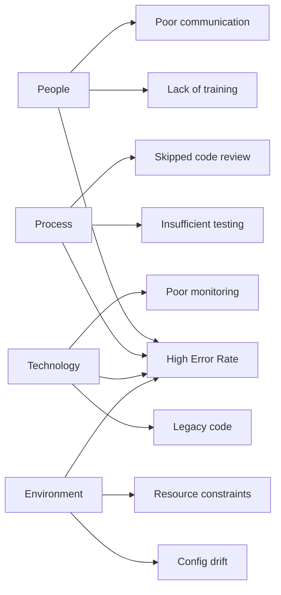

# Incident Analysis Prompts - Root Cause Analysis & Postmortem Guide

## 🚨 Quick Incident Response

```
Respond to an active incident in PMPLearningManagement:

**Incident Details:**
- Severity: {P0/P1/P2/P3}
- Start Time: {timestamp}
- Affected Services: {list}
- User Impact: {percentage and description}
- Current Status: {investigating/identified/monitoring/resolved}

**Initial Assessment:**
1. What is broken? {specific functionality}
2. Who is affected? {user segments}
3. When did it start? {exact time}
4. What changed recently? {deployments/configs}
5. Is there a workaround? {yes/no - details}

**Required Actions:**
1. Incident commander assignment
2. Communication channel setup
3. Status page update
4. Stakeholder notification
5. War room creation

**Success Criteria:**
- MTTD (Mean Time To Detect) < 5 minutes
- MTTA (Mean Time To Acknowledge) < 10 minutes
- MTTR (Mean Time To Resolve) < 30 minutes
- Customer communication < 15 minutes
- Post-incident review within 48 hours
```

## 📊 Root Cause Analysis (RCA)

````
Conduct systematic root cause analysis:

**5 Whys Analysis Framework:**
```yaml
problem: "Application experiencing 50% error rate"

why_1:
  question: "Why is the application returning errors?"
  answer: "Database connections are timing out"
  evidence: "Connection pool exhausted, timeout errors in logs"

why_2:
  question: "Why are database connections timing out?"
  answer: "Database CPU is at 100%"
  evidence: "CloudWatch metrics show CPU saturation"

why_3:
  question: "Why is the database CPU at 100%?"
  answer: "Inefficient query introduced in recent deployment"
  evidence: "Slow query log shows new query taking 30s"

why_4:
  question: "Why was an inefficient query deployed?"
  answer: "Query performance wasn't tested with production data volume"
  evidence: "Query worked fine with test data (100 rows vs 1M rows)"

why_5:
  question: "Why wasn't it tested with production-like data?"
  answer: "Staging environment doesn't have production-scale data"
  evidence: "Staging DB has only 1% of production data"

root_cause: "Lack of production-like testing environment"

corrective_actions:
  immediate:
    - "Add index to optimize query"
    - "Implement query timeout"

  preventive:
    - "Create production-like staging environment"
    - "Implement query performance testing in CI/CD"
    - "Add database query analyzer to code review"
````

**Fishbone Diagram Analysis:**



**Timeline Reconstruction:**

```javascript
class IncidentTimeline {
  constructor() {
    this.events = []
  }

  addEvent(timestamp, event, source, impact) {
    this.events.push({
      timestamp: new Date(timestamp),
      event,
      source,
      impact,
      duration: null,
    })
  }

  analyze() {
    // Sort events chronologically
    this.events.sort((a, b) => a.timestamp - b.timestamp)

    // Calculate durations
    for (let i = 0; i < this.events.length - 1; i++) {
      this.events[i].duration = this.events[i + 1].timestamp - this.events[i].timestamp
    }

    // Identify critical path
    const criticalPath = this.events.filter((e) => e.impact === 'critical')

    // Find trigger event
    const trigger = this.events[0]

    // Calculate total impact time
    const impactDuration = this.events[this.events.length - 1].timestamp - trigger.timestamp

    return {
      trigger,
      criticalPath,
      totalDuration: impactDuration,
      timeline: this.events,
    }
  }
}

// Example usage
const timeline = new IncidentTimeline()
timeline.addEvent('2024-01-15T10:00:00Z', 'Deployment started', 'CI/CD', 'none')
timeline.addEvent('2024-01-15T10:05:00Z', 'New code live', 'Kubernetes', 'none')
timeline.addEvent('2024-01-15T10:07:00Z', 'Error rate spike', 'Monitoring', 'critical')
timeline.addEvent('2024-01-15T10:10:00Z', 'Alert triggered', 'PagerDuty', 'none')
timeline.addEvent('2024-01-15T10:15:00Z', 'Rollback initiated', 'Manual', 'none')
timeline.addEvent('2024-01-15T10:20:00Z', 'Service recovered', 'Monitoring', 'none')
```

```

## 📝 Postmortem Template

```

Create comprehensive postmortem documentation:

# Incident Postmortem: {INCIDENT_ID}

## Executive Summary

**Date**: {date}
**Duration**: {duration}
**Severity**: {P0/P1/P2/P3}
**Impact**: {user impact description}
**Root Cause**: {one-line summary}

## Impact Analysis

```yaml
affected_users:
  total: 10000
  percentage: 25%
  geography: 'US East, EU West'

business_impact:
  revenue_loss: '$50,000'
  transactions_failed: 500
  sla_breach: true
  reputation_impact: 'moderate'

technical_impact:
  services_affected: ['API', 'Database', 'Cache']
  data_loss: false
  security_breach: false
```

## Timeline

| Time (UTC) | Event                 | Actor       | Impact |
| ---------- | --------------------- | ----------- | ------ |
| 10:00      | Deployment initiated  | CI/CD       | None   |
| 10:05      | Memory leak started   | Application | Low    |
| 10:30      | Memory exhaustion     | System      | High   |
| 10:32      | Alerts fired          | Monitoring  | -      |
| 10:35      | Incident declared     | On-call     | -      |
| 10:45      | Root cause identified | Team        | -      |
| 10:50      | Fix deployed          | Team        | -      |
| 11:00      | Incident resolved     | -           | None   |

## Root Cause Analysis

### What Happened

{Detailed description of the incident}

### Why It Happened

{Root cause explanation}

### Contributing Factors

1. {Factor 1}
2. {Factor 2}
3. {Factor 3}

## Response Analysis

### What Went Well

- ✅ Alert fired within 2 minutes
- ✅ Team responded quickly
- ✅ Rollback procedure worked

### What Went Poorly

- ❌ Initial diagnosis was incorrect
- ❌ Communication to customers was delayed
- ❌ Staging environment didn't catch the issue

### Where We Got Lucky

- 🍀 Happened during low traffic period
- 🍀 No data corruption occurred

## Action Items

### Immediate (P0)

- [ ] Fix memory leak in component X - @owner - Due: Today
- [ ] Add memory monitoring alerts - @owner - Due: Tomorrow

### Short-term (P1)

- [ ] Implement circuit breaker - @owner - Due: 1 week
- [ ] Add load testing to CI/CD - @owner - Due: 2 weeks

### Long-term (P2)

- [ ] Redesign caching strategy - @owner - Due: Q2
- [ ] Implement chaos engineering - @owner - Due: Q3

## Lessons Learned

### Technical

1. Memory profiling should be part of PR reviews
2. Need better observability into memory usage
3. Circuit breakers prevent cascade failures

### Process

1. Incident response runbook needs updating
2. Customer communication should be faster
3. Need better staging environment parity

### People

1. Team needs training on memory profiling tools
2. On-call rotation needs backup coverage
3. Post-incident reviews should be blameless

## Metrics

```javascript
{
  "detection_time": "2 minutes",
  "acknowledgment_time": "5 minutes",
  "resolution_time": "55 minutes",
  "total_downtime": "30 minutes",
  "affected_users": 10000,
  "error_rate_peak": "75%",
  "alerts_fired": 15,
  "people_involved": 5,
  "customer_tickets": 50
}
```

## Supporting Documents

- [Monitoring Dashboard](link)
- [Logs Archive](link)
- [Customer Communications](link)
- [Code Changes](link)

```

## 🔍 Incident Pattern Analysis

```

Analyze incident patterns for prevention:

**Pattern Detection Query:**

```sql
-- Incident pattern analysis
WITH incident_patterns AS (
  SELECT
    service,
    error_type,
    COUNT(*) as frequency,
    AVG(duration_minutes) as avg_duration,
    MAX(severity) as max_severity,
    ARRAY_AGG(DISTINCT root_cause) as root_causes,
    ARRAY_AGG(DISTINCT triggering_event) as triggers
  FROM incidents
  WHERE created_at > NOW() - INTERVAL '90 days'
  GROUP BY service, error_type
  HAVING COUNT(*) > 2
)
SELECT
  *,
  CASE
    WHEN frequency > 5 AND max_severity <= 2 THEN 'Critical Pattern'
    WHEN frequency > 3 THEN 'Concerning Pattern'
    ELSE 'Watch Pattern'
  END as pattern_priority
FROM incident_patterns
ORDER BY frequency DESC, max_severity ASC;
```

**Correlation Analysis:**

```python
import pandas as pd
import numpy as np
from scipy.stats import chi2_contingency

class IncidentCorrelation:
    def analyze_correlations(self, incidents_df):
        # Time-based patterns
        incidents_df['hour'] = pd.to_datetime(incidents_df['timestamp']).dt.hour
        incidents_df['day_of_week'] = pd.to_datetime(incidents_df['timestamp']).dt.dayofweek

        # Deployment correlation
        deployment_correlation = self.correlate_with_deployments(incidents_df)

        # Service dependency analysis
        service_correlation = incidents_df.groupby(['primary_service', 'affected_services']).size()

        # Error type clustering
        error_clusters = self.cluster_errors(incidents_df)

        return {
            'time_patterns': self.find_time_patterns(incidents_df),
            'deployment_correlation': deployment_correlation,
            'service_dependencies': service_correlation,
            'error_clusters': error_clusters,
            'prediction_model': self.build_prediction_model(incidents_df)
        }

    def find_time_patterns(self, df):
        # Chi-square test for independence
        contingency_table = pd.crosstab(df['hour'], df['severity'])
        chi2, p_value, dof, expected = chi2_contingency(contingency_table)

        return {
            'peak_hours': df.groupby('hour')['incident_id'].count().nlargest(3).index.tolist(),
            'high_severity_times': df[df['severity'] == 'P0'].groupby('hour').size(),
            'statistical_significance': p_value < 0.05
        }
```

**Incident Prediction:**

```javascript
// ML-based incident prediction
class IncidentPredictor {
  async predictIncidentRisk() {
    const features = await this.collectFeatures()

    // Feature vector
    const vector = {
      deployment_frequency: features.deployments_24h,
      error_rate_trend: features.error_rate_delta,
      resource_utilization: features.avg_cpu,
      traffic_anomaly: features.traffic_deviation,
      recent_incidents: features.incidents_7d,
      config_changes: features.config_changes_24h,
    }

    // Simple risk scoring (replace with ML model)
    const riskScore = this.calculateRiskScore(vector)

    if (riskScore > 0.7) {
      return {
        risk: 'HIGH',
        score: riskScore,
        factors: this.identifyRiskFactors(vector),
        recommendations: this.getPreventiveActions(vector),
      }
    }

    return { risk: 'LOW', score: riskScore }
  }

  calculateRiskScore(vector) {
    const weights = {
      deployment_frequency: 0.2,
      error_rate_trend: 0.3,
      resource_utilization: 0.2,
      traffic_anomaly: 0.1,
      recent_incidents: 0.15,
      config_changes: 0.05,
    }

    let score = 0
    for (const [key, value] of Object.entries(vector)) {
      score += (value / 100) * weights[key]
    }

    return Math.min(score, 1)
  }
}
```

```

## 📈 Incident Metrics & KPIs

```

Track and improve incident management metrics:

**DORA Metrics for Incidents:**

```sql
-- Mean Time To Restore (MTTR)
SELECT
  DATE_TRUNC('month', created_at) as month,
  severity,
  AVG(EXTRACT(EPOCH FROM (resolved_at - created_at))/60) as mttr_minutes,
  PERCENTILE_CONT(0.5) WITHIN GROUP (ORDER BY EXTRACT(EPOCH FROM (resolved_at - created_at))/60) as median_mttr,
  PERCENTILE_CONT(0.95) WITHIN GROUP (ORDER BY EXTRACT(EPOCH FROM (resolved_at - created_at))/60) as p95_mttr
FROM incidents
WHERE resolved_at IS NOT NULL
GROUP BY month, severity
ORDER BY month DESC, severity;

-- Change Failure Rate
SELECT
  DATE_TRUNC('week', d.deployed_at) as week,
  COUNT(DISTINCT d.deployment_id) as total_deployments,
  COUNT(DISTINCT i.deployment_id) as failed_deployments,
  (COUNT(DISTINCT i.deployment_id)::float / COUNT(DISTINCT d.deployment_id)::float * 100) as change_failure_rate
FROM deployments d
LEFT JOIN incidents i ON d.deployment_id = i.caused_by_deployment
  AND i.created_at BETWEEN d.deployed_at AND d.deployed_at + INTERVAL '24 hours'
GROUP BY week
ORDER BY week DESC;
```

**Incident Management Dashboard:**

```javascript
class IncidentDashboard {
  async getMetrics(timeRange = '30d') {
    return {
      summary: {
        total_incidents: await this.getTotalIncidents(timeRange),
        mttr: await this.getMTTR(timeRange),
        mttd: await this.getMTTD(timeRange),
        mtta: await this.getMTTA(timeRange),
        availability: await this.getAvailability(timeRange),
      },

      trends: {
        incident_frequency: await this.getIncidentTrend(timeRange),
        severity_distribution: await this.getSeverityDistribution(timeRange),
        service_impact: await this.getServiceImpact(timeRange),
        root_cause_distribution: await this.getRootCauseDistribution(timeRange),
      },

      team_performance: {
        response_time_by_person: await this.getResponseTimeByPerson(timeRange),
        incidents_per_on_call: await this.getIncidentsPerOnCall(timeRange),
        escalation_rate: await this.getEscalationRate(timeRange),
      },

      financial_impact: {
        estimated_revenue_loss: await this.getRevenueLoss(timeRange),
        sla_penalties: await this.getSLAPenalties(timeRange),
        overtime_costs: await this.getOvertimeCosts(timeRange),
      },
    }
  }

  async getAvailability(timeRange) {
    const totalMinutes = this.parseTimeRange(timeRange) * 60
    const downtime = await db.query(
      `
      SELECT SUM(EXTRACT(EPOCH FROM (resolved_at - created_at))/60) as downtime_minutes
      FROM incidents
      WHERE severity IN ('P0', 'P1')
        AND created_at > NOW() - INTERVAL ?
    `,
      [timeRange]
    )

    const availability = ((totalMinutes - downtime[0].downtime_minutes) / totalMinutes) * 100
    return {
      percentage: availability,
      nines: this.calculateNines(availability),
      downtime_minutes: downtime[0].downtime_minutes,
    }
  }

  calculateNines(availability) {
    if (availability >= 99.999) return 'Five 9s'
    if (availability >= 99.99) return 'Four 9s'
    if (availability >= 99.9) return 'Three 9s'
    if (availability >= 99) return 'Two 9s'
    return 'Below SLA'
  }
}
```

```

## 🎓 Learning & Improvement

```

Extract learnings and drive improvements:

**Learning Extraction Framework:**

```javascript
class IncidentLearning {
  async extractLearnings(incidentId) {
    const incident = await this.getIncident(incidentId)

    return {
      technical_learnings: await this.extractTechnicalLearnings(incident),
      process_improvements: await this.identifyProcessImprovements(incident),
      training_needs: await this.identifyTrainingNeeds(incident),
      tool_gaps: await this.identifyToolGaps(incident),
      documentation_updates: await this.identifyDocumentationNeeds(incident),
    }
  }

  async extractTechnicalLearnings(incident) {
    const learnings = []

    // Code issues
    if (incident.root_cause.includes('code')) {
      learnings.push({
        category: 'code_quality',
        learning: 'Implement better code review practices',
        action: 'Add automated code analysis tools',
        owner: 'engineering_lead',
        priority: 'high',
      })
    }

    // Infrastructure issues
    if (incident.root_cause.includes('infrastructure')) {
      learnings.push({
        category: 'infrastructure',
        learning: 'Improve infrastructure monitoring',
        action: 'Deploy additional monitoring agents',
        owner: 'devops_lead',
        priority: 'high',
      })
    }

    // Dependency issues
    if (incident.root_cause.includes('dependency')) {
      learnings.push({
        category: 'dependencies',
        learning: 'Better dependency management needed',
        action: 'Implement dependency vulnerability scanning',
        owner: 'security_lead',
        priority: 'medium',
      })
    }

    return learnings
  }

  async createActionPlan(learnings) {
    const actionPlan = {
      immediate: [],
      short_term: [],
      long_term: [],
    }

    for (const learning of learnings) {
      const action = {
        description: learning.action,
        owner: learning.owner,
        due_date: this.calculateDueDate(learning.priority),
        success_criteria: this.defineSuccessCriteria(learning),
        verification_method: this.defineVerification(learning),
      }

      if (learning.priority === 'critical') {
        actionPlan.immediate.push(action)
      } else if (learning.priority === 'high') {
        actionPlan.short_term.push(action)
      } else {
        actionPlan.long_term.push(action)
      }
    }

    return actionPlan
  }
}
```

**Knowledge Base Update:**

````markdown
## Incident Knowledge Base Entry

### Problem

{Description of the problem}

### Symptoms

- {Symptom 1}
- {Symptom 2}
- {Symptom 3}

### Root Cause

{Detailed root cause}

### Detection

```bash
# Commands to detect this issue
curl -X GET https://api.example.com/health
kubectl get pods -n production | grep CrashLoopBackOff
```
````

### Mitigation

```bash
# Immediate mitigation steps
kubectl scale deployment api --replicas=10
kubectl rollout undo deployment api
```

### Resolution

```bash
# Permanent fix
git checkout -b hotfix/memory-leak
# Apply code changes
git commit -m "Fix memory leak in cache manager"
git push origin hotfix/memory-leak
# Create and merge PR
```

### Prevention

1. Add memory profiling to CI/CD
2. Implement memory limits in Kubernetes
3. Add memory usage alerts
4. Regular load testing with memory monitoring

### Related Incidents

- INC-001: Similar memory issue
- INC-045: Related caching problem

### Tags

#memory #performance #cache #production-incident

```

```

## 🔄 Continuous Improvement Process

````
Implement continuous improvement from incidents:

**Improvement Tracking:**
```sql
-- Track improvement implementation
CREATE TABLE incident_improvements (
  id SERIAL PRIMARY KEY,
  incident_id VARCHAR(50) REFERENCES incidents(id),
  improvement_type VARCHAR(50),
  description TEXT,
  status VARCHAR(20),
  owner VARCHAR(100),
  due_date DATE,
  completed_date DATE,
  impact_measurement TEXT,
  verification_status VARCHAR(20)
);

-- Improvement effectiveness query
SELECT
  improvement_type,
  COUNT(*) as total_improvements,
  SUM(CASE WHEN status = 'completed' THEN 1 ELSE 0 END) as completed,
  AVG(EXTRACT(EPOCH FROM (completed_date - due_date))/86400) as avg_delay_days,
  COUNT(DISTINCT incident_id) as incidents_addressed
FROM incident_improvements
WHERE created_at > NOW() - INTERVAL '90 days'
GROUP BY improvement_type
ORDER BY total_improvements DESC;
````

**Blameless Culture Reinforcement:**

```javascript
class BlamelessPostmortem {
  constructor() {
    this.guidelines = {
      language: {
        avoid: ['fault', 'blame', 'should have', 'failed to'],
        use: ['opportunity', 'learning', 'improvement', 'discovered'],
      },
      focus: {
        not_on: 'who made the mistake',
        but_on: 'what allowed the mistake to happen',
      },
      questions: [
        'What surprised us?',
        'What went well?',
        'Where did we get lucky?',
        'What can we do differently?',
        'How can we detect this earlier?',
      ],
    }
  }

  reviewPostmortem(document) {
    const issues = []

    // Check for blame language
    for (const word of this.guidelines.language.avoid) {
      if (document.toLowerCase().includes(word)) {
        issues.push(`Found blame language: "${word}"`)
      }
    }

    // Ensure learning focus
    const hasLearnings =
      document.includes('Lessons Learned') || document.includes('What We Learned')
    if (!hasLearnings) {
      issues.push('Missing lessons learned section')
    }

    // Check for action items
    const hasActions = document.includes('Action Items') || document.includes('Follow-up Actions')
    if (!hasActions) {
      issues.push('Missing action items')
    }

    return {
      isBlameless: issues.length === 0,
      issues,
      score: ((10 - issues.length) / 10) * 100,
    }
  }
}
```

**Incident Review Meeting Template:**

```markdown
## Incident Review Meeting Agenda

### Meeting Details

- **Date**: {date}
- **Duration**: 60 minutes
- **Attendees**: {list}
- **Facilitator**: {name}

### Agenda (60 minutes)

#### 1. Incident Summary (10 min)

- Timeline review
- Impact assessment
- Resolution summary

#### 2. Root Cause Discussion (15 min)

- 5 Whys analysis
- Contributing factors
- System vulnerabilities

#### 3. Response Evaluation (10 min)

- What went well
- What could improve
- Communication effectiveness

#### 4. Learning Extraction (15 min)

- Technical learnings
- Process improvements
- Tool enhancements

#### 5. Action Planning (10 min)

- Priority assignment
- Owner assignment
- Timeline definition

### Ground Rules

- No blame or finger-pointing
- Focus on systems, not individuals
- Everyone's perspective is valuable
- Questions are encouraged
- Assume positive intent

### Output

- Updated postmortem document
- Action items with owners
- Knowledge base updates
- Process improvements
```

```

## 🎯 Incident Prevention Strategies

```

Implement proactive incident prevention:

**Chaos Engineering:**

```javascript
// Chaos engineering experiments
class ChaosExperiments {
  async runExperiment(experiment) {
    const baseline = await this.measureBaseline()

    // Inject failure
    await this.injectFailure(experiment.type, experiment.target)

    // Measure impact
    const impact = await this.measureImpact()

    // Auto-remediate if necessary
    if (impact.severity > experiment.threshold) {
      await this.remediate()
    }

    // Clean up
    await this.cleanup()

    return {
      experiment: experiment.name,
      hypothesis: experiment.hypothesis,
      results: {
        baseline,
        impact,
        validated: this.validateHypothesis(experiment.hypothesis, impact),
      },
      learnings: this.extractLearnings(baseline, impact),
    }
  }

  async injectFailure(type, target) {
    switch (type) {
      case 'network_latency':
        return this.injectNetworkLatency(target, 1000) // 1s latency
      case 'service_failure':
        return this.killService(target)
      case 'resource_exhaustion':
        return this.exhaustResources(target, 'cpu', 90)
      case 'data_corruption':
        return this.corruptData(target)
      default:
        throw new Error(`Unknown experiment type: ${type}`)
    }
  }
}
```

**Game Days:**

```yaml
game_day_scenarios:
  - name: 'Database Failure'
    description: 'Primary database becomes unavailable'
    steps:
      - announce_start
      - kill_primary_database
      - monitor_failover
      - verify_data_consistency
      - test_application_functionality
      - restore_primary
      - verify_recovery
    success_criteria:
      - failover_time: '< 60 seconds'
      - data_loss: 'zero'
      - user_impact: '< 5% error rate'

  - name: 'Region Failure'
    description: 'Complete AWS region failure'
    steps:
      - simulate_region_failure
      - verify_traffic_rerouting
      - check_data_replication
      - test_critical_paths
      - measure_performance_impact
    success_criteria:
      - recovery_time: '< 5 minutes'
      - data_consistency: 'maintained'
      - user_experience: 'degraded but functional'
```

**Preventive Automation:**

```javascript
// Automated prevention systems
class IncidentPrevention {
  async monitorAndPrevent() {
    const signals = await this.collectSignals()

    // Pattern matching
    const patterns = this.detectPatterns(signals)

    for (const pattern of patterns) {
      if (pattern.risk > 0.8) {
        await this.takePreventiveAction(pattern)
      }
    }
  }

  async takePreventiveAction(pattern) {
    switch (pattern.type) {
      case 'memory_growth':
        await this.restartService(pattern.service)
        break
      case 'connection_pool_exhaustion':
        await this.increaseConnectionPool(pattern.service)
        break
      case 'disk_space_low':
        await this.cleanupDiskSpace(pattern.server)
        break
      case 'error_rate_increase':
        await this.enableCircuitBreaker(pattern.endpoint)
        break
    }

    await this.notifyTeam({
      action: 'preventive',
      pattern: pattern.type,
      service: pattern.service,
      risk: pattern.risk,
    })
  }
}
```

```

---

**Usage Notes:**
- Conduct postmortems within 48 hours of incident resolution
- Keep postmortems blameless and learning-focused
- Track action items to completion
- Share learnings across teams
- Regularly review incident patterns
- Test incident response procedures

**Integration Points:**
- Debugging procedures: `debugging.md`
- Monitoring setup: `monitoring-observability.md`
- Deployment rollback: `deployment-checklist.md`
- Disaster recovery: `disaster-recovery.md`

**Success Metrics:**
- MTTR < 30 minutes for P0 incidents
- Postmortem completion rate: 100%
- Action item completion rate > 90%
- Repeat incident rate < 10%
- Incident frequency reduction: 20% QoQ
```
