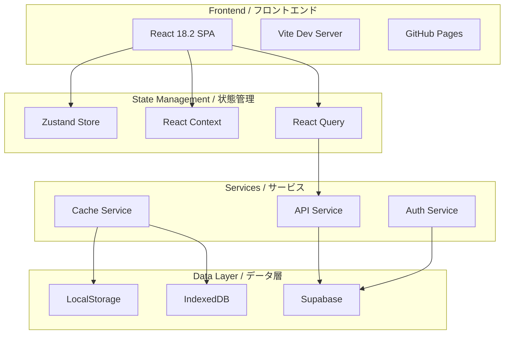

# System Architecture Quick Reference / システムアーキテクチャ・クイックリファレンス

> 🏗️ **Interactive architecture explorer**: `npm run quickref:arch`  
> 📊 **Generate architecture diagram**: `npm run quickref:arch:diagram`  
> 🔄 **Real-time updates**: Auto-synced with codebase changes

## 🎯 Architecture Overview



## 🏛️ Architecture Patterns

### Component Architecture

```yaml
Pattern: Atomic Design + Feature-Based
Structure:
  atoms/: Base UI components
  molecules/: Composite components
  organisms/: Complex components
  features/: Business logic components
  pages/: Route components

Example: Button (atom) →
  FormField (molecule) →
  LoginForm (organism) →
  AuthFeature (feature) →
  AuthPage (page)
```

### State Management Architecture

```yaml
Global State: Zustand
  - User preferences
  - Application settings
  - Cache management

Server State: React Query
  - API responses
  - Real-time data
  - Optimistic updates

Local State: React useState/useReducer
  - Form state
  - UI state
  - Component-specific data

Context State: React Context
  - Theme
  - Authentication
  - Localization
```

## 🔌 System Integration Points

### Frontend → Backend

```yaml
Protocol: REST API + WebSocket
Format: JSON
Authentication: JWT + Refresh Token
Rate Limiting: 100 req/min
Retry Policy: 3 attempts with exponential backoff

Endpoints: GET /api/v1/health → Health check
  POST /api/v1/auth/login → User login
  GET /api/v1/user/profile → User profile
  PUT /api/v1/progress → Update progress
  GET /api/v1/exam/questions → Get exam questions
```

### Database Architecture

```yaml
Primary: PostgreSQL (Supabase)
  Tables:
    - users: User accounts
    - progress: Learning progress
    - exams: Exam attempts
    - notes: User notes
    - groups: Study groups

Cache: Redis (planned)
  Purpose: Session management, rate limiting
  TTL: 24 hours for sessions

Local: IndexedDB
  Purpose: Offline data, large datasets
  Size: 50MB limit per origin
```

### Authentication Flow

```yaml
1. User Login: Client → Supabase Auth → JWT Token

2. Token Storage: Access Token → Memory
  Refresh Token → HttpOnly Cookie

3. API Requests: Add Bearer Token → Validate → Process

4. Token Refresh: Expired → Refresh Token → New Access Token

5. Logout: Clear Tokens → Revoke Refresh → Redirect
```

## 🏗️ Infrastructure Architecture

### Deployment Pipeline

```yaml
Development:
  Local → Vite Dev Server
  Port: 5173
  HMR: Enabled
  Source Maps: Enabled

Staging:
  GitHub → Actions → Vercel
  URL: staging.pmp-learning.com
  Environment: staging

Production:
  GitHub → Actions → GitHub Pages
  URL: pmp-learning.github.io
  CDN: Cloudflare
  SSL: Let's Encrypt
```

### Container Architecture

```yaml
Services:
  app:
    image: node:18-alpine
    ports: 5173
    volumes: ./src:/app/src

  db:
    image: postgres:14
    ports: 5432
    volumes: ./data:/var/lib/postgresql/data

  redis:
    image: redis:7-alpine
    ports: 6379

  nginx:
    image: nginx:alpine
    ports: 80, 443
    config: ./nginx.conf
```

## 🔐 Security Architecture

### Security Layers

```yaml
Network:
  - HTTPS only
  - CORS configured
  - CSP headers
  - Rate limiting

Application:
  - Input validation
  - XSS protection
  - CSRF tokens
  - SQL injection prevention

Data:
  - Encryption at rest
  - Encryption in transit
  - PII anonymization
  - Audit logging

Authentication:
  - MFA support
  - OAuth 2.0
  - Session management
  - Password policies
```

### Security Headers

```nginx
# nginx.conf or _headers file
Content-Security-Policy: default-src 'self'
X-Frame-Options: DENY
X-Content-Type-Options: nosniff
X-XSS-Protection: 1; mode=block
Referrer-Policy: strict-origin-when-cross-origin
Permissions-Policy: camera=(), microphone=(), geolocation=()
```

## 📊 Performance Architecture

### Optimization Strategies

```yaml
Bundle Size:
  - Code splitting by route
  - Tree shaking
  - Dynamic imports
  - Vendor chunk optimization
  Target: < 200KB initial load

Loading Performance:
  - Lazy loading components
  - Progressive image loading
  - Service Worker caching
  - Preload critical resources
  Target: LCP < 2.5s

Runtime Performance:
  - React.memo for expensive components
  - useMemo/useCallback optimization
  - Virtual scrolling for lists
  - Web Workers for heavy computation
  Target: FID < 100ms
```

### Caching Strategy

```yaml
Browser Cache:
  Static Assets: 1 year
  API Responses: 5 minutes
  User Data: Session

CDN Cache:
  HTML: 5 minutes
  CSS/JS: 1 year (versioned)
  Images: 1 month

Service Worker:
  Strategy: Network First, Cache Fallback
  Offline: Show cached content
  Update: Background sync
```

## 🔄 Data Flow Architecture

### Unidirectional Data Flow

```
User Action →
  Dispatch →
    Reducer/Store →
      State Update →
        Component Re-render →
          UI Update
```

### Event-Driven Architecture

```yaml
Event Bus:
  - User events
  - System events
  - API events
  - WebSocket events

Event Handlers:
  - Debounced search
  - Throttled scroll
  - Batched updates
  - Queue processing
```

## 🎨 Frontend Architecture

### Component Hierarchy

```
App.jsx
├── AuthProvider
│   ├── ThemeProvider
│   │   ├── Router
│   │   │   ├── Layout
│   │   │   │   ├── Header
│   │   │   │   ├── Sidebar
│   │   │   │   ├── Content (Routes)
│   │   │   │   └── Footer
```

### Routing Architecture

```yaml
Router: HashRouter (GitHub Pages compatible)
Code Splitting: React.lazy per route
Protected Routes: AuthGuard HOC
Navigation: Programmatic + Declarative

Route Structure:
  /: Home
  /auth/*: Authentication
  /dashboard: User Dashboard
  /learning/*: Learning modules
  /exam/*: Exam interface
  /admin/*: Admin panel (protected)
```

## 🔧 Microservices Architecture (Future)

### Service Decomposition

```yaml
Auth Service:
  - User management
  - JWT handling
  - OAuth providers

Learning Service:
  - Progress tracking
  - Content delivery
  - Recommendations

Exam Service:
  - Question bank
  - Test sessions
  - Grading

Notification Service:
  - Email
  - Push notifications
  - In-app messages

Analytics Service:
  - User behavior
  - Performance metrics
  - Business intelligence
```

### API Gateway Pattern

```yaml
Gateway:
  - Request routing
  - Load balancing
  - Authentication
  - Rate limiting
  - Response caching
  - Request/Response transformation

Benefits:
  - Single entry point
  - Cross-cutting concerns
  - Service abstraction
  - Protocol translation
```

## 📈 Scalability Architecture

### Horizontal Scaling

```yaml
Load Balancer:
  - Round-robin distribution
  - Health checks
  - SSL termination
  - Session affinity

Application Servers:
  - Stateless design
  - Auto-scaling (2-10 instances)
  - Rolling deployments
  - Blue-green deployments

Database:
  - Read replicas
  - Connection pooling
  - Query optimization
  - Sharding (future)
```

### Vertical Scaling

```yaml
Resource Optimization:
  - Memory: 512MB → 2GB
  - CPU: 1 core → 4 cores
  - Storage: SSD upgrades
  - Network: Enhanced bandwidth
```

## 🔍 Monitoring Architecture

### Observability Stack

```yaml
Metrics:
  Tool: Prometheus + Grafana
  Metrics:
    - Response time
    - Error rate
    - Throughput
    - Resource usage

Logging:
  Tool: ELK Stack
  Levels: ERROR, WARN, INFO, DEBUG
  Retention: 30 days

Tracing:
  Tool: Jaeger
  Sampling: 1%
  Retention: 7 days

Alerting:
  Tool: PagerDuty
  Channels: Email, Slack, SMS
  SLA: 99.9% uptime
```

## 🚀 Deployment Architecture

### CI/CD Pipeline

```yaml
Stages:
  1. Source:
    - Git push to main
    - PR merge

  2. Build:
    - Install dependencies
    - Run linters
    - Compile TypeScript
    - Build application

  3. Test:
    - Unit tests
    - Integration tests
    - E2E tests
    - Performance tests

  4. Deploy:
    - Build Docker image
    - Push to registry
    - Deploy to environment
    - Run smoke tests

  5. Monitor:
    - Health checks
    - Performance metrics
    - Error tracking
```

### Environment Strategy

```yaml
Development:
  - Local machine
  - Hot reload
  - Debug tools
  - Mock data

Staging:
  - Production-like
  - Real integrations
  - Performance testing
  - UAT

Production:
  - High availability
  - Auto-scaling
  - Monitoring
  - Backups
```

## 📋 Architecture Decision Records (ADRs)

### ADR-001: React over Angular/Vue

```yaml
Date: 2024-01-15
Status: Accepted
Context: Need modern, flexible frontend framework
Decision: React 18.2
Consequences: + Large ecosystem
  + Great performance
  + Team expertise
  - Requires additional libraries
```

### ADR-002: Zustand over Redux

```yaml
Date: 2024-02-01
Status: Accepted
Context: Need simple state management
Decision: Zustand
Consequences: + Minimal boilerplate
  + TypeScript support
  + Small bundle size
  - Less ecosystem
```

### ADR-003: GitHub Pages Hosting

```yaml
Date: 2024-02-15
Status: Accepted
Context: Need free, reliable hosting
Decision: GitHub Pages with HashRouter
Consequences: + Free hosting
  + GitHub integration
  + Simple deployment
  - URL structure (#/)
  - No server-side rendering
```

---

## 🛠️ Architecture Tools

```bash
# Generate architecture diagram
npm run arch:diagram

# Analyze dependencies
npm run arch:deps

# Check circular dependencies
npm run arch:circular

# Generate component tree
npm run arch:tree

# Architecture documentation
npm run arch:docs
```

## 📚 Additional Resources

- [System Design Document](/docs/architecture/SYSTEM_ARCHITECTURE_PLAN.md)
- [Database Design](/docs/architecture/DATABASE_DESIGN.md)
- [API Documentation](/docs/api/README.md)
- [Security Guidelines](/docs/security/SECURITY_IMPLEMENTATION_PLAN.md)

---

_Architecture documentation is auto-generated from code. Last update: Check with `npm run quickref:status`_
