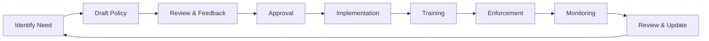

# 🏛️ Policies Directory

## Overview

This directory contains comprehensive policies, standards, and guidelines that govern the development, operations, security, and compliance of the PMPLearningManagement project. All team members must familiarize themselves with and adhere to these policies.

## Policy Documents

### 📝 Development Policies

| Document | Description | Compliance Level | Last Updated |
|----------|-------------|------------------|--------------|
| [coding-standards.md](./coding-standards.md) | Comprehensive coding conventions, patterns, and quality standards | 🟡 Important | 2025-08-15 |
| [review-process.md](./review-process.md) | Code review guidelines, PR workflows, and approval processes | 🟡 Important | 2025-08-15 |
| [contribution-guidelines.md](./contribution-guidelines.md) | How to contribute, commit conventions, and collaboration standards | 🟡 Important | 2025-08-15 |

### 🔒 Security Policies

| Document | Description | Compliance Level | Last Updated |
|----------|-------------|------------------|--------------|
| [security-policy.md](./security-policy.md) | Security best practices, vulnerability management, and incident response | 🔴 Critical | 2025-08-15 |
| [data-governance.md](./data-governance.md) | Data handling, privacy, retention, and protection policies | 🔴 Critical | 2025-08-15 |
| [incident-response.md](./incident-response.md) | Incident management procedures, escalation paths, and recovery plans | 🔴 Critical | 2025-08-15 |

### 🚀 Operational Policies

| Document | Description | Compliance Level | Last Updated |
|----------|-------------|------------------|--------------|
| [deployment-policy.md](./deployment-policy.md) | Deployment procedures, rollback strategies, and change management | 🔴 Critical | 2025-08-15 |
| [compliance-policy.md](./compliance-policy.md) | Regulatory compliance, audit requirements, and governance framework | 🔴 Critical | 2025-08-15 |

## Compliance Levels

### 🔴 Critical (Mandatory)
- **Immediate enforcement**: Non-compliance results in blocked deployments
- **Covers**: Security, data protection, regulatory compliance, production deployments
- **Exceptions**: Require C-level approval
- **Audit**: Continuous monitoring and reporting

### 🟡 Important (Required)
- **Standard enforcement**: Non-compliance prevents PR approval
- **Covers**: Code quality, testing standards, review processes
- **Exceptions**: Require team lead approval
- **Audit**: Weekly compliance checks

### 🟢 Recommended (Best Practice)
- **Advisory enforcement**: Suggestions for improvement
- **Covers**: Performance optimization, documentation, tooling
- **Exceptions**: Team discretion
- **Audit**: Monthly review

## Quick Reference

### For Developers
1. Read [coding-standards.md](./coding-standards.md) before writing code
2. Follow [contribution-guidelines.md](./contribution-guidelines.md) for all contributions
3. Understand [review-process.md](./review-process.md) for PR submissions
4. Review [security-policy.md](./security-policy.md) for secure coding practices

### For DevOps
1. Master [deployment-policy.md](./deployment-policy.md) for release management
2. Implement [incident-response.md](./incident-response.md) procedures
3. Ensure [compliance-policy.md](./compliance-policy.md) adherence
4. Monitor [data-governance.md](./data-governance.md) compliance

### For Management
1. Oversee [compliance-policy.md](./compliance-policy.md) implementation
2. Review [incident-response.md](./incident-response.md) readiness
3. Ensure [data-governance.md](./data-governance.md) alignment
4. Monitor policy effectiveness metrics

## Policy Lifecycle



## Enforcement Mechanisms

### Automated Enforcement
```bash
# Pre-commit hooks
npm run policy:pre-commit

# CI/CD pipeline checks
npm run policy:ci-check

# Continuous monitoring
npm run policy:monitor
```

### Manual Reviews
- Code review checklists
- Audit procedures
- Compliance assessments
- Security reviews

## Policy Updates

### Update Process
1. **Proposal**: Create issue with policy change request
2. **Discussion**: Team review and feedback (minimum 5 business days)
3. **Approval**: Required approvals based on policy type
4. **Implementation**: Update policy document via PR
5. **Communication**: Announce changes to all stakeholders
6. **Training**: Conduct training if significant changes

### Approval Matrix

| Policy Type | Required Approvers | Review Period |
|-------------|-------------------|---------------|
| Critical | CTO + Security Lead + Legal | 10 business days |
| Important | Team Lead + 2 Senior Engineers | 5 business days |
| Recommended | Team Lead + 1 Senior Engineer | 3 business days |

## Compliance Monitoring

### Dashboards
- Real-time compliance status: `/compliance/dashboard`
- Policy violation trends: `/compliance/violations`
- Audit findings: `/compliance/audits`

### Regular Audits
| Audit Type | Frequency | Scope |
|------------|-----------|-------|
| Security | Monthly | All critical policies |
| Code Quality | Weekly | Development policies |
| Compliance | Quarterly | All policies |
| Full Audit | Annually | Comprehensive review |

## Exceptions and Waivers

### Exception Request Process
1. Document justification in issue
2. Assess risk and mitigation
3. Obtain required approvals
4. Implement with time limit
5. Monitor and review

### Waiver Authority
- **Critical Policies**: CTO or CISO only
- **Important Policies**: Department Head
- **Recommended Policies**: Team Lead

## Training and Resources

### Required Training
| Role | Policies | Frequency |
|------|----------|-----------|
| All Staff | Security, Data Governance | Annual |
| Developers | All Development Policies | Onboarding + Annual |
| DevOps | All Operational Policies | Onboarding + Quarterly |
| Managers | All Policies | Onboarding + Bi-annual |

### Resources
- Policy training videos: `/training/policies/`
- Quick reference guides: `/docs/policy-guides/`
- FAQ: `/docs/policy-faq.md`
- Slack channel: `#policy-questions`

## Metrics and KPIs

### Policy Effectiveness Metrics
```javascript
const policyMetrics = {
  compliance: {
    overallRate: '> 95%',
    criticalPolicyCompliance: '100%',
    importantPolicyCompliance: '> 90%'
  },
  violations: {
    criticalViolations: '0 per month',
    importantViolations: '< 5 per month',
    recurrence: '< 10%'
  },
  training: {
    completion: '100% within 30 days',
    comprehension: '> 80% quiz score',
    satisfaction: '> 4.0/5.0 rating'
  }
};
```

## Incident Reporting

For policy violations or concerns:

1. **Critical violations**: Immediately contact security team
2. **Important violations**: Report via issue tracker
3. **Questions**: Ask in #policy-questions Slack channel
4. **Suggestions**: Submit via policy improvement form

## Quick Commands

```bash
# Check policy compliance for current branch
npm run policy:check

# Generate compliance report
npm run policy:report

# Run security audit
npm run security:audit

# Validate deployment readiness
npm run deploy:validate

# Check data governance compliance
npm run data:compliance
```

## Contact Information

| Role | Contact | Responsibility |
|------|---------|---------------|
| Policy Owner | devops@pmplms.com | Overall policy governance |
| Security Team | security@pmplms.com | Security policies |
| Compliance Team | compliance@pmplms.com | Regulatory compliance |
| DevOps Team | devops@pmplms.com | Operational policies |

---

**Last Review**: 2025-08-15  
**Next Review**: 2025-11-15  
**Version**: 2.0.0  
**Status**: Active

For policy questions or clarifications, please contact the DevOps team or create an issue with the `policy-question` label.