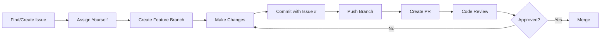

# 🤝 Contribution Guidelines

## Document Information
- **Version**: 1.0.0
- **Last Updated**: 2025-08-15
- **Status**: Active
- **Compliance Level**: 🟡 Important (Mandatory for Contributors)
- **Owner**: DevOps Team
- **Review Cycle**: Bi-annual

## 1. Welcome Contributors

Thank you for considering contributing to PMPLearningManagement! This document provides comprehensive guidelines to ensure smooth collaboration and maintain high-quality standards across our codebase.

## 2. Code of Conduct

### 2.1 Our Pledge
We pledge to make participation in our project a harassment-free experience for everyone, regardless of age, body size, disability, ethnicity, gender identity, level of experience, nationality, personal appearance, race, religion, or sexual identity and orientation.

### 2.2 Expected Behavior
- Use welcoming and inclusive language
- Be respectful of differing viewpoints
- Accept constructive criticism gracefully
- Focus on what's best for the community
- Show empathy towards other members

### 2.3 Unacceptable Behavior
- Harassment, discriminatory language, or personal attacks
- Publishing others' private information
- Trolling or insulting/derogatory comments
- Other conduct deemed inappropriate in a professional setting

## 3. Getting Started

### 3.1 Prerequisites

```bash
# System requirements
- Node.js >= 18.0.0
- npm >= 8.0.0
- Git >= 2.30.0

# Recommended tools
- VS Code with recommended extensions
- GitHub CLI (gh)
- Docker Desktop (for containerized testing)

# Setup verification
node --version  # Should output v18.x.x or higher
npm --version   # Should output 8.x.x or higher
git --version   # Should output 2.30.x or higher
```

### 3.2 Development Environment Setup

```bash
# 1. Fork the repository
# Click "Fork" on GitHub

# 2. Clone your fork
git clone https://github.com/YOUR-USERNAME/PMPLearningManagement.git
cd PMPLearningManagement

# 3. Add upstream remote
git remote add upstream https://github.com/yusuke-kurosawa/PMPLearningManagement.git

# 4. Install dependencies
npm install

# 5. Set up Git hooks
npm run idd:setup
npm run idd:hooks:install

# 6. Copy environment variables
cp .env.example .env.local
# Edit .env.local with your configuration

# 7. Run development server
npm run dev

# 8. Verify setup
npm run test
npm run lint
```

## 4. Contribution Workflow

### 4.1 Issue-Driven Development (IDD)

All contributions MUST follow our Issue-Driven Development process:



### 4.2 Finding Issues

```yaml
issue_types:
  good_first_issue:
    description: "Perfect for newcomers"
    label: "good first issue"
    complexity: "Low"
    
  help_wanted:
    description: "Community help needed"
    label: "help wanted"
    complexity: "Variable"
    
  bug:
    description: "Something isn't working"
    label: "bug"
    priority: "Based on severity"
    
  feature:
    description: "New feature request"
    label: "enhancement"
    requires: "Discussion first"
    
  documentation:
    description: "Documentation improvements"
    label: "documentation"
    complexity: "Low to Medium"
```

### 4.3 Creating Issues

Use our issue templates:

```markdown
## Bug Report Template

**Describe the bug**
A clear and concise description of the bug.

**To Reproduce**
Steps to reproduce the behavior:
1. Go to '...'
2. Click on '....'
3. Scroll down to '....'
4. See error

**Expected behavior**
What you expected to happen.

**Screenshots**
If applicable, add screenshots.

**Environment:**
- OS: [e.g., Windows 11]
- Browser: [e.g., Chrome 120]
- Node version: [e.g., 18.17.0]

**Additional context**
Any other context about the problem.
```

## 5. Branching Strategy

### 5.1 Branch Naming Convention

```bash
# Format: <type>/<issue-number>-<brief-description>

# Examples:
feature/123-add-user-authentication
bugfix/456-fix-login-error
hotfix/789-critical-security-patch
docs/012-update-api-documentation
refactor/345-optimize-database-queries
test/678-add-integration-tests
```

### 5.2 Branch Types

| Type | Purpose | Base Branch | Merge To |
|------|---------|-------------|----------|
| feature/* | New features | develop | develop |
| bugfix/* | Bug fixes | develop | develop |
| hotfix/* | Critical fixes | main | main & develop |
| release/* | Release preparation | develop | main & develop |
| docs/* | Documentation | develop | develop |
| test/* | Test additions | develop | develop |
| refactor/* | Code refactoring | develop | develop |

### 5.3 Branch Management

```bash
# Keep your branch up to date
git checkout develop
git pull upstream develop
git checkout feature/123-new-feature
git rebase develop

# Clean up local branches
git branch --merged | grep -v "\*\|main\|develop" | xargs -n 1 git branch -d

# Delete remote branch after merge
git push origin --delete feature/123-new-feature
```

## 6. Commit Conventions

### 6.1 Commit Message Format

```
<type>(<scope>): <subject> #<issue-number>

<body>

<footer>
```

### 6.2 Commit Types

| Type | Description | Example |
|------|-------------|---------|
| feat | New feature | feat(auth): add OAuth2 support #123 |
| fix | Bug fix | fix(api): resolve null pointer #456 |
| docs | Documentation | docs(readme): update setup instructions #789 |
| style | Formatting | style(css): fix indentation #012 |
| refactor | Code restructuring | refactor(db): optimize queries #345 |
| test | Test additions | test(auth): add unit tests #678 |
| chore | Maintenance | chore(deps): update dependencies #901 |
| perf | Performance | perf(api): improve response time #234 |
| ci | CI/CD changes | ci(github): add deployment workflow #567 |

### 6.3 Commit Best Practices

```bash
# Good commit messages
✅ feat(payment): integrate Stripe payment gateway #234
✅ fix(cart): prevent duplicate items in checkout #567
✅ docs(api): add endpoint documentation for v2 #890

# Bad commit messages
❌ fixed stuff
❌ WIP
❌ update
❌ feat: new feature (missing issue number)
```

### 6.4 Commit Hooks

```javascript
// .gitmessage template
# <type>(<scope>): <subject> #<issue>
#
# <body>
#
# <footer>

// Example with all sections:
feat(analytics): add user behavior tracking #123

Implement comprehensive analytics system to track:
- User navigation patterns
- Feature usage statistics
- Performance metrics
- Error tracking

This will help us understand user behavior and improve UX.

Breaking Change: Analytics API endpoint changed from /api/stats to /api/analytics
Reviewed-by: @teammate
Closes #123
```

## 7. Code Standards

### 7.1 General Guidelines

```javascript
// ✅ GOOD: Clear, self-documenting code
const calculateDiscountPrice = (originalPrice, discountPercentage) => {
  const discountAmount = originalPrice * (discountPercentage / 100);
  return originalPrice - discountAmount;
};

// ❌ BAD: Unclear, abbreviated names
const calc = (p, d) => {
  return p - (p * d / 100);
};
```

### 7.2 File Organization

```
src/
├── components/           # React components
│   ├── common/          # Shared components
│   ├── features/        # Feature-specific components
│   └── layout/          # Layout components
├── hooks/               # Custom React hooks
├── services/            # API and business logic
├── utils/               # Utility functions
├── types/               # TypeScript type definitions
├── constants/           # Application constants
└── styles/              # Global styles
```

### 7.3 Testing Requirements

```javascript
// Every feature must include:
describe('FeatureName', () => {
  // Unit tests
  describe('unit tests', () => {
    test('should handle normal cases', () => {
      // Test implementation
    });
    
    test('should handle edge cases', () => {
      // Test implementation
    });
    
    test('should handle error cases', () => {
      // Test implementation
    });
  });
  
  // Integration tests
  describe('integration tests', () => {
    test('should work with dependencies', () => {
      // Test implementation
    });
  });
});

// Minimum coverage requirements:
// - Statements: 80%
// - Branches: 75%
// - Functions: 80%
// - Lines: 80%
```

## 8. Pull Request Process

### 8.1 PR Checklist

```markdown
## PR Checklist
- [ ] Issue number referenced in title and description
- [ ] Code follows project style guidelines
- [ ] Self-review completed
- [ ] Tests added/updated and passing
- [ ] Documentation updated
- [ ] No console.log or debug code
- [ ] Commits are logical and atomic
- [ ] Branch is up to date with target branch
- [ ] No merge conflicts
- [ ] Performance impact considered
- [ ] Security implications reviewed
- [ ] Accessibility standards met
```

### 8.2 PR Title Format

```
<type>: <description> #<issue-number>

Examples:
feat: Add user profile management #123
fix: Resolve memory leak in data grid #456
docs: Update API documentation #789
```

### 8.3 PR Description Template

```markdown
## Description
Brief description of changes and motivation.

## Related Issue
Closes #(issue number)

## Type of Change
- [ ] Bug fix (non-breaking)
- [ ] New feature (non-breaking)
- [ ] Breaking change
- [ ] Documentation update

## Testing
- [ ] Unit tests pass
- [ ] Integration tests pass
- [ ] Manual testing completed

## Screenshots
[Add if applicable]

## Performance Impact
[Describe any performance implications]

## Migration Guide
[If breaking changes, provide migration steps]
```

### 8.4 Review Response

```markdown
# Responding to review comments

## Acknowledge feedback
"Thanks for the suggestion! I've updated the code to use the factory pattern as recommended."

## Ask for clarification
"I'm not sure I understand the concern. Could you provide an example of the edge case you're thinking of?"

## Respectful disagreement
"I see your point, but I chose this approach because [reasoning]. Happy to discuss alternatives if you still have concerns."

## Commit to future improvement
"Good point! I'll create a follow-up issue to address this optimization: #xxx"
```

## 9. Documentation Standards

### 9.1 Code Documentation

```javascript
/**
 * Calculates the total price including tax and discount
 * @param {number} basePrice - The base price before adjustments
 * @param {number} taxRate - Tax rate as a decimal (e.g., 0.08 for 8%)
 * @param {number} [discountAmount=0] - Optional discount amount
 * @returns {Object} Object containing breakdown and total
 * @throws {Error} If basePrice is negative
 * @example
 * calculateTotal(100, 0.08, 10)
 * // Returns: { base: 100, tax: 8, discount: 10, total: 98 }
 */
function calculateTotal(basePrice, taxRate, discountAmount = 0) {
  if (basePrice < 0) {
    throw new Error('Base price cannot be negative');
  }
  
  const tax = basePrice * taxRate;
  const total = basePrice + tax - discountAmount;
  
  return {
    base: basePrice,
    tax,
    discount: discountAmount,
    total
  };
}
```

### 9.2 README Updates

When adding features, update relevant documentation:

```markdown
## Feature Name

### Overview
Brief description of the feature.

### Usage
```javascript
// Code example
import { Feature } from './feature';

const result = Feature.doSomething();
```

### API Reference
| Method | Parameters | Returns | Description |
|--------|-----------|---------|-------------|
| doSomething | (arg1: string) | Promise<Result> | Does something useful |

### Configuration
| Option | Type | Default | Description |
|--------|------|---------|-------------|
| enabled | boolean | true | Enables the feature |
```

## 10. Release Process

### 10.1 Version Numbering

We follow Semantic Versioning (MAJOR.MINOR.PATCH):

```yaml
versioning:
  major:
    when: "Breaking API changes"
    example: "1.0.0 -> 2.0.0"
    
  minor:
    when: "New features (backward compatible)"
    example: "1.0.0 -> 1.1.0"
    
  patch:
    when: "Bug fixes (backward compatible)"
    example: "1.0.0 -> 1.0.1"
    
  prerelease:
    format: "x.y.z-<pre-release>.<n>"
    examples:
      - "1.0.0-alpha.1"
      - "1.0.0-beta.2"
      - "1.0.0-rc.1"
```

### 10.2 Release Checklist

```markdown
## Release Checklist

### Pre-release
- [ ] All PRs for release merged
- [ ] Version bumped in package.json
- [ ] CHANGELOG.md updated
- [ ] Documentation updated
- [ ] Breaking changes documented

### Testing
- [ ] Full test suite passing
- [ ] Manual testing completed
- [ ] Performance benchmarks run
- [ ] Security scan completed

### Release
- [ ] Create release branch
- [ ] Tag release
- [ ] Generate release notes
- [ ] Publish to npm (if applicable)
- [ ] Deploy to production

### Post-release
- [ ] Verify deployment
- [ ] Update project boards
- [ ] Announce release
- [ ] Close milestone
```

## 11. Security Guidelines

### 11.1 Security Checklist

```markdown
## Security Contribution Checklist

### Input Validation
- [ ] All user inputs validated
- [ ] SQL injection prevention (parameterized queries)
- [ ] XSS prevention (output encoding)
- [ ] Command injection prevention

### Authentication & Authorization
- [ ] Proper authentication checks
- [ ] Authorization for resources
- [ ] Session management secure
- [ ] Password requirements met

### Data Protection
- [ ] Sensitive data encrypted
- [ ] PII properly handled
- [ ] Secrets not in code
- [ ] Secure data transmission

### Dependencies
- [ ] No known vulnerabilities
- [ ] Licenses compatible
- [ ] Minimal dependencies
- [ ] Lock files updated
```

### 11.2 Reporting Security Issues

```markdown
## Security Issue Reporting

DO NOT create public issues for security vulnerabilities.

Instead:
1. Email security@pmplms.com
2. Include:
   - Description of vulnerability
   - Steps to reproduce
   - Potential impact
   - Suggested fix (if any)
3. Allow 48 hours for initial response
4. Work with team on coordinated disclosure
```

## 12. Community

### 12.1 Communication Channels

```yaml
channels:
  github_discussions:
    purpose: "General discussions, Q&A"
    url: "github.com/yusuke-kurosawa/PMPLearningManagement/discussions"
    
  slack:
    purpose: "Real-time collaboration"
    url: "pmplms.slack.com"
    channels:
      - "#general - General discussion"
      - "#dev - Development discussion"
      - "#help - Get help"
      
  email:
    dev_list: "dev@pmplms.com"
    security: "security@pmplms.com"
```

### 12.2 Recognition

We value all contributions:

```markdown
## Contributor Recognition

### Types of Contributions
- Code contributions
- Documentation improvements
- Bug reports
- Feature suggestions
- Code reviews
- Community support
- Translations
- Design contributions

### Recognition Methods
- Contributors file
- Release notes mentions
- Community spotlight
- Contributor badges
```

## 13. Legal

### 13.1 Contributor License Agreement (CLA)

By contributing, you agree that:

1. Your contributions are your original work
2. You have the right to submit the work
3. You grant us a perpetual, worldwide, non-exclusive, royalty-free license
4. Your contributions are provided "as is"

### 13.2 License

This project is licensed under the MIT License. All contributions will be licensed under the same terms.

## 14. Getting Help

### 14.1 Resources

```markdown
## Help Resources

### Documentation
- [Project README](../README.md)
- [API Documentation](../docs/api/)
- [Architecture Guide](../.claude/context/architecture-summary.md)

### Common Issues
- [Troubleshooting Guide](../docs/troubleshooting.md)
- [FAQ](../docs/faq.md)
- [Known Issues](https://github.com/yusuke-kurosawa/PMPLearningManagement/issues?q=label:known-issue)

### Getting Support
1. Check documentation
2. Search existing issues
3. Ask in discussions
4. Create an issue
5. Join Slack channel
```

### 14.2 Mentorship

```yaml
mentorship_program:
  for_new_contributors:
    pairing: "Match with experienced contributor"
    duration: "First 3 contributions"
    support:
      - Code review guidance
      - Architecture explanations
      - Best practices coaching
      
  becoming_a_mentor:
    requirements:
      - 10+ merged PRs
      - Active for 6+ months
      - Good communication skills
    benefits:
      - Mentor badge
      - Priority issue assignment
      - Architecture decisions input
```

## 15. Version History

| Version | Date | Changes | Author |
|---------|------|---------|--------|
| 1.0.0 | 2025-08-15 | Initial comprehensive contribution guidelines | DevOps Team |

---

**Thank you for contributing to PMPLearningManagement!**

**Questions?** Feel free to reach out via [GitHub Discussions](https://github.com/yusuke-kurosawa/PMPLearningManagement/discussions) or [Slack](#pmplms).