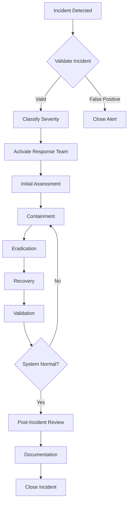

# 🚨 Incident Response Policy

## Document Information
- **Version**: 1.0.0
- **Last Updated**: 2025-08-15
- **Status**: Active
- **Compliance Level**: 🔴 Critical (Mandatory)
- **Owner**: DevOps Team & Security Team
- **Review Cycle**: Quarterly
- **24/7 Hotline**: +1-XXX-XXX-XXXX

## 1. Executive Summary

This policy defines the incident response procedures for the PMPLearningManagement system. It ensures rapid, coordinated, and effective response to security incidents, system failures, and service disruptions to minimize impact and restore normal operations.

## 2. Incident Response Principles

### 2.1 Core Objectives
1. **Minimize Impact**: Reduce damage and service disruption
2. **Rapid Recovery**: Restore services as quickly as possible
3. **Evidence Preservation**: Maintain forensic integrity
4. **Continuous Improvement**: Learn from every incident
5. **Clear Communication**: Keep stakeholders informed

## 3. Incident Classification

### 3.1 Severity Levels

```yaml
severity_levels:
  P0_Critical:
    description: "Complete service outage or data breach"
    impact: "All users affected, data compromised"
    response_time: "15 minutes"
    escalation: "Immediate"
    examples:
      - Complete system down
      - Active data breach
      - Ransomware attack
      - Critical data loss
      
  P1_High:
    description: "Major feature unavailable or security threat"
    impact: ">50% users affected"
    response_time: "30 minutes"
    escalation: "1 hour"
    examples:
      - Authentication system failure
      - Database corruption
      - DDoS attack
      - Payment system down
      
  P2_Medium:
    description: "Significant degradation or potential threat"
    impact: "10-50% users affected"
    response_time: "2 hours"
    escalation: "4 hours"
    examples:
      - Performance degradation
      - Partial feature failure
      - Suspicious activity detected
      
  P3_Low:
    description: "Minor issue or isolated problem"
    impact: "<10% users affected"
    response_time: "24 hours"
    escalation: "48 hours"
    examples:
      - UI glitches
      - Non-critical bug
      - Isolated user issue
```

### 3.2 Incident Types

```javascript
const incidentTypes = {
  security: {
    categories: ['breach', 'intrusion', 'malware', 'phishing', 'ddos'],
    team: 'Security Response Team',
    playbook: 'security-incident-playbook'
  },
  
  operational: {
    categories: ['outage', 'degradation', 'failure', 'error'],
    team: 'Operations Team',
    playbook: 'operational-incident-playbook'
  },
  
  data: {
    categories: ['loss', 'corruption', 'leak', 'unauthorized_access'],
    team: 'Data Protection Team',
    playbook: 'data-incident-playbook'
  },
  
  compliance: {
    categories: ['violation', 'audit_finding', 'regulatory_issue'],
    team: 'Compliance Team',
    playbook: 'compliance-incident-playbook'
  }
};
```

## 4. Incident Response Team

### 4.1 Team Structure

```yaml
incident_response_team:
  incident_commander:
    role: "Overall incident coordination"
    responsibilities:
      - Declare and close incidents
      - Coordinate response teams
      - Make critical decisions
      - External communication
    backup: "Engineering Manager"
    
  technical_lead:
    role: "Technical investigation and resolution"
    responsibilities:
      - Root cause analysis
      - Technical remediation
      - System recovery
      - Evidence collection
    backup: "Senior DevOps Engineer"
    
  communications_lead:
    role: "Stakeholder communication"
    responsibilities:
      - Status updates
      - Customer notifications
      - Internal updates
      - Media relations
    backup: "Product Manager"
    
  security_lead:
    role: "Security assessment and response"
    responsibilities:
      - Threat assessment
      - Forensic analysis
      - Security remediation
      - Law enforcement liaison
    backup: "Senior Security Engineer"
```

### 4.2 On-Call Rotation

```javascript
// On-call schedule management
const onCallSchedule = {
  primary: {
    rotation: 'weekly',
    startTime: 'Monday 09:00',
    handoff: {
      meeting: true,
      documentation: 'required',
      checklist: [
        'Review recent incidents',
        'Check system status',
        'Verify contact information',
        'Test alerting systems'
      ]
    }
  },
  
  secondary: {
    rotation: 'weekly',
    coverage: '24/7',
    escalation: 'After 15 minutes no response'
  },
  
  escalation: {
    level1: { timeout: '15m', contact: 'primary_oncall' },
    level2: { timeout: '30m', contact: 'secondary_oncall' },
    level3: { timeout: '45m', contact: 'team_lead' },
    level4: { timeout: '60m', contact: 'director' }
  }
};
```

## 5. Incident Response Process

### 5.1 Response Workflow



### 5.2 Detection Phase

```javascript
// Incident detection sources
class IncidentDetection {
  constructor() {
    this.sources = {
      monitoring: {
        tools: ['Datadog', 'PagerDuty', 'CloudWatch'],
        thresholds: {
          errorRate: 0.05,
          latency: 2000,
          availability: 0.995
        }
      },
      
      security: {
        tools: ['SIEM', 'IDS/IPS', 'WAF'],
        alerts: ['intrusion', 'anomaly', 'malware']
      },
      
      user: {
        channels: ['support', 'social_media', 'feedback'],
        priority: 'Evaluate based on volume'
      },
      
      automated: {
        healthChecks: 'Every 30 seconds',
        syntheticTests: 'Every 5 minutes',
        logAnalysis: 'Continuous'
      }
    };
  }
  
  async validateIncident(alert) {
    // Check if it's a real incident
    const validation = {
      isReal: await this.verifyAlert(alert),
      impact: await this.assessImpact(alert),
      severity: await this.calculateSeverity(alert),
      type: await this.categorizeIncident(alert)
    };
    
    if (validation.isReal) {
      await this.createIncident(validation);
    } else {
      await this.logFalsePositive(alert);
    }
    
    return validation;
  }
}
```

### 5.3 Containment Phase

```javascript
// Containment strategies
const containmentStrategies = {
  security_breach: {
    immediate: [
      'Isolate affected systems',
      'Disable compromised accounts',
      'Block malicious IPs',
      'Preserve evidence'
    ],
    
    shortTerm: [
      'Implement temporary fixes',
      'Increase monitoring',
      'Deploy additional controls',
      'Backup critical data'
    ],
    
    longTerm: [
      'Patch vulnerabilities',
      'Update security policies',
      'Implement permanent controls',
      'Security architecture review'
    ]
  },
  
  system_failure: {
    immediate: [
      'Failover to backup systems',
      'Redirect traffic',
      'Enable maintenance mode',
      'Notify users'
    ],
    
    shortTerm: [
      'Deploy hotfix',
      'Scale resources',
      'Implement workarounds',
      'Monitor stability'
    ]
  }
};
```

### 5.4 Eradication Phase

```bash
#!/bin/bash
# Eradication checklist script

echo "=== Incident Eradication Checklist ==="

# Security incidents
if [[ "$INCIDENT_TYPE" == "security" ]]; then
  echo "[ ] Remove malware/backdoors"
  echo "[ ] Close vulnerabilities"
  echo "[ ] Reset credentials"
  echo "[ ] Update security rules"
  echo "[ ] Patch systems"
fi

# Operational incidents
if [[ "$INCIDENT_TYPE" == "operational" ]]; then
  echo "[ ] Fix root cause"
  echo "[ ] Update configurations"
  echo "[ ] Deploy patches"
  echo "[ ] Clear corrupted data"
  echo "[ ] Update monitoring"
fi

# Verify eradication
echo "[ ] Scan for remaining issues"
echo "[ ] Verify fixes applied"
echo "[ ] Test remediation"
echo "[ ] Document changes"
```

### 5.5 Recovery Phase

```javascript
// Recovery procedures
class RecoveryManager {
  async executeRecovery(incident) {
    const recoveryPlan = {
      steps: [],
      validation: [],
      rollback: []
    };
    
    // Determine recovery strategy
    switch (incident.type) {
      case 'data_loss':
        recoveryPlan.steps = [
          'Identify last known good backup',
          'Restore from backup',
          'Replay transaction logs',
          'Verify data integrity',
          'Resync replicas'
        ];
        break;
        
      case 'service_outage':
        recoveryPlan.steps = [
          'Restart services in order',
          'Verify dependencies',
          'Warm up caches',
          'Gradual traffic increase',
          'Monitor metrics'
        ];
        break;
        
      case 'security_breach':
        recoveryPlan.steps = [
          'Deploy clean systems',
          'Restore from secure backup',
          'Reset all credentials',
          'Verify no persistence',
          'Enhanced monitoring'
        ];
        break;
    }
    
    // Execute recovery
    for (const step of recoveryPlan.steps) {
      await this.executeStep(step);
      await this.validateStep(step);
      
      if (!this.stepSuccessful) {
        await this.rollbackStep(step);
        throw new Error(`Recovery failed at: ${step}`);
      }
    }
    
    return recoveryPlan;
  }
}
```

## 6. Communication Procedures

### 6.1 Communication Matrix

```yaml
communication_matrix:
  P0_Critical:
    internal:
      - method: "Phone + Slack + Email"
      - recipients: "All teams, C-level"
      - frequency: "Every 30 minutes"
      - template: "critical_incident_template"
      
    external:
      - method: "Status page + Email"
      - recipients: "All customers"
      - frequency: "Every hour"
      - approval: "VP or above"
      
  P1_High:
    internal:
      - method: "Slack + Email"
      - recipients: "Engineering, Support"
      - frequency: "Every hour"
      
    external:
      - method: "Status page"
      - recipients: "Affected customers"
      - frequency: "Every 2 hours"
      
  P2_Medium:
    internal:
      - method: "Slack"
      - recipients: "Relevant teams"
      - frequency: "Every 4 hours"
      
    external:
      - method: "Status page"
      - recipients: "If customer facing"
      - frequency: "As needed"
```

### 6.2 Communication Templates

```markdown
## Internal Communication Template

**INCIDENT ALERT - [SEVERITY] - [INCIDENT_ID]**

**Status**: [Investigating/Identified/Monitoring/Resolved]
**Impact**: [Description of impact]
**Affected Services**: [List of services]
**Start Time**: [Timestamp]

**Current Status**:
[Current situation and actions being taken]

**Next Update**: [Time]

**Incident Commander**: [Name]
**Slack Channel**: #incident-[ID]

---

## Customer Communication Template

**Service Status Update**

We are currently experiencing [issue description]. 

**Impact**: [What users might experience]
**Affected Services**: [List of affected features]
**Status**: We are actively working on a resolution

We apologize for any inconvenience and will provide updates every [frequency].

**Next Update**: [Time]

For updates: [status page URL]
```

## 7. Incident Documentation

### 7.1 Incident Report Template

```markdown
# Incident Report - [INCIDENT_ID]

## Executive Summary
- **Date**: [Date]
- **Duration**: [Total time]
- **Severity**: [P0/P1/P2/P3]
- **Impact**: [User impact summary]

## Timeline
| Time | Event | Action | Owner |
|------|-------|--------|-------|
| [Time] | Incident detected | [Action taken] | [Person] |

## Root Cause Analysis
### What Happened
[Detailed description]

### Why It Happened
[Root cause analysis using 5 Whys]

### Contributing Factors
- [Factor 1]
- [Factor 2]

## Impact Assessment
- **Users Affected**: [Number/percentage]
- **Data Loss**: [Yes/No, details]
- **Financial Impact**: [Estimate]
- **Reputation Impact**: [Assessment]

## Response Evaluation
### What Went Well
- [Positive aspect 1]
- [Positive aspect 2]

### What Could Be Improved
- [Improvement area 1]
- [Improvement area 2]

## Action Items
| Action | Owner | Due Date | Status |
|--------|-------|----------|--------|
| [Action] | [Person] | [Date] | [Status] |

## Lessons Learned
[Key takeaways and learnings]
```

### 7.2 Evidence Collection

```javascript
// Evidence collection procedures
class EvidenceCollector {
  async collectEvidence(incident) {
    const evidence = {
      metadata: {
        incidentId: incident.id,
        collectedAt: new Date().toISOString(),
        collectedBy: this.currentUser,
        chain_of_custody: []
      },
      
      artifacts: []
    };
    
    // Collect different types of evidence
    const collectors = {
      logs: async () => {
        return {
          application: await this.collectAppLogs(incident.timeframe),
          system: await this.collectSystemLogs(incident.timeframe),
          security: await this.collectSecurityLogs(incident.timeframe),
          network: await this.collectNetworkLogs(incident.timeframe)
        };
      },
      
      memory: async () => {
        return {
          dumps: await this.captureMemoryDumps(incident.affectedSystems),
          processes: await this.captureRunningProcesses(),
          connections: await this.captureNetworkConnections()
        };
      },
      
      disk: async () => {
        return {
          snapshots: await this.createDiskSnapshots(),
          files: await this.collectSuspiciousFiles(),
          timestamps: await this.preserveTimestamps()
        };
      },
      
      configuration: async () => {
        return {
          system: await this.captureSystemConfig(),
          application: await this.captureAppConfig(),
          network: await this.captureNetworkConfig()
        };
      }
    };
    
    // Collect all evidence types
    for (const [type, collector] of Object.entries(collectors)) {
      evidence.artifacts.push({
        type,
        data: await collector(),
        hash: this.calculateHash(await collector())
      });
    }
    
    // Store evidence securely
    await this.storeEvidence(evidence);
    
    return evidence;
  }
}
```

## 8. Playbooks

### 8.1 Security Incident Playbook

```yaml
security_incident_playbook:
  detection:
    - Verify the security alert
    - Assess scope and impact
    - Activate security team
    
  containment:
    - Isolate affected systems
    - Preserve evidence
    - Block attack vectors
    - Disable compromised accounts
    
  investigation:
    - Analyze attack timeline
    - Identify entry point
    - Determine extent of compromise
    - Check for data exfiltration
    
  eradication:
    - Remove malware/backdoors
    - Patch vulnerabilities
    - Reset credentials
    - Update security controls
    
  recovery:
    - Restore from clean backups
    - Rebuild compromised systems
    - Verify no persistence
    - Resume normal operations
    
  post_incident:
    - Complete incident report
    - Notify authorities if required
    - Update security measures
    - Conduct lessons learned
```

### 8.2 Service Outage Playbook

```bash
#!/bin/bash
# Service outage response playbook

SERVICE=$1
SEVERITY=$2

case $SEVERITY in
  P0|P1)
    echo "=== Critical Service Outage Response ==="
    
    # 1. Immediate actions
    echo "[1] Activating incident response team..."
    ./scripts/activate-incident-team.sh $SEVERITY
    
    # 2. Assessment
    echo "[2] Running diagnostics..."
    ./scripts/run-diagnostics.sh $SERVICE
    
    # 3. Failover if available
    echo "[3] Checking failover options..."
    if ./scripts/check-failover.sh $SERVICE; then
      echo "Initiating failover..."
      ./scripts/failover.sh $SERVICE
    fi
    
    # 4. Communication
    echo "[4] Sending notifications..."
    ./scripts/notify-stakeholders.sh $SERVICE $SEVERITY
    
    # 5. Recovery
    echo "[5] Initiating recovery procedures..."
    ./scripts/recover-service.sh $SERVICE
    ;;
    
  P2|P3)
    echo "=== Standard Service Issue Response ==="
    ./scripts/standard-response.sh $SERVICE $SEVERITY
    ;;
esac

# Monitor recovery
./scripts/monitor-recovery.sh $SERVICE
```

### 8.3 Data Breach Playbook

```javascript
// Data breach response playbook
const dataBreachPlaybook = {
  immediate_response: {
    '0-15_minutes': [
      'Confirm the breach',
      'Activate incident response team',
      'Isolate affected systems',
      'Preserve evidence',
      'Stop ongoing data loss'
    ],
    
    '15-60_minutes': [
      'Assess scope of breach',
      'Identify data types affected',
      'Document initial findings',
      'Begin forensic analysis',
      'Notify legal team'
    ]
  },
  
  investigation: {
    technical: [
      'Determine attack vector',
      'Identify compromised systems',
      'Analyze data access logs',
      'Check for data exfiltration',
      'Review security controls'
    ],
    
    business: [
      'Identify affected customers',
      'Assess business impact',
      'Review compliance obligations',
      'Prepare notification lists',
      'Calculate potential damages'
    ]
  },
  
  notification: {
    internal: {
      executive_team: 'Within 2 hours',
      board_of_directors: 'Within 4 hours',
      all_staff: 'Within 24 hours'
    },
    
    external: {
      regulators: 'Within 72 hours (GDPR)',
      affected_individuals: 'Without undue delay',
      media: 'As appropriate',
      partners: 'Within 24 hours'
    }
  },
  
  remediation: [
    'Fix vulnerabilities',
    'Reset all credentials',
    'Implement additional controls',
    'Update security policies',
    'Conduct security training'
  ]
};
```

## 9. Testing and Drills

### 9.1 Incident Response Testing

```yaml
testing_schedule:
  tabletop_exercises:
    frequency: "Quarterly"
    participants: "All response team members"
    scenarios:
      - Ransomware attack
      - Data breach
      - DDoS attack
      - Insider threat
      - Supply chain attack
    
  simulation_drills:
    frequency: "Bi-annually"
    type: "Surprise drill"
    scope: "Full incident response"
    evaluation:
      - Response time
      - Decision making
      - Communication effectiveness
      - Technical execution
      
  purple_team_exercises:
    frequency: "Annually"
    approach: "Red team vs Blue team"
    objectives:
      - Test detection capabilities
      - Validate response procedures
      - Identify gaps
      - Train team
```

### 9.2 Drill Scenarios

```javascript
// Incident drill scenario generator
class DrillScenarioGenerator {
  generateScenario() {
    const scenarios = [
      {
        name: 'Ransomware Attack',
        injects: [
          { time: '00:00', event: 'Users report files encrypted' },
          { time: '00:15', event: 'Ransom note discovered' },
          { time: '00:30', event: 'Spread detected to other systems' },
          { time: '01:00', event: 'Backup system compromised' },
          { time: '02:00', event: 'Ransom demand increases' }
        ]
      },
      {
        name: 'API Key Leak',
        injects: [
          { time: '00:00', event: 'Security researcher reports exposed key' },
          { time: '00:30', event: 'Unauthorized API usage detected' },
          { time: '01:00', event: 'Data exfiltration confirmed' },
          { time: '02:00', event: 'Media inquiry received' }
        ]
      },
      {
        name: 'Critical Service Failure',
        injects: [
          { time: '00:00', event: 'Database connection errors spike' },
          { time: '00:05', event: 'Application servers failing' },
          { time: '00:10', event: 'Complete service outage' },
          { time: '00:30', event: 'Failover system not responding' },
          { time: '01:00', event: 'Data corruption suspected' }
        ]
      }
    ];
    
    return scenarios[Math.floor(Math.random() * scenarios.length)];
  }
}
```

## 10. Metrics and KPIs

### 10.1 Response Metrics

```javascript
const incidentMetrics = {
  response: {
    meanTimeToDetect: { target: '< 5 minutes', measure: 'incident_created - incident_occurred' },
    meanTimeToRespond: { target: '< 15 minutes', measure: 'first_response - incident_created' },
    meanTimeToResolve: { target: '< 2 hours', measure: 'incident_resolved - incident_created' },
    meanTimeToRecover: { target: '< 4 hours', measure: 'service_restored - incident_occurred' }
  },
  
  quality: {
    falsePositiveRate: { target: '< 10%', measure: 'false_positives / total_alerts' },
    recurrenceRate: { target: '< 5%', measure: 'recurring_incidents / total_incidents' },
    postmortemCompletion: { target: '100%', measure: 'postmortems_completed / p0_p1_incidents' },
    actionItemCompletion: { target: '> 90%', measure: 'actions_completed / total_actions' }
  },
  
  impact: {
    customerImpact: { measure: 'affected_users * duration' },
    revenueImpact: { measure: 'lost_revenue + recovery_cost' },
    slaCompliance: { target: '> 99.9%', measure: 'sla_met / total_incidents' },
    dataLoss: { target: '0', measure: 'records_lost' }
  }
};
```

### 10.2 Improvement Tracking

```yaml
improvement_metrics:
  training:
    completion_rate: "> 95%"
    drill_participation: "100%"
    certification_current: "100%"
    
  process:
    playbook_coverage: "100% of incident types"
    automation_level: "> 60% of responses"
    documentation_quality: "All incidents documented"
    
  technical:
    detection_coverage: "> 95% of infrastructure"
    mttr_trend: "Decreasing quarter over quarter"
    incident_prevention: "Root causes addressed"
```

## 11. External Coordination

### 11.1 External Contacts

```yaml
external_contacts:
  law_enforcement:
    fbi_cyber: "+1-XXX-XXX-XXXX"
    local_police: "+1-XXX-XXX-XXXX"
    secret_service: "+1-XXX-XXX-XXXX"
    
  regulatory:
    gdpr_authority: "dpa@privacy.eu"
    sec: "cyber@sec.gov"
    state_attorney: "breach@state.gov"
    
  partners:
    cloud_provider: "security@cloudprovider.com"
    cdn_provider: "noc@cdn.com"
    payment_processor: "security@payments.com"
    
  professional:
    incident_response_firm: "ir@security-firm.com"
    forensics_team: "forensics@cyber-forensics.com"
    legal_counsel: "cyber@lawfirm.com"
    pr_agency: "crisis@pr-agency.com"
```

### 11.2 Information Sharing

```javascript
// Threat intelligence sharing
const threatIntelligence = {
  sources: [
    'ISACs', // Information Sharing and Analysis Centers
    'CERTs', // Computer Emergency Response Teams
    'Vendor advisories',
    'Threat feeds',
    'Security communities'
  ],
  
  sharing: {
    what: [
      'Indicators of Compromise (IOCs)',
      'Tactics, Techniques, and Procedures (TTPs)',
      'Vulnerability information',
      'Incident patterns'
    ],
    
    when: [
      'New threat discovered',
      'Pattern identified',
      'Successful defense',
      'Post-incident findings'
    ],
    
    how: {
      format: 'STIX/TAXII',
      platforms: ['ThreatConnect', 'MISP', 'ISACPortal'],
      anonymization: 'Remove customer data'
    }
  }
};
```

## 12. Continuous Improvement

### 12.1 Post-Incident Review Process

```markdown
## Post-Incident Review (PIR) Process

### Timeline
- P0/P1: Within 48 hours
- P2: Within 1 week
- P3: Monthly batch review

### Participants
- Incident Commander
- Technical Lead
- Affected teams
- Customer representative (if applicable)

### Agenda (60 minutes)
1. Timeline review (15 min)
2. What went well (10 min)
3. What went wrong (10 min)
4. Root cause analysis (15 min)
5. Action items (10 min)

### Output
- Incident report
- Action items with owners
- Process improvements
- Training needs
```

### 12.2 Lessons Learned Database

```sql
-- Lessons learned schema
CREATE TABLE lessons_learned (
  id UUID PRIMARY KEY,
  incident_id VARCHAR(50),
  incident_date TIMESTAMP,
  severity VARCHAR(10),
  incident_type VARCHAR(50),
  lesson_category VARCHAR(50),
  lesson_description TEXT,
  recommendation TEXT,
  action_taken TEXT,
  effectiveness_score INTEGER,
  created_by VARCHAR(100),
  created_at TIMESTAMP DEFAULT CURRENT_TIMESTAMP,
  tags TEXT[]
);

-- Query for common patterns
SELECT 
  lesson_category,
  COUNT(*) as frequency,
  AVG(effectiveness_score) as avg_effectiveness
FROM lessons_learned
WHERE incident_date > NOW() - INTERVAL '6 months'
GROUP BY lesson_category
ORDER BY frequency DESC;
```

## 13. Training Requirements

### 13.1 Role-Based Training

| Role | Training Modules | Frequency | Certification |
|------|-----------------|-----------|---------------|
| Incident Commander | Incident Management, Crisis Communication | Quarterly | Required |
| Technical Lead | Forensics, System Recovery | Bi-annual | Required |
| On-call Engineer | Basic Response, Escalation | Monthly | Required |
| All Staff | Security Awareness, Reporting | Annual | Required |

### 13.2 Training Resources

```yaml
training_resources:
  internal:
    - Incident response handbook
    - Playbook walkthroughs
    - Tabletop exercise guides
    - Post-incident reviews
    
  external:
    - SANS incident response training
    - Cloud provider security training
    - Industry conferences
    - Certification programs (GCIH, GNFA)
    
  tools:
    - Incident simulation platform
    - Virtual lab environment
    - Response automation tools
    - Communication platforms
```

## 14. Version History

| Version | Date | Changes | Author |
|---------|------|---------|--------|
| 1.0.0 | 2025-08-15 | Initial comprehensive incident response policy | DevOps & Security Team |

---

**Emergency Contact**: 24/7 Incident Hotline: +1-XXX-XXX-XXXX  
**Approval**: Security Team Lead / DevOps Team Lead  
**Effective Date**: 2025-08-15  
**Next Review**: 2025-11-15  
**Classification**: CONFIDENTIAL