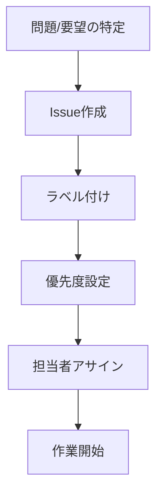
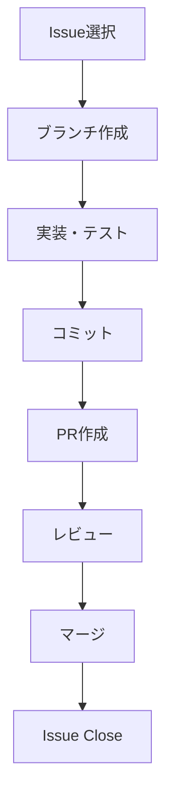

# Issue-Driven Development (IDD) ルール定義

## 🎯 IDD基本原則

### 1. Issue First（Issue優先）
- **全ての作業はIssueから開始**
- 1行のコード変更でもIssue必須
- コミット前にIssue作成

### 2. 完全トレーサビリティ
- **コミット ↔ Issue の1:1対応**
- 作業履歴の完全追跡
- 変更理由の明確化

### 3. 継続的改善
- **メトリクス駆動の改善**
- 準拠率99%以上の維持
- プロセスの自動化

## 📋 必須ルール（MUST）

### 1. Issue作成ルール
- **タイトル形式**: `[種別] 概要 #関連Issue`
- **種別**: feat, fix, docs, style, refactor, test, chore
- **説明**: 問題、解決策、受け入れ条件を明記
- **ラベル**: 適切なカテゴリラベルの付与

### 2. コミットメッセージルール
```
[種別]: 変更内容の簡潔な説明 #Issue番号

詳細説明（必要に応じて）

- 変更点1
- 変更点2

Closes #Issue番号
```

### 3. ブランチ命名ルール
- **形式**: `[種別]/issue-[番号]-[概要]`
- **例**: `feat/issue-79-devops-foundation`

### 4. PR（Pull Request）ルール
- **タイトル**: Issue番号を含む
- **説明**: Issue参照、変更内容、テスト結果
- **レビュー**: 必須承認設定
- **マージ**: Squash mergeでIssue番号保持

## 🔄 ワークフロー

### 1. Issue作成フロー


### 2. 開発フロー


## 🤖 自動化システム

### 1. Git Hooks
- **pre-commit**: Issue番号チェック
- **commit-msg**: メッセージ形式検証
- **pre-push**: 最終準拠チェック

### 2. GitHub Actions
- **idd-compliance.yml**: 準拠率監視
- **issue-automation.yml**: Issue自動管理
- **metrics-collector.yml**: メトリクス収集

### 3. 品質ゲート
- PR作成時の自動チェック
- Issue参照の必須化
- 準拠率レポート生成

## 📊 メトリクス監視

### 1. 準拠率指標
- **Issue準拠率**: 99%以上
- **コミット準拠率**: 100%
- **PR準拠率**: 100%

### 2. 効率性指標
- **Issue解決時間**: 平均3日以内
- **レビュー時間**: 24時間以内
- **デプロイ頻度**: 日次

### 3. 品質指標
- **バグ発生率**: 1%以下
- **コードカバレッジ**: 90%以上
- **セキュリティスコア**: A評価

## 🏷️ ラベル体系

### 1. 種別ラベル
- `feat`: 新機能
- `fix`: バグ修正
- `docs`: ドキュメント
- `style`: フォーマット
- `refactor`: リファクタリング
- `test`: テスト
- `chore`: 雑務

### 2. 優先度ラベル
- `priority/critical`: 緊急
- `priority/high`: 高
- `priority/medium`: 中
- `priority/low`: 低

### 3. カテゴリラベル
- `category/devops`: DevOps
- `category/frontend`: フロントエンド
- `category/backend`: バックエンド
- `category/security`: セキュリティ

### 4. ステータスラベル
- `status/in-progress`: 作業中
- `status/review`: レビュー中
- `status/blocked`: ブロック中
- `status/ready`: 準備完了

## 🛠️ ツールとスクリプト

### 1. セットアップスクリプト
```bash
npm run idd:setup          # IDD環境初期化
npm run idd:hooks:install  # Git hooks インストール
npm run idd:check          # 準拠チェック
```

### 2. 日常コマンド
```bash
npm run idd:status         # 現在のステータス
npm run idd:report         # レポート生成
npm run idd:metrics        # メトリクス表示
```

### 3. Issue管理コマンド
```bash
gh issue create --template=feature  # 機能要求Issue
gh issue create --template=bug      # バグレポート
gh issue list --state=open          # オープンIssue一覧
```

## 🔧 品質チェックリスト

### Issue作成時
- [ ] タイトルが形式に準拠
- [ ] 説明が十分詳細
- [ ] 適切なラベル付与
- [ ] 受け入れ条件明記

### コミット時
- [ ] Issue番号が含まれる
- [ ] メッセージが規則準拠
- [ ] 変更内容が明確
- [ ] テストが実装済み

### PR作成時
- [ ] Issue参照が正確
- [ ] 変更内容が完全
- [ ] テスト結果が良好
- [ ] ドキュメント更新済み

### マージ時
- [ ] レビュー完了
- [ ] CI/CDパス
- [ ] Issue自動クローズ
- [ ] メトリクス更新

## 📈 成果指標

### 短期目標（1ヶ月）
- IDD準拠率99%達成
- 自動化システム完全稼働
- チーム全体の理解浸透

### 中期目標（3ヶ月）
- 開発効率30%向上
- バグ発生率50%削減
- リードタイム短縮

### 長期目標（6ヶ月）
- 業界ベンチマーク達成
- 継続的改善文化確立
- ゼロバグリリース実現

---

**注意**: このルールはGitHubリポジトリとCLAUDE.mdに統合され、自動的に適用されます。