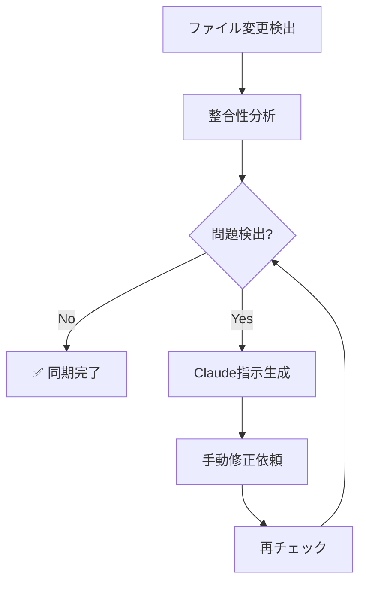

# 📚 ドキュメント自動同期システム

CLAUDE.mdとREADME.mdの自動同期システムの使用方法とメンテナンスガイドです。

## 🎯 概要

このシステムは、CLAUDE.mdとREADME.mdの整合性を維持するために、Claude Code Actionsと連携した自動同期機能を提供します。

### 主要コンポーネント

1. **GitHub Actions ワークフロー**: `.github/workflows/claude-docs-sync.yml`
2. **バリデータスクリプト**: `.github/scripts/docs-sync-validator.js`
3. **NPMスクリプト**: `docs:sync`, `docs:sync:auto`

## 🚀 使用方法

### 手動同期チェック

```bash
# 基本的な同期チェック
npm run docs:sync

# 自動チェック（結果メッセージ付き）
npm run docs:sync:auto
```

### 自動実行トリガー

以下の場合に自動的に実行されます：

1. **ファイル変更時**: CLAUDE.mdまたはREADME.mdがpushされた時
2. **定期実行**: 毎日9:00（JST）に実行
3. **手動実行**: GitHub ActionsのUI から手動実行可能

## 🔍 検証項目

### 1. プロジェクト基本情報

- プロジェクト名の一致
- PMBOKバージョン情報の整合性
- タイトルの一貫性

### 2. 技術仕様

- React, Vite, TypeScript等のバージョン一致
- Node.jsバージョンの整合性
- 技術スタック記述の統一性

### 3. 言語規約

- 日本語標準の明記
- GitHub Actions での日本語使用
- UIメッセージの言語統一

### 4. 開発環境

- 開発コマンドの一致
- 開発サーバーポートの統一
- 環境設定の整合性

### 5. 機能リスト

- 全機能の記述統一
- 新機能のマーキング一致
- 機能説明の整合性

## 📊 整合性スコア

システムは0-100%の整合性スコアを算出します：

- **90-100%**: 良好 ✅
- **70-89%**: 注意 ⚠️
- **69%以下**: 要修正 ❌

## 🔧 問題解決フロー

### 1. 問題検出

```bash
npm run docs:sync
```

実行後、問題が検出されると `.claude-sync-instruction.md` が生成されます。

### 2. Claude による修正

生成された指示ファイルを参考に、Claude に以下のプロンプトで修正を依頼：

```
CLAUDE.mdとREADME.mdを完全同期してください。
.claude-sync-instruction.md の指示に従って、
すべての不整合を修正し、100%の整合性を達成してください。
```

### 3. 修正確認

```bash
npm run docs:sync:auto
```

## 📈 メトリクス監視

### 自動生成メトリクス

- `.github/metrics/docs-sync-metrics.json`: 同期実行履歴
- `.github/docs-sync-log.md`: 詳細実行ログ

### 主要KPI

- 同期成功率
- 平均整合性スコア
- 問題解決時間
- 自動修正成功率

## 🔄 自動同期ワークフロー



## ⚙️ 設定とカスタマイズ

### 実行頻度の変更

`.github/workflows/claude-docs-sync.yml` の `schedule` セクションを編集：

```yaml
schedule:
  # 毎日9時から毎時間実行に変更する場合
  - cron: '0 9-17 * * *'
```

### チェック項目の追加

`.github/scripts/docs-sync-validator.js` の検証メソッドを拡張：

```javascript
async validateCustomContent(claudeContent, readmeContent) {
  // カスタム検証ロジックを追加
}
```

### 通知設定

不整合検出時のSlack通知等を追加可能。

## 🔒 セキュリティ考慮事項

- GitHub Actionsは `GITHUB_TOKEN` のみ使用
- 外部APIへの情報送信なし
- すべての処理はリポジトリ内で完結
- 自動修正は実行せず、指示生成のみ

## 🚨 トラブルシューティング

### よくある問題

**Q: 整合性スコアが低下し続ける**
A: 両ファイルの同時編集による競合が原因の可能性。一方のファイルを基準に完全同期を実行。

**Q: 自動同期が実行されない**
A: GitHub Actions の実行履歴を確認。権限問題やワークフロー無効化の可能性。

**Q: Claude指示が生成されない**
A: Node.js環境とスクリプトの実行権限を確認。

### ログ確認コマンド

```bash
# 最新の同期ログ確認
cat .github/docs-sync-log.md | tail -50

# メトリクス確認
cat .github/metrics/docs-sync-metrics.json | jq '.'
```

## 📝 メンテナンス

### 定期メンテナンス（月次）

1. 同期ログの確認とクリーンアップ
2. メトリクスの分析と改善点の特定
3. 検証項目の見直し
4. ワークフロー実行時間の最適化

### バージョンアップ時

1. 新しい技術要素の検証項目追加
2. 検証ロジックの更新
3. テストケースの追加

## 🤝 貢献方法

同期システムの改善にご協力ください：

1. 新しい検証項目の提案
2. バグ報告と修正
3. パフォーマンス改善
4. ドキュメントの改善

## 📞 サポート

問題が解決しない場合は、Issue を作成してください：

- ラベル: `documentation`, `automation`
- テンプレート: Bug Report または Feature Request
- 実行ログとメトリクスの添付

---

**最終更新**: 2025-08-10  
**バージョン**: 1.0.0  
**メンテナー**: PMPLearningManagement Team
