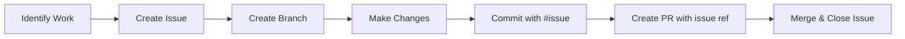

# 🚀 IDD Quick Reference Guide

## ✅ Essential IDD Rules

### 1️⃣ **ALWAYS Create an Issue First**
```bash
# Create a new issue
gh issue create --title "Your feature/bug title" --body "Description"

# List open issues
gh issue list --state open

# View specific issue
gh issue view <issue-number>
```

### 2️⃣ **Reference Issues in EVERY Commit**
```bash
# Good commit messages
git commit -m "feat: Add user authentication (#42)"
git commit -m "fix: Resolve memory leak in dashboard (#108)"
git commit -m "docs: Update API documentation (#73)"

# Bad commit messages (NO ISSUE REFERENCE!)
git commit -m "Add user authentication"  # ❌ WRONG
git commit -m "Fix bug"                   # ❌ WRONG
```

### 3️⃣ **Link Issues in Pull Requests**
```markdown
# In PR description, use these keywords:
Closes #123        # Automatically closes issue when PR is merged
Fixes #456         # Same as above
Resolves #789      # Same as above
References #101    # Links without closing
```

## 📝 Commit Message Format

```
<type>(<scope>): <subject> (#<issue-number>)

<body>

<footer>
```

### Types:
- `feat`: New feature
- `fix`: Bug fix
- `docs`: Documentation only
- `style`: Formatting, missing semicolons, etc.
- `refactor`: Code change that neither fixes a bug nor adds a feature
- `test`: Adding missing tests
- `chore`: Maintenance tasks
- `perf`: Performance improvements
- `ci`: CI/CD changes

### Examples:
```bash
# Feature
git commit -m "feat(auth): Add OAuth2 integration (#234)"

# Bug fix
git commit -m "fix(api): Handle null response in user endpoint (#567)"

# Documentation
git commit -m "docs(readme): Add installation instructions (#890)"
```

## 🔧 Git Hooks Status

Check if hooks are installed:
```bash
ls -la .git/hooks/ | grep -E "(pre-commit|commit-msg|pre-push)"
```

Install IDD hooks:
```bash
.github/hooks/install.sh
```

## 📊 Check Your Compliance

### For current branch:
```bash
# Check last 10 commits for issue references
git log --oneline -10 | grep -E '#[0-9]+'
```

### Before pushing:
```bash
# See which commits will be pushed
git log origin/main..HEAD --oneline

# Verify all have issue references
git log origin/main..HEAD --oneline | grep -v -E '#[0-9]+' || echo "All commits compliant!"
```

## 🚨 Fix Non-Compliant Commits

### Option 1: Amend last commit
```bash
git commit --amend -m "feat: Add feature (#123)"
```

### Option 2: Interactive rebase
```bash
# Edit last 3 commits
git rebase -i HEAD~3
# Change 'pick' to 'reword' for commits to edit
```

### Option 3: Create tracking issue
```bash
# Create issue for existing work
gh issue create --title "Track: Previous development work" --body "Tracking issue for commits"

# Reference in empty commit
git commit --allow-empty -m "chore: Add tracking for previous commits (#NEW_ISSUE_NUMBER)"
```

## 🎯 IDD Workflow



## 💡 Pro Tips

1. **Use GitHub CLI for efficiency:**
   ```bash
   # Create issue and get number in one command
   ISSUE=$(gh issue create --title "Title" --body "Body" | grep -oE '[0-9]+$')
   echo "Created issue #$ISSUE"
   ```

2. **Set up commit template:**
   ```bash
   # Create template
   echo "feat: (#)" > ~/.gitmessage
   
   # Configure git to use it
   git config --global commit.template ~/.gitmessage
   ```

3. **Use aliases:**
   ```bash
   # Add to ~/.bashrc or ~/.zshrc
   alias gc-idd='git commit -m "$(read -p "Type: " t; read -p "Message: " m; read -p "Issue #: " i; echo "$t: $m (#$i)")"'
   ```

## ⚠️ Common Mistakes to Avoid

❌ **DON'T:**
- Commit without issue reference
- Create PRs without linking issues
- Use generic commit messages
- Bypass git hooks

✅ **DO:**
- Always reference issues
- Use descriptive commit messages
- Follow the conventional format
- Keep commits atomic and focused

## 📈 Check Dashboard

View your IDD compliance metrics:
- [IDD Dashboard](https://your-org.github.io/PMPLearningManagement/idd-dashboard/)
- Weekly reports in Issues tab
- PR compliance status in each PR

## 🆘 Need Help?

- Read full guidelines: [IDD_AGENT_GUIDELINES.md](docs/IDD_AGENT_GUIDELINES.md)
- Check dashboard for metrics
- Ask in team chat
- Review recent compliant commits for examples

---

**Remember:** Every commit tells a story. Make sure it references its chapter (issue)! 📖

*Last updated: 2025-01-09*