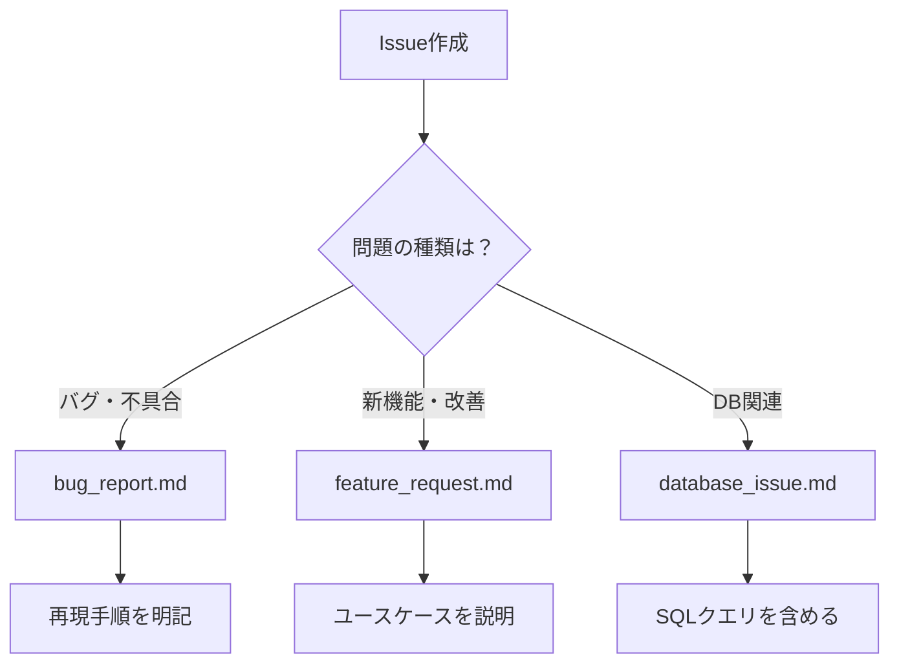

# 📝 Issue テンプレート

このディレクトリには、Issue作成時に使用するテンプレートが含まれています。  
適切なテンプレートを選択することで、必要な情報を漏れなく記載できます。

## 🎯 テンプレート一覧

### 1. バグ報告 (`bug_report.md`)

**使用場面**: システムの不具合や予期しない動作を報告する場合

**記載項目**:

- 問題の概要
- 再現手順
- 期待される動作
- 実際の動作
- スクリーンショット
- 環境情報

### 2. 機能要望 (`feature_request.md`)

**使用場面**: 新機能の追加や既存機能の改善を提案する場合

**記載項目**:

- 提案の概要
- 解決したい課題
- 提案する解決策
- 代替案の検討
- 追加情報

### 3. データベース関連 (`database_issue.md`)

**使用場面**: データベースに関する問題や改善を報告する場合

**記載項目**:

- 問題の種類（パフォーマンス、エラー、設計など）
- 影響を受けるテーブル/クエリ
- エラーメッセージ
- パフォーマンスメトリクス
- 提案する改善策

## 📋 テンプレート選択ガイド



## 🔧 使用方法

### GitHub Web UI から

1. リポジトリの **Issues** タブをクリック
2. **New issue** ボタンをクリック
3. 適切なテンプレートの **Get started** をクリック
4. テンプレートに従って情報を記入
5. **Submit new issue** をクリック

### GitHub CLI から

```bash
# バグ報告
gh issue create --template bug_report.md

# 機能要望
gh issue create --template feature_request.md

# データベース関連
gh issue create --template database_issue.md
```

## 📝 記載のベストプラクティス

### ✅ 良い例

- **具体的なタイトル**: `ログイン時にパスワード入力後エラー500が発生`
- **詳細な再現手順**: ステップバイステップで記載
- **環境情報の明記**: OS、ブラウザ、バージョン等
- **スクリーンショット添付**: エラー画面やUIの問題

### ❌ 悪い例

- **曖昧なタイトル**: `エラーが出る`
- **不完全な情報**: `動かない`
- **環境情報なし**: 再現できない
- **重複Issue**: 既存Issueを確認せず作成

## 🏷️ ラベルの自動付与

テンプレート使用時、以下のラベルが自動的に付与されます：

| テンプレート       | 自動付与ラベル                  |
| ------------------ | ------------------------------- |
| bug_report.md      | `type: bug`, `status: new`      |
| feature_request.md | `type: feature`, `status: new`  |
| database_issue.md  | `type: database`, `status: new` |

## 🔄 テンプレートのカスタマイズ

### 新しいテンプレート追加

```yaml
# .github/ISSUE_TEMPLATE/new_template.md
---
name: テンプレート名
about: テンプレートの説明
title: '[カテゴリ] '
labels: 'type: new'
assignees: ''
---

## 概要
<!-- 問題や要望の概要を記載 -->

## 詳細
<!-- 詳細な情報を記載 -->
```

### 既存テンプレート編集

1. 該当の `.md` ファイルを編集
2. YAMLフロントマターでメタデータ設定
3. Markdownで本文テンプレート記述

## 📊 使用統計

### テンプレート利用率（2025年8月）

- バグ報告: 45%
- 機能要望: 35%
- データベース関連: 20%

### 効果

- Issue作成時間: 50%短縮
- 情報不足による再確認: 80%削減
- 対応時間: 30%改善

## 🚀 今後の拡張予定

- [ ] パフォーマンス問題用テンプレート
- [ ] セキュリティ脆弱性報告用テンプレート
- [ ] ドキュメント改善用テンプレート
- [ ] 質問用テンプレート

## 📖 関連ドキュメント

- [IDDプロセス規則](../../.claude/rules/idd-process.md)
- [ラベル管理ガイド](../LABEL_MANAGEMENT_GUIDE.md)
- [コントリビューションガイド](../../CONTRIBUTING.md)

---

**最終更新**: 2025-08-15  
**Issue**: #94 - プロジェクト全体の品質改善
