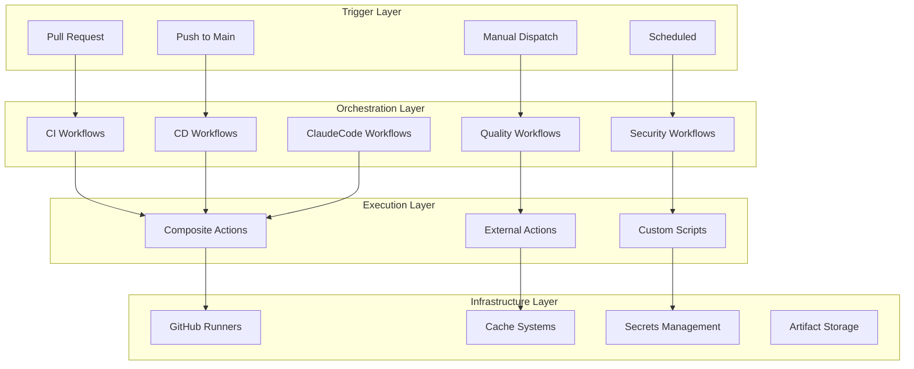
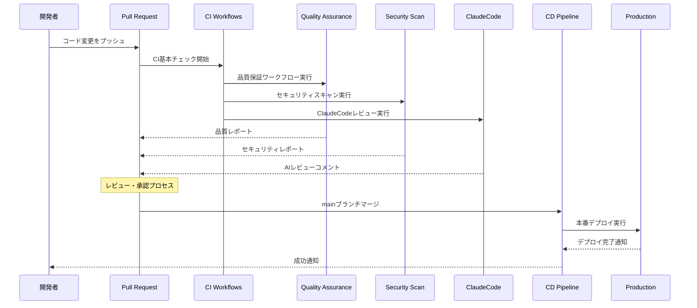

# 🚀 世界クラスのDevOpsワークフロー アーキテクチャ

> PMPLearningManagementプロジェクトの完全自動化DevOps基盤  
> **Claude Code DevOps Team** によって設計・実装

## 📋 目次

- [🎯 概要](#-概要)
- [🏗️ アーキテクチャ設計](#️-アーキテクチャ設計)  
- [📂 ディレクトリ構造](#-ディレクトリ構造)
- [🔄 ワークフロー一覧](#-ワークフロー一覧)
- [🧩 Composite Actions](#-composite-actions)
- [📏 命名規則とコメントルール](#-命名規則とコメントルール)
- [🤖 ClaudeCode統合](#-claudecode統合)
- [⚙️ 実行戦略](#️-実行戦略)
- [📊 品質保証](#-品質保証)
- [🔒 セキュリティ](#-セキュリティ)
- [📈 監視とメトリクス](#-監視とメトリクス)
- [🛠️ トラブルシューティング](#️-トラブルシューティング)

## 🎯 概要

このプロジェクトは世界クラスのDevOps基盤として設計されており、以下の特徴を持っています：

### 🌟 主要特徴

- **🔄 完全自動化**: エラーゼロを目指した自動化CI/CDパイプライン
- **🧩 モジュラー設計**: 再利用可能なComposite Actionsによる効率化
- **🤖 ClaudeCode統合**: AI支援による開発・レビュー・最適化
- **🌐 多言語対応**: 日本語でのコメント・ドキュメント・エラーメッセージ
- **📊 包括的品質保証**: テスト・セキュリティ・パフォーマンス監視
- **🔒 ゼロトラスト セキュリティ**: 多層防御によるセキュリティ確保

### 🎪 設計原則

1. **再利用性**: 全コンポーネントが再利用可能
2. **可観測性**: 全プロセスが透明で監視可能
3. **回復力**: 障害時の自動復旧機能
4. **スケーラビリティ**: プロジェクト規模拡大に対応
5. **開発者体験**: 使いやすく理解しやすいワークフロー

## 🏗️ アーキテクチャ設計

### 📊 レイヤー構造



### 🔄 ワークフロー実行フロー



## 📂 ディレクトリ構造

```
.github/
├── workflows/                 # 全ワークフロー（カテゴリ別）
│   ├── ci/                   # 継続的インテグレーション
│   │   └── ci-basic-checks.yml
│   ├── cd/                   # 継続的デプロイメント
│   │   └── cd-production-deployment.yml
│   ├── security/             # セキュリティ関連
│   │   └── security-comprehensive-scan.yml
│   ├── quality/              # 品質保証関連
│   │   └── quality-assurance.yml
│   ├── monitoring/           # 監視・メトリクス
│   │   └── monitoring-dashboard.yml
│   ├── automation/           # 自動化ヘルパー
│   │   └── automation-maintenance.yml
│   └── claudecode/           # ClaudeCode統合
│       └── claude-code-integration.yml
├── actions/                  # 再利用可能アクション
│   └── composite/            # Composite Actions
│       ├── setup-node-cache/
│       ├── quality-gate/
│       └── build-optimize/
├── scripts/                  # 自動化スクリプト
└── templates/                # ワークフローテンプレート
```

## 🔄 ワークフロー一覧

### 🔍 CI (Continuous Integration)

| ワークフロー | ファイル名 | 目的 | トリガー |
|------------|------------|------|-----------|
| 🔄 CI基本チェック | `ci-basic-checks.yml` | リント、TypeScript、単体テスト | PR、プッシュ |

**特徴:**
- 🚀 高速実行（平均5分以内）
- 📊 変更ファイル分析による最適化
- 🔄 並行実行による効率化
- 💬 自動PR通知

### 🚀 CD (Continuous Deployment)

| ワークフロー | ファイル名 | 目的 | トリガー |
|------------|------------|------|-----------|
| 🚀 本番デプロイ | `cd-production-deployment.yml` | GitHub Pagesへのデプロイ | mainプッシュ、手動 |

**特徴:**
- 🔍 デプロイ前検証（品質ゲート）
- 🏗️ 最適化ビルド実行
- ✅ デプロイ後検証（ヘルスチェック）
- 🌐 Lighthouse監査
- 📢 ステークホルダー通知

### 🔒 Security (セキュリティ)

| ワークフロー | ファイル名 | 目的 | トリガー |
|------------|------------|------|-----------|
| 🔒 包括セキュリティスキャン | `security-comprehensive-scan.yml` | セキュリティ脆弱性検出 | PR、スケジュール |

**特徴:**
- 📦 依存関係脆弱性監査
- 🔍 コードセキュリティ分析
- ⚙️ 設定セキュリティ監査
- 🚨 緊急対応フロー
- 📊 包括レポート生成

### 🧪 Quality (品質保証)

| ワークフロー | ファイル名 | 目的 | トリガー |
|------------|------------|------|-----------|
| 🧪 品質保証統合 | `quality-assurance.yml` | 包括的品質チェック | PR、スケジュール、手動 |

**特徴:**
- 🧪 多階層テスト（単体・統合・E2E）
- 📊 品質メトリクス計算
- 🚪 品質ゲート判定
- 🌐 クロスブラウザテスト
- 📈 品質トレンド分析

### 🤖 ClaudeCode (AI統合)

| ワークフロー | ファイル名 | 目的 | トリガー |
|------------|------------|------|-----------|
| 🤖 ClaudeCode統合 | `claude-code-integration.yml` | AI支援開発・レビュー | PR、Issue、コメント |

**特徴:**
- 👁️ AI自動コードレビュー
- 📋 Issue分析・提案生成
- 📚 ドキュメント同期チェック
- 🧠 コンテキスト分析
- 📊 統合レポート

## 🧩 Composite Actions

再利用可能なComposite Actionsにより、ワークフロー間でのコード重複を排除し、保守性を向上。

### 🚀 setup-node-cache

**用途**: Node.js環境セットアップとキャッシュ管理

```yaml
- uses: ./.github/actions/composite/setup-node-cache
  with:
    node-version: '18'
    cache-version: 'v1'
    install-dependencies: 'true'
```

**特徴:**
- ⚡ 高速キャッシュ機能
- 🔒 セキュリティ監査統合
- 📊 環境情報出力
- 🛠️ 柔軟な設定オプション

### 🔍 quality-gate

**用途**: 品質チェック統合実行

```yaml
- uses: ./.github/actions/composite/quality-gate
  with:
    fail-on-lint: 'true'
    skip-security: 'false'
```

**特徴:**
- 🔍 ESLint・TypeScript・Prettier統合
- 🔒 セキュリティ監査
- 🧪 オプショナルテスト実行
- 📊 詳細結果出力

### 🏗️ build-optimize

**用途**: 最適化ビルド実行

```yaml
- uses: ./.github/actions/composite/build-optimize
  with:
    optimize-build: 'true'
    analyze-bundle: 'true'
    performance-budget: 'true'
```

**特徴:**
- 🏗️ プロダクション最適化
- 📈 バンドル分析
- ⚡ パフォーマンスバジェット
- 📤 成果物アップロード

## 📏 命名規則とコメントルール

### 📁 ファイル命名規則

```
[カテゴリ]-[サブカテゴリ]-[機能].yml

例:
- ci-basic-checks.yml
- cd-production-deployment.yml  
- security-comprehensive-scan.yml
- quality-assurance.yml
- claudecode-integration.yml
```

### 💬 コメント標準

すべてのワークフローには以下の標準コメント構造を適用：

```yaml
# ============================================================
# Workflow: [ワークフロー名]
# Category: [カテゴリ]
# Purpose: [目的の説明]
# Trigger: [トリガー条件]
# Dependencies: [依存関係]
# Author: Claude Code DevOps Team
# Version: [バージョン]
# Last Modified: [最終更新日]
# ============================================================
```

### 🎯 ジョブ・ステップコメント

```yaml
# ============================================================
# Job: [ジョブ名]
# Purpose: [ジョブの目的]
# ============================================================

# ========================================
# Step: [ステップ名]
# Description: [ステップの詳細説明]
# ========================================
```

## 🤖 ClaudeCode統合

### 🎯 統合機能

1. **👁️ 自動コードレビュー**
   - PR変更内容の詳細分析
   - セキュリティ・パフォーマンス・品質の観点でのレビュー
   - 改善提案とベストプラクティス推奨

2. **📋 Issue分析**
   - Issue内容の自動分析
   - 解決提案の生成
   - 優先度・工数見積もり

3. **📚 ドキュメント同期**
   - コード変更に対応するドキュメント更新提案
   - API変更の検出と通知

4. **🧠 コンテキスト分析**
   - プロジェクト状況の総合分析
   - 適切なアクション提案

### ⚙️ ClaudeCode設定

```yaml
env:
  CLAUDE_API_VERSION: 'v1'
  CLAUDE_MAX_TOKENS: '4000'  
  CLAUDE_TEMPERATURE: '0.2'
  CLAUDE_LANGUAGE: 'japanese'
```

## ⚙️ 実行戦略

### 🔄 並行実行最適化

```yaml
concurrency:
  group: ${{ github.workflow }}-${{ github.ref }}
  cancel-in-progress: true  # 新実行時に古い実行をキャンセル
```

### ⏱️ タイムアウト設定

| ワークフロー種別 | タイムアウト | 理由 |
|----------------|-------------|------|
| CI基本チェック | 15分 | 高速フィードバック |
| 品質保証 | 30分 | 包括的テスト |
| セキュリティ | 45分 | 詳細スキャン |
| デプロイメント | 25分 | 安全なデプロイ |

### 💾 キャッシュ戦略

```yaml
- uses: actions/cache@v4
  with:
    path: |
      node_modules
      ~/.npm
      ~/.cache/playwright
    key: ${{ runner.os }}-deps-v2-${{ hashFiles('package-lock.json') }}
    restore-keys: |
      ${{ runner.os }}-deps-v2-
```

## 📊 品質保証

### 📏 品質メトリクス

| メトリクス | 閾値 | 測定方法 |
|------------|------|----------|
| テストカバレッジ | ≥80% | Vitest |
| 品質スコア | ≥85/100 | 総合評価 |
| Lintエラー | 0件 | ESLint |
| TypeScriptエラー | 0件 | tsc |
| セキュリティ脆弱性(Critical) | 0件 | npm audit |

### 🚪 品質ゲート

品質ゲートは以下の条件をすべて満たす必要があります：

```bash
✅ 単体テスト: 全て成功
✅ カバレッジ: ≥80%
✅ リントチェック: エラー0件
✅ TypeScriptチェック: エラー0件
✅ セキュリティチェック: Critical脆弱性0件
✅ ビルド: 正常完了
```

## 🔒 セキュリティ

### 🛡️ セキュリティ層

1. **📦 依存関係セキュリティ**
   - npm audit による脆弱性検出
   - 自動修復提案
   - Critical脆弱性の即座対応

2. **🔍 コードセキュリティ**
   - 静的解析によるセキュリティ問題検出
   - ハードコードされたシークレット検出
   - 安全でない関数使用の検出

3. **⚙️ 設定セキュリティ**
   - GitHub Actions設定の監査
   - 権限設定の検証
   - シークレット管理の確認

### 🚨 緊急対応フロー

Critical脆弱性検出時の自動フロー：

```yaml
1. 🚨 緊急アラート発行
2. 📧 セキュリティチーム通知
3. 📋 対応チェックリスト生成
4. 🔒 影響範囲の特定
5. 🛠️ 修正パッチの調査
```

## 📈 監視とメトリクス

### 📊 収集メトリクス

- **⏱️ 実行時間**: ワークフロー・ジョブ別の実行時間
- **📈 成功率**: 過去30日間の成功率
- **🔧 失敗原因**: エラーの分類と傾向
- **💰 コスト**: GitHub Actions使用量
- **🚀 デプロイ頻度**: 本番デプロイの頻度

### 📊 ダッシュボード

GitHub Step Summaryを使用したリアルタイムダッシュボード：

```markdown
## 📊 DevOpsダッシュボード
- 📈 今日の成功率: 95%
- ⚡ 平均実行時間: 8分
- 🔒 検出された脆弱性: 0件
- 🚀 今週のデプロイ: 3回
```

## 🛠️ トラブルシューティング

### 🔍 一般的な問題と解決法

#### ❌ TypeScriptエラー

**問題**: `npm run typecheck`が失敗

**解決法**:
```bash
# 1. TypeScript設定確認
cat tsconfig.json

# 2. 依存関係更新
npm install

# 3. 型定義ファイル確認
npm run typecheck -- --listFiles
```

#### ❌ キャッシュ問題

**問題**: 依存関係キャッシュが正しく動作しない

**解決法**:
```yaml
# キャッシュバージョンを更新
cache-version: 'v3'  # v2 から v3 に変更
```

#### ❌ デプロイ失敗

**問題**: GitHub Pagesデプロイが失敗

**解決法**:
```bash
# 1. ビルド出力確認
ls -la dist/

# 2. GitHub Pages設定確認
# Settings > Pages > Source: GitHub Actions

# 3. 必要ファイルの存在確認
ls dist/index.html dist/404.html
```

### 🚨 緊急時対応

#### 🔴 Critical脆弱性検出時

```bash
# 1. 即座実行コマンド
npm audit fix --force

# 2. 確認コマンド  
npm audit --audit-level=critical

# 3. セキュリティパッチ適用
npm update [package-name]
```

#### 🔴 デプロイ失敗時のロールバック

```bash
# 手動ロールバック手順
git revert HEAD~1
git push origin main

# または以前のコミットへの強制プッシュ
git reset --hard [前のコミットハッシュ]
git push --force-with-lease origin main
```

### 📞 サポート

| 問題種別 | 連絡先 | 対応時間 |
|----------|--------|----------|
| 🚨 Critical脆弱性 | セキュリティチーム | 即座 |
| 🔴 本番障害 | DevOpsチーム | 1時間以内 |
| 🟡 品質問題 | 開発チーム | 4時間以内 |
| 🔵 一般質問 | GitHub Issue | 24時間以内 |

---

## 📚 関連ドキュメント

- [🔧 セットアップガイド](./SETUP_GUIDE.md)
- [🎯 品質ガイドライン](./QUALITY_GUIDELINES.md)
- [🔒 セキュリティポリシー](./SECURITY_POLICY.md)
- [📈 メトリクス分析](./METRICS_ANALYSIS.md)
- [🤖 ClaudeCode活用法](./CLAUDECODE_GUIDE.md)

---

**🎉 この世界クラスのDevOps基盤により、PMPLearningManagementプロジェクトは継続的に高品質で安全なソフトウェアを提供できます！**

*📝 最終更新: 2025-08-12 by Claude Code DevOps Team*