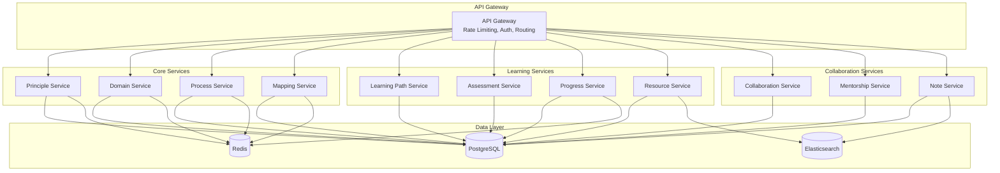

# API Architecture for PMBOK 7th Edition

## Overview

This document describes the comprehensive RESTful API architecture for PMBOK 7th Edition integration, providing detailed endpoint specifications, service boundaries, and implementation guidelines.

## Service Architecture



## API Design Principles

### 1. RESTful Design
- Resource-based URLs
- Standard HTTP methods (GET, POST, PUT, DELETE, PATCH)
- Stateless communication
- HATEOAS where applicable

### 2. Versioning Strategy
- URL path versioning: `/api/v1/`, `/api/v2/`
- Header-based versioning for minor changes
- Sunset headers for deprecated endpoints

### 3. Pagination
```json
{
  "data": [...],
  "pagination": {
    "page": 1,
    "limit": 20,
    "total": 100,
    "totalPages": 5,
    "hasNext": true,
    "hasPrev": false
  },
  "links": {
    "self": "/api/v1/principles?page=1&limit=20",
    "next": "/api/v1/principles?page=2&limit=20",
    "last": "/api/v1/principles?page=5&limit=20"
  }
}
```

### 4. Error Handling
```json
{
  "error": {
    "code": "RESOURCE_NOT_FOUND",
    "message": "The requested principle was not found",
    "details": {
      "principleId": "cuid123",
      "timestamp": "2024-01-01T12:00:00Z"
    },
    "traceId": "abc-123-def-456"
  }
}
```

## Core API Endpoints

### Principles API

#### List Principles
```http
GET /api/v1/principles
```

**Query Parameters:**
- `page` (integer): Page number (default: 1)
- `limit` (integer): Items per page (default: 20, max: 100)
- `search` (string): Full-text search query
- `complexity` (enum): Filter by complexity level
- `includeActions` (boolean): Include key actions
- `includeExamples` (boolean): Include examples
- `includeMappings` (boolean): Include domain mappings
- `sort` (string): Sort field and order (e.g., "name:asc", "complexity:desc")

**Response:**
```json
{
  "data": [
    {
      "id": "cuid123",
      "code": "stewardship",
      "name": "スチュワードシップ",
      "nameEn": "Stewardship",
      "description": "誠実で、思いやりがあり、責任感のあるスチュワードであること",
      "complexity": "MEDIUM",
      "order": 1,
      "keyActions": [
        {
          "id": "action1",
          "action": "倫理的な意思決定",
          "actionEn": "Ethical decision making",
          "order": 1
        }
      ],
      "_links": {
        "self": "/api/v1/principles/cuid123",
        "domains": "/api/v1/principles/cuid123/domains",
        "resources": "/api/v1/principles/cuid123/resources"
      }
    }
  ],
  "pagination": {...}
}
```

#### Get Single Principle
```http
GET /api/v1/principles/{id}
```

**Path Parameters:**
- `id` (string): Principle ID (CUID format)

**Query Parameters:**
- `includeAll` (boolean): Include all related data

#### Update Principle
```http
PUT /api/v1/principles/{id}
```

**Request Body:**
```json
{
  "name": "Updated name",
  "description": "Updated description",
  "complexity": "HIGH",
  "iconUrl": "https://example.com/icon.png"
}
```

#### Bulk Operations
```http
POST /api/v1/principles/bulk-update
```

**Request Body:**
```json
{
  "principles": [
    {
      "id": "cuid123",
      "updates": {
        "complexity": "HIGH"
      }
    },
    {
      "id": "cuid456",
      "updates": {
        "order": 2
      }
    }
  ]
}
```

### Performance Domains API

#### List Domains
```http
GET /api/v1/domains
```

**Query Parameters:**
- `page`, `limit`, `search` (same as principles)
- `includeFocusAreas` (boolean): Include focus areas
- `includeOutcomes` (boolean): Include outcomes
- `includeInteractions` (boolean): Include domain interactions
- `includeIndicators` (boolean): Include performance indicators

#### Domain Interactions
```http
GET /api/v1/domains/{id}/interactions
```

**Response:**
```json
{
  "data": {
    "domain": {
      "id": "domain1",
      "name": "Stakeholder Performance Domain"
    },
    "interactions": [
      {
        "id": "interaction1",
        "toDomain": {
          "id": "domain2",
          "name": "Team Performance Domain"
        },
        "interactionType": "STRONG",
        "strength": 8,
        "description": "Strong collaboration required"
      }
    ],
    "interactionMap": {
      "nodes": [...],
      "edges": [...]
    }
  }
}
```

#### Performance Measurements
```http
POST /api/v1/domains/{id}/measurements
```

**Request Body:**
```json
{
  "indicatorId": "indicator1",
  "value": 85.5,
  "context": {
    "projectId": "project123",
    "phase": "execution",
    "notes": "Q4 measurement"
  }
}
```

### Mapping API

#### Get Version Mappings
```http
GET /api/v1/mappings/v6-to-v7
```

**Query Parameters:**
- `sourceType` (enum): "process", "knowledge_area", "process_group"
- `sourceId` (string): Source entity ID
- `targetType` (enum): "principle", "domain"

**Response:**
```json
{
  "data": {
    "source": {
      "type": "process",
      "id": "process1",
      "name": "Develop Project Charter"
    },
    "mappings": {
      "principles": [
        {
          "principle": {...},
          "mappingType": "PRIMARY",
          "relevanceScore": 9,
          "rationale": "Direct alignment with value delivery"
        }
      ],
      "domains": [
        {
          "domain": {...},
          "mappingType": "PRIMARY",
          "relevanceScore": 10,
          "rationale": "Core planning activity"
        }
      ]
    }
  }
}
```

### Learning Path API

#### List Learning Paths
```http
GET /api/v1/learning-paths
```

**Query Parameters:**
- `level` (enum): "BEGINNER", "INTERMEDIATE", "ADVANCED", "EXPERT"
- `pmbokVersion` (enum): "V6", "V7", "BOTH"
- `estimatedHours` (range): "0-20", "20-40", "40+"

#### Enroll in Path
```http
POST /api/v1/learning-paths/{id}/enroll
```

**Response:**
```json
{
  "data": {
    "enrollmentId": "enrollment1",
    "pathId": "path1",
    "status": "ACTIVE",
    "startedAt": "2024-01-01T10:00:00Z",
    "steps": [
      {
        "id": "step1",
        "name": "Understanding Stewardship",
        "type": "PRINCIPLE",
        "estimatedMinutes": 30,
        "status": "NOT_STARTED"
      }
    ]
  }
}
```

#### Update Progress
```http
PATCH /api/v1/learning-paths/enrollments/{enrollmentId}/progress
```

**Request Body:**
```json
{
  "stepId": "step1",
  "status": "COMPLETED",
  "timeSpentMinutes": 25,
  "score": 90
}
```

### Assessment API

#### Start Assessment
```http
POST /api/v1/assessments/{id}/start
```

**Response:**
```json
{
  "data": {
    "attemptId": "attempt1",
    "assessmentId": "assessment1",
    "startedAt": "2024-01-01T10:00:00Z",
    "timeLimit": 180,
    "questions": [
      {
        "id": "q1",
        "type": "SINGLE_CHOICE",
        "question": "Which principle emphasizes ethical behavior?",
        "options": [
          {
            "id": "opt1",
            "text": "Stewardship"
          },
          {
            "id": "opt2",
            "text": "Team"
          }
        ]
      }
    ]
  }
}
```

#### Submit Answers
```http
POST /api/v1/assessments/attempts/{attemptId}/submit
```

**Request Body:**
```json
{
  "answers": [
    {
      "questionId": "q1",
      "selectedOptions": ["opt1"]
    }
  ],
  "timeSpent": 2700
}
```

### Progress API

#### Get User Progress Overview
```http
GET /api/v1/progress/overview
```

**Response:**
```json
{
  "data": {
    "overall": {
      "progressPercent": 65,
      "completedItems": 26,
      "totalItems": 40,
      "timeSpentHours": 45.5
    },
    "byCategory": {
      "principles": {
        "completed": 8,
        "total": 12,
        "progressPercent": 66.7
      },
      "domains": {
        "completed": 5,
        "total": 8,
        "progressPercent": 62.5
      }
    },
    "recentActivity": [...],
    "achievements": [...],
    "recommendations": [...]
  }
}
```

## Advanced Features

### 1. Batch Operations
```http
POST /api/v1/batch
```

**Request Body:**
```json
{
  "operations": [
    {
      "method": "GET",
      "url": "/api/v1/principles/cuid123"
    },
    {
      "method": "GET",
      "url": "/api/v1/domains/cuid456"
    }
  ]
}
```

### 2. GraphQL Alternative
```graphql
query GetPrincipleWithDomains($principleId: ID!) {
  principle(id: $principleId) {
    id
    name
    nameEn
    keyActions {
      action
      actionEn
    }
    domainMappings {
      domain {
        id
        name
        focusAreas {
          area
        }
      }
      mappingType
      relevanceScore
    }
  }
}
```

### 3. WebSocket Real-time Updates
```javascript
// WebSocket connection for real-time progress updates
const ws = new WebSocket('wss://api.pmplm.com/ws');

ws.on('message', (data) => {
  const update = JSON.parse(data);
  if (update.type === 'PROGRESS_UPDATE') {
    updateProgressUI(update.data);
  }
});

// Subscribe to specific updates
ws.send(JSON.stringify({
  action: 'subscribe',
  topics: ['progress', 'achievements', 'collaboration']
}));
```

### 4. Server-Sent Events for Notifications
```http
GET /api/v1/notifications/stream
```

**Response (SSE):**
```
event: notification
data: {"type": "ACHIEVEMENT_UNLOCKED", "achievement": "First Principle Mastered"}

event: progress
data: {"principleId": "cuid123", "progress": 100}
```

## Authentication & Authorization

### JWT Token Structure
```json
{
  "sub": "user123",
  "email": "user@example.com",
  "role": "STUDENT",
  "permissions": [
    "read:principles",
    "read:domains",
    "write:progress",
    "write:notes"
  ],
  "iat": 1704067200,
  "exp": 1704070800
}
```

### Role-Based Access Control (RBAC)

| Role | Permissions |
|------|------------|
| GUEST | Read public content |
| STUDENT | Read all, write own progress |
| MENTOR | Read all, write mentorship data |
| INSTRUCTOR | Read all, write assessments |
| ADMIN | Full access |

## Rate Limiting

### Rate Limit Headers
```http
X-RateLimit-Limit: 100
X-RateLimit-Remaining: 95
X-RateLimit-Reset: 1704067200
```

### Rate Limit Tiers

| Tier | Requests/Minute | Requests/Hour |
|------|----------------|---------------|
| Guest | 20 | 100 |
| Free | 60 | 500 |
| Premium | 200 | 2000 |
| Enterprise | Unlimited | Unlimited |

## Caching Strategy

### Cache Headers
```http
Cache-Control: public, max-age=3600
ETag: "686897696a7c876b7e"
Last-Modified: Mon, 01 Jan 2024 10:00:00 GMT
```

### Cache Invalidation
```http
POST /api/v1/cache/invalidate
```

**Request Body:**
```json
{
  "patterns": [
    "principles:*",
    "domains:cuid123",
    "user:456:progress"
  ]
}
```

## Performance Optimization

### 1. Field Selection
```http
GET /api/v1/principles?fields=id,name,code
```

### 2. Eager Loading
```http
GET /api/v1/principles?include=keyActions,examples,domainMappings
```

### 3. Compression
```http
Accept-Encoding: gzip, br
Content-Encoding: gzip
```

### 4. Conditional Requests
```http
If-None-Match: "686897696a7c876b7e"
If-Modified-Since: Mon, 01 Jan 2024 10:00:00 GMT
```

## Monitoring & Analytics

### Health Check
```http
GET /api/v1/health
```

**Response:**
```json
{
  "status": "healthy",
  "version": "1.0.0",
  "timestamp": "2024-01-01T10:00:00Z",
  "services": {
    "database": "healthy",
    "redis": "healthy",
    "elasticsearch": "healthy"
  },
  "metrics": {
    "responseTime": 15,
    "uptime": 864000,
    "requestsPerMinute": 150
  }
}
```

### Metrics Endpoint
```http
GET /api/v1/metrics
```

**Response (Prometheus format):**
```
# HELP api_requests_total Total API requests
# TYPE api_requests_total counter
api_requests_total{method="GET",endpoint="/principles",status="200"} 1234

# HELP api_response_time_seconds API response time
# TYPE api_response_time_seconds histogram
api_response_time_seconds_bucket{le="0.05"} 8123
api_response_time_seconds_bucket{le="0.1"} 9534
```

## Security Best Practices

1. **Input Validation**: All inputs validated using Zod schemas
2. **SQL Injection Prevention**: Parameterized queries via Prisma
3. **XSS Protection**: Content-Security-Policy headers
4. **CORS Configuration**: Whitelist allowed origins
5. **API Key Rotation**: Regular key rotation for service accounts
6. **Audit Logging**: All write operations logged
7. **Data Encryption**: TLS 1.3 for transit, AES-256 for storage

## API Documentation

### OpenAPI Specification
Available at: `/api/v1/openapi.yaml`

### Interactive Documentation
- Swagger UI: `/api/v1/docs`
- ReDoc: `/api/v1/redoc`
- Postman Collection: `/api/v1/postman.json`

## Conclusion

This API architecture provides:

1. **Comprehensive Coverage**: All PMBOK 7th Edition entities and relationships
2. **Performance**: Sub-100ms response times with caching
3. **Scalability**: Horizontal scaling ready with stateless design
4. **Security**: Industry-standard authentication and authorization
5. **Developer Experience**: Clear documentation and consistent patterns
6. **Monitoring**: Built-in health checks and metrics

The architecture supports seamless integration with the existing frontend while providing a robust foundation for future enhancements.