# Database Architecture for PMBOK 7th Edition Integration

## Executive Summary

This document outlines the comprehensive database architecture for integrating PMBOK 7th Edition principles and performance domains with the existing 6th Edition framework. The design supports seamless dual-mode operation, advanced relationship modeling, and scalable performance optimization.

## Entity Relationship Diagram

```mermaid
erDiagram
    User ||--o{ UserProfile : has
    User ||--o{ UserProgress : tracks
    User ||--o{ ExamAttempt : takes
    User ||--o{ PathEnrollment : enrolls
    
    Principle ||--o{ KeyAction : contains
    Principle ||--o{ PrincipleExample : demonstrates
    Principle ||--o{ PrincipleDomainMapping : maps_to
    
    PerformanceDomain ||--o{ FocusArea : includes
    PerformanceDomain ||--o{ DomainOutcome : produces
    PerformanceDomain ||--o{ DomainInteraction : interacts_with
    PerformanceDomain ||--o{ PrincipleDomainMapping : mapped_from
    PerformanceDomain ||--o{ ProcessDomainMapping : relates_to
    
    DomainOutcome ||--o{ PerformanceIndicator : measured_by
    PerformanceIndicator ||--o{ PerformanceMeasurement : records
    
    Process ||--o{ ITTO : uses_inputs
    Process ||--o{ ITTO : uses_tools
    Process ||--o{ ITTO : produces_outputs
    Process }o--|| KnowledgeArea : belongs_to
    Process }o--|| ProcessGroup : belongs_to
    Process ||--o{ ProcessDomainMapping : maps_to
    
    LearningPath ||--o{ LearningStep : contains
    LearningStep ||--o{ StepPrerequisite : requires
    PathEnrollment ||--o{ StepProgress : tracks
    
    Assessment ||--o{ Question : contains
    Question ||--o{ QuestionOption : has
    ExamAttempt ||--o{ Answer : collects
    
    StudyGroup ||--o{ StudyGroupMember : has
    StudyGroup ||--o{ Discussion : hosts
    Discussion ||--o{ Comment : contains
```



## Core Data Models

### 1. PMBOK 7th Edition Models

#### Principles (12 core principles)
```sql
CREATE TABLE principles (
    id CUID PRIMARY KEY,
    code VARCHAR(50) UNIQUE NOT NULL, -- e.g., 'stewardship', 'team'
    name VARCHAR(255) NOT NULL,
    name_en VARCHAR(255) NOT NULL,
    description TEXT NOT NULL,
    description_en TEXT NOT NULL,
    details TEXT NOT NULL,
    details_en TEXT NOT NULL,
    order_index INTEGER NOT NULL,
    icon_url VARCHAR(500),
    version VARCHAR(10) DEFAULT 'V7',
    complexity VARCHAR(20) DEFAULT 'MEDIUM',
    created_at TIMESTAMP DEFAULT NOW(),
    updated_at TIMESTAMP DEFAULT NOW()
);

CREATE INDEX idx_principles_code ON principles(code);
CREATE INDEX idx_principles_name ON principles USING gin(to_tsvector('japanese', name));
```

#### Performance Domains (8 domains)
```sql
CREATE TABLE performance_domains (
    id CUID PRIMARY KEY,
    code VARCHAR(50) UNIQUE NOT NULL, -- e.g., 'stakeholder', 'team'
    name VARCHAR(255) NOT NULL,
    name_en VARCHAR(255) NOT NULL,
    description TEXT NOT NULL,
    description_en TEXT NOT NULL,
    order_index INTEGER NOT NULL,
    icon_url VARCHAR(500),
    version VARCHAR(10) DEFAULT 'V7',
    complexity VARCHAR(20) DEFAULT 'MEDIUM',
    created_at TIMESTAMP DEFAULT NOW(),
    updated_at TIMESTAMP DEFAULT NOW()
);

CREATE INDEX idx_domains_code ON performance_domains(code);
CREATE INDEX idx_domains_name ON performance_domains USING gin(to_tsvector('japanese', name));
```

### 2. Relationship Models

#### Principle-Domain Mapping
```sql
CREATE TABLE principle_domain_mappings (
    id CUID PRIMARY KEY,
    principle_id CUID NOT NULL REFERENCES principles(id),
    domain_id CUID NOT NULL REFERENCES performance_domains(id),
    mapping_type VARCHAR(20) NOT NULL, -- PRIMARY, SECONDARY, SUPPORTING, RELATED
    relevance_score INTEGER CHECK (relevance_score BETWEEN 1 AND 10),
    description TEXT,
    created_at TIMESTAMP DEFAULT NOW(),
    updated_at TIMESTAMP DEFAULT NOW(),
    UNIQUE(principle_id, domain_id)
);

CREATE INDEX idx_pdm_principle ON principle_domain_mappings(principle_id);
CREATE INDEX idx_pdm_domain ON principle_domain_mappings(domain_id);
CREATE INDEX idx_pdm_type ON principle_domain_mappings(mapping_type);
```

#### Domain Interactions
```sql
CREATE TABLE domain_interactions (
    id CUID PRIMARY KEY,
    from_domain_id CUID NOT NULL REFERENCES performance_domains(id),
    to_domain_id CUID NOT NULL REFERENCES performance_domains(id),
    interaction_type VARCHAR(20) NOT NULL, -- STRONG, MODERATE, WEAK, CONDITIONAL
    description TEXT,
    strength INTEGER DEFAULT 5 CHECK (strength BETWEEN 1 AND 10),
    created_at TIMESTAMP DEFAULT NOW(),
    updated_at TIMESTAMP DEFAULT NOW(),
    UNIQUE(from_domain_id, to_domain_id)
);

CREATE INDEX idx_di_from ON domain_interactions(from_domain_id);
CREATE INDEX idx_di_to ON domain_interactions(to_domain_id);
```

### 3. Performance Measurement

#### Performance Indicators
```sql
CREATE TABLE performance_indicators (
    id CUID PRIMARY KEY,
    outcome_id CUID NOT NULL REFERENCES domain_outcomes(id),
    name VARCHAR(255) NOT NULL,
    description TEXT,
    metric VARCHAR(100) NOT NULL, -- e.g., 'completion_rate', 'quality_score'
    target_value DECIMAL(10,2) NOT NULL,
    unit VARCHAR(50) NOT NULL, -- e.g., 'percentage', 'count', 'score'
    created_at TIMESTAMP DEFAULT NOW(),
    updated_at TIMESTAMP DEFAULT NOW()
);

CREATE INDEX idx_pi_outcome ON performance_indicators(outcome_id);
CREATE INDEX idx_pi_metric ON performance_indicators(metric);
```

#### Performance Measurements
```sql
CREATE TABLE performance_measurements (
    id CUID PRIMARY KEY,
    indicator_id CUID NOT NULL REFERENCES performance_indicators(id),
    user_id CUID NOT NULL REFERENCES users(id),
    value DECIMAL(10,2) NOT NULL,
    measured_at TIMESTAMP DEFAULT NOW(),
    context JSONB,
    INDEX idx_pm_indicator (indicator_id),
    INDEX idx_pm_user (user_id),
    INDEX idx_pm_time (measured_at)
);

-- Partitioning for time-series data
CREATE TABLE performance_measurements_2024 PARTITION OF performance_measurements
    FOR VALUES FROM ('2024-01-01') TO ('2025-01-01');
```

### 4. Integration with PMBOK 6th Edition

#### Process-Domain Mapping
```sql
CREATE TABLE process_domain_mappings (
    id CUID PRIMARY KEY,
    process_id CUID NOT NULL REFERENCES processes(id),
    domain_id CUID NOT NULL REFERENCES performance_domains(id),
    mapping_type VARCHAR(20) NOT NULL,
    relevance_score INTEGER CHECK (relevance_score BETWEEN 1 AND 10),
    description TEXT,
    created_at TIMESTAMP DEFAULT NOW(),
    updated_at TIMESTAMP DEFAULT NOW(),
    UNIQUE(process_id, domain_id)
);

CREATE INDEX idx_pdm_process ON process_domain_mappings(process_id);
CREATE INDEX idx_pdm_domain2 ON process_domain_mappings(domain_id);
```

## Indexing Strategy

### Primary Indexes
```sql
-- Full-text search indexes for Japanese and English content
CREATE INDEX idx_principles_fts ON principles 
    USING gin((to_tsvector('japanese', name) || to_tsvector('english', name_en)));

CREATE INDEX idx_domains_fts ON performance_domains 
    USING gin((to_tsvector('japanese', name) || to_tsvector('english', name_en)));

-- Composite indexes for common queries
CREATE INDEX idx_user_progress_lookup ON user_progress(user_id, entity_type, entity_id);
CREATE INDEX idx_learning_step_path ON learning_steps(path_id, order_index);

-- Partial indexes for filtered queries
CREATE INDEX idx_active_assessments ON assessments(type, pmbok_version) 
    WHERE is_active = true;

CREATE INDEX idx_public_resources ON learning_resources(type, pmbok_version) 
    WHERE is_public = true;
```

### Performance Optimization Indexes
```sql
-- BRIN indexes for time-series data
CREATE INDEX idx_measurements_time_brin ON performance_measurements 
    USING brin(measured_at);

-- Hash indexes for exact matches
CREATE INDEX idx_user_email_hash ON users USING hash(email);

-- Covering indexes for read-heavy queries
CREATE INDEX idx_principle_details ON principles(id) 
    INCLUDE (code, name, name_en, complexity);
```

## Query Optimization Patterns

### 1. Hierarchical Data Queries
```sql
-- Recursive CTE for learning path dependencies
WITH RECURSIVE path_hierarchy AS (
    SELECT id, name, parent_id, 1 as level
    FROM learning_steps
    WHERE parent_id IS NULL
    
    UNION ALL
    
    SELECT ls.id, ls.name, ls.parent_id, ph.level + 1
    FROM learning_steps ls
    JOIN path_hierarchy ph ON ls.parent_id = ph.id
)
SELECT * FROM path_hierarchy ORDER BY level, id;
```

### 2. Cross-Version Mapping Queries
```sql
-- Efficient query for PMBOK 6 to 7 mapping
SELECT 
    p.name as process_name,
    ka.name as knowledge_area,
    array_agg(DISTINCT pd.name) as related_domains,
    array_agg(DISTINCT pr.name) as related_principles
FROM processes p
JOIN knowledge_areas ka ON p.knowledge_area_id = ka.id
LEFT JOIN process_domain_mappings pdm ON p.id = pdm.process_id
LEFT JOIN performance_domains pd ON pdm.domain_id = pd.id
LEFT JOIN principle_domain_mappings prdm ON pd.id = prdm.domain_id
LEFT JOIN principles pr ON prdm.principle_id = pr.id
GROUP BY p.id, ka.id;
```

### 3. Performance Tracking Queries
```sql
-- Materialized view for user progress dashboard
CREATE MATERIALIZED VIEW mv_user_progress_summary AS
SELECT 
    u.id as user_id,
    COUNT(DISTINCT up.entity_id) FILTER (WHERE up.entity_type = 'PRINCIPLE') as principles_completed,
    COUNT(DISTINCT up.entity_id) FILTER (WHERE up.entity_type = 'DOMAIN') as domains_completed,
    AVG(up.progress_percent) as avg_progress,
    SUM(up.time_spent_minutes) as total_time_spent,
    MAX(up.last_accessed_at) as last_activity
FROM users u
LEFT JOIN user_progress up ON u.id = up.user_id
GROUP BY u.id;

CREATE UNIQUE INDEX ON mv_user_progress_summary(user_id);
REFRESH MATERIALIZED VIEW CONCURRENTLY mv_user_progress_summary;
```

## Caching Strategy

### 1. Redis Cache Layers

```javascript
// Cache key patterns
const cacheKeys = {
  principle: (id) => `principle:${id}`,
  principleList: (page, limit) => `principles:list:${page}:${limit}`,
  domain: (id) => `domain:${id}`,
  domainInteractions: (id) => `domain:${id}:interactions`,
  userProgress: (userId, type) => `user:${userId}:progress:${type}`,
  learningPath: (id) => `path:${id}`,
  assessment: (id) => `assessment:${id}`
};

// Cache TTL configuration
const cacheTTL = {
  static: 86400,      // 24 hours for static content
  userSpecific: 3600, // 1 hour for user-specific data
  realtime: 300,      // 5 minutes for frequently changing data
  computed: 1800      // 30 minutes for computed results
};
```

### 2. Query Result Caching

```sql
-- PostgreSQL query result cache using pg_stat_statements
CREATE EXTENSION IF NOT EXISTS pg_stat_statements;

-- Configure statement-level caching
ALTER SYSTEM SET pg_stat_statements.track = 'all';
ALTER SYSTEM SET pg_stat_statements.max = 10000;
```

## Migration Strategy

### 1. Data Migration from PMBOK 6 to 7

```sql
-- Migration script for existing process data
INSERT INTO process_domain_mappings (process_id, domain_id, mapping_type, relevance_score)
SELECT 
    p.id,
    pd.id,
    CASE 
        WHEN mapping_strength > 7 THEN 'PRIMARY'
        WHEN mapping_strength > 5 THEN 'SECONDARY'
        ELSE 'RELATED'
    END as mapping_type,
    mapping_strength as relevance_score
FROM (
    -- Complex mapping logic based on knowledge areas and process groups
    SELECT 
        p.id as process_id,
        pd.id as domain_id,
        calculate_mapping_strength(p.knowledge_area_id, p.process_group_id, pd.code) as mapping_strength
    FROM processes p
    CROSS JOIN performance_domains pd
    WHERE p.version = 'V6' AND pd.version = 'V7'
) mappings
WHERE mapping_strength > 3;
```

### 2. Backward Compatibility

```javascript
// API versioning for backward compatibility
const versionHandlers = {
  v6: {
    getProcesses: () => db.process.findMany({ where: { version: 'V6' } }),
    mapToV7: (processId) => mapProcessToDomains(processId)
  },
  v7: {
    getPrinciples: () => db.principle.findMany(),
    getDomains: () => db.performanceDomain.findMany(),
    mapToV6: (domainId) => mapDomainToProcesses(domainId)
  },
  dual: {
    getUnifiedView: () => combineVersionData()
  }
};
```

## Performance Benchmarks

### Expected Query Performance

| Query Type | Target Response Time | Optimization Strategy |
|------------|---------------------|----------------------|
| Single Entity Fetch | < 10ms | Primary key index |
| List with Pagination | < 50ms | Covering indexes |
| Full-text Search | < 100ms | GIN indexes |
| Complex Relationships | < 200ms | Materialized views |
| Analytics Queries | < 500ms | Pre-aggregation |
| Bulk Operations | < 1000ms | Batch processing |

### Scalability Targets

- **Concurrent Users**: 10,000+
- **Database Connections**: 200 (pooled)
- **Read QPS**: 5,000
- **Write QPS**: 500
- **Data Volume**: 1TB+
- **Cache Hit Rate**: > 90%

## Monitoring and Maintenance

### 1. Performance Monitoring

```sql
-- Query performance monitoring
CREATE OR REPLACE VIEW v_slow_queries AS
SELECT 
    query,
    calls,
    total_exec_time,
    mean_exec_time,
    stddev_exec_time,
    rows
FROM pg_stat_statements
WHERE mean_exec_time > 100
ORDER BY mean_exec_time DESC
LIMIT 50;
```

### 2. Index Maintenance

```sql
-- Automated index maintenance
CREATE OR REPLACE FUNCTION maintain_indexes()
RETURNS void AS $$
BEGIN
    -- Rebuild fragmented indexes
    REINDEX TABLE CONCURRENTLY principles;
    REINDEX TABLE CONCURRENTLY performance_domains;
    
    -- Update statistics
    ANALYZE principles;
    ANALYZE performance_domains;
    ANALYZE user_progress;
    
    -- Refresh materialized views
    REFRESH MATERIALIZED VIEW CONCURRENTLY mv_user_progress_summary;
END;
$$ LANGUAGE plpgsql;

-- Schedule weekly maintenance
SELECT cron.schedule('index-maintenance', '0 3 * * 0', 'SELECT maintain_indexes()');
```

## Security Considerations

### 1. Row-Level Security

```sql
-- Enable RLS for multi-tenant data
ALTER TABLE user_progress ENABLE ROW LEVEL SECURITY;

CREATE POLICY user_progress_policy ON user_progress
    FOR ALL
    USING (user_id = current_setting('app.current_user_id')::uuid);
```

### 2. Data Encryption

```sql
-- Transparent data encryption for sensitive columns
CREATE EXTENSION IF NOT EXISTS pgcrypto;

ALTER TABLE users 
    ALTER COLUMN email TYPE TEXT USING pgp_sym_encrypt(email, 'encryption_key');
```

## Conclusion

This database architecture provides:

1. **Comprehensive Data Model**: Full support for PMBOK 7th Edition with backward compatibility
2. **Optimized Performance**: Strategic indexing and caching for sub-100ms response times
3. **Scalability**: Designed to handle 10,000+ concurrent users
4. **Flexibility**: Easy migration path and dual-mode operation
5. **Maintainability**: Automated maintenance and monitoring

The architecture ensures seamless integration with the existing PMPLearningManagement system while providing a robust foundation for future growth and feature development.