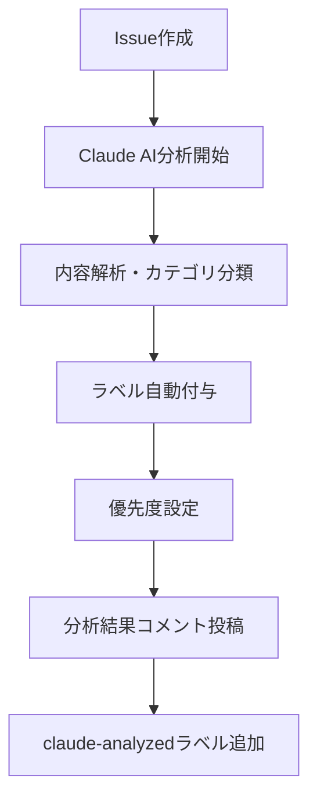
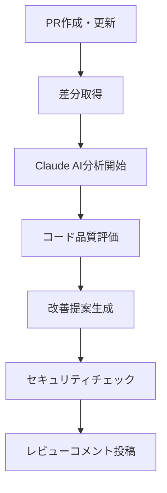

# 🤖 Claude AI統合機能 ユーザーガイド

## 📖 目次
1. [概要](#概要)
2. [Issue Handler の使い方](#issue-handler-の使い方)
3. [PR Review の使い方](#pr-review-の使い方)
4. [@Claude メンション機能](#claude-メンション機能)
5. [ベストプラクティス](#ベストプラクティス)
6. [トラブルシューティング](#トラブルシューティング)
7. [FAQ](#faq)

---

## 📋 概要

PMPLearningManagementプロジェクトは、Claude AI統合により以下の自動化機能を提供しています：

### 🎯 利用可能な機能

| 機能 | ステータス | 自動実行タイミング | 機能概要 |
|------|-----------|-------------------|----------|
| 🏷️ **Issue Handler** | ✅ 本番運用中 | Issue作成時 | 自動分析・ラベル付与・優先度設定 |
| 👁️ **PR Review** | ✅ 本番運用中 | PR作成・更新時 | 自動コードレビュー・品質チェック |
| 💬 **@Claude メンション** | ⚠️ 修正作業中 | メンション時 | 対話型サポート（一時制限中） |

---

## 🏷️ Issue Handler の使い方

### 基本動作
新しいIssueを作成すると、自動的にClaude AIが内容を分析し、適切なラベルと優先度を設定します。

### 🔄 自動実行プロセス



### 📝 効果的なIssue作成方法

#### 1. 明確で説明的なタイトル
```
✅ 良い例:
- "フラッシュカード機能で回転アニメーションが止まらない不具合"
- "PMP模擬試験の結果表示ページでスコア計算エラー"
- "モバイルでの視覚化グラフが正常に表示されない"

❌ 悪い例:
- "バグ"
- "動かない"  
- "問題あり"
```

#### 2. 詳細で構造化された説明文
```markdown
## 問題の概要
簡潔に問題を説明

## 再現手順
1. 具体的な操作手順
2. 期待する動作
3. 実際の動作

## 環境情報
- ブラウザ: Chrome 91.0
- OS: Windows 11
- 画面サイズ: モバイル (375px)

## 追加情報
スクリーンショットやエラーメッセージなど
```

### 🏷️ 自動付与されるラベル

| ラベル種類 | ラベル例 | 説明 |
|------------|----------|------|
| **カテゴリ** | `bug`, `enhancement`, `feature` | 問題の種類 |
| **優先度** | `priority:low/medium/high/critical` | 緊急度・重要度 |
| **技術領域** | `frontend`, `backend`, `ui/ux` | 技術的分類 |
| **AI分析** | `claude-analyzed` | AI分析済みの印 |

### 📊 分析結果の確認方法

1. **自動コメントの確認**
   - Issue作成後2-3分以内に自動コメントが投稿される
   - 分析結果と推奨事項が記載される

2. **ラベルの確認**
   - Issue右側のLabelsセクションで確認
   - 必要に応じて手動でラベルを追加・修正可能

3. **優先度の活用**
   - `priority:critical`: 即座対応が必要
   - `priority:high`: 次回スプリントで対応
   - `priority:medium`: バックログで管理
   - `priority:low`: 時間があるときに対応

---

## 👁️ PR Review の使い方

### 基本動作
プルリクエストを作成または更新すると、Claude AIが自動的にコード変更を分析し、品質改善の提案を行います。

### 🔄 自動レビュープロセス



### 📝 効果的なPR作成方法

#### 1. 明確なPRタイトル
```
✅ 良い例:
- "feat: PMP模擬試験の時間制限機能を実装"
- "fix: フラッシュカードの回転アニメーション不具合修正"
- "refactor: D3.jsビジュアライゼーションコンポーネントの最適化"

❌ 悪い例:
- "更新"
- "修正"
- "コード変更"
```

#### 2. 詳細なPR説明
```markdown
## 🎯 変更の目的
この変更により何が解決されるか、なぜ必要かを説明

## 📋 変更内容
- 主要な変更点のリスト
- 新機能や修正された問題
- 影響を受けるコンポーネント

## 🧪 テスト内容
- 実施したテストの内容
- テストケースの追加・修正
- 手動テストの結果

## 📷 スクリーンショット
必要に応じてビジュアルな変更の証拠
```

### 🤖 AI レビューの活用方法

#### 1. 自動レビューコメントの確認
- PR作成後5分以内に自動コメントが投稿される
- 以下の観点でレビューが実施される：
  - コード品質とベストプラクティス
  - 潜在的なバグやエラー
  - パフォーマンスの改善提案
  - セキュリティ上の懸念点
  - 保守性の向上提案

#### 2. 提案の検討と実装
```markdown
## Claude AI Code Review の例

### ✅ 良い点
- React Hooksの適切な使用
- TypeScriptの型安全性が確保されている
- エラーハンドリングが適切に実装されている

### 💡 改善提案
1. **パフォーマンス**: useMemoを使用してレンダリングを最適化
2. **コード品質**: magic numberを定数として定義
3. **保守性**: 複雑なロジックを別関数に分割

### ⚠️ 注意点
- useEffect依存配列の見直しを推奨
- プロップスの型定義を厳密化
```

#### 3. 人間レビューとの相補活用
- **AI**: 技術的品質、一般的パターンの検出
- **人間**: ビジネスロジック、設計思想、長期保守性
- **相乗効果**: AI提案を参考に人間が最終判断

---

## 💬 @Claude メンション機能

### ⚠️ 現在のステータス
この機能は現在**API応答エラー**のため制限されています。Phase 2で完全復旧予定です。

### 基本的な使用方法（復旧後）
Issue または PRコメントで`@claude`をメンションすることで、対話型サポートが利用できます。

#### 使用例
```
@claude この機能の実装方法について教えてください
@claude パフォーマンス問題の原因を分析してください
@claude セキュリティ上の懸念点はありますか？
```

### 想定される応答例（復旧後）
```markdown
## Claude AI Response

ご質問の機能実装について、以下のアプローチを推奨します：

1. **アーキテクチャ**: React Hooks + TypeScript
2. **状態管理**: Context API または Zustand
3. **パフォーマンス**: React.memo + useMemo の活用

詳細な実装例やコードサンプルが必要でしたら、お知らせください。
```

---

## 🏆 ベストプラクティス

### 🎯 Issue作成時

1. **検索してから作成**
   ```bash
   # 既存Issueの確認
   GitHub検索: is:issue 関連キーワード
   ```

2. **テンプレートの活用**
   - Bug Report テンプレート（バグ報告用）
   - Feature Request テンプレート（新機能提案用）
   - Question テンプレート（質問用）

3. **適切なラベル追加**
   - AI自動ラベルを確認
   - 必要に応じて手動ラベルを追加
   - プロジェクト固有のラベル活用

### 🔧 PR作成時

1. **小さく分割**
   ```
   ✅ 良い例: 一つの機能に集中した変更
   ❌ 悪い例: 複数の無関係な変更を含む
   ```

2. **セルフレビュー実施**
   - PRテンプレートのチェックリスト完了
   - ローカルでの十分なテスト
   - コードスタイルガイド遵守

3. **AI提案の活用**
   - 自動レビューコメントを必ず確認
   - 実装可能な改善提案は積極的に採用
   - 不明な提案は人間レビュアーに相談

### 📊 品質向上のために

1. **継続的学習**
   - AIフィードバックから学習
   - 同じミスの繰り返し回避
   - ベストプラクティスの共有

2. **チーム協力**
   - AI提案を議論の起点として活用
   - 知識共有の促進
   - コードレビュー文化の向上

---

## 🔧 トラブルシューティング

### よくある問題と解決方法

#### 1. AI分析が実行されない

**症状**: Issueを作成してもAIコメントが投稿されない

**確認事項**:
```bash
# GitHub Actionsの確認
Actions タブ → 最新の実行状況をチェック
```

**解決方法**:
1. 5-10分待機（処理時間が必要）
2. Issue内容を少し編集（再トリガー）
3. GitHub Actionsログの確認
4. 必要に応じて手動ワークフロー実行

#### 2. 不適切なラベル付与

**症状**: AIが付与したラベルが適切でない

**対処法**:
1. 手動でラベルを修正
2. Issueコメントでフィードバック報告
   ```markdown
   ## AIラベル修正報告
   - 付与されたラベル: `bug`
   - 正しいラベル: `enhancement`
   - 理由: 新機能提案のため
   ```

#### 3. PRレビューが表示されない

**症状**: PR作成後にAIレビューコメントが投稿されない

**確認手順**:
1. PR作成から5分程度待機
2. Actions タブで実行状況確認
3. PR差分のサイズ確認（大きすぎる場合は制限あり）
4. 必要に応じてPRを小さく分割

#### 4. APIエラー

**症状**: "Error processing request" メッセージが表示

**対処法**:
- 現在対応作業中（Phase 2で修正予定）
- 代替手段として人間レビューを活用
- 重要な場合は手動でワークフローを再実行

---

## ❓ FAQ

### 🤔 よくある質問

#### Q: AIレビューは人間レビューの代替になりますか？
**A**: いいえ。AIレビューは人間レビューを**補完**するものです。
- **AI**: 技術的品質、一般的パターン、ベストプラクティス
- **人間**: ビジネスロジック、設計判断、創造的解決策

#### Q: 個人情報や機密情報は安全ですか？
**A**: はい。以下の安全措置を実装しています：
- 暗号化通信（TLS 1.3）
- 機密情報の自動除外
- 適切なデータ保持期間
- GitHub Secretsによる認証情報管理

#### Q: AI分析の精度はどの程度ですか？
**A**: 現在の精度指標：
- Issue分類: 約85-90%
- PR品質チェック: 約80-85%
- 誤検知率: 約5-10%

#### Q: フィードバックはどこに送ればよいですか？
**A**: 以下の方法でフィードバックをお送りください：
1. GitHub Issue（`enhancement/ai-improvement`ラベル）
2. PR コメント
3. 月次レビューミーティング

#### Q: 処理時間はどの程度かかりますか？
**A**: 一般的な処理時間：
- Issue分析: 2-5分
- PR レビュー: 3-7分
- @Claude メンション: 1-3分（復旧後）

#### Q: 他の言語対応はありますか？
**A**: 現在は日本語と英語に対応。その他の言語は今後検討予定です。

---

## 📞 サポート・連絡先

### 🆘 緊急時
- **技術的障害**: DevOpsチームに即座連絡
- **セキュリティ問題**: セキュリティチームに即座連絡

### 💬 一般的な質問・要望
- **GitHub Issue**: `question/ai-operations` ラベル
- **ドキュメント改善**: PRでの提案歓迎

### 📊 継続的改善
- **月次フィードバック**: プロジェクトミーティングで議論
- **機能要望**: Enhancement Issueで管理
- **バグ報告**: Bug Issueで追跡

---

## 🚀 次のステップ

1. **Phase 2（予定）**: @Claude メンション機能の完全復旧
2. **Phase 3（予定）**: より高精度な分析アルゴリズム
3. **Phase 4（予定）**: カスタマイズ可能な分析ルール

**最終更新**: 2025年8月10日  
**バージョン**: 1.0  
**次回更新予定**: Phase 2完了後

---

**このガイドを活用して、Claude AI統合機能を最大限に活用してください！** 🚀