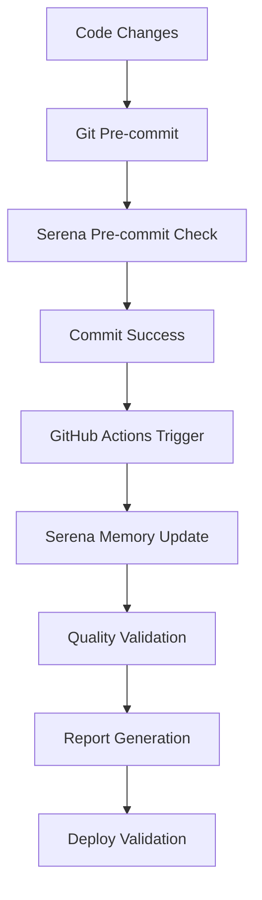

# Serena MCP Server 統合ガイド

PMPLearningManagementプロジェクトにおけるSerena MCP Serverの統合実装と開発ワークフローの自動化に関する包括的なガイドです。

## 📋 目次

1. [概要](#概要)
2. [統合アーキテクチャ](#統合アーキテクチャ)
3. [セットアップガイド](#セットアップガイド)
4. [開発ワークフロー](#開発ワークフロー)
5. [自動化スクリプト](#自動化スクリプト)
6. [CI/CD統合](#cicd統合)
7. [トラブルシューティング](#トラブルシューティング)
8. [ベストプラクティス](#ベストプラクティス)

## 概要

### 🎯 目的

Serena MCP Server統合により、以下の目標を達成します：

- **自動化されたメモリ管理**: プロジェクト変更の自動検出とメモリ更新
- **品質保証**: pre-commitフック、CI/CDでの自動品質チェック
- **開発効率向上**: 開発者向けCLIツールによる生産性向上
- **継続的監視**: パフォーマンスとプロジェクト健全度の追跡

### 📊 実装ステータス

- ✅ **メモリ自動更新システム**: 完全実装
- ✅ **GitHub Actions統合**: 完全実装
- ✅ **Pre-commit統合**: 完全実装
- ✅ **デプロイ時検証**: 完全実装
- ✅ **開発者CLI**: 完全実装

## 統合アーキテクチャ

### 🏗️ システム構成

```
PMPLearningManagement/
├── .serena/                    # Serenaメモリ・ログ管理
│   ├── memories/              # メモリファイル
│   ├── logs/                  # 実行ログ
│   └── cache/                 # キャッシュデータ
├── scripts/                   # 自動化スクリプト
│   ├── serena-memory-updater.js
│   ├── serena-pre-commit-hook.js
│   ├── serena-deploy-validator.js
│   └── serena-cli.js
├── .github/workflows/
│   └── serena-integration.yml # GitHub Actions統合
└── .husky/pre-commit         # Pre-commit hook統合
```

### 🔄 データフロー



### 📦 コンポーネント詳細

#### SerenaMemoryUpdater
- **目的**: プロジェクト変更検出とメモリファイル自動更新
- **実行タイミング**: Git push、定期実行、手動実行
- **機能**: ファイル変更検出、メモリ最適化、パフォーマンス監視

#### SerenaPreCommitHook
- **目的**: コミット前の品質保証
- **実行タイミング**: Git commit前
- **機能**: IDD準拠チェック、メモリ整合性、変更影響分析

#### SerenaDeployValidator
- **目的**: デプロイ前後の品質検証
- **実行タイミング**: ビルド前後、デプロイ前後
- **機能**: ビルド品質、パフォーマンス監視、セキュリティチェック

#### SerenaCLI
- **目的**: 開発者向け包括的管理ツール
- **実行タイミング**: 開発者による手動実行
- **機能**: インタラクティブモード、レポート生成、診断機能

## セットアップガイド

### 🚀 初期セットアップ

```bash
# 1. Serena統合の初期化
npm run serena:init

# 2. 初回メモリ更新
npm run serena:update

# 3. 統合ステータス確認
npm run serena:status
```

### 📋 必要な環境変数

```bash
# .env (任意)
SERENA_VERBOSE=true              # 詳細ログ出力
SKIP_SERENA_CHECK=false          # Serenaチェックのスキップ
NODE_ENV=development             # 実行環境
```

### 🔧 依存関係

すべての依存関係は既存のpackage.jsonに含まれており、追加インストールは不要です。

## 開発ワークフロー

### 💻 日常的な開発フロー

```bash
# 1. 開発作業
git add .
git commit -m "feat: 新機能追加 #123"  # ← Serena pre-commit自動実行

# 2. 定期的なメモリ更新
npm run serena:update

# 3. プロジェクト状態確認
npm run serena:status

# 4. 問題診断 (必要に応じて)
npm run serena:diagnose
```

### 🔄 CI/CDワークフロー

```bash
# GitHub Actions自動実行フロー
Push/PR → Serena Memory Update → Quality Check → Report Generation

# デプロイワークフロー
npm run deploy:serena  # Serena統合デプロイ
# または
npm run deploy         # 通常デプロイ
```

### 📊 レポート生成

```bash
# コンソール出力
npm run serena:report

# JSON形式
npm run serena:report:json

# Markdown形式
npm run serena:report:markdown

# ファイル出力
npm run serena:report -- --format=markdown --output=serena-report.md
```

## 自動化スクリプト

### 📝 serena-memory-updater.js

**主な機能**:
- ファイル変更検出 (LRUキャッシュ最適化)
- プロジェクト分析とメモリ生成
- パフォーマンス監視
- 自動圧縮とクリーンアップ

**実行例**:
```bash
node scripts/serena-memory-updater.js
```

**設定**:
```javascript
const CONFIG = {
  maxMemorySize: 50000,        // 50KB制限
  updateInterval: 3600000,     // 1時間間隔
  verbose: true                // 詳細ログ
};
```

### 🔍 serena-pre-commit-hook.js

**チェック項目**:
- IDD準拠 (Issue番号、コミット形式)
- Serenaメモリ整合性
- プロジェクト構造
- 変更影響分析

**実行例**:
```bash
# 手動実行
npm run serena:pre-commit

# 環境変数でスキップ
SKIP_SERENA_CHECK=true git commit -m "..."
```

### 🚀 serena-deploy-validator.js

**検証フェーズ**:
1. **pre-deploy**: デプロイ前品質チェック
2. **post-build**: ビルド後検証
3. **post-deploy**: デプロイ後ヘルスチェック

**実行例**:
```bash
npm run serena:deploy:pre        # デプロイ前
npm run serena:deploy:post-build # ビルド後
npm run serena:deploy:post-deploy # デプロイ後
```

### 🛠️ serena-cli.js

**利用可能コマンド**:
```bash
npm run serena                    # インタラクティブモード
npm run serena:update            # メモリ更新
npm run serena:validate          # プロジェクト検証
npm run serena:status            # ステータス表示
npm run serena:clean             # キャッシュクリーンアップ
npm run serena:diagnose          # 問題診断
```

**インタラクティブモード**:
```bash
npm run serena:interactive
# または
npm run serena
```

## CI/CD統合

### 🤖 GitHub Actions ワークフロー

**ファイル**: `.github/workflows/serena-integration.yml`

**実行タイミング**:
- Push (main, develop, feat/**)
- Pull Request
- 定期実行 (毎日06:00 UTC)
- 手動実行

**ジョブ構成**:

1. **serena-memory-update**
   - プロジェクト変更検出
   - メモリファイル更新
   - パフォーマンス測定

2. **serena-quality-check**
   - メモリ整合性検証
   - 品質統計生成
   - アーティファクト保存

3. **serena-reporting**
   - 包括的レポート生成
   - メトリクス収集
   - 長期保存

4. **serena-failure-recovery**
   - 失敗時の通知
   - 自動リカバリ
   - 問題分析

**設定例**:
```yaml
# 並行実行制御
concurrency:
  group: serena-integration-${{ github.ref }}
  cancel-in-progress: true

# セキュリティ設定
permissions:
  contents: read
  issues: read
  pull-requests: read
```

### 📊 GitHub Actions Summary

ワークフロー実行後、以下の情報がGitHub Actions Summaryに表示されます：

| メトリクス | 値 |
|-----------|-----|
| 更新されたメモリ数 | 7 |
| 総サイズ | 245KB |
| 平均サイズ | 35KB |
| 変更ファイル数 | 12 |
| パフォーマンス | 92.5% |

## トラブルシューティング

### 🚨 よくある問題と解決方法

#### 1. メモリ更新が失敗する

**症状**: `serena:update`コマンドがエラーで終了

**原因と解決方法**:
```bash
# Node.jsバージョン確認
node --version  # 18+ が必要

# 権限問題
chmod +x scripts/serena-*.js

# ディレクトリ作成
npm run serena:init

# キャッシュクリア
npm run serena:clean
```

#### 2. Pre-commitフックが動作しない

**症状**: コミット時にSerenaチェックが実行されない

**解決方法**:
```bash
# Huskyの再インストール
npm run prepare

# フック権限確認
chmod +x .husky/pre-commit

# 手動テスト
npm run serena:pre-commit
```

#### 3. GitHub Actionsワークフローエラー

**症状**: CI/CDでSerena統合が失敗

**確認項目**:
```bash
# ローカルでの動作確認
npm run serena:validate

# 必要ファイルの存在確認
ls -la scripts/serena-*.js

# 環境変数の確認
echo $SERENA_VERBOSE
```

#### 4. メモリファイルが大きすぎる

**症状**: 警告「メモリファイルが50KBを超えています」

**解決方法**:
```bash
# 自動最適化実行
npm run serena:update

# 手動クリーンアップ
npm run serena:clean

# 設定調整 (scripts/serena-memory-updater.js)
maxMemorySize: 75000  # 制限緩和
```

#### 5. キャッシュの問題

**症状**: 古いデータが残る、パフォーマンス低下

**解決方法**:
```bash
# 全キャッシュクリア
npm run serena:clean:all

# 特定キャッシュクリア
rm -rf .serena/cache/*

# 初期化のやり直し
npm run serena:init
```

### 🔧 デバッグモード

詳細なログ出力が必要な場合:

```bash
# 環境変数設定
export SERENA_VERBOSE=true

# または個別実行時
SERENA_VERBOSE=true npm run serena:update
```

### 📞 サポート情報

問題が解決しない場合:

1. **診断実行**: `npm run serena:diagnose`
2. **ログ確認**: `.serena/logs/` ディレクトリ
3. **GitHub Issues**: プロジェクトリポジトリで報告
4. **ドキュメント**: [CLAUDE.md](../CLAUDE.md) を参照

## ベストプラクティス

### 🎯 開発者向け推奨事項

#### 1. 定期的なメモリ更新

```bash
# 毎日の作業開始時
npm run serena:status
npm run serena:update  # 必要に応じて

# 大きな変更後
npm run serena:update
npm run serena:validate
```

#### 2. コミット前チェック

```bash
# 大きな変更をコミットする前
npm run serena:diagnose

# 問題がある場合
npm run serena:clean
npm run serena:update
```

#### 3. デプロイ前検証

```bash
# 本番デプロイ前の推奨フロー
npm run serena:validate:deploy
npm run build
npm run serena:deploy:post-build
```

#### 4. レポート活用

```bash
# 週次レビュー用
npm run serena:report:markdown --output=weekly-report.md

# プロジェクト評価用
npm run serena:report:json --output=metrics.json
```

### 🔒 セキュリティ考慮事項

#### 1. 機密情報の保護

- メモリファイルには機密情報を含めない
- ログファイルの定期的なクリーンアップ
- GitHub Actionsでの最小権限設定

#### 2. 依存関係の管理

```bash
# 定期的な脆弱性チェック
npm audit --audit-level=high

# Serena統合での自動チェック
npm run serena:validate  # セキュリティスコア含む
```

### 📊 パフォーマンス最適化

#### 1. キャッシュ効率化

```javascript
// 設定調整例 (scripts/serena-memory-updater.js)
const CONFIG = {
  maxMemorySize: 50000,      // 適切なサイズ制限
  updateInterval: 1800000,   // 更新頻度調整 (30分)
  cacheStrategy: 'LRU'       # キャッシュ戦略
};
```

#### 2. 並行処理最適化

```bash
# GitHub Actionsでの並行実行
concurrency:
  group: serena-${{ github.ref }}
  cancel-in-progress: true
```

#### 3. メモリファイル最適化

- 不要なセクションの削除
- 重複情報の統合
- 自動圧縮の活用

### 🔄 チーム開発での活用

#### 1. 標準化

```bash
# チーム全体での統一
npm run serena:init        # 新メンバーのセットアップ
npm run serena:status      # デイリースタンドアップでの確認
```

#### 2. 品質管理

```bash
# Pull Request前
npm run serena:validate

# マージ前
npm run serena:report
```

#### 3. ナレッジ共有

- レポートの定期共有
- メトリクスの傾向分析
- 改善点の識別と実装

## 📈 メトリクスとKPI

### 📊 追跡指標

1. **メモリ健全度**: メモリファイルの品質と最新性
2. **更新頻度**: メモリ更新の実行頻度
3. **キャッシュ効率**: キャッシュヒット率
4. **ビルドパフォーマンス**: ビルド時間とサイズ
5. **エラー率**: 検証失敗の頻度

### 🎯 改善目標

- メモリ健全度: 90%以上維持
- キャッシュ効率: 85%以上
- ビルドサイズ: 10MB以下
- 更新頻度: 週3回以上

## 🔮 今後の拡張予定

### 📋 短期計画 (1-2ヶ月)

- [ ] Web UIダッシュボードの開発
- [ ] Slack/Discord通知統合
- [ ] より詳細なパフォーマンス分析

### 🚀 長期計画 (3-6ヶ月)

- [ ] AI駆動のメモリ最適化
- [ ] 多言語対応
- [ ] クラウド統合 (AWS/GCP)
- [ ] リアルタイム監視

## 📚 関連ドキュメント

- [CLAUDE.md](../CLAUDE.md) - プロジェクト全体ガイド
- [IDD_IMPLEMENTATION_STATUS.md](../IDD_IMPLEMENTATION_STATUS.md) - IDD実装詳細
- [GitHub Actions ルール](.claude/context/github-actions-rules.md) - ワークフロー開発ガイドライン
- [開発ワークフロー最適化](.serena/memories/development_workflow_optimization.md) - Serenaメモリ

---

**最終更新**: 2025-09-20  
**バージョン**: 1.0.0  
**メンテナー**: Claude Code Integration System

このガイドは、Serena MCP Server統合の完全な実装と効果的な活用方法を提供します。質問や改善提案がある場合は、プロジェクトのGitHub Issuesでお知らせください。