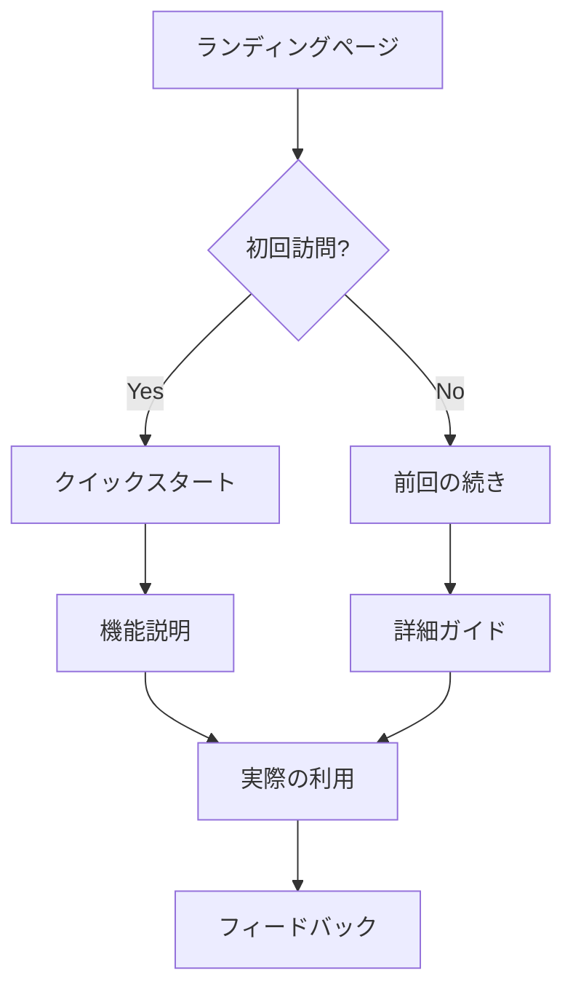

# ドキュメントアナリティクス

## 📊 概要

PMP Learning Management Systemのドキュメント利用状況を追跡・分析するためのシステムです。

## 🎯 測定目標

### 主要KPI
- **ページビュー**: 月間/週間のドキュメントアクセス数
- **セッション時間**: ユーザーの平均滞在時間
- **バウンス率**: 単一ページでの離脱率
- **検索成功率**: ユーザーが目的の情報を見つけられる割合
- **コンバージョン率**: ドキュメントから行動に移した割合

### セカンダリKPI
- **人気ページランキング**: 最もアクセスされるドキュメント
- **検索キーワード**: よく検索される用語
- **リファラー分析**: ユーザーの流入元
- **デバイス分析**: モバイル vs デスクトップ利用率
- **地域分析**: 地理的なアクセス分布

## 🔧 実装方法

### 1. Google Analytics 4 (GA4)
```html
<!-- Google tag (gtag.js) -->
<script async src="https://www.googletagmanager.com/gtag/js?id=GA_MEASUREMENT_ID"></script>
<script>
  window.dataLayer = window.dataLayer || [];
  function gtag(){dataLayer.push(arguments);}
  gtag('js', new Date());
  gtag('config', 'GA_MEASUREMENT_ID');
</script>
```

### 2. GitHub Pages アナリティクス
GitHub Insightsから取得可能な情報：
- Traffic（トラフィック統計）
- Popular content（人気コンテンツ）
- Referring sites（参照元サイト）
- Clone activity（クローン活動）

### 3. カスタムイベント追跡
```javascript
// ドキュメント読了イベント
gtag('event', 'document_completion', {
  'document_title': document.title,
  'completion_rate': calculateCompletionRate()
});

// 検索イベント
gtag('event', 'search', {
  'search_term': searchQuery,
  'search_results': resultsCount
});

// ダウンロードイベント
gtag('event', 'file_download', {
  'file_name': fileName,
  'file_type': fileType
});
```

## 📈 レポートダッシュボード

### 週次レポート
- 新規訪問者数
- リピート訪問者数
- 人気ページトップ10
- 平均セッション時間
- 検索クエリ分析

### 月次レポート
- トラフィック推移
- コンテンツパフォーマンス
- ユーザー行動フロー
- 改善提案
- A/Bテスト結果

### 四半期レポート
- ROI分析
- ユーザーフィードバック統合
- 競合比較分析
- 長期トレンド分析

## 🎨 可視化ツール

### 1. Google Analytics Dashboard
```json
{
  "widgets": [
    {
      "type": "metric",
      "title": "ページビュー",
      "metric": "ga:pageviews",
      "period": "last_30_days"
    },
    {
      "type": "chart",
      "title": "セッション時間推移",
      "metric": "ga:avgSessionDuration",
      "dimensions": ["ga:date"]
    }
  ]
}
```

### 2. カスタムダッシュボード
```javascript
// docs-analytics.js
class DocsAnalytics {
  constructor(config) {
    this.config = config;
    this.events = [];
  }
  
  trackPageView(page) {
    this.events.push({
      type: 'pageview',
      page: page,
      timestamp: Date.now(),
      userAgent: navigator.userAgent,
      referrer: document.referrer
    });
  }
  
  trackTimeOnPage() {
    const startTime = Date.now();
    
    window.addEventListener('beforeunload', () => {
      const timeSpent = Date.now() - startTime;
      this.events.push({
        type: 'time_on_page',
        duration: timeSpent,
        page: window.location.pathname
      });
    });
  }
  
  generateReport() {
    return {
      totalEvents: this.events.length,
      avgTimeOnPage: this.calculateAvgTime(),
      popularPages: this.getPopularPages(),
      userJourney: this.analyzeUserJourney()
    };
  }
}
```

## 🔍 分析手法

### 1. ヒートマップ分析
- ページ内のクリック分布
- スクロール深度
- 注目領域の特定

### 2. ユーザーフロー分析


### 3. コホート分析
- 新規ユーザーの定着率
- 機能別利用継続率
- 月次アクティブユーザー

## 📊 データ収集

### プライバシー配慮
- GDPRコンプライアンス
- クッキー同意管理
- 個人情報の匿名化
- データ保持期間の設定

### データ品質管理
```javascript
// データ検証
function validateAnalyticsData(data) {
  const requiredFields = ['timestamp', 'event_type', 'user_id'];
  const isValid = requiredFields.every(field => data[field]);
  
  if (!isValid) {
    console.warn('Invalid analytics data:', data);
    return false;
  }
  
  return true;
}
```

## 🚀 アクションアイテム

### 短期（1ヶ月）
- [ ] GA4セットアップ
- [ ] 基本イベント追跡実装
- [ ] 週次レポート自動化
- [ ] ダッシュボード作成

### 中期（3ヶ月）
- [ ] ヒートマップツール導入
- [ ] A/Bテスト基盤構築
- [ ] ユーザーフィードバック統合
- [ ] パフォーマンス監視

### 長期（6ヶ月）
- [ ] 機械学習による予測分析
- [ ] リアルタイム分析機能
- [ ] 多言語対応の分析
- [ ] API分析統合

## 📞 連絡先

- **アナリティクス担当**: analytics@example.com
- **データサイエンス**: data-science@example.com
- **プライバシー相談**: privacy@example.com

---

**更新日**: 2025-08-16  
**次回レビュー**: 2025-09-16