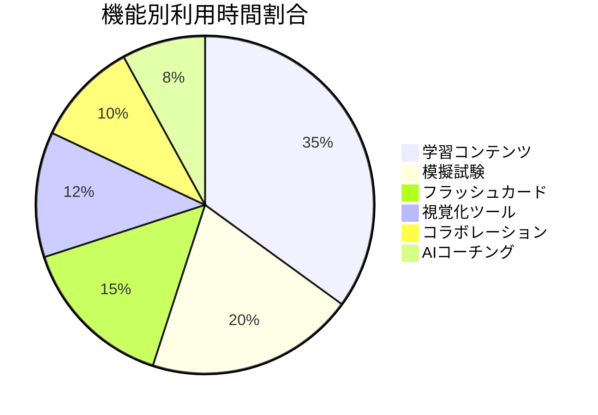
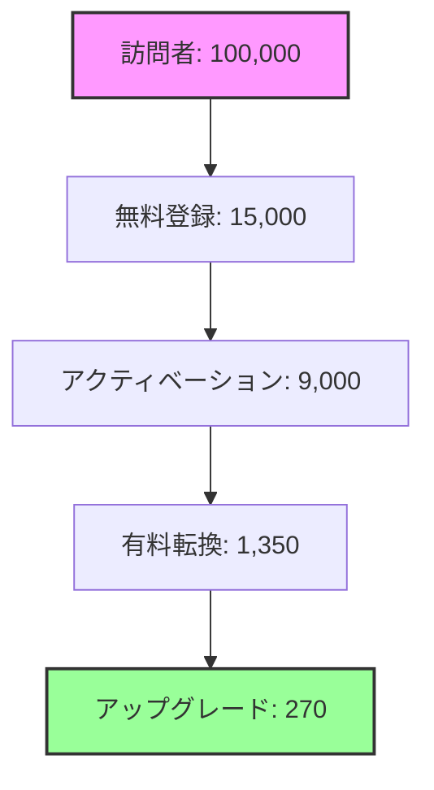

# 📊 PMPLearningManagement メトリクスダッシュボード

## 概要

本ドキュメントは、PMPLearningManagementの成功を測定し、データドリブンな意思決定を支援するための包括的なメトリクスフレームワークを定義します。

## 🎯 North Star Metrics

### 主要成功指標

| メトリクス | 定義 | 現在値 | 目標値 | 健全性 |
|-----------|------|--------|--------|---------|
| **Weekly Active Learners (WAL)** | 週1回以上学習したユーザー数 | 18,500 | 25,000 | 🟡 74% |
| **Learning Completion Rate** | コース完了率 | 68% | 80% | 🟡 85% |
| **Certification Success Rate** | PMP試験合格率 | 82% | 85% | 🟢 96% |
| **Net Promoter Score (NPS)** | ユーザー推奨度 | 72 | 75 | 🟢 96% |
| **Customer Lifetime Value (CLV)** | 顧客生涯価値 | ¥285,000 | ¥350,000 | 🟡 81% |

## 📈 プロダクトメトリクス

### エンゲージメント指標

```javascript
const engagementMetrics = {
  daily: {
    DAU: 8500,                    // Daily Active Users
    sessions: 12300,              // 総セッション数
    avgSessionDuration: "24:35",  // 平均セッション時間
    pagesPerSession: 8.3,         // セッションあたりページ数
    bounceRate: "12%"            // 直帰率
  },
  weekly: {
    WAU: 18500,                   // Weekly Active Users
    retention: {
      week1: "85%",
      week2: "72%",
      week4: "65%",
      week8: "58%"
    }
  },
  monthly: {
    MAU: 32000,                   // Monthly Active Users
    churnRate: "3.2%",           // 月間解約率
    reactivation: "8%"           // 再アクティベーション率
  }
};
```

### 学習効果測定

| カテゴリ | メトリクス | 測定方法 | 現在値 | ベンチマーク |
|----------|-----------|----------|--------|-------------|
| **知識習得** | 理解度スコア | クイズ正答率 | 78% | 業界平均: 65% |
| **スキル向上** | 実践課題達成率 | シミュレーション完了率 | 71% | 業界平均: 55% |
| **行動変容** | 学習習慣形成率 | 連続学習日数 | 15日 | 業界平均: 8日 |
| **成果達成** | 目標達成率 | 設定目標の達成割合 | 64% | 業界平均: 45% |

### 機能別利用状況



## 💰 ビジネスメトリクス

### 収益指標

| 期間 | MRR | ARR | 成長率 | ARPU |
|------|-----|-----|--------|------|
| 2024 Q4 | ¥18M | ¥216M | - | ¥5,625 |
| 2025 Q1 | ¥22M | ¥264M | +22% | ¥5,789 |
| 2025 Q2 | ¥28M | ¥336M | +27% | ¥6,222 |
| 2025 Q3(予測) | ¥35M | ¥420M | +25% | ¥6,481 |

### 顧客セグメント分析

```javascript
const customerSegments = {
  enterprise: {
    count: 45,
    revenue: "¥12.6M",
    percentOfTotal: "45%",
    avgContractValue: "¥280,000",
    churn: "1.5%",
    nps: 78
  },
  smb: {
    count: 320,
    revenue: "¥8.4M",
    percentOfTotal: "30%",
    avgContractValue: "¥26,250",
    churn: "3.8%",
    nps: 70
  },
  individual: {
    count: 3635,
    revenue: "¥7M",
    percentOfTotal: "25%",
    avgContractValue: "¥1,925",
    churn: "5.2%",
    nps: 72
  }
};
```

### ユニットエコノミクス詳細

| メトリクス | 値 | トレンド | 前四半期比 |
|-----------|-----|---------|-----------|
| CAC (顧客獲得コスト) | ¥14,500 | 📉 | -8% |
| LTV (顧客生涯価値) | ¥285,000 | 📈 | +12% |
| LTV/CAC比率 | 19.7:1 | 📈 | +21% |
| Payback Period | 2.8ヶ月 | 📉 | -15% |
| Gross Margin | 82% | 📈 | +3% |

## 🚀 グロースメトリクス

### ファネル分析



### コンバージョン率

| ステージ | 転換率 | 目標 | 改善施策 |
|---------|--------|------|----------|
| 訪問→登録 | 15% | 20% | LP最適化、A/Bテスト |
| 登録→アクティベーション | 60% | 70% | オンボーディング改善 |
| アクティベーション→有料 | 15% | 18% | 価値訴求強化 |
| 有料→アップグレード | 20% | 25% | カスタマーサクセス |

### バイラル係数

```javascript
const viralMetrics = {
  inviteSentRate: 0.35,        // 招待送信率
  inviteAcceptRate: 0.28,      // 招待承諾率
  viralCoefficient: 0.098,      // バイラル係数 (K-factor)
  viralCycle: 7,                // バイラルサイクル（日）
  organicGrowthRate: "12%"      // オーガニック成長率
};
```

## 🔧 技術メトリクス

### パフォーマンス指標

| メトリクス | 現在値 | 目標値 | SLA |
|-----------|--------|--------|-----|
| **ページロード時間** | 1.8秒 | <1.5秒 | <3秒 |
| **API応答時間 (p50)** | 120ms | <100ms | <200ms |
| **API応答時間 (p99)** | 450ms | <400ms | <1000ms |
| **エラー率** | 0.12% | <0.1% | <1% |
| **可用性** | 99.95% | 99.99% | 99.9% |

### インフラメトリクス

```javascript
const infrastructureMetrics = {
  servers: {
    cpu: "42%",
    memory: "68%",
    disk: "35%",
    network: "125 Mbps"
  },
  database: {
    connections: 245,
    queryTime: "12ms",
    cacheHitRate: "94%",
    replicationLag: "50ms"
  },
  cdn: {
    hitRate: "87%",
    bandwidth: "2.3 TB/month",
    requestsPerSecond: 850
  }
};
```

## 📱 モバイルメトリクス

### アプリパフォーマンス

| プラットフォーム | MAU | クラッシュ率 | 評価 | レビュー数 |
|-----------------|-----|------------|------|-----------|
| iOS | 8,500 | 0.08% | 4.7 | 1,250 |
| Android | 6,200 | 0.15% | 4.5 | 980 |
| PWA | 12,300 | 0.05% | - | - |

### モバイル特有指標

- **アプリ起動時間**: 1.2秒
- **オフライン利用率**: 35%
- **プッシュ通知開封率**: 28%
- **アプリ内課金転換率**: 8%

## 🎓 学習成果メトリクス

### コース別完了率

| コース | 登録者数 | 完了率 | 平均時間 | 満足度 |
|--------|---------|--------|---------|--------|
| PMBOK基礎 | 15,000 | 72% | 12時間 | 4.6/5 |
| リスク管理 | 8,500 | 68% | 8時間 | 4.5/5 |
| アジャイル入門 | 12,000 | 75% | 10時間 | 4.7/5 |
| PMP対策 | 6,000 | 82% | 40時間 | 4.8/5 |

### 認定試験成果

```javascript
const certificationMetrics = {
  pmp: {
    attempts: 850,
    firstTimePass: "76%",
    overallPass: "82%",
    avgScore: 78,
    avgPrepTime: "65 hours"
  },
  capm: {
    attempts: 420,
    firstTimePass: "81%",
    overallPass: "88%",
    avgScore: 82,
    avgPrepTime: "35 hours"
  }
};
```

## 🤝 カスタマーサクセスメトリクス

### サポート指標

| チャネル | 件数/月 | 初回応答時間 | 解決時間 | CSAT |
|---------|--------|-------------|---------|------|
| Email | 450 | 2時間 | 8時間 | 4.5/5 |
| Chat | 1,200 | 30秒 | 15分 | 4.7/5 |
| Phone | 180 | 1分 | 20分 | 4.6/5 |

### 健全性スコア

```javascript
const healthScores = {
  enterprise: {
    healthy: "78%",      // スコア80以上
    atrisk: "15%",       // スコア50-80
    critical: "7%"       // スコア50未満
  },
  indicators: {
    usage: 0.85,         // 利用頻度スコア
    engagement: 0.78,    // エンゲージメントスコア
    satisfaction: 0.82,  // 満足度スコア
    expansion: 0.71      // 拡張可能性スコア
  }
};
```

## 📊 予測分析

### 成長予測モデル

```python
# 月次成長予測
growth_forecast = {
    "2025-09": {
        "mau": 38000,
        "mrr": "¥35M",
        "confidence": 0.85
    },
    "2025-12": {
        "mau": 45000,
        "mrr": "¥45M",
        "confidence": 0.78
    },
    "2026-03": {
        "mau": 55000,
        "mrr": "¥58M",
        "confidence": 0.72
    }
}
```

### チャーン予測

| セグメント | 予測チャーン率 | リスク要因 | 対策 |
|-----------|-------------|-----------|------|
| 新規ユーザー（0-30日） | 12% | オンボーディング不足 | ガイド強化 |
| 低利用ユーザー | 25% | エンゲージメント低下 | 再活性化キャンペーン |
| 価格敏感層 | 18% | 価格への不満 | 価値訴求改善 |

## 🎯 アクションアイテム

### 優先度高

1. **ページロード時間改善**
   - 目標: 1.5秒以下
   - 施策: CDN最適化、画像圧縮
   - 期限: 2週間

2. **オンボーディング改善**
   - 目標: アクティベーション率70%
   - 施策: インタラクティブチュートリアル
   - 期限: 1ヶ月

3. **モバイルクラッシュ率削減**
   - 目標: 0.1%以下
   - 施策: メモリ管理最適化
   - 期限: 2週間

### 優先度中

- API応答時間の最適化
- 有料転換率の向上
- カスタマーサポート自動化

## 📱 リアルタイムダッシュボード

### アクセス情報

- **URL**: [metrics.pmlearning.com](https://metrics.pmlearning.com)
- **更新頻度**: リアルタイム（5秒）
- **データソース**: Google Analytics, Mixpanel, Custom Events
- **権限レベル**: 役職別アクセス制御

### 主要ダッシュボード

1. **Executive Dashboard**: 経営指標サマリー
2. **Product Dashboard**: プロダクトメトリクス詳細
3. **Growth Dashboard**: グロース指標とファネル
4. **Technical Dashboard**: システムパフォーマンス
5. **Customer Success Dashboard**: 顧客健全性

## 🔔 アラート設定

| アラート | 閾値 | 通知先 | アクション |
|---------|------|--------|-----------|
| エラー率急増 | >1% | Tech Team | 即時調査 |
| DAU急減 | -20% | Product Team | 原因分析 |
| チャーン急増 | >5% | CS Team | 顧客接触 |
| サーバー負荷 | CPU>80% | DevOps | スケーリング |

---

*最終更新: 2025-08-16*
*Metrics Dashboard v2.0*
*データは15分ごとに自動更新されます*