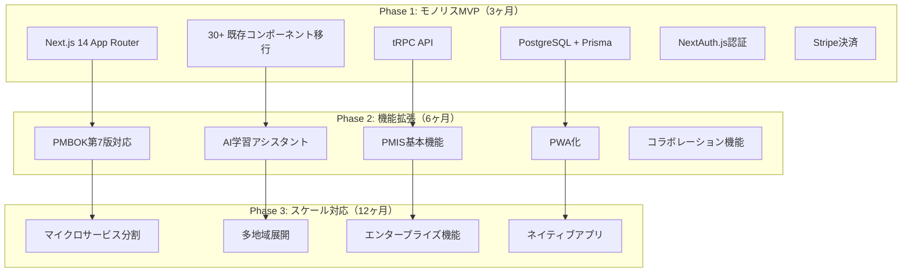
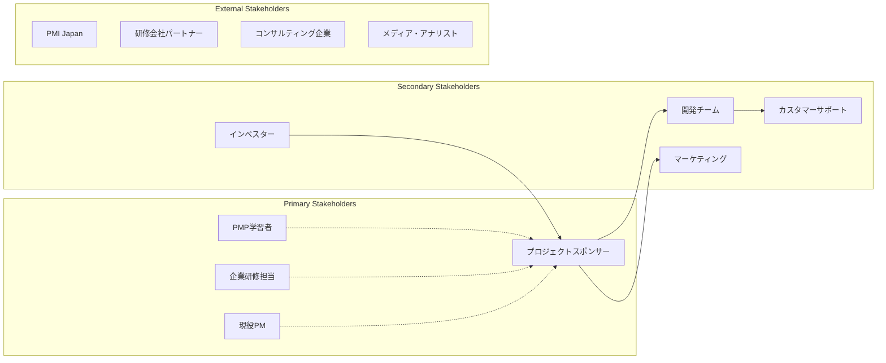
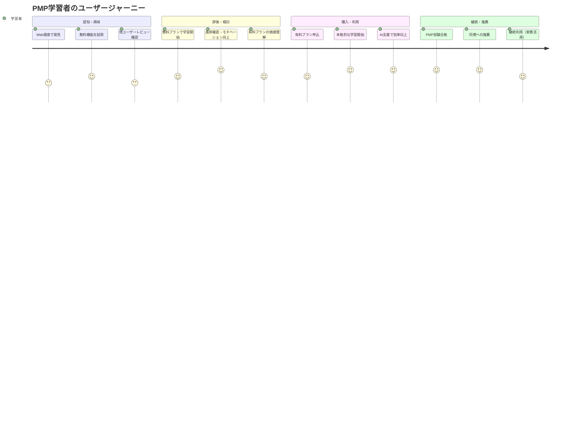
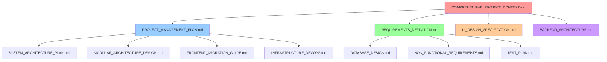

# PMPLearningManagement: 包括的プロジェクトコンテキスト
*プロジェクトの北極星ドキュメント*

---

## エグゼクティブサマリー

PMPLearningManagementは、PMP（Project Management Professional）学習者とプロジェクトマネージャーの両方に価値を提供する統合プラットフォームへの段階的進化を目指すプロジェクトです。現在のGitHub Pages上の無料学習アプリ（30+のReactコンポーネント、8種類の視覚化機能）から、商用SaaSプラットフォームへの現実的かつ持続可能な移行を計画しています。

**現状**: React/LocalStorage/D3.js → **目標**: Next.js/TypeScript/PostgreSQL統合プラットフォーム  
**予算**: 初期900万円（3ヶ月MVP） + 年間3,000万円  
**成功指標**: 初年度売上2,000万円、有料会員500名獲得  

---

## 📊 1. プロジェクト全体像

### 1.1 ビジネス価値とユーザー価値

#### 🎯 現在の価値提供
```typescript
interface CurrentValue {
  userBase: "PMP学習者（主に個人）";
  features: {
    pmbok: "49プロセスの体系的学習";
    visualization: "8種類の高度なD3.js視覚化";
    learning: "フラッシュカード、模擬試験、進捗管理";
    language: "完全日本語対応";
  };
  strengths: [
    "実証済みの学習体験",
    "高品質な視覚化",
    "完全無料",
    "GitHub Pages（99.9%可用性）"
  ];
}
```

#### 🚀 将来のビジネス価値
```typescript
interface FutureValue {
  targetMarkets: [
    "PMP受験者（個人）",
    "企業研修部門",
    "現役プロジェクトマネージャー",
    "コンサルティング企業"
  ];
  revenueStreams: {
    individual: "月額2,980円（プロ）・4,980円（プレミアム）";
    corporate: "年額50-500万円（企業ライセンス）";
    training: "カスタム研修プログラム";
  };
  marketOpportunity: {
    tam: "日本PMP市場約500億円/年";
    som: "学習ツール市場5%（25億円）";
    targetShare: "初年度0.1%（2,500万円）";
  };
}
```

#### 📈 成功の定義と測定方法

| カテゴリ | KPI | 目標値 | 測定方法 | 達成時期 |
|---------|-----|--------|----------|----------|
| **財務** | MRR | 500万円/月 | Stripe Analytics | 12ヶ月 |
| **顧客** | 有料会員数 | 500名 | ユーザーDB | 12ヶ月 |
| **プロダクト** | MAU | 20,000名 | GA4 | 9ヶ月 |
| **プロセス** | 開発効率 | Sprint完了率90% | Jira/Linear | 継続 |
| **技術** | システム可用性 | 99.5% | Sentry/Vercel | 継続 |

---

## 🏗️ 2. 技術コンテキスト

### 2.1 現行技術スタックと移行戦略

#### 現在の技術構成（実装済み）
```javascript
const currentArchitecture = {
  // 💪 強み：実証済み・安定動作
  frontend: {
    framework: "React 18.2",
    components: "30+ 成熟コンポーネント",
    visualization: "D3.js v7（高度な視覚化）",
    styling: "Tailwind CSS（完成度高い）",
    routing: "HashRouter（GitHub Pages最適化）"
  },
  
  // ⚠️ 制約：スケール限界
  infrastructure: {
    hosting: "GitHub Pages（$0、99.9%可用性）",
    storage: "LocalStorage（5-10MB制限）",
    backend: null,
    database: null,
    authentication: null
  },
  
  // 🎯 活用すべき資産
  businessLogic: {
    pmbokData: "49プロセス完全データセット",
    learningFlow: "実証済み学習フロー",
    visualizations: "8種類の高度な視覚化",
    japaneseLocalization: "完全日本語対応"
  }
};
```

#### 移行先アーキテクチャ（段階的）



### 2.2 アーキテクチャ決定記録（ADR）

#### ADR-001: モノリスファーストアプローチ
**決定**: 初期はNext.jsモノリスで構築、マイクロサービス化は成長後  
**理由**: 
- 開発チーム2-3名（小規模）
- 既存コンポーネント最大活用
- 運用複雑性の最小化
- 早期市場検証の重要性

#### ADR-002: TypeScript段階的移行
**決定**: .jsx → .tsxの段階的移行、新規開発はTypeScript必須  
**理由**: 
- 既存30+コンポーネントの段階移行
- 型安全性による品質向上
- 開発効率の向上

#### ADR-003: tRPC選択
**決定**: GraphQLではなくtRPCを採用  
**理由**: 
- TypeScriptとの親和性
- フルスタック型安全性
- 学習コストの低さ
- 小〜中規模プロジェクトに最適

---

## 👥 3. 開発コンテキスト

### 3.1 実装フェーズと優先順位

```typescript
interface DevelopmentPhases {
  phase1_MVP: {
    duration: "3ヶ月";
    budget: "900万円";
    team: "2-3名フルスタックエンジニア";
    
    // 🔥 最高優先度
    mustHave: [
      "Next.js基盤構築",
      "30+コンポーネント移行",
      "認証システム（NextAuth.js）",
      "PostgreSQL + Prisma",
      "Stripe決済統合",
      "LocalStorageデータ移行",
      "基本PMIS機能（プロジェクト・タスク管理）"
    ];
    
    // ⚡ 高優先度
    shouldHave: [
      "PWA基本対応",
      "Sentry エラー監視",
      "基本的な管理画面",
      "データエクスポート機能"
    ];
  };
  
  phase2_Enhancement: {
    duration: "3ヶ月（4-6ヶ月目）";
    budget: "1,200万円";
    
    features: [
      "PMBOK第7版完全対応",
      "OpenAI統合AIアシスタント",
      "高度なPMIS機能（EVM、リスク管理）",
      "コラボレーション機能",
      "企業向け管理機能",
      "詳細分析・レポート機能"
    ];
  };
}
```

### 3.2 チーム構成と必要スキル

#### 理想的チーム構成（予算制約下）
```typescript
interface TeamStructure {
  // 💼 コア開発チーム
  coreTeam: {
    techLead: {
      skills: ["React/Next.js", "TypeScript", "システム設計"];
      responsibility: "アーキテクチャ決定、コードレビュー";
      allocation: "100%";
    };
    
    fullstackEngineers: {
      count: 2;
      skills: ["React", "Node.js", "PostgreSQL", "DevOps"];
      responsibility: "フィーチャー開発、インフラ運用";
      allocation: "100%";
    };
  };
  
  // 🎯 専門チーム（必要時）
  specialists: {
    uiuxDesigner: {
      skills: ["Figma", "ユーザビリティ", "プロダクトデザイン"];
      allocation: "20-40%（必要時）";
    };
    
    qaEngineer: {
      skills: ["自動テスト", "パフォーマンステスト"];
      allocation: "フェーズ2から参加";
    };
  };
  
  // 📊 プロジェクト管理
  projectManager: {
    skills: ["PMP", "アジャイル", "ステークホルダー管理"];
    allocation: "50%（パートタイム）";
  };
}
```

### 3.3 開発プロセスとワークフロー

#### アジャイル開発プロセス
```yaml
sprint_structure:
  duration: "2週間スプリント"
  ceremonies:
    - sprint_planning: "月曜午前（3時間）"
    - daily_standup: "毎朝9:00（15分）"
    - sprint_review: "金曜午後（2時間）"
    - retrospective: "金曜午後（1時間）"

development_workflow:
  git_flow: "GitHub Flow簡素版"
  branches:
    - main: "本番環境"
    - develop: "統合環境" 
    - feature/*: "機能開発"
  
  quality_gates:
    - linting: "ESLint + Prettier"
    - testing: "Jest + React Testing Library"
    - type_check: "TypeScript strict mode"
    - security: "Snyk脆弱性チェック"

deployment_strategy:
  environments:
    - development: "Vercel Preview"
    - staging: "Vercel デプロイ"
    - production: "Vercel Pro"
  
  release_cycle:
    - hotfix: "即座（クリティカル修正）"
    - minor: "週次リリース"
    - major: "月次リリース"
```

---

## 💼 4. ビジネスコンテキスト

### 4.1 市場機会と競合分析

#### 市場機会
```typescript
interface MarketOpportunity {
  // 📊 市場規模
  market: {
    pmp_certified: "日本国内約50,000名";
    annual_candidates: "約8,000名/年";
    corporate_training: "大企業200社、中小企業2,000社";
    
    growth_rate: "年率15%（DX推進による需要増）";
    covid_impact: "オンライン学習需要300%増加";
  };
  
  // 🎯 ターゲット市場
  segments: {
    individual_learners: {
      size: "年間8,000名";
      willingness_to_pay: "月額3,000円";
      conversion_rate: "10%（800名の有料会員獲得可能）";
    };
    
    corporate_training: {
      size: "200社";
      average_contract: "年間100万円";
      penetration_target: "5%（10社 × 100万円 = 1,000万円）";
    };
  };
}
```

#### 競合分析
```typescript
interface CompetitiveAnalysis {
  direct_competitors: {
    // 🥇 主要競合
    pmbok_apps: {
      strengths: ["既存ユーザーベース", "認知度"];
      weaknesses: ["古いUI", "限定的な日本語対応"];
      opportunity: "モダンなUX、包括的日本語対応で差別化";
    };
    
    // 📚 学習プラットフォーム
    online_learning: {
      strengths: ["豊富なコンテンツ", "ブランド力"];
      weaknesses: ["PMBOKに特化していない", "高価格"];
      opportunity: "PMBOK特化、適正価格で専門性アピール";
    };
  };
  
  // 🎯 差別化要因
  competitive_advantages: [
    "既存30+コンポーネントによる豊富な学習体験",
    "D3.js高度視覚化による理解促進",
    "完全日本語対応（用語、UI、サポート）",
    "学習とPMISの統合プラットフォーム",
    "AI学習アシスタントによるパーソナライゼーション"
  ];
}
```

### 4.2 収益モデルと成長戦略

#### 収益モデル
```typescript
interface RevenueModel {
  // 💰 個人向けSaaS
  individual_saas: {
    freemium: {
      price: "¥0";
      features: ["基本学習機能", "制限付きフラッシュカード"];
      conversion_rate: "10%";
    };
    
    pro: {
      price: "¥2,980/月";
      features: ["全機能", "無制限フラッシュカード", "模擬試験"];
      target_users: 300;
      mrr: "¥894,000";
    };
    
    premium: {
      price: "¥4,980/月"; 
      features: ["Pro機能 + AI学習支援", "1対1メンタリング"];
      target_users: 200;
      mrr: "¥996,000";
    };
  };
  
  // 🏢 企業向けB2B
  enterprise_b2b: {
    basic_license: {
      price: "¥500,000/年（50名まで）";
      target: 5;
      arr: "¥2,500,000";
    };
    
    enterprise_license: {
      price: "¥2,000,000/年（無制限 + カスタマイズ）";
      target: 3;
      arr: "¥6,000,000";
    };
  };
  
  // 📊 初年度売上予測
  year1_revenue: "¥20,000,000";
  breakdown: {
    individual_saas: "¥12,000,000（60%）";
    enterprise_b2b: "¥8,000,000（40%）";
  };
}
```

### 4.3 ステークホルダーマップ



---

## 👤 5. ユーザーコンテキスト

### 5.1 詳細ユーザーペルソナ

#### 🎯 ペルソナ1: PMP受験者（田中さん、28歳）
```typescript
interface PMPCandidate {
  demographics: {
    age: 28;
    occupation: "IT企業プロジェクトリーダー";
    experience: "PM経験3年、PMP未取得";
    income: "年収650万円";
  };
  
  goals: {
    primary: "6ヶ月以内にPMP合格";
    secondary: "実務スキル向上";
    timeline: "毎日1-2時間学習";
  };
  
  painPoints: [
    "仕事と学習の両立が困難",
    "PMBOK用語の理解に時間がかかる",
    "モチベーション維持が困難",
    "実際の試験形式に慣れる機会が少ない"
  ];
  
  preferredFeatures: [
    "スマホでスキマ時間学習",
    "視覚的で分かりやすい教材",
    "学習進捗の可視化",
    "実践的な模擬試験"
  ];
  
  willingnessToPay: {
    threshold: "月額3,000円以下";
    valuePerception: "合格すれば昇進・昇給で回収可能";
  };
}
```

#### 🏢 ペルソナ2: 企業研修担当者（山田さん、42歳）
```typescript
interface CorporateTrainer {
  demographics: {
    age: 42;
    position: "人材開発部門マネージャー";
    company: "従業員500名のSI企業";
    responsibility: "年間50名のPM育成";
  };
  
  goals: {
    primary: "社員のPM能力向上";
    kpis: ["PMP取得率向上", "プロジェクト成功率向上"];
    budget: "年間500万円の研修予算";
  };
  
  painPoints: [
    "個別の学習進捗把握が困難",
    "研修効果の測定・報告が大変",
    "従来の集合研修は非効率",
    "コストと効果のバランス"
  ];
  
  requirements: [
    "管理者向けダッシュボード",
    "学習進捗レポート機能",
    "コスト効率の良いソリューション",
    "カスタマイズ可能な学習パス"
  ];
  
  decisionFactors: [
    "ROI（投資対効果）",
    "導入・運用の簡易性",
    "サポート体制",
    "セキュリティ・コンプライアンス"
  ];
}
```

### 5.2 ユーザージャーニーマップ

#### 個人学習者のジャーニー


---

## ⚠️ 6. リスクと課題

### 6.1 技術リスクと対策

```typescript
interface TechnicalRisks {
  // 🔥 高リスク
  high_risk: {
    legacy_migration: {
      description: "30+コンポーネントの移行複雑性";
      probability: "Medium (60%)";
      impact: "High";
      mitigation: [
        "段階的移行（Strangler Figパターン）",
        "並行運用期間（3ヶ月）設定",
        "自動テスト充実",
        "ユーザーフィードバック早期収集"
      ];
    };
    
    d3js_performance: {
      description: "複雑なD3.js視覚化のパフォーマンス劣化";
      probability: "Medium (50%)";
      impact: "High";
      mitigation: [
        "Canvas/WebGLレンダリング検討", 
        "データ仮想化実装",
        "プログレッシブローディング",
        "モバイル向け軽量版提供"
      ];
    };
  };
  
  // ⚡ 中リスク
  medium_risk: {
    scalability: {
      description: "急激なユーザー増加への対応";
      probability: "Low (30%)";
      impact: "Medium";
      mitigation: [
        "Vercel Pro自動スケーリング活用",
        "CDNによる静的リソース配信",
        "データベース垂直/水平スケーリング準備"
      ];
    };
    
    external_api_dependency: {
      description: "OpenAI API等外部サービス依存";
      probability: "Medium (40%)";
      impact: "Medium";
      mitigation: [
        "フォールバック機能実装",
        "API Rate Limiting対応",
        "複数プロバイダー選択肢確保"
      ];
    };
  };
}
```

### 6.2 ビジネスリスクと対策

```typescript
interface BusinessRisks {
  market_risks: {
    competition: {
      description: "大手プレイヤーの参入";
      mitigation: [
        "差別化要因（日本語特化、PMBOK特化）の強化",
        "ユーザーコミュニティ構築",
        "継続的イノベーション",
        "先行者利益の活用"
      ];
    };
    
    market_saturation: {
      description: "PMP市場の成熟・縮小";
      mitigation: [
        "関連資格（PgMP、PMI-ACP）への展開",
        "海外市場進出準備",
        "企業向け一般的PM研修への拡張"
      ];
    };
  };
  
  financial_risks: {
    customer_acquisition_cost: {
      description: "CAC（顧客獲得コスト）の上昇";
      mitigation: [
        "コンテンツマーケティング強化",
        "リファラルプログラム実装",
        "既存ユーザーからの口コミ促進"
      ];
    };
    
    churn_rate: {
      description: "高い解約率";
      mitigation: [
        "オンボーディング体験最適化",
        "継続的価値提供（新機能、コンテンツ更新）",
        "カスタマーサクセス体制構築"
      ];
    };
  };
}
```

---

## 🎯 7. 意思決定の背景

### 7.1 主要技術選択の根拠

#### Next.js 14選択の理由
```typescript
interface TechDecisionRationale {
  nextjs_selection: {
    alternatives_considered: ["Remix", "SvelteKit", "Nuxt.js"];
    
    selection_criteria: {
      ecosystem_maturity: "Next.js（10/10）",
      team_expertise: "React経験者多数",
      hosting_options: "Vercel最適化",
      community_support: "最大規模",
      enterprise_adoption: "高い採用実績"
    };
    
    tradeoffs: {
      benefits: [
        "React 18サーバーコンポーネント活用",
        "App Router による改善されたルーティング",
        "Vercel統合による簡単デプロイ",
        "既存Reactコンポーネント資産活用"
      ];
      
      costs: [
        "学習コスト（App Router移行）",
        "Vercel依存",
        "バンドルサイズの大きさ"
      ];
    };
  };
  
  monolith_first_rationale: {
    why_not_microservices: [
      "小規模開発チーム（2-3名）",
      "初期の機能要件が明確でない",
      "運用複雑性の回避",
      "早期市場検証の重要性"
    ];
    
    migration_path: "成長に応じてモジュラーモノリス → マイクロサービス";
  };
}
```

### 7.2 アーキテクチャパターンの選択

#### データベース設計決定
```sql
-- PostgreSQL選択理由
-- 1. リレーショナルデータモデルとの親和性
-- 2. JSON/JSONB型によるフレキシブルなスキーマ
-- 3. 豊富なホスティングオプション（Supabase、Neon、Railway）
-- 4. TypeScript/Prismaとの統合

CREATE TABLE users (
  id UUID PRIMARY KEY DEFAULT gen_random_uuid(),
  email VARCHAR(255) UNIQUE NOT NULL,
  subscription_tier VARCHAR(50) DEFAULT 'free',
  learning_progress JSONB DEFAULT '{}',
  created_at TIMESTAMP DEFAULT NOW()
);

CREATE TABLE learning_sessions (
  id UUID PRIMARY KEY DEFAULT gen_random_uuid(),
  user_id UUID REFERENCES users(id),
  process_id VARCHAR(10) NOT NULL, -- PMBOKプロセスID
  completion_rate DECIMAL(3,2) DEFAULT 0.0,
  study_time_minutes INTEGER DEFAULT 0,
  last_accessed_at TIMESTAMP DEFAULT NOW()
);
```

---

## 📋 8. 実装ガイダンス

### 8.1 開発チーム向け重要情報

#### 開発環境セットアップ
```bash
# 🚀 新規Next.jsプロジェクト初期化
npx create-next-app@latest pmp-learning-v2 \
  --typescript --tailwind --eslint --app

# 📦 必須パッケージインストール
npm install @prisma/client prisma \
  @trpc/server @trpc/client @trpc/react-query \
  @tanstack/react-query next-auth \
  d3 d3-sankey @types/d3 @types/d3-sankey \
  framer-motion zustand

# 🔧 開発ツール
npm install -D @types/node prettier eslint-config-prettier
```

#### コードスタイルガイド
```typescript
// 📝 TypeScript型定義の例
interface PMBOKProcess {
  id: string;
  name: string;
  knowledgeArea: KnowledgeArea;
  processGroup: ProcessGroup;
  itto: {
    inputs: string[];
    tools: string[];
    outputs: string[];
  };
  description: string;
  learningObjectives: string[];
}

// 🎯 コンポーネント設計パターン
interface ComponentProps {
  // Props は明示的に型定義
  data: PMBOKProcess[];
  onProcessSelect: (processId: string) => void;
  // Optional props には ? を使用
  className?: string;
  disabled?: boolean;
}

export function PMBOKMatrix({ data, onProcessSelect, className }: ComponentProps) {
  // 🔄 既存コンポーネントからの移行パターン
  // 1. PropTypes → TypeScript interface
  // 2. useState Hooks は型指定
  // 3. useEffect依存配列を厳密に管理
  
  const [selectedProcess, setSelectedProcess] = useState<string | null>(null);
  
  // ✅ メモ化によるパフォーマンス最適化
  const filteredProcesses = useMemo(() => 
    data.filter(process => /* フィルタ条件 */), 
    [data, /* 依存関係 */]
  );
  
  return (
    <div className={cn("pmbok-matrix", className)}>
      {/* 実装内容 */}
    </div>
  );
}
```

### 8.2 設計原則とベストプラクティス

```typescript
interface DesignPrinciples {
  // 🏗️ アーキテクチャ原則
  architecture: {
    separation_of_concerns: "UI、ビジネスロジック、データアクセスの分離";
    single_responsibility: "1コンポーネント = 1責務";
    dependency_inversion: "高レベルモジュールが低レベルモジュールに依存しない";
    open_closed: "拡張に開いて、修正に閉じる";
  };
  
  // ⚡ パフォーマンス原則
  performance: {
    lazy_loading: "React.lazy による動的インポート";
    memoization: "React.memo、useMemo、useCallback活用";
    virtualization: "大量データのための仮想化";
    image_optimization: "Next.js Image コンポーネント使用";
  };
  
  // 🔒 セキュリティ原則
  security: {
    input_validation: "すべての入力値のバリデーション";
    sql_injection_prevention: "Prisma ORM使用";
    xss_prevention: "React自動エスケープ + DOMPurify";
    csrf_protection: "NextAuth.js統合CSRF対策";
  };
}
```

### 8.3 品質基準と受入基準

```typescript
interface QualityStandards {
  // 📊 コード品質
  code_quality: {
    test_coverage: "80%以上（Jest + React Testing Library）";
    type_coverage: "95%以上（TypeScript strict mode）";
    lint_compliance: "ESLint エラー 0件";
    performance_budget: "Lighthouse Score 90以上";
  };
  
  // 🔍 受入基準
  acceptance_criteria: {
    functionality: "全ての要件仕様書項目の実装完了";
    usability: "SUSスコア 70以上";
    performance: "Core Web Vitals 閾値達成";
    accessibility: "WCAG 2.1 AA準拠";
    security: "OWASP Top 10 対策実装";
  };
  
  // 🚀 デプロイ基準
  deployment_criteria: {
    automated_testing: "CI/CDパイプラインでの自動テスト通過";
    security_scan: "脆弱性スキャン合格";
    performance_test: "負荷テスト合格";
    rollback_plan: "ロールバック手順準備完了";
  };
}
```

---

## 📈 9. 将来展望

### 9.1 段階的成長戦略

```typescript
interface GrowthStrategy {
  // 🎯 フェーズ1: 基盤確立（0-6ヶ月）
  foundation_phase: {
    objectives: [
      "MVP実装完了",
      "初期100名のユーザー獲得",
      "Product-Market-Fit検証"
    ];
    
    metrics: {
      users: "MAU 1,000名",
      revenue: "MRR 50万円", 
      retention: "月次継続率 70%",
      nps: "NPS 30以上"
    };
  };
  
  // 🚀 フェーズ2: 市場拡大（6-12ヶ月）
  expansion_phase: {
    objectives: [
      "企業向け機能拡充",
      "AI学習アシスタント実装",
      "パートナーシップ構築"
    ];
    
    features: [
      "PMBOK第7版完全対応",
      "企業向け管理機能",
      "API提供開始",
      "PMIS高度機能（EVM、リスク管理）"
    ];
    
    targets: {
      users: "MAU 10,000名",
      revenue: "MRR 500万円",
      enterprise_clients: "10社",
      market_share: "国内PMP学習ツール市場 3%"
    };
  };
  
  // 🌏 フェーズ3: 国際展開（12-24ヶ月）
  globalization_phase: {
    objectives: [
      "英語版リリース",
      "アジア太平洋地域展開",
      "マイクロサービス化"
    ];
    
    technical_evolution: [
      "多言語対応（i18n）",
      "マルチテナント・マルチリージョン",
      "API-first マイクロサービス",
      "モバイルネイティブアプリ"
    ];
  };
}
```

### 9.2 技術進化への対応

```typescript
interface TechEvolution {
  // 🤖 AI/ML統合拡張
  ai_enhancement: {
    current: "OpenAI API統合（学習アシスタント）";
    near_term: [
      "学習パス自動生成",
      "パーソナライズ推薦",
      "自動問題生成"
    ];
    long_term: [
      "カスタムLLMファインチューニング",
      "音声インターフェース",
      "VR/AR学習体験"
    ];
  };
  
  // 📱 プラットフォーム展開
  platform_expansion: {
    web_app: "✅ 現在実装済み";
    progressive_web_app: "📋 Phase 1で実装";
    mobile_native: "🔮 Phase 3で検討";
    desktop_electron: "🔮 需要に応じて検討";
  };
  
  // 🔗 エコシステム統合
  ecosystem_integration: {
    project_tools: ["Jira", "Azure DevOps", "Monday.com"];
    collaboration_tools: ["Teams", "Slack", "Zoom"];
    learning_platforms: ["Coursera", "Udemy", "社内LMS"];
    enterprise_systems: ["SAP", "Oracle", "Salesforce"];
  };
}
```

---

## 🗺️ 10. ナレッジマップ

### 10.1 ドキュメント間の関連性



### 10.2 情報の階層構造

```typescript
interface InformationHierarchy {
  // 📋 戦略レベル（経営層）
  strategic_level: {
    documents: ["COMPREHENSIVE_PROJECT_CONTEXT.md"];
    audience: ["スポンサー", "経営層", "投資家"];
    focus: ["ビジネス価値", "ROI", "市場機会", "リスク"];
    update_frequency: "四半期毎";
  };
  
  // 🎯 戦術レベル（プロジェクトマネジメント）
  tactical_level: {
    documents: [
      "PROJECT_MANAGEMENT_PLAN.md",
      "REQUIREMENTS_DEFINITION.md"
    ];
    audience: ["PM", "プロダクトオーナー", "ステークホルダー"];
    focus: ["スコープ", "スケジュール", "品質", "リソース"];
    update_frequency: "月次";
  };
  
  // 🔧 運用レベル（開発チーム）
  operational_level: {
    documents: [
      "SYSTEM_ARCHITECTURE_PLAN.md",
      "FRONTEND_MIGRATION_GUIDE.md",
      "UI_DESIGN_SPECIFICATION.md"
    ];
    audience: ["開発チーム", "アーキテクト", "デザイナー"];
    focus: ["技術実装", "コード品質", "パフォーマンス"];
    update_frequency: "週次/スプリント毎";
  };
}
```

### 10.3 参照パスと依存関係

```typescript
interface DocumentDependencies {
  // 🔄 相互参照関係
  cross_references: {
    business_to_technical: [
      "要件定義 → システムアーキテクチャ",
      "市場分析 → UI設計仕様", 
      "収益モデル → インフラ設計"
    ];
    
    technical_to_business: [
      "技術制約 → 機能要件",
      "実装コスト → 予算計画",
      "パフォーマンス → SLA定義"
    ];
  };
  
  // 📊 一貫性チェックポイント
  consistency_checkpoints: [
    "技術スタック選択と予算の整合性",
    "機能要件とUI設計の一致",
    "非機能要件とアーキテクチャの対応",
    "リスク分析と対策の網羅性"
  ];
}
```

---

## 🎯 まとめ：プロジェクトの北極星

### 成功への道筋

PMPLearningManagementプロジェクトは、**実証済みの学習価値**を持つ既存システムから、**持続可能なビジネスモデル**を持つ商用プラットフォームへの現実的な進化を目指します。

#### 🔑 成功の鍵
1. **既存資産の最大活用**: 30+のReactコンポーネントと8種類の視覚化機能
2. **段階的リスク管理**: モノリスファーストによる複雑性制御
3. **ユーザー中心設計**: PMP学習者の実際のニーズに基づく機能開発
4. **現実的な予算・人員計画**: 過度に理想化しない実装可能な計画
5. **継続的価値提供**: 学習から実務まで一貫したユーザー体験

#### 🎯 最終的なビジョン
「PMBOKを学ぶすべての人にとって、最も効率的で楽しい学習体験を提供し、合格後も実務で活用される統合プラットフォームになる」

このコンテキストドキュメントは、プロジェクト関係者全員が同じ方向を向いて進むための「北極星」として機能します。定期的な見直しと更新により、変化する市場環境や技術トレンドに対応しながら、プロジェクト成功への道筋を示し続けます。

---

**文書情報**
- 作成日: 2025年1月9日
- バージョン: 1.0
- 次回更新予定: 2025年2月9日（月次更新）
- 担当: プロジェクトマネージャー
- 承認: プロジェクトスポンサー

*このドキュメントは、プロジェクトの進行とビジネス環境の変化に応じて、継続的に更新されます。*