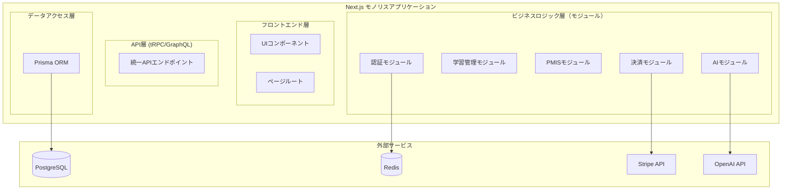

# モジュラーアーキテクチャ詳細設計書 v2.0

## 1. モノリスファーストアプローチ

### 1.1 モジュラーモノリス設計



### 1.2 モジュール間の通信パターン

| パターン | 用途 | 実装方法 |
|---------|------|----------|
| 直接呼び出し | モジュール間の同期処理 | TypeScript関数呼び出し |
| イベント駆動 | 非同期処理、疎結合 | EventEmitter/カスタムイベント |
| 依存性注入 | テスタビリティ、柔軟性 | DIコンテナ/コンストラクタ注入 |

## 2. 各モジュール詳細設計

### 2.1 認証モジュール（NextAuth.js統合）

#### tRPC API定義
```typescript
// src/server/api/routers/auth.ts
import { z } from 'zod';
import { createTRPCRouter, publicProcedure, protectedProcedure } from '../trpc';
import { hash, compare } from 'bcryptjs';
import { TRPCError } from '@trpc/server';

export const authRouter = createTRPCRouter({
  // ユーザー登録
  register: publicProcedure
    .input(z.object({
      email: z.string().email(),
      password: z.string().min(8),
      name: z.string().min(2),
    }))
    .mutation(async ({ ctx, input }) => {
      const existingUser = await ctx.db.user.findUnique({
        where: { email: input.email },
      });

      if (existingUser) {
        throw new TRPCError({
          code: 'CONFLICT',
          message: 'User already exists',
        });
      }

      const hashedPassword = await hash(input.password, 12);
      
      const user = await ctx.db.user.create({
        data: {
          email: input.email,
          name: input.name,
          password: hashedPassword,
        },
      });

      return { success: true, userId: user.id };
    }),

  // プロフィール取得
  getProfile: protectedProcedure
    .query(async ({ ctx }) => {
      const user = await ctx.db.user.findUnique({
        where: { id: ctx.session.user.id },
        select: {
          id: true,
          email: true,
          name: true,
          role: true,
          createdAt: true,
        },
      });

      return user;
    }),

  // プロフィール更新
  updateProfile: protectedProcedure
    .input(z.object({
      name: z.string().min(2).optional(),
      preferences: z.object({
        theme: z.enum(['light', 'dark']).optional(),
        language: z.enum(['ja', 'en']).optional(),
      }).optional(),
    }))
    .mutation(async ({ ctx, input }) => {
      const updated = await ctx.db.user.update({
        where: { id: ctx.session.user.id },
        data: input,
      });

      return { success: true };
    }),
});
```

#### NextAuth.js設定
```typescript
// src/lib/auth.ts
import { NextAuthOptions } from 'next-auth';
import CredentialsProvider from 'next-auth/providers/credentials';
import GoogleProvider from 'next-auth/providers/google';
import { PrismaAdapter } from '@next-auth/prisma-adapter';
import { db } from '@/lib/db';
import { compare } from 'bcryptjs';

export const authOptions: NextAuthOptions = {
  adapter: PrismaAdapter(db),
  session: {
    strategy: 'jwt',
  },
  pages: {
    signIn: '/auth/signin',
    signOut: '/auth/signout',
    error: '/auth/error',
  },
  providers: [
    CredentialsProvider({
      name: 'credentials',
      credentials: {
        email: { label: 'Email', type: 'email' },
        password: { label: 'Password', type: 'password' },
      },
      async authorize(credentials) {
        if (!credentials?.email || !credentials?.password) {
          return null;
        }

        const user = await db.user.findUnique({
          where: { email: credentials.email },
        });

        if (!user || !user.password) {
          return null;
        }

        const isPasswordValid = await compare(
          credentials.password,
          user.password
        );

        if (!isPasswordValid) {
          return null;
        }

        return {
          id: user.id,
          email: user.email,
          name: user.name,
          role: user.role,
        };
      },
    }),
    GoogleProvider({
      clientId: process.env.GOOGLE_CLIENT_ID!,
      clientSecret: process.env.GOOGLE_CLIENT_SECRET!,
    }),
  ],
  callbacks: {
    async session({ token, session }) {
      if (token) {
        session.user.id = token.id;
        session.user.name = token.name;
        session.user.email = token.email;
        session.user.role = token.role;
      }

      return session;
    },
    async jwt({ token, user }) {
      if (user) {
        token.id = user.id;
        token.role = user.role;
      }

      return token;
    },
  },
};
```

### 2.2 学習管理モジュール

#### tRPCルーター定義
```typescript
// src/server/api/routers/learning.ts
import { z } from 'zod';
import { createTRPCRouter, protectedProcedure, publicProcedure } from '../trpc';

const ProcessProgressSchema = z.object({
  processId: z.string(),
  progress: z.number().min(0).max(100),
  timeSpent: z.number().optional(),
  completedAt: z.date().optional(),
});

export const learningRouter = createTRPCRouter({
  // 学習進捗の取得
  getProgress: protectedProcedure
    .query(async ({ ctx }) => {
      const progress = await ctx.db.learningProgress.findMany({
        where: { userId: ctx.session.user.id },
        include: {
          process: true,
        },
      });
      
      return progress.reduce((acc, p) => {
        acc[p.processId] = {
          progress: p.progress,
          timeSpent: p.timeSpent,
          completedAt: p.completedAt,
          lastAccessed: p.updatedAt,
        };
        return acc;
      }, {} as Record<string, any>);
    }),

  // 進捗更新
  updateProgress: protectedProcedure
    .input(ProcessProgressSchema)
    .mutation(async ({ ctx, input }) => {
      return await ctx.db.learningProgress.upsert({
        where: {
          userId_processId: {
            userId: ctx.session.user.id,
            processId: input.processId,
          },
        },
        update: {
          progress: input.progress,
          timeSpent: input.timeSpent,
          completedAt: input.progress === 100 ? new Date() : null,
          updatedAt: new Date(),
        },
        create: {
          userId: ctx.session.user.id,
          processId: input.processId,
          progress: input.progress,
          timeSpent: input.timeSpent || 0,
        },
      });
    }),

  // フラッシュカード取得
  getFlashCards: publicProcedure
    .input(z.object({
      knowledgeArea: z.string().optional(),
      processGroup: z.string().optional(),
      limit: z.number().min(1).max(100).default(20),
    }).optional())
    .query(async ({ ctx, input }) => {
      const where: any = {};
      
      if (input?.knowledgeArea) {
        where.knowledgeArea = input.knowledgeArea;
      }
      if (input?.processGroup) {
        where.processGroup = input.processGroup;
      }
      
      const processes = await ctx.db.pmbokProcess.findMany({
        where,
        take: input?.limit || 20,
        include: {
          inputs: true,
          tools: true,
          outputs: true,
        },
      });
      
      return processes.map(p => ({
        id: p.id,
        front: {
          title: p.nameJa,
          description: p.description,
          knowledgeArea: p.knowledgeArea,
          processGroup: p.processGroup,
        },
        back: {
          inputs: p.inputs,
          tools: p.tools,
          outputs: p.outputs,
        },
      }));
    }),

  // 模擬試験結果保存
  saveExamResult: protectedProcedure
    .input(z.object({
      score: z.number().min(0).max(100),
      totalQuestions: z.number(),
      correctAnswers: z.number(),
      duration: z.number(), // 秒数
      details: z.array(z.object({
        questionId: z.string(),
        isCorrect: z.boolean(),
        timeSpent: z.number(),
      })),
    }))
    .mutation(async ({ ctx, input }) => {
      const result = await ctx.db.examResult.create({
        data: {
          userId: ctx.session.user.id,
          score: input.score,
          totalQuestions: input.totalQuestions,
          correctAnswers: input.correctAnswers,
          duration: input.duration,
          details: input.details,
        },
      });
      
      return { success: true, resultId: result.id };
    }),
});
```

#### リポジトリパターン（Prisma使用）
```typescript
// src/server/repositories/project.repository.ts
import { PrismaClient } from '@prisma/client';
import { Project, Prisma } from '@prisma/client';

export class ProjectRepository {
  constructor(private readonly prisma: PrismaClient) {}
  constructor(
    @InjectRepository(ProjectEntity)
    private readonly projectRepo: Repository<ProjectEntity>,
  ) {}

  async findById(id: string, tenantId: string): Promise<Project | null> {
    const entity = await this.projectRepo.findOne({
      where: { id, tenantId },
      relations: ['team', 'milestones', 'risks']
    });
    
    return entity ? this.toDomain(entity) : null;
  }

  async save(project: Project): Promise<void> {
    const entity = this.toEntity(project);
    await this.projectRepo.save(entity);
  }

  async findByFilters(filters: ProjectFilters, tenantId: string): Promise<Project[]> {
    const query = this.projectRepo
      .createQueryBuilder('project')
      .where('project.tenantId = :tenantId', { tenantId });

    if (filters.status) {
      query.andWhere('project.status = :status', { status: filters.status });
    }

    if (filters.startDateFrom) {
      query.andWhere('project.startDate >= :startDateFrom', { 
        startDateFrom: filters.startDateFrom 
      });
    }

    const entities = await query.getMany();
    return entities.map(this.toDomain);
  }

  private toDomain(entity: ProjectEntity): Project {
    return new Project({
      id: entity.id,
      tenantId: entity.tenantId,
      name: entity.name,
      // ... マッピングロジック
    });
  }

  private toEntity(domain: Project): ProjectEntity {
    const entity = new ProjectEntity();
    entity.id = domain.id;
    entity.tenantId = domain.tenantId;
    // ... マッピングロジック
    return entity;
  }
}
```

### 2.3 PMISモジュール（プロジェクト管理）

```typescript
// src/server/api/routers/pmis.ts
import { z } from 'zod';
import { createTRPCRouter, protectedProcedure } from '../trpc';
import { TRPCError } from '@trpc/server';

const TaskSchema = z.object({
  id: z.string(),
  projectId: z.string(),
  title: z.string(),
  description: z.string().optional(),
  status: z.enum(['TODO', 'IN_PROGRESS', 'DONE', 'BLOCKED']),
  priority: z.number().min(0).max(5),
  assigneeId: z.string().optional(),
  dueDate: z.date().optional(),
  estimatedHours: z.number().optional(),
  actualHours: z.number().optional(),
  dependencies: z.array(z.string()).optional(),
  tags: z.array(z.string()).optional(),
});

export const pmisRouter = createTRPCRouter({
  // プロジェクト作成
  createProject: protectedProcedure
    .input(z.object({
      name: z.string().min(1),
      description: z.string().optional(),
      startDate: z.date(),
      endDate: z.date().optional(),
      methodology: z.enum(['WATERFALL', 'AGILE', 'HYBRID']).default('HYBRID'),
    }))
    .mutation(async ({ ctx, input }) => {
      const project = await ctx.db.project.create({
        data: {
          ...input,
          ownerId: ctx.session.user.id,
          tenantId: ctx.session.user.tenantId,
        },
      });

      // デフォルトのマイルストーン作成
      await ctx.db.milestone.createMany({
        data: [
          { projectId: project.id, name: '計画', order: 1 },
          { projectId: project.id, name: '実行', order: 2 },
          { projectId: project.id, name: '監視・コントロール', order: 3 },
          { projectId: project.id, name: '終結', order: 4 },
        ],
      });

      return project;
    }),

  // タスク作成
  createTask: protectedProcedure
    .input(z.object({
      projectId: z.string(),
      title: z.string().min(1),
      description: z.string().optional(),
      priority: z.number().min(0).max(5).default(3),
      assigneeId: z.string().optional(),
      dueDate: z.date().optional(),
      estimatedHours: z.number().optional(),
    }))
    .mutation(async ({ ctx, input }) => {
      // プロジェクト権限チェック
      const project = await ctx.db.project.findFirst({
        where: {
          id: input.projectId,
          OR: [
            { ownerId: ctx.session.user.id },
            { members: { some: { userId: ctx.session.user.id } } },
          ],
        },
      });

      if (!project) {
        throw new TRPCError({
          code: 'FORBIDDEN',
          message: 'プロジェクトへのアクセス権限がありません',
        });
      }

      const task = await ctx.db.task.create({
        data: {
          ...input,
          status: 'TODO',
          createdById: ctx.session.user.id,
        },
      });

      // 通知イベント発行（EventEmitterを使用）
      if (input.assigneeId && input.assigneeId !== ctx.session.user.id) {
        ctx.eventBus.emit('task.assigned', {
          taskId: task.id,
          assigneeId: input.assigneeId,
          assignedBy: ctx.session.user.id,
          projectName: project.name,
          taskTitle: task.title,
        });
      }

      return task;
    }),

  // タスクステータス更新
  updateTaskStatus: protectedProcedure
    .input(z.object({
      taskId: z.string(),
      status: z.enum(['TODO', 'IN_PROGRESS', 'DONE', 'BLOCKED']),
    }))
    .mutation(async ({ ctx, input }) => {
      const task = await ctx.db.task.findUnique({
        where: { id: input.taskId },
        include: { project: true },
      });

      if (!task) {
        throw new TRPCError({
          code: 'NOT_FOUND',
          message: 'タスクが見つかりません',
        });
      }

      // 状態遷移の妥当性チェック
      const validTransitions: Record<string, string[]> = {
        TODO: ['IN_PROGRESS', 'BLOCKED'],
        IN_PROGRESS: ['DONE', 'BLOCKED', 'TODO'],
        BLOCKED: ['TODO', 'IN_PROGRESS'],
        DONE: ['TODO'], // 再オープン可能
      };

      if (!validTransitions[task.status]?.includes(input.status)) {
        throw new TRPCError({
          code: 'BAD_REQUEST',
          message: `${task.status}から${input.status}への遷移は許可されていません`,
        });
      }

      const updatedTask = await ctx.db.task.update({
        where: { id: input.taskId },
        data: {
          status: input.status,
          actualHours: input.status === 'DONE' ? task.estimatedHours : undefined,
        },
      });

      // 完了時の進捗更新
      if (input.status === 'DONE') {
        await ctx.db.project.update({
          where: { id: task.projectId },
          data: {
            completedTasks: { increment: 1 },
          },
        });
      }

      return updatedTask;
    }),

  // プロジェクトダッシュボードデータ取得
  getProjectDashboard: protectedProcedure
    .input(z.object({ projectId: z.string() }))
    .query(async ({ ctx, input }) => {
      const project = await ctx.db.project.findUnique({
        where: { id: input.projectId },
        include: {
          tasks: true,
          milestones: true,
          risks: true,
          members: {
            include: { user: true },
          },
        },
      });

      if (!project) {
        throw new TRPCError({
          code: 'NOT_FOUND',
          message: 'プロジェクトが見つかりません',
        });
      }

      // 統計情報の計算
      const stats = {
        totalTasks: project.tasks.length,
        completedTasks: project.tasks.filter(t => t.status === 'DONE').length,
        inProgressTasks: project.tasks.filter(t => t.status === 'IN_PROGRESS').length,
        blockedTasks: project.tasks.filter(t => t.status === 'BLOCKED').length,
        progressPercentage: Math.round(
          (project.tasks.filter(t => t.status === 'DONE').length / project.tasks.length) * 100
        ),
        totalEstimatedHours: project.tasks.reduce((sum, t) => sum + (t.estimatedHours || 0), 0),
        totalActualHours: project.tasks.reduce((sum, t) => sum + (t.actualHours || 0), 0),
      };

      return {
        project,
        stats,
      };
    }),
});
```

### 2.4 AIモジュール（OpenAI API統合）

```typescript
// src/server/api/routers/ai.ts
import { z } from 'zod';
import { createTRPCRouter, protectedProcedure } from '../trpc';
import { OpenAI } from 'openai';

export class AIService {
    def __init__(self):
        self.models = {}
        self.load_models()
    
    def load_models(self):
        """事前学習済みモデルのロード"""
        try:
            self.models['duration'] = joblib.load('/models/duration_predictor.pkl')
            self.models['risk'] = joblib.load('/models/risk_classifier.pkl')
            self.models['cost'] = joblib.load('/models/cost_estimator.pkl')
        except FileNotFoundError:
            # モデルが存在しない場合は初期化
            self.train_initial_models()
    
    def predict_project_duration(self, project_data: Dict[str, Any]) -> Dict[str, Any]:
        """プロジェクト期間の予測"""
        features = self._extract_duration_features(project_data)
        
        # 予測実行
        predicted_days = self.models['duration'].predict([features])[0]
        confidence_interval = self._calculate_confidence_interval(
            self.models['duration'], 
            [features]
        )
        
        # 類似プロジェクトの分析
        similar_projects = self._find_similar_projects(project_data)
        
        return {
            'predicted_duration_days': int(predicted_days),
            'confidence_interval': {
                'lower': int(confidence_interval[0]),
                'upper': int(confidence_interval[1])
            },
            'similar_projects': similar_projects,
            'factors': self._get_duration_factors(features)
        }
    
    def predict_risk_score(self, project_data: Dict[str, Any]) -> Dict[str, Any]:
        """プロジェクトリスクスコアの予測"""
        features = self._extract_risk_features(project_data)
        
        # リスクスコア計算
        risk_score = self.models['risk'].predict_proba([features])[0][1]
        risk_category = self._categorize_risk(risk_score)
        
        # 主要リスク要因の特定
        risk_factors = self._identify_risk_factors(project_data, features)
        
        # 推奨される軽減策
        mitigations = self._recommend_mitigations(risk_factors)
        
        return {
            'risk_score': float(risk_score),
            'risk_category': risk_category,
            'risk_factors': risk_factors,
            'recommended_mitigations': mitigations,
            'historical_comparison': self._compare_with_historical_risks(risk_score)
        }
    
    def optimize_resource_allocation(
        self, 
        project_id: str, 
        available_resources: List[Dict]
    ) -> Dict[str, Any]:
        """リソース配分の最適化"""
        # 現在のプロジェクトデータ取得
        project = self._get_project_data(project_id)
        tasks = self._get_project_tasks(project_id)
        
        # 最適化問題の定式化
        optimization_result = self._run_optimization(
            tasks, 
            available_resources,
            project['constraints']
        )
        
        return {
            'optimal_allocation': optimization_result['allocation'],
            'estimated_completion': optimization_result['completion_date'],
            'cost_savings': optimization_result['cost_savings'],
            'efficiency_gain': optimization_result['efficiency_gain'],
            'bottlenecks': optimization_result['identified_bottlenecks']
        }
    
    def _extract_duration_features(self, project_data: Dict) -> np.ndarray:
        """期間予測用の特徴量抽出"""
        return np.array([
            project_data.get('team_size', 0),
            project_data.get('complexity_score', 0),
            project_data.get('num_dependencies', 0),
            project_data.get('budget', 0),
            project_data.get('num_milestones', 0),
            # ... その他の特徴量
        ])
    
    def _calculate_confidence_interval(self, model, features, confidence=0.95):
        """予測の信頼区間計算"""
        predictions = []
        for tree in model.estimators_:
            predictions.append(tree.predict(features)[0])
        
        mean = np.mean(predictions)
        std = np.std(predictions)
        z_score = 1.96  # 95%信頼区間
        
        return (mean - z_score * std, mean + z_score * std)
```

### 2.5 通知モジュール

```typescript
// src/server/services/notification.service.ts
import nodemailer from 'nodemailer';
import { EventEmitter } from 'events';

export class NotificationService {
  private emailTransporter: nodemailer.Transporter;
  private slackClient: slack.WebClient;
  
  constructor() {
    this.initializeServices();
  }
  
  private initializeServices() {
    // Email設定
    this.emailTransporter = nodemailer.createTransport({
      host: process.env.SMTP_HOST,
      port: parseInt(process.env.SMTP_PORT),
      secure: true,
      auth: {
        user: process.env.SMTP_USER,
        pass: process.env.SMTP_PASS
      }
    });
    
    // Slack設定
    this.slackClient = new slack.WebClient(process.env.SLACK_TOKEN);
    
    // Firebase設定（プッシュ通知用）
    admin.initializeApp({
      credential: admin.credential.cert({
        projectId: process.env.FIREBASE_PROJECT_ID,
        clientEmail: process.env.FIREBASE_CLIENT_EMAIL,
        privateKey: process.env.FIREBASE_PRIVATE_KEY
      })
    });
  }
  
  @EventPattern('task.assigned')
  async handleTaskAssigned(data: any) {
    const { taskId, assigneeId, taskTitle } = data;
    
    // ユーザー設定取得
    const userPreferences = await this.getUserPreferences(assigneeId);
    
    // 通知送信
    const notifications = [];
    
    if (userPreferences.emailEnabled) {
      notifications.push(this.sendEmail(
        userPreferences.email,
        'タスクが割り当てられました',
        this.getTaskAssignedEmailTemplate(taskTitle)
      ));
    }
    
    if (userPreferences.slackEnabled) {
      notifications.push(this.sendSlack(
        userPreferences.slackChannelId,
        `新しいタスク「${taskTitle}」が割り当てられました`
      ));
    }
    
    if (userPreferences.pushEnabled) {
      notifications.push(this.sendPushNotification(
        userPreferences.fcmToken,
        'タスク割り当て',
        `新しいタスク「${taskTitle}」が割り当てられました`
      ));
    }
    
    await Promise.all(notifications);
  }
  
  private async sendEmail(to: string, subject: string, html: string) {
    try {
      await this.emailTransporter.sendMail({
        from: process.env.SMTP_FROM,
        to,
        subject,
        html
      });
    } catch (error) {
      console.error('Email送信エラー:', error);
      // エラーをメトリクスに記録
      this.recordNotificationError('email', error);
    }
  }
  
  private async sendSlack(channel: string, text: string) {
    try {
      await this.slackClient.chat.postMessage({
        channel,
        text,
        blocks: this.createSlackBlocks(text)
      });
    } catch (error) {
      console.error('Slack送信エラー:', error);
      this.recordNotificationError('slack', error);
    }
  }
  
  private async sendPushNotification(token: string, title: string, body: string) {
    try {
      await admin.messaging().send({
        token,
        notification: { title, body },
        data: {
          timestamp: new Date().toISOString()
        }
      });
    } catch (error) {
      console.error('プッシュ通知エラー:', error);
      this.recordNotificationError('push', error);
    }
  }
}
```

## 3. モジュール間の連携

### 3.1 シンプルなイベントシステム

```typescript
// src/lib/events/event-emitter.ts
import { EventEmitter } from 'events';

export class AppEventBus extends EventEmitter {
  private static instance: AppEventBus;
  
  private constructor() {
    super();
    this.setMaxListeners(100);
  }
  
  static getInstance(): AppEventBus {
    if (!AppEventBus.instance) {
      AppEventBus.instance = new AppEventBus();
    }
    return AppEventBus.instance;
  }
  
  async connect() {
    await this.producer.connect();
  }
  
  async publish(topic: string, event: Event) {
    await this.producer.send({
      topic,
      messages: [{
        key: event.aggregateId,
        value: JSON.stringify({
          ...event,
          timestamp: new Date().toISOString(),
          source: process.env.SERVICE_NAME
        }),
        headers: {
          'correlation-id': event.correlationId || uuidv4(),
          'event-type': event.type
        }
      }]
    });
  }
  
  async subscribe(topic: string, handler: EventHandler) {
    const consumerId = `${process.env.SERVICE_NAME}-${topic}`;
    
    if (!this.consumers.has(consumerId)) {
      const consumer = this.kafka.consumer({ 
        groupId: consumerId 
      });
      
      await consumer.connect();
      await consumer.subscribe({ topic, fromBeginning: false });
      
      this.consumers.set(consumerId, consumer);
      
      await consumer.run({
        eachMessage: async ({ message }) => {
          const event = JSON.parse(message.value.toString());
          
          try {
            await handler(event);
            // 処理成功をログ
            console.log(`Event processed: ${event.type}`);
          } catch (error) {
            // エラーハンドリング
            console.error(`Event processing failed: ${event.type}`, error);
            // Dead Letter Queueへ送信
            await this.sendToDeadLetter(event, error);
          }
        }
      });
    }
  }
  
  private async sendToDeadLetter(event: Event, error: Error) {
    await this.publish('dead-letter-queue', {
      ...event,
      error: {
        message: error.message,
        stack: error.stack,
        timestamp: new Date().toISOString()
      }
    });
  }
}
```

### 3.2 サービス間通信（モノリス内）

```typescript
// src/server/services/service-registry.ts
export class ServiceRegistry {
  private services: Map<string, any> = new Map();
data:
  consul.json: |
    {
      "datacenter": "dc1",
      "data_dir": "/consul/data",
      "log_level": "INFO",
      "server": true,
      "bootstrap_expect": 3,
      "ui": true,
      "connect": {
        "enabled": true
      },
      "ports": {
        "grpc": 8502
      },
      "acl": {
        "enabled": true,
        "default_policy": "allow"
      }
    }
---
apiVersion: apps/v1
kind: StatefulSet
metadata:
  name: consul
  namespace: pmp-system
spec:
  serviceName: consul
  replicas: 3
  selector:
    matchLabels:
      app: consul
  template:
    metadata:
      labels:
        app: consul
    spec:
      containers:
      - name: consul
        image: consul:1.16
        ports:
        - containerPort: 8500
          name: ui-port
        - containerPort: 8600
          name: dns-port
        - containerPort: 8502
          name: grpc-port
        volumeMounts:
        - name: consul-config
          mountPath: /consul/config
        - name: consul-data
          mountPath: /consul/data
      volumes:
      - name: consul-config
        configMap:
          name: consul-config
  volumeClaimTemplates:
  - metadata:
      name: consul-data
    spec:
      accessModes: ["ReadWriteOnce"]
      resources:
        requests:
          storage: 10Gi
```

## 4. データ整合性とトランザクション管理

### 4.1 トランザクション管理（Prismaトランザクション）

```typescript
// src/server/services/transaction.service.ts
import { PrismaClient } from '@prisma/client';

export class TransactionService {
  private steps: SagaStep[] = [];
  private compensations: CompensationStep[] = [];
  
  addStep(step: SagaStep, compensation?: CompensationStep) {
    this.steps.push(step);
    if (compensation) {
      this.compensations.push(compensation);
    }
  }
  
  async execute(context: SagaContext): Promise<SagaResult> {
    const executedSteps: number[] = [];
    
    try {
      // 各ステップを順次実行
      for (let i = 0; i < this.steps.length; i++) {
        const step = this.steps[i];
        
        console.log(`Executing step ${i}: ${step.name}`);
        await step.execute(context);
        executedSteps.push(i);
        
        // ステップ完了をイベントとして発行
        await this.publishStepCompleted(step.name, context);
      }
      
      return {
        success: true,
        context
      };
      
    } catch (error) {
      console.error(`Saga failed at step ${executedSteps.length}:`, error);
      
      // 補償トランザクションを逆順で実行
      for (let i = executedSteps.length - 1; i >= 0; i--) {
        const compensation = this.compensations[i];
        if (compensation) {
          try {
            console.log(`Compensating step ${i}: ${compensation.name}`);
            await compensation.execute(context);
          } catch (compError) {
            console.error(`Compensation failed for step ${i}:`, compError);
            // 補償失敗は記録するが、続行する
          }
        }
      }
      
      return {
        success: false,
        error: error.message,
        compensated: true
      };
    }
  }
}

// 使用例
const createOrderSaga = new SagaOrchestrator();

createOrderSaga.addStep(
  {
    name: 'reserve-inventory',
    execute: async (ctx) => {
      const result = await inventoryService.reserve(ctx.items);
      ctx.reservationId = result.id;
    }
  },
  {
    name: 'cancel-reservation',
    execute: async (ctx) => {
      await inventoryService.cancelReservation(ctx.reservationId);
    }
  }
);

createOrderSaga.addStep(
  {
    name: 'process-payment',
    execute: async (ctx) => {
      const result = await paymentService.charge(ctx.payment);
      ctx.paymentId = result.id;
    }
  },
  {
    name: 'refund-payment',
    execute: async (ctx) => {
      await paymentService.refund(ctx.paymentId);
    }
  }
);
```

## 5. 監視とロギング

### 5.1 分散トレーシング

```typescript
// shared/tracing/tracer.ts
import { NodeTracerProvider } from '@opentelemetry/sdk-trace-node';
import { Resource } from '@opentelemetry/resources';
import { SemanticResourceAttributes } from '@opentelemetry/semantic-conventions';
import { JaegerExporter } from '@opentelemetry/exporter-jaeger';
import { BatchSpanProcessor } from '@opentelemetry/sdk-trace-base';

export function initializeTracing(serviceName: string) {
  const provider = new NodeTracerProvider({
    resource: new Resource({
      [SemanticResourceAttributes.SERVICE_NAME]: serviceName,
      [SemanticResourceAttributes.SERVICE_VERSION]: process.env.SERVICE_VERSION || '1.0.0',
    }),
  });

  const jaegerExporter = new JaegerExporter({
    endpoint: process.env.JAEGER_ENDPOINT || 'http://localhost:14268/api/traces',
  });

  provider.addSpanProcessor(new BatchSpanProcessor(jaegerExporter));
  provider.register();

  return provider;
}

// 使用例
import { trace, context, SpanStatusCode } from '@opentelemetry/api';

const tracer = trace.getTracer('pmis-service');

export async function processTask(taskData: any) {
  const span = tracer.startSpan('process-task');
  
  try {
    span.setAttributes({
      'task.id': taskData.id,
      'task.type': taskData.type,
      'user.id': taskData.userId
    });
    
    // ビジネスロジック
    const result = await performTaskProcessing(taskData);
    
    span.setStatus({ code: SpanStatusCode.OK });
    return result;
    
  } catch (error) {
    span.recordException(error);
    span.setStatus({ 
      code: SpanStatusCode.ERROR, 
      message: error.message 
    });
    throw error;
    
  } finally {
    span.end();
  }
}
```

### 5.2 メトリクス収集

```typescript
// src/server/monitoring/metrics.ts
import { Counter, Histogram, register } from 'prom-client';
data:
  prometheus.yml: |
    global:
      scrape_interval: 15s
      evaluation_interval: 15s
    
    rule_files:
      - /etc/prometheus/rules/*.yml
    
    scrape_configs:
      - job_name: 'kubernetes-pods'
        kubernetes_sd_configs:
          - role: pod
        relabel_configs:
          - source_labels: [__meta_kubernetes_pod_annotation_prometheus_io_scrape]
            action: keep
            regex: true
          - source_labels: [__meta_kubernetes_pod_annotation_prometheus_io_path]
            action: replace
            target_label: __metrics_path__
            regex: (.+)
          - source_labels: [__address__, __meta_kubernetes_pod_annotation_prometheus_io_port]
            action: replace
            regex: ([^:]+)(?::\d+)?;(\d+)
            replacement: $1:$2
            target_label: __address__
      
      - job_name: 'node-exporter'
        kubernetes_sd_configs:
          - role: node
        relabel_configs:
          - source_labels: [__address__]
            regex: '(.*):10250'
            replacement: '${1}:9100'
            target_label: __address__
```

## 6. セキュリティ実装

### 6.1 API Gateway セキュリティ

```typescript
// api-gateway/src/middleware/security.middleware.ts
import rateLimit from 'express-rate-limit';
import helmet from 'helmet';
import { Request, Response, NextFunction } from 'express';
import jwt from 'jsonwebtoken';

// Rate Limiting
export const rateLimiter = rateLimit({
  windowMs: 15 * 60 * 1000, // 15分
  max: 100, // リクエスト数
  standardHeaders: true,
  legacyHeaders: false,
  handler: (req, res) => {
    res.status(429).json({
      error: 'Too many requests',
      retryAfter: req.rateLimit.resetTime
    });
  }
});

// JWT検証
export const authenticateToken = (req: Request, res: Response, next: NextFunction) => {
  const authHeader = req.headers['authorization'];
  const token = authHeader && authHeader.split(' ')[1];

  if (!token) {
    return res.status(401).json({ error: 'Access token required' });
  }

  jwt.verify(token, process.env.JWT_SECRET, (err, user) => {
    if (err) {
      return res.status(403).json({ error: 'Invalid or expired token' });
    }
    
    req.user = user;
    next();
  });
};

// API Key検証
export const validateApiKey = (req: Request, res: Response, next: NextFunction) => {
  const apiKey = req.headers['x-api-key'];
  
  if (!apiKey || !isValidApiKey(apiKey)) {
    return res.status(401).json({ error: 'Invalid API key' });
  }
  
  next();
};

// セキュリティヘッダー
export const securityHeaders = helmet({
  contentSecurityPolicy: {
    directives: {
      defaultSrc: ["'self'"],
      styleSrc: ["'self'", "'unsafe-inline'"],
      scriptSrc: ["'self'"],
      imgSrc: ["'self'", "data:", "https:"],
    },
  },
  hsts: {
    maxAge: 31536000,
    includeSubDomains: true,
    preload: true
  }
});
```

## 7. パフォーマンス最適化

### 7.1 データベース最適化

```sql
-- インデックス戦略
CREATE INDEX idx_projects_tenant_status ON projects(tenant_id, status) 
WHERE deleted_at IS NULL;

CREATE INDEX idx_tasks_project_assignee ON tasks(project_id, assignee_id) 
WHERE status != 'DONE';

-- パーティショニング
CREATE TABLE tasks_2024 PARTITION OF tasks
FOR VALUES FROM ('2024-01-01') TO ('2025-01-01');

-- マテリアライズドビュー
CREATE MATERIALIZED VIEW project_statistics AS
SELECT 
    p.id as project_id,
    p.tenant_id,
    COUNT(DISTINCT t.id) as total_tasks,
    COUNT(DISTINCT t.id) FILTER (WHERE t.status = 'DONE') as completed_tasks,
    AVG(t.actual_hours) as avg_task_hours,
    SUM(t.actual_hours) as total_hours
FROM projects p
LEFT JOIN tasks t ON p.id = t.project_id
GROUP BY p.id, p.tenant_id;

-- 自動リフレッシュ
CREATE OR REPLACE FUNCTION refresh_project_statistics()
RETURNS trigger AS $$
BEGIN
    REFRESH MATERIALIZED VIEW CONCURRENTLY project_statistics;
    RETURN NULL;
END;
$$ LANGUAGE plpgsql;

CREATE TRIGGER refresh_stats_on_task_change
AFTER INSERT OR UPDATE OR DELETE ON tasks
FOR EACH STATEMENT
EXECUTE FUNCTION refresh_project_statistics();
```

### 7.2 キャッシング戦略

```typescript
// shared/cache/multi-layer-cache.ts
export class MultiLayerCache {
  private l1Cache: Map<string, CacheEntry> = new Map(); // メモリキャッシュ
  private l2Cache: RedisClient; // Redisキャッシュ
  
  constructor(redisClient: RedisClient) {
    this.l2Cache = redisClient;
    this.startEvictionTimer();
  }
  
  async get<T>(key: string): Promise<T | null> {
    // L1キャッシュチェック
    const l1Entry = this.l1Cache.get(key);
    if (l1Entry && !this.isExpired(l1Entry)) {
      return l1Entry.value as T;
    }
    
    // L2キャッシュチェック
    const l2Value = await this.l2Cache.get(key);
    if (l2Value) {
      const parsed = JSON.parse(l2Value);
      // L1キャッシュに昇格
      this.l1Cache.set(key, {
        value: parsed,
        expiry: Date.now() + 60000 // 1分
      });
      return parsed;
    }
    
    return null;
  }
  
  async set<T>(key: string, value: T, ttl: number = 3600): Promise<void> {
    // L1キャッシュに保存
    this.l1Cache.set(key, {
      value,
      expiry: Date.now() + Math.min(ttl * 1000, 60000)
    });
    
    // L2キャッシュに保存
    await this.l2Cache.setex(key, ttl, JSON.stringify(value));
  }
  
  async invalidate(pattern: string): Promise<void> {
    // L1キャッシュから削除
    for (const key of this.l1Cache.keys()) {
      if (key.match(pattern)) {
        this.l1Cache.delete(key);
      }
    }
    
    // L2キャッシュから削除
    const keys = await this.l2Cache.keys(pattern);
    if (keys.length > 0) {
      await this.l2Cache.del(...keys);
    }
  }
  
  private isExpired(entry: CacheEntry): boolean {
    return Date.now() > entry.expiry;
  }
  
  private startEvictionTimer() {
    setInterval(() => {
      for (const [key, entry] of this.l1Cache.entries()) {
        if (this.isExpired(entry)) {
          this.l1Cache.delete(key);
        }
      }
    }, 10000); // 10秒ごと
  }
}
```

## 8. テスト戦略

### 8.1 統合テスト

```typescript
// tests/integration/project-service.test.ts
import { Test } from '@nestjs/testing';
import { INestApplication } from '@nestjs/common';
import * as request from 'supertest';
import { ProjectModule } from '../../src/modules/project.module';

describe('Project Service Integration Tests', () => {
  let app: INestApplication;
  let authToken: string;
  
  beforeAll(async () => {
    const moduleRef = await Test.createTestingModule({
      imports: [ProjectModule],
    }).compile();
    
    app = moduleRef.createNestApplication();
    await app.init();
    
    // テスト用認証トークン取得
    authToken = await getTestAuthToken();
  });
  
  afterAll(async () => {
    await app.close();
  });
  
  describe('POST /projects', () => {
    it('should create a new project', async () => {
      const projectData = {
        name: 'Test Project',
        description: 'Test Description',
        startDate: '2024-01-01',
        endDate: '2024-12-31'
      };
      
      const response = await request(app.getHttpServer())
        .post('/projects')
        .set('Authorization', `Bearer ${authToken}`)
        .send(projectData)
        .expect(201);
      
      expect(response.body).toHaveProperty('id');
      expect(response.body.name).toBe(projectData.name);
    });
    
    it('should validate required fields', async () => {
      const invalidData = {
        description: 'Missing name field'
      };
      
      const response = await request(app.getHttpServer())
        .post('/projects')
        .set('Authorization', `Bearer ${authToken}`)
        .send(invalidData)
        .expect(400);
      
      expect(response.body.errors).toContain('name is required');
    });
  });
  
  describe('GET /projects/:id', () => {
    it('should return project details', async () => {
      const projectId = 'test-project-id';
      
      const response = await request(app.getHttpServer())
        .get(`/projects/${projectId}`)
        .set('Authorization', `Bearer ${authToken}`)
        .expect(200);
      
      expect(response.body.id).toBe(projectId);
      expect(response.body).toHaveProperty('tasks');
      expect(response.body).toHaveProperty('team');
    });
    
    it('should return 404 for non-existent project', async () => {
      await request(app.getHttpServer())
        .get('/projects/non-existent')
        .set('Authorization', `Bearer ${authToken}`)
        .expect(404);
    });
  });
});
```

### 8.2 契約テスト（Pact）

```typescript
// tests/contract/consumer.pact.test.ts
import { Pact } from '@pact-foundation/pact';
import { ProjectApiClient } from '../../src/clients/project-api.client';

describe('Project API Consumer Contract', () => {
  const provider = new Pact({
    consumer: 'Frontend',
    provider: 'ProjectService',
    port: 1234,
    log: './pact/logs',
    dir: './pact/contracts'
  });
  
  beforeAll(() => provider.setup());
  afterAll(() => provider.finalize());
  
  describe('get project', () => {
    it('should return project details', async () => {
      const expectedProject = {
        id: '123',
        name: 'Test Project',
        status: 'ACTIVE'
      };
      
      await provider.addInteraction({
        state: 'project 123 exists',
        uponReceiving: 'a request for project 123',
        withRequest: {
          method: 'GET',
          path: '/projects/123',
          headers: {
            'Authorization': 'Bearer token'
          }
        },
        willRespondWith: {
          status: 200,
          headers: {
            'Content-Type': 'application/json'
          },
          body: expectedProject
        }
      });
      
      const client = new ProjectApiClient(provider.mockService.baseUrl);
      const project = await client.getProject('123', 'token');
      
      expect(project).toEqual(expectedProject);
    });
  });
});
```

## 9. デプロイメント戦略

### 9.1 Vercelデプロイメント

```json
// vercel.json
apiVersion: v1
kind: Service
metadata:
  name: project-service
  namespace: pmp-system
spec:
  selector:
    app: project-service
    version: green  # 現在のアクティブバージョン
  ports:
    - port: 80
      targetPort: 3000
---
# Blue デプロイメント
apiVersion: apps/v1
kind: Deployment
metadata:
  name: project-service-blue
  namespace: pmp-system
spec:
  replicas: 3
  selector:
    matchLabels:
      app: project-service
      version: blue
  template:
    metadata:
      labels:
        app: project-service
        version: blue
    spec:
      containers:
      - name: project-service
        image: pmp-system/project-service:v1.0.0
        ports:
        - containerPort: 3000
---
# Green デプロイメント
apiVersion: apps/v1
kind: Deployment
metadata:
  name: project-service-green
  namespace: pmp-system
spec:
  replicas: 3
  selector:
    matchLabels:
      app: project-service
      version: green
  template:
    metadata:
      labels:
        app: project-service
        version: green
    spec:
      containers:
      - name: project-service
        image: pmp-system/project-service:v1.1.0
        ports:
        - containerPort: 3000
```

### 9.2 GitHub Actions CI/CD

```yaml
# .github/workflows/deploy.yml
kind: Canary
metadata:
  name: project-service
  namespace: pmp-system
spec:
  targetRef:
    apiVersion: apps/v1
    kind: Deployment
    name: project-service
  service:
    port: 80
    targetPort: 3000
  analysis:
    interval: 1m
    threshold: 10
    maxWeight: 50
    stepWeight: 10
    metrics:
    - name: request-success-rate
      thresholdRange:
        min: 99
      interval: 1m
    - name: request-duration
      thresholdRange:
        max: 500
      interval: 1m
  webhooks:
    - name: load-test
      url: http://loadtester.pmp-system/
      timeout: 5s
      metadata:
        cmd: "hey -z 1m -q 10 -c 2 http://project-service.pmp-system/"
```

## まとめ

このモジュラーアーキテクチャ詳細設計書は、PMPLearningManagementシステムのモノリスファーストアプローチによる実装詳細を定義しています。

### 主要な特徴
- **モノリスファースト**: 初期はNext.jsを使った単一アプリケーション
- **モジュラー設計**: 内部でモジュール化された構造
- **段饨的成長**: 必要に応じてサービス分離可能
- **TypeScript統一**: フロントエンドからバックエンドまで一貫した言語
- **コスト効率**: 初期コスト$0-20/月から段饨的に拡張

このアプローチにより、2-3名の小規模チームでも実装可能で、ビジネスの成長に応じて柔軟にスケールできるシステムを実現します。