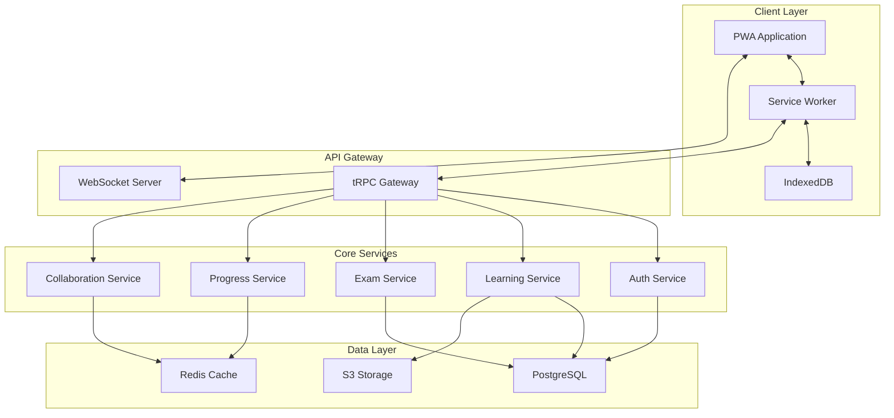

# PWA Backend Integration Architecture

## Executive Summary

This document provides a comprehensive architecture plan for optimizing PMPLearningManagement's PWA implementation with production-ready backend integration capabilities. The architecture focuses on offline-first design, real-time synchronization, and scalable service boundaries.

## Current State Analysis

### Existing PWA Implementation

#### Strengths
- Basic Service Worker implementation with multi-cache strategy
- IndexedDB integration through offlineManager.js  
- PWA manifest with app installation support
- Offline HTML fallback page
- Background sync registration

#### Gaps Identified
1. **Service Worker Limitations**
   - No advanced caching strategies (only basic cache/network first)
   - Missing runtime cache management and cleanup
   - No request routing based on content type
   - Limited error handling and retry logic

2. **Data Synchronization Issues**
   - No conflict resolution strategy
   - Missing optimistic updates
   - Lack of incremental sync
   - No data versioning system

3. **Performance Bottlenecks**
   - Large bundle sizes without proper code splitting
   - No service worker update strategy
   - Missing cache versioning and migration
   - Inefficient asset preloading

## Recommended Architecture

### 1. Service Boundaries & Microservices



### 2. Enhanced Service Worker Architecture

```javascript
// src/services/workers/enhanced-service-worker.js

const CACHE_STRATEGIES = {
  NETWORK_FIRST: 'network-first',
  CACHE_FIRST: 'cache-first',
  STALE_WHILE_REVALIDATE: 'stale-while-revalidate',
  NETWORK_ONLY: 'network-only',
  CACHE_ONLY: 'cache-only'
};

class EnhancedServiceWorker {
  constructor() {
    this.version = '3.0.0';
    this.caches = {
      static: `static-v${this.version}`,
      dynamic: `dynamic-v${this.version}`,
      api: `api-v${this.version}`,
      media: `media-v${this.version}`
    };
    
    this.routes = new Map();
    this.setupRoutes();
  }

  setupRoutes() {
    // Static assets - Cache First
    this.routes.set(/\.(js|css|woff2?)$/, {
      strategy: CACHE_STRATEGIES.CACHE_FIRST,
      cache: this.caches.static,
      ttl: 30 * 24 * 60 * 60 * 1000 // 30 days
    });

    // API calls - Network First with timeout
    this.routes.set(/\/api\//, {
      strategy: CACHE_STRATEGIES.NETWORK_FIRST,
      cache: this.caches.api,
      networkTimeout: 3000,
      ttl: 5 * 60 * 1000 // 5 minutes
    });

    // Images - Stale While Revalidate
    this.routes.set(/\.(png|jpg|jpeg|webp|svg)$/, {
      strategy: CACHE_STRATEGIES.STALE_WHILE_REVALIDATE,
      cache: this.caches.media,
      ttl: 7 * 24 * 60 * 60 * 1000 // 7 days
    });

    // Real-time endpoints - Network Only
    this.routes.set(/\/(ws|socket\.io)\//, {
      strategy: CACHE_STRATEGIES.NETWORK_ONLY
    });
  }

  async handleFetch(request) {
    const url = new URL(request.url);
    
    // Find matching route
    for (const [pattern, config] of this.routes) {
      if (pattern.test(url.pathname)) {
        return this.executeStrategy(request, config);
      }
    }
    
    // Default strategy
    return this.executeStrategy(request, {
      strategy: CACHE_STRATEGIES.NETWORK_FIRST,
      cache: this.caches.dynamic
    });
  }

  async executeStrategy(request, config) {
    const { strategy, cache: cacheName, networkTimeout, ttl } = config;
    
    switch (strategy) {
      case CACHE_STRATEGIES.CACHE_FIRST:
        return this.cacheFirst(request, cacheName, ttl);
      
      case CACHE_STRATEGIES.NETWORK_FIRST:
        return this.networkFirst(request, cacheName, networkTimeout, ttl);
      
      case CACHE_STRATEGIES.STALE_WHILE_REVALIDATE:
        return this.staleWhileRevalidate(request, cacheName, ttl);
      
      case CACHE_STRATEGIES.NETWORK_ONLY:
        return fetch(request);
      
      case CACHE_STRATEGIES.CACHE_ONLY:
        return this.cacheOnly(request, cacheName);
      
      default:
        return fetch(request);
    }
  }

  async cacheFirst(request, cacheName, ttl) {
    const cache = await caches.open(cacheName);
    const cached = await cache.match(request);
    
    if (cached) {
      const age = Date.now() - new Date(cached.headers.get('date')).getTime();
      if (!ttl || age < ttl) {
        return cached;
      }
    }
    
    try {
      const response = await fetch(request);
      if (response.ok) {
        cache.put(request, response.clone());
      }
      return response;
    } catch (error) {
      if (cached) return cached;
      throw error;
    }
  }

  async networkFirst(request, cacheName, timeout = 3000, ttl) {
    const cache = await caches.open(cacheName);
    
    try {
      const networkPromise = fetch(request);
      const timeoutPromise = new Promise((_, reject) =>
        setTimeout(() => reject(new Error('Network timeout')), timeout)
      );
      
      const response = await Promise.race([networkPromise, timeoutPromise]);
      
      if (response.ok) {
        cache.put(request, response.clone());
      }
      return response;
    } catch (error) {
      const cached = await cache.match(request);
      if (cached) {
        const age = Date.now() - new Date(cached.headers.get('date')).getTime();
        if (!ttl || age < ttl) {
          return cached;
        }
      }
      throw error;
    }
  }

  async staleWhileRevalidate(request, cacheName, ttl) {
    const cache = await caches.open(cacheName);
    const cached = await cache.match(request);
    
    const fetchPromise = fetch(request).then(response => {
      if (response.ok) {
        cache.put(request, response.clone());
      }
      return response;
    });
    
    if (cached) {
      const age = Date.now() - new Date(cached.headers.get('date')).getTime();
      if (!ttl || age < ttl) {
        return cached;
      }
    }
    
    return fetchPromise;
  }

  async cacheOnly(request, cacheName) {
    const cache = await caches.open(cacheName);
    const cached = await cache.match(request);
    
    if (!cached) {
      throw new Error('No cached response available');
    }
    
    return cached;
  }

  async cleanupCaches() {
    const cacheNames = await caches.keys();
    const currentCaches = Object.values(this.caches);
    
    return Promise.all(
      cacheNames
        .filter(name => !currentCaches.includes(name))
        .map(name => caches.delete(name))
    );
  }
}

// Initialize and export
const serviceWorker = new EnhancedServiceWorker();

// Service Worker Events
self.addEventListener('install', event => {
  event.waitUntil(
    Promise.all([
      serviceWorker.precacheAssets(),
      self.skipWaiting()
    ])
  );
});

self.addEventListener('activate', event => {
  event.waitUntil(
    Promise.all([
      serviceWorker.cleanupCaches(),
      self.clients.claim()
    ])
  );
});

self.addEventListener('fetch', event => {
  event.respondWith(serviceWorker.handleFetch(event.request));
});
```

### 3. Offline-First Data Synchronization

```typescript
// src/services/sync/offline-sync-manager.ts

interface SyncOperation {
  id: string;
  type: 'CREATE' | 'UPDATE' | 'DELETE';
  entity: string;
  data: any;
  timestamp: number;
  retries: number;
  status: 'pending' | 'syncing' | 'completed' | 'failed';
}

interface ConflictResolution {
  strategy: 'client-wins' | 'server-wins' | 'merge' | 'manual';
  resolver?: (client: any, server: any) => any;
}

class OfflineSyncManager {
  private db: IDBDatabase;
  private syncQueue: Map<string, SyncOperation>;
  private conflictStrategies: Map<string, ConflictResolution>;
  
  constructor() {
    this.syncQueue = new Map();
    this.conflictStrategies = new Map();
    this.initializeDB();
    this.setupConflictStrategies();
  }

  private async initializeDB() {
    const request = indexedDB.open('PMPSyncDB', 1);
    
    request.onupgradeneeded = (event) => {
      const db = (event.target as IDBOpenDBRequest).result;
      
      // Sync queue store
      if (!db.objectStoreNames.contains('syncQueue')) {
        const syncStore = db.createObjectStore('syncQueue', { keyPath: 'id' });
        syncStore.createIndex('status', 'status');
        syncStore.createIndex('timestamp', 'timestamp');
      }
      
      // Conflict resolution store
      if (!db.objectStoreNames.contains('conflicts')) {
        const conflictStore = db.createObjectStore('conflicts', { keyPath: 'id' });
        conflictStore.createIndex('entity', 'entity');
        conflictStore.createIndex('resolved', 'resolved');
      }
      
      // Version tracking store
      if (!db.objectStoreNames.contains('versions')) {
        const versionStore = db.createObjectStore('versions', { keyPath: 'entity' });
        versionStore.createIndex('lastSync', 'lastSync');
      }
    };
    
    this.db = await new Promise((resolve, reject) => {
      request.onsuccess = () => resolve(request.result);
      request.onerror = () => reject(request.error);
    });
  }

  private setupConflictStrategies() {
    // Learning progress - merge strategy
    this.conflictStrategies.set('progress', {
      strategy: 'merge',
      resolver: (client, server) => ({
        ...server,
        ...client,
        completedTopics: [...new Set([...server.completedTopics, ...client.completedTopics])],
        totalTime: Math.max(server.totalTime, client.totalTime),
        lastUpdated: Math.max(server.lastUpdated, client.lastUpdated)
      })
    });
    
    // Exam results - client wins (preserve local exam data)
    this.conflictStrategies.set('examResults', {
      strategy: 'client-wins'
    });
    
    // User preferences - server wins
    this.conflictStrategies.set('preferences', {
      strategy: 'server-wins'
    });
    
    // Notes and annotations - manual resolution
    this.conflictStrategies.set('notes', {
      strategy: 'manual'
    });
  }

  async queueOperation(operation: Omit<SyncOperation, 'id' | 'timestamp' | 'retries' | 'status'>) {
    const syncOp: SyncOperation = {
      ...operation,
      id: crypto.randomUUID(),
      timestamp: Date.now(),
      retries: 0,
      status: 'pending'
    };
    
    // Store in IndexedDB
    const tx = this.db.transaction('syncQueue', 'readwrite');
    await tx.objectStore('syncQueue').add(syncOp);
    
    // Add to memory queue
    this.syncQueue.set(syncOp.id, syncOp);
    
    // Attempt immediate sync if online
    if (navigator.onLine) {
      this.processSyncQueue();
    }
    
    return syncOp.id;
  }

  async processSyncQueue() {
    const pendingOps = await this.getPendingOperations();
    
    for (const op of pendingOps) {
      try {
        await this.syncOperation(op);
      } catch (error) {
        await this.handleSyncError(op, error);
      }
    }
  }

  private async syncOperation(op: SyncOperation) {
    // Update status
    op.status = 'syncing';
    await this.updateOperation(op);
    
    // Perform sync based on operation type
    const endpoint = `/api/sync/${op.entity}`;
    const response = await fetch(endpoint, {
      method: 'POST',
      headers: {
        'Content-Type': 'application/json',
        'X-Sync-Operation': op.type,
        'X-Client-Timestamp': op.timestamp.toString()
      },
      body: JSON.stringify(op.data)
    });
    
    if (!response.ok) {
      throw new Error(`Sync failed: ${response.statusText}`);
    }
    
    const result = await response.json();
    
    // Handle conflicts
    if (result.conflict) {
      await this.resolveConflict(op, result.serverData);
    } else {
      // Mark as completed
      op.status = 'completed';
      await this.updateOperation(op);
      this.syncQueue.delete(op.id);
    }
  }

  private async resolveConflict(op: SyncOperation, serverData: any) {
    const strategy = this.conflictStrategies.get(op.entity);
    
    if (!strategy) {
      // Default to server-wins
      op.status = 'completed';
      await this.updateOperation(op);
      return;
    }
    
    switch (strategy.strategy) {
      case 'client-wins':
        // Retry with force flag
        op.data._forceOverwrite = true;
        await this.syncOperation(op);
        break;
        
      case 'server-wins':
        // Accept server version
        await this.acceptServerVersion(op.entity, serverData);
        op.status = 'completed';
        await this.updateOperation(op);
        break;
        
      case 'merge':
        if (strategy.resolver) {
          const merged = strategy.resolver(op.data, serverData);
          op.data = merged;
          await this.syncOperation(op);
        }
        break;
        
      case 'manual':
        // Store conflict for user resolution
        await this.storeConflict(op, serverData);
        break;
    }
  }

  private async handleSyncError(op: SyncOperation, error: any) {
    op.retries++;
    
    if (op.retries < 3) {
      // Exponential backoff
      const delay = Math.pow(2, op.retries) * 1000;
      setTimeout(() => this.syncOperation(op), delay);
    } else {
      op.status = 'failed';
      await this.updateOperation(op);
      
      // Notify user
      this.notifyUser({
        type: 'error',
        message: `Failed to sync ${op.entity}. Will retry when connection improves.`
      });
    }
  }

  private async getPendingOperations(): Promise<SyncOperation[]> {
    const tx = this.db.transaction('syncQueue', 'readonly');
    const index = tx.objectStore('syncQueue').index('status');
    return index.getAll('pending');
  }

  private async updateOperation(op: SyncOperation) {
    const tx = this.db.transaction('syncQueue', 'readwrite');
    await tx.objectStore('syncQueue').put(op);
  }

  private async acceptServerVersion(entity: string, data: any) {
    // Update local data with server version
    const tx = this.db.transaction(entity, 'readwrite');
    await tx.objectStore(entity).put(data);
  }

  private async storeConflict(op: SyncOperation, serverData: any) {
    const conflict = {
      id: crypto.randomUUID(),
      entity: op.entity,
      clientData: op.data,
      serverData,
      timestamp: Date.now(),
      resolved: false
    };
    
    const tx = this.db.transaction('conflicts', 'readwrite');
    await tx.objectStore('conflicts').add(conflict);
    
    // Notify user of conflict
    this.notifyUser({
      type: 'warning',
      message: `Conflict detected in ${op.entity}. Manual resolution required.`,
      action: {
        label: 'Resolve',
        handler: () => this.openConflictResolver(conflict.id)
      }
    });
  }

  private notifyUser(notification: any) {
    // Dispatch custom event for UI notification
    window.dispatchEvent(new CustomEvent('sync-notification', { detail: notification }));
  }

  private openConflictResolver(conflictId: string) {
    // Open conflict resolution UI
    window.dispatchEvent(new CustomEvent('open-conflict-resolver', { detail: { conflictId } }));
  }

  // Incremental sync
  async performIncrementalSync(entity: string, lastSyncTimestamp: number) {
    const endpoint = `/api/sync/${entity}/incremental`;
    
    const response = await fetch(endpoint, {
      method: 'GET',
      headers: {
        'X-Last-Sync': lastSyncTimestamp.toString()
      }
    });
    
    if (!response.ok) {
      throw new Error(`Incremental sync failed: ${response.statusText}`);
    }
    
    const { changes, deletions, timestamp } = await response.json();
    
    // Apply changes
    const tx = this.db.transaction(entity, 'readwrite');
    const store = tx.objectStore(entity);
    
    for (const change of changes) {
      await store.put(change);
    }
    
    for (const id of deletions) {
      await store.delete(id);
    }
    
    // Update sync timestamp
    await this.updateSyncTimestamp(entity, timestamp);
    
    return { changes: changes.length, deletions: deletions.length };
  }

  private async updateSyncTimestamp(entity: string, timestamp: number) {
    const tx = this.db.transaction('versions', 'readwrite');
    await tx.objectStore('versions').put({
      entity,
      lastSync: timestamp,
      version: await this.getEntityVersion(entity)
    });
  }

  private async getEntityVersion(entity: string): Promise<string> {
    // Generate version hash based on entity data
    const tx = this.db.transaction(entity, 'readonly');
    const data = await tx.objectStore(entity).getAll();
    
    const hash = await crypto.subtle.digest(
      'SHA-256',
      new TextEncoder().encode(JSON.stringify(data))
    );
    
    return Array.from(new Uint8Array(hash))
      .map(b => b.toString(16).padStart(2, '0'))
      .join('');
  }
}

export const syncManager = new OfflineSyncManager();
```

### 4. tRPC Integration with PWA

```typescript
// src/server/trpc/context.ts
import { CreateNextContextOptions } from '@trpc/server/adapters/next';
import { prisma } from '../db';
import { redis } from '../cache';

export async function createContext(opts: CreateNextContextOptions) {
  const { req, res } = opts;
  
  // Extract sync headers for offline support
  const syncContext = {
    lastSync: req.headers['x-last-sync'] as string,
    clientVersion: req.headers['x-client-version'] as string,
    operationType: req.headers['x-sync-operation'] as string
  };
  
  return {
    req,
    res,
    prisma,
    redis,
    syncContext,
    session: await getSession(req)
  };
}

// src/server/trpc/routers/sync.ts
import { z } from 'zod';
import { router, protectedProcedure } from '../trpc';

export const syncRouter = router({
  // Batch sync endpoint
  batchSync: protectedProcedure
    .input(z.object({
      operations: z.array(z.object({
        id: z.string(),
        type: z.enum(['CREATE', 'UPDATE', 'DELETE']),
        entity: z.string(),
        data: z.any(),
        timestamp: z.number()
      }))
    }))
    .mutation(async ({ ctx, input }) => {
      const results = [];
      
      for (const op of input.operations) {
        try {
          const result = await processSyncOperation(ctx, op);
          results.push({ id: op.id, success: true, result });
        } catch (error) {
          results.push({ 
            id: op.id, 
            success: false, 
            error: error.message,
            conflict: await detectConflict(ctx, op)
          });
        }
      }
      
      return results;
    }),
  
  // Incremental sync
  incrementalSync: protectedProcedure
    .input(z.object({
      entity: z.string(),
      lastSync: z.number(),
      clientHash: z.string().optional()
    }))
    .query(async ({ ctx, input }) => {
      const changes = await getChangesSince(ctx, input.entity, input.lastSync);
      const deletions = await getDeletionsSince(ctx, input.entity, input.lastSync);
      
      // Verify data integrity
      if (input.clientHash) {
        const serverHash = await calculateEntityHash(ctx, input.entity);
        if (input.clientHash !== serverHash) {
          return {
            fullSyncRequired: true,
            reason: 'Data integrity mismatch'
          };
        }
      }
      
      return {
        changes,
        deletions,
        timestamp: Date.now(),
        fullSyncRequired: false
      };
    }),
  
  // WebSocket subscription for real-time updates
  subscribe: protectedProcedure
    .input(z.object({
      entities: z.array(z.string())
    }))
    .subscription(async ({ ctx, input }) => {
      return observable<SyncUpdate>((observer) => {
        const unsubscribes = input.entities.map(entity => {
          return subscribeToEntity(entity, (update) => {
            observer.next(update);
          });
        });
        
        return () => {
          unsubscribes.forEach(unsub => unsub());
        };
      });
    })
});
```

### 5. WebSocket Real-Time Synchronization

```typescript
// src/services/realtime/websocket-manager.ts

interface RealtimeConfig {
  url: string;
  reconnectDelay: number;
  maxReconnectAttempts: number;
  heartbeatInterval: number;
}

class WebSocketManager {
  private ws: WebSocket | null = null;
  private config: RealtimeConfig;
  private reconnectAttempts = 0;
  private heartbeatTimer: NodeJS.Timeout | null = null;
  private messageQueue: any[] = [];
  private subscriptions: Map<string, Set<Function>> = new Map();
  
  constructor(config: RealtimeConfig) {
    this.config = config;
    this.connect();
  }

  private connect() {
    try {
      this.ws = new WebSocket(this.config.url);
      
      this.ws.onopen = () => {
        console.log('WebSocket connected');
        this.reconnectAttempts = 0;
        this.startHeartbeat();
        this.flushMessageQueue();
        this.resubscribe();
      };
      
      this.ws.onmessage = (event) => {
        this.handleMessage(JSON.parse(event.data));
      };
      
      this.ws.onerror = (error) => {
        console.error('WebSocket error:', error);
      };
      
      this.ws.onclose = () => {
        this.stopHeartbeat();
        this.scheduleReconnect();
      };
    } catch (error) {
      console.error('Failed to create WebSocket:', error);
      this.scheduleReconnect();
    }
  }

  private scheduleReconnect() {
    if (this.reconnectAttempts >= this.config.maxReconnectAttempts) {
      console.error('Max reconnect attempts reached');
      this.notifyConnectionLost();
      return;
    }
    
    this.reconnectAttempts++;
    const delay = this.config.reconnectDelay * Math.pow(2, this.reconnectAttempts - 1);
    
    setTimeout(() => {
      console.log(`Reconnecting... (attempt ${this.reconnectAttempts})`);
      this.connect();
    }, delay);
  }

  private startHeartbeat() {
    this.heartbeatTimer = setInterval(() => {
      if (this.ws?.readyState === WebSocket.OPEN) {
        this.send({ type: 'ping' });
      }
    }, this.config.heartbeatInterval);
  }

  private stopHeartbeat() {
    if (this.heartbeatTimer) {
      clearInterval(this.heartbeatTimer);
      this.heartbeatTimer = null;
    }
  }

  private handleMessage(message: any) {
    const { type, channel, data } = message;
    
    switch (type) {
      case 'pong':
        // Heartbeat response
        break;
        
      case 'update':
        this.notifySubscribers(channel, data);
        break;
        
      case 'error':
        console.error('Server error:', data);
        break;
        
      default:
        console.warn('Unknown message type:', type);
    }
  }

  private notifySubscribers(channel: string, data: any) {
    const callbacks = this.subscriptions.get(channel);
    if (callbacks) {
      callbacks.forEach(callback => callback(data));
    }
  }

  subscribe(channel: string, callback: Function) {
    if (!this.subscriptions.has(channel)) {
      this.subscriptions.set(channel, new Set());
      
      // Send subscription request
      this.send({
        type: 'subscribe',
        channel
      });
    }
    
    this.subscriptions.get(channel)!.add(callback);
    
    // Return unsubscribe function
    return () => {
      const callbacks = this.subscriptions.get(channel);
      if (callbacks) {
        callbacks.delete(callback);
        
        if (callbacks.size === 0) {
          this.subscriptions.delete(channel);
          this.send({
            type: 'unsubscribe',
            channel
          });
        }
      }
    };
  }

  private resubscribe() {
    // Re-establish subscriptions after reconnect
    for (const channel of this.subscriptions.keys()) {
      this.send({
        type: 'subscribe',
        channel
      });
    }
  }

  send(message: any) {
    if (this.ws?.readyState === WebSocket.OPEN) {
      this.ws.send(JSON.stringify(message));
    } else {
      // Queue message for later
      this.messageQueue.push(message);
    }
  }

  private flushMessageQueue() {
    while (this.messageQueue.length > 0 && this.ws?.readyState === WebSocket.OPEN) {
      const message = this.messageQueue.shift();
      this.ws.send(JSON.stringify(message));
    }
  }

  private notifyConnectionLost() {
    window.dispatchEvent(new CustomEvent('websocket-disconnected'));
  }

  disconnect() {
    this.stopHeartbeat();
    if (this.ws) {
      this.ws.close();
      this.ws = null;
    }
  }
}

export const wsManager = new WebSocketManager({
  url: process.env.NEXT_PUBLIC_WS_URL || 'wss://api.pmplearning.com/ws',
  reconnectDelay: 1000,
  maxReconnectAttempts: 5,
  heartbeatInterval: 30000
});
```

### 6. Push Notifications Architecture

```typescript
// src/services/notifications/push-manager.ts

interface PushConfig {
  vapidPublicKey: string;
  apiEndpoint: string;
}

class PushNotificationManager {
  private config: PushConfig;
  private subscription: PushSubscription | null = null;
  
  constructor(config: PushConfig) {
    this.config = config;
  }

  async initialize() {
    if (!('serviceWorker' in navigator) || !('PushManager' in window)) {
      console.warn('Push notifications not supported');
      return false;
    }
    
    const registration = await navigator.serviceWorker.ready;
    
    // Check existing subscription
    this.subscription = await registration.pushManager.getSubscription();
    
    if (!this.subscription) {
      // Request permission if needed
      const permission = await this.requestPermission();
      if (permission === 'granted') {
        await this.subscribe();
      }
    }
    
    return true;
  }

  async requestPermission(): Promise<NotificationPermission> {
    if (!('Notification' in window)) {
      return 'denied';
    }
    
    if (Notification.permission === 'granted') {
      return 'granted';
    }
    
    if (Notification.permission !== 'denied') {
      return await Notification.requestPermission();
    }
    
    return 'denied';
  }

  async subscribe() {
    try {
      const registration = await navigator.serviceWorker.ready;
      
      this.subscription = await registration.pushManager.subscribe({
        userVisibleOnly: true,
        applicationServerKey: this.urlBase64ToUint8Array(this.config.vapidPublicKey)
      });
      
      // Send subscription to backend
      await this.sendSubscriptionToServer(this.subscription);
      
      return this.subscription;
    } catch (error) {
      console.error('Failed to subscribe to push notifications:', error);
      return null;
    }
  }

  async unsubscribe() {
    if (this.subscription) {
      await this.subscription.unsubscribe();
      await this.removeSubscriptionFromServer();
      this.subscription = null;
    }
  }

  private async sendSubscriptionToServer(subscription: PushSubscription) {
    const response = await fetch(`${this.config.apiEndpoint}/notifications/subscribe`, {
      method: 'POST',
      headers: {
        'Content-Type': 'application/json'
      },
      body: JSON.stringify({
        subscription,
        topics: ['exam-reminders', 'study-goals', 'updates']
      })
    });
    
    if (!response.ok) {
      throw new Error('Failed to save subscription on server');
    }
  }

  private async removeSubscriptionFromServer() {
    await fetch(`${this.config.apiEndpoint}/notifications/unsubscribe`, {
      method: 'POST',
      headers: {
        'Content-Type': 'application/json'
      },
      body: JSON.stringify({
        endpoint: this.subscription?.endpoint
      })
    });
  }

  private urlBase64ToUint8Array(base64String: string): Uint8Array {
    const padding = '='.repeat((4 - base64String.length % 4) % 4);
    const base64 = (base64String + padding)
      .replace(/-/g, '+')
      .replace(/_/g, '/');
    
    const rawData = window.atob(base64);
    const outputArray = new Uint8Array(rawData.length);
    
    for (let i = 0; i < rawData.length; ++i) {
      outputArray[i] = rawData.charCodeAt(i);
    }
    
    return outputArray;
  }

  // Schedule local notifications
  async scheduleNotification(options: {
    title: string;
    body: string;
    tag: string;
    showAt?: Date;
    data?: any;
  }) {
    if (!('showNotification' in ServiceWorkerRegistration.prototype)) {
      console.warn('Notifications not supported');
      return;
    }
    
    const registration = await navigator.serviceWorker.ready;
    
    if (options.showAt && options.showAt > new Date()) {
      // Schedule for future
      const delay = options.showAt.getTime() - Date.now();
      setTimeout(() => {
        registration.showNotification(options.title, {
          body: options.body,
          tag: options.tag,
          data: options.data,
          icon: '/icons/icon-192x192.png',
          badge: '/icons/badge-72x72.png',
          vibrate: [200, 100, 200]
        });
      }, delay);
    } else {
      // Show immediately
      await registration.showNotification(options.title, {
        body: options.body,
        tag: options.tag,
        data: options.data,
        icon: '/icons/icon-192x192.png',
        badge: '/icons/badge-72x72.png',
        vibrate: [200, 100, 200]
      });
    }
  }
}

export const pushManager = new PushNotificationManager({
  vapidPublicKey: process.env.NEXT_PUBLIC_VAPID_PUBLIC_KEY!,
  apiEndpoint: process.env.NEXT_PUBLIC_API_URL!
});
```

### 7. Performance Monitoring

```typescript
// src/utils/pwa-performance-monitor.ts

interface PerformanceMetrics {
  swRegistration: number;
  swActivation: number;
  firstContentfulPaint: number;
  largestContentfulPaint: number;
  timeToInteractive: number;
  cacheHitRate: number;
  syncLatency: number;
  offlineCapability: boolean;
}

class PWAPerformanceMonitor {
  private metrics: Partial<PerformanceMetrics> = {};
  private cacheStats = { hits: 0, misses: 0 };
  
  constructor() {
    this.initializeObservers();
  }

  private initializeObservers() {
    // Service Worker timing
    if ('serviceWorker' in navigator) {
      const startTime = performance.now();
      
      navigator.serviceWorker.ready.then(() => {
        this.metrics.swRegistration = performance.now() - startTime;
      });
      
      navigator.serviceWorker.addEventListener('controllerchange', () => {
        this.metrics.swActivation = performance.now() - startTime;
      });
    }
    
    // Core Web Vitals
    this.observeWebVitals();
    
    // Cache performance
    this.interceptFetch();
    
    // Sync performance
    this.monitorSync();
  }

  private observeWebVitals() {
    // FCP
    new PerformanceObserver((list) => {
      for (const entry of list.getEntries()) {
        if (entry.name === 'first-contentful-paint') {
          this.metrics.firstContentfulPaint = entry.startTime;
        }
      }
    }).observe({ entryTypes: ['paint'] });
    
    // LCP
    new PerformanceObserver((list) => {
      const entries = list.getEntries();
      const lastEntry = entries[entries.length - 1];
      this.metrics.largestContentfulPaint = lastEntry.startTime;
    }).observe({ entryTypes: ['largest-contentful-paint'] });
    
    // TTI
    if ('PerformanceObserver' in window) {
      new PerformanceObserver((list) => {
        for (const entry of list.getEntries()) {
          if (entry.name === 'time-to-interactive') {
            this.metrics.timeToInteractive = entry.startTime;
          }
        }
      }).observe({ entryTypes: ['measure'] });
    }
  }

  private interceptFetch() {
    const originalFetch = window.fetch;
    
    window.fetch = async (...args) => {
      const request = args[0];
      const url = typeof request === 'string' ? request : request.url;
      
      // Check if request is cacheable
      if (this.isCacheable(url)) {
        const cacheStart = performance.now();
        
        try {
          const response = await originalFetch(...args);
          
          // Determine if from cache
          const fromCache = response.headers.get('x-from-cache') === 'true';
          
          if (fromCache) {
            this.cacheStats.hits++;
          } else {
            this.cacheStats.misses++;
          }
          
          // Update cache hit rate
          this.metrics.cacheHitRate = 
            this.cacheStats.hits / (this.cacheStats.hits + this.cacheStats.misses);
          
          return response;
        } catch (error) {
          this.cacheStats.misses++;
          throw error;
        }
      }
      
      return originalFetch(...args);
    };
  }

  private isCacheable(url: string): boolean {
    // Determine if URL should be cached
    return url.includes('/api/') || 
           url.includes('/assets/') || 
           url.includes('/static/');
  }

  private monitorSync() {
    window.addEventListener('sync-start', () => {
      this.syncStartTime = performance.now();
    });
    
    window.addEventListener('sync-complete', () => {
      if (this.syncStartTime) {
        this.metrics.syncLatency = performance.now() - this.syncStartTime;
      }
    });
  }

  async checkOfflineCapability(): Promise<boolean> {
    try {
      // Check if service worker is active
      const registration = await navigator.serviceWorker.getRegistration();
      if (!registration?.active) return false;
      
      // Check if critical resources are cached
      const cache = await caches.open('pmp-learning-v3.0.0');
      const keys = await cache.keys();
      
      const criticalResources = [
        '/',
        '/index.html',
        '/manifest.json'
      ];
      
      for (const resource of criticalResources) {
        const cached = keys.some(req => req.url.includes(resource));
        if (!cached) return false;
      }
      
      this.metrics.offlineCapability = true;
      return true;
    } catch {
      this.metrics.offlineCapability = false;
      return false;
    }
  }

  getMetrics(): PerformanceMetrics {
    return {
      ...this.metrics,
      timestamp: Date.now()
    } as PerformanceMetrics;
  }

  async reportMetrics() {
    const metrics = this.getMetrics();
    
    // Send to analytics endpoint
    if (navigator.sendBeacon) {
      navigator.sendBeacon('/api/analytics/pwa-metrics', JSON.stringify(metrics));
    } else {
      fetch('/api/analytics/pwa-metrics', {
        method: 'POST',
        headers: { 'Content-Type': 'application/json' },
        body: JSON.stringify(metrics),
        keepalive: true
      });
    }
  }
}

export const pwaMonitor = new PWAPerformanceMonitor();

// Auto-report metrics on page unload
window.addEventListener('visibilitychange', () => {
  if (document.visibilityState === 'hidden') {
    pwaMonitor.reportMetrics();
  }
});
```

## Implementation Roadmap

### Phase 1: Foundation (Week 1-2)
1. Implement enhanced service worker with advanced caching strategies
2. Set up IndexedDB schema for offline data storage
3. Create offline-first sync manager
4. Implement conflict resolution strategies

### Phase 2: Backend Integration (Week 3-4)
1. Set up tRPC server with sync endpoints
2. Implement WebSocket server for real-time updates
3. Create batch sync and incremental sync APIs
4. Set up Redis for caching and session management

### Phase 3: Real-time Features (Week 5-6)
1. Implement WebSocket client manager
2. Set up real-time collaboration features
3. Implement push notification system
4. Create background sync for learning progress

### Phase 4: Optimization (Week 7-8)
1. Implement performance monitoring
2. Optimize bundle sizes and lazy loading
3. Add progressive enhancement features
4. Conduct performance testing and optimization

## Technology Stack Recommendations

### Backend Services
- **API Layer**: tRPC with Next.js
- **Database**: PostgreSQL with Prisma ORM
- **Cache**: Redis for session and data caching
- **Real-time**: Socket.io or native WebSockets
- **Queue**: Bull for background jobs
- **Storage**: S3-compatible object storage

### Frontend Optimization
- **State Management**: Zustand with persistence adapter
- **Data Fetching**: TanStack Query with offline support
- **IndexedDB**: Dexie.js for easier API
- **Service Worker**: Workbox for advanced features

### Infrastructure
- **Hosting**: Vercel or AWS Amplify
- **CDN**: CloudFlare for static assets
- **Monitoring**: Sentry for error tracking
- **Analytics**: Mixpanel for user behavior

## Performance Targets

- Service Worker registration: < 100ms
- Time to first byte: < 200ms
- First Contentful Paint: < 1.5s
- Largest Contentful Paint: < 2.5s
- Time to Interactive: < 3.5s
- Cache hit rate: > 80%
- Offline capability: 100% for core features
- Sync latency: < 500ms
- Bundle size: < 200KB (initial)

## Security Considerations

1. **Data Encryption**: Encrypt sensitive data in IndexedDB
2. **Token Management**: Secure storage of JWT tokens
3. **Content Security Policy**: Strict CSP headers
4. **CORS Configuration**: Whitelist allowed origins
5. **Rate Limiting**: Implement API rate limiting
6. **Input Validation**: Validate all sync operations

## Conclusion

This architecture provides a robust foundation for a production-ready PWA with comprehensive offline capabilities and seamless backend integration. The implementation focuses on performance, reliability, and user experience while maintaining code quality and scalability.