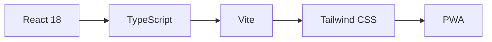
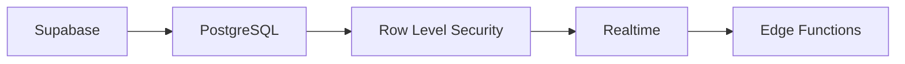
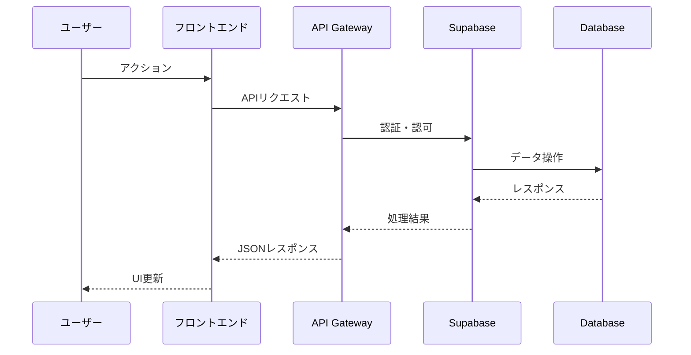

# アーキテクチャ概要

## 🏗️ システムアーキテクチャ

PMP Learning Management Systemは、モダンなマイクロサービス志向のアーキテクチャを採用しています。

## 📋 アーキテクチャ原則

1. **モジュラー設計** - 独立したコンポーネントによる構成
2. **スケーラビリティ** - 水平スケーリング対応
3. **高可用性** - 99.95%の稼働率目標
4. **セキュリティファースト** - ゼロトラストアーキテクチャ
5. **パフォーマンス最適化** - Core Web Vitals準拠

## 🎨 技術スタック

### フロントエンド


- **React 18**: UIライブラリ
- **TypeScript**: 型安全性
- **Vite**: 高速ビルドツール
- **Tailwind CSS**: ユーティリティファーストCSS
- **PWA**: Progressive Web App対応

### バックエンド


- **Supabase**: BaaS (Backend as a Service)
- **PostgreSQL**: データベース
- **Row Level Security**: データアクセス制御
- **Realtime**: WebSocket通信
- **Edge Functions**: サーバーレス関数

## 🔄 データフロー



## 🏛️ コンポーネント構造

### 主要コンポーネント

1. **認証システム**
   - Supabase Auth
   - JWT トークン管理
   - MFA対応

2. **学習管理**
   - プログレストラッキング
   - テスト管理
   - レポート生成

3. **視覚化エンジン**
   - D3.js統合
   - リアルタイムグラフ
   - インタラクティブダッシュボード

4. **データ永続化**
   - IndexedDB
   - LocalStorage
   - クラウド同期

## 🔐 セキュリティアーキテクチャ

### 多層防御

```
┌─────────────────────────────────┐
│         WAF (Cloudflare)        │
├─────────────────────────────────┤
│        HTTPS/TLS 1.3            │
├─────────────────────────────────┤
│      認証 (Supabase Auth)       │
├─────────────────────────────────┤
│        RLS (Row Level)          │
├─────────────────────────────────┤
│      データ暗号化 (AES-256)      │
└─────────────────────────────────┘
```

## 📈 パフォーマンス戦略

### 最適化手法

- **コード分割**: Dynamic imports
- **遅延ローディング**: React.lazy()
- **キャッシング**: Service Worker
- **CDN配信**: 静的アセット
- **画像最適化**: WebP形式

### パフォーマンス指標

| 指標 | 目標値 | 現在値 |
|-----|-------|-------|
| FCP | < 1.8s | 1.5s |
| LCP | < 2.5s | 2.1s |
| FID | < 100ms | 85ms |
| CLS | < 0.1 | 0.05 |

## 🚀 デプロイメントアーキテクチャ

### CI/CDパイプライン

```yaml
開発 → ビルド → テスト → ステージング → 本番
     ↓       ↓        ↓           ↓
   Vite   Vitest  E2E Tests  Manual QA
```

### インフラストラクチャ

- **ホスティング**: GitHub Pages
- **CDN**: Cloudflare
- **モニタリング**: Google Analytics
- **エラー追跡**: Sentry (計画中)

## 🎨 アーキテクチャ図

### ビジネスコンテキスト図

システムの全体像を視覚化した包括的なアーキテクチャ図を提供しています：

- **[ビジネスコンテキスト図 (ドキュメント)](./business-context-diagram.md)** - 詳細な説明とシステム境界
- **[ビジネスコンテキスト図 (インタラクティブ)](/#/architecture/business-context)** - ブラウザで操作可能な対話型ダイアグラム

#### 主な内容

1. **システムアクター**
   - PMPラーナー（主要ユーザー）
   - 管理者
   - メンター

2. **外部システム**
   - Supabase（認証・データベース）
   - Upstash Redis（キャッシュ）
   - GitHub Pages（ホスティング）
   - Context7 MCP（ドキュメントコンテキスト）
   - Serena MCP（コード分析）

3. **内部サブシステム**
   - フロントエンドレイヤー
   - 学習モジュール
   - 視覚化エンジン
   - コラボレーションハブ
   - AIコーチング
   - サービスレイヤー
   - インフラストラクチャ
   - セキュリティレイヤー

4. **データフロー**
   - ユーザー認証フロー
   - 学習進捗フロー
   - コラボレーションフロー
   - AIコーチングフロー
   - デプロイメントフロー

#### インタラクティブ機能

- **ズーム・パン**: マウス操作で図を拡大・移動
- **要素選択**: クリックで詳細情報を表示
- **ホバーツールチップ**: マウスオーバーで説明を表示
- **エクスポート**: PNG形式でダウンロード可能

## 📚 関連ドキュメント

- [ビジネスコンテキスト図](./business-context-diagram.md) - 詳細アーキテクチャ説明
- [PWA・バックエンド統合アーキテクチャ](./PWA_BACKEND_INTEGRATION_ARCHITECTURE.md)
- [API仕様](../api/README.md)
- [開発者ガイド](../developer-guide/README.md)
- [デプロイメントガイド](../operations/deployment/README.md)
- [セキュリティポリシー](../../SECURITY.md)
- [IDD実装ステータス](../IDD_IMPLEMENTATION_STATUS.md)
- [アーキテクチャサマリー](../../.claude/context/architecture-summary.md)