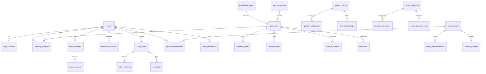

# Database Design Document - PMPLearningManagement

## 1. Database Architecture Overview

### 1.1 Recommended Technology: PostgreSQL

**Justification:**

- **ACID Compliance**: PostgreSQL provides full ACID compliance, crucial for maintaining data integrity in educational records and progress tracking
- **JSON/JSONB Support**: Native support for JSON data types allows flexible storage of ITTO data, exam questions, and dynamic learning content
- **Full-Text Search**: Built-in full-text search capabilities for glossary terms and learning materials
- **Rich Data Types**: Support for arrays, custom types, and complex data structures needed for PMBOK processes
- **Scalability**: Excellent horizontal and vertical scaling capabilities for growing user base
- **Open Source**: Cost-effective with strong community support
- **Extensions**: Support for extensions like pg_trgm for fuzzy search and TimescaleDB for time-series data

### 1.2 Alternative Considerations

| Database               | Pros                                              | Cons                                                  | Use Case                                   |
| ---------------------- | ------------------------------------------------- | ----------------------------------------------------- | ------------------------------------------ |
| **MongoDB**            | Flexible schema, good for varying ITTO structures | Less suitable for relational data, weaker consistency | If PMBOK data structure changes frequently |
| **MySQL**              | Wide adoption, simpler administration             | Limited JSON support, fewer advanced features         | If team has MySQL expertise                |
| **PostgreSQL + Redis** | Redis for caching, sessions, real-time features   | Additional complexity                                 | Recommended for production                 |

### 1.3 Scalability Architecture

```
┌─────────────────────────────────────────────┐
│            Application Layer                 │
│         (React SPA + API Server)            │
└─────────────────────────────────────────────┘
                     │
        ┌────────────┴────────────┐
        │                         │
┌───────▼────────┐      ┌────────▼────────┐
│  Redis Cache   │      │   Connection    │
│   (Sessions,   │      │      Pool       │
│    Hot Data)   │      │   (PgBouncer)   │
└────────────────┘      └─────────────────┘
                               │
                    ┌──────────┴──────────┐
                    │                     │
           ┌────────▼────────┐   ┌───────▼────────┐
           │   Primary DB    │   │  Read Replica  │
           │  (PostgreSQL)   │──▶│  (PostgreSQL)  │
           └─────────────────┘   └────────────────┘
                    │
           ┌────────▼────────┐
           │   Backup DB     │
           │  (Daily/Weekly) │
           └─────────────────┘
```

## 2. Entity-Relationship Diagram



## 3. Detailed Schema Design

### 3.1 User Management Tables

```sql
-- Users table
CREATE TABLE users (
    id UUID PRIMARY KEY DEFAULT gen_random_uuid(),
    email VARCHAR(255) UNIQUE NOT NULL,
    username VARCHAR(50) UNIQUE NOT NULL,
    password_hash VARCHAR(255) NOT NULL,
    full_name VARCHAR(100),
    avatar_url VARCHAR(500),
    role VARCHAR(20) DEFAULT 'student' CHECK (role IN ('student', 'instructor', 'admin')),
    email_verified BOOLEAN DEFAULT FALSE,
    is_active BOOLEAN DEFAULT TRUE,
    last_login_at TIMESTAMP WITH TIME ZONE,
    created_at TIMESTAMP WITH TIME ZONE DEFAULT CURRENT_TIMESTAMP,
    updated_at TIMESTAMP WITH TIME ZONE DEFAULT CURRENT_TIMESTAMP
);

CREATE INDEX idx_users_email ON users(email);
CREATE INDEX idx_users_username ON users(username);
CREATE INDEX idx_users_role ON users(role) WHERE is_active = TRUE;

-- User sessions for authentication
CREATE TABLE user_sessions (
    id UUID PRIMARY KEY DEFAULT gen_random_uuid(),
    user_id UUID NOT NULL REFERENCES users(id) ON DELETE CASCADE,
    token_hash VARCHAR(255) UNIQUE NOT NULL,
    ip_address INET,
    user_agent TEXT,
    expires_at TIMESTAMP WITH TIME ZONE NOT NULL,
    created_at TIMESTAMP WITH TIME ZONE DEFAULT CURRENT_TIMESTAMP
);

CREATE INDEX idx_sessions_user_id ON user_sessions(user_id);
CREATE INDEX idx_sessions_token ON user_sessions(token_hash);
CREATE INDEX idx_sessions_expires ON user_sessions(expires_at) WHERE expires_at > CURRENT_TIMESTAMP;

-- User preferences
CREATE TABLE user_preferences (
    user_id UUID PRIMARY KEY REFERENCES users(id) ON DELETE CASCADE,
    theme VARCHAR(20) DEFAULT 'light',
    language VARCHAR(10) DEFAULT 'ja',
    email_notifications BOOLEAN DEFAULT TRUE,
    study_reminder_time TIME,
    daily_goal_minutes INTEGER DEFAULT 30,
    preferred_visualization VARCHAR(50),
    settings JSONB DEFAULT '{}',
    created_at TIMESTAMP WITH TIME ZONE DEFAULT CURRENT_TIMESTAMP,
    updated_at TIMESTAMP WITH TIME ZONE DEFAULT CURRENT_TIMESTAMP
);
```

### 3.2 PMBOK Process Data Tables

```sql
-- Knowledge areas
CREATE TABLE knowledge_areas (
    id SERIAL PRIMARY KEY,
    code VARCHAR(20) UNIQUE NOT NULL,
    name_en VARCHAR(100) NOT NULL,
    name_ja VARCHAR(100) NOT NULL,
    description TEXT,
    color VARCHAR(7), -- Hex color for UI
    icon_name VARCHAR(50),
    display_order INTEGER NOT NULL,
    created_at TIMESTAMP WITH TIME ZONE DEFAULT CURRENT_TIMESTAMP
);

-- Process groups
CREATE TABLE process_groups (
    id SERIAL PRIMARY KEY,
    code VARCHAR(20) UNIQUE NOT NULL,
    name_en VARCHAR(100) NOT NULL,
    name_ja VARCHAR(100) NOT NULL,
    description TEXT,
    color VARCHAR(7),
    display_order INTEGER NOT NULL,
    created_at TIMESTAMP WITH TIME ZONE DEFAULT CURRENT_TIMESTAMP
);

-- PMBOK processes (49 processes)
CREATE TABLE processes (
    id SERIAL PRIMARY KEY,
    code VARCHAR(50) UNIQUE NOT NULL,
    name_en VARCHAR(200) NOT NULL,
    name_ja VARCHAR(200) NOT NULL,
    description TEXT,
    knowledge_area_id INTEGER NOT NULL REFERENCES knowledge_areas(id),
    process_group_id INTEGER NOT NULL REFERENCES process_groups(id),
    complexity_level INTEGER CHECK (complexity_level BETWEEN 1 AND 5),
    estimated_study_hours DECIMAL(4,2),
    display_order INTEGER,
    metadata JSONB DEFAULT '{}',
    created_at TIMESTAMP WITH TIME ZONE DEFAULT CURRENT_TIMESTAMP,
    updated_at TIMESTAMP WITH TIME ZONE DEFAULT CURRENT_TIMESTAMP
);

CREATE INDEX idx_processes_knowledge_area ON processes(knowledge_area_id);
CREATE INDEX idx_processes_process_group ON processes(process_group_id);
CREATE INDEX idx_processes_complexity ON processes(complexity_level);

-- ITTO: Inputs
CREATE TABLE process_inputs (
    id SERIAL PRIMARY KEY,
    process_id INTEGER NOT NULL REFERENCES processes(id) ON DELETE CASCADE,
    name_en VARCHAR(200) NOT NULL,
    name_ja VARCHAR(200) NOT NULL,
    description TEXT,
    source_process_id INTEGER REFERENCES processes(id),
    is_enterprise_environmental BOOLEAN DEFAULT FALSE,
    is_organizational_process BOOLEAN DEFAULT FALSE,
    display_order INTEGER,
    created_at TIMESTAMP WITH TIME ZONE DEFAULT CURRENT_TIMESTAMP
);

CREATE INDEX idx_inputs_process ON process_inputs(process_id);
CREATE INDEX idx_inputs_source ON process_inputs(source_process_id);

-- ITTO: Tools and Techniques
CREATE TABLE process_tools (
    id SERIAL PRIMARY KEY,
    process_id INTEGER NOT NULL REFERENCES processes(id) ON DELETE CASCADE,
    name_en VARCHAR(200) NOT NULL,
    name_ja VARCHAR(200) NOT NULL,
    description TEXT,
    category VARCHAR(100),
    usage_frequency INTEGER CHECK (usage_frequency BETWEEN 1 AND 5),
    display_order INTEGER,
    created_at TIMESTAMP WITH TIME ZONE DEFAULT CURRENT_TIMESTAMP
);

CREATE INDEX idx_tools_process ON process_tools(process_id);
CREATE INDEX idx_tools_category ON process_tools(category);

-- ITTO: Outputs
CREATE TABLE process_outputs (
    id SERIAL PRIMARY KEY,
    process_id INTEGER NOT NULL REFERENCES processes(id) ON DELETE CASCADE,
    name_en VARCHAR(200) NOT NULL,
    name_ja VARCHAR(200) NOT NULL,
    description TEXT,
    is_deliverable BOOLEAN DEFAULT FALSE,
    is_document BOOLEAN DEFAULT FALSE,
    target_processes INTEGER[], -- Array of process IDs that use this output
    display_order INTEGER,
    created_at TIMESTAMP WITH TIME ZONE DEFAULT CURRENT_TIMESTAMP
);

CREATE INDEX idx_outputs_process ON process_outputs(process_id);
CREATE INDEX idx_outputs_targets ON process_outputs USING GIN(target_processes);
```

### 3.3 Learning Progress Tables

```sql
-- Learning progress tracking
CREATE TABLE learning_progress (
    id UUID PRIMARY KEY DEFAULT gen_random_uuid(),
    user_id UUID NOT NULL REFERENCES users(id) ON DELETE CASCADE,
    process_id INTEGER NOT NULL REFERENCES processes(id),
    status VARCHAR(20) DEFAULT 'not_started'
        CHECK (status IN ('not_started', 'in_progress', 'completed', 'reviewing')),
    understanding_level INTEGER DEFAULT 0 CHECK (understanding_level BETWEEN 0 AND 100),
    study_time_minutes INTEGER DEFAULT 0,
    last_studied_at TIMESTAMP WITH TIME ZONE,
    completed_at TIMESTAMP WITH TIME ZONE,
    notes TEXT,
    review_count INTEGER DEFAULT 0,
    created_at TIMESTAMP WITH TIME ZONE DEFAULT CURRENT_TIMESTAMP,
    updated_at TIMESTAMP WITH TIME ZONE DEFAULT CURRENT_TIMESTAMP,
    UNIQUE(user_id, process_id)
);

CREATE INDEX idx_progress_user ON learning_progress(user_id);
CREATE INDEX idx_progress_process ON learning_progress(process_id);
CREATE INDEX idx_progress_status ON learning_progress(status);
CREATE INDEX idx_progress_last_studied ON learning_progress(last_studied_at DESC);

-- Study sessions tracking
CREATE TABLE study_sessions (
    id UUID PRIMARY KEY DEFAULT gen_random_uuid(),
    user_id UUID NOT NULL REFERENCES users(id) ON DELETE CASCADE,
    session_type VARCHAR(50) NOT NULL, -- 'process', 'flashcard', 'exam', 'reading'
    target_id VARCHAR(100), -- Process ID, exam ID, etc.
    duration_minutes INTEGER NOT NULL,
    items_studied INTEGER,
    items_correct INTEGER,
    performance_score DECIMAL(5,2),
    session_data JSONB DEFAULT '{}',
    started_at TIMESTAMP WITH TIME ZONE NOT NULL,
    ended_at TIMESTAMP WITH TIME ZONE NOT NULL,
    created_at TIMESTAMP WITH TIME ZONE DEFAULT CURRENT_TIMESTAMP
);

CREATE INDEX idx_sessions_user ON study_sessions(user_id);
CREATE INDEX idx_sessions_type ON study_sessions(session_type);
CREATE INDEX idx_sessions_started ON study_sessions(started_at DESC);

-- Learning goals
CREATE TABLE learning_goals (
    id UUID PRIMARY KEY DEFAULT gen_random_uuid(),
    user_id UUID NOT NULL REFERENCES users(id) ON DELETE CASCADE,
    goal_type VARCHAR(50) NOT NULL, -- 'daily', 'weekly', 'exam_date', 'process_completion'
    target_value INTEGER NOT NULL,
    current_value INTEGER DEFAULT 0,
    target_date DATE,
    status VARCHAR(20) DEFAULT 'active' CHECK (status IN ('active', 'completed', 'failed', 'cancelled')),
    created_at TIMESTAMP WITH TIME ZONE DEFAULT CURRENT_TIMESTAMP,
    updated_at TIMESTAMP WITH TIME ZONE DEFAULT CURRENT_TIMESTAMP
);

CREATE INDEX idx_goals_user ON learning_goals(user_id);
CREATE INDEX idx_goals_status ON learning_goals(status);
CREATE INDEX idx_goals_target_date ON learning_goals(target_date);
```

### 3.4 Mock Exam Tables

```sql
-- Question bank
CREATE TABLE exam_questions (
    id SERIAL PRIMARY KEY,
    question_text TEXT NOT NULL,
    question_type VARCHAR(20) NOT NULL CHECK (question_type IN ('single', 'multiple', 'situational')),
    difficulty_level INTEGER CHECK (difficulty_level BETWEEN 1 AND 5),
    knowledge_area_id INTEGER REFERENCES knowledge_areas(id),
    process_group_id INTEGER REFERENCES process_groups(id),
    process_id INTEGER REFERENCES processes(id),
    explanation TEXT,
    references TEXT,
    is_active BOOLEAN DEFAULT TRUE,
    created_by UUID REFERENCES users(id),
    reviewed_by UUID REFERENCES users(id),
    metadata JSONB DEFAULT '{}',
    created_at TIMESTAMP WITH TIME ZONE DEFAULT CURRENT_TIMESTAMP,
    updated_at TIMESTAMP WITH TIME ZONE DEFAULT CURRENT_TIMESTAMP
);

CREATE INDEX idx_questions_difficulty ON exam_questions(difficulty_level);
CREATE INDEX idx_questions_knowledge_area ON exam_questions(knowledge_area_id);
CREATE INDEX idx_questions_process ON exam_questions(process_id);
CREATE INDEX idx_questions_active ON exam_questions(is_active);

-- Question options
CREATE TABLE question_options (
    id SERIAL PRIMARY KEY,
    question_id INTEGER NOT NULL REFERENCES exam_questions(id) ON DELETE CASCADE,
    option_text TEXT NOT NULL,
    is_correct BOOLEAN DEFAULT FALSE,
    explanation TEXT,
    display_order INTEGER NOT NULL,
    created_at TIMESTAMP WITH TIME ZONE DEFAULT CURRENT_TIMESTAMP
);

CREATE INDEX idx_options_question ON question_options(question_id);

-- Exam attempts
CREATE TABLE exam_attempts (
    id UUID PRIMARY KEY DEFAULT gen_random_uuid(),
    user_id UUID NOT NULL REFERENCES users(id) ON DELETE CASCADE,
    exam_type VARCHAR(50) NOT NULL, -- 'full', 'practice', 'knowledge_area', 'custom'
    total_questions INTEGER NOT NULL,
    questions_answered INTEGER DEFAULT 0,
    correct_answers INTEGER DEFAULT 0,
    score DECIMAL(5,2),
    time_limit_minutes INTEGER,
    time_spent_minutes INTEGER,
    status VARCHAR(20) DEFAULT 'in_progress'
        CHECK (status IN ('in_progress', 'completed', 'abandoned', 'timeout')),
    started_at TIMESTAMP WITH TIME ZONE NOT NULL,
    completed_at TIMESTAMP WITH TIME ZONE,
    created_at TIMESTAMP WITH TIME ZONE DEFAULT CURRENT_TIMESTAMP
);

CREATE INDEX idx_attempts_user ON exam_attempts(user_id);
CREATE INDEX idx_attempts_status ON exam_attempts(status);
CREATE INDEX idx_attempts_completed ON exam_attempts(completed_at DESC);

-- Individual answers
CREATE TABLE exam_answers (
    id UUID PRIMARY KEY DEFAULT gen_random_uuid(),
    attempt_id UUID NOT NULL REFERENCES exam_attempts(id) ON DELETE CASCADE,
    question_id INTEGER NOT NULL REFERENCES exam_questions(id),
    selected_options INTEGER[], -- Array of option IDs
    is_correct BOOLEAN,
    is_bookmarked BOOLEAN DEFAULT FALSE,
    time_spent_seconds INTEGER,
    answered_at TIMESTAMP WITH TIME ZONE,
    created_at TIMESTAMP WITH TIME ZONE DEFAULT CURRENT_TIMESTAMP
);

CREATE INDEX idx_answers_attempt ON exam_answers(attempt_id);
CREATE INDEX idx_answers_question ON exam_answers(question_id);
CREATE INDEX idx_answers_bookmarked ON exam_answers(is_bookmarked) WHERE is_bookmarked = TRUE;
```

### 3.5 Flashcard System Tables

```sql
-- Flashcard decks
CREATE TABLE flashcard_decks (
    id UUID PRIMARY KEY DEFAULT gen_random_uuid(),
    name VARCHAR(200) NOT NULL,
    description TEXT,
    deck_type VARCHAR(50) NOT NULL, -- 'itto', 'glossary', 'custom', 'process'
    is_public BOOLEAN DEFAULT FALSE,
    created_by UUID REFERENCES users(id),
    metadata JSONB DEFAULT '{}',
    created_at TIMESTAMP WITH TIME ZONE DEFAULT CURRENT_TIMESTAMP,
    updated_at TIMESTAMP WITH TIME ZONE DEFAULT CURRENT_TIMESTAMP
);

CREATE INDEX idx_decks_type ON flashcard_decks(deck_type);
CREATE INDEX idx_decks_public ON flashcard_decks(is_public);
CREATE INDEX idx_decks_creator ON flashcard_decks(created_by);

-- Individual flashcards
CREATE TABLE flashcards (
    id UUID PRIMARY KEY DEFAULT gen_random_uuid(),
    deck_id UUID REFERENCES flashcard_decks(id) ON DELETE CASCADE,
    process_id INTEGER REFERENCES processes(id),
    front_text TEXT NOT NULL,
    back_text TEXT NOT NULL,
    hint TEXT,
    difficulty_level INTEGER DEFAULT 3 CHECK (difficulty_level BETWEEN 1 AND 5),
    tags TEXT[],
    created_at TIMESTAMP WITH TIME ZONE DEFAULT CURRENT_TIMESTAMP
);

CREATE INDEX idx_flashcards_deck ON flashcards(deck_id);
CREATE INDEX idx_flashcards_process ON flashcards(process_id);
CREATE INDEX idx_flashcards_tags ON flashcards USING GIN(tags);

-- Spaced repetition tracking
CREATE TABLE flashcard_reviews (
    id UUID PRIMARY KEY DEFAULT gen_random_uuid(),
    user_id UUID NOT NULL REFERENCES users(id) ON DELETE CASCADE,
    flashcard_id UUID NOT NULL REFERENCES flashcards(id) ON DELETE CASCADE,
    ease_factor DECIMAL(3,2) DEFAULT 2.5,
    interval_days INTEGER DEFAULT 1,
    repetitions INTEGER DEFAULT 0,
    quality INTEGER CHECK (quality BETWEEN 0 AND 5), -- User's self-assessment
    next_review_date DATE,
    last_reviewed_at TIMESTAMP WITH TIME ZONE,
    created_at TIMESTAMP WITH TIME ZONE DEFAULT CURRENT_TIMESTAMP,
    updated_at TIMESTAMP WITH TIME ZONE DEFAULT CURRENT_TIMESTAMP,
    UNIQUE(user_id, flashcard_id)
);

CREATE INDEX idx_reviews_user ON flashcard_reviews(user_id);
CREATE INDEX idx_reviews_next ON flashcard_reviews(next_review_date);
CREATE INDEX idx_reviews_flashcard ON flashcard_reviews(flashcard_id);
```

### 3.6 Collaboration Tables

```sql
-- Study groups
CREATE TABLE study_groups (
    id UUID PRIMARY KEY DEFAULT gen_random_uuid(),
    name VARCHAR(200) NOT NULL,
    description TEXT,
    target_exam_date DATE,
    max_members INTEGER DEFAULT 20,
    is_public BOOLEAN DEFAULT TRUE,
    join_code VARCHAR(20) UNIQUE,
    created_by UUID NOT NULL REFERENCES users(id),
    settings JSONB DEFAULT '{}',
    created_at TIMESTAMP WITH TIME ZONE DEFAULT CURRENT_TIMESTAMP,
    updated_at TIMESTAMP WITH TIME ZONE DEFAULT CURRENT_TIMESTAMP
);

CREATE INDEX idx_groups_public ON study_groups(is_public);
CREATE INDEX idx_groups_creator ON study_groups(created_by);
CREATE INDEX idx_groups_join_code ON study_groups(join_code);

-- Group memberships
CREATE TABLE group_memberships (
    id UUID PRIMARY KEY DEFAULT gen_random_uuid(),
    group_id UUID NOT NULL REFERENCES study_groups(id) ON DELETE CASCADE,
    user_id UUID NOT NULL REFERENCES users(id) ON DELETE CASCADE,
    role VARCHAR(20) DEFAULT 'member' CHECK (role IN ('owner', 'moderator', 'member')),
    joined_at TIMESTAMP WITH TIME ZONE DEFAULT CURRENT_TIMESTAMP,
    last_active_at TIMESTAMP WITH TIME ZONE,
    UNIQUE(group_id, user_id)
);

CREATE INDEX idx_memberships_group ON group_memberships(group_id);
CREATE INDEX idx_memberships_user ON group_memberships(user_id);

-- Study notes
CREATE TABLE study_notes (
    id UUID PRIMARY KEY DEFAULT gen_random_uuid(),
    user_id UUID NOT NULL REFERENCES users(id) ON DELETE CASCADE,
    process_id INTEGER REFERENCES processes(id),
    title VARCHAR(500) NOT NULL,
    content TEXT NOT NULL,
    content_type VARCHAR(20) DEFAULT 'markdown', -- 'markdown', 'plain', 'rich'
    is_public BOOLEAN DEFAULT FALSE,
    tags TEXT[],
    view_count INTEGER DEFAULT 0,
    created_at TIMESTAMP WITH TIME ZONE DEFAULT CURRENT_TIMESTAMP,
    updated_at TIMESTAMP WITH TIME ZONE DEFAULT CURRENT_TIMESTAMP
);

CREATE INDEX idx_notes_user ON study_notes(user_id);
CREATE INDEX idx_notes_process ON study_notes(process_id);
CREATE INDEX idx_notes_public ON study_notes(is_public);
CREATE INDEX idx_notes_tags ON study_notes USING GIN(tags);
CREATE INDEX idx_notes_fulltext ON study_notes USING GIN(to_tsvector('japanese', title || ' ' || content));

-- Comments and discussions
CREATE TABLE comments (
    id UUID PRIMARY KEY DEFAULT gen_random_uuid(),
    user_id UUID NOT NULL REFERENCES users(id) ON DELETE CASCADE,
    commentable_type VARCHAR(50) NOT NULL, -- 'note', 'process', 'question'
    commentable_id UUID NOT NULL,
    parent_comment_id UUID REFERENCES comments(id) ON DELETE CASCADE,
    content TEXT NOT NULL,
    is_edited BOOLEAN DEFAULT FALSE,
    created_at TIMESTAMP WITH TIME ZONE DEFAULT CURRENT_TIMESTAMP,
    updated_at TIMESTAMP WITH TIME ZONE DEFAULT CURRENT_TIMESTAMP
);

CREATE INDEX idx_comments_user ON comments(user_id);
CREATE INDEX idx_comments_commentable ON comments(commentable_type, commentable_id);
CREATE INDEX idx_comments_parent ON comments(parent_comment_id);

-- Likes/reactions
CREATE TABLE reactions (
    id UUID PRIMARY KEY DEFAULT gen_random_uuid(),
    user_id UUID NOT NULL REFERENCES users(id) ON DELETE CASCADE,
    reactable_type VARCHAR(50) NOT NULL, -- 'note', 'comment'
    reactable_id UUID NOT NULL,
    reaction_type VARCHAR(20) DEFAULT 'like',
    created_at TIMESTAMP WITH TIME ZONE DEFAULT CURRENT_TIMESTAMP,
    UNIQUE(user_id, reactable_type, reactable_id)
);

CREATE INDEX idx_reactions_user ON reactions(user_id);
CREATE INDEX idx_reactions_reactable ON reactions(reactable_type, reactable_id);
```

### 3.7 Glossary Tables

```sql
-- Glossary terms
CREATE TABLE glossary_terms (
    id SERIAL PRIMARY KEY,
    term_en VARCHAR(200) NOT NULL,
    term_ja VARCHAR(200) NOT NULL,
    pronunciation VARCHAR(200),
    definition TEXT NOT NULL,
    examples TEXT,
    related_processes INTEGER[], -- Array of process IDs
    category VARCHAR(50),
    importance_level INTEGER CHECK (importance_level BETWEEN 1 AND 5),
    created_at TIMESTAMP WITH TIME ZONE DEFAULT CURRENT_TIMESTAMP,
    updated_at TIMESTAMP WITH TIME ZONE DEFAULT CURRENT_TIMESTAMP
);

CREATE INDEX idx_glossary_term_en ON glossary_terms(term_en);
CREATE INDEX idx_glossary_term_ja ON glossary_terms(term_ja);
CREATE INDEX idx_glossary_category ON glossary_terms(category);
CREATE INDEX idx_glossary_fulltext_en ON glossary_terms USING GIN(to_tsvector('english', term_en || ' ' || definition));
CREATE INDEX idx_glossary_fulltext_ja ON glossary_terms USING GIN(to_tsvector('japanese', term_ja || ' ' || definition));

-- Term relationships
CREATE TABLE term_relationships (
    id SERIAL PRIMARY KEY,
    term_id INTEGER NOT NULL REFERENCES glossary_terms(id) ON DELETE CASCADE,
    related_term_id INTEGER NOT NULL REFERENCES glossary_terms(id) ON DELETE CASCADE,
    relationship_type VARCHAR(50), -- 'synonym', 'antonym', 'related', 'see_also'
    created_at TIMESTAMP WITH TIME ZONE DEFAULT CURRENT_TIMESTAMP,
    UNIQUE(term_id, related_term_id)
);

CREATE INDEX idx_term_rel_term ON term_relationships(term_id);
CREATE INDEX idx_term_rel_related ON term_relationships(related_term_id);
```

### 3.8 Analytics Tables

```sql
-- User activity logs
CREATE TABLE activity_logs (
    id BIGSERIAL PRIMARY KEY,
    user_id UUID REFERENCES users(id) ON DELETE SET NULL,
    activity_type VARCHAR(100) NOT NULL,
    entity_type VARCHAR(50),
    entity_id VARCHAR(100),
    metadata JSONB DEFAULT '{}',
    ip_address INET,
    user_agent TEXT,
    created_at TIMESTAMP WITH TIME ZONE DEFAULT CURRENT_TIMESTAMP
);

CREATE INDEX idx_activity_user ON activity_logs(user_id);
CREATE INDEX idx_activity_type ON activity_logs(activity_type);
CREATE INDEX idx_activity_created ON activity_logs(created_at DESC);
CREATE INDEX idx_activity_entity ON activity_logs(entity_type, entity_id);

-- Performance metrics (time-series data)
CREATE TABLE performance_metrics (
    user_id UUID NOT NULL REFERENCES users(id) ON DELETE CASCADE,
    metric_date DATE NOT NULL,
    metric_type VARCHAR(50) NOT NULL, -- 'quiz_score', 'study_time', 'completion_rate'
    knowledge_area_id INTEGER REFERENCES knowledge_areas(id),
    value DECIMAL(10,2) NOT NULL,
    metadata JSONB DEFAULT '{}',
    created_at TIMESTAMP WITH TIME ZONE DEFAULT CURRENT_TIMESTAMP,
    PRIMARY KEY (user_id, metric_date, metric_type, knowledge_area_id)
);

CREATE INDEX idx_metrics_user_date ON performance_metrics(user_id, metric_date DESC);
CREATE INDEX idx_metrics_type ON performance_metrics(metric_type);
```

## 4. Data Models

### 4.1 User Management Model

```typescript
interface User {
  id: string
  email: string
  username: string
  fullName?: string
  avatarUrl?: string
  role: 'student' | 'instructor' | 'admin'
  emailVerified: boolean
  isActive: boolean
  lastLoginAt?: Date
  preferences: UserPreferences
  statistics: UserStatistics
}

interface UserPreferences {
  theme: 'light' | 'dark'
  language: 'ja' | 'en'
  emailNotifications: boolean
  studyReminderTime?: string
  dailyGoalMinutes: number
  preferredVisualization?: string
  settings: Record<string, any>
}

interface UserStatistics {
  totalStudyTime: number
  completedProcesses: number
  averageQuizScore: number
  currentStreak: number
  longestStreak: number
}
```

### 4.2 Learning Progress Model

```typescript
interface LearningProgress {
  userId: string
  processId: number
  status: 'not_started' | 'in_progress' | 'completed' | 'reviewing'
  understandingLevel: number // 0-100
  studyTimeMinutes: number
  lastStudiedAt?: Date
  completedAt?: Date
  notes?: string
  reviewCount: number
  nextReviewDate?: Date
}

interface StudySession {
  id: string
  userId: string
  sessionType: 'process' | 'flashcard' | 'exam' | 'reading'
  targetId?: string
  durationMinutes: number
  itemsStudied?: number
  itemsCorrect?: number
  performanceScore?: number
  sessionData: Record<string, any>
  startedAt: Date
  endedAt: Date
}
```

## 5. Migration Strategy

### 5.1 Phase 1: Backend API Development

```sql
-- Migration script to import existing LocalStorage data
CREATE OR REPLACE FUNCTION migrate_localstorage_data(
    p_user_id UUID,
    p_data JSONB
) RETURNS VOID AS $$
BEGIN
    -- Migrate learning progress
    INSERT INTO learning_progress (user_id, process_id, status, understanding_level, notes, last_studied_at)
    SELECT
        p_user_id,
        (process_data->>'id')::INTEGER,
        COALESCE(process_data->>'status', 'not_started'),
        COALESCE((process_data->>'understanding')::INTEGER, 0),
        process_data->>'notes',
        CASE
            WHEN process_data->>'lastStudied' IS NOT NULL
            THEN (process_data->>'lastStudied')::TIMESTAMP WITH TIME ZONE
            ELSE NULL
        END
    FROM jsonb_array_elements(p_data->'processes') AS process_data
    ON CONFLICT (user_id, process_id) DO UPDATE
    SET
        status = EXCLUDED.status,
        understanding_level = EXCLUDED.understanding_level,
        notes = EXCLUDED.notes,
        last_studied_at = EXCLUDED.last_studied_at,
        updated_at = CURRENT_TIMESTAMP;

    -- Migrate study sessions
    INSERT INTO study_sessions (user_id, session_type, duration_minutes, started_at, ended_at, session_data)
    SELECT
        p_user_id,
        'process',
        (session->>'duration')::INTEGER,
        (session->>'date')::TIMESTAMP WITH TIME ZONE,
        (session->>'date')::TIMESTAMP WITH TIME ZONE + ((session->>'duration')::INTEGER || ' minutes')::INTERVAL,
        session
    FROM jsonb_array_elements(p_data->'studySessions') AS session;

    -- Migrate exam results
    INSERT INTO exam_attempts (user_id, exam_type, total_questions, correct_answers, score, time_spent_minutes, status, started_at, completed_at)
    SELECT
        p_user_id,
        'practice',
        (result->'results'->>'totalQuestions')::INTEGER,
        (result->'results'->>'correctAnswers')::INTEGER,
        (result->'results'->>'score')::DECIMAL,
        (result->>'duration')::INTEGER,
        'completed',
        (result->>'timestamp')::TIMESTAMP WITH TIME ZONE,
        (result->>'timestamp')::TIMESTAMP WITH TIME ZONE
    FROM jsonb_array_elements(p_data->'examResults') AS result;
END;
$$ LANGUAGE plpgsql;
```

### 5.2 Phase 2: Gradual Migration

1. **Dual-write period**: Write to both LocalStorage and database
2. **Data verification**: Ensure data consistency
3. **Read migration**: Gradually move reads to database
4. **LocalStorage deprecation**: Remove LocalStorage dependencies

### 5.3 Backward Compatibility

```javascript
// Compatibility layer
class StorageAdapter {
  async get(key) {
    try {
      // Try database first
      const data = await api.getData(key)
      return data
    } catch (error) {
      // Fallback to LocalStorage
      return localStorage.getItem(key)
    }
  }

  async set(key, value) {
    // Write to both
    localStorage.setItem(key, value)
    await api.setData(key, value)
  }
}
```

## 6. Performance Optimization

### 6.1 Indexing Strategy

```sql
-- Composite indexes for common queries
CREATE INDEX idx_progress_user_status ON learning_progress(user_id, status);
CREATE INDEX idx_progress_user_process ON learning_progress(user_id, process_id);
CREATE INDEX idx_attempts_user_completed ON exam_attempts(user_id, completed_at DESC) WHERE status = 'completed';

-- Partial indexes for active records
CREATE INDEX idx_users_active ON users(email) WHERE is_active = TRUE;
CREATE INDEX idx_questions_active_difficulty ON exam_questions(difficulty_level) WHERE is_active = TRUE;

-- Function-based indexes
CREATE INDEX idx_sessions_date ON study_sessions(DATE(started_at));
CREATE INDEX idx_metrics_month ON performance_metrics(user_id, DATE_TRUNC('month', metric_date));
```

### 6.2 Query Optimization Examples

```sql
-- Optimized query for user dashboard
WITH user_stats AS (
    SELECT
        user_id,
        COUNT(DISTINCT process_id) FILTER (WHERE status = 'completed') as completed_processes,
        SUM(study_time_minutes) as total_study_time,
        MAX(last_studied_at) as last_activity
    FROM learning_progress
    WHERE user_id = $1
    GROUP BY user_id
),
recent_exams AS (
    SELECT
        user_id,
        AVG(score) as avg_score,
        COUNT(*) as exam_count
    FROM exam_attempts
    WHERE user_id = $1
      AND completed_at > CURRENT_DATE - INTERVAL '30 days'
      AND status = 'completed'
    GROUP BY user_id
)
SELECT
    u.*,
    us.completed_processes,
    us.total_study_time,
    us.last_activity,
    re.avg_score,
    re.exam_count
FROM users u
LEFT JOIN user_stats us ON u.id = us.user_id
LEFT JOIN recent_exams re ON u.id = re.user_id
WHERE u.id = $1;
```

### 6.3 Caching Strategy

```yaml
# Redis caching configuration
cache_layers:
  session_cache:
    ttl: 3600 # 1 hour
    keys:
      - user_sessions
      - user_preferences

  static_cache:
    ttl: 86400 # 24 hours
    keys:
      - processes
      - knowledge_areas
      - glossary_terms

  computed_cache:
    ttl: 300 # 5 minutes
    keys:
      - user_statistics
      - leaderboards
      - group_progress
```

### 6.4 Partitioning Strategy

```sql
-- Partition activity_logs by month
CREATE TABLE activity_logs_2024_01 PARTITION OF activity_logs
FOR VALUES FROM ('2024-01-01') TO ('2024-02-01');

CREATE TABLE activity_logs_2024_02 PARTITION OF activity_logs
FOR VALUES FROM ('2024-02-01') TO ('2024-03-01');

-- Automated partition creation
CREATE OR REPLACE FUNCTION create_monthly_partitions()
RETURNS void AS $$
DECLARE
    start_date date;
    end_date date;
    partition_name text;
BEGIN
    start_date := date_trunc('month', CURRENT_DATE);
    end_date := start_date + interval '1 month';
    partition_name := 'activity_logs_' || to_char(start_date, 'YYYY_MM');

    EXECUTE format('CREATE TABLE IF NOT EXISTS %I PARTITION OF activity_logs FOR VALUES FROM (%L) TO (%L)',
        partition_name, start_date, end_date);
END;
$$ LANGUAGE plpgsql;
```

## 7. Security Considerations

### 7.1 Data Encryption

```sql
-- Enable encryption at rest
ALTER DATABASE pmp_learning SET encryption_key_id = 'aws-kms-key-id';

-- Encrypt sensitive columns
CREATE EXTENSION IF NOT EXISTS pgcrypto;

-- Example: Encrypt personal notes
ALTER TABLE learning_progress
ADD COLUMN notes_encrypted BYTEA;

UPDATE learning_progress
SET notes_encrypted = pgp_sym_encrypt(notes, current_setting('app.encryption_key'))
WHERE notes IS NOT NULL;
```

### 7.2 Access Control

```sql
-- Row-level security for user data
ALTER TABLE learning_progress ENABLE ROW LEVEL SECURITY;

CREATE POLICY user_progress_policy ON learning_progress
    FOR ALL
    TO application_user
    USING (user_id = current_setting('app.current_user_id')::UUID);

-- Role-based access
CREATE ROLE student_role;
CREATE ROLE instructor_role;
CREATE ROLE admin_role;

GRANT SELECT ON processes, knowledge_areas, glossary_terms TO student_role;
GRANT ALL ON learning_progress TO student_role;
GRANT SELECT, INSERT, UPDATE ON exam_attempts TO student_role;

GRANT student_role TO instructor_role;
GRANT SELECT ON ALL TABLES IN SCHEMA public TO instructor_role;
GRANT INSERT, UPDATE ON exam_questions TO instructor_role;

GRANT ALL PRIVILEGES ON ALL TABLES IN SCHEMA public TO admin_role;
```

### 7.3 PII Handling

```sql
-- PII data classification
COMMENT ON COLUMN users.email IS 'PII:EMAIL';
COMMENT ON COLUMN users.full_name IS 'PII:NAME';
COMMENT ON COLUMN user_sessions.ip_address IS 'PII:IP_ADDRESS';

-- Data anonymization function
CREATE OR REPLACE FUNCTION anonymize_user(p_user_id UUID)
RETURNS VOID AS $$
BEGIN
    UPDATE users
    SET
        email = 'deleted_' || substring(md5(random()::text), 1, 8) || '@example.com',
        username = 'deleted_user_' || substring(md5(random()::text), 1, 8),
        full_name = 'Deleted User',
        avatar_url = NULL,
        is_active = FALSE
    WHERE id = p_user_id;

    -- Keep learning data but disassociate from PII
    UPDATE learning_progress
    SET notes = NULL
    WHERE user_id = p_user_id;

    DELETE FROM user_sessions WHERE user_id = p_user_id;
END;
$$ LANGUAGE plpgsql;
```

### 7.4 Backup and Recovery

```bash
#!/bin/bash
# Automated backup script
BACKUP_DIR="/backup/pmp_learning"
DB_NAME="pmp_learning"
TIMESTAMP=$(date +%Y%m%d_%H%M%S)

# Full backup
pg_dump -h localhost -U postgres -d $DB_NAME -F custom -f "$BACKUP_DIR/full_backup_$TIMESTAMP.dump"

# Incremental backup using WAL archiving
pg_basebackup -h localhost -U replicator -D "$BACKUP_DIR/base_$TIMESTAMP" -Fp -Xs -P

# Encrypt backup
gpg --encrypt --recipient backup@example.com "$BACKUP_DIR/full_backup_$TIMESTAMP.dump"

# Upload to S3
aws s3 cp "$BACKUP_DIR/full_backup_$TIMESTAMP.dump.gpg" s3://pmp-backups/

# Test restore capability
pg_restore --list "$BACKUP_DIR/full_backup_$TIMESTAMP.dump" > /dev/null 2>&1
if [ $? -eq 0 ]; then
    echo "Backup verified successfully"
else
    echo "Backup verification failed" | mail -s "Backup Alert" admin@example.com
fi
```

## 8. Future Considerations

### 8.1 Scaling Strategies

#### Horizontal Scaling

```yaml
# Database clustering configuration
cluster:
  primary:
    host: db-primary.example.com
    port: 5432

  replicas:
    - host: db-replica-1.example.com
      port: 5432
      load_weight: 1
    - host: db-replica-2.example.com
      port: 5432
      load_weight: 1

  load_balancer:
    algorithm: least_connections
    health_check_interval: 10s
```

#### Sharding Strategy

```sql
-- Shard by user_id for user-specific data
CREATE TABLE learning_progress_shard_1
    (CHECK (hashtext(user_id::text) % 4 = 0))
    INHERITS (learning_progress);

CREATE TABLE learning_progress_shard_2
    (CHECK (hashtext(user_id::text) % 4 = 1))
    INHERITS (learning_progress);
```

### 8.2 Multi-tenancy Options

#### Schema-based Multi-tenancy

```sql
-- Create tenant schemas
CREATE SCHEMA tenant_abc;
CREATE SCHEMA tenant_xyz;

-- Clone tables for each tenant
CREATE TABLE tenant_abc.users (LIKE public.users INCLUDING ALL);
CREATE TABLE tenant_abc.learning_progress (LIKE public.learning_progress INCLUDING ALL);

-- Dynamic schema switching
SET search_path TO tenant_abc, public;
```

#### Row-level Multi-tenancy

```sql
-- Add tenant column
ALTER TABLE users ADD COLUMN tenant_id UUID NOT NULL;
ALTER TABLE learning_progress ADD COLUMN tenant_id UUID NOT NULL;

-- Create composite indexes
CREATE INDEX idx_users_tenant ON users(tenant_id, id);
CREATE INDEX idx_progress_tenant ON learning_progress(tenant_id, user_id);

-- RLS policies per tenant
CREATE POLICY tenant_isolation ON users
    USING (tenant_id = current_setting('app.current_tenant')::UUID);
```

### 8.3 Real-time Synchronization

#### Change Data Capture (CDC)

```sql
-- Enable logical replication
ALTER SYSTEM SET wal_level = logical;
ALTER SYSTEM SET max_replication_slots = 10;

-- Create publication for real-time updates
CREATE PUBLICATION realtime_updates FOR TABLE
    learning_progress,
    study_notes,
    comments;

-- Trigger for WebSocket notifications
CREATE OR REPLACE FUNCTION notify_progress_change()
RETURNS TRIGGER AS $$
BEGIN
    PERFORM pg_notify('progress_updates', json_build_object(
        'user_id', NEW.user_id,
        'process_id', NEW.process_id,
        'status', NEW.status,
        'timestamp', NEW.updated_at
    )::text);
    RETURN NEW;
END;
$$ LANGUAGE plpgsql;

CREATE TRIGGER progress_change_trigger
AFTER INSERT OR UPDATE ON learning_progress
FOR EACH ROW EXECUTE FUNCTION notify_progress_change();
```

### 8.4 Offline Capabilities

#### Sync Queue Tables

```sql
-- Queue for offline changes
CREATE TABLE sync_queue (
    id UUID PRIMARY KEY DEFAULT gen_random_uuid(),
    user_id UUID NOT NULL,
    operation VARCHAR(20) NOT NULL, -- 'INSERT', 'UPDATE', 'DELETE'
    table_name VARCHAR(100) NOT NULL,
    record_id UUID NOT NULL,
    data JSONB NOT NULL,
    client_timestamp TIMESTAMP WITH TIME ZONE NOT NULL,
    server_timestamp TIMESTAMP WITH TIME ZONE DEFAULT CURRENT_TIMESTAMP,
    sync_status VARCHAR(20) DEFAULT 'pending',
    conflict_resolution VARCHAR(20), -- 'client_wins', 'server_wins', 'merge'
    error_message TEXT
);

CREATE INDEX idx_sync_queue_user ON sync_queue(user_id, sync_status);
CREATE INDEX idx_sync_queue_status ON sync_queue(sync_status) WHERE sync_status = 'pending';

-- Conflict resolution function
CREATE OR REPLACE FUNCTION resolve_sync_conflict(
    p_queue_id UUID,
    p_resolution_strategy VARCHAR(20)
) RETURNS JSONB AS $$
DECLARE
    v_queue_record RECORD;
    v_current_data JSONB;
    v_merged_data JSONB;
BEGIN
    SELECT * INTO v_queue_record FROM sync_queue WHERE id = p_queue_id;

    -- Get current server data
    EXECUTE format('SELECT row_to_json(t) FROM %I t WHERE id = $1', v_queue_record.table_name)
    INTO v_current_data
    USING v_queue_record.record_id;

    CASE p_resolution_strategy
        WHEN 'client_wins' THEN
            v_merged_data := v_queue_record.data;
        WHEN 'server_wins' THEN
            v_merged_data := v_current_data;
        WHEN 'merge' THEN
            -- Custom merge logic based on timestamps
            v_merged_data := v_current_data || v_queue_record.data;
    END CASE;

    RETURN v_merged_data;
END;
$$ LANGUAGE plpgsql;
```

### 8.5 AI Integration Tables

```sql
-- AI-generated recommendations
CREATE TABLE ai_recommendations (
    id UUID PRIMARY KEY DEFAULT gen_random_uuid(),
    user_id UUID NOT NULL REFERENCES users(id) ON DELETE CASCADE,
    recommendation_type VARCHAR(50) NOT NULL, -- 'study_path', 'focus_area', 'practice_questions'
    content JSONB NOT NULL,
    confidence_score DECIMAL(3,2),
    model_version VARCHAR(50),
    accepted BOOLEAN,
    feedback VARCHAR(20), -- 'helpful', 'not_helpful', 'neutral'
    created_at TIMESTAMP WITH TIME ZONE DEFAULT CURRENT_TIMESTAMP
);

CREATE INDEX idx_ai_rec_user ON ai_recommendations(user_id);
CREATE INDEX idx_ai_rec_type ON ai_recommendations(recommendation_type);

-- Learning patterns for ML
CREATE TABLE learning_patterns (
    user_id UUID NOT NULL REFERENCES users(id) ON DELETE CASCADE,
    pattern_type VARCHAR(50) NOT NULL,
    pattern_data JSONB NOT NULL,
    confidence DECIMAL(3,2),
    detected_at TIMESTAMP WITH TIME ZONE DEFAULT CURRENT_TIMESTAMP,
    PRIMARY KEY (user_id, pattern_type)
);
```

## 9. Database Maintenance Procedures

### 9.1 Regular Maintenance Tasks

```sql
-- Vacuum and analyze schedule
CREATE EXTENSION IF NOT EXISTS pg_cron;

-- Daily vacuum and analyze
SELECT cron.schedule('daily-vacuum', '0 2 * * *', 'VACUUM ANALYZE;');

-- Weekly full vacuum for heavily updated tables
SELECT cron.schedule('weekly-full-vacuum', '0 3 * * 0', 'VACUUM FULL learning_progress, exam_attempts;');

-- Monthly reindex
SELECT cron.schedule('monthly-reindex', '0 4 1 * *', 'REINDEX DATABASE pmp_learning;');

-- Cleanup old sessions
SELECT cron.schedule('cleanup-sessions', '0 */6 * * *', $$
    DELETE FROM user_sessions WHERE expires_at < CURRENT_TIMESTAMP - INTERVAL '7 days';
$$);
```

### 9.2 Monitoring Queries

```sql
-- Database health check view
CREATE VIEW database_health AS
SELECT
    (SELECT count(*) FROM users WHERE last_login_at > CURRENT_DATE - INTERVAL '1 day') as daily_active_users,
    (SELECT count(*) FROM study_sessions WHERE started_at > CURRENT_DATE - INTERVAL '1 day') as daily_sessions,
    (SELECT avg(duration_minutes) FROM study_sessions WHERE started_at > CURRENT_DATE - INTERVAL '1 day') as avg_session_duration,
    (SELECT pg_database_size(current_database())) as database_size,
    (SELECT count(*) FROM pg_stat_activity WHERE state = 'active') as active_connections,
    (SELECT max(age(clock_timestamp(), query_start)) FROM pg_stat_activity WHERE state = 'active') as longest_query_duration;

-- Slow query log
CREATE TABLE slow_query_log (
    id BIGSERIAL PRIMARY KEY,
    query TEXT NOT NULL,
    duration_ms INTEGER NOT NULL,
    user_name VARCHAR(100),
    database_name VARCHAR(100),
    logged_at TIMESTAMP WITH TIME ZONE DEFAULT CURRENT_TIMESTAMP
);

-- Function to log slow queries
CREATE OR REPLACE FUNCTION log_slow_queries()
RETURNS void AS $$
BEGIN
    INSERT INTO slow_query_log (query, duration_ms, user_name, database_name)
    SELECT
        query,
        extract(epoch from (clock_timestamp() - query_start)) * 1000 as duration_ms,
        usename,
        datname
    FROM pg_stat_activity
    WHERE state = 'active'
      AND query NOT LIKE '%pg_stat_activity%'
      AND extract(epoch from (clock_timestamp() - query_start)) > 1; -- queries longer than 1 second
END;
$$ LANGUAGE plpgsql;
```

## 10. Sample Implementation Code

### 10.1 Database Connection Pool (Node.js)

```javascript
const { Pool } = require('pg')

const pool = new Pool({
  host: process.env.DB_HOST,
  port: process.env.DB_PORT,
  database: process.env.DB_NAME,
  user: process.env.DB_USER,
  password: process.env.DB_PASSWORD,
  max: 20, // Maximum number of clients in the pool
  idleTimeoutMillis: 30000,
  connectionTimeoutMillis: 2000,
})

// Health check
pool.on('error', (err, client) => {
  console.error('Unexpected error on idle client', err)
})

module.exports = {
  query: (text, params) => pool.query(text, params),
  getClient: () => pool.connect(),
}
```

### 10.2 Repository Pattern Example

```javascript
class LearningProgressRepository {
  async getUserProgress(userId) {
    const query = `
      SELECT 
        lp.*,
        p.name_ja as process_name,
        ka.name_ja as knowledge_area_name,
        pg.name_ja as process_group_name
      FROM learning_progress lp
      JOIN processes p ON lp.process_id = p.id
      JOIN knowledge_areas ka ON p.knowledge_area_id = ka.id
      JOIN process_groups pg ON p.process_group_id = pg.id
      WHERE lp.user_id = $1
      ORDER BY lp.last_studied_at DESC NULLS LAST
    `

    const result = await db.query(query, [userId])
    return result.rows
  }

  async updateProgress(userId, processId, data) {
    const query = `
      INSERT INTO learning_progress (
        user_id, process_id, status, understanding_level, 
        study_time_minutes, notes, last_studied_at
      ) VALUES ($1, $2, $3, $4, $5, $6, CURRENT_TIMESTAMP)
      ON CONFLICT (user_id, process_id) 
      DO UPDATE SET
        status = EXCLUDED.status,
        understanding_level = EXCLUDED.understanding_level,
        study_time_minutes = learning_progress.study_time_minutes + EXCLUDED.study_time_minutes,
        notes = EXCLUDED.notes,
        last_studied_at = EXCLUDED.last_studied_at,
        updated_at = CURRENT_TIMESTAMP
      RETURNING *
    `

    const values = [
      userId,
      processId,
      data.status || 'in_progress',
      data.understandingLevel || 0,
      data.studyTimeMinutes || 0,
      data.notes || null,
    ]

    const result = await db.query(query, values)
    return result.rows[0]
  }

  async getProgressStatistics(userId) {
    const query = `
      WITH progress_stats AS (
        SELECT 
          COUNT(*) FILTER (WHERE status = 'completed') as completed_count,
          COUNT(*) as total_count,
          SUM(study_time_minutes) as total_study_time,
          AVG(understanding_level) FILTER (WHERE understanding_level > 0) as avg_understanding
        FROM learning_progress
        WHERE user_id = $1
      ),
      knowledge_area_stats AS (
        SELECT 
          ka.name_ja as knowledge_area,
          COUNT(*) FILTER (WHERE lp.status = 'completed') as completed,
          COUNT(*) as total
        FROM knowledge_areas ka
        LEFT JOIN processes p ON p.knowledge_area_id = ka.id
        LEFT JOIN learning_progress lp ON lp.process_id = p.id AND lp.user_id = $1
        GROUP BY ka.id, ka.name_ja
      )
      SELECT 
        ps.*,
        json_agg(json_build_object(
          'area', kas.knowledge_area,
          'completed', kas.completed,
          'total', kas.total,
          'percentage', ROUND((kas.completed::numeric / NULLIF(kas.total, 0)) * 100, 2)
        )) as by_knowledge_area
      FROM progress_stats ps
      CROSS JOIN knowledge_area_stats kas
      GROUP BY ps.completed_count, ps.total_count, ps.total_study_time, ps.avg_understanding
    `

    const result = await db.query(query, [userId])
    return result.rows[0]
  }
}
```

## Conclusion

This database design provides a robust, scalable foundation for the PMPLearningManagement application. Key features include:

1. **Comprehensive data model** covering all current LocalStorage functionality
2. **Performance optimization** through strategic indexing and partitioning
3. **Security measures** including encryption, RLS, and PII handling
4. **Scalability path** from single instance to distributed architecture
5. **Migration strategy** ensuring smooth transition from LocalStorage
6. **Future-ready design** supporting AI integration, real-time sync, and offline capabilities

The PostgreSQL-based solution offers the best balance of features, performance, and reliability for an educational platform, with clear upgrade paths as the application grows.
