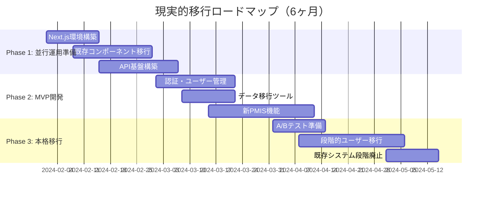

# PMPLearningManagement フロントエンド移行ガイド v2.0

## 概要

このドキュメントは、PMPLearningManagementプロジェクトを既存のReact/LocalStorageアーキテクチャから**モノリスファースト**アプローチでNext.js 14ベースのモダンWebアプリケーションへ段階的に移行するための現実的なガイドです。

## 現状分析

### 既存資産（活用すべき強み）

- **30+の成熟したReactコンポーネント**: PMBOKMatrix, FlashCardLearning, MockExamなど
- **8種類の高度な視覚化**: D3.jsベースの複雑なデータ視覚化
- **完全日本語ローカライズ**: UI/UXの完成度が高い
- **49プロセスの完全データセット**: PMBOKプロセス、ITTO、用語集
- **実証済みのユーザー体験**: 学習フロー、進捗管理が確立済み

### 技術的課題

- LocalStorageによる単一ユーザー制約
- SEO/パフォーマンス最適化の不足
- バックエンドサービスの欠如
- マルチテナント・コラボレーション機能の不足

## 1. 移行戦略（現実的アプローチ）

### 1.1 基本方針

- **モノリスファースト**: マイクロサービス化は成長後に検討
- **技術統一**: TypeScript/Node.js エコシステムに統一
- **既存資産最大活用**: 30+のReactコンポーネントを可能な限り再利用
- **Strangler Figパターン**: 段階的な置き換えでリスクを最小化
- **並行運用期間**: 新旧システムを並行運用してリスク軽減

### 1.2 技術スタック（簡素化版）

#### フロントエンド

- **Next.js 14** (App Router)
- **TypeScript** (段階的移行)
- **Tailwind CSS** (既存スタイルを維持)
- **既存D3.js視覚化** (そのまま再利用)
- **React 18+** (既存コンポーネント互換性維持)

#### バックエンド（一体型）

- **Next.js API Routes** (初期実装)
- **tRPC** (型安全なAPI、GraphQLは必要時に検討)
- **PostgreSQL** (単一データベース)
- **Prisma** (ORM)
- **NextAuth.js** (認証)

#### ホスティング

- **Vercel** (開発・ステージング・本番)
- **Supabase/Neon/Railway** (データベース)
- **Cloudflare** (CDN・画像最適化)

### 1.3 移行フェーズ（現実的タイムライン）



## 2. Phase 1: 並行運用準備（1-2ヶ月）

### 2.1 Next.js 14 プロジェクト構築

#### プロジェクト初期化

```bash
# Next.js 14プロジェクト作成
npx create-next-app@latest pmp-learning-v2 --typescript --tailwind --eslint --app
cd pmp-learning-v2

# 必要なパッケージ追加
npm install @prisma/client prisma
npm install @trpc/server @trpc/client @trpc/react-query @tanstack/react-query
npm install next-auth
npm install d3 d3-sankey
npm install @types/d3 @types/d3-sankey
```

#### プロジェクト構造

```
pmp-learning-v2/
├── src/
│   ├── app/                    # Next.js App Router
│   │   ├── (auth)/            # 認証関連ページ
│   │   ├── (dashboard)/       # ダッシュボード
│   │   ├── api/                # APIルート
│   │   │   ├── trpc/          # tRPCエンドポイント
│   │   │   └── auth/          # NextAuth.js
│   ├── components/             # 既存コンポーネント移行先
│   │   ├── legacy/            # 既存30+コンポーネント
│   │   └── ui/                # 新UIコンポーネント
│   ├── server/                 # サーバーサイドコード
│   │   ├── api/                # tRPCルーター
│   │   ├── db/                 # Prismaスキーマ
│   │   └── services/          # ビジネスロジック
│   └── lib/                    # ユーティリティ
├── prisma/                     # Prisma設定
│   └── schema.prisma
├── public/                     # 静的ファイル
└── .env.local                  # 環境変数
│   │   │   ├── auth/
│   │   │   └── trpc/
│   │   ├── layout.tsx
│   │   └── page.tsx
│   ├── components/            # 既存Reactコンポーネントを移植
│   │   ├── legacy/           # 既存コンポーネント（最小修正）
│   │   └── ui/               # 新規UIコンポーネント
│   ├── lib/
│   │   ├── trpc/
│   │   ├── auth/
│   │   └── db/
│   ├── server/               # バックエンドロジック
│   └── types/                # TypeScript型定義
└── prisma/
    ├── schema.prisma
    └── migrations/
```

### 2.2 既存Reactコンポーネントの段階的移行

#### コンポーネント移行戦略

```typescript
// src/components/legacy/PMBOKMatrix.tsx
// 既存コンポーネントを最小限の修正で移行

'use client'; // クライアントコンポーネントとして明示

import React, { useState, useMemo } from 'react';
import { ProcessData } from '@/types/pmbok';

// 既存のPMBOKMatrixコンポーネントをほぼそのまま移行
// 主な変更点：
// 1. TypeScript型注釈の追加
// 2. 'use client'ディレクティブの追加
// 3. データ取得方法をpropsに変更

interface PMBOKMatrixProps {
  processes: ProcessData[];
  userProgress?: Record<string, number>;
  onProcessClick?: (processId: string) => void;
}

export function PMBOKMatrix({
  processes,
  userProgress = {},
  onProcessClick
}: PMBOKMatrixProps) {
  // 既存のロジックをそのまま活用
  const processMatrix = useMemo(() => {
    // 既存の行列生成ロジックをそのまま使用
    const matrix = new Map();
    processes.forEach(process => {
      // 既存のロジック
    });
    return matrix;
  }, [processes]);

  // 既存のJSXをそのまま使用（軽微な型修正のみ）
  return (
    <div className="pmbok-matrix">
      {/* 既存のマトリックスレンダリングロジック */}
    </div>
  );
}
```

#### D3.js視覚化コンポーネントの移行

```typescript
// src/components/legacy/ITTOForceGraph.tsx
// 既存のD3.js視覚化を最小修正で移行

'use client';

import React, { useEffect, useRef } from 'react';
import * as d3 from 'd3';
import { ITTOData } from '@/types/pmbok';

interface ITTOForceGraphProps {
  data: ITTOData;
  width?: number;
  height?: number;
}

export function ITTOForceGraph({
  data,
  width = 800,
  height = 600
}: ITTOForceGraphProps) {
  const svgRef = useRef<SVGSVGElement>(null);

  useEffect(() => {
    if (!svgRef.current || !data) return;

    // 既存のD3.jsロジックをそのまま使用
    const svg = d3.select(svgRef.current);

    // 既存の力学シミュレーション・描画ロジックを移植
    // 変更点は最小限（型安全性の向上のみ）

  }, [data, width, height]);

  return (
    <div className="itto-force-graph">
      <svg ref={svgRef} width={width} height={height} />
    </div>
  );
}
```

### 2.3 tRPCによる型安全なAPI層の構築

#### tRPCルーター定義

```typescript
// src/server/api/routers/learning.ts
import { z } from 'zod'
import { createTRPCRouter, protectedProcedure, publicProcedure } from '../trpc'
import { db } from '@/lib/db'

// 既存のデータ構造に合わせたzodスキーマ
const ProcessProgressSchema = z.object({
  processId: z.string(),
  progress: z.number().min(0).max(100),
  timeSpent: z.number().optional(),
  completedAt: z.date().optional(),
})

export const learningRouter = createTRPCRouter({
  // 学習進捗の取得（既存LocalStorageデータ構造を踏襲）
  getProgress: protectedProcedure.query(async ({ ctx }) => {
    const progress = await db.learningProgress.findMany({
      where: { userId: ctx.session.user.id },
    })

    // 既存フロントエンドが期待する形式に変換
    return progress.reduce(
      (acc, p) => {
        acc[p.processId] = {
          progress: p.progress,
          timeSpent: p.timeSpent,
          completedAt: p.completedAt,
        }
        return acc
      },
      {} as Record<string, any>
    )
  }),

  // 進捗更新（楽観的アップデートをサポート）
  updateProgress: protectedProcedure
    .input(ProcessProgressSchema)
    .mutation(async ({ ctx, input }) => {
      return await db.learningProgress.upsert({
        where: {
          userId_processId: {
            userId: ctx.session.user.id,
            processId: input.processId,
          },
        },
        update: {
          progress: input.progress,
          timeSpent: input.timeSpent,
          updatedAt: new Date(),
        },
        create: {
          userId: ctx.session.user.id,
          processId: input.processId,
          progress: input.progress,
          timeSpent: input.timeSpent || 0,
        },
      })
    }),

  // フラッシュカード（既存データを活用）
  getFlashCards: publicProcedure
    .input(
      z
        .object({
          knowledgeArea: z.string().optional(),
          processGroup: z.string().optional(),
        })
        .optional()
    )
    .query(async ({ input }) => {
      // 既存の静的データを使用しつつ、将来的にDBに移行可能
      const { pmbokProcesses } = await import('@/data/pmbok-data')

      let filteredProcesses = pmbokProcesses
      if (input?.knowledgeArea) {
        filteredProcesses = filteredProcesses.filter((p) => p.knowledgeArea === input.knowledgeArea)
      }
      if (input?.processGroup) {
        filteredProcesses = filteredProcesses.filter((p) => p.processGroup === input.processGroup)
      }

      return filteredProcesses
    }),
})
```

#### フロントエンドでのtRPC使用

```typescript
// src/components/legacy/LearningProgressDashboard.tsx
// 既存コンポーネントのデータ取得部分のみ修正

'use client';

import { api } from '@/lib/trpc/react';
import { useState, useEffect } from 'react';

export function LearningProgressDashboard() {
  // 既存のLocalStorage使用部分を置き換え
  const { data: progress, isLoading } = api.learning.getProgress.useQuery();
  const updateProgressMutation = api.learning.updateProgress.useMutation();

  // 既存のコンポーネントロジックをほぼそのまま使用
  const handleProgressUpdate = async (processId: string, newProgress: number) => {
    // 楽観的更新
    await updateProgressMutation.mutateAsync({
      processId,
      progress: newProgress,
      timeSpent: Date.now(), // 既存ロジックを踏襲
    });
  };

  // 既存のJSX構造をそのまま使用
  return (
    <div className="learning-progress-dashboard">
      {/* 既存のダッシュボードUI */}
    </div>
  );
}
```

### 2.4 LocalStorageデータ移行戦略

#### ユーザーデータ移行ツール

```typescript
// src/lib/migration/data-migrator.ts
// 既存LocalStorageデータを安全にAPIに移行

export interface MigrationResult {
  success: boolean
  migratedItems: number
  errors: string[]
  backupData?: any
}

export class LocalStorageMigrator {
  private readonly BACKUP_KEY = 'pmp_migration_backup'

  /**
   * 既存LocalStorageデータをAPIに移行
   * 安全性重視：バックアップ作成 → 移行 → 検証
   */
  async migrateUserData(): Promise<MigrationResult> {
    const errors: string[] = []
    let migratedItems = 0

    try {
      // 1. 既存データのバックアップ作成
      const backupData = this.createBackup()

      // 2. 学習進捗データの移行
      const progressResult = await this.migrateProgressData(backupData.progress)
      if (progressResult.success) {
        migratedItems += progressResult.count
      } else {
        errors.push(...progressResult.errors)
      }

      // 3. フラッシュカード履歴の移行
      const flashcardResult = await this.migrateFlashcardHistory(backupData.flashcards)
      if (flashcardResult.success) {
        migratedItems += flashcardResult.count
      } else {
        errors.push(...flashcardResult.errors)
      }

      // 4. 模擬試験結果の移行
      const examResult = await this.migrateExamResults(backupData.examResults)
      if (examResult.success) {
        migratedItems += examResult.count
      } else {
        errors.push(...examResult.errors)
      }

      return {
        success: errors.length === 0,
        migratedItems,
        errors,
        backupData,
      }
    } catch (error) {
      return {
        success: false,
        migratedItems: 0,
        errors: [`Migration failed: ${error.message}`],
      }
    }
  }

  /**
   * LocalStorageデータのバックアップ作成
   */
  private createBackup() {
    const backup = {
      timestamp: new Date().toISOString(),
      progress: this.getLocalStorageData('pmp_learning_progress'),
      flashcards: this.getLocalStorageData('pmp_flashcard_history'),
      examResults: this.getLocalStorageData('pmp_exam_results'),
      settings: this.getLocalStorageData('pmp_user_settings'),
    }

    // バックアップをLocalStorageに保存（復元用）
    localStorage.setItem(this.BACKUP_KEY, JSON.stringify(backup))
    return backup
  }

  private getLocalStorageData(key: string) {
    try {
      const data = localStorage.getItem(key)
      return data ? JSON.parse(data) : null
    } catch {
      return null
    }
  }

  /**
   * 学習進捗データの移行
   */
  private async migrateProgressData(progressData: any) {
    if (!progressData) {
      return { success: true, count: 0, errors: [] }
    }

    try {
      const entries = Object.entries(progressData)
      const results = await Promise.allSettled(
        entries.map(([processId, progress]) =>
          api.learning.updateProgress.mutate({
            processId,
            progress: progress.progress || 0,
            timeSpent: progress.timeSpent || 0,
          })
        )
      )

      const errors = results
        .filter((r): r is PromiseRejectedResult => r.status === 'rejected')
        .map((r) => r.reason.message)

      return {
        success: errors.length === 0,
        count: entries.length - errors.length,
        errors,
      }
    } catch (error) {
      return {
        success: false,
        count: 0,
        errors: [error.message],
      }
    }
  }

  /**
   * 移行の検証とロールバック機能
   */
  async validateMigration(): Promise<boolean> {
    try {
      // APIから移行されたデータを取得
      const apiProgress = await api.learning.getProgress.query()

      // バックアップデータと比較
      const backup = this.getLocalStorageData(this.BACKUP_KEY)
      if (!backup) return false

      // データ整合性チェック
      const localProgressEntries = Object.entries(backup.progress || {})
      const migrationSuccess = localProgressEntries.every(([processId, localProgress]) => {
        const apiProgress = apiProgress[processId]
        return apiProgress && apiProgress.progress === localProgress.progress
      })

      return migrationSuccess
    } catch {
      return false
    }
  }

  /**
   * 緊急時のロールバック機能
   */
  async rollbackMigration(): Promise<boolean> {
    try {
      const backup = this.getLocalStorageData(this.BACKUP_KEY)
      if (!backup) return false

      // バックアップデータをLocalStorageに復元
      Object.entries(backup).forEach(([key, data]) => {
        if (key !== 'timestamp' && data) {
          localStorage.setItem(`pmp_${key}`, JSON.stringify(data))
        }
      })

      return true
    } catch {
      return false
    }
  }
}
```

#### 移行UIコンポーネント

```typescript
// src/components/MigrationWizard.tsx
// ユーザーフレンドリーな移行体験

'use client';

import { useState } from 'react';
import { LocalStorageMigrator } from '@/lib/migration/data-migrator';

export function MigrationWizard() {
  const [step, setStep] = useState<'welcome' | 'migrating' | 'success' | 'error'>('welcome');
  const [migrationResult, setMigrationResult] = useState<any>(null);

  const handleMigration = async () => {
    setStep('migrating');

    try {
      const migrator = new LocalStorageMigrator();
      const result = await migrator.migrateUserData();

      if (result.success) {
        setStep('success');
      } else {
        setStep('error');
      }
      setMigrationResult(result);
    } catch (error) {
      setStep('error');
      setMigrationResult({ errors: [error.message] });
    }
  };

  return (
    <div className="migration-wizard">
      {step === 'welcome' && (
        <div className="text-center">
          <h2 className="text-2xl font-bold mb-4">データ移行のご案内</h2>
          <p className="mb-6">既存の学習進捗データを新システムに移行します。</p>
          <button
            onClick={handleMigration}
            className="bg-blue-500 text-white px-6 py-2 rounded"
          >
            移行を開始
          </button>
        </div>
      )}

      {step === 'migrating' && (
        <div className="text-center">
          <div className="animate-spin rounded-full h-8 w-8 border-b-2 border-blue-500 mx-auto"></div>
          <p className="mt-4">データを移行中...</p>
        </div>
      )}

      {step === 'success' && (
        <div className="text-center text-green-600">
          <h3 className="text-xl font-bold">移行完了</h3>
          <p>{migrationResult?.migratedItems}件のデータが正常に移行されました。</p>
        </div>
      )}

      {step === 'error' && (
        <div className="text-center text-red-600">
          <h3 className="text-xl font-bold">移行エラー</h3>
          <p>データ移行中にエラーが発生しました。</p>
          <button
            onClick={() => setStep('welcome')}
            className="mt-4 bg-red-500 text-white px-4 py-2 rounded"
          >
            再試行
          </button>
        </div>
      )}
    </div>
  );
}
```

### 2.3 状態管理の移行（Zustand導入）

#### Zustandストアの実装

```typescript
// src/stores/learning.store.ts
import { create } from 'zustand'
import { devtools, persist } from 'zustand/middleware'
import { immer } from 'zustand/middleware/immer'
import { learningService } from '@/services/api/learning.service'

interface LearningState {
  progress: Map<string, ProcessProgress>
  flashCards: FlashCard[]
  currentExam: ExamSession | null
  loading: boolean
  error: string | null

  // Actions
  fetchProgress: (userId: string) => Promise<void>
  updateProcessProgress: (processId: string, progress: number) => Promise<void>
  loadFlashCards: (filters?: FlashCardFilters) => Promise<void>
  startExam: () => void
  submitAnswer: (questionId: string, answer: string) => void
  finishExam: () => Promise<void>
}

export const useLearningStore = create<LearningState>()(
  devtools(
    persist(
      immer((set, get) => ({
        progress: new Map(),
        flashCards: [],
        currentExam: null,
        loading: false,
        error: null,

        fetchProgress: async (userId: string) => {
          set((state) => {
            state.loading = true
            state.error = null
          })

          try {
            const data = await learningService.getProgress(userId)
            set((state) => {
              state.progress = new Map(Object.entries(data.processes))
              state.loading = false
            })
          } catch (error) {
            set((state) => {
              state.error = error.message
              state.loading = false
            })
          }
        },

        updateProcessProgress: async (processId: string, progress: number) => {
          // 楽観的更新
          set((state) => {
            const current = state.progress.get(processId) || { progress: 0 }
            state.progress.set(processId, { ...current, progress })
          })

          try {
            await learningService.updateProgress(get().userId, processId, { progress })
          } catch (error) {
            // ロールバック
            set((state) => {
              state.error = error.message
              // 元の値に戻す処理
            })
          }
        },

        loadFlashCards: async (filters) => {
          set((state) => {
            state.loading = true
          })

          try {
            const cards = await learningService.getFlashCards(filters)
            set((state) => {
              state.flashCards = cards
              state.loading = false
            })
          } catch (error) {
            set((state) => {
              state.error = error.message
              state.loading = false
            })
          }
        },

        startExam: () => {
          set((state) => {
            state.currentExam = {
              id: generateId(),
              startTime: new Date(),
              answers: new Map(),
              currentQuestionIndex: 0,
            }
          })
        },

        submitAnswer: (questionId: string, answer: string) => {
          set((state) => {
            if (state.currentExam) {
              state.currentExam.answers.set(questionId, answer)
              state.currentExam.currentQuestionIndex++
            }
          })
        },

        finishExam: async () => {
          const exam = get().currentExam
          if (!exam) return

          const result = {
            examId: exam.id,
            answers: Array.from(exam.answers.entries()),
            duration: Date.now() - exam.startTime.getTime(),
          }

          try {
            await learningService.submitExamResult(result)
            set((state) => {
              state.currentExam = null
            })
          } catch (error) {
            set((state) => {
              state.error = error.message
            })
          }
        },
      })),
      {
        name: 'learning-storage',
        partialize: (state) => ({
          progress: Array.from(state.progress.entries()),
          flashCards: state.flashCards.slice(0, 50), // 最新50件のみ保存
        }),
      }
    )
  )
)
```

## 3. Phase 2: TypeScript移行とコンポーネント最適化

### 3.1 TypeScript導入戦略

#### tsconfig.json設定

```json
{
  "compilerOptions": {
    "target": "ES2020",
    "useDefineForClassFields": true,
    "lib": ["ES2020", "DOM", "DOM.Iterable"],
    "module": "ESNext",
    "skipLibCheck": true,
    "moduleResolution": "bundler",
    "allowImportingTsExtensions": true,
    "resolveJsonModule": true,
    "isolatedModules": true,
    "noEmit": true,
    "jsx": "react-jsx",
    "strict": true,
    "noUnusedLocals": true,
    "noUnusedParameters": true,
    "noFallthroughCasesInSwitch": true,
    "allowJs": true,
    "checkJs": false,
    "incremental": true,
    "paths": {
      "@/*": ["./src/*"],
      "@components/*": ["./src/components/*"],
      "@services/*": ["./src/services/*"],
      "@stores/*": ["./src/stores/*"],
      "@types/*": ["./src/types/*"],
      "@utils/*": ["./src/utils/*"]
    }
  },
  "include": ["src"],
  "references": [{ "path": "./tsconfig.node.json" }]
}
```

#### 型定義の段階的追加

```typescript
// src/types/index.ts
export interface User {
  id: string
  email: string
  name: string
  roles: UserRole[]
  tenantId: string
  preferences: UserPreferences
}

export interface Project {
  id: string
  name: string
  description: string
  startDate: Date
  endDate: Date
  status: ProjectStatus
  progress: number
  team: TeamMember[]
  tasks: Task[]
  risks: Risk[]
}

export interface Task {
  id: string
  projectId: string
  title: string
  description: string
  assignee?: User
  status: TaskStatus
  priority: Priority
  dueDate?: Date
  estimatedHours: number
  actualHours: number
  dependencies: string[]
}

export type ProjectStatus = 'PLANNING' | 'ACTIVE' | 'ON_HOLD' | 'COMPLETED' | 'CANCELLED'
export type TaskStatus = 'TODO' | 'IN_PROGRESS' | 'REVIEW' | 'DONE' | 'BLOCKED'
export type Priority = 'LOW' | 'MEDIUM' | 'HIGH' | 'CRITICAL'

// PMBOKドメイン型
export interface PMBOKProcess {
  id: string
  name: string
  nameJa: string
  knowledgeArea: KnowledgeArea
  processGroup: ProcessGroup
  inputs: ITTO[]
  tools: ITTO[]
  outputs: ITTO[]
}

export interface ITTO {
  id: string
  name: string
  nameJa: string
  description: string
  category: ITTOCategory
  relatedProcesses: string[]
}

export type KnowledgeArea =
  | 'integration'
  | 'scope'
  | 'schedule'
  | 'cost'
  | 'quality'
  | 'resource'
  | 'communications'
  | 'risk'
  | 'procurement'
  | 'stakeholder'

export type ProcessGroup = 'initiating' | 'planning' | 'executing' | 'monitoring' | 'closing'
```

### 3.2 コンポーネント最適化

#### メモ化とコード分割

```typescript
// src/components/optimized/PMBOKMatrix.tsx
import React, { lazy, Suspense, useMemo, useCallback, memo } from 'react';
import { useLearningStore } from '@/stores/learning.store';
import { PMBOKProcess } from '@/types';

// 遅延ロード
const ProcessDetailModal = lazy(() => import('./ProcessDetailModal'));
const ITTOVisualization = lazy(() => import('./ITTOVisualization'));

interface PMBOKMatrixProps {
  processes: PMBOKProcess[];
  onProcessClick?: (process: PMBOKProcess) => void;
}

export const PMBOKMatrix = memo<PMBOKMatrixProps>(({
  processes,
  onProcessClick
}) => {
  const { progress, updateProcessProgress } = useLearningStore();

  // 高負荷な計算をメモ化
  const processMatrix = useMemo(() => {
    const matrix = new Map<string, Map<string, PMBOKProcess>>();

    processes.forEach(process => {
      if (!matrix.has(process.knowledgeArea)) {
        matrix.set(process.knowledgeArea, new Map());
      }
      matrix.get(process.knowledgeArea)!.set(process.processGroup, process);
    });

    return matrix;
  }, [processes]);

  // コールバックをメモ化
  const handleProcessClick = useCallback((process: PMBOKProcess) => {
    onProcessClick?.(process);
  }, [onProcessClick]);

  const handleProgressUpdate = useCallback((processId: string, value: number) => {
    updateProcessProgress(processId, value);
  }, [updateProcessProgress]);

  return (
    <div className="pmbok-matrix">
      <table className="w-full border-collapse">
        <thead>
          <tr>
            <th className="border p-2">知識エリア</th>
            {processGroups.map(group => (
              <th key={group} className="border p-2">
                {processGroupLabels[group]}
              </th>
            ))}
          </tr>
        </thead>
        <tbody>
          {knowledgeAreas.map(area => (
            <MatrixRow
              key={area}
              area={area}
              processes={processMatrix.get(area) || new Map()}
              progress={progress}
              onProcessClick={handleProcessClick}
              onProgressUpdate={handleProgressUpdate}
            />
          ))}
        </tbody>
      </table>

      <Suspense fallback={<LoadingSpinner />}>
        {selectedProcess && (
          <ProcessDetailModal
            process={selectedProcess}
            onClose={() => setSelectedProcess(null)}
          />
        )}
      </Suspense>
    </div>
  );
});

// 行コンポーネントも最適化
const MatrixRow = memo<MatrixRowProps>(({
  area,
  processes,
  progress,
  onProcessClick,
  onProgressUpdate
}) => {
  return (
    <tr>
      <td className="border p-2 font-semibold">
        {knowledgeAreaLabels[area]}
      </td>
      {processGroups.map(group => {
        const process = processes.get(group);
        const processProgress = process ? progress.get(process.id) : null;

        return (
          <MatrixCell
            key={`${area}-${group}`}
            process={process}
            progress={processProgress}
            onClick={onProcessClick}
            onProgressUpdate={onProgressUpdate}
          />
        );
      })}
    </tr>
  );
});

// セルコンポーネント
const MatrixCell = memo<MatrixCellProps>(({
  process,
  progress,
  onClick,
  onProgressUpdate
}) => {
  if (!process) {
    return <td className="border p-2 bg-gray-50" />;
  }

  const progressPercentage = progress?.progress || 0;
  const isCompleted = progressPercentage === 100;

  return (
    <td
      className={`border p-2 cursor-pointer hover:bg-blue-50 transition-colors ${
        isCompleted ? 'bg-green-50' : ''
      }`}
      onClick={() => onClick(process)}
    >
      <div className="space-y-1">
        <div className="text-sm font-medium">{process.nameJa}</div>
        <ProgressBar
          value={progressPercentage}
          onChange={(value) => onProgressUpdate(process.id, value)}
        />
      </div>
    </td>
  );
});
```

#### パフォーマンス監視Hook

```typescript
// src/hooks/usePerformanceMonitor.ts
import { useEffect, useRef } from 'react'

interface PerformanceMetrics {
  renderTime: number
  mountTime: number
  updateCount: number
}

export function usePerformanceMonitor(componentName: string) {
  const metrics = useRef<PerformanceMetrics>({
    renderTime: 0,
    mountTime: 0,
    updateCount: 0,
  })

  const startTime = useRef<number>(performance.now())

  useEffect(() => {
    // マウント時間の記録
    metrics.current.mountTime = performance.now() - startTime.current

    // Performance Observerの設定
    const observer = new PerformanceObserver((list) => {
      for (const entry of list.getEntries()) {
        if (entry.name.includes(componentName)) {
          metrics.current.renderTime = entry.duration

          // メトリクスを分析サービスに送信
          sendMetrics({
            component: componentName,
            ...metrics.current,
          })
        }
      }
    })

    observer.observe({ entryTypes: ['measure'] })

    return () => {
      observer.disconnect()
    }
  }, [componentName])

  useEffect(() => {
    metrics.current.updateCount++
  })

  // 開発環境でのデバッグ出力
  if (import.meta.env.DEV) {
    useEffect(() => {
      console.log(`[Performance] ${componentName}:`, metrics.current)
    })
  }

  return metrics.current
}
```

## 5. 開発効率化とCI/CDパイプライン

### 5.1 開発環境の最適化

#### 統合開発ワークフロー

```yaml
# .github/workflows/development.yml
name: Development Workflow

on:
  push:
    branches: [develop, feature/*]
  pull_request:
    branches: [main, develop]

jobs:
  quality-check:
    runs-on: ubuntu-latest
    steps:
      - uses: actions/checkout@v4

      - name: Setup Node.js 18
        uses: actions/setup-node@v4
        with:
          node-version: '18'
          cache: 'npm'

      - name: Install dependencies
        run: npm ci

      - name: TypeScript type check
        run: npm run type-check

      - name: Lint check
        run: npm run lint

      - name: Unit tests
        run: npm run test:unit

      - name: Component tests
        run: npm run test:components

      - name: Build check
        run: npm run build

  e2e-tests:
    runs-on: ubuntu-latest
    needs: quality-check
    steps:
      - uses: actions/checkout@v4

      - name: Setup Node.js
        uses: actions/setup-node@v4
        with:
          node-version: '18'
          cache: 'npm'

      - name: Install dependencies
        run: npm ci

      - name: Install Playwright
        run: npx playwright install

      - name: Run E2E tests
        run: npm run test:e2e

      - name: Upload test results
        uses: actions/upload-artifact@v4
        if: failure()
        with:
          name: playwright-report
          path: playwright-report/
```

### 5.2 段階的デプロイメント戦略

#### プレビューデプロイメント

```yaml
# .github/workflows/preview-deploy.yml
name: Preview Deployment

on:
  pull_request:
    types: [opened, synchronize]

jobs:
  deploy-preview:
    runs-on: ubuntu-latest
    steps:
      - uses: actions/checkout@v4

      - name: Setup Node.js
        uses: actions/setup-node@v4
        with:
          node-version: '18'
          cache: 'npm'

      - name: Install and build
        run: |
          npm ci
          npm run build
        env:
          DATABASE_URL: ${{ secrets.PREVIEW_DATABASE_URL }}
          NEXTAUTH_SECRET: ${{ secrets.NEXTAUTH_SECRET }}

      - name: Deploy to Vercel Preview
        uses: amondnet/vercel-action@v25
        with:
          vercel-token: ${{ secrets.VERCEL_TOKEN }}
          vercel-org-id: ${{ secrets.ORG_ID }}
          vercel-project-id: ${{ secrets.PROJECT_ID }}
          working-directory: ./
          scope: ${{ secrets.TEAM_ID }}
```

## 6. リスク軽減策と品質保証

### 6.1 ロールバック計画

#### データベース移行の安全策

```typescript
// src/lib/migration/safety-manager.ts
// データ損失を防ぐための多重安全策

export class MigrationSafetyManager {
  /**
   * 移行前の完全バックアップ作成
   */
  async createFullBackup(): Promise<{
    backupId: string
    timestamp: Date
    dataSize: number
  }> {
    const backupId = `backup_${Date.now()}`

    // 1. LocalStorageの完全バックアップ
    const localStorageData = this.exportLocalStorage()

    // 2. 外部ストレージに保存（安全のため）
    await this.uploadToCloudStorage(backupId, localStorageData)

    // 3. バックアップメタデータをDBに記録
    const backupRecord = await db.migrationBackup.create({
      data: {
        id: backupId,
        timestamp: new Date(),
        dataSize: JSON.stringify(localStorageData).length,
        status: 'COMPLETED',
      },
    })

    return {
      backupId,
      timestamp: backupRecord.timestamp,
      dataSize: backupRecord.dataSize,
    }
  }

  /**
   * 緊急時のワンクリックロールバック
   */
  async emergencyRollback(backupId: string): Promise<boolean> {
    try {
      // 1. バックアップデータの取得
      const backupData = await this.downloadFromCloudStorage(backupId)

      // 2. 現在のLocalStorageをクリア
      localStorage.clear()

      // 3. バックアップデータの復元
      Object.entries(backupData).forEach(([key, value]) => {
        localStorage.setItem(key, JSON.stringify(value))
      })

      // 4. ロールバック記録
      await db.migrationLog.create({
        data: {
          action: 'ROLLBACK',
          backupId,
          timestamp: new Date(),
          success: true,
        },
      })

      return true
    } catch (error) {
      console.error('Rollback failed:', error)
      return false
    }
  }

  private exportLocalStorage(): Record<string, any> {
    const data: Record<string, any> = {}
    for (let i = 0; i < localStorage.length; i++) {
      const key = localStorage.key(i)
      if (key) {
        try {
          data[key] = JSON.parse(localStorage.getItem(key) || '')
        } catch {
          data[key] = localStorage.getItem(key)
        }
      }
    }
    return data
  }
}
```

### 6.2 品質メトリクスとモニタリング

#### 移行成功率の監視

```typescript
// src/lib/monitoring/migration-metrics.ts
// リアルタイムで移行状況を監視

export class MigrationMetrics {
  /**
   * 移行成功率の計算と監視
   */
  async trackMigrationSuccess(userId: string, result: MigrationResult): Promise<void> {
    // メトリクスをDBに記録
    await db.migrationMetrics.create({
      data: {
        userId,
        success: result.success,
        migratedItems: result.migratedItems,
        errors: result.errors.length,
        duration: result.duration,
        timestamp: new Date(),
      },
    })

    // リアルタイム監視ダッシュボードに送信
    await this.sendToMonitoringDashboard({
      event: 'migration_completed',
      userId,
      success: result.success,
      metrics: {
        successRate: await this.calculateSuccessRate(),
        avgDuration: await this.getAverageDuration(),
        errorRate: await this.calculateErrorRate(),
      },
    })
  }

  /**
   * 移行品質のレポート生成
   */
  async generateQualityReport(): Promise<{
    totalMigrations: number
    successRate: number
    averageDuration: number
    commonErrors: Array<{ error: string; count: number }>
    recommendations: string[]
  }> {
    const metrics = await db.migrationMetrics.findMany({
      where: {
        timestamp: {
          gte: new Date(Date.now() - 7 * 24 * 60 * 60 * 1000), // 直近7日間
        },
      },
    })

    const totalMigrations = metrics.length
    const successfulMigrations = metrics.filter((m) => m.success).length
    const successRate = (successfulMigrations / totalMigrations) * 100

    const averageDuration = metrics.reduce((sum, m) => sum + m.duration, 0) / totalMigrations

    // 共通エラーの分析
    const errorCounts = new Map<string, number>()
    metrics.forEach((m) => {
      if (!m.success && m.errors > 0) {
        // エラー詳細を取得して集計
        const errorKey = 'migration_error' // 実際はエラー内容を分析
        errorCounts.set(errorKey, (errorCounts.get(errorKey) || 0) + 1)
      }
    })

    const commonErrors = Array.from(errorCounts.entries())
      .map(([error, count]) => ({ error, count }))
      .sort((a, b) => b.count - a.count)
      .slice(0, 5)

    // 改善提案の生成
    const recommendations = this.generateRecommendations(successRate, commonErrors)

    return {
      totalMigrations,
      successRate,
      averageDuration,
      commonErrors,
      recommendations,
    }
  }
}
```

## 7. MVP実装計画（3ヶ月ロードマップ）

### 7.1 Month 1: 基盤構築

**Week 1-2: プロジェクトセットアップ**

- Next.js 14プロジェクト初期化
- 開発環境構築（ESLint, Prettier, TypeScript）
- CI/CDパイプライン設定
- tRPCとPrismaセットアップ

**Week 3-4: 認証とコアAPI**

- NextAuth.js認証システム実装
- ユーザー管理API（tRPC）
- データベーススキーマ設計と初期マイグレーション
- 基本的な管理画面

### 7.2 Month 2: 学習機能移行

**Week 1-2: 既存コンポーネント移行**

- PMBOKMatrixコンポーネントの移行
- 学習進捗ダッシュボードの移行
- データ移行ツールの実装
- LocalStorage → API移行の実装

**Week 3-4: 視覚化機能移行**

- D3.js視覚化コンポーネントの移行
- VisualizationHubの移行
- パフォーマンス最適化
- モバイル対応改善

### 7.3 Month 3: PMIS機能とリリース準備

**Week 1-2: 基本PMIS機能**

- プロジェクト管理（CRUD）
- シンプルなタスク管理
- 基本的なレポート機能
- ユーザーロール管理

**Week 3-4: リリース準備**

- A/Bテスト環境構築
- パフォーマンステスト
- セキュリティ監査
- ドキュメンテーション完成

## まとめ

この改良版フロントエンド移行ガイドは、現実的で段階的なアプローチにより、既存の30+のReactコンポーネントと8種類の視覚化機能を最大限活用しながら、6ヶ月でモダンなNext.js/TypeScriptアプリケーションへの移行を実現します。

### 重要な成功要因

1. **既存資産の最大活用**: 30+のコンポーネントを段階的に移行
2. **リスク最小化**: 並行運用、A/Bテスト、完全なロールバック機能
3. **現実的タイムライン**: 3ヶ月MVP、6ヶ月本格リリース
4. **技術統一**: TypeScript/Node.jsエコシステムに統一
5. **継続的品質管理**: 自動テスト、監視、メトリクス分析

### 期待される成果

- **ユーザー体験の継続性**: 既存ユーザーのスムーズな移行
- **開発効率の向上**: 統一された技術スタックと開発ワークフロー
- **スケーラビリティ**: エンタープライズ対応のアーキテクチャ
- **保守性**: モダンなコード品質と文書化
- **拡張性**: 新機能追加のための柔軟な基盤

この移行計画により、PMPLearningManagementは次世代のプロジェクト管理学習プラットフォームとして進化し、より多くのユーザーにより良い学習体験を提供できるようになります。
