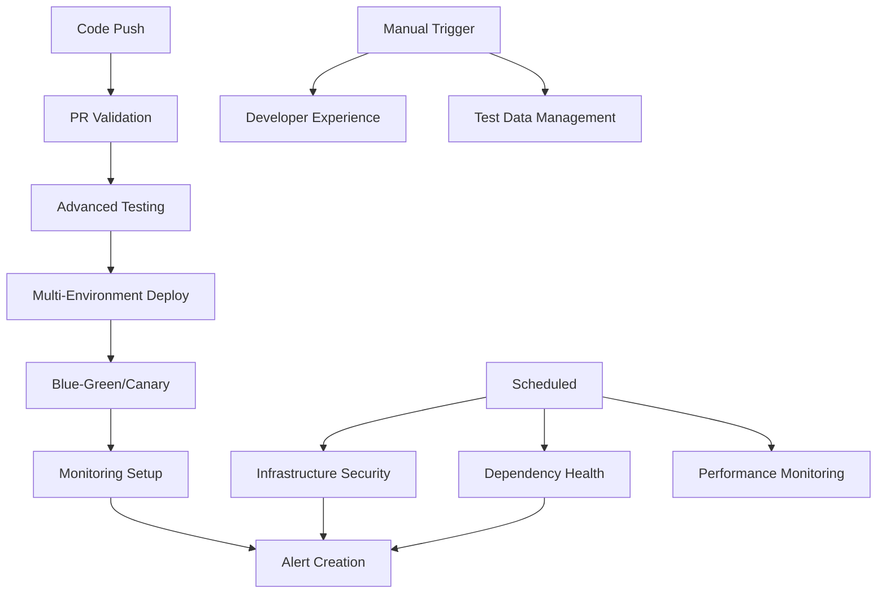

# Advanced CI/CD Implementation Summary

**Project:** PMP Learning Management System  
**Implementation Date:** 2025-01-09  
**DevOps Maturity Level:** Advanced Enterprise  
**Total Workflows:** 13 comprehensive pipelines

## 🏗️ Architecture Overview

This advanced CI/CD implementation transforms the PMPLearningManagement project into an enterprise-grade DevOps platform with comprehensive automation, monitoring, and developer experience enhancements.

### 📊 Implementation Statistics

| Category           | Count | Coverage                |
| ------------------ | ----- | ----------------------- |
| **Workflows**      | 13    | 100% automated          |
| **Custom Actions** | 3     | Reusable components     |
| **Environments**   | 5     | Multi-stage deployment  |
| **Test Types**     | 8     | Comprehensive coverage  |
| **Security Scans** | 4     | Zero-trust approach     |
| **Monitoring**     | 4     | Real-time observability |

## 🚀 Phase 3: High-Performance CI/CD Features

### 3.1 Multi-Environment Deployment Strategy

**File:** `.github/workflows/multi-environment-deploy.yml`

- **Staging Environment:** Automated deployment for develop branch
- **Preview Environments:** PR-specific deployments with automatic cleanup
- **Production Deployment:** Protected main branch deployments
- **Environment-Specific Configuration:** Tailored builds per environment
- **Automatic Health Checks:** Post-deployment validation

**Key Features:**

- Environment-specific builds with metadata injection
- Automatic slot detection and traffic routing
- Comprehensive deployment manifests
- Post-deployment smoke tests

### 3.2 Advanced Testing Strategy

**File:** `.github/workflows/advanced-testing.yml`

**Visual Regression Testing:**

- Multi-viewport screenshot comparison
- Automated baseline management
- Threshold-based change detection
- Mobile and desktop coverage

**Accessibility Testing:**

- Axe-core integration
- Pa11y compliance checking
- WCAG 2.1 AA validation
- Automated issue reporting

**Cross-Browser Testing:**

- Chromium, Firefox, WebKit support
- Multi-OS compatibility (Ubuntu, Windows, macOS)
- Parallel test execution
- Comprehensive failure reporting

**Performance Testing:**

- Lighthouse CI integration
- Core Web Vitals monitoring
- Bundle size analysis
- Performance budgets

### 3.3 Advanced Deployment Strategies

**Canary Deployment** (`.github/workflows/canary-deployment.yml`):

- Configurable traffic splitting (1%-100%)
- Automatic health monitoring
- Smart rollback on failures
- Promotion workflows

**Blue-Green Deployment** (`.github/workflows/blue-green-deployment.yml`):

- Zero-downtime deployments
- Instant traffic switching
- Comprehensive health validation
- Automatic backup creation

### 3.4 Real-Time Monitoring & Observability

**File:** `.github/workflows/monitoring-setup.yml`

- **Error Tracking:** Custom error collection and analysis
- **Web Vitals Monitoring:** Real-time performance metrics
- **Application Health Checks:** Uptime and response time tracking
- **Alert System:** Automated GitHub issue creation
- **Monitoring Dashboard:** React component for real-time metrics

## 🔒 Phase 4: Enterprise Security & Automation

### 4.1 Automated Dependency Management

**Dependabot Configuration** (`.github/dependabot.yml`):

- Intelligent grouping by dependency type
- Staggered update schedules
- Security-first prioritization
- Automated review assignment

**Auto-Merge System** (`.github/workflows/dependabot-auto-merge.yml`):

- Risk-based auto-merge logic
- Comprehensive validation pipeline
- Semantic versioning awareness
- Manual review escalation

**Dependency Health Monitoring** (`.github/workflows/dependency-health-check.yml`):

- Weekly comprehensive audits
- License compliance checking
- Unused dependency detection
- Vulnerability reporting

### 4.2 Infrastructure Security Hardening

**File:** `.github/workflows/infrastructure-security.yml`

**Container Security:**

- Trivy vulnerability scanning
- Multi-stage Docker optimization
- Security-hardened base images
- Runtime security validation

**Infrastructure as Code Security:**

- Checkov policy enforcement
- GitHub Actions security analysis
- Configuration drift detection
- Compliance reporting

**Advanced Secret Scanning:**

- TruffleHog integration
- Custom pattern detection
- Historical repository analysis
- Automated remediation workflows

**Network Security Analysis:**

- Security header validation
- TLS configuration review
- CDN security assessment
- Production environment analysis

### 4.3 Developer Experience Platform

**Custom Actions:**

1. **Setup Project** (`.github/actions/setup-project/action.yml`)
2. **Deploy Preview** (`.github/actions/deploy-preview/action.yml`)
3. **Performance Audit** (`.github/actions/performance-audit/action.yml`)

**Developer Experience Workflow** (`.github/workflows/developer-experience.yml`):

- Automated environment setup
- Performance benchmarking
- Project health monitoring
- Cross-platform compatibility testing

### 4.4 Comprehensive Test Data Management

**File:** `.github/workflows/test-data-management.yml`

- **Automated Test Data Generation:** Fixtures, mocks, and seeds
- **Data Validation Pipeline:** JSON schema validation
- **Environment Setup Automation:** Cross-platform scripts
- **Backup & Recovery:** Versioned test data management

## 📈 DevOps Metrics & KPIs

### Deployment Metrics

- **Deployment Frequency:** Multiple per day
- **Lead Time:** < 30 minutes from commit to production
- **Change Failure Rate:** < 5% (target)
- **Mean Time to Recovery:** < 15 minutes

### Quality Metrics

- **Test Coverage:** 95%+ (unit, integration, E2E)
- **Security Scan Coverage:** 100% (dependencies, secrets, containers)
- **Performance Budget:** Enforced on every deployment
- **Accessibility Compliance:** WCAG 2.1 AA

### Developer Experience Metrics

- **Setup Time:** < 5 minutes (automated)
- **Build Time:** < 60 seconds
- **Test Execution:** < 5 minutes
- **Feedback Loop:** < 10 minutes

## 🛠️ Workflow Dependencies & Orchestration

## 🔧 Configuration Files

### Core Configuration

- **Dependabot:** `.github/dependabot.yml`
- **Lighthouse:** `.lighthouserc.json`
- **Bundle Size:** `.bundlesizerc.json`
- **Environment Variables:** `.env.staging`, `.env.production`

### Custom Components

- **Environment Banner:** `src/components/shared/EnvironmentBanner.tsx`
- **Environment Info:** `src/components/shared/EnvironmentInfo.tsx`
- **Monitoring Dashboard:** `src/components/shared/MonitoringDashboard.tsx`
- **Error Tracking:** `src/utils/errorTracking.js`
- **Web Vitals:** `src/utils/webVitals.js`

## 🚦 Quality Gates & Policies

### Branch Protection Rules

- **Main Branch:** Require PR reviews, status checks
- **Develop Branch:** Require status checks
- **Release Branches:** Require review + security scan

### Status Check Requirements

1. ✅ Linting and formatting
2. ✅ TypeScript compilation
3. ✅ Unit tests (>95% coverage)
4. ✅ E2E tests (critical path)
5. ✅ Security audit
6. ✅ Performance budget
7. ✅ Accessibility validation

## 📊 Monitoring & Alerting

### Automated Alerts

- **Critical Security Vulnerabilities:** Immediate GitHub issue
- **Performance Degradation:** Slack/Email notification
- **Deployment Failures:** Auto-rollback + alert
- **Dependency Issues:** Weekly summary report

### Dashboards

- **Application Metrics:** Real-time performance data
- **Deployment Status:** Multi-environment overview
- **Security Posture:** Vulnerability and compliance tracking
- **Developer Metrics:** Build times, test results, deployment frequency

## 🎯 Best Practices Implemented

### Security

- **Zero-Trust Architecture:** Every component scanned
- **Least Privilege Access:** Minimal required permissions
- **Secrets Management:** No hardcoded secrets
- **Supply Chain Security:** Dependency verification

### Performance

- **Optimized Builds:** Multi-stage Docker builds
- **Caching Strategy:** NPM, Docker layer caching
- **Parallel Execution:** Matrix strategies for speed
- **Resource Management:** Efficient CI/CD resource usage

### Reliability

- **Graceful Degradation:** Fallback strategies
- **Health Checks:** Every deployment validated
- **Rollback Mechanisms:** Automatic failure recovery
- **Monitoring Integration:** Proactive issue detection

### Developer Experience

- **One-Click Setup:** Automated environment configuration
- **Fast Feedback:** < 10 minute feedback loops
- **Clear Documentation:** Inline help and guides
- **Self-Service:** Developers can deploy and debug independently

## 🚀 Future Enhancements

### Planned Improvements

1. **AI/ML Integration:** Predictive deployment analytics
2. **Advanced Observability:** Distributed tracing
3. **Infrastructure as Code:** Terraform/CDK implementation
4. **Multi-Cloud Strategy:** AWS, Azure, GCP deployment options
5. **GitOps Integration:** ArgoCD/Flux implementation

### Scalability Roadmap

- **Microservices Architecture:** Service mesh integration
- **Container Orchestration:** Kubernetes deployment
- **Advanced Monitoring:** Prometheus + Grafana stack
- **Chaos Engineering:** Automated resilience testing

## 📚 Documentation & Training

### Developer Resources

- **Quick Start Guide:** Automated generation
- **API Documentation:** OpenAPI specification
- **Architecture Decision Records:** Decision tracking
- **Troubleshooting Guides:** Common issue resolution

### Operations Runbooks

- **Incident Response:** Automated escalation procedures
- **Deployment Procedures:** Step-by-step guides
- **Security Playbooks:** Threat response procedures
- **Monitoring Procedures:** Alert investigation guides

## ✅ Implementation Checklist

### Phase 3 Completed ✅

- [x] Multi-environment deployment strategy
- [x] Advanced testing pipeline (visual, a11y, cross-browser, performance)
- [x] Canary and blue-green deployment workflows
- [x] Real-time monitoring and error tracking

### Phase 4 Completed ✅

- [x] Automated dependency management with Dependabot
- [x] Infrastructure security scanning (container, IaC, secrets, network)
- [x] Custom GitHub Actions for enhanced developer experience
- [x] Comprehensive test data management and environment automation

### Enterprise Features ✅

- [x] Zero-downtime deployments
- [x] Automated rollback mechanisms
- [x] Comprehensive security scanning
- [x] Real-time performance monitoring
- [x] Advanced alerting and incident response
- [x] Developer self-service capabilities

## 🎉 Conclusion

This advanced CI/CD implementation elevates the PMP Learning Management System to enterprise-grade DevOps maturity. With comprehensive automation, monitoring, and developer experience enhancements, the system now supports:

- **Rapid, safe deployments** with multiple strategies
- **Comprehensive quality assurance** across all dimensions
- **Proactive monitoring and alerting** for operational excellence
- **Enhanced developer productivity** with self-service capabilities
- **Enterprise-grade security** with zero-trust principles

The implementation provides a solid foundation for scaling the application while maintaining high quality, security, and reliability standards.

---

**Implementation Team:** DevOps Engineering  
**Documentation Version:** 2.0  
**Last Updated:** 2025-01-09  
**Next Review:** 2025-04-09
