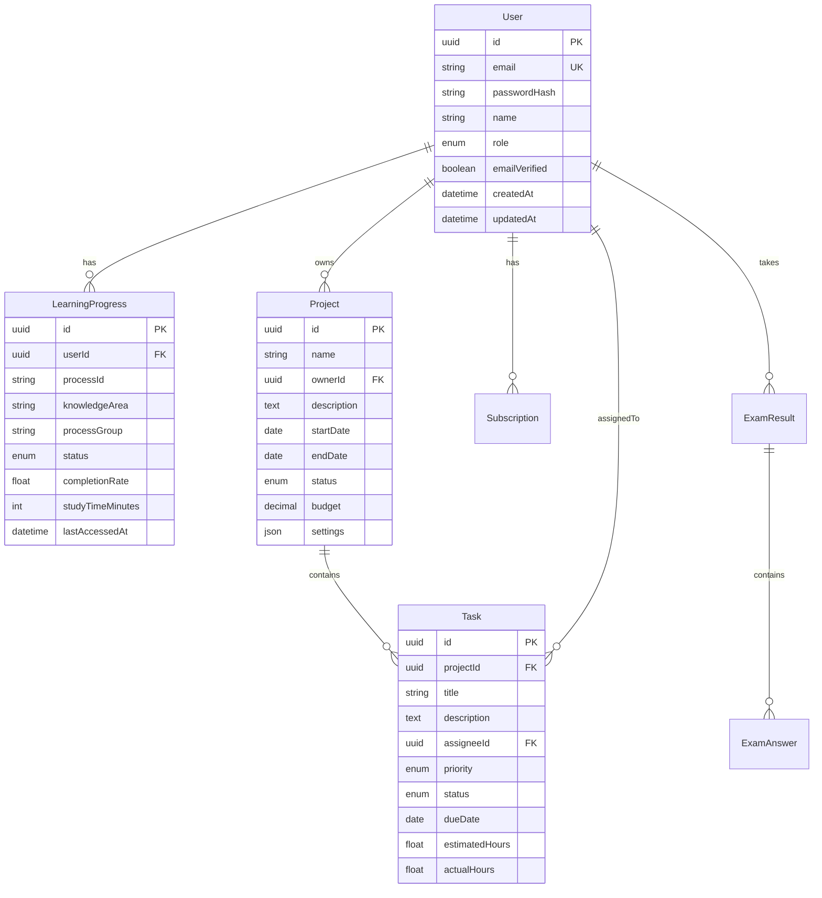

# PMPLearningManagement 要件定義書

**文書バージョン:** 1.0  
**作成日:** 2025年1月9日  
**プロジェクト名:** PMPLearningManagement プラットフォーム  
**文書種別:** システム要件定義書  
**対象リリース:** MVP (v1.0) および本格リリース (v2.0)

---

## 1. システム概要

### 1.1 プロジェクトの目的と背景

#### 背景

現在、PMP（Project Management Professional）資格取得を目指す学習者向けのWebアプリケーションとして、GitHub Pages上で静的サイトが稼働中。React/D3.jsベースで構築された30以上のコンポーネントを持ち、PMBOK第6版の学習機能を提供している。

#### 目的

1. **学習プラットフォームの商用化**: 既存の学習機能を活かしながら、持続可能なビジネスモデルを構築
2. **PMIS機能の統合**: 学習だけでなく、実際のプロジェクト管理を支援する統合プラットフォームへ進化
3. **価値提供の拡大**: PMP学習者から現役プロジェクトマネージャーまで幅広いユーザーへの価値提供

### 1.2 システムの位置づけ

```
┌─────────────────────────────────────────┐
│     PMPLearningManagement Platform      │
├──────────────┬──────────────────────────┤
│  学習機能    │      PMIS機能            │
├──────────────┼──────────────────────────┤
│ ・PMBOK学習  │ ・プロジェクト管理       │
│ ・模擬試験   │ ・タスク管理             │
│ ・進捗管理   │ ・スケジュール管理       │
│ ・用語集     │ ・コスト管理             │
│ ・視覚化     │ ・リスク管理             │
└──────────────┴──────────────────────────┘
        ↓                ↓
   PMP学習者      プロジェクトマネージャー
```

### 1.3 ステークホルダー定義

| ステークホルダー               | 役割           | 主な関心事               | 影響度 |
| ------------------------------ | -------------- | ------------------------ | ------ |
| **プライマリステークホルダー** |                |                          |        |
| PMP学習者                      | エンドユーザー | 効率的な学習、合格率向上 | 高     |
| 現役PM                         | エンドユーザー | 実務での活用、効率化     | 高     |
| 企業研修担当者                 | 購買決定者     | 研修効果、コスト         | 高     |
| **セカンダリステークホルダー** |                |                          |        |
| プロジェクトスポンサー         | 投資者         | ROI、事業成長            | 高     |
| 開発チーム                     | 実装者         | 技術的実現性、保守性     | 中     |
| 運用チーム                     | 運用者         | 運用効率、安定性         | 中     |
| マーケティングチーム           | 販促担当       | 差別化要素、訴求力       | 中     |

### 1.4 用語定義

| 用語  | 定義                                  | 備考                         |
| ----- | ------------------------------------- | ---------------------------- |
| PMBOK | Project Management Body of Knowledge  | PMI発行の知識体系            |
| ITTO  | Input, Tools & Techniques, Output     | プロセスの構成要素           |
| PMIS  | Project Management Information System | プロジェクト管理情報システム |
| MVP   | Minimum Viable Product                | 実用最小限の製品             |
| EVM   | Earned Value Management               | アーンドバリュー管理         |
| SaaS  | Software as a Service                 | サービスとしてのソフトウェア |
| PWA   | Progressive Web App                   | プログレッシブWebアプリ      |
| KPI   | Key Performance Indicator             | 重要業績評価指標             |

---

## 2. ビジネス要件

### 2.1 ビジネス目標

#### 短期目標（3-6ヶ月）

1. **MVP完成**: 3ヶ月以内に最小機能セットをリリース
2. **初期顧客獲得**: 100名のベータユーザー獲得
3. **フィードバック収集**: 製品改善のための定性・定量データ収集

#### 中期目標（6-12ヶ月）

1. **収益化達成**: 月額売上500万円の達成
2. **顧客基盤確立**: 有料会員500名の獲得
3. **製品成熟**: 主要機能の実装完了とユーザビリティ向上

#### 長期目標（12ヶ月以降）

1. **市場シェア**: 国内PMP学習市場の5%獲得
2. **国際展開準備**: 英語版リリースの準備
3. **エコシステム構築**: パートナー企業との連携

### 2.2 成功指標（KPI）

| カテゴリ           | KPI                 | 目標値  | 測定頻度 |
| ------------------ | ------------------- | ------- | -------- |
| **ビジネス指標**   |                     |         |          |
| 売上               | MRR（月間経常収益） | 500万円 | 月次     |
| 顧客獲得           | 新規有料会員数      | 50名/月 | 月次     |
| 顧客維持           | チャーン率          | <5%     | 月次     |
| 収益性             | LTV/CAC             | >3.0    | 四半期   |
| **プロダクト指標** |                     |         |          |
| エンゲージメント   | MAU                 | 20,000  | 月次     |
| 活用度             | DAU/MAU             | >40%    | 週次     |
| 満足度             | NPS                 | 40以上  | 四半期   |
| 品質               | クリティカルバグ数  | <5件/月 | 月次     |

### 2.3 制約条件

1. **予算制約**
   - 初期開発予算: 900万円（3ヶ月）
   - 年間運用予算: 3,000万円

2. **人的リソース制約**
   - 開発チーム: フルスタックエンジニア2-3名
   - 開発期間中の増員は困難

3. **技術制約**
   - 既存30+のReactコンポーネントの活用必須
   - モノリスファーストアプローチの採用

4. **時間制約**
   - MVP: 3ヶ月以内
   - 本格リリース: 6ヶ月以内

### 2.4 前提条件

1. 既存のGitHub Pages環境は無料版として継続運用
2. 開発チームはReact/Next.js/Node.jsの技術スキルを保有
3. クラウドインフラ（Vercel/Supabase）の利用が可能
4. Stripe等の外部決済サービスが利用可能
5. PMBOK第7版の日本語資料が入手可能

---

## 3. 機能要件

### 3.1 ユーザーストーリー（MVP - Must Have）

#### 認証・アカウント管理

| ID     | ユーザーストーリー                                        | 受入基準                                                                         | 優先度 |
| ------ | --------------------------------------------------------- | -------------------------------------------------------------------------------- | ------ |
| US-001 | PMP学習者として、アカウントを作成して学習進捗を保存したい | ・メールアドレスで登録可能<br>・パスワードリセット機能<br>・プロフィール編集可能 | Must   |
| US-002 | ユーザーとして、GoogleやGitHubアカウントでログインしたい  | ・OAuth認証実装<br>・既存アカウントとの連携                                      | Must   |
| US-003 | 有料会員として、サブスクリプションを管理したい            | ・プラン選択可能<br>・支払い方法変更<br>・解約手続き                             | Must   |

#### 学習機能（既存資産活用）

| ID     | ユーザーストーリー                                          | 受入基準                                                          | 優先度 |
| ------ | ----------------------------------------------------------- | ----------------------------------------------------------------- | ------ |
| US-004 | PMP学習者として、PMBOK第6版の49プロセスを体系的に学習したい | ・マトリックスビュー表示<br>・プロセス詳細閲覧<br>・ITTO情報表示  | Must   |
| US-005 | 学習者として、視覚的にプロセスの関係性を理解したい          | ・ネットワーク図表示<br>・8種類の視覚化<br>・インタラクティブ操作 | Must   |
| US-006 | 受験者として、本番形式の模擬試験を受けたい                  | ・180問/230分の試験<br>・結果分析機能<br>・弱点把握               | Must   |
| US-007 | 学習者として、自分の学習進捗を把握したい                    | ・進捗ダッシュボード<br>・学習履歴保存<br>・達成度表示            | Must   |

#### 課金・決済

| ID     | ユーザーストーリー                           | 受入基準                                             | 優先度 |
| ------ | -------------------------------------------- | ---------------------------------------------------- | ------ |
| US-008 | ユーザーとして、クレジットカードで支払いたい | ・Stripe決済実装<br>・領収書発行<br>・自動更新       | Must   |
| US-009 | 管理者として、ユーザーの課金状況を管理したい | ・課金ダッシュボード<br>・収益レポート<br>・返金処理 | Must   |

### 3.2 機能要件（フェーズ2 - Should Have）

#### PMBOK第7版対応

| ID     | ユーザーストーリー                           | 受入基準                                                            | 優先度 |
| ------ | -------------------------------------------- | ------------------------------------------------------------------- | ------ |
| US-010 | 学習者として、PMBOK第7版の内容も学習したい   | ・12の原理原則表示<br>・8つのパフォーマンス領域<br>・バージョン切替 | Should |
| US-011 | 学習者として、第6版と第7版の違いを理解したい | ・比較ビュー<br>・移行ガイド<br>・相違点ハイライト                  | Should |

#### AI学習支援

| ID     | ユーザーストーリー                                 | 受入基準                                                 | 優先度 |
| ------ | -------------------------------------------------- | -------------------------------------------------------- | ------ |
| US-012 | 学習者として、AIアシスタントに質問したい           | ・チャット機能<br>・コンテキスト理解<br>・学習アドバイス | Should |
| US-013 | 学習者として、パーソナライズされた学習計画が欲しい | ・学習パス生成<br>・推奨コンテンツ<br>・進捗予測         | Should |

#### 基本的なPMIS機能

| ID     | ユーザーストーリー                                 | 受入基準                                               | 優先度 |
| ------ | -------------------------------------------------- | ------------------------------------------------------ | ------ |
| US-014 | PMとして、プロジェクトを作成・管理したい           | ・プロジェクト作成<br>・基本情報管理<br>・メンバー招待 | Should |
| US-015 | チームメンバーとして、タスクを管理したい           | ・タスク作成/編集<br>・ステータス管理<br>・担当者割当  | Should |
| US-016 | PMとして、ガントチャートでスケジュールを管理したい | ・ガントチャート表示<br>・依存関係設定<br>・進捗更新   | Should |

#### モバイルアプリケーション

| ID     | ユーザーストーリー                                      | 受入基準                                                                             | 優先度 |
| ------ | ------------------------------------------------------- | ------------------------------------------------------------------------------------ | ------ |
| US-017 | 学習者として、モバイルデバイスでPMP模擬試験を受けたい   | ・iOS/Androidネイティブアプリ<br>・180問/230分の完全試験対応<br>・オフライン受験機能 | Should |
| US-018 | 学習者として、移動中にフラッシュカード学習をしたい      | ・タッチ最適化UI<br>・進捗同期機能<br>・音声読み上げ対応                             | Should |
| US-019 | ユーザーとして、学習進捗をWeb版とモバイル版で同期したい | ・リアルタイム同期<br>・オフライン変更の競合解決<br>・一貫したデータ表示             | Should |
| US-020 | 学習者として、通知機能で学習継続をサポートしてほしい    | ・学習リマインダー<br>・試験日カウントダウン<br>・達成バッジ通知                     | Should |
| US-021 | 受験者として、試験結果をモバイルで詳細分析したい        | ・知識エリア別スコア表示<br>・弱点分析グラフ<br>・学習推奨機能                       | Should |

### 3.3 機能要件（将来 - Could Have）

#### 高度なPMIS機能

| ID     | ユーザーストーリー                                      | 受入基準                                                     | 優先度 |
| ------ | ------------------------------------------------------- | ------------------------------------------------------------ | ------ |
| US-022 | PMとして、EVMでプロジェクトのパフォーマンスを測定したい | ・EVM計算<br>・グラフ表示<br>・予測分析                      | Could  |
| US-023 | PMとして、リスクを体系的に管理したい                    | ・リスク登録簿<br>・確率影響マトリックス<br>・対応計画       | Could  |
| US-024 | チームとして、ドキュメントを共有・管理したい            | ・ファイルアップロード<br>・バージョン管理<br>・アクセス権限 | Could  |

#### コラボレーション機能

| ID     | ユーザーストーリー                                 | 受入基準                                                        | 優先度 |
| ------ | -------------------------------------------------- | --------------------------------------------------------------- | ------ |
| US-025 | 学習者として、他の学習者と交流したい               | ・ディスカッションフォーラム<br>・Q&A機能<br>・スタディグループ | Could  |
| US-026 | チームとして、リアルタイムでコラボレーションしたい | ・リアルタイムチャット<br>・画面共有<br>・共同編集              | Could  |

### 3.4 機能要件（対象外 - Won't Have）

| ID     | 機能                          | 理由                                                 |
| ------ | ----------------------------- | ---------------------------------------------------- |
| WH-001 | オンプレミス版                | 初期はSaaSモデルに集中（旧WH-002から変更）           |
| WH-002 | カスタム研修プログラム作成    | 複雑度が高く初期フェーズでは不要（旧WH-003から変更） |
| WH-003 | 他資格（PgMP、PMI-ACP等）対応 | PMPに集中してまず成功モデル確立（旧WH-004から変更）  |

---

## 4. 非機能要件

### 4.1 パフォーマンス要件

| 項目                 | 要件                          | 測定方法       | 備考           |
| -------------------- | ----------------------------- | -------------- | -------------- |
| **レスポンスタイム** |                               |                |                |
| ページ読み込み       | 3秒以内（95パーセンタイル）   | Lighthouse     | 初回読み込み   |
| API応答時間          | 500ms以内（95パーセンタイル） | APM            | 通常のCRUD操作 |
| 検索応答時間         | 1秒以内                       | APM            | 全文検索       |
| **スループット**     |                               |                |                |
| 同時接続数           | 1,000ユーザー                 | 負荷テスト     | MVP時点        |
| リクエスト処理数     | 100 req/sec                   | 負荷テスト     | ピーク時       |
| **リソース使用率**   |                               |                |                |
| CPU使用率            | <70%（平均）                  | モニタリング   | 通常運用時     |
| メモリ使用率         | <80%                          | モニタリング   | 通常運用時     |
| **データ容量**       |                               |                |                |
| データベースサイズ   | 100GB以内                     | DB統計         | 初年度         |
| ファイルストレージ   | 1TB以内                       | ストレージ統計 | 初年度         |

#### モバイルアプリパフォーマンス要件

| 項目                 | 要件      | 測定方法         | 備考                   |
| -------------------- | --------- | ---------------- | ---------------------- |
| **アプリ起動時間**   |           |                  |                        |
| コールドスタート     | 3秒以内   | アプリ計測       | 初回起動               |
| ウォームスタート     | 1秒以内   | アプリ計測       | 再起動                 |
| **レスポンス性能**   |           |                  |                        |
| 画面遷移時間         | 300ms以内 | UI測定           | ナビゲーション         |
| 試験問題表示         | 500ms以内 | アプリ内測定     | オフライン時           |
| **データ同期性能**   |           |                  |                        |
| 差分同期時間         | 10秒以内  | 同期ログ         | 通常の学習データ       |
| 初回フルダウンロード | 60秒以内  | 同期ログ         | 全試験データ           |
| **バッテリー消費**   |           |                  |                        |
| 試験受験中（230分）  | <30%消費  | バッテリー統計   | 画面常時点灯           |
| バックグラウンド     | <1%/時間  | OS統計           | 同期処理含む           |
| **メモリ使用量**     |           |                  |                        |
| アプリメモリ         | <200MB    | プロファイリング | ピーク時               |
| ストレージ使用量     | <1GB      | ファイルシステム | 全データダウンロード時 |

### 4.2 セキュリティ要件

| カテゴリ            | 要件                             | 実装方法                |
| ------------------- | -------------------------------- | ----------------------- |
| **認証・認可**      |                                  |                         |
| ユーザー認証        | 多要素認証対応                   | NextAuth.js + TOTP      |
| セッション管理      | セキュアなセッション管理         | JWT + HttpOnly Cookie   |
| アクセス制御        | ロールベースアクセス制御（RBAC） | Middleware実装          |
| **データ保護**      |                                  |                         |
| 通信暗号化          | 全通信のTLS暗号化                | HTTPS強制、TLS 1.3      |
| データ暗号化        | 機密データの暗号化保存           | AES-256                 |
| パスワード          | bcryptによるハッシュ化           | bcrypt (cost factor 12) |
| **脆弱性対策**      |                                  |                         |
| OWASP Top 10        | 全項目への対策実装               | セキュリティテスト      |
| XSS対策             | 入出力の適切なサニタイズ         | React自動エスケープ     |
| CSRF対策            | CSRFトークンの実装               | NextAuth.js組み込み     |
| SQLインジェクション | プリペアドステートメント使用     | Prisma ORM              |
| **監査・ログ**      |                                  |                         |
| 監査ログ            | 重要操作のログ記録               | 構造化ログ              |
| アクセスログ        | 全アクセスの記録                 | Nginx/CloudFlare        |

#### モバイルセキュリティ要件

| カテゴリ                   | 要件                     | 実装方法                  |
| -------------------------- | ------------------------ | ------------------------- |
| **デバイスセキュリティ**   |                          |                           |
| 認証情報保護               | 生体認証・PIN認証        | Touch ID/Face ID/指紋認証 |
| ローカルデータ暗号化       | SQLiteデータベース暗号化 | SQLCipher                 |
| 試験データ保護             | 問題データの暗号化保存   | AES-256暗号化             |
| **アプリ保護**             |                          |                           |
| ルート検知                 | Root/Jailbreak検知       | 検知時の機能制限          |
| デバッグ検知               | デバッグ防止機能         | リリースビルド時          |
| スクリーンショット防止     | 機密画面のキャプチャ防止 | セキュアフラグ設定        |
| **通信セキュリティ**       |                          |                           |
| 証明書ピニング             | SSL証明書の固定化        | 中間者攻撃防止            |
| API認証                    | JWT + デバイス固有ID     | 二要素認証                |
| **データ同期セキュリティ** |                          |                           |
| 差分暗号化                 | 同期データの暗号化       | エンドツーエンド暗号化    |
| セッション管理             | 自動ログアウト           | 30分アイドル時            |

### 4.3 可用性要件

| 項目                | 要件                 | 対策                 |
| ------------------- | -------------------- | -------------------- |
| **稼働率**          |                      |                      |
| サービス可用性      | 99.5%以上（月間）    | 冗長化、監視         |
| 計画停止時間        | 月4時間以内          | メンテナンス窓設定   |
| **障害復旧**        |                      |                      |
| RTO（目標復旧時間） | 2時間以内            | 自動フェイルオーバー |
| RPO（目標復旧時点） | 1時間以内            | 定期バックアップ     |
| **バックアップ**    |                      |                      |
| データベース        | 日次フルバックアップ | 自動バックアップ     |
| ファイル            | 週次バックアップ     | S3レプリケーション   |
| 保持期間            | 30日間               | 世代管理             |

### 4.4 保守性要件

| 項目                 | 要件                 | 実装方法         |
| -------------------- | -------------------- | ---------------- |
| **コード品質**       |                      |                  |
| コードカバレッジ     | 80%以上              | Jest/Vitest      |
| 技術的負債           | SonarQubeスコアA以上 | 定期解析         |
| コーディング規約     | ESLint/Prettier準拠  | CI/CD統合        |
| **ドキュメント**     |                      |                  |
| API仕様書            | OpenAPI 3.0準拠      | 自動生成         |
| システム設計書       | 最新状態を維持       | バージョン管理   |
| 運用手順書           | 手順の文書化         | Markdown管理     |
| **監視・ログ**       |                      |                  |
| アプリケーション監視 | APM実装              | Sentry           |
| インフラ監視         | メトリクス収集       | Vercel Analytics |
| ログ管理             | 集約ログ管理         | CloudWatch       |

### 4.5 移植性要件

| 項目                 | 要件             | 備考               |
| -------------------- | ---------------- | ------------------ |
| **プラットフォーム** |                  |                    |
| サーバー環境         | Node.js 18+      | LTS版使用          |
| データベース         | PostgreSQL 14+   | マネージドサービス |
| **ブラウザ対応**     |                  |                    |
| Chrome               | 最新2バージョン  | 主要ブラウザ       |
| Firefox              | 最新2バージョン  |                    |
| Safari               | 最新2バージョン  |                    |
| Edge                 | 最新2バージョン  |                    |
| **デバイス対応**     |                  |                    |
| デスクトップ         | フル機能対応     | 1280px以上         |
| タブレット           | レスポンシブ対応 | 768px以上          |
| スマートフォン       | 基本機能対応     | 375px以上          |

#### モバイル特化要件

| 項目                     | 要件                           | 備考                 |
| ------------------------ | ------------------------------ | -------------------- |
| **プラットフォーム対応** |                                |                      |
| iOS                      | iOS 13.0以降                   | iPhone 6s以降        |
| Android                  | API Level 21以降 (Android 5.0) | ARMv7/ARM64          |
| **画面サイズ対応**       |                                |                      |
| 最小画面サイズ           | 4インチ (320x568)              | iPhone SE第1世代     |
| 最大画面サイズ           | 7インチ (iPad mini)            | タブレット対応       |
| **ネットワーク要件**     |                                |                      |
| オフライン機能           | 完全オフライン試験受験         | 事前ダウンロード必須 |
| 低帯域対応               | 3G環境での同期対応             | データ圧縮           |
| **ハードウェア統合**     |                                |                      |
| バッテリー最適化         | バックグラウンド処理制限       | 同期のスケジュール化 |
| メモリ管理               | ローメモリデバイス対応         | 1GB RAMデバイス      |

### 4.6 ユーザビリティ要件

| 項目                          | 要件                      | 測定方法             |
| ----------------------------- | ------------------------- | -------------------- |
| **学習性**                    |                           |                      |
| 初回利用                      | 1時間以内に基本操作習得   | ユーザーテスト       |
| オンボーディング              | ガイドツアー完了率80%以上 | アナリティクス       |
| **効率性**                    |                           |                      |
| タスク完了時間                | 既存システム比20%短縮     | A/Bテスト            |
| クリック数                    | 主要タスク5クリック以内   | ユーザビリティテスト |
| **満足度**                    |                           |                      |
| SUS（System Usability Scale） | 70点以上                  | 定期調査             |
| カスタマーエフォート          | 低努力での目標達成        | CES測定              |
| **アクセシビリティ**          |                           |                      |
| WCAG準拠                      | WCAG 2.1 AA準拠           | 自動/手動テスト      |
| キーボード操作                | 全機能キーボード操作可能  | 手動テスト           |
| スクリーンリーダー            | 主要リーダー対応          | 互換性テスト         |

---

## 5. ユーザー要件

### 5.1 ユーザーペルソナ

#### ペルソナ1: PMP受験準備中の田中さん（28歳）

- **職業**: IT企業のプロジェクトリーダー
- **目標**: 6ヶ月以内にPMP試験合格
- **課題**:
  - 仕事と勉強の両立が困難
  - PMBOK用語の暗記が大変
  - 模擬試験の機会が少ない
- **ニーズ**:
  - スキマ時間で学習できるモバイル対応
  - 視覚的で理解しやすい教材
  - 実践的な模擬試験

#### ペルソナ2: 現役PMの佐藤さん（35歳）

- **職業**: 大手SIerのプロジェクトマネージャー
- **目標**: プロジェクト管理の効率化
- **課題**:
  - 複数プロジェクトの同時管理
  - チーム間のコミュニケーション
  - PMBOKベストプラクティスの実践
- **ニーズ**:
  - 統合的なプロジェクト管理ツール
  - PMBOKに準拠した管理手法
  - チームコラボレーション機能

#### ペルソナ3: 研修担当の山田さん（42歳）

- **職業**: 企業の人材開発部門マネージャー
- **目標**: 社員のPM能力向上
- **課題**:
  - 研修効果の測定が困難
  - 個別の学習進捗管理
  - コスト効率の良い研修方法
- **ニーズ**:
  - 組織単位での利用管理
  - 学習進捗レポート
  - カスタマイズ可能な学習パス

### 5.2 ユーザーインターフェース要件

#### デザイン原則

1. **シンプルで直感的**: 学習に集中できるクリーンなUI
2. **一貫性**: 全画面で統一されたデザインパターン
3. **レスポンシブ**: デバイスに最適化された表示
4. **アクセシブル**: すべてのユーザーが利用可能

#### UI要素要件

| 要素               | 要件                       | 実装指針                  |
| ------------------ | -------------------------- | ------------------------- |
| **ナビゲーション** |                            |                           |
| メインメニュー     | 常時アクセス可能           | ヘッダー固定              |
| パンくずリスト     | 現在位置の明示             | 階層表示                  |
| 検索機能           | グローバル検索             | オートコンプリート        |
| **フォーム**       |                            |                           |
| 入力フィールド     | リアルタイムバリデーション | エラー即時表示            |
| ボタン             | 明確なアクション表示       | プライマリ/セカンダリ区別 |
| **フィードバック** |                            |                           |
| 読み込み状態       | プログレス表示             | スケルトンスクリーン      |
| エラーメッセージ   | 具体的な対処法提示         | ユーザーフレンドリー      |
| 成功通知           | 適切なフィードバック       | トースト通知              |
| **視覚化**         |                            |                           |
| グラフ・チャート   | インタラクティブ           | ツールチップ、ズーム      |
| データテーブル     | ソート・フィルター機能     | ページネーション          |

#### モバイルUI要件

| 要素                       | 要件                       | 実装指針                    |
| -------------------------- | -------------------------- | --------------------------- |
| **モバイルナビゲーション** |                            |                             |
| ハンバーガーメニュー       | 主要機能への素早いアクセス | スライドアウト形式          |
| タブナビゲーション         | 主要画面間の切り替え       | 最大5つのタブ               |
| 戻るボタン                 | ネイティブ戻る動作         | OSの標準動作                |
| **試験インターフェース**   |                            |                             |
| 問題表示                   | 縦スクロール可能           | フォントサイズ調整対応      |
| 選択肢UI                   | タッチしやすいボタン       | 最小44pt間隔                |
| 進捗表示                   | 現在問題/総問題数表示      | プログレスバー              |
| タイマー表示               | 常時表示（非邪魔）         | 上部固定、折りたたみ可能    |
| **学習機能UI**             |                            |                             |
| フラッシュカード           | タッチジェスチャー操作     | スワイプで次/前カード       |
| 進捗視覚化                 | モバイル最適化グラフ       | タップで詳細表示            |
| 設定画面                   | ネイティブ設定UI           | iOS/Androidガイドライン準拠 |
| **オフライン状態表示**     |                            |                             |
| 同期状態                   | リアルタイム同期表示       | アイコンとテキスト          |
| オフライン通知             | ネットワーク切断時の通知   | バナー形式                  |
| データダウンロード         | 進捗と推定時間表示         | プログレスバーと%表示       |

### 5.3 アクセシビリティ要件

| カテゴリ         | 要件                               | 実装方法           |
| ---------------- | ---------------------------------- | ------------------ |
| **知覚可能**     |                                    |                    |
| 色のコントラスト | WCAG AA基準（4.5:1）               | カラーパレット設計 |
| 代替テキスト     | すべての画像に代替テキスト         | alt属性必須        |
| **操作可能**     |                                    |                    |
| キーボード操作   | すべての機能をキーボードで操作可能 | tabindex管理       |
| 十分な時間       | タイムアウトの事前警告             | 延長オプション     |
| **理解可能**     |                                    |                    |
| 読みやすさ       | 平易な日本語使用                   | ライティングガイド |
| 予測可能性       | 一貫した動作                       | デザインシステム   |
| **堅牢性**       |                                    |                    |
| 互換性           | 支援技術との互換性                 | ARIA属性実装       |
| 標準準拠         | W3C標準準拠                        | バリデーション     |

#### モバイルユーザビリティ要件

| カテゴリ                     | 要件                               | 測定方法               |
| ---------------------------- | ---------------------------------- | ---------------------- |
| **タッチインターフェース**   |                                    |                        |
| タップターゲットサイズ       | 最小44pt (iOS) / 48dp (Android)    | 手動測定               |
| ジェスチャー操作             | スワイプ、ピンチズーム対応         | ユーザビリティテスト   |
| 片手操作対応                 | 主要機能への片手アクセス           | 使いやすさテスト       |
| **モバイル特有の学習性**     |                                    |                        |
| 初回起動                     | 3分以内で試験開始可能              | タスクテスト           |
| オフライン移行               | ワンタップでオフライン準備         | プロセステスト         |
| データ同期                   | 同期状態の明確な視覚フィードバック | 理解度テスト           |
| **効率性**                   |                                    |                        |
| 問題解答速度                 | Web版と同等の操作効率              | 比較テスト             |
| ナビゲーション               | 階層の深さ3レベル以内              | 情報アーキテクチャ分析 |
| **モバイル満足度**           |                                    |                        |
| アプリストア評価             | 4.0以上                            | App Store/Google Play  |
| モバイル継続率               | 初週継続率60%以上                  | アナリティクス         |
| **モバイルアクセシビリティ** |                                    |                        |
| VoiceOver/TalkBack           | スクリーンリーダー完全対応         | 自動化テスト           |
| Dynamic Type                 | iOS Dynamic Type対応               | テキストサイズ調整     |
| 高コントラスト               | ダークモード・ハイコントラスト対応 | 視覚テスト             |

---

## 6. システム要件

### 6.1 システムアーキテクチャ要件

#### アーキテクチャ方針

- **モノリスファースト**: 初期は単一アプリケーションで開発
- **段階的進化**: 必要に応じてマイクロサービス化を検討
- **クラウドネイティブ**: スケーラビリティを考慮した設計

#### システム構成（MVP）

```
┌─────────────────────────────────────────┐
│            クライアント層                │
│  - Next.js (React)                      │
│  - Tailwind CSS                        │
│  - PWA対応                             │
└────────────┬────────────────────────────┘
             │ HTTPS
┌────────────▼────────────────────────────┐
│            アプリケーション層            │
│  - Next.js API Routes                  │
│  - tRPC                                │
│  - NextAuth.js                         │
└────────────┬────────────────────────────┘
             │
┌────────────▼────────────────────────────┐
│            データ層                      │
│  - PostgreSQL (Supabase)               │
│  - Redis (キャッシュ)                   │
│  - S3互換ストレージ                     │
└─────────────────────────────────────────┘
```

#### モバイルアプリケーション構成

```
┌─────────────────────────────────────────┐
│            モバイルクライアント層        │
│  - React Native / Flutter              │
│  - Native APIs (Camera, Notifications) │
│  - SQLite (オフラインストレージ)        │
└────────────┬────────────────────────────┘
             │ HTTPS/WebSocket
┌────────────▼────────────────────────────┐
│            API Gateway層                │
│  - 認証・認可 (JWT)                     │
│  - レート制限                           │
│  - データ同期API                        │
└────────────┬────────────────────────────┘
             │
┌────────────▼────────────────────────────┐
│            既存Web API層                 │
│  - Next.js API Routes                  │
│  - リアルタイム同期サービス             │
│  - オフライン対応キューシステム         │
└─────────────────────────────────────────┘
```

### 6.2 モバイルアプリ技術要件

#### 開発アプローチ

- **クロスプラットフォーム開発**: React Native または Flutter
- **ネイティブ機能統合**: プッシュ通知、バックグラウンド処理
- **オフラインファースト設計**: SQLite + 同期メカニズム
- **パフォーマンス最適化**: 遅延ロード、キャッシング戦略

#### モバイルアーキテクチャ要件

| 要件カテゴリ           | 仕様                            | 実装方針                   |
| ---------------------- | ------------------------------- | -------------------------- |
| **開発フレームワーク** |                                 |                            |
| iOS開発                | React Native 0.73+              | TypeScript使用             |
| Android開発            | React Native 0.73+              | TypeScript使用             |
| 最小サポート版本       | iOS 13.0+, Android API 21+      | 95%のデバイスカバレッジ    |
| **データ同期**         |                                 |                            |
| 同期方式               | 差分同期 + 楽観的更新           | GraphQL Subscriptions      |
| 競合解決               | Last Write Wins                 | タイムスタンプベース       |
| オフライン対応         | 完全オフライン試験受験          | SQLite + Redux Persist     |
| **ネイティブ統合**     |                                 |                            |
| プッシュ通知           | Firebase Cloud Messaging        | 学習リマインダー、結果通知 |
| バックグラウンド処理   | Background App Refresh          | 同期処理、通知スケジュール |
| セキュリティ           | Keychain(iOS)/Keystore(Android) | 認証情報の安全な保存       |

### 6.3 データ要件

#### データモデル（主要エンティティ）

```sql
-- ユーザー関連
User {
  id: UUID
  email: String
  name: String
  role: Enum[STUDENT, PM, ADMIN]
  subscription: Subscription
  createdAt: DateTime
  updatedAt: DateTime
}

-- 学習進捗
LearningProgress {
  id: UUID
  userId: UUID
  processId: String
  status: Enum[NOT_STARTED, IN_PROGRESS, COMPLETED]
  completedAt: DateTime
  score: Float
}

-- プロジェクト管理
Project {
  id: UUID
  name: String
  ownerId: UUID
  startDate: Date
  endDate: Date
  status: Enum[PLANNING, EXECUTING, CLOSED]
  budget: Decimal
}

-- タスク管理
Task {
  id: UUID
  projectId: UUID
  title: String
  assigneeId: UUID
  status: Enum[TODO, IN_PROGRESS, DONE]
  dueDate: Date
  estimatedHours: Float
  actualHours: Float
}
```

### 6.3 インターフェース要件

#### API仕様

- **プロトコル**: HTTP/HTTPS (REST + tRPC)
- **データフォーマット**: JSON
- **認証**: JWT Bearer Token
- **APIバージョニング**: URLパス方式 (/api/v1/)

#### 主要APIエンドポイント

| エンドポイント         | メソッド     | 用途                   | 認証 |
| ---------------------- | ------------ | ---------------------- | ---- |
| /api/auth/login        | POST         | ログイン               | 不要 |
| /api/auth/logout       | POST         | ログアウト             | 必要 |
| /api/users/profile     | GET/PUT      | プロフィール取得/更新  | 必要 |
| /api/learning/progress | GET/POST     | 学習進捗取得/更新      | 必要 |
| /api/projects          | GET/POST     | プロジェクト一覧/作成  | 必要 |
| /api/tasks             | GET/POST/PUT | タスク管理             | 必要 |
| /api/subscription      | GET/POST     | サブスクリプション管理 | 必要 |

#### モバイルAPI要件

| エンドポイント             | メソッド | 用途                       | 認証 | モバイル特有要件         |
| -------------------------- | -------- | -------------------------- | ---- | ------------------------ |
| /api/mobile/sync           | POST     | データ差分同期             | 必要 | タイムスタンプベース差分 |
| /api/mobile/exam/download  | GET      | 試験データ一括取得         | 必要 | 圧縮形式、チェックサム   |
| /api/mobile/offline/submit | POST     | オフライン解答アップロード | 必要 | バッチ処理対応           |
| /api/mobile/progress/sync  | PUT      | 学習進捗同期               | 必要 | 競合解決ロジック         |
| /api/mobile/device         | POST/PUT | デバイス登録・管理         | 必要 | デバイス固有ID           |
| /api/mobile/notifications  | POST     | プッシュ通知設定           | 必要 | FCMトークン管理          |

### 6.4 統合要件

#### 外部サービス統合

| サービス         | 用途               | 統合方式       | 優先度 |
| ---------------- | ------------------ | -------------- | ------ |
| Stripe           | 決済処理           | Webhook + API  | Must   |
| Google OAuth     | ソーシャルログイン | OAuth 2.0      | Must   |
| GitHub OAuth     | ソーシャルログイン | OAuth 2.0      | Must   |
| OpenAI API       | AI学習支援         | REST API       | Should |
| SendGrid         | メール送信         | API            | Should |
| Google Analytics | アクセス解析       | JavaScript SDK | Should |
| Sentry           | エラー監視         | SDK            | Must   |

#### モバイル特有の外部サービス統合

| サービス                             | 用途               | 統合方式 | 優先度 | モバイル特有要件   |
| ------------------------------------ | ------------------ | -------- | ------ | ------------------ |
| Firebase Cloud Messaging             | プッシュ通知       | SDK      | Must   | iOS/Android統一API |
| App Store Connect API                | iOS配信管理        | REST API | Must   | 自動リリース       |
| Google Play Console API              | Android配信管理    | REST API | Must   | 段階的展開         |
| Firebase Crashlytics                 | クラッシュレポート | SDK      | Must   | シンボル化対応     |
| Firebase Analytics                   | アプリ内行動分析   | SDK      | Should | GDPR準拠           |
| OneSignal                            | 高度なプッシュ通知 | SDK      | Could  | セグメント配信     |
| TestFlight/Firebase App Distribution | ベータ配信         | API      | Should | 自動配信           |
| App Annie/Sensor Tower               | アプリ分析         | API      | Could  | 競合分析           |

---

## 7. データ要件

### 7.1 データモデル詳細

#### コアドメイン



#### モバイルデータ同期要件

```sql
-- モバイル同期管理
MobileSyncLog {
  id: UUID
  userId: UUID
  deviceId: String
  lastSyncTimestamp: DateTime
  syncType: Enum[FULL, INCREMENTAL]
  conflictResolution: JSON
  status: Enum[SUCCESS, FAILED, PARTIAL]
}

-- オフライン操作キュー
OfflineQueue {
  id: UUID
  userId: UUID
  deviceId: String
  operation: JSON
  timestamp: DateTime
  status: Enum[PENDING, SYNCED, FAILED]
  retryCount: Int
}

-- デバイス管理
UserDevice {
  id: UUID
  userId: UUID
  deviceId: String
  platform: Enum[IOS, ANDROID]
  osVersion: String
  appVersion: String
  fcmToken: String
  lastActiveAt: DateTime
}
```

#### 同期戦略

| データ種別           | 同期方式 | 頻度         | 競合解決        |
| -------------------- | -------- | ------------ | --------------- |
| 学習進捗             | 差分同期 | リアルタイム | Last Write Wins |
| 試験結果             | 即座同期 | 試験完了後   | Merge           |
| ユーザー設定         | 差分同期 | 変更時       | Server Wins     |
| 試験問題データ       | フル同期 | 初回+更新時  | Server Only     |
| フラッシュカード進捗 | 差分同期 | 5分毎        | Last Write Wins |

### 7.2 データ移行要件

#### 移行対象データ

| データ種別      | 現在の保存先 | 移行先     | データ量       | 優先度 |
| --------------- | ------------ | ---------- | -------------- | ------ |
| 学習進捗        | LocalStorage | PostgreSQL | ~10MB/ユーザー | Must   |
| ユーザー設定    | LocalStorage | PostgreSQL | ~1MB/ユーザー  | Must   |
| PMBOK静的データ | JSON files   | PostgreSQL | ~50MB          | Must   |
| 試験問題        | JavaScript   | PostgreSQL | ~10MB          | Must   |
| 用語集          | JavaScript   | PostgreSQL | ~5MB           | Must   |

#### 移行手順

1. **データエクスポート機能の実装**
   - LocalStorageデータのJSON出力
   - バックアップファイル生成

2. **データ変換処理**
   - スキーママッピング
   - データクレンジング
   - 整合性チェック

3. **インポート処理**
   - バッチ処理での一括インポート
   - 進捗状況の可視化
   - エラーハンドリング

### 7.3 データ保持要件

| データ種別               | 保持期間 | アーカイブ方式     | 削除方式          |
| ------------------------ | -------- | ------------------ | ----------------- |
| アクティブユーザーデータ | 無期限   | -                  | -                 |
| 非アクティブユーザー     | 2年      | コールドストレージ | 論理削除→物理削除 |
| 学習履歴                 | 3年      | 年次アーカイブ     | 段階的削除        |
| アクセスログ             | 1年      | 月次アーカイブ     | ローテーション    |
| 監査ログ                 | 5年      | 変更不可形式       | 法定期間後削除    |
| バックアップ             | 30日     | 世代管理（7世代）  | 自動削除          |

### 7.4 バックアップ要件

#### バックアップ戦略

| 種別                 | 頻度   | 方式                 | 保存先 | 保持期間 |
| -------------------- | ------ | -------------------- | ------ | -------- |
| データベース（フル） | 日次   | 自動スナップショット | S3     | 30日     |
| データベース（差分） | 時間毎 | WALアーカイブ        | S3     | 7日      |
| ファイル             | 週次   | rsync                | S3     | 30日     |
| 設定ファイル         | 変更時 | Git                  | GitHub | 無期限   |

#### リストア要件

- **RTO（目標復旧時間）**: 2時間以内
- **RPO（目標復旧時点）**: 1時間以内
- **リストアテスト**: 四半期毎に実施
- **手順書**: 常に最新化を維持

---

## 8. 外部インターフェース要件

### 8.1 API要件

#### RESTful API設計原則

| 原則                 | 実装方針                             |
| -------------------- | ------------------------------------ |
| リソース指向         | 名詞ベースのURL設計                  |
| ステートレス         | セッション情報をサーバーに保持しない |
| 統一インターフェース | 標準的なHTTPメソッド使用             |
| キャッシュ可能       | 適切なCache-Controlヘッダー          |
| レイヤーシステム     | API Gateway経由でのアクセス          |

#### API仕様

```yaml
openapi: 3.0.0
info:
  title: PMPLearningManagement API
  version: 1.0.0

paths:
  /api/v1/processes:
    get:
      summary: PMBOK プロセス一覧取得
      parameters:
        - name: knowledgeArea
          in: query
          schema:
            type: string
        - name: processGroup
          in: query
          schema:
            type: string
      responses:
        200:
          description: プロセス一覧
          content:
            application/json:
              schema:
                type: array
                items:
                  $ref: '#/components/schemas/Process'

  /api/v1/learning/progress:
    post:
      summary: 学習進捗更新
      requestBody:
        required: true
        content:
          application/json:
            schema:
              $ref: '#/components/schemas/ProgressUpdate'
      responses:
        200:
          description: 更新成功
```

### 8.2 外部システム連携

#### 決済システム（Stripe）

| 項目               | 仕様                             |
| ------------------ | -------------------------------- |
| 統合方式           | Stripe Checkout + Webhook        |
| 対応通貨           | JPY                              |
| 決済方法           | クレジットカード、デビットカード |
| サブスクリプション | 月額/年額プラン                  |
| Webhook処理        | 冪等性保証、リトライ機能         |

#### 認証プロバイダー

| プロバイダー       | 用途               | スコープ       |
| ------------------ | ------------------ | -------------- |
| Google OAuth       | ソーシャルログイン | email, profile |
| GitHub OAuth       | 開発者向けログイン | user, email    |
| Microsoft Azure AD | 企業向けSSO        | User.Read      |

### 8.3 データフォーマット

#### 標準フォーマット

| 用途       | フォーマット     | 仕様                     |
| ---------- | ---------------- | ------------------------ |
| API通信    | JSON             | RFC 8259                 |
| 日時       | ISO 8601         | YYYY-MM-DDTHH:mm:ss.sssZ |
| 通貨       | 整数（最小単位） | 100 = 1円                |
| UUID       | UUID v4          | RFC 4122                 |
| 文字コード | UTF-8            | RFC 3629                 |

#### データ交換仕様

```json
{
  "version": "1.0",
  "timestamp": "2025-01-09T10:00:00.000Z",
  "data": {
    "user": {
      "id": "550e8400-e29b-41d4-a716-446655440000",
      "email": "user@example.com",
      "subscription": {
        "plan": "premium",
        "status": "active",
        "expiresAt": "2025-12-31T23:59:59.999Z"
      }
    }
  },
  "meta": {
    "requestId": "req_abc123",
    "processingTime": 150
  }
}
```

---

## 9. 運用要件

### 9.1 運用時間

| 項目             | 要件                      | 備考                 |
| ---------------- | ------------------------- | -------------------- |
| サービス提供時間 | 24時間365日               | 計画停止を除く       |
| 計画停止窓       | 毎月第2日曜 2:00-6:00 JST | 事前通知必須         |
| サポート対応時間 | 平日 9:00-18:00 JST       | メール/チャット      |
| 緊急対応         | 24時間365日               | クリティカル障害のみ |

### 9.2 バックアップ/リストア

#### バックアップ運用

| 対象                 | スケジュール  | 方式             | 保管期間 |
| -------------------- | ------------- | ---------------- | -------- |
| データベース         | 日次 0:00 JST | フルバックアップ | 30日     |
| データベース         | 1時間毎       | 増分バックアップ | 7日      |
| アプリケーションログ | 日次          | ローテーション   | 90日     |
| 設定ファイル         | 変更時即時    | バージョン管理   | 無期限   |

#### リストア手順

1. **障害検知**: 監視アラート or ユーザー報告
2. **影響範囲特定**: ログ解析、影響調査
3. **リストア判断**: RTO/RPO基準で判断
4. **リストア実行**: 手順書に従い実行
5. **動作確認**: ヘルスチェック、機能テスト
6. **サービス再開**: 段階的にトラフィック復帰

### 9.3 監視要件

#### 監視項目

| カテゴリ             | 監視項目       | 閾値           | アラート |
| -------------------- | -------------- | -------------- | -------- |
| **インフラ**         |                |                |          |
| CPU使用率            | サーバーCPU    | >80% (5分継続) | Warning  |
| メモリ使用率         | サーバーメモリ | >85%           | Warning  |
| ディスク使用率       | ストレージ     | >80%           | Warning  |
| **アプリケーション** |                |                |          |
| レスポンスタイム     | API応答時間    | >2秒           | Warning  |
| エラー率             | 5xxエラー      | >1%            | Critical |
| **ビジネス**         |                |                |          |
| ログイン失敗         | 連続失敗       | >5回           | Info     |
| 決済失敗             | 決済エラー率   | >5%            | Critical |

### 9.4 サポート要件

#### サポートレベル

| レベル   | 対象ユーザー | 対応時間   | 初回応答 | 解決目標         |
| -------- | ------------ | ---------- | -------- | ---------------- |
| Basic    | 無料会員     | 営業時間内 | 3営業日  | ベストエフォート |
| Standard | 有料会員     | 営業時間内 | 1営業日  | 5営業日          |
| Premium  | 企業会員     | 営業時間内 | 4時間    | 2営業日          |
| Critical | 全ユーザー   | 24/365     | 1時間    | 4時間            |

#### サポートチャネル

- **メール**: support@example.com
- **チャット**: アプリ内チャット（営業時間）
- **FAQ**: セルフサービスポータル
- **ドキュメント**: オンラインヘルプ

---

## 10. 移行要件

### 10.1 既存システムからの移行

#### 移行対象

| 対象           | 現行          | 移行先     | データ量       | 優先度 |
| -------------- | ------------- | ---------- | -------------- | ------ |
| 静的コンテンツ | GitHub Pages  | Next.js    | 30+ components | Must   |
| 学習データ     | LocalStorage  | PostgreSQL | ~100MB         | Must   |
| ユーザー設定   | LocalStorage  | Database   | ~10MB          | Must   |
| 静的ファイル   | Public folder | CDN/S3     | ~500MB         | Should |

### 10.2 データ移行

#### 移行戦略

1. **Phase 1: 準備（Week 1-2）**
   - データマッピング定義
   - 移行ツール開発
   - テスト環境構築

2. **Phase 2: パイロット（Week 3-4）**
   - 少数ユーザーでテスト
   - 問題点の洗い出し
   - 手順の最適化

3. **Phase 3: 本番移行（Week 5-6）**
   - 段階的ユーザー移行
   - リアルタイム同期
   - 切り替え実施

### 10.3 ユーザー移行

#### 移行計画

| フェーズ | 対象               | 期間  | 方式     |
| -------- | ------------------ | ----- | -------- |
| α版      | 社内テスター       | 2週間 | 招待制   |
| β版      | 早期アクセス希望者 | 4週間 | 申込制   |
| 一般公開 | 全ユーザー         | -     | オープン |

#### 移行サポート

- **移行ガイド**: ステップバイステップの手順書
- **データエクスポート**: 既存データのダウンロード機能
- **データインポート**: 新システムへの取り込み機能
- **サポート窓口**: 移行専用ヘルプデスク

### 10.4 並行運用期間

| 項目         | 期間         | 内容                   |
| ------------ | ------------ | ---------------------- |
| 並行運用期間 | 3ヶ月        | 新旧システム同時稼働   |
| データ同期   | リアルタイム | 双方向同期（初月のみ） |
| 機能凍結     | 最終月       | 旧システムの更新停止   |
| 最終移行     | 3ヶ月目末    | 完全切り替え           |

---

## 11. モバイルアプリケーション要件

### 11.1 モバイル戦略と優先順位

#### 戦略方針

本プロジェクトでは、モバイル学習の重要性を考慮し、段階的なモバイル対応を実施する。デスクトップ優先で設計された既存機能を最大限活用しながら、モバイルファーストのユーザーエクスペリエンスを提供する。

#### 実装優先順位

| Phase             | 期間       | 対応方式         | 主要機能                     | 目標                   |
| ----------------- | ---------- | ---------------- | ---------------------------- | ---------------------- |
| **Phase 1 (MVP)** | 3-6ヶ月    | PWA              | 学習機能のモバイル最適化     | モバイル学習環境の提供 |
| **Phase 2**       | 6-12ヶ月   | PWA強化          | オフライン対応、プッシュ通知 | ネイティブライクな体験 |
| **Phase 3**       | 12ヶ月以降 | ネイティブアプリ | 高度なモバイル機能           | アプリストア展開       |

#### モバイル利用想定シナリオ

1. **通勤時間学習**
   - 電車内での短時間学習セッション
   - オフライン環境での継続学習
   - バッテリー効率を考慮した最適化

2. **移動中のプロジェクト管理**
   - 外出先からのタスク確認・更新
   - 承認ワークフローの処理
   - リアルタイム通知の受信

3. **現場でのPMBOK参照**
   - 会議中の用語集検索
   - プロセス関係図の確認
   - クイック模擬問題の実施

### 11.2 PWA要件（Phase 1 - MVP）

#### 基本PWA機能

| 機能                   | 要件                         | 実装方法                   | 優先度 |
| ---------------------- | ---------------------------- | -------------------------- | ------ |
| **インストール可能**   |                              |                            |        |
| Add to Home Screen     | ワンタップでインストール     | Web App Manifest           | Must   |
| スプラッシュスクリーン | ブランディングされた起動画面 | Manifest icons             | Must   |
| アプリライクUI         | ネイティブアプリのような外観 | フルスクリーン表示         | Must   |
| **オフライン対応**     |                              |                            |        |
| 学習コンテンツ         | PMBOK49プロセス、用語集      | Service Worker + IndexedDB | Must   |
| 進捗データ             | 学習履歴の保存               | Local Storage + Sync       | Must   |
| 基本UI                 | キャッシュされたUI要素       | Cache API                  | Must   |

### 11.3 ネイティブアプリ要件（Phase 2-3）

#### 技術スタック

| 項目              | 選択技術              | 理由                       |
| ----------------- | --------------------- | -------------------------- |
| フレームワーク    | React Native + Expo   | 既存Reactコードの再利用性  |
| 状態管理          | Zustand               | 軽量、Reduxとの互換性      |
| ナビゲーション    | React Navigation v6   | ネイティブライクなナビ     |
| UI コンポーネント | Native Base + Tamagui | クロスプラットフォーム対応 |
| 開発環境          | Expo Dev Tools        | 高速な開発・テストサイクル |

### 11.4 モバイル固有機能要件

#### タッチインターフェース最適化

| 機能                   | 仕様                           | 実装詳細                     |
| ---------------------- | ------------------------------ | ---------------------------- |
| **ジェスチャー操作**   |                                |                              |
| スワイプナビゲーション | 左右スワイプで画面切り替え     | React Navigation Gesture     |
| ピンチズーム           | ネットワーク図、ガントチャート | React Native Gesture Handler |
| プルツーリフレッシュ   | データ更新                     | RefreshControl               |
| **タッチターゲット**   |                                |                              |
| 最小サイズ             | 44px × 44px                    | iOS HIG準拠                  |
| 推奨サイズ             | 48dp × 48dp                    | Material Design準拠          |
| **フィードバック**     |                                |                              |
| ハプティック           | 重要操作時の触覚フィードバック | Haptics API                  |
| アニメーション         | タップ時の視覚フィードバック   | React Native Reanimated      |

### 11.5 学習機能のモバイル最適化

#### フラッシュカード学習

| 項目           | モバイル最適化         | デスクトップとの違い |
| -------------- | ---------------------- | -------------------- |
| **操作方法**   |                        |                      |
| カードめくり   | 左右スワイプ           | クリック/キーボード  |
| 理解度評価     | タップ（大きなボタン） | 小さなボタン         |
| 進行速度       | 片手操作対応           | 両手操作前提         |
| **表示最適化** |                        |                      |
| 文字サイズ     | 動的サイズ調整         | 固定サイズ           |
| カードサイズ   | 画面いっぱいに表示     | ウィンドウサイズ     |
| アニメーション | 60fps保証              | ブラウザ依存         |

### 11.6 PMIS機能のモバイル対応

#### プロジェクトダッシュボード

| 機能                 | モバイル仕様           | 実装アプローチ |
| -------------------- | ---------------------- | -------------- |
| **プロジェクト一覧** |                        |                |
| 表示形式             | カード形式（リスト）   | FlatList       |
| 情報密度             | 重要指標のみ表示       | 階層的情報設計 |
| アクション           | スワイプで編集/削除    | SwipeableRow   |
| **詳細画面**         |                        |                |
| タブ切替             | 下部タブナビゲーション | Tab Navigator  |
| データ更新           | プルツーリフレッシュ   | RefreshControl |

### 11.7 データ同期要件

#### オフライン・オンライン同期戦略

| データ種別       | 同期方式               | 競合解決             | 優先度 |
| ---------------- | ---------------------- | -------------------- | ------ |
| **学習進捗**     |                        |                      |        |
| 完了状況         | 双方向リアルタイム     | サーバー優先         | Must   |
| スコア記録       | サーバー送信（一方向） | 最新値採用           | Must   |
| 学習時間         | 累積加算               | 両方を合計           | Must   |
| **ユーザー設定** |                        |                      |        |
| UI設定           | 双方向                 | ユーザー選択         | Should |
| 通知設定         | 双方向                 | ユーザー選択         | Should |
| **PMIS データ**  |                        |                      |        |
| タスク更新       | リアルタイム           | タイムスタンプベース | Must   |
| プロジェクト設定 | 双方向                 | 最終編集者優先       | Must   |

### 11.8 セキュリティ要件

#### アプリセキュリティ

| セキュリティ要素 | 実装方式           | 適用場面       |
| ---------------- | ------------------ | -------------- |
| **認証**         |                    |                |
| 生体認証         | Touch ID / Face ID | アプリ起動時   |
| パスコード       | 4-6桁PIN           | 生体認証失敗時 |
| 自動ロック       | 設定可能な時間     | 非アクティブ時 |
| **データ保護**   |                    |                |
| 端末ストレージ   | 暗号化保存         | 機密情報       |
| 通信暗号化       | TLS 1.3            | 全API通信      |
| 証明書ピンニング | HPKP実装           | メインAPI      |

### 11.9 プッシュ通知要件

#### 通知カテゴリと設定

| カテゴリ         | 通知内容           | デフォルト | カスタマイズ     |
| ---------------- | ------------------ | ---------- | ---------------- |
| **学習支援**     |                    |            |                  |
| 学習リマインダー | 設定時刻に学習促進 | ON         | 時刻・頻度・曜日 |
| 目標達成         | 学習目標達成時     | ON         | ON/OFF           |
| ストリーク       | 連続学習記録       | ON         | 閾値設定         |
| **試験対策**     |                    |            |                  |
| カウントダウン   | 試験日までの日数   | OFF        | ON/OFF・頻度     |
| 弱点分野         | 復習推奨分野       | ON         | 分野選択         |

### 11.10 非機能要件

#### 対応OS・デバイス

| 項目        | 仕様                                   | 市場カバー率 |
| ----------- | -------------------------------------- | ------------ |
| **iOS**     |                                        |              |
| 最小対応    | iOS 13.0                               | 95%+         |
| 推奨        | iOS 15.0+                              | 80%+         |
| デバイス    | iPhone SE (1st gen)～iPhone 15 Pro Max | 95%+         |
| **Android** |                                        |              |
| 最小対応    | Android 8.0 (API 26)                   | 90%+         |
| 推奨        | Android 11+ (API 30)                   | 70%+         |
| RAM         | 3GB以上                                | 85%+         |

#### パフォーマンス目標

| 指標           | 目標値                 | 測定条件       |
| -------------- | ---------------------- | -------------- |
| アプリ起動時間 | 3秒以内                | WiFi環境       |
| 画面遷移       | 300ms以内              | ローカルデータ |
| メモリ使用量   | 100MB以下              | 通常使用時     |
| バッテリー消費 | 一般的学習アプリと同等 | 試験受験時     |

---

## 12. 制約事項とリスク

### 11.1 技術的制約

| 制約                   | 影響                   | 対策                         |
| ---------------------- | ---------------------- | ---------------------------- |
| 既存コンポーネント活用 | アーキテクチャの制限   | 段階的リファクタリング       |
| モノリスファースト     | スケーラビリティの制限 | 将来的な分割を考慮した設計   |
| 小規模開発チーム       | 開発速度の制約         | 優先順位の明確化、自動化推進 |
| 予算制限               | インフラ選択の制約     | 従量課金サービスの活用       |

### 11.2 ビジネス制約

| 制約                 | 影響           | 対策               |
| -------------------- | -------------- | ------------------ |
| 3ヶ月でのMVPリリース | 機能の限定     | コア機能に集中     |
| 初期予算900万円      | リソース制限   | 段階的投資         |
| 既存ユーザーの維持   | 移行の複雑性   | 丁寧な移行サポート |
| 競合サービスの存在   | 差別化の必要性 | 独自機能の開発     |

### 11.3 リスクと対策

| リスク                 | 発生確率 | 影響度 | 対策                       |
| ---------------------- | -------- | ------ | -------------------------- |
| **技術リスク**         |          |        |                            |
| パフォーマンス問題     | 中       | 高     | 早期の負荷テスト、CDN活用  |
| セキュリティ脆弱性     | 中       | 高     | 定期的セキュリティ診断     |
| 外部API依存            | 低       | 中     | フォールバック機能実装     |
| **ビジネスリスク**     |          |        |                            |
| ユーザー獲得の遅れ     | 中       | 高     | マーケティング強化         |
| 競合の台頭             | 高       | 中     | 差別化機能の継続開発       |
| 規制変更               | 低       | 高     | 法務確認、柔軟な対応       |
| **プロジェクトリスク** |          |        |                            |
| スケジュール遅延       | 中       | 中     | バッファ確保、スコープ調整 |
| 予算超過               | 中       | 高     | 週次予算管理、早期アラート |
| 要員不足               | 中       | 高     | 外部リソース活用準備       |

---

## 12. 受入基準

### 12.1 システム全体の受入基準

#### 機能要件の受入基準

| カテゴリ       | 基準                  | 検証方法       |
| -------------- | --------------------- | -------------- |
| 機能完成度     | Must Have要件100%実装 | 機能テスト     |
| 品質基準       | クリティカルバグ0件   | 受入テスト     |
| ユーザビリティ | SUSスコア70以上       | ユーザーテスト |
| パフォーマンス | 全KPI基準達成         | 負荷テスト     |

#### 非機能要件の受入基準

| カテゴリ     | 基準               | 検証方法             |
| ------------ | ------------------ | -------------------- |
| 可用性       | 99.5%以上          | 1ヶ月間の監視        |
| セキュリティ | 脆弱性診断合格     | 第三者診断           |
| 性能         | レスポンス2秒以内  | 性能テスト           |
| 互換性       | 対象ブラウザ全対応 | クロスブラウザテスト |

### 12.2 フェーズ別受入基準

#### MVP（3ヶ月）受入基準

| 項目         | 基準                       | 必須/推奨 |
| ------------ | -------------------------- | --------- |
| ユーザー認証 | 登録・ログイン機能動作     | 必須      |
| 基本学習機能 | 既存30機能の移行完了       | 必須      |
| 決済機能     | Stripe統合完了             | 必須      |
| データ移行   | LocalStorageデータ移行可能 | 必須      |
| 基本性能     | 同時100ユーザー対応        | 必須      |
| ドキュメント | 基本操作マニュアル完成     | 推奨      |

#### 本格リリース（6ヶ月）受入基準

| 項目         | 基準                     | 必須/推奨 |
| ------------ | ------------------------ | --------- |
| PMBOK第7版   | 完全対応                 | 必須      |
| AI機能       | 基本的な学習支援機能     | 必須      |
| PMIS機能     | プロジェクト・タスク管理 | 必須      |
| 性能         | 同時1000ユーザー対応     | 必須      |
| 可用性       | 99.5%達成                | 必須      |
| セキュリティ | 診断合格                 | 必須      |

#### モバイルアプリ受入基準

##### MVP（6ヶ月）モバイル受入基準

| 項目                 | 基準                        | 必須/推奨 |
| -------------------- | --------------------------- | --------- |
| プラットフォーム対応 | iOS/Android両方リリース     | 必須      |
| オフライン試験機能   | 完全オフライン180問試験対応 | 必須      |
| データ同期機能       | Web版との双方向同期         | 必須      |
| 基本性能             | アプリ起動3秒以内           | 必須      |
| ストア審査           | App Store/Google Play承認   | 必須      |
| セキュリティ         | 生体認証実装                | 必須      |

##### 本格リリース（9ヶ月）モバイル受入基準

| 項目             | 基準                       | 必須/推奨 |
| ---------------- | -------------------------- | --------- |
| プッシュ通知     | 学習リマインダー機能       | 必須      |
| ストア評価       | 4.0以上の評価維持          | 推奨      |
| パフォーマンス   | バッテリー消費<30%(試験時) | 必須      |
| アクセシビリティ | VoiceOver/TalkBack完全対応 | 必須      |
| 多言語対応       | 日英2言語対応              | 推奨      |

### 12.3 テスト基準

#### テストカバレッジ基準

| テストレベル | カバレッジ目標   | 自動化率 |
| ------------ | ---------------- | -------- |
| 単体テスト   | 80%以上          | 100%     |
| 統合テスト   | 70%以上          | 80%      |
| E2Eテスト    | 主要シナリオ100% | 70%      |
| 受入テスト   | 全要件100%       | 30%      |

#### モバイルテストカバレッジ基準

| テストレベル   | カバレッジ目標   | 自動化率 | モバイル特有要件          |
| -------------- | ---------------- | -------- | ------------------------- |
| 単体テスト     | 80%以上          | 100%     | モック使用でネイティブAPI |
| 統合テスト     | 70%以上          | 80%      | API同期機能テスト         |
| UIテスト       | 主要シナリオ100% | 60%      | Detox/Appium使用          |
| デバイステスト | 主要10機種       | 30%      | 実機テスト必須            |
| ストアテスト   | リリース前必須   | 10%      | TestFlight/内部テスト     |

#### テスト完了基準

1. **全テストケース実行完了**
2. **クリティカル・メジャーバグ0件**
3. **マイナーバグ10件以下**
4. **回帰テスト合格**
5. **性能基準達成**
6. **セキュリティ基準達成**

---

## 13. 付録

### 13.1 要件トレーサビリティマトリックス

| 要件ID | 要件名                 | 設計書 | テストケース | ステータス |
| ------ | ---------------------- | ------ | ------------ | ---------- |
| US-001 | アカウント作成         | DD-001 | TC-001～010  | 未実装     |
| US-002 | ソーシャルログイン     | DD-002 | TC-011～015  | 未実装     |
| US-003 | サブスクリプション管理 | DD-003 | TC-016～025  | 未実装     |
| US-004 | PMBOK学習機能          | DD-004 | TC-026～040  | 実装済     |
| US-005 | 視覚化機能             | DD-005 | TC-041～055  | 実装済     |
| US-017 | モバイル模擬試験       | DD-017 | TC-171～185  | 未実装     |
| US-018 | モバイル学習機能       | DD-018 | TC-186～195  | 未実装     |
| US-019 | データ同期機能         | DD-019 | TC-196～210  | 未実装     |
| US-020 | プッシュ通知           | DD-020 | TC-211～220  | 未実装     |
| US-021 | モバイル結果分析       | DD-021 | TC-221～230  | 未実装     |

### 13.2 用語集

| 用語                       | 定義                                                 | 関連用語                       |
| -------------------------- | ---------------------------------------------------- | ------------------------------ |
| チャーン率                 | 解約率、顧客離脱率                                   | MRR, LTV                       |
| LTV                        | Life Time Value（顧客生涯価値）                      | CAC, Unit Economics            |
| CAC                        | Customer Acquisition Cost（顧客獲得コスト）          | LTV, ROI                       |
| MRR                        | Monthly Recurring Revenue（月間経常収益）            | ARR, チャーン率                |
| SUS                        | System Usability Scale（システムユーザビリティ尺度） | UX, NPS                        |
| WCAG                       | Web Content Accessibility Guidelines                 | アクセシビリティ               |
| React Native               | クロスプラットフォームモバイル開発フレームワーク     | Flutter, Xamarin               |
| オフラインファースト       | ネットワーク切断でも動作するアプリ設計思想           | 同期, PWA                      |
| FCM                        | Firebase Cloud Messaging（プッシュ通知サービス）     | APNs, プッシュ通知             |
| SQLite                     | 軽量埋め込みデータベース                             | SQLCipher, CoreData            |
| 差分同期                   | 変更分のみを同期する効率的な同期方式                 | 競合解決, マージ               |
| Expo                       | React Native開発プラットフォーム                     | Over-the-Air Update, EAS Build |
| ハプティックフィードバック | 触覚によるユーザーフィードバック                     | Touch ID, 3D Touch             |
| 競合解決                   | 同期時のデータ衝突解決メカニズム                     | Last Write Wins, Merge         |
| Service Worker             | バックグラウンド実行JavaScriptワーカー               | PWA, キャッシュ戦略            |
| IndexedDB                  | ブラウザ内構造化データ保存API                        | LocalStorage, WebSQL           |

### 13.3 参考資料

1. **プロジェクト関連文書**
   - PROJECT_MANAGEMENT_PLAN.md
   - SYSTEM_ARCHITECTURE_PLAN.md
   - DATABASE_DESIGN.md
   - FRONTEND_MIGRATION_GUIDE.md

2. **標準・ガイドライン**
   - PMBOKガイド第6版・第7版
   - ISO/IEC 25010（システム品質モデル）
   - WCAG 2.1 AA
   - OWASP Top 10

3. **技術ドキュメント**
   - Next.js 14 Documentation
   - React 18 Documentation
   - PostgreSQL 14 Documentation
   - Stripe API Reference

### 13.4 改訂履歴

| バージョン | 日付       | 変更内容                         | 作成者      |
| ---------- | ---------- | -------------------------------- | ----------- |
| 1.0        | 2025-01-09 | 初版作成                         | PM          |
| 1.1        | 2025-01-09 | モバイルアプリケーション要件追加 | Claude Code |

---

## 承認

| 役職                     | 氏名 | 承認日 | 署名 |
| ------------------------ | ---- | ------ | ---- |
| プロジェクトスポンサー   |      |        |      |
| プロジェクトマネージャー |      |        |      |
| テクニカルリード         |      |        |      |
| プロダクトオーナー       |      |        |      |

---

**文書管理情報**

- 文書ID: REQ-2025-001
- 機密レベル: 社内限定
- 配布先: プロジェクトチーム、ステークホルダー
- 次回レビュー: 2025年2月1日

_本要件定義書は、プロジェクトの進行に応じて定期的に見直され、変更管理プロセスに従って更新されます。_
