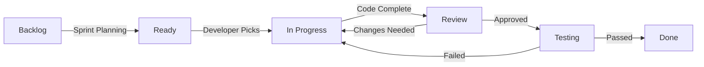

# GitHub Issue Management Plan

## Overview

Comprehensive GitHub Issues strategy for managing feature development, bug tracking, and project coordination for the PMP Learning Management System.

## Issue Labeling Strategy

### Category Labels (Type)

| Label                 | Color   | Description                | Usage              |
| --------------------- | ------- | -------------------------- | ------------------ |
| `type:feature`        | #0E8A16 | New feature or enhancement | New functionality  |
| `type:bug`            | #D73A4A | Something isn't working    | Defects and errors |
| `type:security`       | #FF0000 | Security vulnerability     | Security issues    |
| `type:performance`    | #FBCA04 | Performance improvement    | Optimization needs |
| `type:documentation`  | #0075CA | Documentation updates      | Docs and guides    |
| `type:test`           | #7057FF | Testing related            | Test coverage      |
| `type:refactor`       | #008672 | Code refactoring           | Code improvement   |
| `type:infrastructure` | #C5DEF5 | Infrastructure changes     | DevOps, CI/CD      |

### Priority Labels

| Label               | Color   | Description                  | SLA      |
| ------------------- | ------- | ---------------------------- | -------- |
| `priority:critical` | #B60205 | Show-stopper, blocks release | 24 hours |
| `priority:high`     | #D93F0B | Major impact on users        | 3 days   |
| `priority:medium`   | #FBCA04 | Normal priority              | 1 week   |
| `priority:low`      | #0E8A16 | Nice to have                 | 2 weeks  |

### Status Labels

| Label                | Color   | Description               |
| -------------------- | ------- | ------------------------- |
| `status:ready`       | #0E8A16 | Ready for development     |
| `status:in-progress` | #FBCA04 | Currently being worked on |
| `status:blocked`     | #D73A4A | Blocked by dependency     |
| `status:review`      | #0075CA | In code review            |
| `status:testing`     | #7057FF | In testing phase          |
| `status:done`        | #008672 | Completed                 |

### Area Labels

| Label                | Color   | Description              |
| -------------------- | ------- | ------------------------ |
| `area:ui`            | #BFD4F2 | User interface           |
| `area:backend`       | #D4C5F9 | Backend services         |
| `area:mobile`        | #F9D0C4 | Mobile application       |
| `area:pwa`           | #FEF2C0 | Progressive Web App      |
| `area:learning`      | #C2E0C6 | Learning features        |
| `area:visualization` | #BFDADC | Data visualization       |
| `area:collaboration` | #E99695 | Collaboration features   |
| `area:payment`       | #F9C0C4 | Payment and subscription |

### Additional Labels

| Label              | Color   | Description              |
| ------------------ | ------- | ------------------------ |
| `good-first-issue` | #7057FF | Good for newcomers       |
| `help-wanted`      | #008672 | Extra attention needed   |
| `duplicate`        | #CFD3D7 | Duplicate issue          |
| `wontfix`          | #FFFFFF | Will not be worked on    |
| `epic`             | #3E4B9E | Large feature group      |
| `needs-design`     | #F442D1 | Requires design work     |
| `needs-discussion` | #FFEB3B | Requires team discussion |
| `breaking-change`  | #FF5722 | Breaking API change      |

## Milestones

### Q1 2025 Milestones

| Milestone                     | Due Date     | Description                          | Key Features                 |
| ----------------------------- | ------------ | ------------------------------------ | ---------------------------- |
| v2.1.0 - Security Enhancement | Jan 31, 2025 | Security and authentication features | 2FA, SSO prep, audit logging |
| v2.2.0 - AI Learning          | Feb 28, 2025 | AI-powered learning features         | Adaptive paths, AI tutor     |
| v2.3.0 - Premium Launch       | Mar 31, 2025 | Monetization and premium features    | Subscriptions, payments      |

### Q2 2025 Milestones

| Milestone                 | Due Date     | Description                | Key Features              |
| ------------------------- | ------------ | -------------------------- | ------------------------- |
| v3.0.0 - Mobile Launch    | Apr 30, 2025 | Native mobile applications | iOS/Android apps          |
| v3.1.0 - International    | May 31, 2025 | Multi-language support     | i18n, regional payments   |
| v3.2.0 - Offline Complete | Jun 30, 2025 | Full offline capability    | Sync, conflict resolution |

## Issue Templates

### 1. Feature Request Template

```markdown
---
name: Feature Request
about: Suggest a new feature for PMP Learning Management
title: '[FEATURE] '
labels: 'type:feature, status:ready'
assignees: ''
---

## Feature Description

<!-- Clear and concise description of the feature -->

## User Story

As a [type of user], I want [goal] so that [benefit].

## Acceptance Criteria

- [ ] Criterion 1
- [ ] Criterion 2
- [ ] Criterion 3

## Technical Requirements

<!-- Any technical constraints or requirements -->

## Design Mockups

<!-- Attach or link to design mockups if available -->

## Priority and Impact

- **Priority**: [Critical/High/Medium/Low]
- **Estimated Users Affected**: [Number or percentage]
- **Business Value**: [High/Medium/Low]

## Implementation Approach

<!-- Suggested technical approach if known -->

## Dependencies

<!-- List any dependencies or blockers -->

## Success Metrics

<!-- How will we measure success? -->
```

### 2. Bug Report Template

```markdown
---
name: Bug Report
about: Report a bug in PMP Learning Management
title: '[BUG] '
labels: 'type:bug, status:ready'
assignees: ''
---

## Bug Description

<!-- Clear description of the bug -->

## Steps to Reproduce

1. Go to '...'
2. Click on '...'
3. Scroll down to '...'
4. See error

## Expected Behavior

<!-- What should happen -->

## Actual Behavior

<!-- What actually happens -->

## Screenshots

<!-- If applicable, add screenshots -->

## Environment

- **Browser**: [e.g., Chrome 96]
- **OS**: [e.g., Windows 11]
- **Device**: [e.g., Desktop/Mobile]
- **Version**: [e.g., v2.0.0]

## Severity

- [ ] Critical - System unusable
- [ ] High - Major feature broken
- [ ] Medium - Minor feature issue
- [ ] Low - Cosmetic issue

## Additional Context

<!-- Any other context about the problem -->

## Possible Solution

<!-- Optional: Suggest a fix if you have ideas -->
```

### 3. Epic Template

```markdown
---
name: Epic
about: Large feature or initiative
title: '[EPIC] '
labels: 'epic'
assignees: ''
---

## Epic Overview

<!-- High-level description of the epic -->

## Business Objective

<!-- What business goal does this achieve? -->

## Success Criteria

<!-- How do we know when this epic is complete? -->

## User Stories

- [ ] #issue_number - User story 1
- [ ] #issue_number - User story 2
- [ ] #issue_number - User story 3

## Technical Approach

<!-- High-level technical strategy -->

## Timeline

- **Start Date**:
- **Target Completion**:
- **Milestones**:
  - [ ] Milestone 1 - Date
  - [ ] Milestone 2 - Date

## Resources Required

- **Engineering**: X developers
- **Design**: X designers
- **QA**: X testers

## Risks and Mitigation

| Risk   | Impact | Mitigation |
| ------ | ------ | ---------- |
| Risk 1 | High   | Strategy   |

## Dependencies

<!-- External dependencies or blockers -->

## Success Metrics

- KPI 1: Target value
- KPI 2: Target value
```

## Priority Matrix for Q1 2025

### Critical Priority Issues (Immediate)

```yaml
- title: 'Implement Two-Factor Authentication'
  labels: ['type:security', 'priority:critical', 'area:backend']
  milestone: 'v2.1.0'
  assignee: 'security-team'

- title: 'Fix Memory Leak in Learning Dashboard'
  labels: ['type:bug', 'priority:critical', 'area:ui']
  milestone: 'v2.1.0'
  assignee: 'frontend-team'

- title: 'Payment Processing Integration'
  labels: ['type:feature', 'priority:critical', 'area:payment']
  milestone: 'v2.3.0'
  assignee: 'backend-team'
```

### High Priority Issues (This Sprint)

```yaml
- title: 'Spaced Repetition Algorithm Implementation'
  labels: ['type:feature', 'priority:high', 'area:learning']
  milestone: 'v2.2.0'
  epic: 'AI-Powered Learning'

- title: 'Real-time Collaboration WebSocket Setup'
  labels: ['type:feature', 'priority:high', 'area:collaboration']
  milestone: 'v2.2.0'

- title: 'Performance Optimization for Large Datasets'
  labels: ['type:performance', 'priority:high', 'area:visualization']
  milestone: 'v2.1.0'
```

### Medium Priority Issues (This Quarter)

```yaml
- title: 'Add Spanish Localization'
  labels: ['type:feature', 'priority:medium', 'area:ui']
  milestone: 'v3.1.0'

- title: 'Implement Learning Analytics Dashboard'
  labels: ['type:feature', 'priority:medium', 'area:learning']
  milestone: 'v2.2.0'

- title: 'Create API Documentation'
  labels: ['type:documentation', 'priority:medium']
  milestone: 'v2.3.0'
```

## Sprint Planning Process

### Sprint Cadence

- **Sprint Duration**: 2 weeks
- **Sprint Planning**: Monday, Week 1
- **Daily Standups**: 9:00 AM daily
- **Sprint Review**: Friday, Week 2
- **Sprint Retrospective**: Friday, Week 2

### Issue Workflow



### Definition of Ready

- [ ] User story is clear and complete
- [ ] Acceptance criteria defined
- [ ] Dependencies identified
- [ ] Estimated (story points)
- [ ] Design approved (if needed)
- [ ] Technical approach agreed

### Definition of Done

- [ ] Code complete and pushed
- [ ] Unit tests written and passing
- [ ] Code reviewed and approved
- [ ] Integration tests passing
- [ ] Documentation updated
- [ ] Deployed to staging
- [ ] QA tested and approved
- [ ] Product owner accepted

## Automation Rules

### GitHub Actions Automation

```yaml
# Auto-label based on file changes
- paths:
    - 'src/components/**'
  labels: ['area:ui']

- paths:
    - 'server/**'
  labels: ['area:backend']

- paths:
    - 'docs/**'
  labels: ['type:documentation']

# Auto-assign based on labels
- label: 'area:ui'
  assignees: ['frontend-team']

- label: 'area:backend'
  assignees: ['backend-team']

- label: 'type:security'
  assignees: ['security-team']

# Auto-close stale issues
- daysUntilStale: 60
  daysUntilClose: 7
  staleLabel: 'stale'
  exemptLabels: ['priority:critical', 'priority:high', 'epic']
```

### Issue Lifecycle Automation

```yaml
# Move to in-progress when assigned
on:
  issues:
    types: [assigned]
  action:
    - add-label: 'status:in-progress'
    - remove-label: 'status:ready'

# Move to review when PR created
on:
  pull_request:
    types: [opened]
  action:
    - add-label: 'status:review'
    - remove-label: 'status:in-progress'

# Close issue when PR merged
on:
  pull_request:
    types: [closed]
  condition:
    merged: true
  action:
    - close-issue: linked
    - add-label: 'status:done'
```

## Metrics and Reporting

### Key Metrics to Track

```typescript
interface IssueMetrics {
  velocity: {
    averageCompletionTime: number
    issuesPerSprint: number
    storyPointsPerSprint: number
  }
  quality: {
    bugsCreated: number
    bugsResolved: number
    bugEscapeRate: number
    regressionRate: number
  }
  efficiency: {
    cycleTime: number
    leadTime: number
    blockedTime: number
    reworkRate: number
  }
  health: {
    openIssues: number
    ageOfOldestIssue: number
    stalledIssues: number
    technicalDebt: number
  }
}
```

### Weekly Report Template

```markdown
# Weekly Issue Report - Week of [Date]

## Summary

- **Issues Created**: X
- **Issues Closed**: X
- **In Progress**: X
- **Blocked**: X

## Velocity

- **Story Points Completed**: X
- **Average Cycle Time**: X days
- **Sprint Burndown**: On Track/Behind/Ahead

## Critical Issues

| Issue | Status  | Blocker        | Action            |
| ----- | ------- | -------------- | ----------------- |
| #123  | Blocked | API dependency | Meeting scheduled |

## Upcoming Priorities

1. Issue #456 - Feature X
2. Issue #789 - Bug Y
3. Issue #012 - Enhancement Z

## Risks and Concerns

- Risk 1: Description and mitigation
- Risk 2: Description and mitigation

## Team Health

- **Morale**: High/Medium/Low
- **Blockers Resolved**: X
- **Help Needed**: Areas requiring assistance
```

## Issue Creation Guidelines

### Best Practices

1. **Clear Titles**: Use descriptive, action-oriented titles
2. **Complete Description**: Provide all necessary context
3. **Proper Labels**: Apply all relevant labels
4. **Assign Milestone**: Link to appropriate milestone
5. **Set Priority**: Indicate urgency level
6. **Link Dependencies**: Reference related issues
7. **Add Estimates**: Include story points or time estimates

### Common Pitfalls to Avoid

- ❌ Vague descriptions
- ❌ Missing acceptance criteria
- ❌ No assigned milestone
- ❌ Incorrect priority level
- ❌ Missing technical details
- ❌ No success metrics

## Communication Guidelines

### Issue Comments

- Use @mentions for specific people
- Update status in comments
- Document decisions and changes
- Link to relevant resources
- Keep discussions focused

### Status Updates

```markdown
## Status Update - [Date]

**Progress**:

- Completed X
- Working on Y
- Blocked by Z

**Next Steps**:

- Action 1
- Action 2

**ETA**: [Date]
```

## Tools and Integrations

### Recommended Tools

1. **GitHub CLI**: Quick issue management from terminal
2. **GitHub Desktop**: Visual issue tracking
3. **Slack Integration**: Real-time notifications
4. **Project Boards**: Kanban visualization
5. **GitHub Mobile**: On-the-go management

### CLI Commands

```bash
# Create new issue
gh issue create --title "Feature X" --label "type:feature,priority:high"

# List issues assigned to me
gh issue list --assignee @me

# View issue details
gh issue view 123

# Close issue with comment
gh issue close 123 --comment "Fixed in PR #456"
```

## Success Metrics

### Team Performance KPIs

- **Issue Resolution Time**: < 5 days average
- **Bug Fix Rate**: 90% within SLA
- **Sprint Completion**: 85% of planned work
- **Code Review Time**: < 24 hours
- **Customer Issues**: < 5 per release

### Project Health Indicators

- **Technical Debt Ratio**: < 20%
- **Test Coverage**: > 80%
- **Documentation Coverage**: 100% for public APIs
- **Security Issues**: 0 critical, < 5 high
- **Performance Benchmarks**: All green

## Continuous Improvement

### Monthly Retrospective Topics

1. Issue management efficiency
2. Label usage and clarity
3. Automation effectiveness
4. Communication quality
5. Process bottlenecks

### Quarterly Review Actions

1. Update label taxonomy
2. Refine issue templates
3. Adjust automation rules
4. Review and update priorities
5. Optimize workflow processes

---

**Last Updated**: January 2025
**Owner**: Project Management Team
**Review Cycle**: Monthly
