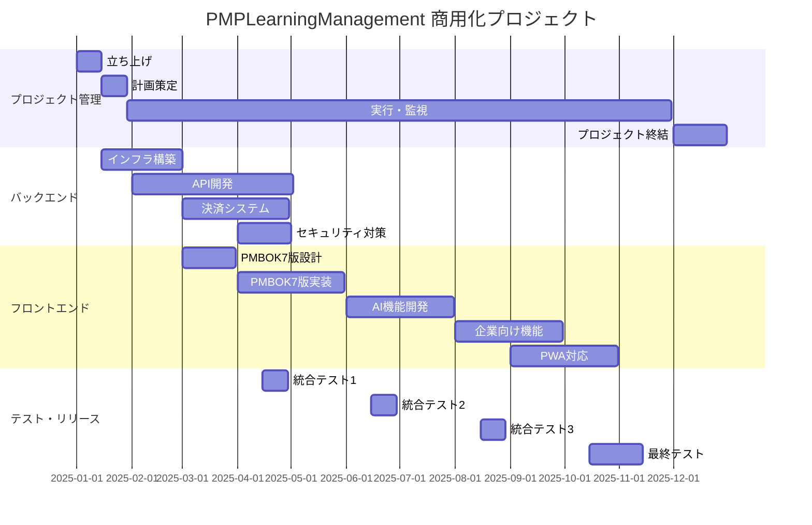

# PMPLearningManagement プロジェクト管理計画書

**プロジェクト名:** PMPLearningManagement 商用化プロジェクト  
**計画書作成日:** 2025年1月9日  
**プロジェクト期間:** 2025年1月1日 - 2025年12月31日  
**総予算:** 3,000万円  
**プロジェクトマネージャー:** [PM名]

---

## 1. プロジェクト憲章

### 1.1 プロジェクト目的

PMBOK学習支援WebアプリケーションをGitHub Pages上の無料版から、モノリスファーストアプローチで商用サービスへ段階的に進化させ、持続可能なビジネスモデルを確立する。

### 1.2 プロジェクト目標

#### ビジネス目標（現実的に修正）

- **収益目標:** 初年度売上高2,000万円達成
- **顧客獲得:** 有料会員500名獲得（年度末時点）
- **市場シェア:** 国内PMP学習アプリ市場シェア5%獲得
- **損益分岐:** 8-10ヶ月で達成

#### プロダクト目標

- **MAU:** Q4時点で20,000人達成
- **有料転換率:** 10%以上維持
- **NPS:** 40以上達成
- **顧客満足度:** 4.5/5.0以上

### 1.3 スコープ定義

#### インスコープ

1. **モノリスMVP構築（3ヶ月）**
   - Next.js 14への移行
   - NextAuth.js認証システム
   - Stripe基本統合
   - PostgreSQLデータベース実装
   - LocalStorageデータ移行

2. **機能拡張（4-6ヶ月）**
   - PMBOK第7版対応
   - OpenAI APIを使ったAIアシスタント
   - 基本的な企業向け機能
   - PWA化

3. **運用基盤**
   - Sentry + Vercel Analytics
   - GitHub Actions CI/CD
   - Vercelホスティング

#### アウトオブスコープ

- ネイティブモバイルアプリ開発（iOS/Android） - 将来検討
- マイクロサービス化 - 必要に応じて
- オンプレミス対応 - 将来検討
- カスタマイズ型企業研修システム - 将来検討

### 1.4 成功基準

| カテゴリ | 成功基準           | 測定指標          |
| -------- | ------------------ | ----------------- |
| 財務     | 損益分岐点達成     | 月額売上500万円   |
| 顧客     | 顧客満足度向上     | NPS 40以上        |
| 品質     | システム安定性     | 可用性99.5%以上   |
| 納期     | マイルストーン遵守 | 遅延率10%以下     |
| チーム   | 生産性向上         | ベロシティ20%向上 |

### 1.5 制約条件（現実的に修正）

- **予算制約:** 初期開発600-900万円
- **人的リソース:** 2-3名のフルスタックエンジニア
- **技術制約:** 既存30+のReactコンポーネントの活用必須
- **法規制:** 個人情報保護法、特定商取引法準拠
- **インフラ:** 初期は$0-20/月、成長に応じて段階的拡張

### 1.6 前提条件

- 既存のGitHub Pages環境は継続利用（無料版用）
- 開発チームのReact/Node.js技術スキル保有
- Stripe決済システムのAPI利用可能
- AWS/GCPのクラウド環境利用可能
- PMBOK第7版の日本語資料入手可能

---

## 2. WBS（作業分解構造）

### 2.1 プロジェクト管理

```
1.0 プロジェクト管理
├── 1.1 プロジェクト立ち上げ
│   ├── 1.1.1 キックオフ会議
│   ├── 1.1.2 チーム編成
│   └── 1.1.3 開発環境構築
├── 1.2 計画
│   ├── 1.2.1 詳細計画策定
│   ├── 1.2.2 リスク分析
│   └── 1.2.3 品質計画
├── 1.3 実行・監視
│   ├── 1.3.1 進捗管理
│   ├── 1.3.2 品質管理
│   └── 1.3.3 変更管理
└── 1.4 終結
    ├── 1.4.1 プロジェクト評価
    └── 1.4.2 知識移転
```

### 2.2 MVP開発（Month 1-3）

```
2.0 MVP開発
├── 2.1 Next.js移行
│   ├── 2.1.1 環境構築
│   ├── 2.1.2 既存30+コンポーネント移行
│   └── 2.1.3 ルーティング設定
├── 2.2 API開発
│   ├── 2.2.1 tRPC設定
│   ├── 2.2.2 NextAuth.js認証
│   └── 2.2.3 Stripe決済統合
├── 2.3 データベース
│   ├── 2.3.1 Prismaスキーマ設計
│   ├── 2.3.2 PostgreSQLセットアップ
│   └── 2.3.3 データ移行ツール
└── 2.4 デプロイ
    ├── 2.4.1 Vercel設定
    └── 2.4.2 GitHub Actions
```

### 2.3 機能拡張（Month 4-6）

```
3.0 機能拡張
├── 3.1 PMBOK第7版対応
│   ├── 3.1.1 データモデル設計
│   ├── 3.1.2 UI/UX設計
│   └── 3.1.3 実装・テスト
├── 3.2 AI学習アシスタント
│   ├── 3.2.1 OpenAI API統合
│   ├── 3.2.2 プロンプト設計
│   └── 3.2.3 チャットUI実装
├── 3.3 PMIS機能
│   ├── 3.3.1 プロジェクト管理
│   ├── 3.3.2 タスク管理
│   └── 3.3.3 リソース管理
└── 3.4 PWA対応
    ├── 3.4.1 Service Worker
    └── 3.4.2 オフライン機能
```

### 2.4 主要マイルストーン（現実的なスケジュール）

| マイルストーン       | 完了予定日 | 成果物            |
| -------------------- | ---------- | ----------------- |
| M1: プロジェクト開始 | 2025/01/15 | キックオフ完了    |
| M2: Next.js環境構築  | 2025/02/15 | 開発環境完成      |
| M3: MVPリリース      | 2025/04/15 | 基本機能実装完了  |
| M4: 機能拡張完了     | 2025/06/30 | PMBOK7版、AI機能  |
| M5: 本格リリース     | 2025/07/31 | v1.0正式リリース  |
| M6: 成長フェーズ     | 2025/10/31 | ユーザー500名達成 |
| M7: 年度評価         | 2025/12/31 | 次年度計画策定    |

---

## 3. スケジュール計画

### 3.1 マスタースケジュール



### 3.2 クリティカルパス

以下の作業がクリティカルパスを構成:

1. **インフラ構築** → **認証API開発** → **決済API統合** → **MVP版リリース**
2. **PMBOK7版データ設計** → **実装** → **AI基盤統合** → **v2.5リリース**

**クリティカルパス期間:** 240日  
**総バッファ:** 30日（12.5%）

### 3.3 バッファ管理

| バッファ種別           | 配置           | 日数 | 用途           |
| ---------------------- | -------------- | ---- | -------------- |
| プロジェクトバッファ   | 最終工程       | 30日 | 全体遅延吸収   |
| フィーディングバッファ | 各統合ポイント | 7日  | 統合リスク対応 |
| リソースバッファ       | 外部連携作業   | 5日  | 調整遅延対応   |

---

## 4. リソース計画

### 4.1 組織体制（現実的な体制）

```
プロジェクトスポンサー
        │
プロジェクトマネージャー（パートタイム）
        └── 開発チーム
            ├── フルスタックエンジニア（2名）
            └── 外部リソース
                └── UIデザイナー（必要時のみ）

※ 成長に応じて段階的に体制拡大
```

### 4.2 必要スキルマトリックス

| 役割             | 必要スキル                 | レベル   | 人数 | 調達方法 |
| ---------------- | -------------------------- | -------- | ---- | -------- |
| PM               | PMP、アジャイル            | 上級     | 1    | 内部     |
| テクニカルリード | React、Node.js、AWS        | 上級     | 1    | 内部     |
| バックエンド     | Node.js、PostgreSQL、Redis | 中級以上 | 2    | 内部     |
| フロントエンド   | React、TypeScript、D3.js   | 中級以上 | 2    | 内部     |
| フルスタック     | React、Node.js、DevOps     | 中級     | 1    | 内部     |
| QA               | 自動テスト、性能テスト     | 中級     | 1    | 内部     |
| UIデザイナー     | Figma、Web デザイン        | 中級     | 1    | 外部     |

### 4.3 RACI マトリックス

| タスク       | PM  | TL  | 開発 | QA  | スポンサー |
| ------------ | --- | --- | ---- | --- | ---------- |
| 要件定義     | A   | R   | C    | C   | I          |
| 設計承認     | R   | A   | C    | I   | I          |
| 実装         | I   | C   | R    | I   | -          |
| テスト       | C   | I   | C    | R/A | -          |
| リリース承認 | R   | C   | I    | C   | A          |
| 予算承認     | R   | C   | I    | -   | A          |

**凡例:** R=実行責任、A=説明責任、C=協議先、I=情報共有先

### 4.4 調達計画

| 調達項目         | 予算       | 調達時期   | 調達方法 |
| ---------------- | ---------- | ---------- | -------- |
| AWS インフラ     | 360万円/年 | 2025/01    | 直接契約 |
| Stripe決済       | 手数料3.6% | 2025/03    | API契約  |
| OpenAI API       | 60万円/年  | 2025/06    | 従量課金 |
| セキュリティ診断 | 150万円    | 2025/04    | 外注     |
| UIデザイン       | 120万円    | 2025/02-10 | 業務委託 |

---

## 5. 予算計画

### 5.1 コスト見積もり（現実的な予算）

| カテゴリ               | 項目                                | 金額（万円） | 構成比   |
| ---------------------- | ----------------------------------- | ------------ | -------- |
| **人件費**             |                                     | **600**      | **67%**  |
|                        | フルスタックエンジニア（2名×3ヶ月） | 450          |          |
|                        | PM（パートタイム×3ヶ月）            | 150          |          |
| **外注費**             |                                     | **100**      | **11%**  |
|                        | UIデザイン（必要時）                | 50           |          |
|                        | その他外注                          | 50           |          |
| **インフラ費**         |                                     | **60**       | **7%**   |
|                        | Vercel/Supabase（初期は無料枠）     | 0            |          |
|                        | 将来のインフラ予備                  | 60           |          |
| **ツール・ライセンス** |                                     | **60**       | **7%**   |
|                        | 開発ツール                          | 30           |          |
|                        | 外部API（OpenAI等）                 | 30           |          |
| **予備費**             |                                     | **80**       | **8%**   |
| **合計**               |                                     | **900**      | **100%** |

※ 6ヶ月での予算は1,500-1,800万円を想定

### 5.2 予算配分（四半期別）

| 四半期 | 予算（万円） | 主要支出項目                           |
| ------ | ------------ | -------------------------------------- |
| Q1     | 900          | 初期投資、インフラ構築、チーム立ち上げ |
| Q2     | 800          | MVP開発、セキュリティ対策              |
| Q3     | 700          | 機能拡張、AI統合                       |
| Q4     | 600          | 企業向け機能、最適化                   |

### 5.3 コストベースライン

```
累積コスト（万円）
3000 |                                    ●
2500 |                              ●
2000 |                        ●
1500 |                  ●
1000 |            ●
 500 |      ●
   0 |●
     +----+----+----+----+----+----+----+
     1月  3月  5月  7月  9月  11月 12月
```

**EV管理指標:**

- CPI（コスト効率）目標: 0.95以上
- SPI（スケジュール効率）目標: 0.90以上

---

## 6. 品質管理計画

### 6.1 品質基準

| 品質特性             | 基準値         | 測定方法         |
| -------------------- | -------------- | ---------------- |
| **機能性**           |                |                  |
| 機能網羅率           | 100%           | 要件カバレッジ   |
| バグ密度             | <5件/KLOC      | 静的解析         |
| **信頼性**           |                |                  |
| 可用性               | 99.5%以上      | 監視ツール       |
| MTBF                 | >720時間       | 障害記録         |
| MTTR                 | <2時間         | 障害記録         |
| **使用性**           |                |                  |
| ユーザビリティスコア | 80/100以上     | ユーザーテスト   |
| 学習曲線             | 1時間以内      | 新規ユーザー調査 |
| **効率性**           |                |                  |
| 応答時間             | <2秒（95%ile） | APM              |
| 同時接続数           | 1000以上       | 負荷テスト       |
| **保守性**           |                |                  |
| コードカバレッジ     | 80%以上        | テストツール     |
| 技術的負債           | <10%           | SonarQube        |

### 6.2 品質保証活動

| フェーズ | QA活動                         | 成果物         |
| -------- | ------------------------------ | -------------- |
| 要件定義 | 要件レビュー                   | レビュー記録   |
| 設計     | 設計レビュー、プロトタイプ評価 | 設計書承認     |
| 実装     | コードレビュー、単体テスト     | テスト結果     |
| 統合     | 統合テスト、性能テスト         | テスト報告書   |
| リリース | 受入テスト、セキュリティ診断   | リリース判定書 |
| 運用     | 監視、インシデント管理         | 運用報告書     |

### 6.3 品質管理活動

**テスト戦略:**

| テストレベル       | カバレッジ目標 | 自動化率 |
| ------------------ | -------------- | -------- |
| 単体テスト         | 80%            | 100%     |
| 統合テスト         | 70%            | 80%      |
| E2Eテスト          | 60%            | 70%      |
| 性能テスト         | 主要シナリオ   | 100%     |
| セキュリティテスト | OWASP Top10    | 50%      |

**品質メトリクス収集:**

- 週次: コードカバレッジ、静的解析結果
- スプリント毎: バグ発見率、修正率
- リリース毎: 品質スコアカード

---

## 7. リスク管理計画

### 7.1 リスク識別

| ID  | リスク                 | カテゴリ | 発生確率 | 影響度 | リスク値 |
| --- | ---------------------- | -------- | -------- | ------ | -------- |
| R01 | 技術者の離職           | 人的     | 中       | 高     | 9        |
| R02 | AWS障害                | 技術     | 低       | 高     | 6        |
| R03 | 決済システム統合遅延   | 外部     | 中       | 中     | 6        |
| R04 | PMBOK7版仕様変更       | 要件     | 低       | 中     | 4        |
| R05 | セキュリティ脆弱性発覚 | 技術     | 中       | 高     | 9        |
| R06 | 競合サービス出現       | 市場     | 高       | 中     | 9        |
| R07 | 予算超過               | 財務     | 中       | 高     | 9        |
| R08 | 法規制変更             | 外部     | 低       | 高     | 6        |

### 7.2 リスク分析（定量分析）

**モンテカルロシミュレーション結果:**

- プロジェクト完了確率（12月31日）: 75%
- 予算内完了確率: 70%
- 期待金額価値（EMV）: -180万円

### 7.3 リスク対応計画

| リスクID | 対応戦略 | 具体的対応                     | 責任者     | トリガー     |
| -------- | -------- | ------------------------------ | ---------- | ------------ |
| R01      | 軽減     | ナレッジ共有、バックアップ体制 | PM         | 離職率5%超   |
| R02      | 転嫁     | マルチリージョン構成、保険     | TL         | SLA違反      |
| R03      | 軽減     | 早期POC、代替手段準備          | 開発リード | 2週間遅延    |
| R05      | 回避     | セキュアコーディング、定期診断 | QA         | 脆弱性検出   |
| R06      | 受容     | 差別化強化、アジャイル対応     | PM         | 競合リリース |
| R07      | 軽減     | 週次予算管理、早期アラート     | PM         | 10%超過      |

### 7.4 リスク監視

- **リスクレビュー頻度:** 隔週
- **リスク指標:**
  - リスク露出額（月次更新）
  - リスク発生率
  - 対策実施率
- **エスカレーション基準:** リスク値12以上

---

## 8. コミュニケーション計画

### 8.1 ステークホルダー分析

| ステークホルダー       | 影響力 | 関心度 | 戦略           |
| ---------------------- | ------ | ------ | -------------- |
| スポンサー（経営層）   | 高     | 高     | 重点管理       |
| 開発チーム             | 中     | 高     | 十分な情報提供 |
| エンドユーザー         | 低     | 高     | 情報提供維持   |
| 営業・マーケティング   | 中     | 中     | 満足維持       |
| 法務・コンプライアンス | 高     | 低     | 監視継続       |

### 8.2 コミュニケーションマトリックス

| 情報               | 送信者     | 受信者             | 頻度 | 方法           | 目的         |
| ------------------ | ---------- | ------------------ | ---- | -------------- | ------------ |
| ステータス報告     | PM         | スポンサー         | 週次 | メール/会議    | 進捗共有     |
| 技術レビュー       | TL         | 開発チーム         | 週次 | 会議           | 技術課題解決 |
| スプリントレビュー | 開発チーム | 全体               | 隔週 | デモ会議       | 成果確認     |
| リスク報告         | PM         | スポンサー         | 月次 | 文書           | リスク管理   |
| リリース通知       | PM         | 全ステークホルダー | 都度 | メール         | 情報共有     |
| 振り返り           | チーム     | チーム             | 隔週 | ワークショップ | 改善         |

### 8.3 会議体

| 会議名                 | 頻度 | 参加者         | 所要時間 | アジェンダ             |
| ---------------------- | ---- | -------------- | -------- | ---------------------- |
| デイリースクラム       | 日次 | 開発チーム     | 15分     | 進捗、課題、予定       |
| 週次PM会議             | 週次 | PM、TL         | 60分     | 進捗、リスク、決定事項 |
| ステアリング会議       | 月次 | PM、スポンサー | 90分     | 全体進捗、予算、承認   |
| スプリントプランニング | 隔週 | 開発チーム     | 120分    | スプリント計画         |
| レトロスペクティブ     | 隔週 | 開発チーム     | 90分     | 振り返り、改善         |

### 8.4 報告書テンプレート

**週次ステータス報告:**

1. エグゼクティブサマリー
2. 進捗状況（計画vs実績）
3. 主要成果
4. 課題と対策
5. 次週予定
6. リスク状況
7. 予算消化状況

---

## 9. 変更管理計画

### 9.1 変更管理プロセス

```
変更要求 → 影響分析 → CCB審査 → 承認/却下 → 実装 → 検証
   ↑                                    ↓
   └──────────── フィードバック ←─────────┘
```

### 9.2 変更管理委員会（CCB）

| 役割     | メンバー               | 権限       |
| -------- | ---------------------- | ---------- |
| 議長     | プロジェクトスポンサー | 最終承認   |
| 副議長   | PM                     | 提案、調整 |
| メンバー | TL                     | 技術評価   |
| メンバー | QAリード               | 品質評価   |
| メンバー | 財務担当               | コスト評価 |

**CCB開催:** 隔週（緊急時は臨時開催）

### 9.3 変更カテゴリと権限

| カテゴリ | 影響範囲            | 承認権限    | SLA      |
| -------- | ------------------- | ----------- | -------- |
| 軽微     | 1人日以内           | TL          | 2営業日  |
| 中程度   | 5人日以内           | PM          | 5営業日  |
| 重大     | 5人日超 or 予算影響 | CCB         | 10営業日 |
| 緊急     | システム停止リスク  | PM→事後承認 | 即時     |

### 9.4 変更影響分析項目

- スコープへの影響
- スケジュールへの影響
- コストへの影響
- 品質への影響
- リスクへの影響
- 他機能への影響
- 技術的実現可能性

---

## 10. 実行・監視計画

### 10.1 KPI/メトリクス

| カテゴリ             | KPI                           | 目標値 | 測定頻度   | アクション閾値 |
| -------------------- | ----------------------------- | ------ | ---------- | -------------- |
| **スケジュール**     |                               |        |            |                |
| SPI                  | スケジュール効率              | ≥0.90  | 週次       | <0.85          |
| マイルストーン達成率 | 期日遵守率                    | 90%    | 月次       | <80%           |
| **コスト**           |                               |        |            |                |
| CPI                  | コスト効率                    | ≥0.95  | 週次       | <0.90          |
| 予算消化率           | 計画vs実績                    | ±10%   | 週次       | ±15%           |
| **品質**             |                               |        |            |                |
| 欠陥密度             | バグ/KLOC                     | <5     | スプリント | >8             |
| テストカバレッジ     | コード網羅率                  | >80%   | 日次       | <70%           |
| **生産性**           |                               |        |            |                |
| ベロシティ           | ストーリーポイント/スプリント | 40     | スプリント | <30            |
| サイクルタイム       | 要求→本番                     | <10日  | 週次       | >15日          |

### 10.2 進捗管理手法

**アジャイル×ウォーターフォールのハイブリッド管理:**

| レベル           | 手法               | ツール     | 更新頻度     |
| ---------------- | ------------------ | ---------- | ------------ |
| プロジェクト全体 | ウォーターフォール | MS Project | 週次         |
| 開発作業         | スクラム           | Jira       | 日次         |
| タスク管理       | カンバン           | Trello     | リアルタイム |
| 進捗可視化       | バーンダウン       | Jira       | 日次         |

### 10.3 ダッシュボード構成

**エグゼクティブダッシュボード:**

- 全体進捗率（計画vs実績）
- 予算消化状況
- 主要マイルストーン状況
- リスクヒートマップ
- 品質スコア

**開発チームダッシュボード:**

- スプリントバーンダウン
- ベロシティトレンド
- バグ状況
- ビルド成功率
- コードカバレッジ

### 10.4 是正措置プロセス

```
問題検知 → 原因分析 → 対策立案 → 承認 → 実施 → 効果測定
   ↑                                          ↓
   └────────── 不十分な場合は再検討 ←──────────┘
```

**エスカレーション基準:**

| レベル  | 条件                 | エスカレーション先 |
| ------- | -------------------- | ------------------ |
| Level 1 | SPI/CPI < 0.90       | PM                 |
| Level 2 | 2週間以上の遅延      | ステアリング委員会 |
| Level 3 | 予算20%超過リスク    | スポンサー         |
| Level 4 | プロジェクト中止検討 | 経営会議           |

### 10.5 継続的改善

**改善サイクル（2週間スプリント）:**

1. **計測（Measure）**
   - KPI収集
   - 問題点識別

2. **分析（Analyze）**
   - 根本原因分析
   - 改善機会特定

3. **改善（Improve）**
   - 改善策実施
   - プロセス最適化

4. **統制（Control）**
   - 効果測定
   - 標準化

---

## 11. 移行・終結計画

### 11.1 本番移行計画

| フェーズ       | 期間          | 主要活動                 |
| -------------- | ------------- | ------------------------ |
| 移行準備       | 2025/11/01-15 | 環境準備、データ移行計画 |
| パイロット運用 | 2025/11/16-30 | 限定ユーザーでの運用     |
| 段階移行       | 2025/12/01-14 | 順次ユーザー移行         |
| 全面移行       | 2025/12/15    | 全ユーザー移行完了       |
| 安定化         | 2025/12/16-31 | 運用安定化、最適化       |

### 11.2 プロジェクト終結活動

**終結チェックリスト:**

- [ ] 全成果物の納品完了
- [ ] 受入テスト合格
- [ ] ドキュメント完成
- [ ] 知識移転完了
- [ ] 運用引き継ぎ完了
- [ ] 契約終了処理
- [ ] プロジェクト評価実施
- [ ] 教訓の文書化
- [ ] リソース解放
- [ ] 最終報告書作成

### 11.3 成功基準の評価

| 評価項目         | 目標         | 実績 | 達成率 |
| ---------------- | ------------ | ---- | ------ |
| スケジュール遵守 | 2025/12/31   | -    | -      |
| 予算遵守         | 3,000万円    | -    | -      |
| 品質基準達成     | 全項目達成   | -    | -      |
| 顧客満足度       | NPS 40以上   | -    | -      |
| ROI              | 初年度黒字化 | -    | -      |

---

## 12. 付録

### 12.1 用語集

| 用語 | 定義                                               |
| ---- | -------------------------------------------------- |
| MVP  | Minimum Viable Product（実用最小限の製品）         |
| SPI  | Schedule Performance Index（スケジュール効率指数） |
| CPI  | Cost Performance Index（コスト効率指数）           |
| CCB  | Change Control Board（変更管理委員会）             |
| RACI | Responsible, Accountable, Consulted, Informed      |
| PWA  | Progressive Web App                                |
| MTBF | Mean Time Between Failures（平均故障間隔）         |
| MTTR | Mean Time To Repair（平均修復時間）                |

### 12.2 参照文書

1. PMBOKガイド第6版・第7版
2. アジャイル実務ガイド
3. 既存システム設計書（CLAUDE.md）
4. ビジネスケース文書
5. 組織のプロジェクト管理規程

### 12.3 承認

| 役職                     | 氏名 | 署名 | 日付 |
| ------------------------ | ---- | ---- | ---- |
| プロジェクトスポンサー   |      |      |      |
| プロジェクトマネージャー |      |      |      |
| テクニカルリード         |      |      |      |
| 財務責任者               |      |      |      |

---

**文書管理情報:**

- バージョン: 1.0
- 作成日: 2025年1月9日
- 最終更新日: 2025年1月9日
- 次回レビュー予定: 2025年2月1日
- 配布先: プロジェクトチーム、ステークホルダー

---

_本計画書は、プロジェクトの進行に応じて定期的に見直し、必要に応じて更新されます。_
