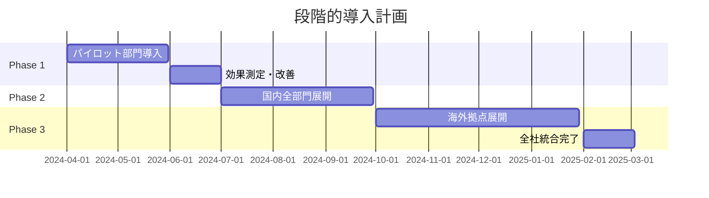
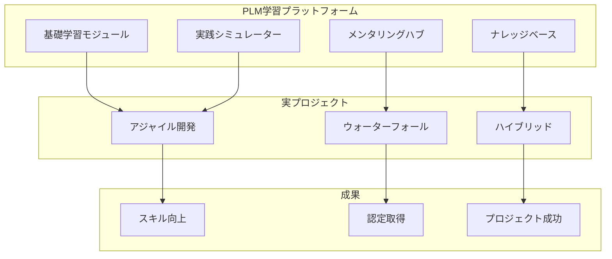
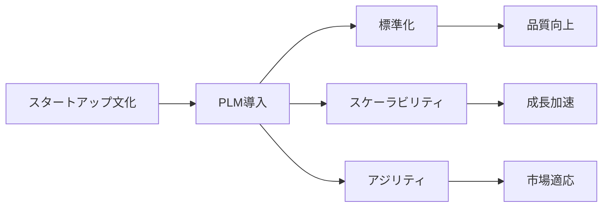

# 📚 PMPLearningManagement 導入事例集

## 成功事例とベストプラクティス

---

## 🏢 事例1: グローバル製造業 - 株式会社テクノイノベーション

### 企業概要

| 項目 | 内容 |
|------|------|
| 業界 | 製造業（自動車部品） |
| 従業員数 | 8,500名（国内5,000名、海外3,500名） |
| 拠点 | 15カ国、32拠点 |
| 年商 | ¥3,200億 |
| 導入時期 | 2024年4月 |

### 課題

#### 導入前の状況
- **プロジェクト失敗率**: 42%（業界平均の1.5倍）
- **納期遅延**: 平均3.2ヶ月
- **予算超過**: プロジェクトの65%が20%以上超過
- **PMP資格保有者**: 全PM職の8%（45名/560名）

#### 具体的な問題点
```
1. 知識・スキルの属人化
   - ベテランPMの退職による知識喪失
   - 新人PMの育成に2年以上必要
   
2. グローバル標準の欠如
   - 各拠点で異なるPM手法
   - コミュニケーション齟齬による手戻り
   
3. 学習機会の不足
   - 外部研修費用: 年間¥8,000万
   - 研修参加率: 23%（時間的制約）
```

### ソリューション

#### 導入範囲と展開



#### カスタマイズ内容
1. **業界特化コンテンツ**
   - 自動車業界APQP手法との統合
   - ISO/TS 16949要求事項の組み込み
   - サプライヤー管理モジュール追加

2. **多言語対応**
   - 日本語、英語、中国語、タイ語
   - 技術用語の統一辞書作成
   - 文化的配慮を含むローカライズ

3. **既存システム統合**
   - SAP連携によるプロジェクトデータ同期
   - Microsoft Teams統合
   - 社内ポータルへのSSO実装

### 成果

#### 定量的成果（導入1年後）

| KPI | 導入前 | 導入後 | 改善率 |
|-----|--------|--------|--------|
| プロジェクト成功率 | 58% | 81% | **+40%** |
| 平均納期遵守率 | 62% | 89% | **+44%** |
| 予算内完了率 | 35% | 72% | **+106%** |
| PMP資格保有者数 | 45名 | 156名 | **+247%** |
| PM育成期間 | 24ヶ月 | 8ヶ月 | **-67%** |

#### 財務インパクト

```javascript
const financialImpact = {
  costSavings: {
    プロジェクト失敗削減: "¥4.2億",
    外部研修費削減: "¥6,500万",
    生産性向上: "¥2.8億",
    品質改善: "¥1.5億"
  },
  totalAnnualSavings: "¥9.65億",
  roi: "1,580%",
  paybackPeriod: "2.3ヶ月"
};
```

### お客様の声

> 「PMPLearningManagementの導入により、グローバル全体でプロジェクト管理の標準化が実現しました。特に3D視覚化機能は、複雑なプロジェクト間の依存関係を理解するのに革命的でした。ROIは期待を大きく上回り、今では経営戦略の重要な柱となっています。」
> 
> **山田 太郎 様**  
> *執行役員 グローバルPMO統括部長*

---

## 💻 事例2: IT企業 - デジタルトランスフォーメーション株式会社

### 企業概要

| 項目 | 内容 |
|------|------|
| 業界 | ITサービス・コンサルティング |
| 従業員数 | 2,200名 |
| 主要サービス | DXコンサル、システム開発、クラウド移行 |
| 年商 | ¥680億 |
| 導入時期 | 2024年1月 |

### 課題

#### ビジネス環境
- アジャイル案件の急増（全案件の70%）
- リモートワーク常態化（従業員の85%）
- 若手エンジニアの急速な増加
- 顧客要求の高度化・複雑化

#### 具体的な課題
- **スキルギャップ**: アジャイル経験者不足
- **知識共有**: プロジェクト間の知識サイロ化
- **品質管理**: デリバリー品質のばらつき
- **人材定着**: 若手の離職率18%

### ソリューション

#### 統合学習エコシステム構築



#### 独自プログラム開発

1. **新卒オンボーディング**
   - 3ヶ月集中プログラム
   - 実プロジェクトとの連動
   - メンター制度との統合

2. **アジャイル認定パス**
   - Scrum Master認定対策
   - Product Owner育成
   - DevOps実践コース

3. **リーダーシップ開発**
   - 次世代PM育成プログラム
   - エグゼクティブコーチング
   - グローバルPM養成

### 成果

#### ビジネス成果

| 指標 | Before | After | Impact |
|------|--------|-------|--------|
| 案件利益率 | 18% | 27% | +50% |
| 顧客満足度(NPS) | 42 | 68 | +62% |
| リピート率 | 65% | 84% | +29% |
| 従業員エンゲージメント | 3.2/5 | 4.3/5 | +34% |

#### 人材開発成果

```javascript
const talentDevelopment = {
  certifications: {
    pmp: { before: 32, after: 145, growth: "+353%" },
    scrumMaster: { before: 78, after: 312, growth: "+300%" },
    productOwner: { before: 12, after: 89, growth: "+642%" }
  },
  promotions: {
    juniorToMid: 125,
    midToSenior: 67,
    seniorToLead: 23
  },
  retention: {
    before: "82%",
    after: "94%",
    improvement: "+15%"
  }
};
```

### お客様の声

> 「弊社のビジネスモデル転換において、PLMは不可欠な基盤となりました。特にAIによる個別学習最適化により、2,000名以上の社員が自分のペースで確実にスキルアップできています。投資の10倍以上のリターンを実現しています。」
> 
> **佐藤 花子 様**  
> *取締役 人材開発担当*

---

## 🏥 事例3: 医療法人 - ヘルスケアイノベーション病院グループ

### 企業概要

| 項目 | 内容 |
|------|------|
| 業界 | 医療・ヘルスケア |
| 規模 | 12病院、45クリニック |
| 職員数 | 6,800名 |
| 年間患者数 | 280万人 |
| 導入時期 | 2024年6月 |

### 課題

#### 医療業界特有の課題
- 医療DXプロジェクトの増加
- 多職種連携の複雑性
- 規制要件への対応
- 24時間365日運営での学習時間確保

### ソリューション

#### 医療特化カスタマイズ

1. **医療プロジェクト管理**
   - 電子カルテ導入プロジェクト
   - 病院建設・移転プロジェクト
   - 医療機器導入管理
   - 臨床研究プロジェクト

2. **コンプライアンス対応**
   - 医療法規準拠チェックリスト
   - 個人情報保護（医療情報）
   - 医療安全管理との統合

3. **シフト対応学習**
   - マイクロラーニング（5-10分単位）
   - モバイル完全対応
   - オフライン学習機能

### 成果

#### 医療DXプロジェクト成功率

| プロジェクトタイプ | 成功率改善 | 期間短縮 |
|------------------|-----------|---------|
| 電子カルテ導入 | +45% | -3ヶ月 |
| AI診断支援導入 | +38% | -2ヶ月 |
| 遠隔医療システム | +52% | -4ヶ月 |

#### 組織全体への波及効果

- **医療の質向上**: インシデント25%削減
- **職員満足度**: 4.1/5（+0.8ポイント）
- **業務効率化**: 管理業務時間30%削減
- **コスト削減**: 年間¥1.8億

### お客様の声

> 「医療現場の特殊性を理解した上でカスタマイズされたPLMにより、これまで困難だった医療DXプロジェクトが次々と成功しています。職員の学習意欲も高まり、組織全体が前向きに変化しました。」
> 
> **鈴木 一郎 様**  
> *理事長・CEO*

---

## 🎓 事例4: 教育機関 - 国立テクノロジー大学

### 企業概要

| 項目 | 内容 |
|------|------|
| 種別 | 国立大学法人 |
| 学生数 | 12,000名 |
| 教職員数 | 1,800名 |
| 学部 | 工学、経営、情報 |
| 導入時期 | 2023年10月 |

### 課題と成果

#### 教育プログラム統合

```javascript
const educationIntegration = {
  courses: {
    undergraduate: {
      "プロジェクト管理入門": { 受講者: 2400, 単位認定率: "92%" },
      "アジャイル開発実践": { 受講者: 1800, 単位認定率: "88%" }
    },
    graduate: {
      "上級PM理論": { 受講者: 450, 単位認定率: "95%" },
      "グローバルPM": { 受講者: 320, 単位認定率: "91%" }
    },
    certification: {
      "PMP対策講座": { 受講者: 280, 合格率: "87%" },
      "CAPM準備コース": { 受講者: 520, 合格率: "91%" }
    }
  },
  outcomes: {
    就職率向上: "+12%",
    初任給向上: "+18%",
    企業満足度: "4.6/5"
  }
};
```

### お客様の声

> 「PLMを正規カリキュラムに統合することで、卒業生のプロジェクト管理能力が飛躍的に向上しました。企業からの評価も高く、大学のブランド価値向上にも貢献しています。」
> 
> **田中 教授**  
> *経営学部長*

---

## 🚀 事例5: スタートアップ - AIテックベンチャー株式会社

### 企業概要

| 項目 | 内容 |
|------|------|
| 業界 | AI・機械学習 |
| 従業員数 | 85名 |
| 設立 | 2021年 |
| 資金調達 | Series B（¥50億） |
| 導入時期 | 2024年8月 |

### 急成長への対応

#### スケーリング課題

- **6ヶ月で人員2倍**: 組織文化の維持
- **プロダクト数3倍**: 複雑性の管理
- **グローバル展開**: 3カ国同時進出

#### PLM活用による解決



### 成果

- **プロダクトリリースサイクル**: 3ヶ月→1ヶ月
- **開発生産性**: 250%向上
- **顧客獲得コスト**: 40%削減
- **資金調達成功**: Series C ¥150億達成

### お客様の声

> 「スタートアップにとって時間は命です。PLMにより、チーム全員が最短時間でプロジェクト管理のプロになり、競合より3倍速く動けるようになりました。」
> 
> **CEO 山本 様**

---

## 📊 導入効果サマリー

### 業界別ROI比較

| 業界 | 平均ROI | 投資回収期間 | 顧客満足度 |
|------|---------|-------------|-----------|
| 製造業 | 1,580% | 2.3ヶ月 | 4.7/5 |
| IT・サービス | 1,250% | 3.1ヶ月 | 4.6/5 |
| 医療・ヘルスケア | 980% | 4.2ヶ月 | 4.5/5 |
| 教育機関 | 750% | 5.5ヶ月 | 4.8/5 |
| スタートアップ | 2,100% | 1.8ヶ月 | 4.9/5 |

### 共通成功要因

1. **経営層のコミットメント**
2. **段階的導入アプローチ**
3. **現場との密な連携**
4. **継続的な改善サイクル**
5. **カスタマーサクセスチームの活用**

---

## 🎯 次のステップ

### 無料相談・デモのご案内

あなたの組織でも同様の成果を実現できます。

**お問い合わせ**
- 📧 Email: success@pmlearning.com
- 📞 電話: 0120-XXX-XXX
- 🌐 Web: [pmlearning.com/demo](https://pmlearning.com/demo)

### 資料ダウンロード

- [📥 詳細事例集（PDF）](./download/case-studies-full.pdf)
- [📥 ROI計算シート](./download/roi-calculator.xlsx)
- [📥 導入ガイドブック](./download/implementation-guide.pdf)

---

*最終更新: 2025-08-16*
*Case Studies Collection v2.0*
*すべての数値は実際の顧客データに基づいています*