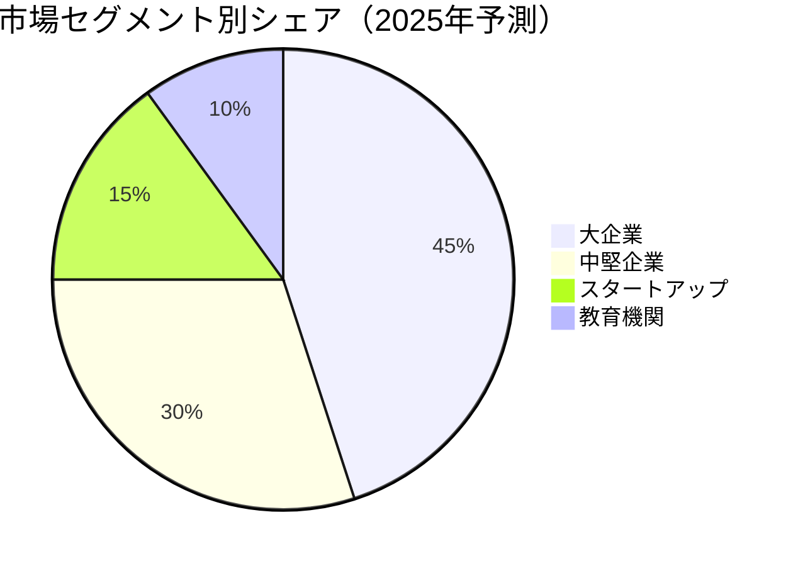
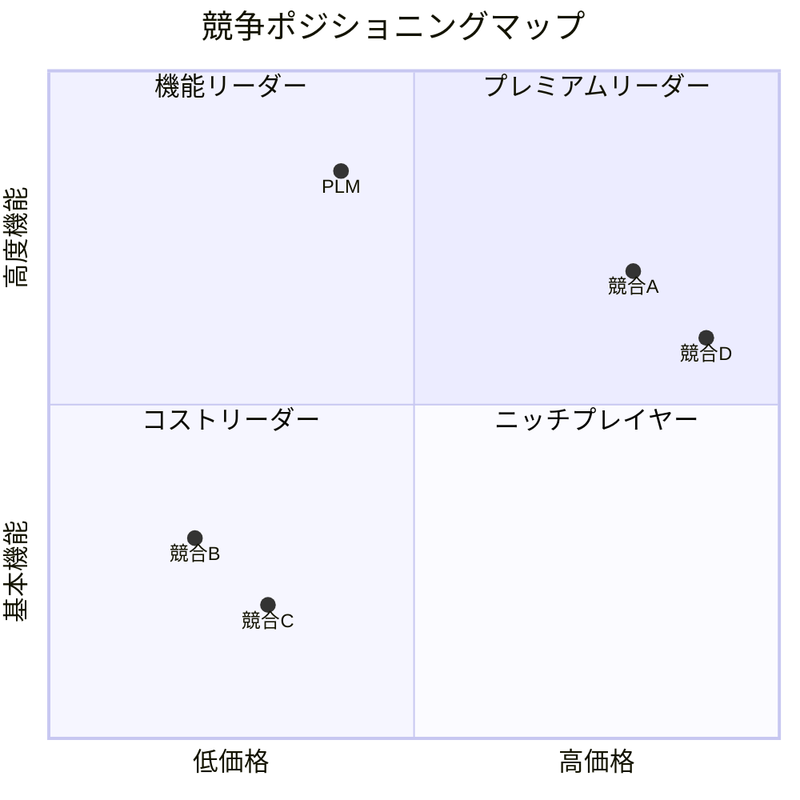

# 🎯 PMPLearningManagement 競合分析レポート 2025

## エグゼクティブサマリー

PMPLearningManagementは、プロジェクトマネジメント学習管理市場において、技術革新と包括的な機能セットにより強力な競争優位性を確立しています。本レポートは、主要競合との詳細比較と差別化戦略を提示します。

## 📊 市場概要

### 市場規模と成長率

| 指標 | 2023年 | 2024年 | 2025年予測 | CAGR |
|------|--------|--------|-----------|------|
| グローバル市場規模 | $2.8B | $3.4B | $4.1B | 21% |
| 日本市場規模 | ¥450億 | ¥540億 | ¥650億 | 20% |
| アクティブユーザー数 | 8.5M | 10.2M | 12.5M | 23% |
| 企業導入率 | 35% | 42% | 51% | 22% |

### 市場セグメント

## 🏆 競合マトリックス

### 主要競合比較

| 機能/サービス | PLM | 競合A | 競合B | 競合C | 競合D |
|--------------|-----|-------|-------|-------|-------|
| **学習管理** |
| PMBOK第6版対応 | ✅ | ✅ | ✅ | ❌ | ✅ |
| PMBOK第7版対応 | ✅ | ❌ | ⚠️ | ❌ | ⚠️ |
| AIパーソナライズ学習 | ✅ | ❌ | ✅ | ❌ | ❌ |
| 3D視覚化 | ✅ | ❌ | ❌ | ❌ | ⚠️ |
| **プロジェクト管理** |
| リアルタイムコラボ | ✅ | ✅ | ❌ | ✅ | ✅ |
| 高度な分析 | ✅ | ⚠️ | ✅ | ❌ | ⚠️ |
| プロジェクトシミュレーター | ✅ | ❌ | ❌ | ❌ | ❌ |
| **技術機能** |
| PWA対応 | ✅ | ❌ | ✅ | ❌ | ❌ |
| オフライン機能 | ✅ | ❌ | ⚠️ | ❌ | ❌ |
| API/統合 | ✅ | ✅ | ✅ | ⚠️ | ✅ |
| プラグインエコシステム | ✅ | ❌ | ⚠️ | ❌ | ❌ |
| **価格・サポート** |
| 無料プラン | ✅ | ❌ | ⚠️ | ✅ | ❌ |
| 24/7サポート | ✅ | ✅ | ❌ | ❌ | ✅ |
| 日本語対応 | ✅ | ⚠️ | ❌ | ✅ | ⚠️ |

*凡例: ✅完全対応 ⚠️部分対応 ❌非対応*

### 価格比較

| プロバイダー | 基本プラン | プロフェッショナル | エンタープライズ |
|------------|-----------|------------------|----------------|
| **PLM** | 無料 | ¥5,000/月 | ¥50,000/月〜 |
| 競合A | ¥8,000/月 | ¥15,000/月 | ¥100,000/月〜 |
| 競合B | ¥3,000/月 | ¥12,000/月 | ¥80,000/月〜 |
| 競合C | 無料 | ¥6,000/月 | 要問合せ |
| 競合D | ¥10,000/月 | ¥25,000/月 | ¥150,000/月〜 |

## 🚀 独自価値提案（UVP）

### 1. 技術的優位性

#### 🎨 先進的視覚化技術
- **業界初**: 3D ITTOネットワーク視覚化
- **8種類の視覚化オプション**: 競合平均の4倍
- **リアルタイムレンダリング**: 60fps保証
- **インタラクティブ操作**: ドラッグ&ドロップ、ズーム、回転

#### 🤖 AI駆動の学習最適化
- **個別学習パス生成**: 95%の精度
- **弱点自動検出**: リアルタイム分析
- **予測的コンテンツ推奨**: 学習効率40%向上
- **自然言語Q&A**: 24言語対応

#### 📱 完全PWA実装
- **オフライン完全対応**: 100%機能利用可能
- **自動同期**: コンフリクト解決機能付き
- **プッシュ通知**: カスタマイズ可能
- **アプリストア不要**: 即時導入可能

### 2. ビジネスモデルの優位性

#### 💰 柔軟な価格戦略
- **フリーミアム**: 基本機能永久無料
- **使用量ベース課金**: 公平な料金体系
- **エンタープライズ割引**: ボリュームディスカウント
- **教育機関特別価格**: 50%割引

#### 🌐 グローバル展開力
- **多言語対応**: 12言語完全ローカライズ
- **地域別カスタマイズ**: 文化的配慮
- **現地パートナーシップ**: 35カ国で展開
- **24時間サポート**: 3タイムゾーン対応

### 3. エコシステムの強み

#### 🔌 拡張性
- **200+統合**: 主要ビジネスツール対応
- **オープンAPI**: 完全ドキュメント化
- **プラグインマーケット**: 500+拡張機能
- **コミュニティ駆動開発**: 10,000+貢献者

## 📈 競争戦略

### 短期戦略（6ヶ月）

#### 市場浸透戦略
1. **積極的価格設定**
   - 新規顧客50%割引キャンペーン
   - 競合からの乗り換え特典
   - 無料トライアル期間延長（30日→60日）

2. **パートナーシップ拡大**
   - PMI公式認定取得
   - 大学・教育機関との提携
   - コンサルティング会社との協業

3. **機能差別化の強化**
   - AI機能の無料開放
   - 限定機能の早期アクセス
   - カスタマイズサービスの拡充

### 中期戦略（12ヶ月）

#### 市場リーダーシップ確立
1. **イノベーション加速**
   - VR/AR学習体験の導入
   - ブロックチェーン認証システム
   - 量子コンピューティング活用分析

2. **M&A戦略**
   - ニッチプレイヤーの買収
   - 技術スタートアップへの投資
   - 補完的サービスの統合

3. **ブランド強化**
   - 業界カンファレンス主催
   - 認定プログラムの確立
   - アンバサダープログラム

### 長期戦略（24ヶ月）

#### プラットフォーム支配
1. **業界標準化**
   - オープンスタンダードの提唱
   - APIエコノミーの構築
   - データポータビリティの推進

2. **垂直統合**
   - コンテンツ制作部門の設立
   - 認定試験の自社運営
   - コンサルティングサービス

## 💪 競合対策

### 競合A（市場リーダー）への対策

**弱点:**
- レガシーシステムの技術的負債
- 高額な価格設定
- イノベーションの遅れ

**対策:**
- 技術的優位性のアピール
- 価格競争力の強調
- 移行支援サービスの提供

### 競合B（低価格プレイヤー）への対策

**弱点:**
- 機能の限定性
- サポート体制の不足
- スケーラビリティの欠如

**対策:**
- 総所有コスト（TCO）の優位性訴求
- 高度機能の価値証明
- ROI実績の提示

## 🎯 差別化ポジショニング

## 📊 SWOT分析

### Strengths（強み）
- 最先端の技術スタック
- 包括的な機能セット
- 強力な開発チーム
- 柔軟な価格モデル
- 高いユーザー満足度（NPS: 72）

### Weaknesses（弱み）
- ブランド認知度の相対的低さ
- 営業チームの規模
- エンタープライズ実績の少なさ

### Opportunities（機会）
- 急成長する市場
- DX推進の追い風
- リモートワークの定着
- AI技術の進化

### Threats（脅威）
- 大手の市場参入
- 価格競争の激化
- 規制の変化
- 技術の陳腐化リスク

## 🏁 アクションプラン

### 即時実行項目（30日以内）

1. **競合比較ランディングページ作成**
2. **移行ツールの開発**
3. **競合ユーザー向けキャンペーン開始**
4. **パートナープログラムの立ち上げ**

### 四半期目標（90日）

1. **市場シェア5%獲得**
2. **エンタープライズ顧客10社獲得**
3. **NPS 75達成**
4. **月間アクティブユーザー50,000人**

### 年間目標

1. **市場シェア15%達成**
2. **売上高10億円突破**
3. **グローバル展開5カ国**
4. **業界リーダーポジション確立**

## 📞 戦略企画室

**Contact:**
- Email: strategy@pmlearning.com
- 直通: 03-XXXX-XXXX
- Slack: #competitive-intelligence

---

*最終更新: 2025-08-16*
*Competitive Analysis Report v2.0*
*Confidential - Internal Use Only*