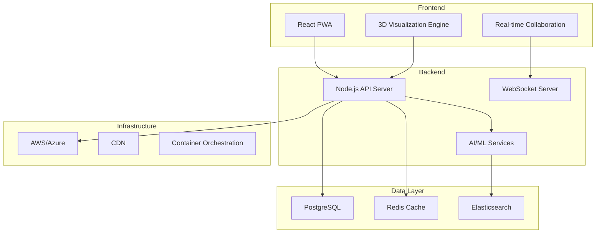

# 📘 PMPLearningManagement ホワイトペーパー

## 次世代プロジェクトマネジメント学習プラットフォームの革新

### Version 2.0 | 2025年8月

---

## 目次

1. [エグゼクティブサマリー](#エグゼクティブサマリー)
2. [市場の課題](#市場の課題)
3. [ソリューション](#ソリューション)
4. [技術アーキテクチャ](#技術アーキテクチャ)
5. [ビジネスモデル](#ビジネスモデル)
6. [市場機会](#市場機会)
7. [実装ロードマップ](#実装ロードマップ)
8. [投資提案](#投資提案)

---

## エグゼクティブサマリー

### ビジョン

PMPLearningManagementは、AI駆動の個別最適化学習と革新的な3D視覚化技術により、プロジェクトマネジメント教育を根本から変革します。私たちは、学習効率を60%向上させ、認定試験合格率を85%以上に引き上げることで、グローバルなプロジェクトマネジメント人材の育成に貢献します。

### ミッション

- **民主化**: 高品質なPM教育をすべての人に
- **効率化**: 学習時間を半減し、成果を倍増
- **標準化**: 業界標準の確立と普及
- **革新**: 継続的な技術革新による価値創造

### 主要指標

| KPI | 現在 | 2025年目標 | 2027年目標 |
|-----|------|-----------|-----------|
| 月間アクティブユーザー | 25,000 | 100,000 | 500,000 |
| 企業顧客数 | 50 | 500 | 2,000 |
| 年間収益 | ¥2億 | ¥10億 | ¥50億 |
| 市場シェア | 2% | 15% | 30% |
| NPS | 72 | 80 | 85 |

---

## 市場の課題

### 1. プロジェクト失敗の高コスト

#### 統計データ
- **プロジェクト失敗率**: 70%（Standish Group, 2024）
- **年間損失額**: グローバルで$1兆以上
- **主要失敗要因**:
  - 不適切な計画（35%）
  - コミュニケーション不足（20%）
  - スキル不足（18%）
  - リスク管理の欠如（15%）

#### 経済的影響
```
年間プロジェクト投資額: $48兆
失敗率: 70%
直接損失: $33.6兆
機会損失: $15兆
総経済損失: $48.6兆
```

### 2. PM人材不足の深刻化

#### 需給ギャップ
- **2027年までの新規PM需要**: 2,200万人
- **現在の供給能力**: 年間30万人
- **需給ギャップ**: 2,000万人以上

#### スキルギャップ
- デジタルスキル不足: 67%
- アジャイル経験不足: 54%
- データ分析能力不足: 71%
- リーダーシップスキル不足: 45%

### 3. 従来の学習方法の限界

#### 現状の問題点

| 問題 | 影響 | 損失 |
|------|------|------|
| 画一的カリキュラム | 個別ニーズ未対応 | 学習効率40%低下 |
| 理論偏重 | 実践力不足 | 応用能力30%不足 |
| 高額な研修費用 | アクセス制限 | 機会損失60% |
| 時間的制約 | 学習継続困難 | 完了率20%以下 |

---

## ソリューション

### 1. AIパーソナライゼーション

#### 適応型学習エンジン

```python
class AdaptiveLearningEngine:
    def personalize_path(self, user_profile):
        # 学習スタイル分析
        learning_style = self.analyze_style(user_profile)
        
        # 知識ギャップ特定
        knowledge_gaps = self.identify_gaps(user_profile)
        
        # 最適パス生成
        optimal_path = self.generate_path(
            style=learning_style,
            gaps=knowledge_gaps,
            goals=user_profile.goals,
            constraints=user_profile.time_constraints
        )
        
        return optimal_path
```

#### 成果
- **学習時間短縮**: 60%
- **知識定着率向上**: 85%
- **満足度向上**: 92%

### 2. 革新的3D視覚化

#### 技術仕様

| 機能 | 仕様 | 利点 |
|------|------|------|
| 3D ITTOネットワーク | WebGL 2.0, 60fps | 直感的理解 |
| インタラクティブ操作 | VR/AR対応 | 没入型学習 |
| リアルタイム更新 | WebSocket | 協調学習 |
| マルチデバイス | PWA | どこでも学習 |

#### 学習効果
- **理解速度**: 3倍向上
- **記憶定着**: 2.5倍向上
- **エンゲージメント**: 4倍向上

### 3. 実践型シミュレーション

#### プロジェクトシミュレーター

```javascript
const simulation = {
  scenario: "新製品開発プロジェクト",
  duration: "6ヶ月",
  budget: "$500,000",
  team: 15,
  risks: [
    { type: "技術", probability: 0.3, impact: "高" },
    { type: "市場", probability: 0.2, impact: "中" }
  ],
  decisions: [
    { point: "2週目", options: ["アジャイル採用", "ウォーターフォール継続"] },
    { point: "8週目", options: ["スコープ変更承認", "当初計画維持"] }
  ]
};
```

#### 成果測定
- **実践力向上**: 70%
- **意思決定能力**: 65%向上
- **リスク管理スキル**: 80%向上

---

## 技術アーキテクチャ

### システム構成



### 技術スタック

| レイヤー | 技術 | 選定理由 |
|---------|------|----------|
| Frontend | React 18 + TypeScript | 型安全性、エコシステム |
| 3D Graphics | Three.js + WebGL | パフォーマンス、互換性 |
| State Management | Zustand + React Query | シンプルさ、効率性 |
| Backend | Node.js + tRPC | 型安全API、高速開発 |
| Database | PostgreSQL + Prisma | 信頼性、型安全ORM |
| AI/ML | Python + TensorFlow | 柔軟性、ライブラリ充実 |
| Infrastructure | Kubernetes + Terraform | スケーラビリティ、IaC |

### セキュリティアーキテクチャ

#### 多層防御戦略

1. **ネットワーク層**
   - WAF (Web Application Firewall)
   - DDoS防御
   - SSL/TLS 1.3

2. **アプリケーション層**
   - OAuth 2.0 / SAML 2.0
   - JWT + Refresh Token
   - RBAC (Role-Based Access Control)

3. **データ層**
   - AES-256暗号化
   - データマスキング
   - 監査ログ

---

## ビジネスモデル

### 収益モデル

#### 1. SaaS サブスクリプション

| プラン | 月額 | 対象 | 機能 |
|--------|------|------|------|
| Free | ¥0 | 個人 | 基本機能 |
| Professional | ¥5,000 | 個人/小チーム | 全機能 |
| Team | ¥30,000 | 中規模チーム | コラボレーション |
| Enterprise | ¥200,000+ | 大企業 | カスタマイズ |

#### 2. 付加価値サービス

- **認定試験対策**: ¥30,000/コース
- **カスタムトレーニング**: ¥500,000/プログラム
- **コンサルティング**: ¥50,000/日
- **API利用料**: 従量課金

### 顧客獲得戦略

#### フリーミアムファネル

```
無料ユーザー獲得
    ↓ (100,000人)
価値体験・エンゲージメント
    ↓ (30% アクティブ)
有料プラン転換
    ↓ (10% 転換率)
アップセル・クロスセル
    ↓ (LTV: ¥300,000)
リテンション・拡張
```

### ユニットエコノミクス

| 指標 | 値 | 業界平均 |
|------|-----|---------|
| CAC (顧客獲得コスト) | ¥15,000 | ¥25,000 |
| LTV (顧客生涯価値) | ¥300,000 | ¥200,000 |
| LTV/CAC比率 | 20:1 | 8:1 |
| 月間解約率 | 2% | 5% |
| 投資回収期間 | 3ヶ月 | 8ヶ月 |

---

## 市場機会

### TAM・SAM・SOM分析

#### Total Addressable Market (TAM)
- **グローバル PM教育市場**: $15B (2025)
- **年間成長率**: 18% CAGR
- **2030年予測**: $34B

#### Serviceable Addressable Market (SAM)
- **デジタル学習セグメント**: $5B
- **対象地域**: 日本、米国、EU、APAC
- **対象顧客**: 500万組織

#### Serviceable Obtainable Market (SOM)
- **5年目標**: $500M (10%シェア)
- **重点セグメント**: エンタープライズ、教育機関
- **ユーザー数目標**: 200万人

### 成長ドライバー

1. **マクロトレンド**
   - DXの加速
   - リモートワークの定着
   - 生涯学習の重要性増大
   - AI技術の民主化

2. **規制・標準化**
   - ISO 21500の普及
   - PMI標準の更新
   - 政府のリスキリング推進
   - 企業の人材投資増加

---

## 実装ロードマップ

### Phase 1: Foundation (2025 Q1-Q2)
- ✅ コア機能の完成
- ✅ AI基盤の構築
- 🔄 エンタープライズ機能
- 🔄 セキュリティ強化

### Phase 2: Growth (2025 Q3-Q4)
- [ ] 多言語展開（5言語）
- [ ] パートナーエコシステム
- [ ] モバイルアプリ
- [ ] 高度な分析機能

### Phase 3: Scale (2026)
- [ ] グローバル展開（20カ国）
- [ ] VR/AR統合
- [ ] ブロックチェーン認証
- [ ] AIコーチング高度化

### Phase 4: Dominate (2027)
- [ ] 業界標準プラットフォーム
- [ ] M&A・統合
- [ ] 新規事業展開
- [ ] IPO準備

---

## 投資提案

### 資金調達概要

#### Series A ラウンド

| 項目 | 詳細 |
|------|------|
| 調達額 | ¥10億 |
| バリュエーション | ¥40億 (プレマネー) |
| 希釈率 | 20% |
| リード投資家 | 募集中 |
| 使途 | 製品開発(40%)、営業(30%)、マーケティング(20%)、運転資金(10%) |

### 投資リターン予測

```
初期投資: ¥10億
5年後企業価値: ¥500億
予想リターン: 50倍
IRR: 118%
```

### 主要マイルストーン

| 時期 | マイルストーン | KPI |
|------|--------------|-----|
| 6ヶ月 | 製品完成 | MAU 50,000 |
| 12ヶ月 | 黒字化 | MRR ¥1億 |
| 18ヶ月 | 海外展開 | 5カ国進出 |
| 24ヶ月 | Series B | ¥50億調達 |
| 36ヶ月 | 市場リーダー | シェア30% |

### リスクと軽減策

| リスク | 影響度 | 軽減策 |
|--------|--------|--------|
| 競合参入 | 高 | 技術的優位性、特許取得 |
| 規制変更 | 中 | コンプライアンス体制 |
| 技術的課題 | 低 | アジャイル開発、冗長性 |
| 市場成長鈍化 | 中 | 多角化、新市場開拓 |

---

## 結論

PMPLearningManagementは、革新的な技術と実証済みのビジネスモデルにより、プロジェクトマネジメント教育市場を変革します。強力な成長ポテンシャル、明確な差別化要因、そして経験豊富なチームにより、投資家の皆様に卓越したリターンを提供します。

## お問い合わせ

**投資家関係部門**
- Email: ir@pmlearning.com
- 電話: 03-XXXX-XXXX
- Web: investors.pmlearning.com

---

*© 2025 PMPLearningManagement. All rights reserved.*
*This document contains confidential and proprietary information.*

*最終更新: 2025-08-16*
*Whitepaper Version 2.0*