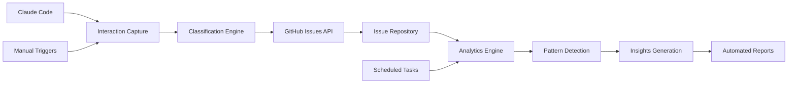

# Claude Code Interaction Logging Architecture

## 🏗️ System Architecture

### Core Components



### Data Models

#### Interaction Schema
```typescript
interface ClaudeInteraction {
  id: string;
  timestamp: Date;
  sessionId: string;
  
  // Input
  userRequest: string;
  context: {
    repository: string;
    branch: string;
    workingDirectory: string;
    relatedFiles: string[];
  };
  
  // Processing
  claudeAnalysis: string;
  decisionRationale: string;
  toolsUsed: string[];
  
  // Output
  implementation: {
    filesModified: string[];
    linesChanged: number;
    codeSnippets: Array<{
      file: string;
      language: string;
      content: string;
    }>;
  };
  
  // Metadata
  classification: {
    type: InteractionType;
    priority: Priority;
    domain: Domain;
    complexity: Complexity;
  };
  
  outcomes: {
    success: boolean;
    warnings: string[];
    followUpNeeded: string[];
  };
  
  metrics: {
    processingTime: number;
    tokensUsed: number;
    confidence: number;
  };
}

enum InteractionType {
  FeatureImplementation = 'feature-implementation',
  BugFix = 'bug-fix',
  Refactoring = 'refactoring',
  ArchitectureDecision = 'architecture-decision',
  PerformanceOptimization = 'performance-optimization',
  DocumentationUpdate = 'documentation-update',
  Testing = 'testing',
  ConfigurationChange = 'configuration-change',
  DiscussionAnalysis = 'discussion-analysis'
}

enum Priority {
  Critical = 'critical',
  High = 'high',
  Medium = 'medium',
  Low = 'low',
  Info = 'info'
}
```

### Integration Points

#### 1. GitHub Issues API Integration
```yaml
Endpoint: POST /repos/{owner}/{repo}/issues
Authentication: GitHub Token
Rate Limits: 5000 requests/hour
Payload: Structured interaction data
```

#### 2. GitHub Actions Workflows
```yaml
Triggers:
  - Manual dispatch (immediate logging)
  - Scheduled runs (batch processing)
  - Repository events (contextual logging)

Permissions Required:
  - issues: write
  - contents: read
  - actions: read
```

#### 3. Analysis Pipeline
```yaml
Data Sources:
  - GitHub Issues (labeled with 'claude-code')
  - Repository commits
  - Pull request metadata
  - Action execution logs

Processing Steps:
  1. Data extraction and normalization
  2. Pattern recognition and clustering
  3. Trend analysis and forecasting
  4. Insight generation and ranking
  5. Report compilation and distribution
```

## 🔧 Implementation Strategy

### Phase 1: Foundation (Weeks 1-2)
- ✅ Issue template creation
- ✅ Basic workflow setup
- ✅ Manual logging capability
- ⏳ Classification system implementation

### Phase 2: Automation (Weeks 3-4)
- ⏳ Intelligent filtering
- ⏳ Automated categorization
- ⏳ Duplicate detection
- ⏳ Context enrichment

### Phase 3: Intelligence (Weeks 5-6)
- ⏳ Pattern analysis engine
- ⏳ Predictive insights
- ⏳ Recommendation system
- ⏳ Performance metrics

### Phase 4: Optimization (Weeks 7-8)
- ⏳ Noise reduction algorithms
- ⏳ Smart summarization
- ⏳ Cross-project learning
- ⏳ API rate optimization

## 📊 Quality Assurance

### Data Quality Metrics
- **Completeness**: All required fields populated
- **Accuracy**: Classification confidence > 80%
- **Relevance**: Signal-to-noise ratio > 3:1
- **Timeliness**: Capture within 5 minutes of interaction

### Performance Benchmarks
- **Response Time**: < 30 seconds for issue creation
- **Storage Efficiency**: < 1MB per interaction record
- **Search Performance**: < 2 seconds for full-text search
- **Analysis Speed**: Complete weekly analysis in < 5 minutes

### Error Handling
```typescript
interface ErrorHandling {
  fallbackMechanisms: {
    apiFailure: 'Queue for retry';
    rateLimits: 'Exponential backoff';
    dataCorruption: 'Validation and sanitization';
    networkIssues: 'Offline queueing';
  };
  
  monitoring: {
    healthChecks: 'Every 15 minutes';
    alertThresholds: {
      errorRate: '> 5%';
      responseTime: '> 60 seconds';
      queueLength: '> 100 items';
    };
  };
  
  recovery: {
    automaticRetry: 'Up to 3 attempts';
    manualIntervention: 'On persistent failures';
    dataRecovery: 'From backup snapshots';
  };
}
```

## 🔮 Future Enhancements

### Machine Learning Integration
- Automatic priority prediction
- Context-aware categorization
- Anomaly detection in development patterns
- Smart recommendation engine

### Multi-Repository Support
- Cross-project pattern analysis
- Shared knowledge base
- Template propagation
- Organizational insights

### Advanced Visualization
- Interactive timeline views
- Dependency mapping
- Impact assessment graphs
- Trend prediction charts

### Integration Ecosystem
- IDE plugins for real-time logging
- Slack/Discord notifications
- Email digest subscriptions
- Mobile dashboard app

---

*This architecture document is maintained automatically and updated with each system evolution.*