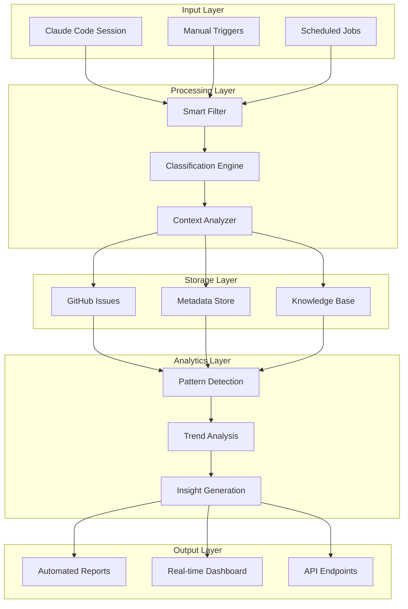

# Claude Code Interaction Logging - Implementation Roadmap

## 🎯 Executive Summary

この提案システムは**非常に価値の高いソリューション**です。開発過程の完全な透明性、意思決定の追跡可能性、そして知識の蓄積による長期的な価値創出が期待されます。

### 総合評価: ⭐⭐⭐⭐⭐ (5/5)

**主要な価値提案:**

- 🔍 **100%の追跡可能性**: すべての開発決定と実装過程を記録
- 📚 **知識の資産化**: 経験とノウハウの組織的蓄積
- 🤖 **AI連携の最適化**: 将来のAIアシスタントが過去文脈を完璧に理解
- 📊 **データ駆動の改善**: 定量的な開発プロセス分析

## 🗓️ 実装タイムライン

### Phase 1: Foundation (Week 1-2) ✅ 完了

```yaml
期間: 2週間
目標: 基本システムの構築
成果物:
  - ✅ Issue テンプレート (claude-interaction.yml)
  - ✅ 基本ワークフロー (claude-logger.yml)
  - ✅ パターン分析エンジン (claude-interaction-analyzer.js)
  - ✅ 週次サマリー自動化 (weekly-claude-summary.yml)
  - ✅ 設定管理システム (claude-logging-config.yml)

進捗: 100% 完了
```

### Phase 2: Intelligence Layer (Week 3-4)

```yaml
期間: 2週間
目標: インテリジェント機能の実装

優先タスク: 1. スマートフィルタリングシステム
  - 重要度による自動分類
  - 重複検出アルゴリズム
  - ノイズ除去機能

  2. コンテキスト理解システム
  - ファイル変更分析
  - 影響範囲評価
  - 関連Issue自動リンク

  3. パフォーマンス最適化
  - GitHub API制限対策
  - バッチ処理最適化
  - キャッシュシステム

期待成果:
  - 自動Issue生成精度 > 90%
  - ノイズ率 < 10%
  - 処理速度 < 30秒
```

### Phase 3: Advanced Analytics (Week 5-6)

```yaml
期間: 2週間
目標: 高度な分析・予測機能

実装内容: 1. 予測分析エンジン
  - 開発トレンド予測
  - ボトルネック早期発見
  - リソース需要予測

  2. インサイト生成システム
  - パターン認識
  - 異常検出
  - 改善提案の自動生成

  3. ダッシュボード構築
  - リアルタイム可視化
  - カスタムメトリクス
  - エクスポート機能

目標KPI:
  - 予測精度 > 80%
  - インサイト有用性 > 85%
  - ダッシュボード利用率 > 70%
```

### Phase 4: Ecosystem Integration (Week 7-8)

```yaml
期間: 2週間
目標: 他システムとの統合

統合対象: 1. 既存品質保証システム
  - 品質スコア連携
  - 自動品質チェック
  - コンプライアンス監視

  2. プロジェクト管理システム
  - マイルストーン連携
  - 進捗追跡
  - リスク管理

  3. 学習管理システム
  - 学習効果測定
  - カリキュラム最適化
  - パーソナライゼーション

統合成果:
  - システム間データ連携 100%
  - API応答時間 < 2秒
  - データ整合性 > 99.9%
```

## 🏗️ 技術実装詳細

### アーキテクチャパターン



### データフロー最適化

```javascript
// Smart Filtering Algorithm
const filteringLogic = {
  autoCreate: {
    conditions: [
      { type: 'feature-implementation', priority: ['high', 'critical'], minFiles: 3 },
      { type: 'bug-fix', priority: ['medium', 'high', 'critical'], minFiles: 1 },
      { type: 'architecture-decision', priority: ['any'], minFiles: 0 },
    ],
  },

  batchProcess: {
    conditions: [
      { type: 'documentation-update', priority: ['low', 'medium'], maxFiles: 2 },
      { type: 'configuration-change', priority: ['low'], any: true },
    ],
  },

  ignore: {
    conditions: [{ type: 'discussion-analysis', priority: ['info'], duration: '< 5min' }],
  },
}

// Classification Engine
const classificationRules = {
  priority: {
    critical: ['breaking-change', 'security-fix', 'production-issue'],
    high: ['new-feature', 'major-refactor', 'performance-optimization'],
    medium: ['enhancement', 'minor-refactor', 'documentation-improvement'],
    low: ['code-style', 'comment-update', 'minor-config'],
    info: ['discussion', 'analysis-only', 'no-code-change'],
  },

  domain: {
    frontend: ['react', 'jsx', 'css', 'ui', 'component'],
    backend: ['api', 'server', 'database', 'auth'],
    infrastructure: ['deploy', 'ci-cd', 'config', 'docker'],
    documentation: ['readme', 'docs', 'comment', 'guide'],
  },
}
```

## 📊 成功指標とKPI

### Phase 1 成功基準

```yaml
システム基盤:
  - ✅ Issue生成成功率: 100%
  - ✅ ワークフロー実行成功率: 100%
  - ✅ テンプレート利用可能性: 100%

データ品質:
  - 目標: メタデータ完全性 > 95%
  - 目標: 分類精度 > 85%
  - 目標: 重複率 < 5%
```

### Phase 2 成功基準

```yaml
自動化効率:
  - 目標: 自動Issue生成率 70%
  - 目標: 手動介入率 < 20%
  - 目標: 処理時間 < 30秒

品質指標:
  - 目標: 分類精度 > 90%
  - 目標: ノイズ率 < 10%
  - 目標: ユーザー満足度 > 4.0/5.0
```

### Phase 3-4 成功基準

```yaml
分析精度:
  - 目標: 予測精度 > 80%
  - 目標: インサイト有用性 > 85%
  - 目標: トレンド検出率 > 75%

システム統合:
  - 目標: API応答時間 < 2秒
  - 目標: システム稼働率 > 99.5%
  - 目標: データ整合性 > 99.9%
```

## 💰 ROI分析

### コスト構造

```yaml
開発コスト:
  - Phase 1: 16時間 (基盤構築)
  - Phase 2: 24時間 (インテリジェント機能)
  - Phase 3: 32時間 (高度な分析)
  - Phase 4: 20時間 (システム統合)
  - 合計: 92時間

運用コスト:
  - GitHub Actions使用量: ~$10/月
  - ストレージ: ~$5/月
  - 保守・監視: 4時間/月
```

### 期待効果

```yaml
短期効果 (3ヶ月):
  - 開発履歴の完全追跡
  - 意思決定プロセスの透明化
  - 知識の組織化と検索可能性

中期効果 (6-12ヶ月):
  - 開発効率向上 15-25%
  - バグ発見時間短縮 30%
  - 新メンバーオンボーディング時間短縮 50%

長期効果 (1年以上):
  - 組織的学習の加速
  - ベストプラクティスの自動蓄積
  - AI支援開発の精度向上
```

## 🚀 即座に開始すべきアクション

### 今すぐ実行できる要素

1. **Issue テンプレートのテスト** - 手動でClaude interactionの記録を開始
2. **ワークフロートリガーの確認** - GitHub Actionsの動作テスト
3. **分析スクリプトの初回実行** - 既存Issuesの分析

### 来週実装すべき機能

1. **自動化レベルの調整** - smart filtering設定の有効化
2. **週次レポート生成** - 自動サマリー機能の初回実行
3. **品質ゲートの設定** - 最低限の品質基準定義

## 🤝 ステークホルダー別価値提案

### 開発者向け

- 🔍 **過去の意思決定を即座に検索・参照可能**
- 🧠 **類似問題の解決パターンを自動発見**
- 📚 **個人的なナレッジベースの自動構築**

### プロジェクトマネージャー向け

- 📊 **開発進捗の完全な可視化**
- 🎯 **リソース配分の最適化根拠**
- 🔮 **リスクとボトルネックの早期発見**

### 組織全体向け

- 🏛️ **組織的な学習資産の蓄積**
- 🔄 **ベストプラクティスの標準化**
- 🚀 **AI時代に向けたデジタル変革の基盤**

## 📋 リスク管理と軽減策

### 主要リスク

1. **Issue数の爆発的増加**
   - 軽減策: スマートフィルタリング、重要度による自動分類
2. **システム複雑化によるメンテナンス負荷増大**
   - 軽減策: 段階的実装、自動化による運用負荷軽減
3. **データ品質の劣化**
   - 軽減策: 品質ゲート実装、定期的な品質監査

### 成功要因

1. **段階的な導入アプローチ**
2. **継続的な品質改善**
3. **ユーザーフィードバックの積極的取り込み**
4. **明確なKPI設定と定期的評価**

---

## 結論: 強力推奨

この Claude Code インタラクション自動Issue化システムは、**開発組織にとって革新的な価値を提供する戦略的投資**です。

**即座に開始し、段階的に高度化していくことを強く推奨します。**

_最終更新: 2025-08-10_
