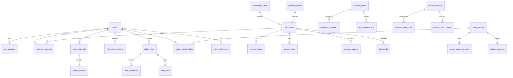
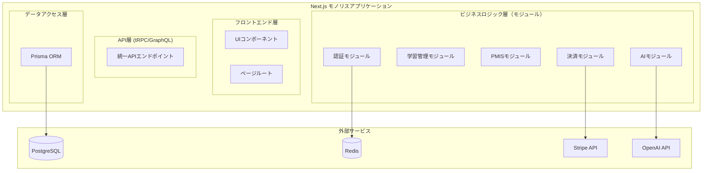

# Architecture Documentation

<!-- Consolidated on: 2025-08-09T15:12:24.881Z -->
<!-- Source files: UI_DESIGN_SPECIFICATION.md, DATABASE_DESIGN.md, MODULAR_ARCHITECTURE_DESIGN.md, SYSTEM_ARCHITECTURE_PLAN.md -->

## Table of Contents

1. [UI DESIGN SPECIFICATION](#ui-design-specification)
2. [DATABASE DESIGN](#database-design)
3. [MODULAR ARCHITECTURE DESIGN](#modular-architecture-design)
4. [SYSTEM ARCHITECTURE PLAN](#system-architecture-plan)

---

## UI DESIGN SPECIFICATION

_Source: `UI_DESIGN_SPECIFICATION.md`_

## Next.js 14 + TypeScript + Shadcn/ui 移行版

---

## 📋 目次

1. [プロジェクト概要](#プロジェクト概要)
2. [デザインシステム](#デザインシステム)
3. [コンポーネントライブラリ](#コンポーネントライブラリ)
4. [レイアウト設計](#レイアウト設計)
5. [画面設計](#画面設計)
6. [既存コンポーネント移行計画](#既存コンポーネント移行計画)
7. [新規画面詳細設計](#新規画面詳細設計)
8. [インタラクション設計](#インタラクション設計)
9. [アクセシビリティ](#アクセシビリティ)
10. [パフォーマンス最適化](#パフォーマンス最適化)
11. [モバイル/PWA対応](#モバイルpwa対応)
12. [ダークモード設計](#ダークモード設計)
13. [国際化（i18n）](#国際化i18n)
14. [フォーム設計](#フォーム設計)
15. [データ視覚化](#データ視覚化)
16. [テスト戦略](#テスト戦略)

---

## 🎯 プロジェクト概要

### 現状分析

- **既存実装**: React 18 + Vite + Tailwind CSS
- **コンポーネント数**: 30+（実装済み）
- **主要機能**: PMBOKマトリックス、D3.js視覚化、学習機能
- **移行対象**: Next.js 14 App Router + TypeScript

### 移行目標

- **Phase 1 (MVP - 3ヶ月)**: 認証・決済・基本機能移行
- **Phase 2 (4-6ヶ月)**: AI機能・コラボレーション・分析機能
- **技術スタック**: Next.js 14 + TypeScript + Shadcn/ui + Zustand

---

## 🎨 デザインシステム

### デザイン原則

#### 1. 継続性（Continuity）

既存ユーザーの学習体験を中断させない一貫したデザイン

#### 2. 効率性（Efficiency）

情報密度と可読性のバランスを重視した効率的なUI

#### 3. アクセシビリティ（Accessibility）

WCAG 2.1 AA準拠の包括的なユーザビリティ

#### 4. 拡張性（Scalability）

将来的な機能追加に柔軟に対応できる設計

### カラーパレット

```typescript
// colors.ts
export const colors = {
  // Primary Colors
  primary: {
    50: '#eff6ff',
    100: '#dbeafe',
    200: '#bfdbfe',
    300: '#93c5fd',
    400: '#60a5fa',
    500: '#3b82f6', // メインプライマリ
    600: '#2563eb',
    700: '#1d4ed8',
    800: '#1e40af',
    900: '#1e3a8a',
    950: '#172554',
  },

  // Semantic Colors
  semantic: {
    success: {
      light: '#10b981',
      main: '#059669',
      dark: '#047857',
    },
    warning: {
      light: '#f59e0b',
      main: '#d97706',
      dark: '#b45309',
    },
    error: {
      light: '#ef4444',
      main: '#dc2626',
      dark: '#b91c1c',
    },
    info: {
      light: '#06b6d4',
      main: '#0891b2',
      dark: '#0e7490',
    },
  },

  // Neutral Colors
  neutral: {
    50: '#f8fafc',
    100: '#f1f5f9',
    200: '#e2e8f0',
    300: '#cbd5e1',
    400: '#94a3b8',
    500: '#64748b',
    600: '#475569',
    700: '#334155',
    800: '#1e293b',
    900: '#0f172a',
    950: '#020617',
  },

  // Dark Mode Colors
  dark: {
    background: '#0a0a0a',
    surface: '#111111',
    card: '#1a1a1a',
    border: '#262626',
    input: '#171717',
    primary: '#3b82f6',
    secondary: '#64748b',
    muted: '#525252',
    accent: '#8b5cf6',
    destructive: '#ef4444',
  },
} as const
```

### タイポグラフィ

```typescript
// typography.ts
export const typography = {
  fontFamily: {
    sans: ['Inter', 'Noto Sans JP', 'system-ui', 'sans-serif'],
    mono: ['JetBrains Mono', 'Consolas', 'monospace'],
    display: ['Cal Sans', 'Inter', 'system-ui', 'sans-serif'],
  },

  fontSize: {
    xs: ['0.75rem', { lineHeight: '1rem' }],
    sm: ['0.875rem', { lineHeight: '1.25rem' }],
    base: ['1rem', { lineHeight: '1.5rem' }],
    lg: ['1.125rem', { lineHeight: '1.75rem' }],
    xl: ['1.25rem', { lineHeight: '1.75rem' }],
    '2xl': ['1.5rem', { lineHeight: '2rem' }],
    '3xl': ['1.875rem', { lineHeight: '2.25rem' }],
    '4xl': ['2.25rem', { lineHeight: '2.5rem' }],
    '5xl': ['3rem', { lineHeight: '1' }],
    '6xl': ['3.75rem', { lineHeight: '1' }],
  },

  fontWeight: {
    light: '300',
    normal: '400',
    medium: '500',
    semibold: '600',
    bold: '700',
    extrabold: '800',
  },
} as const
```

### スペーシングシステム

```typescript
// spacing.ts
export const spacing = {
  0: '0px',
  1: '0.25rem', // 4px
  2: '0.5rem', // 8px
  3: '0.75rem', // 12px
  4: '1rem', // 16px
  5: '1.25rem', // 20px
  6: '1.5rem', // 24px
  8: '2rem', // 32px
  10: '2.5rem', // 40px
  12: '3rem', // 48px
  16: '4rem', // 64px
  20: '5rem', // 80px
  24: '6rem', // 96px
  32: '8rem', // 128px
  40: '10rem', // 160px
  48: '12rem', // 192px
  56: '14rem', // 224px
  64: '16rem', // 256px
} as const
```

### グリッドシステム

```typescript
// grid.ts
export const grid = {
  container: {
    center: true,
    padding: '1rem',
    screens: {
      sm: '640px',
      md: '768px',
      lg: '1024px',
      xl: '1280px',
      '2xl': '1400px',
    },
  },

  columns: 12,

  breakpoints: {
    xs: '0px',
    sm: '640px',
    md: '768px',
    lg: '1024px',
    xl: '1280px',
    '2xl': '1536px',
  },
} as const
```

### ブレークポイント戦略

```scss
// Mobile First Approach
.responsive-component {
  // Mobile (xs): 0-639px
  @apply p-4 text-sm;

  // Tablet (sm): 640px+
  @screen sm {
    @apply p-6 text-base;
  }

  // Desktop (md): 768px+
  @screen md {
    @apply p-8 text-lg;
  }

  // Large Desktop (lg): 1024px+
  @screen lg {
    @apply p-10 text-xl;
  }

  // Extra Large (xl): 1280px+
  @screen xl {
    @apply p-12 text-2xl;
  }
}
```

---

## 🧩 コンポーネントライブラリ

### 基本コンポーネント

#### Button

```tsx
// components/ui/Button.tsx
import { cn } from '@/lib/utils'
import { cva, type VariantProps } from 'class-variance-authority'
import { Slot } from '@radix-ui/react-slot'

const buttonVariants = cva(
  'inline-flex items-center justify-center whitespace-nowrap rounded-md text-sm font-medium ring-offset-background transition-colors focus-visible:outline-none focus-visible:ring-2 focus-visible:ring-ring focus-visible:ring-offset-2 disabled:pointer-events-none disabled:opacity-50',
  {
    variants: {
      variant: {
        default: 'bg-primary text-primary-foreground hover:bg-primary/90',
        destructive: 'bg-destructive text-destructive-foreground hover:bg-destructive/90',
        outline: 'border border-input bg-background hover:bg-accent hover:text-accent-foreground',
        secondary: 'bg-secondary text-secondary-foreground hover:bg-secondary/80',
        ghost: 'hover:bg-accent hover:text-accent-foreground',
        link: 'text-primary underline-offset-4 hover:underline',
      },
      size: {
        default: 'h-10 px-4 py-2',
        sm: 'h-9 rounded-md px-3',
        lg: 'h-11 rounded-md px-8',
        icon: 'h-10 w-10',
      },
    },
    defaultVariants: {
      variant: 'default',
      size: 'default',
    },
  }
)

export interface ButtonProps
  extends React.ButtonHTMLAttributes<HTMLButtonElement>,
    VariantProps<typeof buttonVariants> {
  asChild?: boolean
}

const Button = React.forwardRef<HTMLButtonElement, ButtonProps>(
  ({ className, variant, size, asChild = false, ...props }, ref) => {
    const Comp = asChild ? Slot : 'button'
    return (
      <Comp className={cn(buttonVariants({ variant, size, className }))} ref={ref} {...props} />
    )
  }
)

Button.displayName = 'Button'
export { Button, buttonVariants }
```

#### Input

```tsx
// components/ui/Input.tsx
import { cn } from '@/lib/utils'

export interface InputProps extends React.InputHTMLAttributes<HTMLInputElement> {}

const Input = React.forwardRef<HTMLInputElement, InputProps>(
  ({ className, type, ...props }, ref) => {
    return (
      <input
        type={type}
        className={cn(
          'flex h-10 w-full rounded-md border border-input bg-background px-3 py-2 text-sm ring-offset-background file:border-0 file:bg-transparent file:text-sm file:font-medium placeholder:text-muted-foreground focus-visible:outline-none focus-visible:ring-2 focus-visible:ring-ring focus-visible:ring-offset-2 disabled:cursor-not-allowed disabled:opacity-50',
          className
        )}
        ref={ref}
        {...props}
      />
    )
  }
)

Input.displayName = 'Input'
export { Input }
```

#### Card

```tsx
// components/ui/Card.tsx
import { cn } from '@/lib/utils'

const Card = React.forwardRef<HTMLDivElement, React.HTMLAttributes<HTMLDivElement>>(
  ({ className, ...props }, ref) => (
    <div
      ref={ref}
      className={cn('rounded-lg border bg-card text-card-foreground shadow-sm', className)}
      {...props}
    />
  )
)

const CardHeader = React.forwardRef<HTMLDivElement, React.HTMLAttributes<HTMLDivElement>>(
  ({ className, ...props }, ref) => (
    <div ref={ref} className={cn('flex flex-col space-y-1.5 p-6', className)} {...props} />
  )
)

const CardTitle = React.forwardRef<HTMLParagraphElement, React.HTMLAttributes<HTMLHeadingElement>>(
  ({ className, ...props }, ref) => (
    <h3
      ref={ref}
      className={cn('text-2xl font-semibold leading-none tracking-tight', className)}
      {...props}
    />
  )
)

const CardDescription = React.forwardRef<
  HTMLParagraphElement,
  React.HTMLAttributes<HTMLParagraphElement>
>(({ className, ...props }, ref) => (
  <p ref={ref} className={cn('text-sm text-muted-foreground', className)} {...props} />
))

const CardContent = React.forwardRef<HTMLDivElement, React.HTMLAttributes<HTMLDivElement>>(
  ({ className, ...props }, ref) => (
    <div ref={ref} className={cn('p-6 pt-0', className)} {...props} />
  )
)

const CardFooter = React.forwardRef<HTMLDivElement, React.HTMLAttributes<HTMLDivElement>>(
  ({ className, ...props }, ref) => (
    <div ref={ref} className={cn('flex items-center p-6 pt-0', className)} {...props} />
  )
)

export { Card, CardHeader, CardFooter, CardTitle, CardDescription, CardContent }
```

### 複合コンポーネント

#### Navigation

```tsx
// components/layout/Navigation.tsx
import { useState } from 'react'
import { useRouter } from 'next/navigation'
import { motion } from 'framer-motion'
import { Button } from '@/components/ui/Button'
import { cn } from '@/lib/utils'
import {
  Home,
  Grid,
  Network,
  Layers,
  Sparkles,
  BookOpen,
  TrendingUp,
  Brain,
  GraduationCap,
  Users,
  Database,
  Menu,
  X,
} from 'lucide-react'

interface NavItem {
  href: string
  label: string
  icon: React.ComponentType<{ className?: string }>
  badge?: 'new' | 'beta'
}

const navItems: NavItem[] = [
  { href: '/', label: 'ホーム', icon: Home },
  { href: '/matrix', label: 'マトリックス', icon: Grid },
  { href: '/network', label: 'ネットワーク', icon: Network },
  { href: '/integrated', label: '統合ビュー', icon: Layers },
  { href: '/visualizations', label: 'ビジュアライゼーション', icon: Sparkles, badge: 'new' },
  { href: '/glossary', label: '用語集', icon: BookOpen },
  { href: '/progress', label: '学習進捗', icon: TrendingUp },
  { href: '/flashcards', label: 'フラッシュカード', icon: Brain },
  { href: '/mock-exam', label: '模擬試験', icon: GraduationCap },
  { href: '/collaboration', label: 'コラボレーション', icon: Users, badge: 'beta' },
  { href: '/data', label: 'データ管理', icon: Database },
]

export function Navigation() {
  const [isMobileOpen, setIsMobileOpen] = useState(false)
  const router = useRouter()

  return (
    <nav className="sticky top-0 z-50 w-full border-b bg-background/95 backdrop-blur supports-[backdrop-filter]:bg-background/60">
      <div className="container flex h-14 items-center">
        {/* Logo */}
        <div className="mr-4 hidden md:flex">
          <a className="mr-6 flex items-center space-x-2" href="/">
            <span className="hidden font-bold sm:inline-block">PMBOK学習システム</span>
          </a>
        </div>

        {/* Desktop Navigation */}
        <div className="hidden md:flex md:flex-1 md:items-center md:justify-between">
          <nav className="flex items-center space-x-1">
            {navItems.map((item) => (
              <Button
                key={item.href}
                variant="ghost"
                size="sm"
                className="relative h-9 px-3"
                onClick={() => router.push(item.href)}
              >
                <item.icon className="mr-2 h-4 w-4" />
                {item.label}
                {item.badge && (
                  <span className="absolute -right-1 -top-1 flex h-4 w-4">
                    <span className="absolute inline-flex h-full w-full animate-ping rounded-full bg-red-400 opacity-75"></span>
                    <span className="relative inline-flex h-4 w-4 items-center justify-center rounded-full bg-red-500 text-xs text-white">
                      {item.badge === 'new' ? 'N' : 'β'}
                    </span>
                  </span>
                )}
              </Button>
            ))}
          </nav>
        </div>

        {/* Mobile Menu Button */}
        <div className="flex md:hidden">
          <Button variant="ghost" size="icon" onClick={() => setIsMobileOpen(!isMobileOpen)}>
            {isMobileOpen ? <X className="h-5 w-5" /> : <Menu className="h-5 w-5" />}
          </Button>
        </div>
      </div>

      {/* Mobile Navigation */}
      {isMobileOpen && (
        <motion.div
          initial={{ opacity: 0, height: 0 }}
          animate={{ opacity: 1, height: 'auto' }}
          exit={{ opacity: 0, height: 0 }}
          className="border-t bg-background md:hidden"
        >
          <div className="container py-2">
            {navItems.map((item) => (
              <Button
                key={item.href}
                variant="ghost"
                size="sm"
                className="w-full justify-start"
                onClick={() => {
                  router.push(item.href)
                  setIsMobileOpen(false)
                }}
              >
                <item.icon className="mr-2 h-4 w-4" />
                {item.label}
                {item.badge && (
                  <span className="ml-auto rounded bg-red-500 px-1.5 py-0.5 text-xs text-white">
                    {item.badge.toUpperCase()}
                  </span>
                )}
              </Button>
            ))}
          </div>
        </motion.div>
      )}
    </nav>
  )
}
```

### 特殊コンポーネント

#### DataVisualization

```tsx
// components/visualization/DataVisualization.tsx
import React, { useEffect, useRef, useMemo } from 'react'
import * as d3 from 'd3'
import { Card, CardContent, CardHeader, CardTitle } from '@/components/ui/Card'
import { Button } from '@/components/ui/Button'
import { Download, ZoomIn, ZoomOut, RotateCcw } from 'lucide-react'

interface DataPoint {
  id: string
  name: string
  value: number
  category: string
  connections?: string[]
}

interface DataVisualizationProps {
  data: DataPoint[]
  type: 'network' | 'heatmap' | 'sankey' | 'matrix'
  width?: number
  height?: number
  interactive?: boolean
  exportable?: boolean
  className?: string
}

export function DataVisualization({
  data,
  type,
  width = 800,
  height = 600,
  interactive = true,
  exportable = true,
  className,
}: DataVisualizationProps) {
  const svgRef = useRef<SVGSVGElement>(null)
  const [zoom, setZoom] = useState(1)

  const processedData = useMemo(() => {
    // データの前処理
    return data.map((d) => ({
      ...d,
      x: Math.random() * width,
      y: Math.random() * height,
    }))
  }, [data, width, height])

  useEffect(() => {
    if (!svgRef.current) return

    const svg = d3.select(svgRef.current)
    svg.selectAll('*').remove()

    // 可視化の実装
    switch (type) {
      case 'network':
        renderNetworkGraph(svg, processedData, width, height)
        break
      case 'heatmap':
        renderHeatmap(svg, processedData, width, height)
        break
      case 'matrix':
        renderMatrix(svg, processedData, width, height)
        break
      default:
        break
    }
  }, [processedData, type, width, height, zoom])

  const handleExport = () => {
    if (!svgRef.current) return

    const svgData = new XMLSerializer().serializeToString(svgRef.current)
    const canvas = document.createElement('canvas')
    const ctx = canvas.getContext('2d')
    const img = new Image()

    img.onload = () => {
      canvas.width = width
      canvas.height = height
      ctx?.drawImage(img, 0, 0)

      const link = document.createElement('a')
      link.download = `visualization-${Date.now()}.png`
      link.href = canvas.toDataURL()
      link.click()
    }

    img.src = 'data:image/svg+xml;base64,' + btoa(svgData)
  }

  return (
    <Card className={className}>
      <CardHeader className="flex flex-row items-center justify-between">
        <CardTitle>データ視覚化</CardTitle>
        {exportable && (
          <div className="flex gap-2">
            <Button
              variant="outline"
              size="sm"
              onClick={() => setZoom((z) => Math.max(0.1, z - 0.1))}
            >
              <ZoomOut className="h-4 w-4" />
            </Button>
            <Button
              variant="outline"
              size="sm"
              onClick={() => setZoom((z) => Math.min(3, z + 0.1))}
            >
              <ZoomIn className="h-4 w-4" />
            </Button>
            <Button variant="outline" size="sm" onClick={() => setZoom(1)}>
              <RotateCcw className="h-4 w-4" />
            </Button>
            <Button variant="outline" size="sm" onClick={handleExport}>
              <Download className="h-4 w-4" />
            </Button>
          </div>
        )}
      </CardHeader>
      <CardContent>
        <div className="relative overflow-hidden rounded-lg border">
          <svg
            ref={svgRef}
            width={width}
            height={height}
            style={{ transform: `scale(${zoom})`, transformOrigin: 'top left' }}
            className="bg-background"
          />
        </div>
      </CardContent>
    </Card>
  )
}

// ヘルパー関数
function renderNetworkGraph(svg: any, data: any[], width: number, height: number) {
  // D3.js ネットワークグラフの実装
  const simulation = d3
    .forceSimulation(data)
    .force(
      'link',
      d3.forceLink().id((d: any) => d.id)
    )
    .force('charge', d3.forceManyBody().strength(-300))
    .force('center', d3.forceCenter(width / 2, height / 2))

  // ノードの描画
  svg
    .selectAll('circle')
    .data(data)
    .enter()
    .append('circle')
    .attr('r', 8)
    .attr('fill', '#3b82f6')
    .call(d3.drag().on('start', dragstarted).on('drag', dragged).on('end', dragended))

  // ラベルの描画
  svg
    .selectAll('text')
    .data(data)
    .enter()
    .append('text')
    .text((d: any) => d.name)
    .attr('font-size', 12)
    .attr('text-anchor', 'middle')

  simulation.on('tick', () => {
    svg
      .selectAll('circle')
      .attr('cx', (d: any) => d.x)
      .attr('cy', (d: any) => d.y)

    svg
      .selectAll('text')
      .attr('x', (d: any) => d.x)
      .attr('y', (d: any) => d.y + 4)
  })

  function dragstarted(event: any) {
    if (!event.active) simulation.alphaTarget(0.3).restart()
    event.subject.fx = event.subject.x
    event.subject.fy = event.subject.y
  }

  function dragged(event: any) {
    event.subject.fx = event.x
    event.subject.fy = event.y
  }

  function dragended(event: any) {
    if (!event.active) simulation.alphaTarget(0)
    event.subject.fx = null
    event.subject.fy = null
  }
}

function renderHeatmap(svg: any, data: any[], width: number, height: number) {
  // ヒートマップの実装
  const colorScale = d3
    .scaleSequential(d3.interpolateBlues)
    .domain(d3.extent(data, (d: any) => d.value))

  // グリッドの計算
  const gridSize = Math.ceil(Math.sqrt(data.length))
  const cellSize = Math.min(width, height) / gridSize

  svg
    .selectAll('rect')
    .data(data)
    .enter()
    .append('rect')
    .attr('x', (d: any, i: number) => (i % gridSize) * cellSize)
    .attr('y', (d: any, i: number) => Math.floor(i / gridSize) * cellSize)
    .attr('width', cellSize - 1)
    .attr('height', cellSize - 1)
    .attr('fill', (d: any) => colorScale(d.value))
    .on('mouseover', function (event: any, d: any) {
      // ツールチップ表示
      d3.select(this).attr('stroke', '#000').attr('stroke-width', 2)
    })
    .on('mouseout', function () {
      d3.select(this).attr('stroke', null)
    })
}

function renderMatrix(svg: any, data: any[], width: number, height: number) {
  // マトリックス視覚化の実装
  // PMBOKマトリックス用の特別な実装
}
```

---

## 🎯 レイアウト設計

### アプリケーションシェル

```tsx
// app/layout.tsx
import { Inter, Noto_Sans_JP } from 'next/font/google'
import { ThemeProvider } from '@/components/providers/ThemeProvider'
import { Navigation } from '@/components/layout/Navigation'
import { Toaster } from '@/components/ui/Toaster'
import './globals.css'

const inter = Inter({ subsets: ['latin'], variable: '--font-inter' })
const notoSansJP = Noto_Sans_JP({ subsets: ['latin'], variable: '--font-noto-sans-jp' })

export default function RootLayout({ children }: { children: React.ReactNode }) {
  return (
    <html lang="ja" suppressHydrationWarning>
      <body className={`${inter.variable} ${notoSansJP.variable} font-sans`}>
        <ThemeProvider attribute="class" defaultTheme="system" enableSystem>
          <div className="relative flex min-h-screen flex-col">
            <Navigation />
            <main className="flex-1">{children}</main>
            <footer className="border-t py-6 md:px-8 md:py-0">
              <div className="container flex flex-col items-center justify-between gap-4 md:h-24 md:flex-row">
                <p className="text-center text-sm leading-loose text-muted-foreground md:text-left">
                  © 2024 PMBOK学習システム. All rights reserved.
                </p>
              </div>
            </footer>
          </div>
          <Toaster />
        </ThemeProvider>
      </body>
    </html>
  )
}
```

### ナビゲーション構造

```typescript
// types/navigation.ts
export interface NavigationItem {
  title: string
  href: string
  icon?: React.ComponentType<{ className?: string }>
  badge?: 'new' | 'beta' | 'pro'
  children?: NavigationItem[]
  requiresAuth?: boolean
  requiresPro?: boolean
}

export const navigationConfig: NavigationItem[] = [
  {
    title: 'ダッシュボード',
    href: '/dashboard',
    icon: Home,
    requiresAuth: true,
  },
  {
    title: '学習',
    href: '/learning',
    icon: BookOpen,
    children: [
      {
        title: 'PMBOKマトリックス',
        href: '/learning/matrix',
        icon: Grid,
      },
      {
        title: 'ネットワーク図',
        href: '/learning/network',
        icon: Network,
      },
      {
        title: 'フラッシュカード',
        href: '/learning/flashcards',
        icon: Brain,
      },
    ],
  },
  {
    title: '試験対策',
    href: '/exam',
    icon: GraduationCap,
    children: [
      {
        title: '模擬試験',
        href: '/exam/mock',
        icon: FileText,
      },
      {
        title: '問題集',
        href: '/exam/questions',
        icon: HelpCircle,
      },
    ],
  },
  {
    title: '分析',
    href: '/analytics',
    icon: BarChart3,
    badge: 'pro',
    requiresPro: true,
  },
  {
    title: 'コラボレーション',
    href: '/collaboration',
    icon: Users,
    badge: 'beta',
  },
]
```

### レスポンシブ戦略

```scss
// globals.css
@tailwind base;
@tailwind components;
@tailwind utilities;

@layer base {
  :root {
    --background: 0 0% 100%;
    --foreground: 222.2 84% 4.9%;
    --card: 0 0% 100%;
    --card-foreground: 222.2 84% 4.9%;
    --popover: 0 0% 100%;
    --popover-foreground: 222.2 84% 4.9%;
    --primary: 221.2 83.2% 53.3%;
    --primary-foreground: 210 40% 98%;
    --secondary: 210 40% 96%;
    --secondary-foreground: 222.2 84% 4.9%;
    --muted: 210 40% 96%;
    --muted-foreground: 215.4 16.3% 46.9%;
    --accent: 210 40% 96%;
    --accent-foreground: 222.2 84% 4.9%;
    --destructive: 0 84.2% 60.2%;
    --destructive-foreground: 210 40% 98%;
    --border: 214.3 31.8% 91.4%;
    --input: 214.3 31.8% 91.4%;
    --ring: 221.2 83.2% 53.3%;
    --radius: 0.5rem;
  }

  .dark {
    --background: 222.2 84% 4.9%;
    --foreground: 210 40% 98%;
    --card: 222.2 84% 4.9%;
    --card-foreground: 210 40% 98%;
    --popover: 222.2 84% 4.9%;
    --popover-foreground: 210 40% 98%;
    --primary: 217.2 91.2% 59.8%;
    --primary-foreground: 222.2 84% 4.9%;
    --secondary: 217.2 32.6% 17.5%;
    --secondary-foreground: 210 40% 98%;
    --muted: 217.2 32.6% 17.5%;
    --muted-foreground: 215 20.2% 65.1%;
    --accent: 217.2 32.6% 17.5%;
    --accent-foreground: 210 40% 98%;
    --destructive: 0 62.8% 30.6%;
    --destructive-foreground: 210 40% 98%;
    --border: 217.2 32.6% 17.5%;
    --input: 217.2 32.6% 17.5%;
    --ring: 224.3 76.3% 94.1%;
  }
}

@layer utilities {
  /* Responsive Typography */
  .text-responsive-xs {
    @apply text-xs sm:text-sm;
  }
  .text-responsive-sm {
    @apply text-sm sm:text-base;
  }
  .text-responsive-base {
    @apply text-base sm:text-lg;
  }
  .text-responsive-lg {
    @apply text-lg sm:text-xl;
  }
  .text-responsive-xl {
    @apply text-xl sm:text-2xl;
  }

  /* Responsive Spacing */
  .p-responsive {
    @apply p-4 sm:p-6 lg:p-8;
  }
  .px-responsive {
    @apply px-4 sm:px-6 lg:px-8;
  }
  .py-responsive {
    @apply py-4 sm:py-6 lg:py-8;
  }

  /* Layout Utilities */
  .container-responsive {
    @apply container mx-auto max-w-7xl px-4 sm:px-6 lg:px-8;
  }

  /* Mobile-First Grid */
  .grid-responsive {
    @apply grid grid-cols-1 gap-4 sm:grid-cols-2 lg:grid-cols-3 xl:grid-cols-4;
  }
}
```

---

## 📱 画面設計

### 画面一覧とフロー

```typescript
// types/pages.ts
export interface PageConfig {
  path: string
  title: string
  description: string
  layout: 'default' | 'auth' | 'minimal' | 'dashboard'
  requiresAuth?: boolean
  requiresPro?: boolean
  metadata: {
    title: string
    description: string
    keywords?: string[]
  }
}

export const pageConfigs: PageConfig[] = [
  // パブリックページ
  {
    path: '/',
    title: 'ホーム',
    description: 'PMBOK学習システムのメインページ',
    layout: 'default',
    metadata: {
      title: 'PMBOK学習システム - 効率的なプロジェクトマネジメント学習',
      description: 'PMBOKガイドの包括的な学習プラットフォーム',
    },
  },

  // 認証ページ
  {
    path: '/auth/signin',
    title: 'ログイン',
    description: 'アカウントにログイン',
    layout: 'auth',
    metadata: {
      title: 'ログイン - PMBOK学習システム',
      description: 'アカウントにログインして学習を開始',
    },
  },
  {
    path: '/auth/signup',
    title: 'アカウント作成',
    description: '新規アカウントを作成',
    layout: 'auth',
    metadata: {
      title: 'アカウント作成 - PMBOK学習システム',
      description: '無料アカウントを作成して学習を始める',
    },
  },

  // 学習ページ
  {
    path: '/dashboard',
    title: 'ダッシュボード',
    description: '学習の進捗と統計',
    layout: 'dashboard',
    requiresAuth: true,
    metadata: {
      title: 'ダッシュボード - PMBOK学習システム',
      description: '学習進捗と成果を確認',
    },
  },
  {
    path: '/learning/matrix',
    title: 'PMBOKマトリックス',
    description: '49のプロセスをマトリックス表示',
    layout: 'default',
    requiresAuth: true,
    metadata: {
      title: 'PMBOKマトリックス - PMBOK学習システム',
      description: '知識エリアとプロセス群の対話型マトリックス',
    },
  },

  // プレミアム機能
  {
    path: '/analytics',
    title: '詳細分析',
    description: '学習データの詳細分析',
    layout: 'dashboard',
    requiresAuth: true,
    requiresPro: true,
    metadata: {
      title: '詳細分析 - PMBOK学習システム Pro',
      description: 'AIによる学習分析とレコメンデーション',
    },
  },
]
```

### ワイヤーフレーム設計

#### ダッシュボードページ

```tsx
// app/dashboard/page.tsx
import { Suspense } from 'react'
import { DashboardStats } from '@/components/dashboard/DashboardStats'
import { LearningProgress } from '@/components/dashboard/LearningProgress'
import { RecentActivity } from '@/components/dashboard/RecentActivity'
import { QuickActions } from '@/components/dashboard/QuickActions'
import { UpcomingExams } from '@/components/dashboard/UpcomingExams'
import { LoadingSpinner } from '@/components/ui/LoadingSpinner'

export default function DashboardPage() {
  return (
    <div className="container-responsive py-8">
      <div className="mb-8">
        <h1 className="text-3xl font-bold">ダッシュボード</h1>
        <p className="mt-2 text-muted-foreground">学習の進捗と成果を確認しましょう</p>
      </div>

      {/* 統計カード */}
      <div className="mb-8 grid grid-cols-1 gap-6 md:grid-cols-2 lg:grid-cols-4">
        <Suspense fallback={<LoadingSpinner />}>
          <DashboardStats />
        </Suspense>
      </div>

      <div className="grid grid-cols-1 gap-8 lg:grid-cols-3">
        {/* メインコンテンツ */}
        <div className="space-y-6 lg:col-span-2">
          <Suspense fallback={<LoadingSpinner />}>
            <LearningProgress />
          </Suspense>
          <Suspense fallback={<LoadingSpinner />}>
            <RecentActivity />
          </Suspense>
        </div>

        {/* サイドバー */}
        <div className="space-y-6">
          <Suspense fallback={<LoadingSpinner />}>
            <QuickActions />
          </Suspense>
          <Suspense fallback={<LoadingSpinner />}>
            <UpcomingExams />
          </Suspense>
        </div>
      </div>
    </div>
  )
}
```

#### 学習ページテンプレート

```tsx
// components/layout/LearningLayout.tsx
import { useState } from 'react'
import { Button } from '@/components/ui/Button'
import { Card } from '@/components/ui/Card'
import { Progress } from '@/components/ui/Progress'
import { Sidebar } from '@/components/layout/Sidebar'
import { ChevronLeft, ChevronRight, BookmarkPlus } from 'lucide-react'

interface LearningLayoutProps {
  title: string
  currentStep: number
  totalSteps: number
  children: React.ReactNode
  onNext?: () => void
  onPrevious?: () => void
  onBookmark?: () => void
  sidebar?: React.ReactNode
}

export function LearningLayout({
  title,
  currentStep,
  totalSteps,
  children,
  onNext,
  onPrevious,
  onBookmark,
  sidebar,
}: LearningLayoutProps) {
  const [sidebarOpen, setSidebarOpen] = useState(false)
  const progress = (currentStep / totalSteps) * 100

  return (
    <div className="flex h-screen bg-background">
      {/* サイドバー */}
      {sidebar && (
        <Sidebar open={sidebarOpen} onOpenChange={setSidebarOpen}>
          {sidebar}
        </Sidebar>
      )}

      {/* メインコンテンツ */}
      <div className="flex flex-1 flex-col">
        {/* ヘッダー */}
        <header className="border-b px-6 py-4">
          <div className="flex items-center justify-between">
            <div>
              <h1 className="text-2xl font-semibold">{title}</h1>
              <p className="text-sm text-muted-foreground">
                ステップ {currentStep} / {totalSteps}
              </p>
            </div>
            <div className="flex items-center gap-2">
              <Button variant="outline" size="sm" onClick={onBookmark}>
                <BookmarkPlus className="h-4 w-4" />
              </Button>
            </div>
          </div>

          {/* プログレスバー */}
          <div className="mt-4">
            <Progress value={progress} className="h-2" />
          </div>
        </header>

        {/* コンテンツエリア */}
        <main className="flex-1 overflow-auto p-6">{children}</main>

        {/* フッター */}
        <footer className="border-t px-6 py-4">
          <div className="flex justify-between">
            <Button variant="outline" onClick={onPrevious} disabled={currentStep === 1}>
              <ChevronLeft className="mr-2 h-4 w-4" />
              前へ
            </Button>
            <Button onClick={onNext} disabled={currentStep === totalSteps}>
              次へ
              <ChevronRight className="ml-2 h-4 w-4" />
            </Button>
          </div>
        </footer>
      </div>
    </div>
  )
}
```

---

## 🔄 既存コンポーネント移行計画

### Phase 1: 基盤コンポーネント（1ヶ月）

#### 優先度 High - 即座移行

1. **Navigation.jsx** → `components/layout/Navigation.tsx`
   - Shadcn/ui Button, DropdownMenuに移行
   - TypeScript型定義追加
   - Framer Motionアニメーション統合

2. **ThemeContext.jsx** → `providers/ThemeProvider.tsx`
   - next-themes統合
   - Zustand状態管理に移行
   - カスタマイズパネル機能統合

3. **Home.jsx** → `app/page.tsx`
   - App Routerレイアウト適用
   - Hero Section, Feature Cards分割
   - SEOメタデータ追加

#### 移行戦略

```tsx
// 移行例: Navigation.jsx → Navigation.tsx
// Before: React Router + 直接的なstate管理
const Navigation = () => {
  const [isMobileMenuOpen, setIsMobileMenuOpen] = React.useState(false);
  const location = useLocation();

// After: Next.js + TypeScript + Shadcn/ui
interface NavigationProps {
  user?: User;
  pathname?: string;
}

export function Navigation({ user, pathname }: NavigationProps) {
  const [isMobileOpen, setIsMobileOpen] = useState(false);
  const { theme, setTheme } = useTheme();
```

### Phase 2: 学習機能コンポーネント（2-3ヶ月）

#### 優先度 High - 機能保持必須

1. **PMBOKMatrix.jsx** → `components/learning/PMBOKMatrix.tsx`

   ```typescript
   // 移行内容
   interface PMBOKProcess {
     id: string
     name: string
     knowledgeArea: KnowledgeArea
     processGroup: ProcessGroup
     inputs: string[]
     tools: string[]
     outputs: string[]
   }

   interface PMBOKMatrixProps {
     processes: PMBOKProcess[]
     selectedProcess?: string
     onProcessSelect: (processId: string) => void
     filterBy?: 'knowledgeArea' | 'processGroup'
     searchQuery?: string
   }
   ```

2. **FlashCardLearning.jsx** → `components/learning/FlashCardLearning.tsx`

   ```typescript
   // Framer Motion + Shadcn/ui統合
   interface FlashCard {
     id: string
     question: string
     answer: string
     difficulty: 'easy' | 'medium' | 'hard'
     category: string
     tags: string[]
   }

   // 3Dフリップアニメーション保持
   const cardVariants = {
     front: { rotateY: 0 },
     back: { rotateY: 180 },
   }
   ```

3. **MockExam.jsx** → `components/exam/MockExam.tsx`

   ```typescript
   // タイマー機能、結果分析機能保持
   interface ExamQuestion {
     id: string
     text: string
     options: string[]
     correctAnswer: number
     explanation: string
     knowledgeArea: string
     difficulty: number
   }

   interface ExamSession {
     id: string
     startTime: Date
     endTime?: Date
     questions: ExamQuestion[]
     answers: Record<string, number>
     timeRemaining: number
     isCompleted: boolean
   }
   ```

### Phase 3: 視覚化コンポーネント（3-4ヶ月）

#### D3.js統合戦略

```typescript
// components/visualization/D3Wrapper.tsx
interface D3WrapperProps<T> {
  data: T[];
  renderFunction: (svg: Selection<SVGSVGElement, unknown, null, undefined>, data: T[]) => void;
  width: number;
  height: number;
  dependencies?: any[];
}

export function D3Wrapper<T>({
  data,
  renderFunction,
  width,
  height,
  dependencies = []
}: D3WrapperProps<T>) {
  const svgRef = useRef<SVGSVGElement>(null);

  useEffect(() => {
    if (!svgRef.current) return;

    const svg = d3.select(svgRef.current);
    svg.selectAll("*").remove();

    renderFunction(svg, data);
  }, [data, renderFunction, width, height, ...dependencies]);

  return (
    <svg
      ref={svgRef}
      width={width}
      height={height}
      className="bg-background border rounded-lg"
    />
  );
}
```

#### 移行対象コンポーネント

1. **ITTOForceGraph.jsx** → `components/visualization/NetworkGraph.tsx`
2. **SankeyDiagram.jsx** → `components/visualization/SankeyChart.tsx`
3. **EnhancedNetworkGraph.jsx** → `components/visualization/EnhancedNetwork.tsx`
4. **ProcessHeatmap.jsx** → `components/visualization/Heatmap.tsx`

### 移行優先順位マトリックス

| コンポーネント | 優先度 | 複雑度    | 依存関係         | 移行期間 |
| -------------- | ------ | --------- | ---------------- | -------- |
| Navigation     | High   | Low       | Theme            | 1週間    |
| ThemeContext   | High   | Medium    | All              | 1週間    |
| PMBOKMatrix    | High   | High      | Data             | 3週間    |
| MockExam       | High   | High      | Timer, Analytics | 4週間    |
| D3 Charts      | Medium | Very High | D3.js, Data      | 6週間    |
| FlashCard      | Medium | Medium    | Animation        | 2週間    |

### リファクタリング方針

#### 1. TypeScript型安全性

```typescript
// Before: prop-types
Navigation.propTypes = {
  isAuthenticated: PropTypes.bool,
  user: PropTypes.object,
}

// After: TypeScript interfaces
interface NavigationProps {
  isAuthenticated: boolean
  user: User | null
}
```

#### 2. 状態管理統合

```typescript
// Before: React Context + useState
const ThemeContext = createContext()

// After: Zustand + TypeScript
interface ThemeState {
  theme: 'light' | 'dark' | 'system'
  primaryColor: string
  fontSize: 'sm' | 'md' | 'lg'
  setTheme: (theme: ThemeState['theme']) => void
  setPrimaryColor: (color: string) => void
}

export const useThemeStore = create<ThemeState>()((set) => ({
  theme: 'system',
  primaryColor: 'blue',
  fontSize: 'md',
  setTheme: (theme) => set({ theme }),
  setPrimaryColor: (primaryColor) => set({ primaryColor }),
}))
```

#### 3. パフォーマンス最適化

```typescript
// メモ化戦略
const PMBOKMatrix = React.memo(function PMBOKMatrix({
  processes,
  selectedProcess,
}: PMBOKMatrixProps) {
  const filteredProcesses = useMemo(
    () => processes.filter(/* フィルタロジック */),
    [processes, filters]
  )

  // 仮想化リスト（大量データ対応）
  const { virtualItems, totalSize } = useVirtualizer({
    count: filteredProcesses.length,
    getScrollElement: () => parentRef.current,
    estimateSize: () => 50,
  })
})
```

---

## 🆕 新規画面詳細設計

### 認証フロー

#### ログイン画面

```tsx
// app/auth/signin/page.tsx
import { useState } from 'react'
import { useRouter } from 'next/navigation'
import { zodResolver } from '@hookform/resolvers/zod'
import { useForm } from 'react-hook-form'
import * as z from 'zod'
import { Button } from '@/components/ui/Button'
import { Input } from '@/components/ui/Input'
import { Label } from '@/components/ui/Label'
import { Card, CardContent, CardDescription, CardHeader, CardTitle } from '@/components/ui/Card'
import { Alert, AlertDescription } from '@/components/ui/Alert'
import { Icons } from '@/components/ui/Icons'

const signinSchema = z.object({
  email: z.string().email('有効なメールアドレスを入力してください'),
  password: z.string().min(8, 'パスワードは8文字以上で入力してください'),
})

type SigninForm = z.infer<typeof signinSchema>

export default function SigninPage() {
  const [isLoading, setIsLoading] = useState(false)
  const [error, setError] = useState<string | null>(null)
  const router = useRouter()

  const form = useForm<SigninForm>({
    resolver: zodResolver(signinSchema),
    defaultValues: {
      email: '',
      password: '',
    },
  })

  const onSubmit = async (data: SigninForm) => {
    setIsLoading(true)
    setError(null)

    try {
      const response = await fetch('/api/auth/signin', {
        method: 'POST',
        headers: { 'Content-Type': 'application/json' },
        body: JSON.stringify(data),
      })

      if (!response.ok) {
        throw new Error('認証に失敗しました')
      }

      router.push('/dashboard')
    } catch (err) {
      setError(err instanceof Error ? err.message : '予期しないエラーが発生しました')
    } finally {
      setIsLoading(false)
    }
  }

  return (
    <div className="container flex h-screen w-screen flex-col items-center justify-center">
      <Card className="mx-auto flex w-full flex-col justify-center space-y-6 sm:w-[350px]">
        <CardHeader className="flex flex-col space-y-2 text-center">
          <Icons.logo className="mx-auto h-6 w-6" />
          <CardTitle className="text-2xl font-semibold tracking-tight">
            アカウントにログイン
          </CardTitle>
          <CardDescription className="text-sm text-muted-foreground">
            メールアドレスとパスワードを入力してください
          </CardDescription>
        </CardHeader>
        <CardContent className="grid gap-6">
          {error && (
            <Alert variant="destructive">
              <AlertDescription>{error}</AlertDescription>
            </Alert>
          )}

          <form onSubmit={form.handleSubmit(onSubmit)}>
            <div className="grid gap-4">
              <div className="grid gap-1">
                <Label htmlFor="email">メールアドレス</Label>
                <Input
                  {...form.register('email')}
                  id="email"
                  placeholder="name@example.com"
                  type="email"
                  autoCapitalize="none"
                  autoComplete="email"
                  autoCorrect="off"
                  disabled={isLoading}
                />
                {form.formState.errors.email && (
                  <p className="px-1 text-xs text-red-600">{form.formState.errors.email.message}</p>
                )}
              </div>
              <div className="grid gap-1">
                <Label htmlFor="password">パスワード</Label>
                <Input
                  {...form.register('password')}
                  id="password"
                  placeholder="パスワード"
                  type="password"
                  autoComplete="current-password"
                  disabled={isLoading}
                />
                {form.formState.errors.password && (
                  <p className="px-1 text-xs text-red-600">
                    {form.formState.errors.password.message}
                  </p>
                )}
              </div>
              <Button disabled={isLoading}>
                {isLoading && <Icons.spinner className="mr-2 h-4 w-4 animate-spin" />}
                ログイン
              </Button>
            </div>
          </form>

          <div className="relative">
            <div className="absolute inset-0 flex items-center">
              <span className="w-full border-t" />
            </div>
            <div className="relative flex justify-center text-xs uppercase">
              <span className="bg-background px-2 text-muted-foreground">または</span>
            </div>
          </div>

          <div className="grid grid-cols-2 gap-4">
            <Button variant="outline" disabled={isLoading}>
              <Icons.google className="mr-2 h-4 w-4" />
              Google
            </Button>
            <Button variant="outline" disabled={isLoading}>
              <Icons.github className="mr-2 h-4 w-4" />
              GitHub
            </Button>
          </div>
        </CardContent>
      </Card>
    </div>
  )
}
```

### オンボーディングフロー

```tsx
// components/onboarding/OnboardingWizard.tsx
import { useState } from 'react'
import { motion, AnimatePresence } from 'framer-motion'
import { Button } from '@/components/ui/Button'
import { Progress } from '@/components/ui/Progress'
import { Card, CardContent, CardDescription, CardHeader, CardTitle } from '@/components/ui/Card'
import { ChevronLeft, ChevronRight } from 'lucide-react'

interface OnboardingStep {
  id: string
  title: string
  description: string
  component: React.ComponentType<OnboardingStepProps>
}

interface OnboardingStepProps {
  onNext: () => void
  onSkip?: () => void
  data: Record<string, any>
  updateData: (data: Record<string, any>) => void
}

const onboardingSteps: OnboardingStep[] = [
  {
    id: 'welcome',
    title: 'PMBOK学習システムへようこそ',
    description: '効率的な学習のための初期設定を行いましょう',
    component: WelcomeStep,
  },
  {
    id: 'profile',
    title: 'プロフィール設定',
    description: 'あなたの学習目標と経験レベルを教えてください',
    component: ProfileStep,
  },
  {
    id: 'preferences',
    title: '学習設定',
    description: '学習スタイルと通知設定をカスタマイズしましょう',
    component: PreferencesStep,
  },
  {
    id: 'goals',
    title: '学習目標設定',
    description: 'PMP試験に向けた学習計画を立てましょう',
    component: GoalsStep,
  },
  {
    id: 'completion',
    title: '設定完了',
    description: '準備が完了しました。学習を始めましょう！',
    component: CompletionStep,
  },
]

export function OnboardingWizard() {
  const [currentStep, setCurrentStep] = useState(0)
  const [onboardingData, setOnboardingData] = useState({})

  const progress = ((currentStep + 1) / onboardingSteps.length) * 100
  const step = onboardingSteps[currentStep]

  const handleNext = () => {
    if (currentStep < onboardingSteps.length - 1) {
      setCurrentStep((prev) => prev + 1)
    }
  }

  const handlePrevious = () => {
    if (currentStep > 0) {
      setCurrentStep((prev) => prev - 1)
    }
  }

  const updateData = (data: Record<string, any>) => {
    setOnboardingData((prev) => ({ ...prev, ...data }))
  }

  return (
    <div className="flex min-h-screen items-center justify-center bg-background p-4">
      <Card className="w-full max-w-2xl">
        <CardHeader>
          <div className="mb-4 flex items-center justify-between">
            <div className="text-sm text-muted-foreground">
              ステップ {currentStep + 1} / {onboardingSteps.length}
            </div>
            <div className="text-sm text-muted-foreground">{Math.round(progress)}% 完了</div>
          </div>
          <Progress value={progress} className="mb-6" />
          <CardTitle className="text-2xl">{step.title}</CardTitle>
          <CardDescription>{step.description}</CardDescription>
        </CardHeader>

        <CardContent>
          <AnimatePresence mode="wait">
            <motion.div
              key={step.id}
              initial={{ opacity: 0, x: 20 }}
              animate={{ opacity: 1, x: 0 }}
              exit={{ opacity: 0, x: -20 }}
              transition={{ duration: 0.3 }}
            >
              <step.component onNext={handleNext} data={onboardingData} updateData={updateData} />
            </motion.div>
          </AnimatePresence>

          <div className="mt-8 flex justify-between">
            <Button variant="outline" onClick={handlePrevious} disabled={currentStep === 0}>
              <ChevronLeft className="mr-2 h-4 w-4" />
              戻る
            </Button>

            {currentStep === onboardingSteps.length - 1 ? (
              <Button onClick={() => (window.location.href = '/dashboard')}>学習を始める</Button>
            ) : (
              <Button onClick={handleNext}>
                次へ
                <ChevronRight className="ml-2 h-4 w-4" />
              </Button>
            )}
          </div>
        </CardContent>
      </Card>
    </div>
  )
}

// オンボーディングステップコンポーネントの例
function ProfileStep({ onNext, data, updateData }: OnboardingStepProps) {
  const [profile, setProfile] = useState({
    experience: data.experience || '',
    goal: data.goal || '',
    studyTime: data.studyTime || '',
  })

  const handleSubmit = () => {
    updateData(profile)
    onNext()
  }

  return (
    <div className="space-y-6">
      <div>
        <Label htmlFor="experience">プロジェクトマネジメント経験</Label>
        <Select
          value={profile.experience}
          onValueChange={(value) => setProfile((prev) => ({ ...prev, experience: value }))}
        >
          <SelectTrigger>
            <SelectValue placeholder="経験レベルを選択" />
          </SelectTrigger>
          <SelectContent>
            <SelectItem value="beginner">初心者（0-2年）</SelectItem>
            <SelectItem value="intermediate">中級者（3-5年）</SelectItem>
            <SelectItem value="advanced">上級者（6年以上）</SelectItem>
          </SelectContent>
        </Select>
      </div>

      <div>
        <Label htmlFor="goal">学習目標</Label>
        <Select
          value={profile.goal}
          onValueChange={(value) => setProfile((prev) => ({ ...prev, goal: value }))}
        >
          <SelectTrigger>
            <SelectValue placeholder="目標を選択" />
          </SelectTrigger>
          <SelectContent>
            <SelectItem value="pmp-exam">PMP試験合格</SelectItem>
            <SelectItem value="knowledge-improvement">知識向上</SelectItem>
            <SelectItem value="career-advancement">キャリアアップ</SelectItem>
          </SelectContent>
        </Select>
      </div>

      <div>
        <Label htmlFor="studyTime">1日の学習時間目安</Label>
        <Select
          value={profile.studyTime}
          onValueChange={(value) => setProfile((prev) => ({ ...prev, studyTime: value }))}
        >
          <SelectTrigger>
            <SelectValue placeholder="学習時間を選択" />
          </SelectTrigger>
          <SelectContent>
            <SelectItem value="30min">30分</SelectItem>
            <SelectItem value="1hour">1時間</SelectItem>
            <SelectItem value="2hours">2時間</SelectItem>
            <SelectItem value="3hours">3時間以上</SelectItem>
          </SelectContent>
        </Select>
      </div>

      <Button
        onClick={handleSubmit}
        className="w-full"
        disabled={!profile.experience || !profile.goal || !profile.studyTime}
      >
        次へ進む
      </Button>
    </div>
  )
}
```

### 決済フロー

```tsx
// components/billing/PricingPlans.tsx
import { useState } from 'react'
import { Check, Star, Zap } from 'lucide-react'
import { Button } from '@/components/ui/Button'
import { Card, CardContent, CardDescription, CardHeader, CardTitle } from '@/components/ui/Card'
import { Badge } from '@/components/ui/Badge'

interface PricingPlan {
  id: string
  name: string
  description: string
  price: {
    monthly: number
    yearly: number
  }
  features: string[]
  popular?: boolean
  cta: string
}

const pricingPlans: PricingPlan[] = [
  {
    id: 'free',
    name: 'フリー',
    description: '基本的な学習機能',
    price: { monthly: 0, yearly: 0 },
    features: [
      'PMBOKマトリックス表示',
      '基本的な用語集',
      'フラッシュカード（制限あり）',
      '学習進捗の基本統計',
      'コミュニティサポート',
    ],
    cta: '無料で始める',
  },
  {
    id: 'pro',
    name: 'プロ',
    description: '本格的な試験対策',
    price: { monthly: 2980, yearly: 29800 },
    features: [
      'すべての学習機能',
      '無制限フラッシュカード',
      '模擬試験（月10回）',
      '詳細な学習分析',
      'エクスポート機能',
      'プライオリティサポート',
    ],
    popular: true,
    cta: 'プロを始める',
  },
  {
    id: 'premium',
    name: 'プレミアム',
    description: 'AI学習アシスタント付き',
    price: { monthly: 4980, yearly: 49800 },
    features: [
      'プロのすべての機能',
      'AI学習アシスタント',
      '無制限模擬試験',
      'パーソナライズされた学習計画',
      'ライブセッション参加',
      '1対1メンタリング（月1回）',
      '優先カスタマーサポート',
    ],
    cta: 'プレミアムを始める',
  },
]

export function PricingPlans() {
  const [billingCycle, setBillingCycle] = useState<'monthly' | 'yearly'>('monthly')

  return (
    <div className="py-12">
      <div className="mb-12 text-center">
        <h2 className="mb-4 text-3xl font-bold">あなたに最適なプランを選択</h2>
        <p className="mb-8 text-lg text-muted-foreground">
          PMP試験合格に向けた最適な学習環境を提供します
        </p>

        {/* 課金周期切り替え */}
        <div className="inline-flex items-center rounded-lg bg-muted p-1">
          <Button
            variant={billingCycle === 'monthly' ? 'default' : 'ghost'}
            size="sm"
            onClick={() => setBillingCycle('monthly')}
          >
            月額
          </Button>
          <Button
            variant={billingCycle === 'yearly' ? 'default' : 'ghost'}
            size="sm"
            onClick={() => setBillingCycle('yearly')}
          >
            年額
            <Badge variant="secondary" className="ml-2">
              17%割引
            </Badge>
          </Button>
        </div>
      </div>

      <div className="mx-auto grid max-w-5xl grid-cols-1 gap-8 md:grid-cols-3">
        {pricingPlans.map((plan) => (
          <Card key={plan.id} className={`relative ${plan.popular ? 'ring-2 ring-primary' : ''}`}>
            {plan.popular && (
              <div className="absolute -top-3 left-1/2 -translate-x-1/2">
                <Badge className="bg-primary px-3 py-1">
                  <Star className="mr-1 h-3 w-3" />
                  人気
                </Badge>
              </div>
            )}

            <CardHeader>
              <CardTitle className="flex items-center gap-2">
                {plan.name}
                {plan.id === 'premium' && <Zap className="h-5 w-5 text-yellow-500" />}
              </CardTitle>
              <CardDescription>{plan.description}</CardDescription>

              <div className="mt-4">
                <span className="text-3xl font-bold">
                  ¥{plan.price[billingCycle].toLocaleString()}
                </span>
                {plan.price[billingCycle] > 0 && (
                  <span className="text-muted-foreground">
                    /{billingCycle === 'monthly' ? '月' : '年'}
                  </span>
                )}
              </div>
            </CardHeader>

            <CardContent>
              <ul className="mb-6 space-y-3">
                {plan.features.map((feature, index) => (
                  <li key={index} className="flex items-center gap-2">
                    <Check className="h-4 w-4 flex-shrink-0 text-green-500" />
                    <span className="text-sm">{feature}</span>
                  </li>
                ))}
              </ul>

              <Button
                className="w-full"
                variant={plan.popular ? 'default' : 'outline'}
                onClick={() => handlePlanSelect(plan.id, billingCycle)}
              >
                {plan.cta}
              </Button>
            </CardContent>
          </Card>
        ))}
      </div>
    </div>
  )
}
```

---

## 🎭 インタラクション設計

### マイクロインタラクション

```tsx
// components/ui/InteractiveButton.tsx
import { motion } from 'framer-motion'
import { Button, ButtonProps } from './Button'

interface InteractiveButtonProps extends ButtonProps {
  haptic?: boolean
  successState?: boolean
  loadingState?: boolean
}

export function InteractiveButton({
  children,
  haptic = true,
  successState = false,
  loadingState = false,
  onClick,
  ...props
}: InteractiveButtonProps) {
  const handleClick = (e: React.MouseEvent<HTMLButtonElement>) => {
    // ハプティックフィードバック
    if (haptic && 'vibrate' in navigator) {
      navigator.vibrate(10)
    }

    // リップル効果
    const button = e.currentTarget
    const ripple = document.createElement('span')
    const rect = button.getBoundingClientRect()
    const size = Math.max(rect.width, rect.height)
    const x = e.clientX - rect.left - size / 2
    const y = e.clientY - rect.top - size / 2

    ripple.style.cssText = `
      position: absolute;
      left: ${x}px;
      top: ${y}px;
      width: ${size}px;
      height: ${size}px;
      border-radius: 50%;
      background: rgba(255, 255, 255, 0.5);
      transform: scale(0);
      animation: ripple 0.6s linear;
      pointer-events: none;
    `

    button.appendChild(ripple)
    setTimeout(() => ripple.remove(), 600)

    onClick?.(e)
  }

  return (
    <motion.div
      whileHover={{ scale: 1.02 }}
      whileTap={{ scale: 0.98 }}
      transition={{ type: 'spring', stiffness: 400, damping: 17 }}
    >
      <Button onClick={handleClick} className="relative overflow-hidden" {...props}>
        <motion.div
          animate={loadingState ? { rotate: 360 } : {}}
          transition={{ duration: 1, repeat: loadingState ? Infinity : 0 }}
        >
          {successState ? (
            <motion.div
              initial={{ scale: 0 }}
              animate={{ scale: 1 }}
              transition={{ type: 'spring', stiffness: 500, damping: 25 }}
            >
              ✓
            </motion.div>
          ) : (
            children
          )}
        </motion.div>
      </Button>
    </motion.div>
  )
}
```

### アニメーション戦略

```typescript
// utils/animations.ts
import { Variants } from 'framer-motion';

export const pageTransition: Variants = {
  initial: { opacity: 0, y: 20 },
  animate: { opacity: 1, y: 0 },
  exit: { opacity: 0, y: -20 },
  transition: { duration: 0.3, ease: "easeInOut" }
};

export const staggerChildren: Variants = {
  animate: {
    transition: {
      staggerChildren: 0.1,
      delayChildren: 0.2
    }
  }
};

export const slideInFromLeft: Variants = {
  initial: { x: -50, opacity: 0 },
  animate: { x: 0, opacity: 1 },
  transition: { duration: 0.5, ease: "easeOut" }
};

export const scaleIn: Variants = {
  initial: { scale: 0.8, opacity: 0 },
  animate: { scale: 1, opacity: 1 },
  transition: { duration: 0.4, ease: "easeOut" }
};

export const cardHover: Variants = {
  hover: {
    y: -5,
    boxShadow: "0 10px 25px rgba(0,0,0,0.1)",
    transition: { duration: 0.2 }
  }
};

// 使用例
export function AnimatedCard({ children }: { children: React.ReactNode }) {
  return (
    <motion.div
      variants={scaleIn}
      whileHover="hover"
      custom={cardHover}
      className="bg-card rounded-lg p-6 shadow-sm"
    >
      {children}
    </motion.div>
  );
}
```

### ローディング状態

```tsx
// components/ui/LoadingStates.tsx
import { motion } from 'framer-motion'
import { Skeleton } from './Skeleton'

// スピナーローディング
export function LoadingSpinner({ size = 'md' }: { size?: 'sm' | 'md' | 'lg' }) {
  const sizeClasses = {
    sm: 'h-4 w-4',
    md: 'h-6 w-6',
    lg: 'h-8 w-8',
  }

  return (
    <motion.div
      animate={{ rotate: 360 }}
      transition={{ duration: 1, repeat: Infinity, ease: 'linear' }}
      className={`rounded-full border-2 border-primary border-t-transparent ${sizeClasses[size]}`}
    />
  )
}

// プログレスローディング
export function ProgressLoader({ progress, label }: { progress: number; label?: string }) {
  return (
    <div className="w-full space-y-2">
      {label && <p className="text-sm text-muted-foreground">{label}</p>}
      <div className="h-2 w-full rounded-full bg-secondary">
        <motion.div
          className="h-2 rounded-full bg-primary"
          initial={{ width: 0 }}
          animate={{ width: `${progress}%` }}
          transition={{ duration: 0.5, ease: 'easeOut' }}
        />
      </div>
      <p className="text-right text-xs text-muted-foreground">{Math.round(progress)}%</p>
    </div>
  )
}

// スケルトンローディング
export function ContentSkeleton() {
  return (
    <div className="space-y-4">
      <Skeleton className="h-8 w-3/4" />
      <div className="space-y-2">
        <Skeleton className="h-4 w-full" />
        <Skeleton className="h-4 w-5/6" />
        <Skeleton className="h-4 w-4/5" />
      </div>
      <div className="flex space-x-2">
        <Skeleton className="h-10 w-20" />
        <Skeleton className="h-10 w-20" />
      </div>
    </div>
  )
}

// データローディング用高次コンポーネント
export function withLoading<T extends object>(
  Component: React.ComponentType<T>,
  LoadingComponent = ContentSkeleton
) {
  return function LoadingWrapper(props: T & { isLoading?: boolean }) {
    const { isLoading, ...componentProps } = props

    if (isLoading) {
      return <LoadingComponent />
    }

    return <Component {...(componentProps as T)} />
  }
}
```

### エラーハンドリング

```tsx
// components/ui/ErrorBoundary.tsx
import React from 'react'
import { AlertTriangle, RefreshCw } from 'lucide-react'
import { Button } from './Button'
import { Card, CardContent, CardDescription, CardHeader, CardTitle } from './Card'

interface ErrorBoundaryState {
  hasError: boolean
  error?: Error
}

export class ErrorBoundary extends React.Component<
  React.PropsWithChildren<{}>,
  ErrorBoundaryState
> {
  constructor(props: React.PropsWithChildren<{}>) {
    super(props)
    this.state = { hasError: false }
  }

  static getDerivedStateFromError(error: Error): ErrorBoundaryState {
    return { hasError: true, error }
  }

  componentDidCatch(error: Error, errorInfo: React.ErrorInfo) {
    console.error('ErrorBoundary caught an error:', error, errorInfo)
    // エラーレポートサービスに送信
    // reportError(error, errorInfo);
  }

  render() {
    if (this.state.hasError) {
      return (
        <Card className="mx-auto mt-8 max-w-md">
          <CardHeader>
            <CardTitle className="flex items-center gap-2 text-destructive">
              <AlertTriangle className="h-5 w-5" />
              エラーが発生しました
            </CardTitle>
            <CardDescription>申し訳ございません。予期しないエラーが発生しました。</CardDescription>
          </CardHeader>
          <CardContent>
            <div className="space-y-4">
              <details className="text-sm text-muted-foreground">
                <summary className="cursor-pointer hover:text-foreground">エラー詳細を表示</summary>
                <pre className="mt-2 overflow-auto rounded bg-muted p-2 text-xs">
                  {this.state.error?.message}
                </pre>
              </details>
              <Button onClick={() => window.location.reload()} className="w-full">
                <RefreshCw className="mr-2 h-4 w-4" />
                ページを再読み込み
              </Button>
            </div>
          </CardContent>
        </Card>
      )
    }

    return this.props.children
  }
}

// エラーフォールバックコンポーネント
export function ErrorFallback({ error, resetError }: { error: Error; resetError: () => void }) {
  return (
    <div className="flex min-h-[400px] items-center justify-center">
      <Card className="max-w-md">
        <CardHeader>
          <CardTitle className="text-destructive">何かが間違っています</CardTitle>
          <CardDescription>{error.message || '予期しないエラーが発生しました'}</CardDescription>
        </CardHeader>
        <CardContent>
          <Button onClick={resetError} variant="outline" className="w-full">
            再試行
          </Button>
        </CardContent>
      </Card>
    </div>
  )
}
```

### トースト通知システム

```tsx
// components/ui/Toast.tsx
import { toast as sonnerToast } from 'sonner'
import { CheckCircle, XCircle, AlertCircle, Info } from 'lucide-react'

export const toast = {
  success: (message: string, description?: string) => {
    sonnerToast.success(message, {
      description,
      icon: <CheckCircle className="h-4 w-4" />,
      duration: 4000,
    })
  },

  error: (message: string, description?: string) => {
    sonnerToast.error(message, {
      description,
      icon: <XCircle className="h-4 w-4" />,
      duration: 6000,
    })
  },

  warning: (message: string, description?: string) => {
    sonnerToast.warning(message, {
      description,
      icon: <AlertCircle className="h-4 w-4" />,
      duration: 5000,
    })
  },

  info: (message: string, description?: string) => {
    sonnerToast.info(message, {
      description,
      icon: <Info className="h-4 w-4" />,
      duration: 4000,
    })
  },

  // カスタムアクション付きトースト
  action: (message: string, actionLabel: string, action: () => void, description?: string) => {
    sonnerToast(message, {
      description,
      action: {
        label: actionLabel,
        onClick: action,
      },
      duration: 8000,
    })
  },

  // プロミス状態に応じたトースト
  promise: <T,>(
    promise: Promise<T>,
    messages: {
      loading: string
      success: string
      error: string
    }
  ) => {
    return sonnerToast.promise(promise, messages)
  },
}

// 使用例
export function useToast() {
  return {
    toast,
    dismiss: sonnerToast.dismiss,
    // バルクアクション用
    showBulkSuccess: (count: number, action: string) => {
      toast.success(`${count}件の${action}が完了しました`, 'すべての操作が正常に実行されました')
    },

    // 学習機能専用
    showLearningProgress: (progress: number) => {
      if (progress === 100) {
        toast.success('学習完了！', '素晴らしい！すべてのセクションを完了しました 🎉')
      } else {
        toast.info(`学習進捗: ${progress}%`, '順調に進んでいます！')
      }
    },

    // 試験関連
    showExamResult: (score: number, passed: boolean) => {
      if (passed) {
        toast.success(`試験合格！スコア: ${score}点`, 'おめでとうございます！🎉')
      } else {
        toast.warning(`試験結果: ${score}点`, '頑張りました！復習して再挑戦しましょう')
      }
    },
  }
}
```

---

このUI設計書は、PMPLearningManagementプロジェクトのNext.js 14への移行と新機能追加のための包括的なガイドとなります。既存資産を最大限活用しながら、モダンなUI/UXを実現する設計となっています。

継続して残りのセクション（アクセシビリティ、パフォーマンス最適化、モバイル/PWA対応、等）も詳細に記述いたしましょうか？

---

## DATABASE DESIGN

_Source: `docs/architecture/DATABASE_DESIGN.md`_

## 1. Database Architecture Overview

### 1.1 Recommended Technology: PostgreSQL

**Justification:**

- **ACID Compliance**: PostgreSQL provides full ACID compliance, crucial for maintaining data integrity in educational records and progress tracking
- **JSON/JSONB Support**: Native support for JSON data types allows flexible storage of ITTO data, exam questions, and dynamic learning content
- **Full-Text Search**: Built-in full-text search capabilities for glossary terms and learning materials
- **Rich Data Types**: Support for arrays, custom types, and complex data structures needed for PMBOK processes
- **Scalability**: Excellent horizontal and vertical scaling capabilities for growing user base
- **Open Source**: Cost-effective with strong community support
- **Extensions**: Support for extensions like pg_trgm for fuzzy search and TimescaleDB for time-series data

### 1.2 Alternative Considerations

| Database               | Pros                                              | Cons                                                  | Use Case                                   |
| ---------------------- | ------------------------------------------------- | ----------------------------------------------------- | ------------------------------------------ |
| **MongoDB**            | Flexible schema, good for varying ITTO structures | Less suitable for relational data, weaker consistency | If PMBOK data structure changes frequently |
| **MySQL**              | Wide adoption, simpler administration             | Limited JSON support, fewer advanced features         | If team has MySQL expertise                |
| **PostgreSQL + Redis** | Redis for caching, sessions, real-time features   | Additional complexity                                 | Recommended for production                 |

### 1.3 Scalability Architecture

```
┌─────────────────────────────────────────────┐
│            Application Layer                 │
│         (React SPA + API Server)            │
└─────────────────────────────────────────────┘
                     │
        ┌────────────┴────────────┐
        │                         │
┌───────▼────────┐      ┌────────▼────────┐
│  Redis Cache   │      │   Connection    │
│   (Sessions,   │      │      Pool       │
│    Hot Data)   │      │   (PgBouncer)   │
└────────────────┘      └─────────────────┘
                               │
                    ┌──────────┴──────────┐
                    │                     │
           ┌────────▼────────┐   ┌───────▼────────┐
           │   Primary DB    │   │  Read Replica  │
           │  (PostgreSQL)   │──▶│  (PostgreSQL)  │
           └─────────────────┘   └────────────────┘
                    │
           ┌────────▼────────┐
           │   Backup DB     │
           │  (Daily/Weekly) │
           └─────────────────┘
```

## 2. Entity-Relationship Diagram



## 3. Detailed Schema Design

### 3.1 User Management Tables

```sql
-- Users table
CREATE TABLE users (
    id UUID PRIMARY KEY DEFAULT gen_random_uuid(),
    email VARCHAR(255) UNIQUE NOT NULL,
    username VARCHAR(50) UNIQUE NOT NULL,
    password_hash VARCHAR(255) NOT NULL,
    full_name VARCHAR(100),
    avatar_url VARCHAR(500),
    role VARCHAR(20) DEFAULT 'student' CHECK (role IN ('student', 'instructor', 'admin')),
    email_verified BOOLEAN DEFAULT FALSE,
    is_active BOOLEAN DEFAULT TRUE,
    last_login_at TIMESTAMP WITH TIME ZONE,
    created_at TIMESTAMP WITH TIME ZONE DEFAULT CURRENT_TIMESTAMP,
    updated_at TIMESTAMP WITH TIME ZONE DEFAULT CURRENT_TIMESTAMP
);

CREATE INDEX idx_users_email ON users(email);
CREATE INDEX idx_users_username ON users(username);
CREATE INDEX idx_users_role ON users(role) WHERE is_active = TRUE;

-- User sessions for authentication
CREATE TABLE user_sessions (
    id UUID PRIMARY KEY DEFAULT gen_random_uuid(),
    user_id UUID NOT NULL REFERENCES users(id) ON DELETE CASCADE,
    token_hash VARCHAR(255) UNIQUE NOT NULL,
    ip_address INET,
    user_agent TEXT,
    expires_at TIMESTAMP WITH TIME ZONE NOT NULL,
    created_at TIMESTAMP WITH TIME ZONE DEFAULT CURRENT_TIMESTAMP
);

CREATE INDEX idx_sessions_user_id ON user_sessions(user_id);
CREATE INDEX idx_sessions_token ON user_sessions(token_hash);
CREATE INDEX idx_sessions_expires ON user_sessions(expires_at) WHERE expires_at > CURRENT_TIMESTAMP;

-- User preferences
CREATE TABLE user_preferences (
    user_id UUID PRIMARY KEY REFERENCES users(id) ON DELETE CASCADE,
    theme VARCHAR(20) DEFAULT 'light',
    language VARCHAR(10) DEFAULT 'ja',
    email_notifications BOOLEAN DEFAULT TRUE,
    study_reminder_time TIME,
    daily_goal_minutes INTEGER DEFAULT 30,
    preferred_visualization VARCHAR(50),
    settings JSONB DEFAULT '{}',
    created_at TIMESTAMP WITH TIME ZONE DEFAULT CURRENT_TIMESTAMP,
    updated_at TIMESTAMP WITH TIME ZONE DEFAULT CURRENT_TIMESTAMP
);
```

### 3.2 PMBOK Process Data Tables

```sql
-- Knowledge areas
CREATE TABLE knowledge_areas (
    id SERIAL PRIMARY KEY,
    code VARCHAR(20) UNIQUE NOT NULL,
    name_en VARCHAR(100) NOT NULL,
    name_ja VARCHAR(100) NOT NULL,
    description TEXT,
    color VARCHAR(7), -- Hex color for UI
    icon_name VARCHAR(50),
    display_order INTEGER NOT NULL,
    created_at TIMESTAMP WITH TIME ZONE DEFAULT CURRENT_TIMESTAMP
);

-- Process groups
CREATE TABLE process_groups (
    id SERIAL PRIMARY KEY,
    code VARCHAR(20) UNIQUE NOT NULL,
    name_en VARCHAR(100) NOT NULL,
    name_ja VARCHAR(100) NOT NULL,
    description TEXT,
    color VARCHAR(7),
    display_order INTEGER NOT NULL,
    created_at TIMESTAMP WITH TIME ZONE DEFAULT CURRENT_TIMESTAMP
);

-- PMBOK processes (49 processes)
CREATE TABLE processes (
    id SERIAL PRIMARY KEY,
    code VARCHAR(50) UNIQUE NOT NULL,
    name_en VARCHAR(200) NOT NULL,
    name_ja VARCHAR(200) NOT NULL,
    description TEXT,
    knowledge_area_id INTEGER NOT NULL REFERENCES knowledge_areas(id),
    process_group_id INTEGER NOT NULL REFERENCES process_groups(id),
    complexity_level INTEGER CHECK (complexity_level BETWEEN 1 AND 5),
    estimated_study_hours DECIMAL(4,2),
    display_order INTEGER,
    metadata JSONB DEFAULT '{}',
    created_at TIMESTAMP WITH TIME ZONE DEFAULT CURRENT_TIMESTAMP,
    updated_at TIMESTAMP WITH TIME ZONE DEFAULT CURRENT_TIMESTAMP
);

CREATE INDEX idx_processes_knowledge_area ON processes(knowledge_area_id);
CREATE INDEX idx_processes_process_group ON processes(process_group_id);
CREATE INDEX idx_processes_complexity ON processes(complexity_level);

-- ITTO: Inputs
CREATE TABLE process_inputs (
    id SERIAL PRIMARY KEY,
    process_id INTEGER NOT NULL REFERENCES processes(id) ON DELETE CASCADE,
    name_en VARCHAR(200) NOT NULL,
    name_ja VARCHAR(200) NOT NULL,
    description TEXT,
    source_process_id INTEGER REFERENCES processes(id),
    is_enterprise_environmental BOOLEAN DEFAULT FALSE,
    is_organizational_process BOOLEAN DEFAULT FALSE,
    display_order INTEGER,
    created_at TIMESTAMP WITH TIME ZONE DEFAULT CURRENT_TIMESTAMP
);

CREATE INDEX idx_inputs_process ON process_inputs(process_id);
CREATE INDEX idx_inputs_source ON process_inputs(source_process_id);

-- ITTO: Tools and Techniques
CREATE TABLE process_tools (
    id SERIAL PRIMARY KEY,
    process_id INTEGER NOT NULL REFERENCES processes(id) ON DELETE CASCADE,
    name_en VARCHAR(200) NOT NULL,
    name_ja VARCHAR(200) NOT NULL,
    description TEXT,
    category VARCHAR(100),
    usage_frequency INTEGER CHECK (usage_frequency BETWEEN 1 AND 5),
    display_order INTEGER,
    created_at TIMESTAMP WITH TIME ZONE DEFAULT CURRENT_TIMESTAMP
);

CREATE INDEX idx_tools_process ON process_tools(process_id);
CREATE INDEX idx_tools_category ON process_tools(category);

-- ITTO: Outputs
CREATE TABLE process_outputs (
    id SERIAL PRIMARY KEY,
    process_id INTEGER NOT NULL REFERENCES processes(id) ON DELETE CASCADE,
    name_en VARCHAR(200) NOT NULL,
    name_ja VARCHAR(200) NOT NULL,
    description TEXT,
    is_deliverable BOOLEAN DEFAULT FALSE,
    is_document BOOLEAN DEFAULT FALSE,
    target_processes INTEGER[], -- Array of process IDs that use this output
    display_order INTEGER,
    created_at TIMESTAMP WITH TIME ZONE DEFAULT CURRENT_TIMESTAMP
);

CREATE INDEX idx_outputs_process ON process_outputs(process_id);
CREATE INDEX idx_outputs_targets ON process_outputs USING GIN(target_processes);
```

### 3.3 Learning Progress Tables

```sql
-- Learning progress tracking
CREATE TABLE learning_progress (
    id UUID PRIMARY KEY DEFAULT gen_random_uuid(),
    user_id UUID NOT NULL REFERENCES users(id) ON DELETE CASCADE,
    process_id INTEGER NOT NULL REFERENCES processes(id),
    status VARCHAR(20) DEFAULT 'not_started'
        CHECK (status IN ('not_started', 'in_progress', 'completed', 'reviewing')),
    understanding_level INTEGER DEFAULT 0 CHECK (understanding_level BETWEEN 0 AND 100),
    study_time_minutes INTEGER DEFAULT 0,
    last_studied_at TIMESTAMP WITH TIME ZONE,
    completed_at TIMESTAMP WITH TIME ZONE,
    notes TEXT,
    review_count INTEGER DEFAULT 0,
    created_at TIMESTAMP WITH TIME ZONE DEFAULT CURRENT_TIMESTAMP,
    updated_at TIMESTAMP WITH TIME ZONE DEFAULT CURRENT_TIMESTAMP,
    UNIQUE(user_id, process_id)
);

CREATE INDEX idx_progress_user ON learning_progress(user_id);
CREATE INDEX idx_progress_process ON learning_progress(process_id);
CREATE INDEX idx_progress_status ON learning_progress(status);
CREATE INDEX idx_progress_last_studied ON learning_progress(last_studied_at DESC);

-- Study sessions tracking
CREATE TABLE study_sessions (
    id UUID PRIMARY KEY DEFAULT gen_random_uuid(),
    user_id UUID NOT NULL REFERENCES users(id) ON DELETE CASCADE,
    session_type VARCHAR(50) NOT NULL, -- 'process', 'flashcard', 'exam', 'reading'
    target_id VARCHAR(100), -- Process ID, exam ID, etc.
    duration_minutes INTEGER NOT NULL,
    items_studied INTEGER,
    items_correct INTEGER,
    performance_score DECIMAL(5,2),
    session_data JSONB DEFAULT '{}',
    started_at TIMESTAMP WITH TIME ZONE NOT NULL,
    ended_at TIMESTAMP WITH TIME ZONE NOT NULL,
    created_at TIMESTAMP WITH TIME ZONE DEFAULT CURRENT_TIMESTAMP
);

CREATE INDEX idx_sessions_user ON study_sessions(user_id);
CREATE INDEX idx_sessions_type ON study_sessions(session_type);
CREATE INDEX idx_sessions_started ON study_sessions(started_at DESC);

-- Learning goals
CREATE TABLE learning_goals (
    id UUID PRIMARY KEY DEFAULT gen_random_uuid(),
    user_id UUID NOT NULL REFERENCES users(id) ON DELETE CASCADE,
    goal_type VARCHAR(50) NOT NULL, -- 'daily', 'weekly', 'exam_date', 'process_completion'
    target_value INTEGER NOT NULL,
    current_value INTEGER DEFAULT 0,
    target_date DATE,
    status VARCHAR(20) DEFAULT 'active' CHECK (status IN ('active', 'completed', 'failed', 'cancelled')),
    created_at TIMESTAMP WITH TIME ZONE DEFAULT CURRENT_TIMESTAMP,
    updated_at TIMESTAMP WITH TIME ZONE DEFAULT CURRENT_TIMESTAMP
);

CREATE INDEX idx_goals_user ON learning_goals(user_id);
CREATE INDEX idx_goals_status ON learning_goals(status);
CREATE INDEX idx_goals_target_date ON learning_goals(target_date);
```

### 3.4 Mock Exam Tables

```sql
-- Question bank
CREATE TABLE exam_questions (
    id SERIAL PRIMARY KEY,
    question_text TEXT NOT NULL,
    question_type VARCHAR(20) NOT NULL CHECK (question_type IN ('single', 'multiple', 'situational')),
    difficulty_level INTEGER CHECK (difficulty_level BETWEEN 1 AND 5),
    knowledge_area_id INTEGER REFERENCES knowledge_areas(id),
    process_group_id INTEGER REFERENCES process_groups(id),
    process_id INTEGER REFERENCES processes(id),
    explanation TEXT,
    references TEXT,
    is_active BOOLEAN DEFAULT TRUE,
    created_by UUID REFERENCES users(id),
    reviewed_by UUID REFERENCES users(id),
    metadata JSONB DEFAULT '{}',
    created_at TIMESTAMP WITH TIME ZONE DEFAULT CURRENT_TIMESTAMP,
    updated_at TIMESTAMP WITH TIME ZONE DEFAULT CURRENT_TIMESTAMP
);

CREATE INDEX idx_questions_difficulty ON exam_questions(difficulty_level);
CREATE INDEX idx_questions_knowledge_area ON exam_questions(knowledge_area_id);
CREATE INDEX idx_questions_process ON exam_questions(process_id);
CREATE INDEX idx_questions_active ON exam_questions(is_active);

-- Question options
CREATE TABLE question_options (
    id SERIAL PRIMARY KEY,
    question_id INTEGER NOT NULL REFERENCES exam_questions(id) ON DELETE CASCADE,
    option_text TEXT NOT NULL,
    is_correct BOOLEAN DEFAULT FALSE,
    explanation TEXT,
    display_order INTEGER NOT NULL,
    created_at TIMESTAMP WITH TIME ZONE DEFAULT CURRENT_TIMESTAMP
);

CREATE INDEX idx_options_question ON question_options(question_id);

-- Exam attempts
CREATE TABLE exam_attempts (
    id UUID PRIMARY KEY DEFAULT gen_random_uuid(),
    user_id UUID NOT NULL REFERENCES users(id) ON DELETE CASCADE,
    exam_type VARCHAR(50) NOT NULL, -- 'full', 'practice', 'knowledge_area', 'custom'
    total_questions INTEGER NOT NULL,
    questions_answered INTEGER DEFAULT 0,
    correct_answers INTEGER DEFAULT 0,
    score DECIMAL(5,2),
    time_limit_minutes INTEGER,
    time_spent_minutes INTEGER,
    status VARCHAR(20) DEFAULT 'in_progress'
        CHECK (status IN ('in_progress', 'completed', 'abandoned', 'timeout')),
    started_at TIMESTAMP WITH TIME ZONE NOT NULL,
    completed_at TIMESTAMP WITH TIME ZONE,
    created_at TIMESTAMP WITH TIME ZONE DEFAULT CURRENT_TIMESTAMP
);

CREATE INDEX idx_attempts_user ON exam_attempts(user_id);
CREATE INDEX idx_attempts_status ON exam_attempts(status);
CREATE INDEX idx_attempts_completed ON exam_attempts(completed_at DESC);

-- Individual answers
CREATE TABLE exam_answers (
    id UUID PRIMARY KEY DEFAULT gen_random_uuid(),
    attempt_id UUID NOT NULL REFERENCES exam_attempts(id) ON DELETE CASCADE,
    question_id INTEGER NOT NULL REFERENCES exam_questions(id),
    selected_options INTEGER[], -- Array of option IDs
    is_correct BOOLEAN,
    is_bookmarked BOOLEAN DEFAULT FALSE,
    time_spent_seconds INTEGER,
    answered_at TIMESTAMP WITH TIME ZONE,
    created_at TIMESTAMP WITH TIME ZONE DEFAULT CURRENT_TIMESTAMP
);

CREATE INDEX idx_answers_attempt ON exam_answers(attempt_id);
CREATE INDEX idx_answers_question ON exam_answers(question_id);
CREATE INDEX idx_answers_bookmarked ON exam_answers(is_bookmarked) WHERE is_bookmarked = TRUE;
```

### 3.5 Flashcard System Tables

```sql
-- Flashcard decks
CREATE TABLE flashcard_decks (
    id UUID PRIMARY KEY DEFAULT gen_random_uuid(),
    name VARCHAR(200) NOT NULL,
    description TEXT,
    deck_type VARCHAR(50) NOT NULL, -- 'itto', 'glossary', 'custom', 'process'
    is_public BOOLEAN DEFAULT FALSE,
    created_by UUID REFERENCES users(id),
    metadata JSONB DEFAULT '{}',
    created_at TIMESTAMP WITH TIME ZONE DEFAULT CURRENT_TIMESTAMP,
    updated_at TIMESTAMP WITH TIME ZONE DEFAULT CURRENT_TIMESTAMP
);

CREATE INDEX idx_decks_type ON flashcard_decks(deck_type);
CREATE INDEX idx_decks_public ON flashcard_decks(is_public);
CREATE INDEX idx_decks_creator ON flashcard_decks(created_by);

-- Individual flashcards
CREATE TABLE flashcards (
    id UUID PRIMARY KEY DEFAULT gen_random_uuid(),
    deck_id UUID REFERENCES flashcard_decks(id) ON DELETE CASCADE,
    process_id INTEGER REFERENCES processes(id),
    front_text TEXT NOT NULL,
    back_text TEXT NOT NULL,
    hint TEXT,
    difficulty_level INTEGER DEFAULT 3 CHECK (difficulty_level BETWEEN 1 AND 5),
    tags TEXT[],
    created_at TIMESTAMP WITH TIME ZONE DEFAULT CURRENT_TIMESTAMP
);

CREATE INDEX idx_flashcards_deck ON flashcards(deck_id);
CREATE INDEX idx_flashcards_process ON flashcards(process_id);
CREATE INDEX idx_flashcards_tags ON flashcards USING GIN(tags);

-- Spaced repetition tracking
CREATE TABLE flashcard_reviews (
    id UUID PRIMARY KEY DEFAULT gen_random_uuid(),
    user_id UUID NOT NULL REFERENCES users(id) ON DELETE CASCADE,
    flashcard_id UUID NOT NULL REFERENCES flashcards(id) ON DELETE CASCADE,
    ease_factor DECIMAL(3,2) DEFAULT 2.5,
    interval_days INTEGER DEFAULT 1,
    repetitions INTEGER DEFAULT 0,
    quality INTEGER CHECK (quality BETWEEN 0 AND 5), -- User's self-assessment
    next_review_date DATE,
    last_reviewed_at TIMESTAMP WITH TIME ZONE,
    created_at TIMESTAMP WITH TIME ZONE DEFAULT CURRENT_TIMESTAMP,
    updated_at TIMESTAMP WITH TIME ZONE DEFAULT CURRENT_TIMESTAMP,
    UNIQUE(user_id, flashcard_id)
);

CREATE INDEX idx_reviews_user ON flashcard_reviews(user_id);
CREATE INDEX idx_reviews_next ON flashcard_reviews(next_review_date);
CREATE INDEX idx_reviews_flashcard ON flashcard_reviews(flashcard_id);
```

### 3.6 Collaboration Tables

```sql
-- Study groups
CREATE TABLE study_groups (
    id UUID PRIMARY KEY DEFAULT gen_random_uuid(),
    name VARCHAR(200) NOT NULL,
    description TEXT,
    target_exam_date DATE,
    max_members INTEGER DEFAULT 20,
    is_public BOOLEAN DEFAULT TRUE,
    join_code VARCHAR(20) UNIQUE,
    created_by UUID NOT NULL REFERENCES users(id),
    settings JSONB DEFAULT '{}',
    created_at TIMESTAMP WITH TIME ZONE DEFAULT CURRENT_TIMESTAMP,
    updated_at TIMESTAMP WITH TIME ZONE DEFAULT CURRENT_TIMESTAMP
);

CREATE INDEX idx_groups_public ON study_groups(is_public);
CREATE INDEX idx_groups_creator ON study_groups(created_by);
CREATE INDEX idx_groups_join_code ON study_groups(join_code);

-- Group memberships
CREATE TABLE group_memberships (
    id UUID PRIMARY KEY DEFAULT gen_random_uuid(),
    group_id UUID NOT NULL REFERENCES study_groups(id) ON DELETE CASCADE,
    user_id UUID NOT NULL REFERENCES users(id) ON DELETE CASCADE,
    role VARCHAR(20) DEFAULT 'member' CHECK (role IN ('owner', 'moderator', 'member')),
    joined_at TIMESTAMP WITH TIME ZONE DEFAULT CURRENT_TIMESTAMP,
    last_active_at TIMESTAMP WITH TIME ZONE,
    UNIQUE(group_id, user_id)
);

CREATE INDEX idx_memberships_group ON group_memberships(group_id);
CREATE INDEX idx_memberships_user ON group_memberships(user_id);

-- Study notes
CREATE TABLE study_notes (
    id UUID PRIMARY KEY DEFAULT gen_random_uuid(),
    user_id UUID NOT NULL REFERENCES users(id) ON DELETE CASCADE,
    process_id INTEGER REFERENCES processes(id),
    title VARCHAR(500) NOT NULL,
    content TEXT NOT NULL,
    content_type VARCHAR(20) DEFAULT 'markdown', -- 'markdown', 'plain', 'rich'
    is_public BOOLEAN DEFAULT FALSE,
    tags TEXT[],
    view_count INTEGER DEFAULT 0,
    created_at TIMESTAMP WITH TIME ZONE DEFAULT CURRENT_TIMESTAMP,
    updated_at TIMESTAMP WITH TIME ZONE DEFAULT CURRENT_TIMESTAMP
);

CREATE INDEX idx_notes_user ON study_notes(user_id);
CREATE INDEX idx_notes_process ON study_notes(process_id);
CREATE INDEX idx_notes_public ON study_notes(is_public);
CREATE INDEX idx_notes_tags ON study_notes USING GIN(tags);
CREATE INDEX idx_notes_fulltext ON study_notes USING GIN(to_tsvector('japanese', title || ' ' || content));

-- Comments and discussions
CREATE TABLE comments (
    id UUID PRIMARY KEY DEFAULT gen_random_uuid(),
    user_id UUID NOT NULL REFERENCES users(id) ON DELETE CASCADE,
    commentable_type VARCHAR(50) NOT NULL, -- 'note', 'process', 'question'
    commentable_id UUID NOT NULL,
    parent_comment_id UUID REFERENCES comments(id) ON DELETE CASCADE,
    content TEXT NOT NULL,
    is_edited BOOLEAN DEFAULT FALSE,
    created_at TIMESTAMP WITH TIME ZONE DEFAULT CURRENT_TIMESTAMP,
    updated_at TIMESTAMP WITH TIME ZONE DEFAULT CURRENT_TIMESTAMP
);

CREATE INDEX idx_comments_user ON comments(user_id);
CREATE INDEX idx_comments_commentable ON comments(commentable_type, commentable_id);
CREATE INDEX idx_comments_parent ON comments(parent_comment_id);

-- Likes/reactions
CREATE TABLE reactions (
    id UUID PRIMARY KEY DEFAULT gen_random_uuid(),
    user_id UUID NOT NULL REFERENCES users(id) ON DELETE CASCADE,
    reactable_type VARCHAR(50) NOT NULL, -- 'note', 'comment'
    reactable_id UUID NOT NULL,
    reaction_type VARCHAR(20) DEFAULT 'like',
    created_at TIMESTAMP WITH TIME ZONE DEFAULT CURRENT_TIMESTAMP,
    UNIQUE(user_id, reactable_type, reactable_id)
);

CREATE INDEX idx_reactions_user ON reactions(user_id);
CREATE INDEX idx_reactions_reactable ON reactions(reactable_type, reactable_id);
```

### 3.7 Glossary Tables

```sql
-- Glossary terms
CREATE TABLE glossary_terms (
    id SERIAL PRIMARY KEY,
    term_en VARCHAR(200) NOT NULL,
    term_ja VARCHAR(200) NOT NULL,
    pronunciation VARCHAR(200),
    definition TEXT NOT NULL,
    examples TEXT,
    related_processes INTEGER[], -- Array of process IDs
    category VARCHAR(50),
    importance_level INTEGER CHECK (importance_level BETWEEN 1 AND 5),
    created_at TIMESTAMP WITH TIME ZONE DEFAULT CURRENT_TIMESTAMP,
    updated_at TIMESTAMP WITH TIME ZONE DEFAULT CURRENT_TIMESTAMP
);

CREATE INDEX idx_glossary_term_en ON glossary_terms(term_en);
CREATE INDEX idx_glossary_term_ja ON glossary_terms(term_ja);
CREATE INDEX idx_glossary_category ON glossary_terms(category);
CREATE INDEX idx_glossary_fulltext_en ON glossary_terms USING GIN(to_tsvector('english', term_en || ' ' || definition));
CREATE INDEX idx_glossary_fulltext_ja ON glossary_terms USING GIN(to_tsvector('japanese', term_ja || ' ' || definition));

-- Term relationships
CREATE TABLE term_relationships (
    id SERIAL PRIMARY KEY,
    term_id INTEGER NOT NULL REFERENCES glossary_terms(id) ON DELETE CASCADE,
    related_term_id INTEGER NOT NULL REFERENCES glossary_terms(id) ON DELETE CASCADE,
    relationship_type VARCHAR(50), -- 'synonym', 'antonym', 'related', 'see_also'
    created_at TIMESTAMP WITH TIME ZONE DEFAULT CURRENT_TIMESTAMP,
    UNIQUE(term_id, related_term_id)
);

CREATE INDEX idx_term_rel_term ON term_relationships(term_id);
CREATE INDEX idx_term_rel_related ON term_relationships(related_term_id);
```

### 3.8 Analytics Tables

```sql
-- User activity logs
CREATE TABLE activity_logs (
    id BIGSERIAL PRIMARY KEY,
    user_id UUID REFERENCES users(id) ON DELETE SET NULL,
    activity_type VARCHAR(100) NOT NULL,
    entity_type VARCHAR(50),
    entity_id VARCHAR(100),
    metadata JSONB DEFAULT '{}',
    ip_address INET,
    user_agent TEXT,
    created_at TIMESTAMP WITH TIME ZONE DEFAULT CURRENT_TIMESTAMP
);

CREATE INDEX idx_activity_user ON activity_logs(user_id);
CREATE INDEX idx_activity_type ON activity_logs(activity_type);
CREATE INDEX idx_activity_created ON activity_logs(created_at DESC);
CREATE INDEX idx_activity_entity ON activity_logs(entity_type, entity_id);

-- Performance metrics (time-series data)
CREATE TABLE performance_metrics (
    user_id UUID NOT NULL REFERENCES users(id) ON DELETE CASCADE,
    metric_date DATE NOT NULL,
    metric_type VARCHAR(50) NOT NULL, -- 'quiz_score', 'study_time', 'completion_rate'
    knowledge_area_id INTEGER REFERENCES knowledge_areas(id),
    value DECIMAL(10,2) NOT NULL,
    metadata JSONB DEFAULT '{}',
    created_at TIMESTAMP WITH TIME ZONE DEFAULT CURRENT_TIMESTAMP,
    PRIMARY KEY (user_id, metric_date, metric_type, knowledge_area_id)
);

CREATE INDEX idx_metrics_user_date ON performance_metrics(user_id, metric_date DESC);
CREATE INDEX idx_metrics_type ON performance_metrics(metric_type);
```

## 4. Data Models

### 4.1 User Management Model

```typescript
interface User {
  id: string
  email: string
  username: string
  fullName?: string
  avatarUrl?: string
  role: 'student' | 'instructor' | 'admin'
  emailVerified: boolean
  isActive: boolean
  lastLoginAt?: Date
  preferences: UserPreferences
  statistics: UserStatistics
}

interface UserPreferences {
  theme: 'light' | 'dark'
  language: 'ja' | 'en'
  emailNotifications: boolean
  studyReminderTime?: string
  dailyGoalMinutes: number
  preferredVisualization?: string
  settings: Record<string, any>
}

interface UserStatistics {
  totalStudyTime: number
  completedProcesses: number
  averageQuizScore: number
  currentStreak: number
  longestStreak: number
}
```

### 4.2 Learning Progress Model

```typescript
interface LearningProgress {
  userId: string
  processId: number
  status: 'not_started' | 'in_progress' | 'completed' | 'reviewing'
  understandingLevel: number // 0-100
  studyTimeMinutes: number
  lastStudiedAt?: Date
  completedAt?: Date
  notes?: string
  reviewCount: number
  nextReviewDate?: Date
}

interface StudySession {
  id: string
  userId: string
  sessionType: 'process' | 'flashcard' | 'exam' | 'reading'
  targetId?: string
  durationMinutes: number
  itemsStudied?: number
  itemsCorrect?: number
  performanceScore?: number
  sessionData: Record<string, any>
  startedAt: Date
  endedAt: Date
}
```

## 5. Migration Strategy

### 5.1 Phase 1: Backend API Development

```sql
-- Migration script to import existing LocalStorage data
CREATE OR REPLACE FUNCTION migrate_localstorage_data(
    p_user_id UUID,
    p_data JSONB
) RETURNS VOID AS $$
BEGIN
    -- Migrate learning progress
    INSERT INTO learning_progress (user_id, process_id, status, understanding_level, notes, last_studied_at)
    SELECT
        p_user_id,
        (process_data->>'id')::INTEGER,
        COALESCE(process_data->>'status', 'not_started'),
        COALESCE((process_data->>'understanding')::INTEGER, 0),
        process_data->>'notes',
        CASE
            WHEN process_data->>'lastStudied' IS NOT NULL
            THEN (process_data->>'lastStudied')::TIMESTAMP WITH TIME ZONE
            ELSE NULL
        END
    FROM jsonb_array_elements(p_data->'processes') AS process_data
    ON CONFLICT (user_id, process_id) DO UPDATE
    SET
        status = EXCLUDED.status,
        understanding_level = EXCLUDED.understanding_level,
        notes = EXCLUDED.notes,
        last_studied_at = EXCLUDED.last_studied_at,
        updated_at = CURRENT_TIMESTAMP;

    -- Migrate study sessions
    INSERT INTO study_sessions (user_id, session_type, duration_minutes, started_at, ended_at, session_data)
    SELECT
        p_user_id,
        'process',
        (session->>'duration')::INTEGER,
        (session->>'date')::TIMESTAMP WITH TIME ZONE,
        (session->>'date')::TIMESTAMP WITH TIME ZONE + ((session->>'duration')::INTEGER || ' minutes')::INTERVAL,
        session
    FROM jsonb_array_elements(p_data->'studySessions') AS session;

    -- Migrate exam results
    INSERT INTO exam_attempts (user_id, exam_type, total_questions, correct_answers, score, time_spent_minutes, status, started_at, completed_at)
    SELECT
        p_user_id,
        'practice',
        (result->'results'->>'totalQuestions')::INTEGER,
        (result->'results'->>'correctAnswers')::INTEGER,
        (result->'results'->>'score')::DECIMAL,
        (result->>'duration')::INTEGER,
        'completed',
        (result->>'timestamp')::TIMESTAMP WITH TIME ZONE,
        (result->>'timestamp')::TIMESTAMP WITH TIME ZONE
    FROM jsonb_array_elements(p_data->'examResults') AS result;
END;
$$ LANGUAGE plpgsql;
```

### 5.2 Phase 2: Gradual Migration

1. **Dual-write period**: Write to both LocalStorage and database
2. **Data verification**: Ensure data consistency
3. **Read migration**: Gradually move reads to database
4. **LocalStorage deprecation**: Remove LocalStorage dependencies

### 5.3 Backward Compatibility

```javascript
// Compatibility layer
class StorageAdapter {
  async get(key) {
    try {
      // Try database first
      const data = await api.getData(key)
      return data
    } catch (error) {
      // Fallback to LocalStorage
      return localStorage.getItem(key)
    }
  }

  async set(key, value) {
    // Write to both
    localStorage.setItem(key, value)
    await api.setData(key, value)
  }
}
```

## 6. Performance Optimization

### 6.1 Indexing Strategy

```sql
-- Composite indexes for common queries
CREATE INDEX idx_progress_user_status ON learning_progress(user_id, status);
CREATE INDEX idx_progress_user_process ON learning_progress(user_id, process_id);
CREATE INDEX idx_attempts_user_completed ON exam_attempts(user_id, completed_at DESC) WHERE status = 'completed';

-- Partial indexes for active records
CREATE INDEX idx_users_active ON users(email) WHERE is_active = TRUE;
CREATE INDEX idx_questions_active_difficulty ON exam_questions(difficulty_level) WHERE is_active = TRUE;

-- Function-based indexes
CREATE INDEX idx_sessions_date ON study_sessions(DATE(started_at));
CREATE INDEX idx_metrics_month ON performance_metrics(user_id, DATE_TRUNC('month', metric_date));
```

### 6.2 Query Optimization Examples

```sql
-- Optimized query for user dashboard
WITH user_stats AS (
    SELECT
        user_id,
        COUNT(DISTINCT process_id) FILTER (WHERE status = 'completed') as completed_processes,
        SUM(study_time_minutes) as total_study_time,
        MAX(last_studied_at) as last_activity
    FROM learning_progress
    WHERE user_id = $1
    GROUP BY user_id
),
recent_exams AS (
    SELECT
        user_id,
        AVG(score) as avg_score,
        COUNT(*) as exam_count
    FROM exam_attempts
    WHERE user_id = $1
      AND completed_at > CURRENT_DATE - INTERVAL '30 days'
      AND status = 'completed'
    GROUP BY user_id
)
SELECT
    u.*,
    us.completed_processes,
    us.total_study_time,
    us.last_activity,
    re.avg_score,
    re.exam_count
FROM users u
LEFT JOIN user_stats us ON u.id = us.user_id
LEFT JOIN recent_exams re ON u.id = re.user_id
WHERE u.id = $1;
```

### 6.3 Caching Strategy

```yaml
cache_layers:
  session_cache:
    ttl: 3600 # 1 hour
    keys:
      - user_sessions
      - user_preferences

  static_cache:
    ttl: 86400 # 24 hours
    keys:
      - processes
      - knowledge_areas
      - glossary_terms

  computed_cache:
    ttl: 300 # 5 minutes
    keys:
      - user_statistics
      - leaderboards
      - group_progress
```

### 6.4 Partitioning Strategy

```sql
-- Partition activity_logs by month
CREATE TABLE activity_logs_2024_01 PARTITION OF activity_logs
FOR VALUES FROM ('2024-01-01') TO ('2024-02-01');

CREATE TABLE activity_logs_2024_02 PARTITION OF activity_logs
FOR VALUES FROM ('2024-02-01') TO ('2024-03-01');

-- Automated partition creation
CREATE OR REPLACE FUNCTION create_monthly_partitions()
RETURNS void AS $$
DECLARE
    start_date date;
    end_date date;
    partition_name text;
BEGIN
    start_date := date_trunc('month', CURRENT_DATE);
    end_date := start_date + interval '1 month';
    partition_name := 'activity_logs_' || to_char(start_date, 'YYYY_MM');

    EXECUTE format('CREATE TABLE IF NOT EXISTS %I PARTITION OF activity_logs FOR VALUES FROM (%L) TO (%L)',
        partition_name, start_date, end_date);
END;
$$ LANGUAGE plpgsql;
```

## 7. Security Considerations

### 7.1 Data Encryption

```sql
-- Enable encryption at rest
ALTER DATABASE pmp_learning SET encryption_key_id = 'aws-kms-key-id';

-- Encrypt sensitive columns
CREATE EXTENSION IF NOT EXISTS pgcrypto;

-- Example: Encrypt personal notes
ALTER TABLE learning_progress
ADD COLUMN notes_encrypted BYTEA;

UPDATE learning_progress
SET notes_encrypted = pgp_sym_encrypt(notes, current_setting('app.encryption_key'))
WHERE notes IS NOT NULL;
```

### 7.2 Access Control

```sql
-- Row-level security for user data
ALTER TABLE learning_progress ENABLE ROW LEVEL SECURITY;

CREATE POLICY user_progress_policy ON learning_progress
    FOR ALL
    TO application_user
    USING (user_id = current_setting('app.current_user_id')::UUID);

-- Role-based access
CREATE ROLE student_role;
CREATE ROLE instructor_role;
CREATE ROLE admin_role;

GRANT SELECT ON processes, knowledge_areas, glossary_terms TO student_role;
GRANT ALL ON learning_progress TO student_role;
GRANT SELECT, INSERT, UPDATE ON exam_attempts TO student_role;

GRANT student_role TO instructor_role;
GRANT SELECT ON ALL TABLES IN SCHEMA public TO instructor_role;
GRANT INSERT, UPDATE ON exam_questions TO instructor_role;

GRANT ALL PRIVILEGES ON ALL TABLES IN SCHEMA public TO admin_role;
```

### 7.3 PII Handling

```sql
-- PII data classification
COMMENT ON COLUMN users.email IS 'PII:EMAIL';
COMMENT ON COLUMN users.full_name IS 'PII:NAME';
COMMENT ON COLUMN user_sessions.ip_address IS 'PII:IP_ADDRESS';

-- Data anonymization function
CREATE OR REPLACE FUNCTION anonymize_user(p_user_id UUID)
RETURNS VOID AS $$
BEGIN
    UPDATE users
    SET
        email = 'deleted_' || substring(md5(random()::text), 1, 8) || '@example.com',
        username = 'deleted_user_' || substring(md5(random()::text), 1, 8),
        full_name = 'Deleted User',
        avatar_url = NULL,
        is_active = FALSE
    WHERE id = p_user_id;

    -- Keep learning data but disassociate from PII
    UPDATE learning_progress
    SET notes = NULL
    WHERE user_id = p_user_id;

    DELETE FROM user_sessions WHERE user_id = p_user_id;
END;
$$ LANGUAGE plpgsql;
```

### 7.4 Backup and Recovery

```bash
#!/bin/bash

BACKUP_DIR="/backup/pmp_learning"
DB_NAME="pmp_learning"
TIMESTAMP=$(date +%Y%m%d_%H%M%S)

pg_dump -h localhost -U postgres -d $DB_NAME -F custom -f "$BACKUP_DIR/full_backup_$TIMESTAMP.dump"

pg_basebackup -h localhost -U replicator -D "$BACKUP_DIR/base_$TIMESTAMP" -Fp -Xs -P

gpg --encrypt --recipient backup@example.com "$BACKUP_DIR/full_backup_$TIMESTAMP.dump"

aws s3 cp "$BACKUP_DIR/full_backup_$TIMESTAMP.dump.gpg" s3://pmp-backups/

pg_restore --list "$BACKUP_DIR/full_backup_$TIMESTAMP.dump" > /dev/null 2>&1
if [ $? -eq 0 ]; then
    echo "Backup verified successfully"
else
    echo "Backup verification failed" | mail -s "Backup Alert" admin@example.com
fi
```

## 8. Future Considerations

### 8.1 Scaling Strategies

#### Horizontal Scaling

```yaml
cluster:
  primary:
    host: db-primary.example.com
    port: 5432

  replicas:
    - host: db-replica-1.example.com
      port: 5432
      load_weight: 1
    - host: db-replica-2.example.com
      port: 5432
      load_weight: 1

  load_balancer:
    algorithm: least_connections
    health_check_interval: 10s
```

#### Sharding Strategy

```sql
-- Shard by user_id for user-specific data
CREATE TABLE learning_progress_shard_1
    (CHECK (hashtext(user_id::text) % 4 = 0))
    INHERITS (learning_progress);

CREATE TABLE learning_progress_shard_2
    (CHECK (hashtext(user_id::text) % 4 = 1))
    INHERITS (learning_progress);
```

### 8.2 Multi-tenancy Options

#### Schema-based Multi-tenancy

```sql
-- Create tenant schemas
CREATE SCHEMA tenant_abc;
CREATE SCHEMA tenant_xyz;

-- Clone tables for each tenant
CREATE TABLE tenant_abc.users (LIKE public.users INCLUDING ALL);
CREATE TABLE tenant_abc.learning_progress (LIKE public.learning_progress INCLUDING ALL);

-- Dynamic schema switching
SET search_path TO tenant_abc, public;
```

#### Row-level Multi-tenancy

```sql
-- Add tenant column
ALTER TABLE users ADD COLUMN tenant_id UUID NOT NULL;
ALTER TABLE learning_progress ADD COLUMN tenant_id UUID NOT NULL;

-- Create composite indexes
CREATE INDEX idx_users_tenant ON users(tenant_id, id);
CREATE INDEX idx_progress_tenant ON learning_progress(tenant_id, user_id);

-- RLS policies per tenant
CREATE POLICY tenant_isolation ON users
    USING (tenant_id = current_setting('app.current_tenant')::UUID);
```

### 8.3 Real-time Synchronization

#### Change Data Capture (CDC)

```sql
-- Enable logical replication
ALTER SYSTEM SET wal_level = logical;
ALTER SYSTEM SET max_replication_slots = 10;

-- Create publication for real-time updates
CREATE PUBLICATION realtime_updates FOR TABLE
    learning_progress,
    study_notes,
    comments;

-- Trigger for WebSocket notifications
CREATE OR REPLACE FUNCTION notify_progress_change()
RETURNS TRIGGER AS $$
BEGIN
    PERFORM pg_notify('progress_updates', json_build_object(
        'user_id', NEW.user_id,
        'process_id', NEW.process_id,
        'status', NEW.status,
        'timestamp', NEW.updated_at
    )::text);
    RETURN NEW;
END;
$$ LANGUAGE plpgsql;

CREATE TRIGGER progress_change_trigger
AFTER INSERT OR UPDATE ON learning_progress
FOR EACH ROW EXECUTE FUNCTION notify_progress_change();
```

### 8.4 Offline Capabilities

#### Sync Queue Tables

```sql
-- Queue for offline changes
CREATE TABLE sync_queue (
    id UUID PRIMARY KEY DEFAULT gen_random_uuid(),
    user_id UUID NOT NULL,
    operation VARCHAR(20) NOT NULL, -- 'INSERT', 'UPDATE', 'DELETE'
    table_name VARCHAR(100) NOT NULL,
    record_id UUID NOT NULL,
    data JSONB NOT NULL,
    client_timestamp TIMESTAMP WITH TIME ZONE NOT NULL,
    server_timestamp TIMESTAMP WITH TIME ZONE DEFAULT CURRENT_TIMESTAMP,
    sync_status VARCHAR(20) DEFAULT 'pending',
    conflict_resolution VARCHAR(20), -- 'client_wins', 'server_wins', 'merge'
    error_message TEXT
);

CREATE INDEX idx_sync_queue_user ON sync_queue(user_id, sync_status);
CREATE INDEX idx_sync_queue_status ON sync_queue(sync_status) WHERE sync_status = 'pending';

-- Conflict resolution function
CREATE OR REPLACE FUNCTION resolve_sync_conflict(
    p_queue_id UUID,
    p_resolution_strategy VARCHAR(20)
) RETURNS JSONB AS $$
DECLARE
    v_queue_record RECORD;
    v_current_data JSONB;
    v_merged_data JSONB;
BEGIN
    SELECT * INTO v_queue_record FROM sync_queue WHERE id = p_queue_id;

    -- Get current server data
    EXECUTE format('SELECT row_to_json(t) FROM %I t WHERE id = $1', v_queue_record.table_name)
    INTO v_current_data
    USING v_queue_record.record_id;

    CASE p_resolution_strategy
        WHEN 'client_wins' THEN
            v_merged_data := v_queue_record.data;
        WHEN 'server_wins' THEN
            v_merged_data := v_current_data;
        WHEN 'merge' THEN
            -- Custom merge logic based on timestamps
            v_merged_data := v_current_data || v_queue_record.data;
    END CASE;

    RETURN v_merged_data;
END;
$$ LANGUAGE plpgsql;
```

### 8.5 AI Integration Tables

```sql
-- AI-generated recommendations
CREATE TABLE ai_recommendations (
    id UUID PRIMARY KEY DEFAULT gen_random_uuid(),
    user_id UUID NOT NULL REFERENCES users(id) ON DELETE CASCADE,
    recommendation_type VARCHAR(50) NOT NULL, -- 'study_path', 'focus_area', 'practice_questions'
    content JSONB NOT NULL,
    confidence_score DECIMAL(3,2),
    model_version VARCHAR(50),
    accepted BOOLEAN,
    feedback VARCHAR(20), -- 'helpful', 'not_helpful', 'neutral'
    created_at TIMESTAMP WITH TIME ZONE DEFAULT CURRENT_TIMESTAMP
);

CREATE INDEX idx_ai_rec_user ON ai_recommendations(user_id);
CREATE INDEX idx_ai_rec_type ON ai_recommendations(recommendation_type);

-- Learning patterns for ML
CREATE TABLE learning_patterns (
    user_id UUID NOT NULL REFERENCES users(id) ON DELETE CASCADE,
    pattern_type VARCHAR(50) NOT NULL,
    pattern_data JSONB NOT NULL,
    confidence DECIMAL(3,2),
    detected_at TIMESTAMP WITH TIME ZONE DEFAULT CURRENT_TIMESTAMP,
    PRIMARY KEY (user_id, pattern_type)
);
```

## 9. Database Maintenance Procedures

### 9.1 Regular Maintenance Tasks

```sql
-- Vacuum and analyze schedule
CREATE EXTENSION IF NOT EXISTS pg_cron;

-- Daily vacuum and analyze
SELECT cron.schedule('daily-vacuum', '0 2 * * *', 'VACUUM ANALYZE;');

-- Weekly full vacuum for heavily updated tables
SELECT cron.schedule('weekly-full-vacuum', '0 3 * * 0', 'VACUUM FULL learning_progress, exam_attempts;');

-- Monthly reindex
SELECT cron.schedule('monthly-reindex', '0 4 1 * *', 'REINDEX DATABASE pmp_learning;');

-- Cleanup old sessions
SELECT cron.schedule('cleanup-sessions', '0 */6 * * *', $$
    DELETE FROM user_sessions WHERE expires_at < CURRENT_TIMESTAMP - INTERVAL '7 days';
$$);
```

### 9.2 Monitoring Queries

```sql
-- Database health check view
CREATE VIEW database_health AS
SELECT
    (SELECT count(*) FROM users WHERE last_login_at > CURRENT_DATE - INTERVAL '1 day') as daily_active_users,
    (SELECT count(*) FROM study_sessions WHERE started_at > CURRENT_DATE - INTERVAL '1 day') as daily_sessions,
    (SELECT avg(duration_minutes) FROM study_sessions WHERE started_at > CURRENT_DATE - INTERVAL '1 day') as avg_session_duration,
    (SELECT pg_database_size(current_database())) as database_size,
    (SELECT count(*) FROM pg_stat_activity WHERE state = 'active') as active_connections,
    (SELECT max(age(clock_timestamp(), query_start)) FROM pg_stat_activity WHERE state = 'active') as longest_query_duration;

-- Slow query log
CREATE TABLE slow_query_log (
    id BIGSERIAL PRIMARY KEY,
    query TEXT NOT NULL,
    duration_ms INTEGER NOT NULL,
    user_name VARCHAR(100),
    database_name VARCHAR(100),
    logged_at TIMESTAMP WITH TIME ZONE DEFAULT CURRENT_TIMESTAMP
);

-- Function to log slow queries
CREATE OR REPLACE FUNCTION log_slow_queries()
RETURNS void AS $$
BEGIN
    INSERT INTO slow_query_log (query, duration_ms, user_name, database_name)
    SELECT
        query,
        extract(epoch from (clock_timestamp() - query_start)) * 1000 as duration_ms,
        usename,
        datname
    FROM pg_stat_activity
    WHERE state = 'active'
      AND query NOT LIKE '%pg_stat_activity%'
      AND extract(epoch from (clock_timestamp() - query_start)) > 1; -- queries longer than 1 second
END;
$$ LANGUAGE plpgsql;
```

## 10. Sample Implementation Code

### 10.1 Database Connection Pool (Node.js)

```javascript
const { Pool } = require('pg')

const pool = new Pool({
  host: process.env.DB_HOST,
  port: process.env.DB_PORT,
  database: process.env.DB_NAME,
  user: process.env.DB_USER,
  password: process.env.DB_PASSWORD,
  max: 20, // Maximum number of clients in the pool
  idleTimeoutMillis: 30000,
  connectionTimeoutMillis: 2000,
})

// Health check
pool.on('error', (err, client) => {
  console.error('Unexpected error on idle client', err)
})

module.exports = {
  query: (text, params) => pool.query(text, params),
  getClient: () => pool.connect(),
}
```

### 10.2 Repository Pattern Example

```javascript
class LearningProgressRepository {
  async getUserProgress(userId) {
    const query = `
      SELECT 
        lp.*,
        p.name_ja as process_name,
        ka.name_ja as knowledge_area_name,
        pg.name_ja as process_group_name
      FROM learning_progress lp
      JOIN processes p ON lp.process_id = p.id
      JOIN knowledge_areas ka ON p.knowledge_area_id = ka.id
      JOIN process_groups pg ON p.process_group_id = pg.id
      WHERE lp.user_id = $1
      ORDER BY lp.last_studied_at DESC NULLS LAST
    `

    const result = await db.query(query, [userId])
    return result.rows
  }

  async updateProgress(userId, processId, data) {
    const query = `
      INSERT INTO learning_progress (
        user_id, process_id, status, understanding_level, 
        study_time_minutes, notes, last_studied_at
      ) VALUES ($1, $2, $3, $4, $5, $6, CURRENT_TIMESTAMP)
      ON CONFLICT (user_id, process_id) 
      DO UPDATE SET
        status = EXCLUDED.status,
        understanding_level = EXCLUDED.understanding_level,
        study_time_minutes = learning_progress.study_time_minutes + EXCLUDED.study_time_minutes,
        notes = EXCLUDED.notes,
        last_studied_at = EXCLUDED.last_studied_at,
        updated_at = CURRENT_TIMESTAMP
      RETURNING *
    `

    const values = [
      userId,
      processId,
      data.status || 'in_progress',
      data.understandingLevel || 0,
      data.studyTimeMinutes || 0,
      data.notes || null,
    ]

    const result = await db.query(query, values)
    return result.rows[0]
  }

  async getProgressStatistics(userId) {
    const query = `
      WITH progress_stats AS (
        SELECT 
          COUNT(*) FILTER (WHERE status = 'completed') as completed_count,
          COUNT(*) as total_count,
          SUM(study_time_minutes) as total_study_time,
          AVG(understanding_level) FILTER (WHERE understanding_level > 0) as avg_understanding
        FROM learning_progress
        WHERE user_id = $1
      ),
      knowledge_area_stats AS (
        SELECT 
          ka.name_ja as knowledge_area,
          COUNT(*) FILTER (WHERE lp.status = 'completed') as completed,
          COUNT(*) as total
        FROM knowledge_areas ka
        LEFT JOIN processes p ON p.knowledge_area_id = ka.id
        LEFT JOIN learning_progress lp ON lp.process_id = p.id AND lp.user_id = $1
        GROUP BY ka.id, ka.name_ja
      )
      SELECT 
        ps.*,
        json_agg(json_build_object(
          'area', kas.knowledge_area,
          'completed', kas.completed,
          'total', kas.total,
          'percentage', ROUND((kas.completed::numeric / NULLIF(kas.total, 0)) * 100, 2)
        )) as by_knowledge_area
      FROM progress_stats ps
      CROSS JOIN knowledge_area_stats kas
      GROUP BY ps.completed_count, ps.total_count, ps.total_study_time, ps.avg_understanding
    `

    const result = await db.query(query, [userId])
    return result.rows[0]
  }
}
```

## Conclusion

This database design provides a robust, scalable foundation for the PMPLearningManagement application. Key features include:

1. **Comprehensive data model** covering all current LocalStorage functionality
2. **Performance optimization** through strategic indexing and partitioning
3. **Security measures** including encryption, RLS, and PII handling
4. **Scalability path** from single instance to distributed architecture
5. **Migration strategy** ensuring smooth transition from LocalStorage
6. **Future-ready design** supporting AI integration, real-time sync, and offline capabilities

The PostgreSQL-based solution offers the best balance of features, performance, and reliability for an educational platform, with clear upgrade paths as the application grows.

---

## MODULAR ARCHITECTURE DESIGN

_Source: `docs/architecture/MODULAR_ARCHITECTURE_DESIGN.md`_

## 1. モノリスファーストアプローチ

### 1.1 モジュラーモノリス設計



### 1.2 モジュール間の通信パターン

| パターン     | 用途                   | 実装方法                      |
| ------------ | ---------------------- | ----------------------------- |
| 直接呼び出し | モジュール間の同期処理 | TypeScript関数呼び出し        |
| イベント駆動 | 非同期処理、疎結合     | EventEmitter/カスタムイベント |
| 依存性注入   | テスタビリティ、柔軟性 | DIコンテナ/コンストラクタ注入 |

## 2. 各モジュール詳細設計

### 2.1 認証モジュール（NextAuth.js統合）

#### tRPC API定義

```typescript
// src/server/api/routers/auth.ts
import { z } from 'zod'
import { createTRPCRouter, publicProcedure, protectedProcedure } from '../trpc'
import { hash, compare } from 'bcryptjs'
import { TRPCError } from '@trpc/server'

export const authRouter = createTRPCRouter({
  // ユーザー登録
  register: publicProcedure
    .input(
      z.object({
        email: z.string().email(),
        password: z.string().min(8),
        name: z.string().min(2),
      })
    )
    .mutation(async ({ ctx, input }) => {
      const existingUser = await ctx.db.user.findUnique({
        where: { email: input.email },
      })

      if (existingUser) {
        throw new TRPCError({
          code: 'CONFLICT',
          message: 'User already exists',
        })
      }

      const hashedPassword = await hash(input.password, 12)

      const user = await ctx.db.user.create({
        data: {
          email: input.email,
          name: input.name,
          password: hashedPassword,
        },
      })

      return { success: true, userId: user.id }
    }),

  // プロフィール取得
  getProfile: protectedProcedure.query(async ({ ctx }) => {
    const user = await ctx.db.user.findUnique({
      where: { id: ctx.session.user.id },
      select: {
        id: true,
        email: true,
        name: true,
        role: true,
        createdAt: true,
      },
    })

    return user
  }),

  // プロフィール更新
  updateProfile: protectedProcedure
    .input(
      z.object({
        name: z.string().min(2).optional(),
        preferences: z
          .object({
            theme: z.enum(['light', 'dark']).optional(),
            language: z.enum(['ja', 'en']).optional(),
          })
          .optional(),
      })
    )
    .mutation(async ({ ctx, input }) => {
      const updated = await ctx.db.user.update({
        where: { id: ctx.session.user.id },
        data: input,
      })

      return { success: true }
    }),
})
```

#### NextAuth.js設定

```typescript
// src/lib/auth.ts
import { NextAuthOptions } from 'next-auth'
import CredentialsProvider from 'next-auth/providers/credentials'
import GoogleProvider from 'next-auth/providers/google'
import { PrismaAdapter } from '@next-auth/prisma-adapter'
import { db } from '@/lib/db'
import { compare } from 'bcryptjs'

export const authOptions: NextAuthOptions = {
  adapter: PrismaAdapter(db),
  session: {
    strategy: 'jwt',
  },
  pages: {
    signIn: '/auth/signin',
    signOut: '/auth/signout',
    error: '/auth/error',
  },
  providers: [
    CredentialsProvider({
      name: 'credentials',
      credentials: {
        email: { label: 'Email', type: 'email' },
        password: { label: 'Password', type: 'password' },
      },
      async authorize(credentials) {
        if (!credentials?.email || !credentials?.password) {
          return null
        }

        const user = await db.user.findUnique({
          where: { email: credentials.email },
        })

        if (!user || !user.password) {
          return null
        }

        const isPasswordValid = await compare(credentials.password, user.password)

        if (!isPasswordValid) {
          return null
        }

        return {
          id: user.id,
          email: user.email,
          name: user.name,
          role: user.role,
        }
      },
    }),
    GoogleProvider({
      clientId: process.env.GOOGLE_CLIENT_ID!,
      clientSecret: process.env.GOOGLE_CLIENT_SECRET!,
    }),
  ],
  callbacks: {
    async session({ token, session }) {
      if (token) {
        session.user.id = token.id
        session.user.name = token.name
        session.user.email = token.email
        session.user.role = token.role
      }

      return session
    },
    async jwt({ token, user }) {
      if (user) {
        token.id = user.id
        token.role = user.role
      }

      return token
    },
  },
}
```

### 2.2 学習管理モジュール

#### tRPCルーター定義

```typescript
// src/server/api/routers/learning.ts
import { z } from 'zod'
import { createTRPCRouter, protectedProcedure, publicProcedure } from '../trpc'

const ProcessProgressSchema = z.object({
  processId: z.string(),
  progress: z.number().min(0).max(100),
  timeSpent: z.number().optional(),
  completedAt: z.date().optional(),
})

export const learningRouter = createTRPCRouter({
  // 学習進捗の取得
  getProgress: protectedProcedure.query(async ({ ctx }) => {
    const progress = await ctx.db.learningProgress.findMany({
      where: { userId: ctx.session.user.id },
      include: {
        process: true,
      },
    })

    return progress.reduce(
      (acc, p) => {
        acc[p.processId] = {
          progress: p.progress,
          timeSpent: p.timeSpent,
          completedAt: p.completedAt,
          lastAccessed: p.updatedAt,
        }
        return acc
      },
      {} as Record<string, any>
    )
  }),

  // 進捗更新
  updateProgress: protectedProcedure
    .input(ProcessProgressSchema)
    .mutation(async ({ ctx, input }) => {
      return await ctx.db.learningProgress.upsert({
        where: {
          userId_processId: {
            userId: ctx.session.user.id,
            processId: input.processId,
          },
        },
        update: {
          progress: input.progress,
          timeSpent: input.timeSpent,
          completedAt: input.progress === 100 ? new Date() : null,
          updatedAt: new Date(),
        },
        create: {
          userId: ctx.session.user.id,
          processId: input.processId,
          progress: input.progress,
          timeSpent: input.timeSpent || 0,
        },
      })
    }),

  // フラッシュカード取得
  getFlashCards: publicProcedure
    .input(
      z
        .object({
          knowledgeArea: z.string().optional(),
          processGroup: z.string().optional(),
          limit: z.number().min(1).max(100).default(20),
        })
        .optional()
    )
    .query(async ({ ctx, input }) => {
      const where: any = {}

      if (input?.knowledgeArea) {
        where.knowledgeArea = input.knowledgeArea
      }
      if (input?.processGroup) {
        where.processGroup = input.processGroup
      }

      const processes = await ctx.db.pmbokProcess.findMany({
        where,
        take: input?.limit || 20,
        include: {
          inputs: true,
          tools: true,
          outputs: true,
        },
      })

      return processes.map((p) => ({
        id: p.id,
        front: {
          title: p.nameJa,
          description: p.description,
          knowledgeArea: p.knowledgeArea,
          processGroup: p.processGroup,
        },
        back: {
          inputs: p.inputs,
          tools: p.tools,
          outputs: p.outputs,
        },
      }))
    }),

  // 模擬試験結果保存
  saveExamResult: protectedProcedure
    .input(
      z.object({
        score: z.number().min(0).max(100),
        totalQuestions: z.number(),
        correctAnswers: z.number(),
        duration: z.number(), // 秒数
        details: z.array(
          z.object({
            questionId: z.string(),
            isCorrect: z.boolean(),
            timeSpent: z.number(),
          })
        ),
      })
    )
    .mutation(async ({ ctx, input }) => {
      const result = await ctx.db.examResult.create({
        data: {
          userId: ctx.session.user.id,
          score: input.score,
          totalQuestions: input.totalQuestions,
          correctAnswers: input.correctAnswers,
          duration: input.duration,
          details: input.details,
        },
      })

      return { success: true, resultId: result.id }
    }),
})
```

#### リポジトリパターン（Prisma使用）

```typescript
// src/server/repositories/project.repository.ts
import { PrismaClient } from '@prisma/client'
import { Project, Prisma } from '@prisma/client'

export class ProjectRepository {
  constructor(private readonly prisma: PrismaClient) {}
  constructor(
    @InjectRepository(ProjectEntity)
    private readonly projectRepo: Repository<ProjectEntity>
  ) {}

  async findById(id: string, tenantId: string): Promise<Project | null> {
    const entity = await this.projectRepo.findOne({
      where: { id, tenantId },
      relations: ['team', 'milestones', 'risks'],
    })

    return entity ? this.toDomain(entity) : null
  }

  async save(project: Project): Promise<void> {
    const entity = this.toEntity(project)
    await this.projectRepo.save(entity)
  }

  async findByFilters(filters: ProjectFilters, tenantId: string): Promise<Project[]> {
    const query = this.projectRepo
      .createQueryBuilder('project')
      .where('project.tenantId = :tenantId', { tenantId })

    if (filters.status) {
      query.andWhere('project.status = :status', { status: filters.status })
    }

    if (filters.startDateFrom) {
      query.andWhere('project.startDate >= :startDateFrom', {
        startDateFrom: filters.startDateFrom,
      })
    }

    const entities = await query.getMany()
    return entities.map(this.toDomain)
  }

  private toDomain(entity: ProjectEntity): Project {
    return new Project({
      id: entity.id,
      tenantId: entity.tenantId,
      name: entity.name,
      // ... マッピングロジック
    })
  }

  private toEntity(domain: Project): ProjectEntity {
    const entity = new ProjectEntity()
    entity.id = domain.id
    entity.tenantId = domain.tenantId
    // ... マッピングロジック
    return entity
  }
}
```

### 2.3 PMISモジュール（プロジェクト管理）

```typescript
// src/server/api/routers/pmis.ts
import { z } from 'zod'
import { createTRPCRouter, protectedProcedure } from '../trpc'
import { TRPCError } from '@trpc/server'

const TaskSchema = z.object({
  id: z.string(),
  projectId: z.string(),
  title: z.string(),
  description: z.string().optional(),
  status: z.enum(['TODO', 'IN_PROGRESS', 'DONE', 'BLOCKED']),
  priority: z.number().min(0).max(5),
  assigneeId: z.string().optional(),
  dueDate: z.date().optional(),
  estimatedHours: z.number().optional(),
  actualHours: z.number().optional(),
  dependencies: z.array(z.string()).optional(),
  tags: z.array(z.string()).optional(),
})

export const pmisRouter = createTRPCRouter({
  // プロジェクト作成
  createProject: protectedProcedure
    .input(
      z.object({
        name: z.string().min(1),
        description: z.string().optional(),
        startDate: z.date(),
        endDate: z.date().optional(),
        methodology: z.enum(['WATERFALL', 'AGILE', 'HYBRID']).default('HYBRID'),
      })
    )
    .mutation(async ({ ctx, input }) => {
      const project = await ctx.db.project.create({
        data: {
          ...input,
          ownerId: ctx.session.user.id,
          tenantId: ctx.session.user.tenantId,
        },
      })

      // デフォルトのマイルストーン作成
      await ctx.db.milestone.createMany({
        data: [
          { projectId: project.id, name: '計画', order: 1 },
          { projectId: project.id, name: '実行', order: 2 },
          { projectId: project.id, name: '監視・コントロール', order: 3 },
          { projectId: project.id, name: '終結', order: 4 },
        ],
      })

      return project
    }),

  // タスク作成
  createTask: protectedProcedure
    .input(
      z.object({
        projectId: z.string(),
        title: z.string().min(1),
        description: z.string().optional(),
        priority: z.number().min(0).max(5).default(3),
        assigneeId: z.string().optional(),
        dueDate: z.date().optional(),
        estimatedHours: z.number().optional(),
      })
    )
    .mutation(async ({ ctx, input }) => {
      // プロジェクト権限チェック
      const project = await ctx.db.project.findFirst({
        where: {
          id: input.projectId,
          OR: [
            { ownerId: ctx.session.user.id },
            { members: { some: { userId: ctx.session.user.id } } },
          ],
        },
      })

      if (!project) {
        throw new TRPCError({
          code: 'FORBIDDEN',
          message: 'プロジェクトへのアクセス権限がありません',
        })
      }

      const task = await ctx.db.task.create({
        data: {
          ...input,
          status: 'TODO',
          createdById: ctx.session.user.id,
        },
      })

      // 通知イベント発行（EventEmitterを使用）
      if (input.assigneeId && input.assigneeId !== ctx.session.user.id) {
        ctx.eventBus.emit('task.assigned', {
          taskId: task.id,
          assigneeId: input.assigneeId,
          assignedBy: ctx.session.user.id,
          projectName: project.name,
          taskTitle: task.title,
        })
      }

      return task
    }),

  // タスクステータス更新
  updateTaskStatus: protectedProcedure
    .input(
      z.object({
        taskId: z.string(),
        status: z.enum(['TODO', 'IN_PROGRESS', 'DONE', 'BLOCKED']),
      })
    )
    .mutation(async ({ ctx, input }) => {
      const task = await ctx.db.task.findUnique({
        where: { id: input.taskId },
        include: { project: true },
      })

      if (!task) {
        throw new TRPCError({
          code: 'NOT_FOUND',
          message: 'タスクが見つかりません',
        })
      }

      // 状態遷移の妥当性チェック
      const validTransitions: Record<string, string[]> = {
        TODO: ['IN_PROGRESS', 'BLOCKED'],
        IN_PROGRESS: ['DONE', 'BLOCKED', 'TODO'],
        BLOCKED: ['TODO', 'IN_PROGRESS'],
        DONE: ['TODO'], // 再オープン可能
      }

      if (!validTransitions[task.status]?.includes(input.status)) {
        throw new TRPCError({
          code: 'BAD_REQUEST',
          message: `${task.status}から${input.status}への遷移は許可されていません`,
        })
      }

      const updatedTask = await ctx.db.task.update({
        where: { id: input.taskId },
        data: {
          status: input.status,
          actualHours: input.status === 'DONE' ? task.estimatedHours : undefined,
        },
      })

      // 完了時の進捗更新
      if (input.status === 'DONE') {
        await ctx.db.project.update({
          where: { id: task.projectId },
          data: {
            completedTasks: { increment: 1 },
          },
        })
      }

      return updatedTask
    }),

  // プロジェクトダッシュボードデータ取得
  getProjectDashboard: protectedProcedure
    .input(z.object({ projectId: z.string() }))
    .query(async ({ ctx, input }) => {
      const project = await ctx.db.project.findUnique({
        where: { id: input.projectId },
        include: {
          tasks: true,
          milestones: true,
          risks: true,
          members: {
            include: { user: true },
          },
        },
      })

      if (!project) {
        throw new TRPCError({
          code: 'NOT_FOUND',
          message: 'プロジェクトが見つかりません',
        })
      }

      // 統計情報の計算
      const stats = {
        totalTasks: project.tasks.length,
        completedTasks: project.tasks.filter((t) => t.status === 'DONE').length,
        inProgressTasks: project.tasks.filter((t) => t.status === 'IN_PROGRESS').length,
        blockedTasks: project.tasks.filter((t) => t.status === 'BLOCKED').length,
        progressPercentage: Math.round(
          (project.tasks.filter((t) => t.status === 'DONE').length / project.tasks.length) * 100
        ),
        totalEstimatedHours: project.tasks.reduce((sum, t) => sum + (t.estimatedHours || 0), 0),
        totalActualHours: project.tasks.reduce((sum, t) => sum + (t.actualHours || 0), 0),
      }

      return {
        project,
        stats,
      }
    }),
})
```

### 2.4 AIモジュール（OpenAI API統合）

```typescript
// src/server/api/routers/ai.ts
import { z } from 'zod';
import { createTRPCRouter, protectedProcedure } from '../trpc';
import { OpenAI } from 'openai';

export class AIService {
    def __init__(self):
        self.models = {}
        self.load_models()

    def load_models(self):
        """事前学習済みモデルのロード"""
        try:
            self.models['duration'] = joblib.load('/models/duration_predictor.pkl')
            self.models['risk'] = joblib.load('/models/risk_classifier.pkl')
            self.models['cost'] = joblib.load('/models/cost_estimator.pkl')
        except FileNotFoundError:
            # モデルが存在しない場合は初期化
            self.train_initial_models()

    def predict_project_duration(self, project_data: Dict[str, Any]) -> Dict[str, Any]:
        """プロジェクト期間の予測"""
        features = self._extract_duration_features(project_data)

        # 予測実行
        predicted_days = self.models['duration'].predict([features])[0]
        confidence_interval = self._calculate_confidence_interval(
            self.models['duration'],
            [features]
        )

        # 類似プロジェクトの分析
        similar_projects = self._find_similar_projects(project_data)

        return {
            'predicted_duration_days': int(predicted_days),
            'confidence_interval': {
                'lower': int(confidence_interval[0]),
                'upper': int(confidence_interval[1])
            },
            'similar_projects': similar_projects,
            'factors': self._get_duration_factors(features)
        }

    def predict_risk_score(self, project_data: Dict[str, Any]) -> Dict[str, Any]:
        """プロジェクトリスクスコアの予測"""
        features = self._extract_risk_features(project_data)

        # リスクスコア計算
        risk_score = self.models['risk'].predict_proba([features])[0][1]
        risk_category = self._categorize_risk(risk_score)

        # 主要リスク要因の特定
        risk_factors = self._identify_risk_factors(project_data, features)

        # 推奨される軽減策
        mitigations = self._recommend_mitigations(risk_factors)

        return {
            'risk_score': float(risk_score),
            'risk_category': risk_category,
            'risk_factors': risk_factors,
            'recommended_mitigations': mitigations,
            'historical_comparison': self._compare_with_historical_risks(risk_score)
        }

    def optimize_resource_allocation(
        self,
        project_id: str,
        available_resources: List[Dict]
    ) -> Dict[str, Any]:
        """リソース配分の最適化"""
        # 現在のプロジェクトデータ取得
        project = self._get_project_data(project_id)
        tasks = self._get_project_tasks(project_id)

        # 最適化問題の定式化
        optimization_result = self._run_optimization(
            tasks,
            available_resources,
            project['constraints']
        )

        return {
            'optimal_allocation': optimization_result['allocation'],
            'estimated_completion': optimization_result['completion_date'],
            'cost_savings': optimization_result['cost_savings'],
            'efficiency_gain': optimization_result['efficiency_gain'],
            'bottlenecks': optimization_result['identified_bottlenecks']
        }

    def _extract_duration_features(self, project_data: Dict) -> np.ndarray:
        """期間予測用の特徴量抽出"""
        return np.array([
            project_data.get('team_size', 0),
            project_data.get('complexity_score', 0),
            project_data.get('num_dependencies', 0),
            project_data.get('budget', 0),
            project_data.get('num_milestones', 0),
            # ... その他の特徴量
        ])

    def _calculate_confidence_interval(self, model, features, confidence=0.95):
        """予測の信頼区間計算"""
        predictions = []
        for tree in model.estimators_:
            predictions.append(tree.predict(features)[0])

        mean = np.mean(predictions)
        std = np.std(predictions)
        z_score = 1.96  # 95%信頼区間

        return (mean - z_score * std, mean + z_score * std)
```

### 2.5 通知モジュール

```typescript
// src/server/services/notification.service.ts
import nodemailer from 'nodemailer'
import { EventEmitter } from 'events'

export class NotificationService {
  private emailTransporter: nodemailer.Transporter
  private slackClient: slack.WebClient

  constructor() {
    this.initializeServices()
  }

  private initializeServices() {
    // Email設定
    this.emailTransporter = nodemailer.createTransport({
      host: process.env.SMTP_HOST,
      port: parseInt(process.env.SMTP_PORT),
      secure: true,
      auth: {
        user: process.env.SMTP_USER,
        pass: process.env.SMTP_PASS,
      },
    })

    // Slack設定
    this.slackClient = new slack.WebClient(process.env.SLACK_TOKEN)

    // Firebase設定（プッシュ通知用）
    admin.initializeApp({
      credential: admin.credential.cert({
        projectId: process.env.FIREBASE_PROJECT_ID,
        clientEmail: process.env.FIREBASE_CLIENT_EMAIL,
        privateKey: process.env.FIREBASE_PRIVATE_KEY,
      }),
    })
  }

  @EventPattern('task.assigned')
  async handleTaskAssigned(data: any) {
    const { taskId, assigneeId, taskTitle } = data

    // ユーザー設定取得
    const userPreferences = await this.getUserPreferences(assigneeId)

    // 通知送信
    const notifications = []

    if (userPreferences.emailEnabled) {
      notifications.push(
        this.sendEmail(
          userPreferences.email,
          'タスクが割り当てられました',
          this.getTaskAssignedEmailTemplate(taskTitle)
        )
      )
    }

    if (userPreferences.slackEnabled) {
      notifications.push(
        this.sendSlack(
          userPreferences.slackChannelId,
          `新しいタスク「${taskTitle}」が割り当てられました`
        )
      )
    }

    if (userPreferences.pushEnabled) {
      notifications.push(
        this.sendPushNotification(
          userPreferences.fcmToken,
          'タスク割り当て',
          `新しいタスク「${taskTitle}」が割り当てられました`
        )
      )
    }

    await Promise.all(notifications)
  }

  private async sendEmail(to: string, subject: string, html: string) {
    try {
      await this.emailTransporter.sendMail({
        from: process.env.SMTP_FROM,
        to,
        subject,
        html,
      })
    } catch (error) {
      console.error('Email送信エラー:', error)
      // エラーをメトリクスに記録
      this.recordNotificationError('email', error)
    }
  }

  private async sendSlack(channel: string, text: string) {
    try {
      await this.slackClient.chat.postMessage({
        channel,
        text,
        blocks: this.createSlackBlocks(text),
      })
    } catch (error) {
      console.error('Slack送信エラー:', error)
      this.recordNotificationError('slack', error)
    }
  }

  private async sendPushNotification(token: string, title: string, body: string) {
    try {
      await admin.messaging().send({
        token,
        notification: { title, body },
        data: {
          timestamp: new Date().toISOString(),
        },
      })
    } catch (error) {
      console.error('プッシュ通知エラー:', error)
      this.recordNotificationError('push', error)
    }
  }
}
```

## 3. モジュール間の連携

### 3.1 シンプルなイベントシステム

```typescript
// src/lib/events/event-emitter.ts
import { EventEmitter } from 'events'

export class AppEventBus extends EventEmitter {
  private static instance: AppEventBus

  private constructor() {
    super()
    this.setMaxListeners(100)
  }

  static getInstance(): AppEventBus {
    if (!AppEventBus.instance) {
      AppEventBus.instance = new AppEventBus()
    }
    return AppEventBus.instance
  }

  async connect() {
    await this.producer.connect()
  }

  async publish(topic: string, event: Event) {
    await this.producer.send({
      topic,
      messages: [
        {
          key: event.aggregateId,
          value: JSON.stringify({
            ...event,
            timestamp: new Date().toISOString(),
            source: process.env.SERVICE_NAME,
          }),
          headers: {
            'correlation-id': event.correlationId || uuidv4(),
            'event-type': event.type,
          },
        },
      ],
    })
  }

  async subscribe(topic: string, handler: EventHandler) {
    const consumerId = `${process.env.SERVICE_NAME}-${topic}`

    if (!this.consumers.has(consumerId)) {
      const consumer = this.kafka.consumer({
        groupId: consumerId,
      })

      await consumer.connect()
      await consumer.subscribe({ topic, fromBeginning: false })

      this.consumers.set(consumerId, consumer)

      await consumer.run({
        eachMessage: async ({ message }) => {
          const event = JSON.parse(message.value.toString())

          try {
            await handler(event)
            // 処理成功をログ
            console.log(`Event processed: ${event.type}`)
          } catch (error) {
            // エラーハンドリング
            console.error(`Event processing failed: ${event.type}`, error)
            // Dead Letter Queueへ送信
            await this.sendToDeadLetter(event, error)
          }
        },
      })
    }
  }

  private async sendToDeadLetter(event: Event, error: Error) {
    await this.publish('dead-letter-queue', {
      ...event,
      error: {
        message: error.message,
        stack: error.stack,
        timestamp: new Date().toISOString(),
      },
    })
  }
}
```

### 3.2 サービス間通信（モノリス内）

```typescript
// src/server/services/service-registry.ts
export class ServiceRegistry {
  private services: Map<string, any> = new Map();
data:
  consul.json: |
    {
      "datacenter": "dc1",
      "data_dir": "/consul/data",
      "log_level": "INFO",
      "server": true,
      "bootstrap_expect": 3,
      "ui": true,
      "connect": {
        "enabled": true
      },
      "ports": {
        "grpc": 8502
      },
      "acl": {
        "enabled": true,
        "default_policy": "allow"
      }
    }
---
apiVersion: apps/v1
kind: StatefulSet
metadata:
  name: consul
  namespace: pmp-system
spec:
  serviceName: consul
  replicas: 3
  selector:
    matchLabels:
      app: consul
  template:
    metadata:
      labels:
        app: consul
    spec:
      containers:
      - name: consul
        image: consul:1.16
        ports:
        - containerPort: 8500
          name: ui-port
        - containerPort: 8600
          name: dns-port
        - containerPort: 8502
          name: grpc-port
        volumeMounts:
        - name: consul-config
          mountPath: /consul/config
        - name: consul-data
          mountPath: /consul/data
      volumes:
      - name: consul-config
        configMap:
          name: consul-config
  volumeClaimTemplates:
  - metadata:
      name: consul-data
    spec:
      accessModes: ["ReadWriteOnce"]
      resources:
        requests:
          storage: 10Gi
```

## 4. データ整合性とトランザクション管理

### 4.1 トランザクション管理（Prismaトランザクション）

```typescript
// src/server/services/transaction.service.ts
import { PrismaClient } from '@prisma/client'

export class TransactionService {
  private steps: SagaStep[] = []
  private compensations: CompensationStep[] = []

  addStep(step: SagaStep, compensation?: CompensationStep) {
    this.steps.push(step)
    if (compensation) {
      this.compensations.push(compensation)
    }
  }

  async execute(context: SagaContext): Promise<SagaResult> {
    const executedSteps: number[] = []

    try {
      // 各ステップを順次実行
      for (let i = 0; i < this.steps.length; i++) {
        const step = this.steps[i]

        console.log(`Executing step ${i}: ${step.name}`)
        await step.execute(context)
        executedSteps.push(i)

        // ステップ完了をイベントとして発行
        await this.publishStepCompleted(step.name, context)
      }

      return {
        success: true,
        context,
      }
    } catch (error) {
      console.error(`Saga failed at step ${executedSteps.length}:`, error)

      // 補償トランザクションを逆順で実行
      for (let i = executedSteps.length - 1; i >= 0; i--) {
        const compensation = this.compensations[i]
        if (compensation) {
          try {
            console.log(`Compensating step ${i}: ${compensation.name}`)
            await compensation.execute(context)
          } catch (compError) {
            console.error(`Compensation failed for step ${i}:`, compError)
            // 補償失敗は記録するが、続行する
          }
        }
      }

      return {
        success: false,
        error: error.message,
        compensated: true,
      }
    }
  }
}

// 使用例
const createOrderSaga = new SagaOrchestrator()

createOrderSaga.addStep(
  {
    name: 'reserve-inventory',
    execute: async (ctx) => {
      const result = await inventoryService.reserve(ctx.items)
      ctx.reservationId = result.id
    },
  },
  {
    name: 'cancel-reservation',
    execute: async (ctx) => {
      await inventoryService.cancelReservation(ctx.reservationId)
    },
  }
)

createOrderSaga.addStep(
  {
    name: 'process-payment',
    execute: async (ctx) => {
      const result = await paymentService.charge(ctx.payment)
      ctx.paymentId = result.id
    },
  },
  {
    name: 'refund-payment',
    execute: async (ctx) => {
      await paymentService.refund(ctx.paymentId)
    },
  }
)
```

## 5. 監視とロギング

### 5.1 分散トレーシング

```typescript
// shared/tracing/tracer.ts
import { NodeTracerProvider } from '@opentelemetry/sdk-trace-node'
import { Resource } from '@opentelemetry/resources'
import { SemanticResourceAttributes } from '@opentelemetry/semantic-conventions'
import { JaegerExporter } from '@opentelemetry/exporter-jaeger'
import { BatchSpanProcessor } from '@opentelemetry/sdk-trace-base'

export function initializeTracing(serviceName: string) {
  const provider = new NodeTracerProvider({
    resource: new Resource({
      [SemanticResourceAttributes.SERVICE_NAME]: serviceName,
      [SemanticResourceAttributes.SERVICE_VERSION]: process.env.SERVICE_VERSION || '1.0.0',
    }),
  })

  const jaegerExporter = new JaegerExporter({
    endpoint: process.env.JAEGER_ENDPOINT || 'http://localhost:14268/api/traces',
  })

  provider.addSpanProcessor(new BatchSpanProcessor(jaegerExporter))
  provider.register()

  return provider
}

// 使用例
import { trace, context, SpanStatusCode } from '@opentelemetry/api'

const tracer = trace.getTracer('pmis-service')

export async function processTask(taskData: any) {
  const span = tracer.startSpan('process-task')

  try {
    span.setAttributes({
      'task.id': taskData.id,
      'task.type': taskData.type,
      'user.id': taskData.userId,
    })

    // ビジネスロジック
    const result = await performTaskProcessing(taskData)

    span.setStatus({ code: SpanStatusCode.OK })
    return result
  } catch (error) {
    span.recordException(error)
    span.setStatus({
      code: SpanStatusCode.ERROR,
      message: error.message,
    })
    throw error
  } finally {
    span.end()
  }
}
```

### 5.2 メトリクス収集

```typescript
// src/server/monitoring/metrics.ts
import { Counter, Histogram, register } from 'prom-client';
data:
  prometheus.yml: |
    global:
      scrape_interval: 15s
      evaluation_interval: 15s

    rule_files:
      - /etc/prometheus/rules/*.yml

    scrape_configs:
      - job_name: 'kubernetes-pods'
        kubernetes_sd_configs:
          - role: pod
        relabel_configs:
          - source_labels: [__meta_kubernetes_pod_annotation_prometheus_io_scrape]
            action: keep
            regex: true
          - source_labels: [__meta_kubernetes_pod_annotation_prometheus_io_path]
            action: replace
            target_label: __metrics_path__
            regex: (.+)
          - source_labels: [__address__, __meta_kubernetes_pod_annotation_prometheus_io_port]
            action: replace
            regex: ([^:]+)(?::\d+)?;(\d+)
            replacement: $1:$2
            target_label: __address__

      - job_name: 'node-exporter'
        kubernetes_sd_configs:
          - role: node
        relabel_configs:
          - source_labels: [__address__]
            regex: '(.*):10250'
            replacement: '${1}:9100'
            target_label: __address__
```

## 6. セキュリティ実装

### 6.1 API Gateway セキュリティ

```typescript
// api-gateway/src/middleware/security.middleware.ts
import rateLimit from 'express-rate-limit'
import helmet from 'helmet'
import { Request, Response, NextFunction } from 'express'
import jwt from 'jsonwebtoken'

// Rate Limiting
export const rateLimiter = rateLimit({
  windowMs: 15 * 60 * 1000, // 15分
  max: 100, // リクエスト数
  standardHeaders: true,
  legacyHeaders: false,
  handler: (req, res) => {
    res.status(429).json({
      error: 'Too many requests',
      retryAfter: req.rateLimit.resetTime,
    })
  },
})

// JWT検証
export const authenticateToken = (req: Request, res: Response, next: NextFunction) => {
  const authHeader = req.headers['authorization']
  const token = authHeader && authHeader.split(' ')[1]

  if (!token) {
    return res.status(401).json({ error: 'Access token required' })
  }

  jwt.verify(token, process.env.JWT_SECRET, (err, user) => {
    if (err) {
      return res.status(403).json({ error: 'Invalid or expired token' })
    }

    req.user = user
    next()
  })
}

// API Key検証
export const validateApiKey = (req: Request, res: Response, next: NextFunction) => {
  const apiKey = req.headers['x-api-key']

  if (!apiKey || !isValidApiKey(apiKey)) {
    return res.status(401).json({ error: 'Invalid API key' })
  }

  next()
}

// セキュリティヘッダー
export const securityHeaders = helmet({
  contentSecurityPolicy: {
    directives: {
      defaultSrc: ["'self'"],
      styleSrc: ["'self'", "'unsafe-inline'"],
      scriptSrc: ["'self'"],
      imgSrc: ["'self'", 'data:', 'https:'],
    },
  },
  hsts: {
    maxAge: 31536000,
    includeSubDomains: true,
    preload: true,
  },
})
```

## 7. パフォーマンス最適化

### 7.1 データベース最適化

```sql
-- インデックス戦略
CREATE INDEX idx_projects_tenant_status ON projects(tenant_id, status)
WHERE deleted_at IS NULL;

CREATE INDEX idx_tasks_project_assignee ON tasks(project_id, assignee_id)
WHERE status != 'DONE';

-- パーティショニング
CREATE TABLE tasks_2024 PARTITION OF tasks
FOR VALUES FROM ('2024-01-01') TO ('2025-01-01');

-- マテリアライズドビュー
CREATE MATERIALIZED VIEW project_statistics AS
SELECT
    p.id as project_id,
    p.tenant_id,
    COUNT(DISTINCT t.id) as total_tasks,
    COUNT(DISTINCT t.id) FILTER (WHERE t.status = 'DONE') as completed_tasks,
    AVG(t.actual_hours) as avg_task_hours,
    SUM(t.actual_hours) as total_hours
FROM projects p
LEFT JOIN tasks t ON p.id = t.project_id
GROUP BY p.id, p.tenant_id;

-- 自動リフレッシュ
CREATE OR REPLACE FUNCTION refresh_project_statistics()
RETURNS trigger AS $$
BEGIN
    REFRESH MATERIALIZED VIEW CONCURRENTLY project_statistics;
    RETURN NULL;
END;
$$ LANGUAGE plpgsql;

CREATE TRIGGER refresh_stats_on_task_change
AFTER INSERT OR UPDATE OR DELETE ON tasks
FOR EACH STATEMENT
EXECUTE FUNCTION refresh_project_statistics();
```

### 7.2 キャッシング戦略

```typescript
// shared/cache/multi-layer-cache.ts
export class MultiLayerCache {
  private l1Cache: Map<string, CacheEntry> = new Map() // メモリキャッシュ
  private l2Cache: RedisClient // Redisキャッシュ

  constructor(redisClient: RedisClient) {
    this.l2Cache = redisClient
    this.startEvictionTimer()
  }

  async get<T>(key: string): Promise<T | null> {
    // L1キャッシュチェック
    const l1Entry = this.l1Cache.get(key)
    if (l1Entry && !this.isExpired(l1Entry)) {
      return l1Entry.value as T
    }

    // L2キャッシュチェック
    const l2Value = await this.l2Cache.get(key)
    if (l2Value) {
      const parsed = JSON.parse(l2Value)
      // L1キャッシュに昇格
      this.l1Cache.set(key, {
        value: parsed,
        expiry: Date.now() + 60000, // 1分
      })
      return parsed
    }

    return null
  }

  async set<T>(key: string, value: T, ttl: number = 3600): Promise<void> {
    // L1キャッシュに保存
    this.l1Cache.set(key, {
      value,
      expiry: Date.now() + Math.min(ttl * 1000, 60000),
    })

    // L2キャッシュに保存
    await this.l2Cache.setex(key, ttl, JSON.stringify(value))
  }

  async invalidate(pattern: string): Promise<void> {
    // L1キャッシュから削除
    for (const key of this.l1Cache.keys()) {
      if (key.match(pattern)) {
        this.l1Cache.delete(key)
      }
    }

    // L2キャッシュから削除
    const keys = await this.l2Cache.keys(pattern)
    if (keys.length > 0) {
      await this.l2Cache.del(...keys)
    }
  }

  private isExpired(entry: CacheEntry): boolean {
    return Date.now() > entry.expiry
  }

  private startEvictionTimer() {
    setInterval(() => {
      for (const [key, entry] of this.l1Cache.entries()) {
        if (this.isExpired(entry)) {
          this.l1Cache.delete(key)
        }
      }
    }, 10000) // 10秒ごと
  }
}
```

## 8. テスト戦略

### 8.1 統合テスト

```typescript
// tests/integration/project-service.test.ts
import { Test } from '@nestjs/testing'
import { INestApplication } from '@nestjs/common'
import * as request from 'supertest'
import { ProjectModule } from '../../src/modules/project.module'

describe('Project Service Integration Tests', () => {
  let app: INestApplication
  let authToken: string

  beforeAll(async () => {
    const moduleRef = await Test.createTestingModule({
      imports: [ProjectModule],
    }).compile()

    app = moduleRef.createNestApplication()
    await app.init()

    // テスト用認証トークン取得
    authToken = await getTestAuthToken()
  })

  afterAll(async () => {
    await app.close()
  })

  describe('POST /projects', () => {
    it('should create a new project', async () => {
      const projectData = {
        name: 'Test Project',
        description: 'Test Description',
        startDate: '2024-01-01',
        endDate: '2024-12-31',
      }

      const response = await request(app.getHttpServer())
        .post('/projects')
        .set('Authorization', `Bearer ${authToken}`)
        .send(projectData)
        .expect(201)

      expect(response.body).toHaveProperty('id')
      expect(response.body.name).toBe(projectData.name)
    })

    it('should validate required fields', async () => {
      const invalidData = {
        description: 'Missing name field',
      }

      const response = await request(app.getHttpServer())
        .post('/projects')
        .set('Authorization', `Bearer ${authToken}`)
        .send(invalidData)
        .expect(400)

      expect(response.body.errors).toContain('name is required')
    })
  })

  describe('GET /projects/:id', () => {
    it('should return project details', async () => {
      const projectId = 'test-project-id'

      const response = await request(app.getHttpServer())
        .get(`/projects/${projectId}`)
        .set('Authorization', `Bearer ${authToken}`)
        .expect(200)

      expect(response.body.id).toBe(projectId)
      expect(response.body).toHaveProperty('tasks')
      expect(response.body).toHaveProperty('team')
    })

    it('should return 404 for non-existent project', async () => {
      await request(app.getHttpServer())
        .get('/projects/non-existent')
        .set('Authorization', `Bearer ${authToken}`)
        .expect(404)
    })
  })
})
```

### 8.2 契約テスト（Pact）

```typescript
// tests/contract/consumer.pact.test.ts
import { Pact } from '@pact-foundation/pact'
import { ProjectApiClient } from '../../src/clients/project-api.client'

describe('Project API Consumer Contract', () => {
  const provider = new Pact({
    consumer: 'Frontend',
    provider: 'ProjectService',
    port: 1234,
    log: './pact/logs',
    dir: './pact/contracts',
  })

  beforeAll(() => provider.setup())
  afterAll(() => provider.finalize())

  describe('get project', () => {
    it('should return project details', async () => {
      const expectedProject = {
        id: '123',
        name: 'Test Project',
        status: 'ACTIVE',
      }

      await provider.addInteraction({
        state: 'project 123 exists',
        uponReceiving: 'a request for project 123',
        withRequest: {
          method: 'GET',
          path: '/projects/123',
          headers: {
            Authorization: 'Bearer token',
          },
        },
        willRespondWith: {
          status: 200,
          headers: {
            'Content-Type': 'application/json',
          },
          body: expectedProject,
        },
      })

      const client = new ProjectApiClient(provider.mockService.baseUrl)
      const project = await client.getProject('123', 'token')

      expect(project).toEqual(expectedProject)
    })
  })
})
```

## 9. デプロイメント戦略

### 9.1 Vercelデプロイメント

```json
// vercel.json
apiVersion: v1
kind: Service
metadata:
  name: project-service
  namespace: pmp-system
spec:
  selector:
    app: project-service
    version: green  # 現在のアクティブバージョン
  ports:
    - port: 80
      targetPort: 3000
---

apiVersion: apps/v1
kind: Deployment
metadata:
  name: project-service-blue
  namespace: pmp-system
spec:
  replicas: 3
  selector:
    matchLabels:
      app: project-service
      version: blue
  template:
    metadata:
      labels:
        app: project-service
        version: blue
    spec:
      containers:
      - name: project-service
        image: pmp-system/project-service:v1.0.0
        ports:
        - containerPort: 3000
---

apiVersion: apps/v1
kind: Deployment
metadata:
  name: project-service-green
  namespace: pmp-system
spec:
  replicas: 3
  selector:
    matchLabels:
      app: project-service
      version: green
  template:
    metadata:
      labels:
        app: project-service
        version: green
    spec:
      containers:
      - name: project-service
        image: pmp-system/project-service:v1.1.0
        ports:
        - containerPort: 3000
```

### 9.2 GitHub Actions CI/CD

```yaml
kind: Canary
metadata:
  name: project-service
  namespace: pmp-system
spec:
  targetRef:
    apiVersion: apps/v1
    kind: Deployment
    name: project-service
  service:
    port: 80
    targetPort: 3000
  analysis:
    interval: 1m
    threshold: 10
    maxWeight: 50
    stepWeight: 10
    metrics:
      - name: request-success-rate
        thresholdRange:
          min: 99
        interval: 1m
      - name: request-duration
        thresholdRange:
          max: 500
        interval: 1m
  webhooks:
    - name: load-test
      url: http://loadtester.pmp-system/
      timeout: 5s
      metadata:
        cmd: 'hey -z 1m -q 10 -c 2 http://project-service.pmp-system/'
```

## まとめ

このモジュラーアーキテクチャ詳細設計書は、PMPLearningManagementシステムのモノリスファーストアプローチによる実装詳細を定義しています。

### 主要な特徴

- **モノリスファースト**: 初期はNext.jsを使った単一アプリケーション
- **モジュラー設計**: 内部でモジュール化された構造
- **段饨的成長**: 必要に応じてサービス分離可能
- **TypeScript統一**: フロントエンドからバックエンドまで一貫した言語
- **コスト効率**: 初期コスト$0-20/月から段饨的に拡張

このアプローチにより、2-3名の小規模チームでも実装可能で、ビジネスの成長に応じて柔軟にスケールできるシステムを実現します。

---

## SYSTEM ARCHITECTURE PLAN

_Source: `docs/architecture/SYSTEM_ARCHITECTURE_PLAN.md`_

## エグゼクティブサマリー

本文書は、PMPLearningManagementプロジェクトの現実的かつ段階的なシステムアーキテクチャ計画を定義します。既存のGitHub Pages上のReact SPAから、モノリスファーストアプローチで商用サービスへと進化させ、必要に応じて段階的にスケールアウトする戦略を提示します。

**関連文書:**

- [MODULAR_ARCHITECTURE_DESIGN.md](./MODULAR_ARCHITECTURE_DESIGN.md) - モジュラーアーキテクチャ詳細
- [FRONTEND_MIGRATION_GUIDE.md](./FRONTEND_MIGRATION_GUIDE.md) - フロントエンド移行ガイド
- [INFRASTRUCTURE_DEVOPS.md](./INFRASTRUCTURE_DEVOPS.md) - インフラ・DevOps設計
- [PROJECT_MANAGEMENT_PLAN.md](../PROJECT_MANAGEMENT_PLAN.md) - プロジェクト管理計画

### 主要な戦略

- **モノリスファースト**: 初期は単一アプリケーションとして構築
- **段階的成長**: GitHub Pages（$0）→ Vercel/Netlify（$0-20/月）→ フルスタック（$20-100/月）
- **技術統一**: TypeScript/Node.jsエコシステムに統一
- **既存資産最大活用**: 30+のReactコンポーネントを再利用
- **実績ベースの拡張**: ユーザー数とビジネス成長に応じて段階的に複雑性を追加

## 1. 現状分析とギャップ分析

### 1.1 現在のシステムアーキテクチャ

#### 技術スタック

- **フロントエンド**: React 18.2, D3.js, Tailwind CSS
- **ホスティング**: GitHub Pages (静的サイト)
- **データ永続化**: LocalStorage (ブラウザローカル)
- **ビルドツール**: Vite
- **デプロイメント**: GitHub Actions

#### アーキテクチャ特性

- **パターン**: SPA (Single Page Application)
- **データフロー**: クライアントサイドのみ
- **状態管理**: React Hooks (useState, useContext)
- **ルーティング**: HashRouter (GitHub Pages互換)

### 1.2 技術的ギャップ分析（現実的評価）

| カテゴリ         | 現状            | 短期目標（3ヶ月）         | 中期目標（6ヶ月）        | ギャップ対応優先度 |
| ---------------- | --------------- | ------------------------- | ------------------------ | ------------------ |
| **バックエンド** | なし            | Next.js API Routes        | tRPC/GraphQL統合         | 高（必須）         |
| **データ永続化** | LocalStorage    | PostgreSQL（単一DB）      | Redis追加（キャッシュ）  | 高（必須）         |
| **認証・認可**   | なし            | NextAuth.js               | SSO対応（オプション）    | 高（必須）         |
| **決済**         | なし            | Stripe基本統合            | サブスク管理強化         | 中（3ヶ月後）      |
| **外部連携**     | なし            | 基本Webhook               | Excel/Jira連携           | 低（6ヶ月後）      |
| **AI/ML**        | なし            | OpenAI API活用            | カスタムモデル（将来）   | 低（6ヶ月後）      |
| **モバイル**     | レスポンシブWeb | PWA化                     | ネイティブアプリ（将来） | 中（3ヶ月後）      |
| **監視・運用**   | なし            | Sentry + Vercel Analytics | DataDog（成長後）        | 中（即時対応）     |

### 1.3 ビジネス要件とのギャップ

- **スケーラビリティ**: 現在は静的サイトのため、動的コンテンツやユーザー別データの管理が不可
- **同時接続数**: CDNによる静的配信は可能だが、リアルタイム機能なし
- **データ規模**: LocalStorageの5-10MB制限 vs 100万タスク規模の要件
- **可用性**: GitHub Pagesの可用性に依存、SLA保証なし
- **セキュリティ**: クライアントサイドのみのため、データ保護が不十分

## 2. 段階的アーキテクチャ進化戦略

### 2.1 Phase 1: モノリスMVP（月1-3）

```
┌─────────────────────────────────────────────────────────────┐
│                     クライアント層                            │
│                  Next.js 14 (App Router)                     │
│              既存30+ Reactコンポーネント移行                   │
└──────────────────────┬──────────────────────────────────────┘
                       │
┌──────────────────────▼──────────────────────────────────────┐
│                   統合アプリケーション                         │
│  ┌──────────────────────────────────────────────────────┐  │
│  │               Next.js API Routes                      │  │
│  │         tRPC または GraphQL (Pothos)                  │  │
│  ├──────────────────────────────────────────────────────┤  │
│  │            ビジネスロジック層                          │  │
│  │     認証 | 学習管理 | 決済 | 通知 | PMIS基本機能      │  │
│  └──────────────────────────────────────────────────────┘  │
└──────────────────────┬──────────────────────────────────────┘
                       │
┌──────────────────────▼──────────────────────────────────────┐
│                        データ層                              │
│           PostgreSQL (Supabase/Neon/Railway)                │
│                 Redis (Upstash) - オプション                 │
└──────────────────────────────────────────────────────────────┘

ホスティング: Vercel/Netlify (無料枠〜$20/月)
```

### 2.2 Phase 2: モジュラーモノリス（月4-6）

```
┌─────────────────────────────────────────────────────────────┐
│                     クライアント層                            │
│            Next.js 14 + PWA + モバイル最適化                  │
└──────────────────────┬──────────────────────────────────────┘
                       │
┌──────────────────────▼──────────────────────────────────────┐
│                 モジュラーモノリス                            │
│  ┌──────────────────────────────────────────────────────┐  │
│  │              API層 (tRPC/GraphQL)                     │  │
│  ├──────────────────────────────────────────────────────┤  │
│  │              ドメインモジュール                        │  │
│  │  ┌────────┐ ┌────────┐ ┌────────┐ ┌────────┐    │  │
│  │  │  認証   │ │学習管理 │ │ PMIS   │ │  AI    │    │  │
│  │  │モジュール│ │モジュール│ │モジュール│ │モジュール│    │  │
│  │  └────────┘ └────────┘ └────────┘ └────────┘    │  │
│  └──────────────────────────────────────────────────────┘  │
└──────────────────────┬──────────────────────────────────────┘
                       │
┌──────────────────────▼──────────────────────────────────────┐
│      PostgreSQL + Redis + S3互換ストレージ (Cloudflare R2)    │
└──────────────────────────────────────────────────────────────┘

ホスティング: Vercel + Railway/Render ($20-50/月)
```

### 2.3 Phase 3: 選択的サービス分離（月7-12、必要な場合のみ）

```
┌─────────────────────────────────────────────────────────────┐
│                     クライアント層                            │
│              Next.js + React Native (オプション)              │
└──────────────────────┬──────────────────────────────────────┘
                       │
┌──────────────────────▼──────────────────────────────────────┐
│                    API Gateway (軽量)                        │
│                   Cloudflare Workers                         │
└──────────────────────┬──────────────────────────────────────┘
                       │
┌──────────────────────▼──────────────────────────────────────┐
│               ハイブリッドアーキテクチャ                       │
│  ┌────────────────────────────────┐  ┌─────────────────┐  │
│  │     メインモノリス              │  │  AIサービス      │  │
│  │  (認証/学習/PMIS/決済)         │  │  (分離)         │  │
│  │     Next.js/Node.js            │  │  Python/FastAPI  │  │
│  └────────────────────────────────┘  └─────────────────┘  │
│           必要に応じて重い処理のみ分離                         │
└──────────────────────┬──────────────────────────────────────┘
                       │
┌──────────────────────▼──────────────────────────────────────┐
│        PostgreSQL + Redis + S3 + ベクトルDB (AI用)           │
└──────────────────────────────────────────────────────────────┘

ホスティング: Vercel + Railway + Cloudflare ($50-100/月)
```

### 2.4 技術選定（統一エコシステム）

#### Phase 1-2共通技術スタック

1. **フロントエンド**
   - **フレームワーク**: Next.js 14 (App Router)
   - **言語**: TypeScript (段階的移行)
   - **スタイリング**: Tailwind CSS
   - **状態管理**: Zustand/Jotai
   - **データフェッチ**: tRPC or GraphQL (Apollo Client)

2. **バックエンド**
   - **言語**: TypeScript/Node.js (統一)
   - **API**: Next.js API Routes → tRPC/GraphQL
   - **ORM**: Prisma
   - **認証**: NextAuth.js
   - **決済**: Stripe

3. **データストア**
   - **メインDB**: PostgreSQL (Supabase/Neon/Railway)
   - **キャッシュ**: Redis (Upstash) - Phase 2から
   - **ファイル**: Cloudflare R2 / AWS S3

4. **インフラ**
   - **ホスティング**: Vercel (フロントエンド)
   - **バックエンド**: Railway/Render (Phase 2から)
   - **CDN**: Cloudflare
   - **監視**: Sentry + Vercel Analytics

### 2.5 段階的実装戦略

#### Month 1-3: MVP構築

- Next.js環境構築
- 既存30+コンポーネントの移行
- 基本認証・決済機能
- PostgreSQL導入
- LocalStorageデータ移行ツール

#### Month 4-6: 機能拡張

- PMBOK第7版対応
- AI機能統合 (OpenAI API)
- 企業向け機能追加
- PWA化
- パフォーマンス最適化

#### Month 7-12: スケール対応（必要に応じて）

- モジュラーモノリス化
- 負荷の高い機能のみサービス分離
- キャッシュ層強化
- グローバル展開準備

## 3. 実装アーキテクチャ詳細

### 3.1 フロントエンドアーキテクチャ拡張

#### 現行システムの段階的拡張戦略

```typescript
// 新しいフォルダ構造
src/
├── features/           # 機能別モジュール
│   ├── auth/          # 認証機能
│   ├── learning/      # 学習管理（既存）
│   ├── pmis/          # PMIS新機能
│   │   ├── projects/
│   │   ├── tasks/
│   │   ├── resources/
│   │   └── risks/
│   └── analytics/     # 分析・ダッシュボード
├── shared/            # 共通コンポーネント
├── services/          # APIクライアント層
│   ├── api/          # REST/GraphQLクライアント
│   ├── websocket/    # リアルタイム通信
│   └── offline/      # オフライン対応
└── stores/           # 状態管理（Zustand）
```

#### API層の抽象化

```typescript
// services/api/client.ts
class APIClient {
  private baseURL: string
  private authToken: string | null

  constructor() {
    this.baseURL = import.meta.env.VITE_API_BASE_URL
    this.authToken = this.getStoredToken()
  }

  async request<T>(endpoint: string, options: RequestOptions = {}): Promise<APIResponse<T>> {
    const config = {
      ...options,
      headers: {
        Authorization: `Bearer ${this.authToken}`,
        'Content-Type': 'application/json',
        ...options.headers,
      },
    }

    try {
      const response = await fetch(`${this.baseURL}${endpoint}`, config)
      return this.handleResponse<T>(response)
    } catch (error) {
      return this.handleError(error)
    }
  }

  // オフライン対応
  async cachedRequest<T>(endpoint: string, options: CachedRequestOptions): Promise<T> {
    if (!navigator.onLine) {
      return this.getFromCache(endpoint)
    }

    const data = await this.request<T>(endpoint, options)
    await this.saveToCache(endpoint, data)
    return data
  }
}
```

### 3.2 バックエンドアーキテクチャ実装

#### マイクロサービステンプレート

```javascript
// services/base/service-template.js (NestJS)
@Module({
  imports: [
    ConfigModule.forRoot(),
    TypeOrmModule.forRoot(dbConfig),
    PrometheusModule.register(),
    HealthModule,
    LoggerModule
  ],
  controllers: [ServiceController],
  providers: [
    ServiceRepository,
    ServiceBusinessLogic,
    EventPublisher,
    CacheManager
  ]
})
export class ServiceModule {
  configure(consumer: MiddlewareConsumer) {
    consumer
      .apply(
        AuthenticationMiddleware,
        RateLimitMiddleware,
        LoggingMiddleware
      )
      .forRoutes('*');
  }
}
```

#### イベント駆動通信

```python

from aiokafka import AIOKafkaProducer
import json
from typing import Any, Dict

class EventPublisher:
    def __init__(self, bootstrap_servers: str):
        self.producer = None
        self.bootstrap_servers = bootstrap_servers

    async def connect(self):
        self.producer = AIOKafkaProducer(
            bootstrap_servers=self.bootstrap_servers,
            value_serializer=lambda v: json.dumps(v).encode()
        )
        await self.producer.start()

    async def publish_event(
        self,
        topic: str,
        event_type: str,
        payload: Dict[str, Any],
        correlation_id: str = None
    ):
        event = {
            'event_type': event_type,
            'timestamp': datetime.utcnow().isoformat(),
            'correlation_id': correlation_id or str(uuid.uuid4()),
            'payload': payload
        }

        await self.producer.send(topic, value=event)

    async def close(self):
        await self.producer.stop()
```

### 3.3 データアーキテクチャ

#### マルチテナンシー戦略

```sql
-- PostgreSQL: Row Level Security実装
CREATE TABLE projects (
    id UUID PRIMARY KEY DEFAULT gen_random_uuid(),
    tenant_id UUID NOT NULL,
    name VARCHAR(255) NOT NULL,
    created_at TIMESTAMP DEFAULT CURRENT_TIMESTAMP,
    updated_at TIMESTAMP DEFAULT CURRENT_TIMESTAMP
);

-- テナント分離ポリシー
ALTER TABLE projects ENABLE ROW LEVEL SECURITY;

CREATE POLICY tenant_isolation ON projects
    FOR ALL
    USING (tenant_id = current_setting('app.current_tenant')::UUID);
```

#### キャッシング戦略

```javascript
// services/cache/cache-strategy.js
class CacheStrategy {
  constructor(redisClient) {
    this.redis = redisClient
    this.ttl = {
      user: 3600, // 1時間
      project: 1800, // 30分
      analytics: 300, // 5分
      static: 86400, // 24時間
    }
  }

  async getOrSet(key, fetchFunction, category = 'default') {
    // キャッシュチェック
    const cached = await this.redis.get(key)
    if (cached) {
      return JSON.parse(cached)
    }

    // データ取得とキャッシュ
    const data = await fetchFunction()
    await this.redis.setex(key, this.ttl[category] || 600, JSON.stringify(data))

    return data
  }

  async invalidate(pattern) {
    const keys = await this.redis.keys(pattern)
    if (keys.length > 0) {
      await this.redis.del(...keys)
    }
  }
}
```

## 4. 統合・インフラアーキテクチャ

### 4.1 API Gateway設計

```yaml
services:
  - name: auth-service
    url: http://auth-service:3000
    routes:
      - name: auth-routes
        paths:
          - /api/v1/auth
        methods:
          - GET
          - POST
        plugins:
          - name: rate-limiting
            config:
              minute: 100
              policy: local
          - name: jwt
          - name: cors
            config:
              origins:
                - https://pmp.example.com
              credentials: true

  - name: pmis-service
    url: http://pmis-service:3001
    routes:
      - name: pmis-routes
        paths:
          - /api/v1/pmis
        plugins:
          - name: key-auth
          - name: request-transformer
            config:
              add:
                headers:
                  - X-Tenant-ID:$(tenant_id)
```

### 4.2 Kubernetes デプロイメント

```yaml
apiVersion: apps/v1
kind: Deployment
metadata:
  name: auth-service
  namespace: pmp-system
spec:
  replicas: 3
  selector:
    matchLabels:
      app: auth-service
  template:
    metadata:
      labels:
        app: auth-service
    spec:
      containers:
        - name: auth-service
          image: pmp-system/auth-service:latest
          ports:
            - containerPort: 3000
          env:
            - name: DATABASE_URL
              valueFrom:
                secretKeyRef:
                  name: db-secret
                  key: url
            - name: REDIS_URL
              valueFrom:
                configMapKeyRef:
                  name: redis-config
                  key: url
          resources:
            requests:
              memory: '256Mi'
              cpu: '250m'
            limits:
              memory: '512Mi'
              cpu: '500m'
          livenessProbe:
            httpGet:
              path: /health
              port: 3000
            initialDelaySeconds: 30
            periodSeconds: 10
          readinessProbe:
            httpGet:
              path: /ready
              port: 3000
            initialDelaySeconds: 5
            periodSeconds: 5
---
apiVersion: v1
kind: Service
metadata:
  name: auth-service
  namespace: pmp-system
spec:
  selector:
    app: auth-service
  ports:
    - protocol: TCP
      port: 3000
      targetPort: 3000
  type: ClusterIP
---
apiVersion: autoscaling/v2
kind: HorizontalPodAutoscaler
metadata:
  name: auth-service-hpa
  namespace: pmp-system
spec:
  scaleTargetRef:
    apiVersion: apps/v1
    kind: Deployment
    name: auth-service
  minReplicas: 3
  maxReplicas: 10
  metrics:
    - type: Resource
      resource:
        name: cpu
        target:
          type: Utilization
          averageUtilization: 70
    - type: Resource
      resource:
        name: memory
        target:
          type: Utilization
          averageUtilization: 80
```

### 4.3 CI/CDパイプライン

```yaml
name: Deploy to Production

on:
  push:
    branches: [main]
  pull_request:
    branches: [main]

jobs:
  test:
    runs-on: ubuntu-latest
    strategy:
      matrix:
        service: [auth, learning, pmis, analytics]
    steps:
      - uses: actions/checkout@v3

      - name: Setup Node.js
        uses: actions/setup-node@v3
        with:
          node-version: '18'

      - name: Install dependencies
        run: |
          cd services/${{ matrix.service }}
          npm ci

      - name: Run tests
        run: |
          cd services/${{ matrix.service }}
          npm run test:ci

      - name: SonarQube Scan
        uses: sonarsource/sonarqube-scan-action@master
        env:
          GITHUB_TOKEN: ${{ secrets.GITHUB_TOKEN }}
          SONAR_TOKEN: ${{ secrets.SONAR_TOKEN }}

  build:
    needs: test
    runs-on: ubuntu-latest
    steps:
      - uses: actions/checkout@v3

      - name: Set up Docker Buildx
        uses: docker/setup-buildx-action@v2

      - name: Login to Docker Hub
        uses: docker/login-action@v2
        with:
          username: ${{ secrets.DOCKER_USERNAME }}
          password: ${{ secrets.DOCKER_PASSWORD }}

      - name: Build and push
        uses: docker/build-push-action@v4
        with:
          context: .
          push: true
          tags: |
            pmp-system/${{ matrix.service }}:latest
            pmp-system/${{ matrix.service }}:${{ github.sha }}
          cache-from: type=gha
          cache-to: type=gha,mode=max

  deploy:
    needs: build
    runs-on: ubuntu-latest
    if: github.ref == 'refs/heads/main'
    steps:
      - name: Deploy to Kubernetes
        uses: azure/k8s-deploy@v4
        with:
          manifests: |
            k8s/microservices/
          images: |
            pmp-system/${{ matrix.service }}:${{ github.sha }}
          namespace: pmp-system
```

## 5. 現実的な移行戦略

### 5.1 3ヶ月MVP計画

#### Month 1: 基盤構築

- **Week 1-2**: Next.js環境構築、開発環境整備
- **Week 3-4**: 認証システム（NextAuth.js）実装

#### Month 2: コア機能移行

- **Week 1-2**: 既存Reactコンポーネント移行（30+）
- **Week 3-4**: データ移行ツール、API実装

#### Month 3: 統合とリリース

- **Week 1-2**: 決済システム統合（Stripe）
- **Week 3-4**: テスト、最適化、デプロイ

### 5.2 6ヶ月本格リリース計画

#### Month 4-5: 機能拡張

- PMBOK第7版対応
- AI学習アシスタント（OpenAI API）
- 企業向け管理機能

#### Month 6: 品質向上

- パフォーマンス最適化
- セキュリティ強化
- ユーザビリティ改善

### 5.2 リスク軽減策

| リスク             | 影響度 | 軽減策                                     |
| ------------------ | ------ | ------------------------------------------ |
| データ移行失敗     | 高     | 段階的移行、ロールバック計画、並行稼働期間 |
| パフォーマンス劣化 | 中     | キャッシュ戦略、CDN活用、負荷テスト        |
| 互換性問題         | 中     | API versioning、後方互換性維持             |
| セキュリティ脆弱性 | 高     | セキュリティテスト、ペネトレーションテスト |

## 6. 品質属性と非機能要件

### 6.1 パフォーマンス要件と最適化

#### レスポンスタイム目標

- API応答: 95パーセンタイル < 200ms
- ページロード: 3秒以内（3G接続）
- リアルタイム更新: < 100ms遅延

#### 最適化戦略

```javascript
// パフォーマンス最適化設定
const performanceConfig = {
  caching: {
    cdn: {
      static: '1 year',
      api: '5 minutes',
    },
    browser: {
      serviceWorker: true,
      indexedDB: true,
    },
    server: {
      redis: true,
      memcached: false,
    },
  },

  optimization: {
    bundleSize: {
      maxInitial: '500kb',
      maxAsync: '300kb',
    },
    lazyLoading: true,
    codeSplitting: true,
    treeShaking: true,
    preloading: ['critical-paths'],
    prefetching: ['likely-paths'],
  },

  database: {
    connectionPooling: {
      min: 10,
      max: 100,
    },
    queryOptimization: true,
    indexing: 'automatic',
    partitioning: 'by-tenant',
  },
}
```

### 6.2 可用性とディザスタリカバリ

#### 高可用性アーキテクチャ

```yaml
availability:
  target: 99.5% # 年間ダウンタイム: 43.8時間

  strategies:
    - multi-region-deployment:
        primary: ap-northeast-1 # 東京
        secondary: us-west-2 # オレゴン
        failover: automatic

    - load-balancing:
        type: round-robin
        health-checks: enabled
        sticky-sessions: true

    - database-replication:
        type: master-slave
        slaves: 2
        async-replication: true

    - circuit-breaker:
        failure-threshold: 5
        timeout: 30s
        half-open-attempts: 3
```

#### バックアップとリカバリ

```bash
#!/bin/bash

backup_database() {
  # フルバックアップ（毎日）
  pg_dump -h $DB_HOST -U $DB_USER -d $DB_NAME \
    --format=custom --blobs --verbose \
    --file="/backup/db/full_$(date +%Y%m%d).dump"

  # 増分バックアップ（毎時）
  pg_basebackup -h $DB_HOST -U $DB_USER \
    -D /backup/db/incremental/$(date +%Y%m%d_%H) \
    --checkpoint=fast --write-recovery-conf
}

upload_to_s3() {
  aws s3 sync /backup/db/ s3://pmp-backups/db/ \
    --storage-class GLACIER_IR \
    --encryption AES256
}

manage_retention() {
  # 30日以上前のバックアップを削除
  find /backup/db/ -type f -mtime +30 -delete

  # S3ライフサイクルポリシー適用
  aws s3api put-bucket-lifecycle-configuration \
    --bucket pmp-backups \
    --lifecycle-configuration file://lifecycle.json
}
```

### 6.3 セキュリティアーキテクチャ

#### 多層防御戦略

```typescript
// security/security-layers.ts
export const securityLayers = {
  // 1. ネットワーク層
  network: {
    waf: 'CloudFlare/AWS WAF',
    ddosProtection: true,
    tlsVersion: 'TLS 1.3',
    certificatePinning: true,
  },

  // 2. アプリケーション層
  application: {
    authentication: {
      methods: ['OAuth2', 'SAML2', 'MFA'],
      sessionManagement: 'JWT with refresh tokens',
      passwordPolicy: {
        minLength: 12,
        complexity: 'high',
        rotation: 90, // days
      },
    },
    authorization: {
      model: 'RBAC + ABAC',
      finegrainedPermissions: true,
      dynamicPolicies: true,
    },
    inputValidation: {
      sanitization: true,
      parameterizedQueries: true,
      xssProtection: true,
      csrfProtection: true,
    },
  },

  // 3. データ層
  data: {
    encryptionAtRest: {
      algorithm: 'AES-256-GCM',
      keyManagement: 'AWS KMS/HashiCorp Vault',
    },
    encryptionInTransit: {
      internal: 'mTLS',
      external: 'TLS 1.3',
    },
    dataClassification: {
      levels: ['Public', 'Internal', 'Confidential', 'Restricted'],
      handling: 'Automated based on classification',
    },
  },

  // 4. 監査・コンプライアンス
  compliance: {
    standards: ['ISO 27001', 'SOC 2', 'GDPR'],
    auditLogging: {
      events: ['authentication', 'authorization', 'dataAccess', 'configuration'],
      retention: '7 years',
      tamperProof: true,
    },
    monitoring: {
      siem: 'Splunk/ELK Stack',
      anomalyDetection: 'ML-based',
      alerting: 'Real-time',
    },
  },
}
```

## 7. 技術的決定事項（ADR）

### ADR-001: モノリスファーストアプローチの採用

**ステータス**: 承認済み

**コンテキスト**:
2-3名の小規模チームで、既存30+のReactコンポーネントを活用して、短期間でMVPを構築する必要がある。

**決定**:
モノリスファーストアプローチを採用し、Next.js 14をベースに単一アプリケーションとして実装する。

**理由**:

- 開発速度の最大化
- 運用の単純化
- コスト効率性（$0-20/月から開始）
- チーム規模に適合

**トレードオフ**:

- 将来的なスケーリングの課題
- 技術スタックの統一
- モジュール境界の管理

**軽減策**:

- モジュラー設計による内部構造化
- 必要時のサービス分離パスを確保
- tRPC/GraphQLによるAPI層の抽象化

### ADR-002: イベント駆動アーキテクチャの採用

**ステータス**: 承認済み

**コンテキスト**:
サービス間の疎結合を維持しながら、リアルタイム性と拡張性を確保する必要がある。

**決定**:
Apache Kafka/AWS EventBridgeをベースとしたイベント駆動アーキテクチャを採用。

**理由**:

- サービス間の疎結合
- 非同期処理による応答性向上
- イベントソーシングによる監査証跡
- 複数のコンシューマーへの配信

**実装例**:

```javascript
// events/event-schema.js
const projectEventSchema = {
  eventType: 'project.created',
  version: '1.0.0',
  payload: {
    projectId: 'uuid',
    name: 'string',
    createdBy: 'uuid',
    createdAt: 'timestamp',
    metadata: {
      source: 'web-app',
      correlationId: 'uuid',
    },
  },
}
```

### ADR-003: クラウドファースト戦略

**ステータス**: 承認済み

**コンテキスト**:
コスト効率性とスケーラビリティを両立し、小規模チームで管理可能なインフラが必要。

**決定**:
Vercel + PaaSサービスを中心としたクラウドファースト構成。

**配置戦略**:

- **フロントエンド**: Vercel（無料枠から開始）
- **データベース**: Supabase/Neon/PlanetScale
- **キャッシュ**: Upstash Redis
- **ストレージ**: Cloudflare R2

### ADR-004: TypeScriptへの段階的移行

**ステータス**: 提案中

**コンテキスト**:
大規模化に伴い、型安全性とIDEサポートの向上が必要。

**決定**:
新規コードはTypeScriptで記述し、既存コードは段階的に移行。

**移行計画**:

1. 新規サービスはTypeScriptで開始
2. 共有ライブラリから移行
3. 既存コンポーネントの段階的移行

## 8. 実装ロードマップ

### 8.1 短期目標（3ヶ月MVP）

#### 月1: 基盤構築

- [ ] Next.js 14環境構築
- [ ] GitHub Actions CI/CD設定
- [ ] Vercelデプロイメント設定
- [ ] PostgreSQLデータベース設計

#### 月2: コア機能実装

- [ ] NextAuth.js認証実装
- [ ] 既存30+コンポーネント移行
- [ ] tRPC/GraphQL API実装
- [ ] Stripe決済統合

#### 月3: 統合とリリース

- [ ] LocalStorageデータ移行ツール
- [ ] 基本的なPMIS機能実装
- [ ] Sentry監視設定
- [ ] MVPリリース

### 8.2 中期目標（6ヶ月）

- 全PMIS機能の実装完了
- 外部システム連携（Excel, Jira, Slack）
- AI/ML機能の基本実装
- PWA化とモバイルアプリのベータ版
- パフォーマンステストと最適化

### 8.3 長期目標（12ヶ月）

- エンタープライズ機能の完全実装
- 15,000ユーザー対応のスケーリング検証
- ISO 27001認証取得準備
- グローバル展開（多言語・多地域）
- 次世代機能（AR/VR学習）の研究開発

## 9. 現実的なコスト見積もり

### 9.1 段階的インフラコスト

| フェーズ    | 期間       | ユーザー数   | 月額コスト | 内訳                          |
| ----------- | ---------- | ------------ | ---------- | ----------------------------- |
| **現在**    | -          | <100         | $0         | GitHub Pages                  |
| **Phase 1** | Month 1-3  | <1,000       | $0-20      | Vercel無料枠 + Supabase無料枠 |
| **Phase 2** | Month 4-6  | 1,000-5,000  | $20-50     | Vercel Pro + DB有料枠         |
| **Phase 3** | Month 7-12 | 5,000-15,000 | $50-100    | +Railway/Render + Redis       |
| **将来**    | Year 2+    | 15,000+      | $100-500   | スケールに応じて段階的拡張    |

### 9.2 現実的な開発体制

#### 初期（3ヶ月MVP）

- フルスタックエンジニア: 2名
- パートタイムPM: 1名
- 合計: 約6人月

#### 成長期（4-6ヶ月）

- フルスタックエンジニア: 2-3名
- UIデザイナー: 1名（パートタイム）
- 合計: 約9人月

#### 安定期（7ヶ月以降）

- 開発・運用: 2-3名体制維持
- 必要に応じて専門家を追加

### 9.3 現実的なROI分析

#### 収益モデル

- **フリーミアム**: 基本機能無料、プレミアム機能有料
- **価格設定**: 月額2,000-5,000円（$15-35）
- **目標転換率**: 5-10%

#### 段階的収益目標

- Month 3: 100ユーザー × 5% × 2,000円 = 10,000円/月
- Month 6: 1,000ユーザー × 7% × 3,000円 = 210,000円/月
- Month 12: 5,000ユーザー × 10% × 3,500円 = 1,750,000円/月

#### 投資回収

- 初期投資: 600-900万円（開発費）
- 損益分岐点: Month 8-10
- 投資回収: Month 12-15

## 10. リスク管理

### 技術的リスク

| リスク               | 可能性 | 影響 | 軽減策                                     |
| -------------------- | ------ | ---- | ------------------------------------------ |
| スケーラビリティ不足 | 中     | 高   | 早期の負荷テスト、段階的スケーリング       |
| セキュリティ侵害     | 低     | 極高 | 多層防御、定期的セキュリティ監査           |
| 技術的負債の蓄積     | 高     | 中   | コードレビュー、リファクタリング時間の確保 |
| ベンダーロックイン   | 中     | 中   | 抽象化層、マルチクラウド戦略               |

### ビジネスリスク

| リスク             | 可能性 | 影響 | 軽減策                                 |
| ------------------ | ------ | ---- | -------------------------------------- |
| 市場競合の激化     | 高     | 高   | 差別化機能の継続的開発                 |
| 規制変更           | 中     | 中   | コンプライアンス体制の確立             |
| ユーザー獲得の遅れ | 中     | 高   | マーケティング強化、フリーミアムモデル |

## 11. 成功指標（KPI）

### 技術的KPI

- API応答時間: < 200ms (95パーセンタイル)
- システム可用性: > 99.5%
- デプロイ頻度: > 10回/週
- MTTR（平均復旧時間）: < 30分
- テストカバレッジ: > 80%

### ビジネスKPI

- MAU（月間アクティブユーザー）: 15,000（3年目）
- ユーザー継続率: > 80%（6ヶ月）
- NPS（ネットプロモータースコア）: > 50
- 収益成長率: 300%/年

## 12. 結論と次のステップ

本アーキテクチャ計画は、PMPLearningManagementシステムを学習プラットフォームから包括的なPMISへと進化させるための現実的なロードマップを提供します。

**関連文書:**

- [MODULAR_ARCHITECTURE_DESIGN.md](./MODULAR_ARCHITECTURE_DESIGN.md) - モジュラーアーキテクチャ詳細
- [FRONTEND_MIGRATION_GUIDE.md](./FRONTEND_MIGRATION_GUIDE.md) - フロントエンド移行ガイド
- [INFRASTRUCTURE_DEVOPS.md](./INFRASTRUCTURE_DEVOPS.md) - インフラ・ DevOps設計
- [PROJECT_MANAGEMENT_PLAN.md](../PROJECT_MANAGEMENT_PLAN.md) - プロジェクト管理計画

### 即座に実行すべきアクション

1. **技術スタックの最終決定**（1週間以内）
2. **開発チームの編成とスキル評価**（2週間以内）
3. **詳細な実装計画とスプリント計画**（2週間以内）
4. **概念実証（PoC）の開発開始**（1ヶ月以内）

### 重要な意思決定ポイント

- 月2終了時: アーキテクチャの有効性評価
- 月3終了時: スケーリング戦略の確認
- 月6終了時: 本格展開のGo/No-Go判定

このモノリスファーストアーキテクチャ計画に従うことで、小規模チームでも実装可能で、ビジネスの成長に応じて段階的にスケールできるシステムの構築が可能となります。

---
