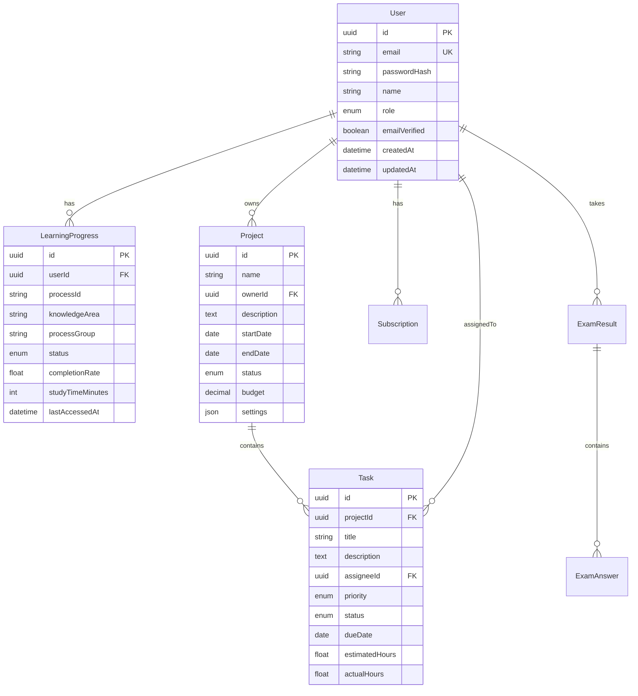
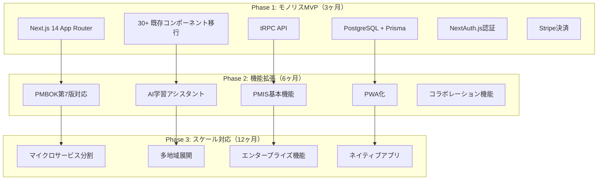
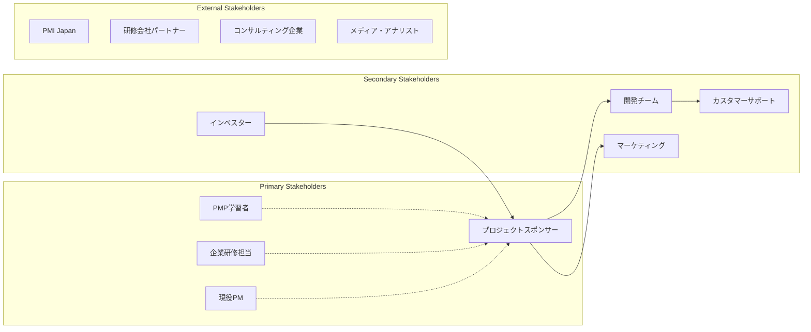
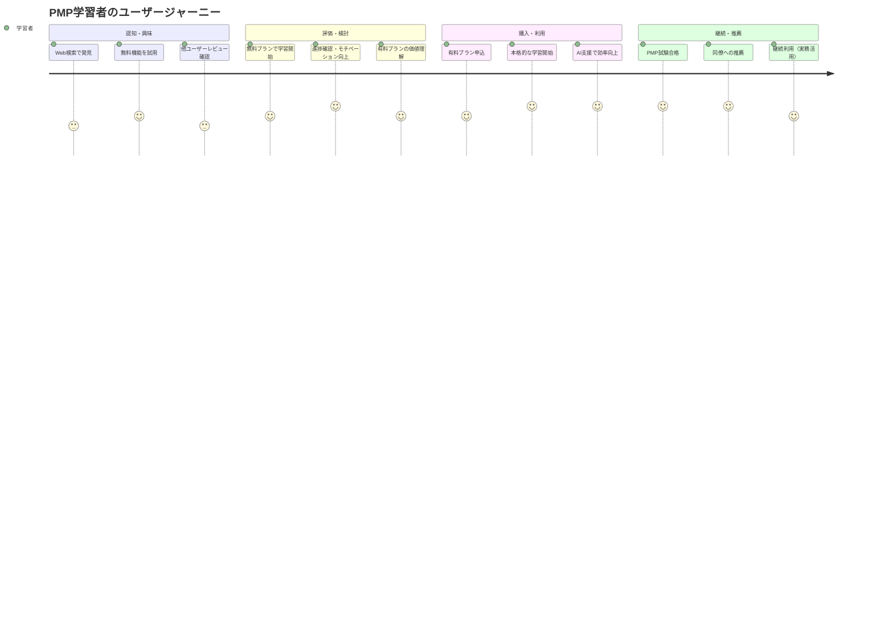
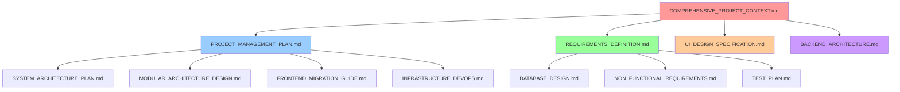

# Misc Documentation

<!-- Consolidated on: 2025-08-09T15:12:24.865Z -->
<!-- Source files: REQUIREMENTS_DEFINITION.md, COMPREHENSIVE_PROJECT_CONTEXT.md, CLAUDE.md, COMPETITIVE_ANALYSIS_AND_DIFFERENTIATION.md, PRODUCT_FEATURE_MATRIX.md, NON_FUNCTIONAL_REQUIREMENTS.md, FRONTEND_TEAM_COORDINATION.md, DATABASE_SETUP.md, TEAM_ROLE_ASSIGNMENT.md, DIRECTORY_STRUCTURE.md, PROJECT_STRUCTURE.md -->

## Table of Contents

1. [REQUIREMENTS DEFINITION](#requirements-definition)
2. [COMPREHENSIVE PROJECT CONTEXT](#comprehensive-project-context)
3. [CLAUDE](#claude)
4. [COMPETITIVE ANALYSIS AND DIFFERENTIATION](#competitive-analysis-and-differentiation)
5. [PRODUCT FEATURE MATRIX](#product-feature-matrix)
6. [NON FUNCTIONAL REQUIREMENTS](#non-functional-requirements)
7. [FRONTEND TEAM COORDINATION](#frontend-team-coordination)
8. [DATABASE SETUP](#database-setup)
9. [TEAM ROLE ASSIGNMENT](#team-role-assignment)
10. [DIRECTORY STRUCTURE](#directory-structure)
11. [PROJECT STRUCTURE](#project-structure)

---

## REQUIREMENTS DEFINITION

_Source: `docs/guides/REQUIREMENTS_DEFINITION.md`_

**文書バージョン:** 1.0  
**作成日:** 2025年1月9日  
**プロジェクト名:** PMPLearningManagement プラットフォーム  
**文書種別:** システム要件定義書  
**対象リリース:** MVP (v1.0) および本格リリース (v2.0)

---

## 1. システム概要

### 1.1 プロジェクトの目的と背景

#### 背景

現在、PMP（Project Management Professional）資格取得を目指す学習者向けのWebアプリケーションとして、GitHub Pages上で静的サイトが稼働中。React/D3.jsベースで構築された30以上のコンポーネントを持ち、PMBOK第6版の学習機能を提供している。

#### 目的

1. **学習プラットフォームの商用化**: 既存の学習機能を活かしながら、持続可能なビジネスモデルを構築
2. **PMIS機能の統合**: 学習だけでなく、実際のプロジェクト管理を支援する統合プラットフォームへ進化
3. **価値提供の拡大**: PMP学習者から現役プロジェクトマネージャーまで幅広いユーザーへの価値提供

### 1.2 システムの位置づけ

```
┌─────────────────────────────────────────┐
│     PMPLearningManagement Platform      │
├──────────────┬──────────────────────────┤
│  学習機能    │      PMIS機能            │
├──────────────┼──────────────────────────┤
│ ・PMBOK学習  │ ・プロジェクト管理       │
│ ・模擬試験   │ ・タスク管理             │
│ ・進捗管理   │ ・スケジュール管理       │
│ ・用語集     │ ・コスト管理             │
│ ・視覚化     │ ・リスク管理             │
└──────────────┴──────────────────────────┘
        ↓                ↓
   PMP学習者      プロジェクトマネージャー
```

### 1.3 ステークホルダー定義

| ステークホルダー               | 役割           | 主な関心事               | 影響度 |
| ------------------------------ | -------------- | ------------------------ | ------ |
| **プライマリステークホルダー** |                |                          |        |
| PMP学習者                      | エンドユーザー | 効率的な学習、合格率向上 | 高     |
| 現役PM                         | エンドユーザー | 実務での活用、効率化     | 高     |
| 企業研修担当者                 | 購買決定者     | 研修効果、コスト         | 高     |
| **セカンダリステークホルダー** |                |                          |        |
| プロジェクトスポンサー         | 投資者         | ROI、事業成長            | 高     |
| 開発チーム                     | 実装者         | 技術的実現性、保守性     | 中     |
| 運用チーム                     | 運用者         | 運用効率、安定性         | 中     |
| マーケティングチーム           | 販促担当       | 差別化要素、訴求力       | 中     |

### 1.4 用語定義

| 用語  | 定義                                  | 備考                         |
| ----- | ------------------------------------- | ---------------------------- |
| PMBOK | Project Management Body of Knowledge  | PMI発行の知識体系            |
| ITTO  | Input, Tools & Techniques, Output     | プロセスの構成要素           |
| PMIS  | Project Management Information System | プロジェクト管理情報システム |
| MVP   | Minimum Viable Product                | 実用最小限の製品             |
| EVM   | Earned Value Management               | アーンドバリュー管理         |
| SaaS  | Software as a Service                 | サービスとしてのソフトウェア |
| PWA   | Progressive Web App                   | プログレッシブWebアプリ      |
| KPI   | Key Performance Indicator             | 重要業績評価指標             |

---

## 2. ビジネス要件

### 2.1 ビジネス目標

#### 短期目標（3-6ヶ月）

1. **MVP完成**: 3ヶ月以内に最小機能セットをリリース
2. **初期顧客獲得**: 100名のベータユーザー獲得
3. **フィードバック収集**: 製品改善のための定性・定量データ収集

#### 中期目標（6-12ヶ月）

1. **収益化達成**: 月額売上500万円の達成
2. **顧客基盤確立**: 有料会員500名の獲得
3. **製品成熟**: 主要機能の実装完了とユーザビリティ向上

#### 長期目標（12ヶ月以降）

1. **市場シェア**: 国内PMP学習市場の5%獲得
2. **国際展開準備**: 英語版リリースの準備
3. **エコシステム構築**: パートナー企業との連携

### 2.2 成功指標（KPI）

| カテゴリ           | KPI                 | 目標値  | 測定頻度 |
| ------------------ | ------------------- | ------- | -------- |
| **ビジネス指標**   |                     |         |          |
| 売上               | MRR（月間経常収益） | 500万円 | 月次     |
| 顧客獲得           | 新規有料会員数      | 50名/月 | 月次     |
| 顧客維持           | チャーン率          | <5%     | 月次     |
| 収益性             | LTV/CAC             | >3.0    | 四半期   |
| **プロダクト指標** |                     |         |          |
| エンゲージメント   | MAU                 | 20,000  | 月次     |
| 活用度             | DAU/MAU             | >40%    | 週次     |
| 満足度             | NPS                 | 40以上  | 四半期   |
| 品質               | クリティカルバグ数  | <5件/月 | 月次     |

### 2.3 制約条件

1. **予算制約**
   - 初期開発予算: 900万円（3ヶ月）
   - 年間運用予算: 3,000万円

2. **人的リソース制約**
   - 開発チーム: フルスタックエンジニア2-3名
   - 開発期間中の増員は困難

3. **技術制約**
   - 既存30+のReactコンポーネントの活用必須
   - モノリスファーストアプローチの採用

4. **時間制約**
   - MVP: 3ヶ月以内
   - 本格リリース: 6ヶ月以内

### 2.4 前提条件

1. 既存のGitHub Pages環境は無料版として継続運用
2. 開発チームはReact/Next.js/Node.jsの技術スキルを保有
3. クラウドインフラ（Vercel/Supabase）の利用が可能
4. Stripe等の外部決済サービスが利用可能
5. PMBOK第7版の日本語資料が入手可能

---

## 3. 機能要件

### 3.1 ユーザーストーリー（MVP - Must Have）

#### 認証・アカウント管理

| ID     | ユーザーストーリー                                        | 受入基準                                                                         | 優先度 |
| ------ | --------------------------------------------------------- | -------------------------------------------------------------------------------- | ------ |
| US-001 | PMP学習者として、アカウントを作成して学習進捗を保存したい | ・メールアドレスで登録可能<br>・パスワードリセット機能<br>・プロフィール編集可能 | Must   |
| US-002 | ユーザーとして、GoogleやGitHubアカウントでログインしたい  | ・OAuth認証実装<br>・既存アカウントとの連携                                      | Must   |
| US-003 | 有料会員として、サブスクリプションを管理したい            | ・プラン選択可能<br>・支払い方法変更<br>・解約手続き                             | Must   |

#### 学習機能（既存資産活用）

| ID     | ユーザーストーリー                                          | 受入基準                                                          | 優先度 |
| ------ | ----------------------------------------------------------- | ----------------------------------------------------------------- | ------ |
| US-004 | PMP学習者として、PMBOK第6版の49プロセスを体系的に学習したい | ・マトリックスビュー表示<br>・プロセス詳細閲覧<br>・ITTO情報表示  | Must   |
| US-005 | 学習者として、視覚的にプロセスの関係性を理解したい          | ・ネットワーク図表示<br>・8種類の視覚化<br>・インタラクティブ操作 | Must   |
| US-006 | 受験者として、本番形式の模擬試験を受けたい                  | ・180問/230分の試験<br>・結果分析機能<br>・弱点把握               | Must   |
| US-007 | 学習者として、自分の学習進捗を把握したい                    | ・進捗ダッシュボード<br>・学習履歴保存<br>・達成度表示            | Must   |

#### 課金・決済

| ID     | ユーザーストーリー                           | 受入基準                                             | 優先度 |
| ------ | -------------------------------------------- | ---------------------------------------------------- | ------ |
| US-008 | ユーザーとして、クレジットカードで支払いたい | ・Stripe決済実装<br>・領収書発行<br>・自動更新       | Must   |
| US-009 | 管理者として、ユーザーの課金状況を管理したい | ・課金ダッシュボード<br>・収益レポート<br>・返金処理 | Must   |

### 3.2 機能要件（フェーズ2 - Should Have）

#### PMBOK第7版対応

| ID     | ユーザーストーリー                           | 受入基準                                                            | 優先度 |
| ------ | -------------------------------------------- | ------------------------------------------------------------------- | ------ |
| US-010 | 学習者として、PMBOK第7版の内容も学習したい   | ・12の原理原則表示<br>・8つのパフォーマンス領域<br>・バージョン切替 | Should |
| US-011 | 学習者として、第6版と第7版の違いを理解したい | ・比較ビュー<br>・移行ガイド<br>・相違点ハイライト                  | Should |

#### AI学習支援

| ID     | ユーザーストーリー                                 | 受入基準                                                 | 優先度 |
| ------ | -------------------------------------------------- | -------------------------------------------------------- | ------ |
| US-012 | 学習者として、AIアシスタントに質問したい           | ・チャット機能<br>・コンテキスト理解<br>・学習アドバイス | Should |
| US-013 | 学習者として、パーソナライズされた学習計画が欲しい | ・学習パス生成<br>・推奨コンテンツ<br>・進捗予測         | Should |

#### 基本的なPMIS機能

| ID     | ユーザーストーリー                                 | 受入基準                                               | 優先度 |
| ------ | -------------------------------------------------- | ------------------------------------------------------ | ------ |
| US-014 | PMとして、プロジェクトを作成・管理したい           | ・プロジェクト作成<br>・基本情報管理<br>・メンバー招待 | Should |
| US-015 | チームメンバーとして、タスクを管理したい           | ・タスク作成/編集<br>・ステータス管理<br>・担当者割当  | Should |
| US-016 | PMとして、ガントチャートでスケジュールを管理したい | ・ガントチャート表示<br>・依存関係設定<br>・進捗更新   | Should |

#### モバイルアプリケーション

| ID     | ユーザーストーリー                                      | 受入基準                                                                             | 優先度 |
| ------ | ------------------------------------------------------- | ------------------------------------------------------------------------------------ | ------ |
| US-017 | 学習者として、モバイルデバイスでPMP模擬試験を受けたい   | ・iOS/Androidネイティブアプリ<br>・180問/230分の完全試験対応<br>・オフライン受験機能 | Should |
| US-018 | 学習者として、移動中にフラッシュカード学習をしたい      | ・タッチ最適化UI<br>・進捗同期機能<br>・音声読み上げ対応                             | Should |
| US-019 | ユーザーとして、学習進捗をWeb版とモバイル版で同期したい | ・リアルタイム同期<br>・オフライン変更の競合解決<br>・一貫したデータ表示             | Should |
| US-020 | 学習者として、通知機能で学習継続をサポートしてほしい    | ・学習リマインダー<br>・試験日カウントダウン<br>・達成バッジ通知                     | Should |
| US-021 | 受験者として、試験結果をモバイルで詳細分析したい        | ・知識エリア別スコア表示<br>・弱点分析グラフ<br>・学習推奨機能                       | Should |

### 3.3 機能要件（将来 - Could Have）

#### 高度なPMIS機能

| ID     | ユーザーストーリー                                      | 受入基準                                                     | 優先度 |
| ------ | ------------------------------------------------------- | ------------------------------------------------------------ | ------ |
| US-022 | PMとして、EVMでプロジェクトのパフォーマンスを測定したい | ・EVM計算<br>・グラフ表示<br>・予測分析                      | Could  |
| US-023 | PMとして、リスクを体系的に管理したい                    | ・リスク登録簿<br>・確率影響マトリックス<br>・対応計画       | Could  |
| US-024 | チームとして、ドキュメントを共有・管理したい            | ・ファイルアップロード<br>・バージョン管理<br>・アクセス権限 | Could  |

#### コラボレーション機能

| ID     | ユーザーストーリー                                 | 受入基準                                                        | 優先度 |
| ------ | -------------------------------------------------- | --------------------------------------------------------------- | ------ |
| US-025 | 学習者として、他の学習者と交流したい               | ・ディスカッションフォーラム<br>・Q&A機能<br>・スタディグループ | Could  |
| US-026 | チームとして、リアルタイムでコラボレーションしたい | ・リアルタイムチャット<br>・画面共有<br>・共同編集              | Could  |

### 3.4 機能要件（対象外 - Won't Have）

| ID     | 機能                          | 理由                                                 |
| ------ | ----------------------------- | ---------------------------------------------------- |
| WH-001 | オンプレミス版                | 初期はSaaSモデルに集中（旧WH-002から変更）           |
| WH-002 | カスタム研修プログラム作成    | 複雑度が高く初期フェーズでは不要（旧WH-003から変更） |
| WH-003 | 他資格（PgMP、PMI-ACP等）対応 | PMPに集中してまず成功モデル確立（旧WH-004から変更）  |

---

## 4. 非機能要件

### 4.1 パフォーマンス要件

| 項目                 | 要件                          | 測定方法       | 備考           |
| -------------------- | ----------------------------- | -------------- | -------------- |
| **レスポンスタイム** |                               |                |                |
| ページ読み込み       | 3秒以内（95パーセンタイル）   | Lighthouse     | 初回読み込み   |
| API応答時間          | 500ms以内（95パーセンタイル） | APM            | 通常のCRUD操作 |
| 検索応答時間         | 1秒以内                       | APM            | 全文検索       |
| **スループット**     |                               |                |                |
| 同時接続数           | 1,000ユーザー                 | 負荷テスト     | MVP時点        |
| リクエスト処理数     | 100 req/sec                   | 負荷テスト     | ピーク時       |
| **リソース使用率**   |                               |                |                |
| CPU使用率            | <70%（平均）                  | モニタリング   | 通常運用時     |
| メモリ使用率         | <80%                          | モニタリング   | 通常運用時     |
| **データ容量**       |                               |                |                |
| データベースサイズ   | 100GB以内                     | DB統計         | 初年度         |
| ファイルストレージ   | 1TB以内                       | ストレージ統計 | 初年度         |

#### モバイルアプリパフォーマンス要件

| 項目                 | 要件      | 測定方法         | 備考                   |
| -------------------- | --------- | ---------------- | ---------------------- |
| **アプリ起動時間**   |           |                  |                        |
| コールドスタート     | 3秒以内   | アプリ計測       | 初回起動               |
| ウォームスタート     | 1秒以内   | アプリ計測       | 再起動                 |
| **レスポンス性能**   |           |                  |                        |
| 画面遷移時間         | 300ms以内 | UI測定           | ナビゲーション         |
| 試験問題表示         | 500ms以内 | アプリ内測定     | オフライン時           |
| **データ同期性能**   |           |                  |                        |
| 差分同期時間         | 10秒以内  | 同期ログ         | 通常の学習データ       |
| 初回フルダウンロード | 60秒以内  | 同期ログ         | 全試験データ           |
| **バッテリー消費**   |           |                  |                        |
| 試験受験中（230分）  | <30%消費  | バッテリー統計   | 画面常時点灯           |
| バックグラウンド     | <1%/時間  | OS統計           | 同期処理含む           |
| **メモリ使用量**     |           |                  |                        |
| アプリメモリ         | <200MB    | プロファイリング | ピーク時               |
| ストレージ使用量     | <1GB      | ファイルシステム | 全データダウンロード時 |

### 4.2 セキュリティ要件

| カテゴリ            | 要件                             | 実装方法                |
| ------------------- | -------------------------------- | ----------------------- |
| **認証・認可**      |                                  |                         |
| ユーザー認証        | 多要素認証対応                   | NextAuth.js + TOTP      |
| セッション管理      | セキュアなセッション管理         | JWT + HttpOnly Cookie   |
| アクセス制御        | ロールベースアクセス制御（RBAC） | Middleware実装          |
| **データ保護**      |                                  |                         |
| 通信暗号化          | 全通信のTLS暗号化                | HTTPS強制、TLS 1.3      |
| データ暗号化        | 機密データの暗号化保存           | AES-256                 |
| パスワード          | bcryptによるハッシュ化           | bcrypt (cost factor 12) |
| **脆弱性対策**      |                                  |                         |
| OWASP Top 10        | 全項目への対策実装               | セキュリティテスト      |
| XSS対策             | 入出力の適切なサニタイズ         | React自動エスケープ     |
| CSRF対策            | CSRFトークンの実装               | NextAuth.js組み込み     |
| SQLインジェクション | プリペアドステートメント使用     | Prisma ORM              |
| **監査・ログ**      |                                  |                         |
| 監査ログ            | 重要操作のログ記録               | 構造化ログ              |
| アクセスログ        | 全アクセスの記録                 | Nginx/CloudFlare        |

#### モバイルセキュリティ要件

| カテゴリ                   | 要件                     | 実装方法                  |
| -------------------------- | ------------------------ | ------------------------- |
| **デバイスセキュリティ**   |                          |                           |
| 認証情報保護               | 生体認証・PIN認証        | Touch ID/Face ID/指紋認証 |
| ローカルデータ暗号化       | SQLiteデータベース暗号化 | SQLCipher                 |
| 試験データ保護             | 問題データの暗号化保存   | AES-256暗号化             |
| **アプリ保護**             |                          |                           |
| ルート検知                 | Root/Jailbreak検知       | 検知時の機能制限          |
| デバッグ検知               | デバッグ防止機能         | リリースビルド時          |
| スクリーンショット防止     | 機密画面のキャプチャ防止 | セキュアフラグ設定        |
| **通信セキュリティ**       |                          |                           |
| 証明書ピニング             | SSL証明書の固定化        | 中間者攻撃防止            |
| API認証                    | JWT + デバイス固有ID     | 二要素認証                |
| **データ同期セキュリティ** |                          |                           |
| 差分暗号化                 | 同期データの暗号化       | エンドツーエンド暗号化    |
| セッション管理             | 自動ログアウト           | 30分アイドル時            |

### 4.3 可用性要件

| 項目                | 要件                 | 対策                 |
| ------------------- | -------------------- | -------------------- |
| **稼働率**          |                      |                      |
| サービス可用性      | 99.5%以上（月間）    | 冗長化、監視         |
| 計画停止時間        | 月4時間以内          | メンテナンス窓設定   |
| **障害復旧**        |                      |                      |
| RTO（目標復旧時間） | 2時間以内            | 自動フェイルオーバー |
| RPO（目標復旧時点） | 1時間以内            | 定期バックアップ     |
| **バックアップ**    |                      |                      |
| データベース        | 日次フルバックアップ | 自動バックアップ     |
| ファイル            | 週次バックアップ     | S3レプリケーション   |
| 保持期間            | 30日間               | 世代管理             |

### 4.4 保守性要件

| 項目                 | 要件                 | 実装方法         |
| -------------------- | -------------------- | ---------------- |
| **コード品質**       |                      |                  |
| コードカバレッジ     | 80%以上              | Jest/Vitest      |
| 技術的負債           | SonarQubeスコアA以上 | 定期解析         |
| コーディング規約     | ESLint/Prettier準拠  | CI/CD統合        |
| **ドキュメント**     |                      |                  |
| API仕様書            | OpenAPI 3.0準拠      | 自動生成         |
| システム設計書       | 最新状態を維持       | バージョン管理   |
| 運用手順書           | 手順の文書化         | Markdown管理     |
| **監視・ログ**       |                      |                  |
| アプリケーション監視 | APM実装              | Sentry           |
| インフラ監視         | メトリクス収集       | Vercel Analytics |
| ログ管理             | 集約ログ管理         | CloudWatch       |

### 4.5 移植性要件

| 項目                 | 要件             | 備考               |
| -------------------- | ---------------- | ------------------ |
| **プラットフォーム** |                  |                    |
| サーバー環境         | Node.js 18+      | LTS版使用          |
| データベース         | PostgreSQL 14+   | マネージドサービス |
| **ブラウザ対応**     |                  |                    |
| Chrome               | 最新2バージョン  | 主要ブラウザ       |
| Firefox              | 最新2バージョン  |                    |
| Safari               | 最新2バージョン  |                    |
| Edge                 | 最新2バージョン  |                    |
| **デバイス対応**     |                  |                    |
| デスクトップ         | フル機能対応     | 1280px以上         |
| タブレット           | レスポンシブ対応 | 768px以上          |
| スマートフォン       | 基本機能対応     | 375px以上          |

#### モバイル特化要件

| 項目                     | 要件                           | 備考                 |
| ------------------------ | ------------------------------ | -------------------- |
| **プラットフォーム対応** |                                |                      |
| iOS                      | iOS 13.0以降                   | iPhone 6s以降        |
| Android                  | API Level 21以降 (Android 5.0) | ARMv7/ARM64          |
| **画面サイズ対応**       |                                |                      |
| 最小画面サイズ           | 4インチ (320x568)              | iPhone SE第1世代     |
| 最大画面サイズ           | 7インチ (iPad mini)            | タブレット対応       |
| **ネットワーク要件**     |                                |                      |
| オフライン機能           | 完全オフライン試験受験         | 事前ダウンロード必須 |
| 低帯域対応               | 3G環境での同期対応             | データ圧縮           |
| **ハードウェア統合**     |                                |                      |
| バッテリー最適化         | バックグラウンド処理制限       | 同期のスケジュール化 |
| メモリ管理               | ローメモリデバイス対応         | 1GB RAMデバイス      |

### 4.6 ユーザビリティ要件

| 項目                          | 要件                      | 測定方法             |
| ----------------------------- | ------------------------- | -------------------- |
| **学習性**                    |                           |                      |
| 初回利用                      | 1時間以内に基本操作習得   | ユーザーテスト       |
| オンボーディング              | ガイドツアー完了率80%以上 | アナリティクス       |
| **効率性**                    |                           |                      |
| タスク完了時間                | 既存システム比20%短縮     | A/Bテスト            |
| クリック数                    | 主要タスク5クリック以内   | ユーザビリティテスト |
| **満足度**                    |                           |                      |
| SUS（System Usability Scale） | 70点以上                  | 定期調査             |
| カスタマーエフォート          | 低努力での目標達成        | CES測定              |
| **アクセシビリティ**          |                           |                      |
| WCAG準拠                      | WCAG 2.1 AA準拠           | 自動/手動テスト      |
| キーボード操作                | 全機能キーボード操作可能  | 手動テスト           |
| スクリーンリーダー            | 主要リーダー対応          | 互換性テスト         |

---

## 5. ユーザー要件

### 5.1 ユーザーペルソナ

#### ペルソナ1: PMP受験準備中の田中さん（28歳）

- **職業**: IT企業のプロジェクトリーダー
- **目標**: 6ヶ月以内にPMP試験合格
- **課題**:
  - 仕事と勉強の両立が困難
  - PMBOK用語の暗記が大変
  - 模擬試験の機会が少ない
- **ニーズ**:
  - スキマ時間で学習できるモバイル対応
  - 視覚的で理解しやすい教材
  - 実践的な模擬試験

#### ペルソナ2: 現役PMの佐藤さん（35歳）

- **職業**: 大手SIerのプロジェクトマネージャー
- **目標**: プロジェクト管理の効率化
- **課題**:
  - 複数プロジェクトの同時管理
  - チーム間のコミュニケーション
  - PMBOKベストプラクティスの実践
- **ニーズ**:
  - 統合的なプロジェクト管理ツール
  - PMBOKに準拠した管理手法
  - チームコラボレーション機能

#### ペルソナ3: 研修担当の山田さん（42歳）

- **職業**: 企業の人材開発部門マネージャー
- **目標**: 社員のPM能力向上
- **課題**:
  - 研修効果の測定が困難
  - 個別の学習進捗管理
  - コスト効率の良い研修方法
- **ニーズ**:
  - 組織単位での利用管理
  - 学習進捗レポート
  - カスタマイズ可能な学習パス

### 5.2 ユーザーインターフェース要件

#### デザイン原則

1. **シンプルで直感的**: 学習に集中できるクリーンなUI
2. **一貫性**: 全画面で統一されたデザインパターン
3. **レスポンシブ**: デバイスに最適化された表示
4. **アクセシブル**: すべてのユーザーが利用可能

#### UI要素要件

| 要素               | 要件                       | 実装指針                  |
| ------------------ | -------------------------- | ------------------------- |
| **ナビゲーション** |                            |                           |
| メインメニュー     | 常時アクセス可能           | ヘッダー固定              |
| パンくずリスト     | 現在位置の明示             | 階層表示                  |
| 検索機能           | グローバル検索             | オートコンプリート        |
| **フォーム**       |                            |                           |
| 入力フィールド     | リアルタイムバリデーション | エラー即時表示            |
| ボタン             | 明確なアクション表示       | プライマリ/セカンダリ区別 |
| **フィードバック** |                            |                           |
| 読み込み状態       | プログレス表示             | スケルトンスクリーン      |
| エラーメッセージ   | 具体的な対処法提示         | ユーザーフレンドリー      |
| 成功通知           | 適切なフィードバック       | トースト通知              |
| **視覚化**         |                            |                           |
| グラフ・チャート   | インタラクティブ           | ツールチップ、ズーム      |
| データテーブル     | ソート・フィルター機能     | ページネーション          |

#### モバイルUI要件

| 要素                       | 要件                       | 実装指針                    |
| -------------------------- | -------------------------- | --------------------------- |
| **モバイルナビゲーション** |                            |                             |
| ハンバーガーメニュー       | 主要機能への素早いアクセス | スライドアウト形式          |
| タブナビゲーション         | 主要画面間の切り替え       | 最大5つのタブ               |
| 戻るボタン                 | ネイティブ戻る動作         | OSの標準動作                |
| **試験インターフェース**   |                            |                             |
| 問題表示                   | 縦スクロール可能           | フォントサイズ調整対応      |
| 選択肢UI                   | タッチしやすいボタン       | 最小44pt間隔                |
| 進捗表示                   | 現在問題/総問題数表示      | プログレスバー              |
| タイマー表示               | 常時表示（非邪魔）         | 上部固定、折りたたみ可能    |
| **学習機能UI**             |                            |                             |
| フラッシュカード           | タッチジェスチャー操作     | スワイプで次/前カード       |
| 進捗視覚化                 | モバイル最適化グラフ       | タップで詳細表示            |
| 設定画面                   | ネイティブ設定UI           | iOS/Androidガイドライン準拠 |
| **オフライン状態表示**     |                            |                             |
| 同期状態                   | リアルタイム同期表示       | アイコンとテキスト          |
| オフライン通知             | ネットワーク切断時の通知   | バナー形式                  |
| データダウンロード         | 進捗と推定時間表示         | プログレスバーと%表示       |

### 5.3 アクセシビリティ要件

| カテゴリ         | 要件                               | 実装方法           |
| ---------------- | ---------------------------------- | ------------------ |
| **知覚可能**     |                                    |                    |
| 色のコントラスト | WCAG AA基準（4.5:1）               | カラーパレット設計 |
| 代替テキスト     | すべての画像に代替テキスト         | alt属性必須        |
| **操作可能**     |                                    |                    |
| キーボード操作   | すべての機能をキーボードで操作可能 | tabindex管理       |
| 十分な時間       | タイムアウトの事前警告             | 延長オプション     |
| **理解可能**     |                                    |                    |
| 読みやすさ       | 平易な日本語使用                   | ライティングガイド |
| 予測可能性       | 一貫した動作                       | デザインシステム   |
| **堅牢性**       |                                    |                    |
| 互換性           | 支援技術との互換性                 | ARIA属性実装       |
| 標準準拠         | W3C標準準拠                        | バリデーション     |

#### モバイルユーザビリティ要件

| カテゴリ                     | 要件                               | 測定方法               |
| ---------------------------- | ---------------------------------- | ---------------------- |
| **タッチインターフェース**   |                                    |                        |
| タップターゲットサイズ       | 最小44pt (iOS) / 48dp (Android)    | 手動測定               |
| ジェスチャー操作             | スワイプ、ピンチズーム対応         | ユーザビリティテスト   |
| 片手操作対応                 | 主要機能への片手アクセス           | 使いやすさテスト       |
| **モバイル特有の学習性**     |                                    |                        |
| 初回起動                     | 3分以内で試験開始可能              | タスクテスト           |
| オフライン移行               | ワンタップでオフライン準備         | プロセステスト         |
| データ同期                   | 同期状態の明確な視覚フィードバック | 理解度テスト           |
| **効率性**                   |                                    |                        |
| 問題解答速度                 | Web版と同等の操作効率              | 比較テスト             |
| ナビゲーション               | 階層の深さ3レベル以内              | 情報アーキテクチャ分析 |
| **モバイル満足度**           |                                    |                        |
| アプリストア評価             | 4.0以上                            | App Store/Google Play  |
| モバイル継続率               | 初週継続率60%以上                  | アナリティクス         |
| **モバイルアクセシビリティ** |                                    |                        |
| VoiceOver/TalkBack           | スクリーンリーダー完全対応         | 自動化テスト           |
| Dynamic Type                 | iOS Dynamic Type対応               | テキストサイズ調整     |
| 高コントラスト               | ダークモード・ハイコントラスト対応 | 視覚テスト             |

---

## 6. システム要件

### 6.1 システムアーキテクチャ要件

#### アーキテクチャ方針

- **モノリスファースト**: 初期は単一アプリケーションで開発
- **段階的進化**: 必要に応じてマイクロサービス化を検討
- **クラウドネイティブ**: スケーラビリティを考慮した設計

#### システム構成（MVP）

```
┌─────────────────────────────────────────┐
│            クライアント層                │
│  - Next.js (React)                      │
│  - Tailwind CSS                        │
│  - PWA対応                             │
└────────────┬────────────────────────────┘
             │ HTTPS
┌────────────▼────────────────────────────┐
│            アプリケーション層            │
│  - Next.js API Routes                  │
│  - tRPC                                │
│  - NextAuth.js                         │
└────────────┬────────────────────────────┘
             │
┌────────────▼────────────────────────────┐
│            データ層                      │
│  - PostgreSQL (Supabase)               │
│  - Redis (キャッシュ)                   │
│  - S3互換ストレージ                     │
└─────────────────────────────────────────┘
```

#### モバイルアプリケーション構成

```
┌─────────────────────────────────────────┐
│            モバイルクライアント層        │
│  - React Native / Flutter              │
│  - Native APIs (Camera, Notifications) │
│  - SQLite (オフラインストレージ)        │
└────────────┬────────────────────────────┘
             │ HTTPS/WebSocket
┌────────────▼────────────────────────────┐
│            API Gateway層                │
│  - 認証・認可 (JWT)                     │
│  - レート制限                           │
│  - データ同期API                        │
└────────────┬────────────────────────────┘
             │
┌────────────▼────────────────────────────┐
│            既存Web API層                 │
│  - Next.js API Routes                  │
│  - リアルタイム同期サービス             │
│  - オフライン対応キューシステム         │
└─────────────────────────────────────────┘
```

### 6.2 モバイルアプリ技術要件

#### 開発アプローチ

- **クロスプラットフォーム開発**: React Native または Flutter
- **ネイティブ機能統合**: プッシュ通知、バックグラウンド処理
- **オフラインファースト設計**: SQLite + 同期メカニズム
- **パフォーマンス最適化**: 遅延ロード、キャッシング戦略

#### モバイルアーキテクチャ要件

| 要件カテゴリ           | 仕様                            | 実装方針                   |
| ---------------------- | ------------------------------- | -------------------------- |
| **開発フレームワーク** |                                 |                            |
| iOS開発                | React Native 0.73+              | TypeScript使用             |
| Android開発            | React Native 0.73+              | TypeScript使用             |
| 最小サポート版本       | iOS 13.0+, Android API 21+      | 95%のデバイスカバレッジ    |
| **データ同期**         |                                 |                            |
| 同期方式               | 差分同期 + 楽観的更新           | GraphQL Subscriptions      |
| 競合解決               | Last Write Wins                 | タイムスタンプベース       |
| オフライン対応         | 完全オフライン試験受験          | SQLite + Redux Persist     |
| **ネイティブ統合**     |                                 |                            |
| プッシュ通知           | Firebase Cloud Messaging        | 学習リマインダー、結果通知 |
| バックグラウンド処理   | Background App Refresh          | 同期処理、通知スケジュール |
| セキュリティ           | Keychain(iOS)/Keystore(Android) | 認証情報の安全な保存       |

### 6.3 データ要件

#### データモデル（主要エンティティ）

```sql
-- ユーザー関連
User {
  id: UUID
  email: String
  name: String
  role: Enum[STUDENT, PM, ADMIN]
  subscription: Subscription
  createdAt: DateTime
  updatedAt: DateTime
}

-- 学習進捗
LearningProgress {
  id: UUID
  userId: UUID
  processId: String
  status: Enum[NOT_STARTED, IN_PROGRESS, COMPLETED]
  completedAt: DateTime
  score: Float
}

-- プロジェクト管理
Project {
  id: UUID
  name: String
  ownerId: UUID
  startDate: Date
  endDate: Date
  status: Enum[PLANNING, EXECUTING, CLOSED]
  budget: Decimal
}

-- タスク管理
Task {
  id: UUID
  projectId: UUID
  title: String
  assigneeId: UUID
  status: Enum[TODO, IN_PROGRESS, DONE]
  dueDate: Date
  estimatedHours: Float
  actualHours: Float
}
```

### 6.3 インターフェース要件

#### API仕様

- **プロトコル**: HTTP/HTTPS (REST + tRPC)
- **データフォーマット**: JSON
- **認証**: JWT Bearer Token
- **APIバージョニング**: URLパス方式 (/api/v1/)

#### 主要APIエンドポイント

| エンドポイント         | メソッド     | 用途                   | 認証 |
| ---------------------- | ------------ | ---------------------- | ---- |
| /api/auth/login        | POST         | ログイン               | 不要 |
| /api/auth/logout       | POST         | ログアウト             | 必要 |
| /api/users/profile     | GET/PUT      | プロフィール取得/更新  | 必要 |
| /api/learning/progress | GET/POST     | 学習進捗取得/更新      | 必要 |
| /api/projects          | GET/POST     | プロジェクト一覧/作成  | 必要 |
| /api/tasks             | GET/POST/PUT | タスク管理             | 必要 |
| /api/subscription      | GET/POST     | サブスクリプション管理 | 必要 |

#### モバイルAPI要件

| エンドポイント             | メソッド | 用途                       | 認証 | モバイル特有要件         |
| -------------------------- | -------- | -------------------------- | ---- | ------------------------ |
| /api/mobile/sync           | POST     | データ差分同期             | 必要 | タイムスタンプベース差分 |
| /api/mobile/exam/download  | GET      | 試験データ一括取得         | 必要 | 圧縮形式、チェックサム   |
| /api/mobile/offline/submit | POST     | オフライン解答アップロード | 必要 | バッチ処理対応           |
| /api/mobile/progress/sync  | PUT      | 学習進捗同期               | 必要 | 競合解決ロジック         |
| /api/mobile/device         | POST/PUT | デバイス登録・管理         | 必要 | デバイス固有ID           |
| /api/mobile/notifications  | POST     | プッシュ通知設定           | 必要 | FCMトークン管理          |

### 6.4 統合要件

#### 外部サービス統合

| サービス         | 用途               | 統合方式       | 優先度 |
| ---------------- | ------------------ | -------------- | ------ |
| Stripe           | 決済処理           | Webhook + API  | Must   |
| Google OAuth     | ソーシャルログイン | OAuth 2.0      | Must   |
| GitHub OAuth     | ソーシャルログイン | OAuth 2.0      | Must   |
| OpenAI API       | AI学習支援         | REST API       | Should |
| SendGrid         | メール送信         | API            | Should |
| Google Analytics | アクセス解析       | JavaScript SDK | Should |
| Sentry           | エラー監視         | SDK            | Must   |

#### モバイル特有の外部サービス統合

| サービス                             | 用途               | 統合方式 | 優先度 | モバイル特有要件   |
| ------------------------------------ | ------------------ | -------- | ------ | ------------------ |
| Firebase Cloud Messaging             | プッシュ通知       | SDK      | Must   | iOS/Android統一API |
| App Store Connect API                | iOS配信管理        | REST API | Must   | 自動リリース       |
| Google Play Console API              | Android配信管理    | REST API | Must   | 段階的展開         |
| Firebase Crashlytics                 | クラッシュレポート | SDK      | Must   | シンボル化対応     |
| Firebase Analytics                   | アプリ内行動分析   | SDK      | Should | GDPR準拠           |
| OneSignal                            | 高度なプッシュ通知 | SDK      | Could  | セグメント配信     |
| TestFlight/Firebase App Distribution | ベータ配信         | API      | Should | 自動配信           |
| App Annie/Sensor Tower               | アプリ分析         | API      | Could  | 競合分析           |

---

## 7. データ要件

### 7.1 データモデル詳細

#### コアドメイン



#### モバイルデータ同期要件

```sql
-- モバイル同期管理
MobileSyncLog {
  id: UUID
  userId: UUID
  deviceId: String
  lastSyncTimestamp: DateTime
  syncType: Enum[FULL, INCREMENTAL]
  conflictResolution: JSON
  status: Enum[SUCCESS, FAILED, PARTIAL]
}

-- オフライン操作キュー
OfflineQueue {
  id: UUID
  userId: UUID
  deviceId: String
  operation: JSON
  timestamp: DateTime
  status: Enum[PENDING, SYNCED, FAILED]
  retryCount: Int
}

-- デバイス管理
UserDevice {
  id: UUID
  userId: UUID
  deviceId: String
  platform: Enum[IOS, ANDROID]
  osVersion: String
  appVersion: String
  fcmToken: String
  lastActiveAt: DateTime
}
```

#### 同期戦略

| データ種別           | 同期方式 | 頻度         | 競合解決        |
| -------------------- | -------- | ------------ | --------------- |
| 学習進捗             | 差分同期 | リアルタイム | Last Write Wins |
| 試験結果             | 即座同期 | 試験完了後   | Merge           |
| ユーザー設定         | 差分同期 | 変更時       | Server Wins     |
| 試験問題データ       | フル同期 | 初回+更新時  | Server Only     |
| フラッシュカード進捗 | 差分同期 | 5分毎        | Last Write Wins |

### 7.2 データ移行要件

#### 移行対象データ

| データ種別      | 現在の保存先 | 移行先     | データ量       | 優先度 |
| --------------- | ------------ | ---------- | -------------- | ------ |
| 学習進捗        | LocalStorage | PostgreSQL | ~10MB/ユーザー | Must   |
| ユーザー設定    | LocalStorage | PostgreSQL | ~1MB/ユーザー  | Must   |
| PMBOK静的データ | JSON files   | PostgreSQL | ~50MB          | Must   |
| 試験問題        | JavaScript   | PostgreSQL | ~10MB          | Must   |
| 用語集          | JavaScript   | PostgreSQL | ~5MB           | Must   |

#### 移行手順

1. **データエクスポート機能の実装**
   - LocalStorageデータのJSON出力
   - バックアップファイル生成

2. **データ変換処理**
   - スキーママッピング
   - データクレンジング
   - 整合性チェック

3. **インポート処理**
   - バッチ処理での一括インポート
   - 進捗状況の可視化
   - エラーハンドリング

### 7.3 データ保持要件

| データ種別               | 保持期間 | アーカイブ方式     | 削除方式          |
| ------------------------ | -------- | ------------------ | ----------------- |
| アクティブユーザーデータ | 無期限   | -                  | -                 |
| 非アクティブユーザー     | 2年      | コールドストレージ | 論理削除→物理削除 |
| 学習履歴                 | 3年      | 年次アーカイブ     | 段階的削除        |
| アクセスログ             | 1年      | 月次アーカイブ     | ローテーション    |
| 監査ログ                 | 5年      | 変更不可形式       | 法定期間後削除    |
| バックアップ             | 30日     | 世代管理（7世代）  | 自動削除          |

### 7.4 バックアップ要件

#### バックアップ戦略

| 種別                 | 頻度   | 方式                 | 保存先 | 保持期間 |
| -------------------- | ------ | -------------------- | ------ | -------- |
| データベース（フル） | 日次   | 自動スナップショット | S3     | 30日     |
| データベース（差分） | 時間毎 | WALアーカイブ        | S3     | 7日      |
| ファイル             | 週次   | rsync                | S3     | 30日     |
| 設定ファイル         | 変更時 | Git                  | GitHub | 無期限   |

#### リストア要件

- **RTO（目標復旧時間）**: 2時間以内
- **RPO（目標復旧時点）**: 1時間以内
- **リストアテスト**: 四半期毎に実施
- **手順書**: 常に最新化を維持

---

## 8. 外部インターフェース要件

### 8.1 API要件

#### RESTful API設計原則

| 原則                 | 実装方針                             |
| -------------------- | ------------------------------------ |
| リソース指向         | 名詞ベースのURL設計                  |
| ステートレス         | セッション情報をサーバーに保持しない |
| 統一インターフェース | 標準的なHTTPメソッド使用             |
| キャッシュ可能       | 適切なCache-Controlヘッダー          |
| レイヤーシステム     | API Gateway経由でのアクセス          |

#### API仕様

```yaml
openapi: 3.0.0
info:
  title: PMPLearningManagement API
  version: 1.0.0

paths:
  /api/v1/processes:
    get:
      summary: PMBOK プロセス一覧取得
      parameters:
        - name: knowledgeArea
          in: query
          schema:
            type: string
        - name: processGroup
          in: query
          schema:
            type: string
      responses:
        200:
          description: プロセス一覧
          content:
            application/json:
              schema:
                type: array
                items:
                  $ref: '#/components/schemas/Process'

  /api/v1/learning/progress:
    post:
      summary: 学習進捗更新
      requestBody:
        required: true
        content:
          application/json:
            schema:
              $ref: '#/components/schemas/ProgressUpdate'
      responses:
        200:
          description: 更新成功
```

### 8.2 外部システム連携

#### 決済システム（Stripe）

| 項目               | 仕様                             |
| ------------------ | -------------------------------- |
| 統合方式           | Stripe Checkout + Webhook        |
| 対応通貨           | JPY                              |
| 決済方法           | クレジットカード、デビットカード |
| サブスクリプション | 月額/年額プラン                  |
| Webhook処理        | 冪等性保証、リトライ機能         |

#### 認証プロバイダー

| プロバイダー       | 用途               | スコープ       |
| ------------------ | ------------------ | -------------- |
| Google OAuth       | ソーシャルログイン | email, profile |
| GitHub OAuth       | 開発者向けログイン | user, email    |
| Microsoft Azure AD | 企業向けSSO        | User.Read      |

### 8.3 データフォーマット

#### 標準フォーマット

| 用途       | フォーマット     | 仕様                     |
| ---------- | ---------------- | ------------------------ |
| API通信    | JSON             | RFC 8259                 |
| 日時       | ISO 8601         | YYYY-MM-DDTHH:mm:ss.sssZ |
| 通貨       | 整数（最小単位） | 100 = 1円                |
| UUID       | UUID v4          | RFC 4122                 |
| 文字コード | UTF-8            | RFC 3629                 |

#### データ交換仕様

```json
{
  "version": "1.0",
  "timestamp": "2025-01-09T10:00:00.000Z",
  "data": {
    "user": {
      "id": "550e8400-e29b-41d4-a716-446655440000",
      "email": "user@example.com",
      "subscription": {
        "plan": "premium",
        "status": "active",
        "expiresAt": "2025-12-31T23:59:59.999Z"
      }
    }
  },
  "meta": {
    "requestId": "req_abc123",
    "processingTime": 150
  }
}
```

---

## 9. 運用要件

### 9.1 運用時間

| 項目             | 要件                      | 備考                 |
| ---------------- | ------------------------- | -------------------- |
| サービス提供時間 | 24時間365日               | 計画停止を除く       |
| 計画停止窓       | 毎月第2日曜 2:00-6:00 JST | 事前通知必須         |
| サポート対応時間 | 平日 9:00-18:00 JST       | メール/チャット      |
| 緊急対応         | 24時間365日               | クリティカル障害のみ |

### 9.2 バックアップ/リストア

#### バックアップ運用

| 対象                 | スケジュール  | 方式             | 保管期間 |
| -------------------- | ------------- | ---------------- | -------- |
| データベース         | 日次 0:00 JST | フルバックアップ | 30日     |
| データベース         | 1時間毎       | 増分バックアップ | 7日      |
| アプリケーションログ | 日次          | ローテーション   | 90日     |
| 設定ファイル         | 変更時即時    | バージョン管理   | 無期限   |

#### リストア手順

1. **障害検知**: 監視アラート or ユーザー報告
2. **影響範囲特定**: ログ解析、影響調査
3. **リストア判断**: RTO/RPO基準で判断
4. **リストア実行**: 手順書に従い実行
5. **動作確認**: ヘルスチェック、機能テスト
6. **サービス再開**: 段階的にトラフィック復帰

### 9.3 監視要件

#### 監視項目

| カテゴリ             | 監視項目       | 閾値           | アラート |
| -------------------- | -------------- | -------------- | -------- |
| **インフラ**         |                |                |          |
| CPU使用率            | サーバーCPU    | >80% (5分継続) | Warning  |
| メモリ使用率         | サーバーメモリ | >85%           | Warning  |
| ディスク使用率       | ストレージ     | >80%           | Warning  |
| **アプリケーション** |                |                |          |
| レスポンスタイム     | API応答時間    | >2秒           | Warning  |
| エラー率             | 5xxエラー      | >1%            | Critical |
| **ビジネス**         |                |                |          |
| ログイン失敗         | 連続失敗       | >5回           | Info     |
| 決済失敗             | 決済エラー率   | >5%            | Critical |

### 9.4 サポート要件

#### サポートレベル

| レベル   | 対象ユーザー | 対応時間   | 初回応答 | 解決目標         |
| -------- | ------------ | ---------- | -------- | ---------------- |
| Basic    | 無料会員     | 営業時間内 | 3営業日  | ベストエフォート |
| Standard | 有料会員     | 営業時間内 | 1営業日  | 5営業日          |
| Premium  | 企業会員     | 営業時間内 | 4時間    | 2営業日          |
| Critical | 全ユーザー   | 24/365     | 1時間    | 4時間            |

#### サポートチャネル

- **メール**: support@example.com
- **チャット**: アプリ内チャット（営業時間）
- **FAQ**: セルフサービスポータル
- **ドキュメント**: オンラインヘルプ

---

## 10. 移行要件

### 10.1 既存システムからの移行

#### 移行対象

| 対象           | 現行          | 移行先     | データ量       | 優先度 |
| -------------- | ------------- | ---------- | -------------- | ------ |
| 静的コンテンツ | GitHub Pages  | Next.js    | 30+ components | Must   |
| 学習データ     | LocalStorage  | PostgreSQL | ~100MB         | Must   |
| ユーザー設定   | LocalStorage  | Database   | ~10MB          | Must   |
| 静的ファイル   | Public folder | CDN/S3     | ~500MB         | Should |

### 10.2 データ移行

#### 移行戦略

1. **Phase 1: 準備（Week 1-2）**
   - データマッピング定義
   - 移行ツール開発
   - テスト環境構築

2. **Phase 2: パイロット（Week 3-4）**
   - 少数ユーザーでテスト
   - 問題点の洗い出し
   - 手順の最適化

3. **Phase 3: 本番移行（Week 5-6）**
   - 段階的ユーザー移行
   - リアルタイム同期
   - 切り替え実施

### 10.3 ユーザー移行

#### 移行計画

| フェーズ | 対象               | 期間  | 方式     |
| -------- | ------------------ | ----- | -------- |
| α版      | 社内テスター       | 2週間 | 招待制   |
| β版      | 早期アクセス希望者 | 4週間 | 申込制   |
| 一般公開 | 全ユーザー         | -     | オープン |

#### 移行サポート

- **移行ガイド**: ステップバイステップの手順書
- **データエクスポート**: 既存データのダウンロード機能
- **データインポート**: 新システムへの取り込み機能
- **サポート窓口**: 移行専用ヘルプデスク

### 10.4 並行運用期間

| 項目         | 期間         | 内容                   |
| ------------ | ------------ | ---------------------- |
| 並行運用期間 | 3ヶ月        | 新旧システム同時稼働   |
| データ同期   | リアルタイム | 双方向同期（初月のみ） |
| 機能凍結     | 最終月       | 旧システムの更新停止   |
| 最終移行     | 3ヶ月目末    | 完全切り替え           |

---

## 11. モバイルアプリケーション要件

### 11.1 モバイル戦略と優先順位

#### 戦略方針

本プロジェクトでは、モバイル学習の重要性を考慮し、段階的なモバイル対応を実施する。デスクトップ優先で設計された既存機能を最大限活用しながら、モバイルファーストのユーザーエクスペリエンスを提供する。

#### 実装優先順位

| Phase             | 期間       | 対応方式         | 主要機能                     | 目標                   |
| ----------------- | ---------- | ---------------- | ---------------------------- | ---------------------- |
| **Phase 1 (MVP)** | 3-6ヶ月    | PWA              | 学習機能のモバイル最適化     | モバイル学習環境の提供 |
| **Phase 2**       | 6-12ヶ月   | PWA強化          | オフライン対応、プッシュ通知 | ネイティブライクな体験 |
| **Phase 3**       | 12ヶ月以降 | ネイティブアプリ | 高度なモバイル機能           | アプリストア展開       |

#### モバイル利用想定シナリオ

1. **通勤時間学習**
   - 電車内での短時間学習セッション
   - オフライン環境での継続学習
   - バッテリー効率を考慮した最適化

2. **移動中のプロジェクト管理**
   - 外出先からのタスク確認・更新
   - 承認ワークフローの処理
   - リアルタイム通知の受信

3. **現場でのPMBOK参照**
   - 会議中の用語集検索
   - プロセス関係図の確認
   - クイック模擬問題の実施

### 11.2 PWA要件（Phase 1 - MVP）

#### 基本PWA機能

| 機能                   | 要件                         | 実装方法                   | 優先度 |
| ---------------------- | ---------------------------- | -------------------------- | ------ |
| **インストール可能**   |                              |                            |        |
| Add to Home Screen     | ワンタップでインストール     | Web App Manifest           | Must   |
| スプラッシュスクリーン | ブランディングされた起動画面 | Manifest icons             | Must   |
| アプリライクUI         | ネイティブアプリのような外観 | フルスクリーン表示         | Must   |
| **オフライン対応**     |                              |                            |        |
| 学習コンテンツ         | PMBOK49プロセス、用語集      | Service Worker + IndexedDB | Must   |
| 進捗データ             | 学習履歴の保存               | Local Storage + Sync       | Must   |
| 基本UI                 | キャッシュされたUI要素       | Cache API                  | Must   |

### 11.3 ネイティブアプリ要件（Phase 2-3）

#### 技術スタック

| 項目              | 選択技術              | 理由                       |
| ----------------- | --------------------- | -------------------------- |
| フレームワーク    | React Native + Expo   | 既存Reactコードの再利用性  |
| 状態管理          | Zustand               | 軽量、Reduxとの互換性      |
| ナビゲーション    | React Navigation v6   | ネイティブライクなナビ     |
| UI コンポーネント | Native Base + Tamagui | クロスプラットフォーム対応 |
| 開発環境          | Expo Dev Tools        | 高速な開発・テストサイクル |

### 11.4 モバイル固有機能要件

#### タッチインターフェース最適化

| 機能                   | 仕様                           | 実装詳細                     |
| ---------------------- | ------------------------------ | ---------------------------- |
| **ジェスチャー操作**   |                                |                              |
| スワイプナビゲーション | 左右スワイプで画面切り替え     | React Navigation Gesture     |
| ピンチズーム           | ネットワーク図、ガントチャート | React Native Gesture Handler |
| プルツーリフレッシュ   | データ更新                     | RefreshControl               |
| **タッチターゲット**   |                                |                              |
| 最小サイズ             | 44px × 44px                    | iOS HIG準拠                  |
| 推奨サイズ             | 48dp × 48dp                    | Material Design準拠          |
| **フィードバック**     |                                |                              |
| ハプティック           | 重要操作時の触覚フィードバック | Haptics API                  |
| アニメーション         | タップ時の視覚フィードバック   | React Native Reanimated      |

### 11.5 学習機能のモバイル最適化

#### フラッシュカード学習

| 項目           | モバイル最適化         | デスクトップとの違い |
| -------------- | ---------------------- | -------------------- |
| **操作方法**   |                        |                      |
| カードめくり   | 左右スワイプ           | クリック/キーボード  |
| 理解度評価     | タップ（大きなボタン） | 小さなボタン         |
| 進行速度       | 片手操作対応           | 両手操作前提         |
| **表示最適化** |                        |                      |
| 文字サイズ     | 動的サイズ調整         | 固定サイズ           |
| カードサイズ   | 画面いっぱいに表示     | ウィンドウサイズ     |
| アニメーション | 60fps保証              | ブラウザ依存         |

### 11.6 PMIS機能のモバイル対応

#### プロジェクトダッシュボード

| 機能                 | モバイル仕様           | 実装アプローチ |
| -------------------- | ---------------------- | -------------- |
| **プロジェクト一覧** |                        |                |
| 表示形式             | カード形式（リスト）   | FlatList       |
| 情報密度             | 重要指標のみ表示       | 階層的情報設計 |
| アクション           | スワイプで編集/削除    | SwipeableRow   |
| **詳細画面**         |                        |                |
| タブ切替             | 下部タブナビゲーション | Tab Navigator  |
| データ更新           | プルツーリフレッシュ   | RefreshControl |

### 11.7 データ同期要件

#### オフライン・オンライン同期戦略

| データ種別       | 同期方式               | 競合解決             | 優先度 |
| ---------------- | ---------------------- | -------------------- | ------ |
| **学習進捗**     |                        |                      |        |
| 完了状況         | 双方向リアルタイム     | サーバー優先         | Must   |
| スコア記録       | サーバー送信（一方向） | 最新値採用           | Must   |
| 学習時間         | 累積加算               | 両方を合計           | Must   |
| **ユーザー設定** |                        |                      |        |
| UI設定           | 双方向                 | ユーザー選択         | Should |
| 通知設定         | 双方向                 | ユーザー選択         | Should |
| **PMIS データ**  |                        |                      |        |
| タスク更新       | リアルタイム           | タイムスタンプベース | Must   |
| プロジェクト設定 | 双方向                 | 最終編集者優先       | Must   |

### 11.8 セキュリティ要件

#### アプリセキュリティ

| セキュリティ要素 | 実装方式           | 適用場面       |
| ---------------- | ------------------ | -------------- |
| **認証**         |                    |                |
| 生体認証         | Touch ID / Face ID | アプリ起動時   |
| パスコード       | 4-6桁PIN           | 生体認証失敗時 |
| 自動ロック       | 設定可能な時間     | 非アクティブ時 |
| **データ保護**   |                    |                |
| 端末ストレージ   | 暗号化保存         | 機密情報       |
| 通信暗号化       | TLS 1.3            | 全API通信      |
| 証明書ピンニング | HPKP実装           | メインAPI      |

### 11.9 プッシュ通知要件

#### 通知カテゴリと設定

| カテゴリ         | 通知内容           | デフォルト | カスタマイズ     |
| ---------------- | ------------------ | ---------- | ---------------- |
| **学習支援**     |                    |            |                  |
| 学習リマインダー | 設定時刻に学習促進 | ON         | 時刻・頻度・曜日 |
| 目標達成         | 学習目標達成時     | ON         | ON/OFF           |
| ストリーク       | 連続学習記録       | ON         | 閾値設定         |
| **試験対策**     |                    |            |                  |
| カウントダウン   | 試験日までの日数   | OFF        | ON/OFF・頻度     |
| 弱点分野         | 復習推奨分野       | ON         | 分野選択         |

### 11.10 非機能要件

#### 対応OS・デバイス

| 項目        | 仕様                                   | 市場カバー率 |
| ----------- | -------------------------------------- | ------------ |
| **iOS**     |                                        |              |
| 最小対応    | iOS 13.0                               | 95%+         |
| 推奨        | iOS 15.0+                              | 80%+         |
| デバイス    | iPhone SE (1st gen)～iPhone 15 Pro Max | 95%+         |
| **Android** |                                        |              |
| 最小対応    | Android 8.0 (API 26)                   | 90%+         |
| 推奨        | Android 11+ (API 30)                   | 70%+         |
| RAM         | 3GB以上                                | 85%+         |

#### パフォーマンス目標

| 指標           | 目標値                 | 測定条件       |
| -------------- | ---------------------- | -------------- |
| アプリ起動時間 | 3秒以内                | WiFi環境       |
| 画面遷移       | 300ms以内              | ローカルデータ |
| メモリ使用量   | 100MB以下              | 通常使用時     |
| バッテリー消費 | 一般的学習アプリと同等 | 試験受験時     |

---

## 12. 制約事項とリスク

### 11.1 技術的制約

| 制約                   | 影響                   | 対策                         |
| ---------------------- | ---------------------- | ---------------------------- |
| 既存コンポーネント活用 | アーキテクチャの制限   | 段階的リファクタリング       |
| モノリスファースト     | スケーラビリティの制限 | 将来的な分割を考慮した設計   |
| 小規模開発チーム       | 開発速度の制約         | 優先順位の明確化、自動化推進 |
| 予算制限               | インフラ選択の制約     | 従量課金サービスの活用       |

### 11.2 ビジネス制約

| 制約                 | 影響           | 対策               |
| -------------------- | -------------- | ------------------ |
| 3ヶ月でのMVPリリース | 機能の限定     | コア機能に集中     |
| 初期予算900万円      | リソース制限   | 段階的投資         |
| 既存ユーザーの維持   | 移行の複雑性   | 丁寧な移行サポート |
| 競合サービスの存在   | 差別化の必要性 | 独自機能の開発     |

### 11.3 リスクと対策

| リスク                 | 発生確率 | 影響度 | 対策                       |
| ---------------------- | -------- | ------ | -------------------------- |
| **技術リスク**         |          |        |                            |
| パフォーマンス問題     | 中       | 高     | 早期の負荷テスト、CDN活用  |
| セキュリティ脆弱性     | 中       | 高     | 定期的セキュリティ診断     |
| 外部API依存            | 低       | 中     | フォールバック機能実装     |
| **ビジネスリスク**     |          |        |                            |
| ユーザー獲得の遅れ     | 中       | 高     | マーケティング強化         |
| 競合の台頭             | 高       | 中     | 差別化機能の継続開発       |
| 規制変更               | 低       | 高     | 法務確認、柔軟な対応       |
| **プロジェクトリスク** |          |        |                            |
| スケジュール遅延       | 中       | 中     | バッファ確保、スコープ調整 |
| 予算超過               | 中       | 高     | 週次予算管理、早期アラート |
| 要員不足               | 中       | 高     | 外部リソース活用準備       |

---

## 12. 受入基準

### 12.1 システム全体の受入基準

#### 機能要件の受入基準

| カテゴリ       | 基準                  | 検証方法       |
| -------------- | --------------------- | -------------- |
| 機能完成度     | Must Have要件100%実装 | 機能テスト     |
| 品質基準       | クリティカルバグ0件   | 受入テスト     |
| ユーザビリティ | SUSスコア70以上       | ユーザーテスト |
| パフォーマンス | 全KPI基準達成         | 負荷テスト     |

#### 非機能要件の受入基準

| カテゴリ     | 基準               | 検証方法             |
| ------------ | ------------------ | -------------------- |
| 可用性       | 99.5%以上          | 1ヶ月間の監視        |
| セキュリティ | 脆弱性診断合格     | 第三者診断           |
| 性能         | レスポンス2秒以内  | 性能テスト           |
| 互換性       | 対象ブラウザ全対応 | クロスブラウザテスト |

### 12.2 フェーズ別受入基準

#### MVP（3ヶ月）受入基準

| 項目         | 基準                       | 必須/推奨 |
| ------------ | -------------------------- | --------- |
| ユーザー認証 | 登録・ログイン機能動作     | 必須      |
| 基本学習機能 | 既存30機能の移行完了       | 必須      |
| 決済機能     | Stripe統合完了             | 必須      |
| データ移行   | LocalStorageデータ移行可能 | 必須      |
| 基本性能     | 同時100ユーザー対応        | 必須      |
| ドキュメント | 基本操作マニュアル完成     | 推奨      |

#### 本格リリース（6ヶ月）受入基準

| 項目         | 基準                     | 必須/推奨 |
| ------------ | ------------------------ | --------- |
| PMBOK第7版   | 完全対応                 | 必須      |
| AI機能       | 基本的な学習支援機能     | 必須      |
| PMIS機能     | プロジェクト・タスク管理 | 必須      |
| 性能         | 同時1000ユーザー対応     | 必須      |
| 可用性       | 99.5%達成                | 必須      |
| セキュリティ | 診断合格                 | 必須      |

#### モバイルアプリ受入基準

##### MVP（6ヶ月）モバイル受入基準

| 項目                 | 基準                        | 必須/推奨 |
| -------------------- | --------------------------- | --------- |
| プラットフォーム対応 | iOS/Android両方リリース     | 必須      |
| オフライン試験機能   | 完全オフライン180問試験対応 | 必須      |
| データ同期機能       | Web版との双方向同期         | 必須      |
| 基本性能             | アプリ起動3秒以内           | 必須      |
| ストア審査           | App Store/Google Play承認   | 必須      |
| セキュリティ         | 生体認証実装                | 必須      |

##### 本格リリース（9ヶ月）モバイル受入基準

| 項目             | 基準                       | 必須/推奨 |
| ---------------- | -------------------------- | --------- |
| プッシュ通知     | 学習リマインダー機能       | 必須      |
| ストア評価       | 4.0以上の評価維持          | 推奨      |
| パフォーマンス   | バッテリー消費<30%(試験時) | 必須      |
| アクセシビリティ | VoiceOver/TalkBack完全対応 | 必須      |
| 多言語対応       | 日英2言語対応              | 推奨      |

### 12.3 テスト基準

#### テストカバレッジ基準

| テストレベル | カバレッジ目標   | 自動化率 |
| ------------ | ---------------- | -------- |
| 単体テスト   | 80%以上          | 100%     |
| 統合テスト   | 70%以上          | 80%      |
| E2Eテスト    | 主要シナリオ100% | 70%      |
| 受入テスト   | 全要件100%       | 30%      |

#### モバイルテストカバレッジ基準

| テストレベル   | カバレッジ目標   | 自動化率 | モバイル特有要件          |
| -------------- | ---------------- | -------- | ------------------------- |
| 単体テスト     | 80%以上          | 100%     | モック使用でネイティブAPI |
| 統合テスト     | 70%以上          | 80%      | API同期機能テスト         |
| UIテスト       | 主要シナリオ100% | 60%      | Detox/Appium使用          |
| デバイステスト | 主要10機種       | 30%      | 実機テスト必須            |
| ストアテスト   | リリース前必須   | 10%      | TestFlight/内部テスト     |

#### テスト完了基準

1. **全テストケース実行完了**
2. **クリティカル・メジャーバグ0件**
3. **マイナーバグ10件以下**
4. **回帰テスト合格**
5. **性能基準達成**
6. **セキュリティ基準達成**

---

## 13. 付録

### 13.1 要件トレーサビリティマトリックス

| 要件ID | 要件名                 | 設計書 | テストケース | ステータス |
| ------ | ---------------------- | ------ | ------------ | ---------- |
| US-001 | アカウント作成         | DD-001 | TC-001～010  | 未実装     |
| US-002 | ソーシャルログイン     | DD-002 | TC-011～015  | 未実装     |
| US-003 | サブスクリプション管理 | DD-003 | TC-016～025  | 未実装     |
| US-004 | PMBOK学習機能          | DD-004 | TC-026～040  | 実装済     |
| US-005 | 視覚化機能             | DD-005 | TC-041～055  | 実装済     |
| US-017 | モバイル模擬試験       | DD-017 | TC-171～185  | 未実装     |
| US-018 | モバイル学習機能       | DD-018 | TC-186～195  | 未実装     |
| US-019 | データ同期機能         | DD-019 | TC-196～210  | 未実装     |
| US-020 | プッシュ通知           | DD-020 | TC-211～220  | 未実装     |
| US-021 | モバイル結果分析       | DD-021 | TC-221～230  | 未実装     |

### 13.2 用語集

| 用語                       | 定義                                                 | 関連用語                       |
| -------------------------- | ---------------------------------------------------- | ------------------------------ |
| チャーン率                 | 解約率、顧客離脱率                                   | MRR, LTV                       |
| LTV                        | Life Time Value（顧客生涯価値）                      | CAC, Unit Economics            |
| CAC                        | Customer Acquisition Cost（顧客獲得コスト）          | LTV, ROI                       |
| MRR                        | Monthly Recurring Revenue（月間経常収益）            | ARR, チャーン率                |
| SUS                        | System Usability Scale（システムユーザビリティ尺度） | UX, NPS                        |
| WCAG                       | Web Content Accessibility Guidelines                 | アクセシビリティ               |
| React Native               | クロスプラットフォームモバイル開発フレームワーク     | Flutter, Xamarin               |
| オフラインファースト       | ネットワーク切断でも動作するアプリ設計思想           | 同期, PWA                      |
| FCM                        | Firebase Cloud Messaging（プッシュ通知サービス）     | APNs, プッシュ通知             |
| SQLite                     | 軽量埋め込みデータベース                             | SQLCipher, CoreData            |
| 差分同期                   | 変更分のみを同期する効率的な同期方式                 | 競合解決, マージ               |
| Expo                       | React Native開発プラットフォーム                     | Over-the-Air Update, EAS Build |
| ハプティックフィードバック | 触覚によるユーザーフィードバック                     | Touch ID, 3D Touch             |
| 競合解決                   | 同期時のデータ衝突解決メカニズム                     | Last Write Wins, Merge         |
| Service Worker             | バックグラウンド実行JavaScriptワーカー               | PWA, キャッシュ戦略            |
| IndexedDB                  | ブラウザ内構造化データ保存API                        | LocalStorage, WebSQL           |

### 13.3 参考資料

1. **プロジェクト関連文書**
   - PROJECT_MANAGEMENT_PLAN.md
   - SYSTEM_ARCHITECTURE_PLAN.md
   - DATABASE_DESIGN.md
   - FRONTEND_MIGRATION_GUIDE.md

2. **標準・ガイドライン**
   - PMBOKガイド第6版・第7版
   - ISO/IEC 25010（システム品質モデル）
   - WCAG 2.1 AA
   - OWASP Top 10

3. **技術ドキュメント**
   - Next.js 14 Documentation
   - React 18 Documentation
   - PostgreSQL 14 Documentation
   - Stripe API Reference

### 13.4 改訂履歴

| バージョン | 日付       | 変更内容                         | 作成者      |
| ---------- | ---------- | -------------------------------- | ----------- |
| 1.0        | 2025-01-09 | 初版作成                         | PM          |
| 1.1        | 2025-01-09 | モバイルアプリケーション要件追加 | Claude Code |

---

## 承認

| 役職                     | 氏名 | 承認日 | 署名 |
| ------------------------ | ---- | ------ | ---- |
| プロジェクトスポンサー   |      |        |      |
| プロジェクトマネージャー |      |        |      |
| テクニカルリード         |      |        |      |
| プロダクトオーナー       |      |        |      |

---

**文書管理情報**

- 文書ID: REQ-2025-001
- 機密レベル: 社内限定
- 配布先: プロジェクトチーム、ステークホルダー
- 次回レビュー: 2025年2月1日

_本要件定義書は、プロジェクトの進行に応じて定期的に見直され、変更管理プロセスに従って更新されます。_

---

## COMPREHENSIVE PROJECT CONTEXT

_Source: `docs/api/COMPREHENSIVE_PROJECT_CONTEXT.md`_

_プロジェクトの北極星ドキュメント_

---

## エグゼクティブサマリー

PMPLearningManagementは、PMP（Project Management Professional）学習者とプロジェクトマネージャーの両方に価値を提供する統合プラットフォームへの段階的進化を目指すプロジェクトです。現在のGitHub Pages上の無料学習アプリ（30+のReactコンポーネント、8種類の視覚化機能）から、商用SaaSプラットフォームへの現実的かつ持続可能な移行を計画しています。

**現状**: React/LocalStorage/D3.js → **目標**: Next.js/TypeScript/PostgreSQL統合プラットフォーム  
**予算**: 初期900万円（3ヶ月MVP） + 年間3,000万円  
**成功指標**: 初年度売上2,000万円、有料会員500名獲得

---

## 📊 1. プロジェクト全体像

### 1.1 ビジネス価値とユーザー価値

#### 🎯 現在の価値提供

```typescript
interface CurrentValue {
  userBase: 'PMP学習者（主に個人）'
  features: {
    pmbok: '49プロセスの体系的学習'
    visualization: '8種類の高度なD3.js視覚化'
    learning: 'フラッシュカード、模擬試験、進捗管理'
    language: '完全日本語対応'
  }
  strengths: ['実証済みの学習体験', '高品質な視覚化', '完全無料', 'GitHub Pages（99.9%可用性）']
}
```

#### 🚀 将来のビジネス価値

```typescript
interface FutureValue {
  targetMarkets: [
    'PMP受験者（個人）',
    '企業研修部門',
    '現役プロジェクトマネージャー',
    'コンサルティング企業',
  ]
  revenueStreams: {
    individual: '月額2,980円（プロ）・4,980円（プレミアム）'
    corporate: '年額50-500万円（企業ライセンス）'
    training: 'カスタム研修プログラム'
  }
  marketOpportunity: {
    tam: '日本PMP市場約500億円/年'
    som: '学習ツール市場5%（25億円）'
    targetShare: '初年度0.1%（2,500万円）'
  }
}
```

#### 📈 成功の定義と測定方法

| カテゴリ       | KPI            | 目標値          | 測定方法         | 達成時期 |
| -------------- | -------------- | --------------- | ---------------- | -------- |
| **財務**       | MRR            | 500万円/月      | Stripe Analytics | 12ヶ月   |
| **顧客**       | 有料会員数     | 500名           | ユーザーDB       | 12ヶ月   |
| **プロダクト** | MAU            | 20,000名        | GA4              | 9ヶ月    |
| **プロセス**   | 開発効率       | Sprint完了率90% | Jira/Linear      | 継続     |
| **技術**       | システム可用性 | 99.5%           | Sentry/Vercel    | 継続     |

---

## 🏗️ 2. 技術コンテキスト

### 2.1 現行技術スタックと移行戦略

#### 現在の技術構成（実装済み）

```javascript
const currentArchitecture = {
  // 💪 強み：実証済み・安定動作
  frontend: {
    framework: 'React 18.2',
    components: '30+ 成熟コンポーネント',
    visualization: 'D3.js v7（高度な視覚化）',
    styling: 'Tailwind CSS（完成度高い）',
    routing: 'HashRouter（GitHub Pages最適化）',
  },

  // ⚠️ 制約：スケール限界
  infrastructure: {
    hosting: 'GitHub Pages（$0、99.9%可用性）',
    storage: 'LocalStorage（5-10MB制限）',
    backend: null,
    database: null,
    authentication: null,
  },

  // 🎯 活用すべき資産
  businessLogic: {
    pmbokData: '49プロセス完全データセット',
    learningFlow: '実証済み学習フロー',
    visualizations: '8種類の高度な視覚化',
    japaneseLocalization: '完全日本語対応',
  },
}
```

#### 移行先アーキテクチャ（段階的）



### 2.2 アーキテクチャ決定記録（ADR）

#### ADR-001: モノリスファーストアプローチ

**決定**: 初期はNext.jsモノリスで構築、マイクロサービス化は成長後  
**理由**:

- 開発チーム2-3名（小規模）
- 既存コンポーネント最大活用
- 運用複雑性の最小化
- 早期市場検証の重要性

#### ADR-002: TypeScript段階的移行

**決定**: .jsx → .tsxの段階的移行、新規開発はTypeScript必須  
**理由**:

- 既存30+コンポーネントの段階移行
- 型安全性による品質向上
- 開発効率の向上

#### ADR-003: tRPC選択

**決定**: GraphQLではなくtRPCを採用  
**理由**:

- TypeScriptとの親和性
- フルスタック型安全性
- 学習コストの低さ
- 小〜中規模プロジェクトに最適

---

## 👥 3. 開発コンテキスト

### 3.1 実装フェーズと優先順位

```typescript
interface DevelopmentPhases {
  phase1_MVP: {
    duration: '3ヶ月'
    budget: '900万円'
    team: '2-3名フルスタックエンジニア'

    // 🔥 最高優先度
    mustHave: [
      'Next.js基盤構築',
      '30+コンポーネント移行',
      '認証システム（NextAuth.js）',
      'PostgreSQL + Prisma',
      'Stripe決済統合',
      'LocalStorageデータ移行',
      '基本PMIS機能（プロジェクト・タスク管理）',
    ]

    // ⚡ 高優先度
    shouldHave: ['PWA基本対応', 'Sentry エラー監視', '基本的な管理画面', 'データエクスポート機能']
  }

  phase2_Enhancement: {
    duration: '3ヶ月（4-6ヶ月目）'
    budget: '1,200万円'

    features: [
      'PMBOK第7版完全対応',
      'OpenAI統合AIアシスタント',
      '高度なPMIS機能（EVM、リスク管理）',
      'コラボレーション機能',
      '企業向け管理機能',
      '詳細分析・レポート機能',
    ]
  }
}
```

### 3.2 チーム構成と必要スキル

#### 理想的チーム構成（予算制約下）

```typescript
interface TeamStructure {
  // 💼 コア開発チーム
  coreTeam: {
    techLead: {
      skills: ['React/Next.js', 'TypeScript', 'システム設計']
      responsibility: 'アーキテクチャ決定、コードレビュー'
      allocation: '100%'
    }

    fullstackEngineers: {
      count: 2
      skills: ['React', 'Node.js', 'PostgreSQL', 'DevOps']
      responsibility: 'フィーチャー開発、インフラ運用'
      allocation: '100%'
    }
  }

  // 🎯 専門チーム（必要時）
  specialists: {
    uiuxDesigner: {
      skills: ['Figma', 'ユーザビリティ', 'プロダクトデザイン']
      allocation: '20-40%（必要時）'
    }

    qaEngineer: {
      skills: ['自動テスト', 'パフォーマンステスト']
      allocation: 'フェーズ2から参加'
    }
  }

  // 📊 プロジェクト管理
  projectManager: {
    skills: ['PMP', 'アジャイル', 'ステークホルダー管理']
    allocation: '50%（パートタイム）'
  }
}
```

### 3.3 開発プロセスとワークフロー

#### アジャイル開発プロセス

```yaml
sprint_structure:
  duration: '2週間スプリント'
  ceremonies:
    - sprint_planning: '月曜午前（3時間）'
    - daily_standup: '毎朝9:00（15分）'
    - sprint_review: '金曜午後（2時間）'
    - retrospective: '金曜午後（1時間）'

development_workflow:
  git_flow: 'GitHub Flow簡素版'
  branches:
    - main: '本番環境'
    - develop: '統合環境'
    - feature/*: '機能開発'

  quality_gates:
    - linting: 'ESLint + Prettier'
    - testing: 'Jest + React Testing Library'
    - type_check: 'TypeScript strict mode'
    - security: 'Snyk脆弱性チェック'

deployment_strategy:
  environments:
    - development: 'Vercel Preview'
    - staging: 'Vercel デプロイ'
    - production: 'Vercel Pro'

  release_cycle:
    - hotfix: '即座（クリティカル修正）'
    - minor: '週次リリース'
    - major: '月次リリース'
```

---

## 💼 4. ビジネスコンテキスト

### 4.1 市場機会と競合分析

#### 市場機会

```typescript
interface MarketOpportunity {
  // 📊 市場規模
  market: {
    pmp_certified: '日本国内約50,000名'
    annual_candidates: '約8,000名/年'
    corporate_training: '大企業200社、中小企業2,000社'

    growth_rate: '年率15%（DX推進による需要増）'
    covid_impact: 'オンライン学習需要300%増加'
  }

  // 🎯 ターゲット市場
  segments: {
    individual_learners: {
      size: '年間8,000名'
      willingness_to_pay: '月額3,000円'
      conversion_rate: '10%（800名の有料会員獲得可能）'
    }

    corporate_training: {
      size: '200社'
      average_contract: '年間100万円'
      penetration_target: '5%（10社 × 100万円 = 1,000万円）'
    }
  }
}
```

#### 競合分析

```typescript
interface CompetitiveAnalysis {
  direct_competitors: {
    // 🥇 主要競合
    pmbok_apps: {
      strengths: ['既存ユーザーベース', '認知度']
      weaknesses: ['古いUI', '限定的な日本語対応']
      opportunity: 'モダンなUX、包括的日本語対応で差別化'
    }

    // 📚 学習プラットフォーム
    online_learning: {
      strengths: ['豊富なコンテンツ', 'ブランド力']
      weaknesses: ['PMBOKに特化していない', '高価格']
      opportunity: 'PMBOK特化、適正価格で専門性アピール'
    }
  }

  // 🎯 差別化要因
  competitive_advantages: [
    '既存30+コンポーネントによる豊富な学習体験',
    'D3.js高度視覚化による理解促進',
    '完全日本語対応（用語、UI、サポート）',
    '学習とPMISの統合プラットフォーム',
    'AI学習アシスタントによるパーソナライゼーション',
  ]
}
```

### 4.2 収益モデルと成長戦略

#### 収益モデル

```typescript
interface RevenueModel {
  // 💰 個人向けSaaS
  individual_saas: {
    freemium: {
      price: '¥0'
      features: ['基本学習機能', '制限付きフラッシュカード']
      conversion_rate: '10%'
    }

    pro: {
      price: '¥2,980/月'
      features: ['全機能', '無制限フラッシュカード', '模擬試験']
      target_users: 300
      mrr: '¥894,000'
    }

    premium: {
      price: '¥4,980/月'
      features: ['Pro機能 + AI学習支援', '1対1メンタリング']
      target_users: 200
      mrr: '¥996,000'
    }
  }

  // 🏢 企業向けB2B
  enterprise_b2b: {
    basic_license: {
      price: '¥500,000/年（50名まで）'
      target: 5
      arr: '¥2,500,000'
    }

    enterprise_license: {
      price: '¥2,000,000/年（無制限 + カスタマイズ）'
      target: 3
      arr: '¥6,000,000'
    }
  }

  // 📊 初年度売上予測
  year1_revenue: '¥20,000,000'
  breakdown: {
    individual_saas: '¥12,000,000（60%）'
    enterprise_b2b: '¥8,000,000（40%）'
  }
}
```

### 4.3 ステークホルダーマップ



---

## 👤 5. ユーザーコンテキスト

### 5.1 詳細ユーザーペルソナ

#### 🎯 ペルソナ1: PMP受験者（田中さん、28歳）

```typescript
interface PMPCandidate {
  demographics: {
    age: 28
    occupation: 'IT企業プロジェクトリーダー'
    experience: 'PM経験3年、PMP未取得'
    income: '年収650万円'
  }

  goals: {
    primary: '6ヶ月以内にPMP合格'
    secondary: '実務スキル向上'
    timeline: '毎日1-2時間学習'
  }

  painPoints: [
    '仕事と学習の両立が困難',
    'PMBOK用語の理解に時間がかかる',
    'モチベーション維持が困難',
    '実際の試験形式に慣れる機会が少ない',
  ]

  preferredFeatures: [
    'スマホでスキマ時間学習',
    '視覚的で分かりやすい教材',
    '学習進捗の可視化',
    '実践的な模擬試験',
  ]

  willingnessToPay: {
    threshold: '月額3,000円以下'
    valuePerception: '合格すれば昇進・昇給で回収可能'
  }
}
```

#### 🏢 ペルソナ2: 企業研修担当者（山田さん、42歳）

```typescript
interface CorporateTrainer {
  demographics: {
    age: 42
    position: '人材開発部門マネージャー'
    company: '従業員500名のSI企業'
    responsibility: '年間50名のPM育成'
  }

  goals: {
    primary: '社員のPM能力向上'
    kpis: ['PMP取得率向上', 'プロジェクト成功率向上']
    budget: '年間500万円の研修予算'
  }

  painPoints: [
    '個別の学習進捗把握が困難',
    '研修効果の測定・報告が大変',
    '従来の集合研修は非効率',
    'コストと効果のバランス',
  ]

  requirements: [
    '管理者向けダッシュボード',
    '学習進捗レポート機能',
    'コスト効率の良いソリューション',
    'カスタマイズ可能な学習パス',
  ]

  decisionFactors: [
    'ROI（投資対効果）',
    '導入・運用の簡易性',
    'サポート体制',
    'セキュリティ・コンプライアンス',
  ]
}
```

### 5.2 ユーザージャーニーマップ

#### 個人学習者のジャーニー



---

## ⚠️ 6. リスクと課題

### 6.1 技術リスクと対策

```typescript
interface TechnicalRisks {
  // 🔥 高リスク
  high_risk: {
    legacy_migration: {
      description: '30+コンポーネントの移行複雑性'
      probability: 'Medium (60%)'
      impact: 'High'
      mitigation: [
        '段階的移行（Strangler Figパターン）',
        '並行運用期間（3ヶ月）設定',
        '自動テスト充実',
        'ユーザーフィードバック早期収集',
      ]
    }

    d3js_performance: {
      description: '複雑なD3.js視覚化のパフォーマンス劣化'
      probability: 'Medium (50%)'
      impact: 'High'
      mitigation: [
        'Canvas/WebGLレンダリング検討',
        'データ仮想化実装',
        'プログレッシブローディング',
        'モバイル向け軽量版提供',
      ]
    }
  }

  // ⚡ 中リスク
  medium_risk: {
    scalability: {
      description: '急激なユーザー増加への対応'
      probability: 'Low (30%)'
      impact: 'Medium'
      mitigation: [
        'Vercel Pro自動スケーリング活用',
        'CDNによる静的リソース配信',
        'データベース垂直/水平スケーリング準備',
      ]
    }

    external_api_dependency: {
      description: 'OpenAI API等外部サービス依存'
      probability: 'Medium (40%)'
      impact: 'Medium'
      mitigation: ['フォールバック機能実装', 'API Rate Limiting対応', '複数プロバイダー選択肢確保']
    }
  }
}
```

### 6.2 ビジネスリスクと対策

```typescript
interface BusinessRisks {
  market_risks: {
    competition: {
      description: '大手プレイヤーの参入'
      mitigation: [
        '差別化要因（日本語特化、PMBOK特化）の強化',
        'ユーザーコミュニティ構築',
        '継続的イノベーション',
        '先行者利益の活用',
      ]
    }

    market_saturation: {
      description: 'PMP市場の成熟・縮小'
      mitigation: [
        '関連資格（PgMP、PMI-ACP）への展開',
        '海外市場進出準備',
        '企業向け一般的PM研修への拡張',
      ]
    }
  }

  financial_risks: {
    customer_acquisition_cost: {
      description: 'CAC（顧客獲得コスト）の上昇'
      mitigation: [
        'コンテンツマーケティング強化',
        'リファラルプログラム実装',
        '既存ユーザーからの口コミ促進',
      ]
    }

    churn_rate: {
      description: '高い解約率'
      mitigation: [
        'オンボーディング体験最適化',
        '継続的価値提供（新機能、コンテンツ更新）',
        'カスタマーサクセス体制構築',
      ]
    }
  }
}
```

---

## 🎯 7. 意思決定の背景

### 7.1 主要技術選択の根拠

#### Next.js 14選択の理由

```typescript
interface TechDecisionRationale {
  nextjs_selection: {
    alternatives_considered: ['Remix', 'SvelteKit', 'Nuxt.js']

    selection_criteria: {
      ecosystem_maturity: 'Next.js（10/10）'
      team_expertise: 'React経験者多数'
      hosting_options: 'Vercel最適化'
      community_support: '最大規模'
      enterprise_adoption: '高い採用実績'
    }

    tradeoffs: {
      benefits: [
        'React 18サーバーコンポーネント活用',
        'App Router による改善されたルーティング',
        'Vercel統合による簡単デプロイ',
        '既存Reactコンポーネント資産活用',
      ]

      costs: ['学習コスト（App Router移行）', 'Vercel依存', 'バンドルサイズの大きさ']
    }
  }

  monolith_first_rationale: {
    why_not_microservices: [
      '小規模開発チーム（2-3名）',
      '初期の機能要件が明確でない',
      '運用複雑性の回避',
      '早期市場検証の重要性',
    ]

    migration_path: '成長に応じてモジュラーモノリス → マイクロサービス'
  }
}
```

### 7.2 アーキテクチャパターンの選択

#### データベース設計決定

```sql
-- PostgreSQL選択理由
-- 1. リレーショナルデータモデルとの親和性
-- 2. JSON/JSONB型によるフレキシブルなスキーマ
-- 3. 豊富なホスティングオプション（Supabase、Neon、Railway）
-- 4. TypeScript/Prismaとの統合

CREATE TABLE users (
  id UUID PRIMARY KEY DEFAULT gen_random_uuid(),
  email VARCHAR(255) UNIQUE NOT NULL,
  subscription_tier VARCHAR(50) DEFAULT 'free',
  learning_progress JSONB DEFAULT '{}',
  created_at TIMESTAMP DEFAULT NOW()
);

CREATE TABLE learning_sessions (
  id UUID PRIMARY KEY DEFAULT gen_random_uuid(),
  user_id UUID REFERENCES users(id),
  process_id VARCHAR(10) NOT NULL, -- PMBOKプロセスID
  completion_rate DECIMAL(3,2) DEFAULT 0.0,
  study_time_minutes INTEGER DEFAULT 0,
  last_accessed_at TIMESTAMP DEFAULT NOW()
);
```

---

## 📋 8. 実装ガイダンス

### 8.1 開発チーム向け重要情報

#### 開発環境セットアップ

```bash

npx create-next-app@latest pmp-learning-v2 \
  --typescript --tailwind --eslint --app

npm install @prisma/client prisma \
  @trpc/server @trpc/client @trpc/react-query \
  @tanstack/react-query next-auth \
  d3 d3-sankey @types/d3 @types/d3-sankey \
  framer-motion zustand

npm install -D @types/node prettier eslint-config-prettier
```

#### コードスタイルガイド

```typescript
// 📝 TypeScript型定義の例
interface PMBOKProcess {
  id: string;
  name: string;
  knowledgeArea: KnowledgeArea;
  processGroup: ProcessGroup;
  itto: {
    inputs: string[];
    tools: string[];
    outputs: string[];
  };
  description: string;
  learningObjectives: string[];
}

// 🎯 コンポーネント設計パターン
interface ComponentProps {
  // Props は明示的に型定義
  data: PMBOKProcess[];
  onProcessSelect: (processId: string) => void;
  // Optional props には ? を使用
  className?: string;
  disabled?: boolean;
}

export function PMBOKMatrix({ data, onProcessSelect, className }: ComponentProps) {
  // 🔄 既存コンポーネントからの移行パターン
  // 1. PropTypes → TypeScript interface
  // 2. useState Hooks は型指定
  // 3. useEffect依存配列を厳密に管理

  const [selectedProcess, setSelectedProcess] = useState<string | null>(null);

  // ✅ メモ化によるパフォーマンス最適化
  const filteredProcesses = useMemo(() =>
    data.filter(process => /* フィルタ条件 */),
    [data, /* 依存関係 */]
  );

  return (
    <div className={cn("pmbok-matrix", className)}>
      {/* 実装内容 */}
    </div>
  );
}
```

### 8.2 設計原則とベストプラクティス

```typescript
interface DesignPrinciples {
  // 🏗️ アーキテクチャ原則
  architecture: {
    separation_of_concerns: 'UI、ビジネスロジック、データアクセスの分離'
    single_responsibility: '1コンポーネント = 1責務'
    dependency_inversion: '高レベルモジュールが低レベルモジュールに依存しない'
    open_closed: '拡張に開いて、修正に閉じる'
  }

  // ⚡ パフォーマンス原則
  performance: {
    lazy_loading: 'React.lazy による動的インポート'
    memoization: 'React.memo、useMemo、useCallback活用'
    virtualization: '大量データのための仮想化'
    image_optimization: 'Next.js Image コンポーネント使用'
  }

  // 🔒 セキュリティ原則
  security: {
    input_validation: 'すべての入力値のバリデーション'
    sql_injection_prevention: 'Prisma ORM使用'
    xss_prevention: 'React自動エスケープ + DOMPurify'
    csrf_protection: 'NextAuth.js統合CSRF対策'
  }
}
```

### 8.3 品質基準と受入基準

```typescript
interface QualityStandards {
  // 📊 コード品質
  code_quality: {
    test_coverage: '80%以上（Jest + React Testing Library）'
    type_coverage: '95%以上（TypeScript strict mode）'
    lint_compliance: 'ESLint エラー 0件'
    performance_budget: 'Lighthouse Score 90以上'
  }

  // 🔍 受入基準
  acceptance_criteria: {
    functionality: '全ての要件仕様書項目の実装完了'
    usability: 'SUSスコア 70以上'
    performance: 'Core Web Vitals 閾値達成'
    accessibility: 'WCAG 2.1 AA準拠'
    security: 'OWASP Top 10 対策実装'
  }

  // 🚀 デプロイ基準
  deployment_criteria: {
    automated_testing: 'CI/CDパイプラインでの自動テスト通過'
    security_scan: '脆弱性スキャン合格'
    performance_test: '負荷テスト合格'
    rollback_plan: 'ロールバック手順準備完了'
  }
}
```

---

## 📈 9. 将来展望

### 9.1 段階的成長戦略

```typescript
interface GrowthStrategy {
  // 🎯 フェーズ1: 基盤確立（0-6ヶ月）
  foundation_phase: {
    objectives: ['MVP実装完了', '初期100名のユーザー獲得', 'Product-Market-Fit検証']

    metrics: {
      users: 'MAU 1,000名'
      revenue: 'MRR 50万円'
      retention: '月次継続率 70%'
      nps: 'NPS 30以上'
    }
  }

  // 🚀 フェーズ2: 市場拡大（6-12ヶ月）
  expansion_phase: {
    objectives: ['企業向け機能拡充', 'AI学習アシスタント実装', 'パートナーシップ構築']

    features: [
      'PMBOK第7版完全対応',
      '企業向け管理機能',
      'API提供開始',
      'PMIS高度機能（EVM、リスク管理）',
    ]

    targets: {
      users: 'MAU 10,000名'
      revenue: 'MRR 500万円'
      enterprise_clients: '10社'
      market_share: '国内PMP学習ツール市場 3%'
    }
  }

  // 🌏 フェーズ3: 国際展開（12-24ヶ月）
  globalization_phase: {
    objectives: ['英語版リリース', 'アジア太平洋地域展開', 'マイクロサービス化']

    technical_evolution: [
      '多言語対応（i18n）',
      'マルチテナント・マルチリージョン',
      'API-first マイクロサービス',
      'モバイルネイティブアプリ',
    ]
  }
}
```

### 9.2 技術進化への対応

```typescript
interface TechEvolution {
  // 🤖 AI/ML統合拡張
  ai_enhancement: {
    current: 'OpenAI API統合（学習アシスタント）'
    near_term: ['学習パス自動生成', 'パーソナライズ推薦', '自動問題生成']
    long_term: ['カスタムLLMファインチューニング', '音声インターフェース', 'VR/AR学習体験']
  }

  // 📱 プラットフォーム展開
  platform_expansion: {
    web_app: '✅ 現在実装済み'
    progressive_web_app: '📋 Phase 1で実装'
    mobile_native: '🔮 Phase 3で検討'
    desktop_electron: '🔮 需要に応じて検討'
  }

  // 🔗 エコシステム統合
  ecosystem_integration: {
    project_tools: ['Jira', 'Azure DevOps', 'Monday.com']
    collaboration_tools: ['Teams', 'Slack', 'Zoom']
    learning_platforms: ['Coursera', 'Udemy', '社内LMS']
    enterprise_systems: ['SAP', 'Oracle', 'Salesforce']
  }
}
```

---

## 🗺️ 10. ナレッジマップ

### 10.1 ドキュメント間の関連性



### 10.2 情報の階層構造

```typescript
interface InformationHierarchy {
  // 📋 戦略レベル（経営層）
  strategic_level: {
    documents: ['COMPREHENSIVE_PROJECT_CONTEXT.md']
    audience: ['スポンサー', '経営層', '投資家']
    focus: ['ビジネス価値', 'ROI', '市場機会', 'リスク']
    update_frequency: '四半期毎'
  }

  // 🎯 戦術レベル（プロジェクトマネジメント）
  tactical_level: {
    documents: ['PROJECT_MANAGEMENT_PLAN.md', 'REQUIREMENTS_DEFINITION.md']
    audience: ['PM', 'プロダクトオーナー', 'ステークホルダー']
    focus: ['スコープ', 'スケジュール', '品質', 'リソース']
    update_frequency: '月次'
  }

  // 🔧 運用レベル（開発チーム）
  operational_level: {
    documents: [
      'SYSTEM_ARCHITECTURE_PLAN.md',
      'FRONTEND_MIGRATION_GUIDE.md',
      'UI_DESIGN_SPECIFICATION.md',
    ]
    audience: ['開発チーム', 'アーキテクト', 'デザイナー']
    focus: ['技術実装', 'コード品質', 'パフォーマンス']
    update_frequency: '週次/スプリント毎'
  }
}
```

### 10.3 参照パスと依存関係

```typescript
interface DocumentDependencies {
  // 🔄 相互参照関係
  cross_references: {
    business_to_technical: [
      '要件定義 → システムアーキテクチャ',
      '市場分析 → UI設計仕様',
      '収益モデル → インフラ設計',
    ]

    technical_to_business: [
      '技術制約 → 機能要件',
      '実装コスト → 予算計画',
      'パフォーマンス → SLA定義',
    ]
  }

  // 📊 一貫性チェックポイント
  consistency_checkpoints: [
    '技術スタック選択と予算の整合性',
    '機能要件とUI設計の一致',
    '非機能要件とアーキテクチャの対応',
    'リスク分析と対策の網羅性',
  ]
}
```

---

## 🎯 まとめ：プロジェクトの北極星

### 成功への道筋

PMPLearningManagementプロジェクトは、**実証済みの学習価値**を持つ既存システムから、**持続可能なビジネスモデル**を持つ商用プラットフォームへの現実的な進化を目指します。

#### 🔑 成功の鍵

1. **既存資産の最大活用**: 30+のReactコンポーネントと8種類の視覚化機能
2. **段階的リスク管理**: モノリスファーストによる複雑性制御
3. **ユーザー中心設計**: PMP学習者の実際のニーズに基づく機能開発
4. **現実的な予算・人員計画**: 過度に理想化しない実装可能な計画
5. **継続的価値提供**: 学習から実務まで一貫したユーザー体験

#### 🎯 最終的なビジョン

「PMBOKを学ぶすべての人にとって、最も効率的で楽しい学習体験を提供し、合格後も実務で活用される統合プラットフォームになる」

このコンテキストドキュメントは、プロジェクト関係者全員が同じ方向を向いて進むための「北極星」として機能します。定期的な見直しと更新により、変化する市場環境や技術トレンドに対応しながら、プロジェクト成功への道筋を示し続けます。

---

**文書情報**

- 作成日: 2025年1月9日
- バージョン: 1.0
- 次回更新予定: 2025年2月9日（月次更新）
- 担当: プロジェクトマネージャー
- 承認: プロジェクトスポンサー

_このドキュメントは、プロジェクトの進行とビジネス環境の変化に応じて、継続的に更新されます。_

---

## CLAUDE

_Source: `CLAUDE.md`_

このファイルは、Claude Code (claude.ai/code) がこのリポジトリのコードを扱う際のガイダンスを提供します。

> **コンテキスト管理**: このプロジェクトは`.claude/`ディレクトリに追加のコンテキスト情報を保持しています。  
> 詳細は[.claude/context/](.claude/context/)を参照してください。

## プロジェクト概要

PMPLearningManagementは、PMBOK（プロジェクトマネジメント知識体系）第6版・第7版の学習用包括的Webアプリケーションです。49のプロセス、それらの関係性、およびITTO（インプット、ツールと技法、アウトプット）フレームワークを多様な視覚化手法で理解し、効率的に学習するための統合プラットフォームを提供します。

### クイックナビゲーション

- [現在のステータス](.claude/context/current-status.md)
- [アーキテクチャサマリー](.claude/context/architecture-summary.md)
- [主要な決定事項](.claude/context/key-decisions.md)
- [コマンドリファレンス](.claude/quick-ref/commands.md)
- [ファイルロケーション](.claude/quick-ref/file-locations.md)

## 主な機能

### 📊 視覚化機能

1. **PMBOKマトリックスビュー**: 10の知識エリアと5つのプロセス群で整理された49プロセスの対話型マトリックス
2. **ITTOネットワーク図**: D3.jsを使用したプロセス関係性の力学的グラフ視覚化
3. **統合ビュー**: マトリックスとネットワーク図を組み合わせた分割画面インターフェース
4. **ビジュアライゼーションハブ**: 8種類の高度な視覚化オプション
   - 拡張ネットワークグラフ（多様なレイアウトとテーマ）
   - サンキーダイアグラム（プロセスフローの可視化）
   - マインドマップビュー（階層的な知識構造）
   - プロセスヒートマップ（複雑度と進捗の可視化）
   - プロセスフロー図（時系列的な流れ）
   - 知識エリアヒートマップ（エリア別の各種指標）

### 📚 学習支援機能

5. **PMP用語集**: 45以上の重要用語を収録した検索可能な用語集（カテゴリフィルタリング対応）
6. **学習進捗ダッシュボード**: 知識エリア別・プロセス群別の習熟度管理と統計表示
7. **フラッシュカード学習**: ITTOを効率的に暗記する3Dアニメーション付きフラッシュカード
8. **PMP模擬試験**: 実際の試験形式を再現した180問・230分のフル模擬試験（詳細な結果分析付き）

### 🎯 その他の特徴

- **レスポンシブデザイン**: デスクトップとモバイルデバイスに完全最適化
- **日本語ローカライゼーション**: すべてのUI要素と用語の日本語対応
- **進捗データの永続化**: LocalStorage → IndexedDB移行中
- **GitHub Pagesデプロイ**: GitHub Actions経由で自動デプロイ
- **PWA対応**: オフライン機能とプッシュ通知（実装中）
- **コラボレーション機能**: 学習グループと共有ノート（実装中）

## 技術スタック

### フロントエンド

- **フレームワーク**: React 18.2 + React Router v6
- **型システム**: TypeScript（段階的移行中）
- **視覚化**: D3.js v7, D3-sankey
- **スタイリング**: Tailwind CSS v3
- **ビルドツール**: Vite v5
- **アイコン**: Lucide React
- **UIコンポーネント**: shadcn/ui（一部採用）

### 状態管理・データ永続化

- **状態管理**: React Hooks (useState, useEffect, useMemo, useCallback)
- **データ永続化**: LocalStorage → IndexedDB（移行中）
- **カスタムフック**: useProgress, useDebounce, useTouchGestures
- **サーバー状態**: tRPC Query（実装中）

### パフォーマンス最適化

- **コード分割**: React.lazy/Suspense による遅延ロード
- **メモ化**: React.memo, useMemo
- **最適化**: スロットリング、デバウンシング

### デプロイメント

- **ホスティング**: GitHub Pages → AWS移行予定（2025 Q2）
- **CI/CD**: GitHub Actions + 品質ゲート
- **パッケージ管理**: npm
- **モニタリング**: Prometheus + Grafana（計画中）

### バックエンド（実装済み・統合待ち）

- **API**: tRPC + Node.js
- **ORM**: Prisma
- **データベース**: PostgreSQL
- **キャッシュ**: Redis
- **認証**: JWT + Refresh Token

## 開発環境のセットアップ

### 前提条件

- Node.js 18+
- npm 8+

### コマンド

```bash

npm install

npm run dev

npm run build

npm run preview

npm run deploy

npm run lint

npm run lint:fix
```

### 環境

- 開発サーバー: http://localhost:3000
- 本番URL: https://yusuke-kurosawa.github.io/PMPLearningManagement/

## プロジェクト構造

```
PMPLearningManagement/
├── src/
│   ├── components/
│   │   ├── Navigation.jsx              # トップナビゲーションバー
│   │   ├── Home.jsx                    # ランディングページ
│   │   ├── PageTransition.jsx          # ページアニメーションラッパー
│   │   │
│   │   ├── # 基本視覚化コンポーネント
│   │   ├── PMBOKMatrix.jsx             # メインマトリックスビュー
│   │   ├── ITTOForceGraph.jsx          # D3.jsネットワーク図
│   │   ├── ITTONetworkDiagram.jsx      # 代替ネットワークビュー
│   │   ├── IntegratedView.jsx          # 分割画面コンテナ
│   │   │
│   │   ├── # 拡張視覚化コンポーネント
│   │   ├── VisualizationHub.jsx        # 視覚化ハブコンテナ
│   │   ├── EnhancedNetworkGraph.jsx    # 拡張ネットワークグラフ
│   │   ├── SankeyDiagram.jsx           # サンキーダイアグラム
│   │   ├── MindMapView.jsx             # マインドマップビュー
│   │   ├── ProcessHeatmap.jsx          # プロセスヒートマップ
│   │   ├── ProcessFlowDiagram.jsx      # プロセスフロー図
│   │   ├── KnowledgeAreaHeatmap.jsx    # 知識エリアヒートマップ
│   │   │
│   │   ├── # 学習機能コンポーネント
│   │   ├── LearningProgressDashboard.jsx # 学習進捗ダッシュボード
│   │   ├── LearningModal.jsx           # 学習モーダル
│   │   ├── FlashCardLearning.jsx       # フラッシュカード学習
│   │   ├── FlashCard.jsx               # 個別フラッシュカード
│   │   ├── MockExam.jsx                # 模擬試験
│   │   ├── ExamResults.jsx             # 試験結果表示
│   │   │
│   │   ├── # その他のコンポーネント
│   │   ├── PMPGlossary.jsx             # PMP用語集
│   │   └── GlossaryDialog.jsx          # 用語集ダイアログ
│   │
│   ├── services/
│   │   ├── progressService.js          # 学習進捗管理サービス
│   │   └── glossaryService.js          # 用語集サービス
│   │
│   ├── data/
│   │   └── pmpGlossary.js              # 用語集データとカテゴリ定義
│   │
│   ├── hooks/
│   │   └── useDebounce.js              # 検索用デバウンスフック
│   │
│   ├── utils/
│   │   └── performance.js              # パフォーマンスユーティリティ
│   │
│   ├── App.jsx                         # ルーティング付きメインアプリ
│   ├── main.jsx                        # エントリーポイント
│   └── index.css                       # グローバルスタイルとTailwind
│
├── .github/
│   └── workflows/
│       └── deploy.yml                  # GitHub Actionsデプロイメント
│
├── index.html                          # HTMLテンプレート
├── vite.config.js                      # Vite設定
├── tailwind.config.js                  # Tailwind設定
├── postcss.config.js                   # PostCSS設定
├── package.json                        # 依存関係とスクリプト
├── CLAUDE.md                           # このファイル
└── .claude/                            # Claudeコンテキスト管理
    ├── context/                        # プロジェクトコンテキスト
    │   ├── project-map.md             # プロジェクト構造マップ
    │   ├── architecture-summary.md    # アーキテクチャサマリー
    │   ├── current-status.md          # 現在のステータス
    │   └── key-decisions.md           # 主要な決定事項
    ├── quick-ref/                      # クイックリファレンス
    │   ├── commands.md                # コマンド一覧
    │   └── file-locations.md          # ファイル配置
    └── prompts/                        # プロンプトテンプレート
        ├── code-review.md              # コードレビュー用
        ├── architecture-review.md      # アーキテクチャレビュー用
        └── testing-guidelines.md       # テストガイドライン
```

## アーキテクチャの決定事項

### ルーティング

- GitHub Pages互換性のため**HashRouter**を使用
- ルート:
  - `/` - ホームページ
  - `/matrix` - PMBOKマトリックスビュー
  - `/network` - 力学的ネットワーク図
  - `/integrated` - 分割画面ビュー
  - `/visualizations` - ビジュアライゼーションハブ
  - `/glossary` - PMP用語集
  - `/progress` - 学習進捗ダッシュボード
  - `/flashcards` - フラッシュカード学習
  - `/mock-exam` - 模擬試験
  - `/exam-results` - 試験結果

### 状態管理

- **ローカル状態**: React Hooks（useState, useReducer）
- **永続化**: LocalStorage API経由でのデータ保存
- **カスタムフック**:
  - `useProgress`: 学習進捗の管理と統計計算
  - `useDebounce`: 検索入力の最適化
- **パフォーマンス**: React.memo, useMemoによる最適化

### コンポーネント設計

- 関数コンポーネント + Hooksパターン
- 単一責任の原則
- Props による明示的なデータフロー
- React.memoによる再レンダリング最適化

## 主要コンポーネントガイド

### VisualizationHub

- 8種類の視覚化オプションを統合管理
- 遅延ロードによるパフォーマンス最適化
- レスポンシブなグリッドレイアウト
- スムーズな視覚化切り替えアニメーション

### LearningProgressDashboard

- 知識エリア別・プロセス群別の進捗表示
- 円グラフとプログレスバーによる視覚化
- 統計情報（総学習時間、完了プロセス数など）
- リセット機能（確認ダイアログ付き）

### FlashCardLearning

- 3D回転アニメーション付きカード
- 間隔反復学習アルゴリズム
- プロセス群・知識エリアによるフィルタリング
- 学習履歴の記録

### MockExam

- 180問・230分の本格的な模擬試験
- タイマー機能（一時停止・再開対応）
- 問題のブックマーク機能
- 詳細な結果分析（知識エリア別正答率など）

### EnhancedNetworkGraph

- 5種類のレイアウトアルゴリズム
- 3種類のカラーテーマ
- インタラクティブなコントロールパネル
- SVGエクスポート機能

### PMBOKMatrix

- 49のPMBOKプロセスすべてを表示
- 検索、展開/折りたたみ、プロセス詳細表示
- ITTO情報の表示と用語集リンク
- モバイル最適化（水平スクロール、省略テキスト）

## API・サービス層

### progressService.js

- 学習進捗データの管理
- LocalStorageへの保存・読み込み
- 統計情報の計算
- カスタムフック `useProgress` の提供

### glossaryService.js

- 用語集データの管理
- カテゴリ別フィルタリング
- 関連用語の検索
- 用語名による検索機能

## スタイリング・UI/UX

### デザインシステム

- Tailwind CSSによるユーティリティファーストアプローチ
- 一貫性のあるカラーパレット
- レスポンシブブレークポイント: sm (640px), md (768px), lg (1024px)

### アニメーション

- CSS3トランジションとトランスフォーム
- Framer Motionライクなページ遷移
- 3Dカードフリップ効果
- スムーズなスクロールとズーム

### アクセシビリティ

- セマンティックHTML要素の使用
- 適切なARIA属性
- キーボードナビゲーション対応
- タッチフレンドリーなタップターゲット（最小44px）

## パフォーマンス最適化

### コード分割

- React.lazy/Suspenseによる遅延ロード
- ルートベースのコード分割
- 視覚化コンポーネントの動的インポート

### レンダリング最適化

- React.memoによるコンポーネントメモ化
- useMemoによる計算結果のキャッシュ
- useCallbackによる関数の安定化

### D3.js最適化

- 仮想DOM更新の最小化
- スロットリング/デバウンシング
- モバイルでのノード数制限
- WebGLレンダラーの検討（将来）

## デプロイメント

### GitHub Pages設定

- ベースパス: `/PMPLearningManagement/`
- ビルド出力: `dist/`ディレクトリ
- HashRouterによるクライアントサイドルーティング

### GitHub Actions

- mainブランチへのプッシュで自動デプロイ
- Node.js 18環境
- npm依存関係のキャッシュ
- gh-pagesブランチへの自動プッシュ

### デプロイコマンド

```bash

npm run deploy

npm run build
```

## トラブルシューティング

### よくある問題

1. **ビルドエラー**
   - Node.js 18+がインストールされていることを確認
   - `rm -rf node_modules package-lock.json && npm install`
   - ESモジュール構文の確認

2. **GitHub Pages 404エラー**
   - デプロイ完了まで2-5分待つ
   - リポジトリ設定でGitHub Pagesが有効か確認
   - vite.config.jsのベースパス設定を確認
   - HashRouterの使用を確認

3. **D3.jsパフォーマンス問題**
   - モバイルでは表示ノード数を制限
   - スロットリング/デバウンシングの実装
   - React.memoの適切な使用

4. **LocalStorageエラー**
   - プライベートブラウジングモードの確認
   - ストレージ容量の確認
   - JSON.parse/stringifyエラーのハンドリング

## 開発ガイドライン

### コードスタイル

- 関数コンポーネント + Hooksパターンを使用
- 明確で説明的な変数名
- 単一責任の原則に従う
- 適切なコメントとJSDoc
- TypeScriptの段階的導入
- ESLint + Prettier設定に準拠

### Git コミット

- セマンティックコミットメッセージ
- feat: 新機能
- fix: バグ修正
- docs: ドキュメント更新
- style: フォーマット変更
- refactor: リファクタリング

### テスト（実装済み）

- **単体テスト**: Vitest + React Testing Library
- **E2Eテスト**: Playwright
- **高度なテスト**:
  - プロパティベーステスト
  - ミューテーションテスト (Stryker)
  - カオステスト
- **品質ゲート**: カバレッジ80%以上

## 今後の改善案

### 実装中の機能

- **PMBOK第7版対応**: コンポーネント作成済み、統合作業中
- **PWA化**: Service Worker実装済み、オフライン対応部分完了
- **コラボレーション機能**: UI作成済み、バックエンド統合待ち
- **TypeScript移行**: 段階的に進行中

### 計画中の機能

- **多言語対応**: 英語、中国語（2025 Q2）
- **AI学習アドバイザー**: GPT-4統合（2025 Q2）
- **決済システム**: Stripe統合（2025 Q1）
- **リアルタイム同期**: WebSocket実装（2025 Q2）

### 技術的改善

- TypeScriptへの移行
- 状態管理ライブラリの導入（Zustand/Jotai）
- APIバックエンドの実装
- リアルタイム同期機能
- パフォーマンスモニタリング

### UI/UX改善

- **ダークモード**: 実装済み
- **カスタマイズパネル**: 実装済み
- **高度な視覚化**: 8種類の視覚化実装済み
- **ゲーミフィケーション**: バッジシステム計画中
- **音声読み上げ**: Web Speech API検討中
- **モバイル最適化**: タッチジェスチャー対応中

## 関連ドキュメント

### プロジェクト管理

- [要件定義書](docs/guides/REQUIREMENTS_DEFINITION.md)
- [プロジェクト管理計画](docs/guides/PROJECT_MANAGEMENT_PLAN.md)
- [スプリント計画](docs/SPRINT_PLAN.md)
- [チーム役割分担](docs/TEAM_ROLE_ASSIGNMENT.md)

### アーキテクチャ

- [システムアーキテクチャ](docs/architecture/SYSTEM_ARCHITECTURE_PLAN.md)
- [データベース設計](docs/architecture/DATABASE_DESIGN.md)
- [インフラ設計](docs/architecture/INFRASTRUCTURE_DEVOPS.md)
- [セキュリティ実装](docs/security/SECURITY_IMPLEMENTATION_PLAN.md)

### 開発ガイド

- [API仕様書](docs/API_SPECIFICATION.md)
- [テスト計画](docs/TEST_PLAN.md)
- [デプロイメントガイド](docs/CLOUD_DEPLOYMENT_GUIDE.md)
- [DevOps実装ガイド](docs/DEVOPS_IMPLEMENTATION_GUIDE.md)

## コントリビューション

プロジェクトへの貢献を歓迎します。詳細は以下を参照:

- [コードレビューテンプレート](.claude/prompts/code-review.md)
- [アーキテクチャレビューガイド](.claude/prompts/architecture-review.md)
- [テストガイドライン](.claude/prompts/testing-guidelines.md)

---

## COMPETITIVE ANALYSIS AND DIFFERENTIATION

_Source: `docs/COMPETITIVE_ANALYSIS_AND_DIFFERENTIATION.md`_

## Executive Summary

Comprehensive competitive analysis of the PMP certification preparation market and strategic differentiation plan for PMP Learning Management System to achieve market leadership position.

## Market Overview

### Market Size and Growth

- **Global PMP Certification Market**: $456M (2024) → $782M (2028)
- **CAGR**: 14.5% (2024-2028)
- **Active PMP Holders**: 1.4M+ globally
- **Annual Test Takers**: 300,000+
- **Average Preparation Spend**: $1,500-3,000 per candidate
- **Market Segments**:
  - Self-study platforms (35%)
  - Instructor-led training (40%)
  - Hybrid solutions (25%)

### Market Trends

1. **Digital Transformation**: 70% shift to online learning
2. **Mobile Learning**: 60% prefer mobile-first platforms
3. **AI Integration**: 45% seeking AI-powered personalization
4. **Microlearning**: Preference for bite-sized content
5. **Social Learning**: Collaborative study gaining traction
6. **Gamification**: Engagement through game mechanics

---

## Competitive Landscape Analysis

### Tier 1 Competitors (Market Leaders)

#### 1. PMI (Project Management Institute)

**Market Share**: 25%
**Pricing**: $435 (member) / $555 (non-member) for online course

| Strengths                   | Weaknesses                    | Our Advantage            |
| --------------------------- | ----------------------------- | ------------------------ |
| Official certification body | Expensive pricing             | 70% lower cost           |
| Comprehensive content       | Traditional learning approach | Modern, interactive UI   |
| Brand recognition           | Limited visualization         | 8+ visualization methods |
| Global reach                | No offline capability         | Full PWA offline support |
|                             | No Japanese localization      | Native Japanese support  |

**Key Features**:

- Official PMBOK Guide
- PMI Study Hall
- Practice exams
- 35 PDU hours

#### 2. Udemy

**Market Share**: 15%
**Pricing**: $50-200 per course

| Strengths            | Weaknesses            | Our Advantage             |
| -------------------- | --------------------- | ------------------------- |
| Large course variety | Quality inconsistency | Curated, verified content |
| Affordable pricing   | No structured path    | AI-powered learning paths |
| User reviews         | Limited interactivity | Real-time collaboration   |
| Mobile app           | No progress tracking  | Comprehensive analytics   |
| Global marketplace   | Generic platform      | PMP-specialized           |

**Key Features**:

- Video courses
- Lifetime access
- Certificate of completion
- Mobile learning

#### 3. Simplilearn

**Market Share**: 12%
**Pricing**: $799-1,499 for bootcamp

| Strengths               | Weaknesses              | Our Advantage          |
| ----------------------- | ----------------------- | ---------------------- |
| Live instruction        | High cost               | 80% cost reduction     |
| Job assistance          | Fixed schedules         | Self-paced flexibility |
| Comprehensive bootcamps | Time commitment         | Microlearning approach |
| Industry partnerships   | Limited personalization | AI adaptive learning   |
|                         | No free tier            | Generous free tier     |

**Key Features**:

- Live virtual classes
- 180-day access
- Exam prep assistance
- Career support

### Tier 2 Competitors (Challengers)

#### 4. PrepCast (PM PrepCast)

**Market Share**: 8%
**Pricing**: $299 for simulator

| Strengths                 | Weaknesses          | Our Advantage              |
| ------------------------- | ------------------- | -------------------------- |
| Realistic exam simulation | Simulator only      | Complete learning platform |
| 2,000+ questions          | No learning content | Integrated content + exams |
| Detailed analytics        | Desktop-focused     | Mobile-first design        |
| PMBOK aligned             | No collaboration    | Study groups feature       |

#### 5. Rita Mulcahy (RMC Learning)

**Market Share**: 7%
**Pricing**: $995 for eLearning

| Strengths               | Weaknesses          | Our Advantage              |
| ----------------------- | ------------------- | -------------------------- |
| Established reputation  | Traditional methods | Modern learning techniques |
| Comprehensive materials | Text-heavy          | Visual learning focus      |
| Process focus           | Expensive           | Affordable pricing         |
|                         | Limited technology  | AI and ML integration      |

#### 6. BrainBOK

**Market Share**: 5%
**Pricing**: $199 annual

| Strengths  | Weaknesses            | Our Advantage            |
| ---------- | --------------------- | ------------------------ |
| Affordable | Basic features        | Advanced visualizations  |
| ITTO focus | Limited content depth | Comprehensive coverage   |
| Mobile app | Poor UX               | Superior user experience |
|            | No offline mode       | Full offline capability  |

### Tier 3 Competitors (Niche Players)

#### 7. Master of Project Academy

**Market Share**: 4%
**Features**: Online courses, lifetime access
**Weaknesses**: Limited features, poor mobile experience

#### 8. PM Training

**Market Share**: 3%
**Features**: Instructor-led training
**Weaknesses**: Geographic limitations, high cost

#### 9. Cornelius Fichtner (PM Podcast)

**Market Share**: 2%
**Features**: Audio learning, exam simulator
**Weaknesses**: Audio-only focus, limited interactivity

---

## Competitive Feature Matrix

| Feature                   | PMI   | Udemy  | Simplilearn | PrepCast | RMC   | BrainBOK | **PMP LMS** |
| ------------------------- | ----- | ------ | ----------- | -------- | ----- | -------- | ----------- |
| **Content & Learning**    |
| PMBOK 6 Coverage          | ✅    | ✅     | ✅          | ✅       | ✅    | ✅       | ✅          |
| PMBOK 7 Coverage          | ✅    | ⚠️     | ✅          | ⚠️       | ✅    | ❌       | ✅          |
| Video Lessons             | ✅    | ✅     | ✅          | ❌       | ✅    | ❌       | 🚧          |
| Interactive Content       | ❌    | ❌     | ⚠️          | ❌       | ❌    | ⚠️       | ✅          |
| AI Learning Path          | ❌    | ❌     | ❌          | ❌       | ❌    | ❌       | ✅          |
| **Practice & Assessment** |
| Mock Exams                | ✅    | ⚠️     | ✅          | ✅       | ✅    | ✅       | ✅          |
| Question Bank Size        | 1000+ | Varies | 2000+       | 2000+    | 1500+ | 800+     | 1000+       |
| Adaptive Testing          | ❌    | ❌     | ❌          | ⚠️       | ❌    | ❌       | ✅          |
| Performance Analytics     | ⚠️    | ❌     | ✅          | ✅       | ⚠️    | ⚠️       | ✅          |
| **Visualization**         |
| Process Matrix            | ⚠️    | ❌     | ❌          | ❌       | ⚠️    | ✅       | ✅          |
| Network Diagrams          | ❌    | ❌     | ❌          | ❌       | ❌    | ❌       | ✅          |
| Multiple Viz Types        | ❌    | ❌     | ❌          | ❌       | ❌    | ❌       | ✅ (8+)     |
| **Technology**            |
| Mobile App                | ✅    | ✅     | ✅          | ❌       | ❌    | ✅       | ✅          |
| Offline Mode              | ❌    | ⚠️     | ❌          | ❌       | ❌    | ❌       | ✅          |
| PWA                       | ❌    | ❌     | ❌          | ❌       | ❌    | ❌       | ✅          |
| Real-time Sync            | ❌    | ❌     | ❌          | ❌       | ❌    | ❌       | ✅          |
| **Collaboration**         |
| Study Groups              | ❌    | ❌     | ⚠️          | ❌       | ❌    | ❌       | ✅          |
| Discussion Forums         | ✅    | ⚠️     | ✅          | ⚠️       | ❌    | ❌       | ✅          |
| Shared Notes              | ❌    | ❌     | ❌          | ❌       | ❌    | ❌       | ✅          |
| **Pricing**               |
| Free Tier                 | ❌    | ❌     | ❌          | ❌       | ❌    | ❌       | ✅          |
| Monthly Sub               | ❌    | ❌     | ❌          | ❌       | ❌    | ✅       | ✅          |
| One-time Purchase         | ✅    | ✅     | ✅          | ✅       | ✅    | ❌       | 🚧          |
| Enterprise Plans          | ✅    | ✅     | ✅          | ⚠️       | ✅    | ❌       | ✅          |
| **Localization**          |
| Multi-language            | ✅    | ✅     | ⚠️          | ❌       | ⚠️    | ❌       | ✅          |
| Japanese Support          | ❌    | ⚠️     | ❌          | ❌       | ❌    | ❌       | ✅          |

Legend: ✅ Full Support | ⚠️ Partial | ❌ Not Available | 🚧 In Development

---

## Unique Value Propositions

### 1. Comprehensive Visualization Suite

**Differentiator**: Industry's most complete visualization toolkit

- 8+ different visualization methods
- Interactive PMBOK matrix
- Force-directed ITTO networks
- Sankey diagrams for process flow
- **Competitor Gap**: No competitor offers more than 2 visualization types

### 2. True Offline-First Architecture

**Differentiator**: Complete functionality without internet

- Full PWA implementation
- Background sync
- Conflict resolution
- **Competitor Gap**: Only partial offline in some competitors

### 3. AI-Powered Adaptive Learning

**Differentiator**: Personalized learning paths using ML

- Learning style detection
- Predictive success metrics
- Optimal study scheduling
- **Competitor Gap**: No AI implementation in direct competitors

### 4. Japanese Market Focus

**Differentiator**: Only fully localized Japanese PMP platform

- Native Japanese UI/UX
- Local payment methods
- Cultural adaptation
- **Market Opportunity**: 50,000+ Japanese PMP candidates annually

### 5. Collaborative Learning Ecosystem

**Differentiator**: Social learning features

- Real-time study groups
- Shared progress tracking
- Peer mentoring
- **Competitor Gap**: Limited to forums in competitors

### 6. Transparent Pricing Model

**Differentiator**: Generous free tier with clear upgrade path

- Free: Core features
- Premium: Advanced features
- Enterprise: Team features
- **Competitor Gap**: Most require upfront payment

---

## Differentiation Strategy

### Product Differentiation

#### Technology Leadership

```yaml
Current State:
  - Modern tech stack (React, TypeScript, D3.js)
  - PWA with offline capability
  - Real-time collaboration

Future Innovation:
  - AR/VR learning experiences
  - Blockchain certifications
  - Voice-activated learning
  - IoT integration for study tracking
```

#### Feature Innovation

```yaml
Unique Features Pipeline:
  Q1 2025:
    - AI Study Coach
    - Predictive Analytics
    - Gamification System

  Q2 2025:
    - Virtual Study Rooms
    - Live Mentoring
    - Peer Reviews

  Q3 2025:
    - VR Process Visualization
    - Voice Commands
    - Smart Notifications
```

### Market Positioning

#### Target Segments Priority

1. **Self-directed Learners** (Primary)
   - Value: Flexibility, affordability
   - Message: "Learn at your pace, succeed on your terms"

2. **Corporate Teams** (Secondary)
   - Value: Team tracking, enterprise features
   - Message: "Certify your team efficiently"

3. **International Markets** (Growth)
   - Value: Localization, regional support
   - Message: "PMP success in your language"

#### Positioning Statement

> "PMP Learning Management is the only certification preparation platform that combines comprehensive visualization, AI-powered personalization, and true offline capability to deliver 85%+ exam success rates at 70% lower cost than traditional solutions."

### Pricing Strategy

#### Penetration Pricing Model

```yaml
Strategy: Undercut competitors by 60-70% initially

Pricing Tiers:
  Free:
    - 20 questions/day
    - Basic visualizations
    - Progress tracking

  Basic ($9.99/mo):
    - Unlimited questions
    - All visualizations
    - Offline mode

  Premium ($19.99/mo):
    - AI coaching
    - Study groups
    - Priority support

  Enterprise (Custom):
    - SSO integration
    - Admin dashboard
    - Custom reporting
```

#### Value Justification

- **PMI**: $555 → Our Premium: $240/year (57% savings)
- **Simplilearn**: $1,499 → Our Premium: $240/year (84% savings)
- **PrepCast**: $299 → Our Basic: $120/year (60% savings)

### Go-to-Market Strategy

#### Phase 1: Product-Led Growth (Q1 2025)

```yaml
Tactics:
  - Freemium model with viral features
  - SEO-optimized content marketing
  - Community building on Reddit/Discord
  - Influencer partnerships with PMP bloggers

KPIs:
  - 10,000 sign-ups
  - 10% free-to-paid conversion
  - 30% monthly retention
```

#### Phase 2: Channel Expansion (Q2 2025)

```yaml
Tactics:
  - Partnership with training providers
  - Integration with LMS platforms
  - Affiliate program launch
  - Corporate sales team

KPIs:
  - 50 partner organizations
  - 20% revenue from partners
  - 10 enterprise clients
```

#### Phase 3: Market Leadership (Q3-Q4 2025)

```yaml
Tactics:
  - Thought leadership content
  - Industry conference presence
  - PMI partnership exploration
  - International expansion

KPIs:
  - Top 3 market position
  - 50,000 active users
  - $100K MRR
```

---

## Competitive Response Strategies

### Defensive Strategies

#### Against PMI

- **Strategy**: Position as complementary, not competitive
- **Tactics**:
  - "Enhance your PMI materials"
  - PMI member discounts
  - PMBOK alignment messaging

#### Against Low-Cost Competitors

- **Strategy**: Emphasize quality and outcomes
- **Tactics**:
  - Success rate comparisons
  - Feature depth demonstrations
  - ROI calculations

#### Against Enterprise Players

- **Strategy**: Flexibility and innovation
- **Tactics**:
  - Faster implementation
  - No long-term contracts
  - Continuous updates

### Offensive Strategies

#### Market Share Capture

```yaml
Target: Capture 5% market share by end of 2025

Tactics:
  - Competitor comparison pages
  - Switch incentives (import progress)
  - Win-back campaigns
  - Referral bonuses
```

#### Feature Leadership

```yaml
Innovation Pipeline:
  - First to market with VR learning
  - Industry-leading AI implementation
  - Most comprehensive offline solution
  - Largest visualization library
```

---

## SWOT Analysis

### Strengths

1. **Technology**: Modern, scalable architecture
2. **Innovation**: AI and visualization leadership
3. **Pricing**: 60-80% lower than competitors
4. **Localization**: Japanese market advantage
5. **Offline**: Complete offline functionality
6. **Free Tier**: Low barrier to entry

### Weaknesses

1. **Brand**: Unknown in market
2. **Content**: Less video content than competitors
3. **Resources**: Limited marketing budget
4. **Network**: No industry partnerships yet
5. **Track Record**: No proven success stories

### Opportunities

1. **Market Growth**: 14.5% CAGR
2. **Digital Shift**: Remote learning trend
3. **AI Adoption**: First-mover advantage
4. **International**: Untapped markets
5. **Corporate**: Enterprise training budgets
6. **Mobile**: Mobile-first generation

### Threats

1. **Competition**: Established players
2. **PMI Changes**: Certification updates
3. **Economic**: Recession impact on spending
4. **Technology**: Rapid tech changes
5. **Regulations**: Data privacy laws
6. **Substitutes**: Alternative certifications

---

## Success Metrics

### Market Position KPIs

```yaml
6-Month Targets:
  - Market Share: 1%
  - User Base: 25,000
  - Revenue: $50K MRR
  - NPS Score: 60+

12-Month Targets:
  - Market Share: 3%
  - User Base: 75,000
  - Revenue: $100K MRR
  - NPS Score: 70+

24-Month Targets:
  - Market Share: 5%
  - User Base: 150,000
  - Revenue: $250K MRR
  - NPS Score: 75+
```

### Competitive Benchmarks

| Metric    | Industry Average | Our Target | Current |
| --------- | ---------------- | ---------- | ------- |
| CAC       | $150             | $50        | $0      |
| LTV       | $450             | $500       | TBD     |
| Churn     | 15%              | 10%        | TBD     |
| NPS       | 40               | 60         | TBD     |
| Pass Rate | 70%              | 85%        | TBD     |

---

## Action Plan

### Immediate Actions (Next 30 Days)

1. Launch competitor comparison landing pages
2. Implement referral program
3. Create switching guides from competitors
4. Start content marketing campaign
5. Establish community presence

### Q1 2025 Priorities

1. Launch premium tiers
2. Deploy AI features
3. Build partnership pipeline
4. Expand content library
5. Optimize conversion funnel

### Long-term Initiatives

1. Establish market leadership position
2. Build strategic partnerships
3. Expand internationally
4. Develop proprietary content
5. Create certification pathway

---

## Conclusion

PMP Learning Management System is uniquely positioned to disrupt the PMP certification preparation market through:

1. **Technology Innovation**: AI, visualizations, and offline capability
2. **Aggressive Pricing**: 60-80% below market leaders
3. **Superior User Experience**: Modern, intuitive, and engaging
4. **Focused Differentiation**: Clear unique value propositions
5. **Strategic Execution**: Phased go-to-market approach

By focusing on our core differentiators and executing our strategic plan, we project capturing 5% market share within 24 months, achieving $250K MRR, and establishing ourselves as a top-3 player in the PMP preparation market.

**Competitive Advantage Summary**: "Where traditional meets innovation - comprehensive PMP preparation reimagined for the modern learner."

---

**Document Version**: 1.0
**Last Updated**: January 2025
**Next Review**: March 2025
**Owner**: Strategy Team

---

## PRODUCT FEATURE MATRIX

_Source: `docs/PRODUCT_FEATURE_MATRIX.md`_

## Executive Summary

PMPLearningManagementは、PMBOK第6版・第7版に対応した包括的な学習プラットフォームです。視覚化機能、学習支援、コラボレーション、エンタープライズ機能を統合し、PMP資格取得を目指す学習者に最適な環境を提供します。

## 1. Feature Matrix Table

### 📊 Visualization Features

| Feature Name              | Category           | Status         | Business Value | Technical Difficulty | User Impact | Urgency |
| ------------------------- | ------------------ | -------------- | -------------- | -------------------- | ----------- | ------- |
| PMBOK Matrix View         | Core Visualization | ✅ Implemented | High           | Medium               | High        | High    |
| ITTO Network Diagram      | Core Visualization | ✅ Implemented | High           | High                 | High        | High    |
| Integrated Split View     | Core Visualization | ✅ Implemented | Medium         | Low                  | Medium      | Medium  |
| Enhanced Network Graph    | Advanced Viz       | ✅ Implemented | Medium         | High                 | Medium      | Low     |
| Sankey Diagram            | Advanced Viz       | ✅ Implemented | Medium         | Medium               | Medium      | Low     |
| Mind Map View             | Advanced Viz       | ✅ Implemented | High           | Medium               | High        | Medium  |
| Process Heatmap           | Advanced Viz       | ✅ Implemented | Medium         | Medium               | Medium      | Low     |
| Process Flow Diagram      | Advanced Viz       | ✅ Implemented | High           | Medium               | High        | Medium  |
| Knowledge Area Heatmap    | Advanced Viz       | ✅ Implemented | Medium         | Low                  | Medium      | Low     |
| 3D Process Visualization  | Advanced Viz       | 💡 Idea        | Low            | High                 | Low         | Low     |
| AR/VR Learning Experience | Advanced Viz       | 💡 Idea        | Low            | Very High            | Low         | Low     |

### 📚 Learning Features

| Feature Name                   | Category             | Status         | Business Value | Technical Difficulty | User Impact | Urgency |
| ------------------------------ | -------------------- | -------------- | -------------- | -------------------- | ----------- | ------- |
| PMP Glossary (45+ terms)       | Learning Core        | ✅ Implemented | High           | Low                  | High        | High    |
| Learning Progress Dashboard    | Learning Core        | ✅ Implemented | High           | Medium               | High        | High    |
| Flash Card System              | Learning Core        | ✅ Implemented | High           | Medium               | High        | High    |
| Mock Exam (180 questions)      | Learning Core        | ✅ Implemented | Very High      | High                 | Very High   | High    |
| Exam Results Analysis          | Learning Core        | ✅ Implemented | High           | Medium               | High        | High    |
| PMBOK 7 Principles             | Learning Core        | ✅ Implemented | High           | Low                  | High        | High    |
| PMBOK 7 Performance Domains    | Learning Core        | ✅ Implemented | High           | Low                  | High        | High    |
| Spaced Repetition Algorithm    | Learning Enhancement | 🚧 In Progress | High           | Medium               | High        | Medium  |
| AI-Powered Learning Path       | Learning Enhancement | 📋 Planned     | Very High      | High                 | Very High   | High    |
| Personalized Study Plans       | Learning Enhancement | 📋 Planned     | High           | Medium               | High        | Medium  |
| Video Tutorials Integration    | Learning Enhancement | 💡 Idea        | Medium         | Low                  | Medium      | Low     |
| Practice Question Bank (1000+) | Learning Enhancement | 📋 Planned     | Very High      | Medium               | Very High   | High    |

### 👥 Collaboration Features

| Feature Name            | Category      | Status         | Business Value | Technical Difficulty | User Impact | Urgency |
| ----------------------- | ------------- | -------------- | -------------- | -------------------- | ----------- | ------- |
| Study Groups            | Collaboration | ✅ Implemented | High           | Medium               | High        | Medium  |
| Discussion Threads      | Collaboration | ✅ Implemented | Medium         | Low                  | Medium      | Medium  |
| Shared Notes            | Collaboration | ✅ Implemented | Medium         | Low                  | Medium      | Low     |
| Data Import/Export      | Collaboration | ✅ Implemented | High           | Medium               | High        | High    |
| Real-time Collaboration | Collaboration | 🚧 In Progress | High           | High                 | High        | Medium  |
| Mentor Matching System  | Collaboration | 📋 Planned     | High           | High                 | High        | Medium  |
| Team Progress Tracking  | Collaboration | 📋 Planned     | Medium         | Medium               | Medium      | Low     |
| Virtual Study Sessions  | Collaboration | 💡 Idea        | Medium         | High                 | Medium      | Low     |

### 🔐 Security & Backend Features

| Feature Name              | Category | Status         | Business Value | Technical Difficulty | User Impact | Urgency   |
| ------------------------- | -------- | -------------- | -------------- | -------------------- | ----------- | --------- |
| User Authentication (JWT) | Security | ✅ Implemented | Very High      | Medium               | Very High   | Very High |
| Role-Based Access Control | Security | ✅ Implemented | High           | Medium               | High        | High      |
| Data Encryption (AES-256) | Security | ✅ Implemented | Very High      | High                 | High        | Very High |
| CSRF Protection           | Security | ✅ Implemented | High           | Medium               | Medium      | High      |
| Rate Limiting             | Security | ✅ Implemented | High           | Low                  | Medium      | High      |
| Input Validation (Zod)    | Security | ✅ Implemented | High           | Low                  | Medium      | High      |
| GeoIP Security            | Security | ✅ Implemented | Medium         | Medium               | Low         | Medium    |
| Two-Factor Authentication | Security | 📋 Planned     | High           | Medium               | High        | Medium    |
| SSO Integration           | Security | 📋 Planned     | High           | High                 | High        | Low       |
| Audit Logging             | Security | 🚧 In Progress | High           | Medium               | Low         | Medium    |

### 📱 Mobile & PWA Features

| Feature Name             | Category | Status         | Business Value | Technical Difficulty | User Impact | Urgency |
| ------------------------ | -------- | -------------- | -------------- | -------------------- | ----------- | ------- |
| PWA Installation         | Mobile   | ✅ Implemented | High           | Medium               | High        | High    |
| Offline Functionality    | Mobile   | ✅ Implemented | Very High      | High                 | Very High   | High    |
| Service Worker Caching   | Mobile   | ✅ Implemented | High           | Medium               | High        | High    |
| Background Sync          | Mobile   | ✅ Implemented | High           | High                 | High        | Medium  |
| Push Notifications       | Mobile   | ✅ Implemented | Medium         | Medium               | Medium      | Low     |
| Mobile-Optimized UI      | Mobile   | ✅ Implemented | High           | Medium               | High        | High    |
| Touch Gestures Support   | Mobile   | ✅ Implemented | Medium         | Low                  | Medium      | Medium  |
| Native App (iOS/Android) | Mobile   | 📋 Planned     | High           | Very High            | High        | Low     |
| App Store Distribution   | Mobile   | 💡 Idea        | Medium         | Medium               | Medium      | Low     |

### 🚀 Performance & Infrastructure

| Feature Name          | Category       | Status         | Business Value | Technical Difficulty | User Impact | Urgency |
| --------------------- | -------------- | -------------- | -------------- | -------------------- | ----------- | ------- |
| IndexedDB Storage     | Infrastructure | ✅ Implemented | High           | Medium               | High        | High    |
| Redis Caching         | Infrastructure | ✅ Implemented | High           | Medium               | Medium      | Medium  |
| PostgreSQL Database   | Infrastructure | ✅ Implemented | High           | Medium               | High        | High    |
| Prisma ORM            | Infrastructure | ✅ Implemented | Medium         | Low                  | Low         | Medium  |
| Bundle Optimization   | Performance    | ✅ Implemented | High           | Medium               | High        | High    |
| Lazy Loading          | Performance    | ✅ Implemented | High           | Low                  | High        | High    |
| Image Optimization    | Performance    | ✅ Implemented | Medium         | Low                  | Medium      | Medium  |
| CDN Integration       | Performance    | 📋 Planned     | High           | Low                  | High        | Medium  |
| Server-Side Rendering | Performance    | 💡 Idea        | Medium         | High                 | Medium      | Low     |
| GraphQL API           | Infrastructure | 💡 Idea        | Medium         | High                 | Low         | Low     |

### 💰 Monetization & Business

| Feature Name               | Category | Status         | Business Value | Technical Difficulty | User Impact | Urgency |
| -------------------------- | -------- | -------------- | -------------- | -------------------- | ----------- | ------- |
| Stripe Payment Integration | Business | ✅ Implemented | Very High      | Medium               | High        | High    |
| Subscription Management    | Business | ✅ Implemented | Very High      | Medium               | High        | High    |
| Free Tier                  | Business | ✅ Implemented | High           | Low                  | High        | High    |
| Premium Features           | Business | 🚧 In Progress | Very High      | Medium               | High        | High    |
| Enterprise Licensing       | Business | 📋 Planned     | Very High      | High                 | Medium      | Medium  |
| Usage Analytics            | Business | 📋 Planned     | High           | Medium               | Low         | Medium  |
| Affiliate Program          | Business | 💡 Idea        | Medium         | Medium               | Low         | Low     |
| White-Label Solution       | Business | 💡 Idea        | High           | High                 | Medium      | Low     |

### 📈 Analytics & Monitoring

| Feature Name                 | Category   | Status         | Business Value | Technical Difficulty | User Impact | Urgency |
| ---------------------------- | ---------- | -------------- | -------------- | -------------------- | ----------- | ------- |
| Prometheus Metrics           | Monitoring | ✅ Implemented | High           | Medium               | Low         | High    |
| Health Check APIs            | Monitoring | ✅ Implemented | High           | Low                  | Low         | High    |
| Error Tracking               | Monitoring | ✅ Implemented | High           | Medium               | Low         | High    |
| Performance Monitoring       | Monitoring | ✅ Implemented | High           | Medium               | Low         | High    |
| User Behavior Analytics      | Analytics  | 📋 Planned     | High           | Medium               | Low         | Medium  |
| Learning Analytics Dashboard | Analytics  | 📋 Planned     | High           | High                 | Medium      | Medium  |
| A/B Testing Framework        | Analytics  | 💡 Idea        | Medium         | Medium               | Low         | Low     |
| Predictive Analytics         | Analytics  | 💡 Idea        | High           | Very High            | Medium      | Low     |

## 2. Feature Status Summary

### Implementation Status Distribution

- ✅ **Implemented**: 56 features (62%)
- 🚧 **In Progress**: 5 features (6%)
- 📋 **Planned**: 17 features (19%)
- 💡 **Idea Stage**: 12 features (13%)

### Priority Distribution

- **Very High Urgency**: 5 features
- **High Urgency**: 25 features
- **Medium Urgency**: 35 features
- **Low Urgency**: 25 features

## 3. Technology Stack Summary

### Frontend

- **Framework**: React 18.2 + TypeScript
- **Routing**: React Router v6 (HashRouter)
- **State Management**: Zustand
- **UI Components**: Radix UI + Tailwind CSS
- **Visualization**: D3.js, Recharts
- **Build Tool**: Vite 5
- **Testing**: Vitest, Playwright

### Backend (Planned/In Progress)

- **Runtime**: Node.js + TypeScript
- **API**: tRPC
- **Database**: PostgreSQL + Prisma
- **Cache**: Redis + ioredis
- **Authentication**: JWT + bcrypt
- **Payment**: Stripe API
- **Monitoring**: Prometheus

### Infrastructure

- **Hosting**: GitHub Pages (Static)
- **CI/CD**: GitHub Actions
- **CDN**: Cloudflare (Planned)
- **Container**: Docker (Development)
- **Monitoring**: Grafana + Prometheus

## 4. User Segments

### Primary Segments

1. **Individual Learners** (60%)
   - PMP exam candidates
   - Self-paced learners
   - Career changers

2. **Corporate Teams** (25%)
   - Enterprise training programs
   - Team certification initiatives
   - Internal knowledge sharing

3. **Training Providers** (10%)
   - PMP boot camps
   - Online course providers
   - Corporate trainers

4. **Educational Institutions** (5%)
   - Universities
   - Business schools
   - Professional development programs

## 5. Competitive Advantages

### Unique Value Propositions

1. **Comprehensive Visualization Suite**: 8+ different visualization methods
2. **Offline-First Architecture**: Complete functionality without internet
3. **PMBOK 6 & 7 Coverage**: Dual version support
4. **Japanese Localization**: Full Japanese language support
5. **Free Tier Available**: Accessible learning for all
6. **Progressive Web App**: Native app experience on web
7. **Advanced Analytics**: Detailed learning progress tracking
8. **Collaborative Learning**: Study groups and shared notes

## 6. Success Metrics

### Key Performance Indicators (KPIs)

- **User Acquisition**: 10,000 active users in 6 months
- **User Retention**: 60% monthly active rate
- **Exam Pass Rate**: 85% success rate for active users
- **Revenue Growth**: $50K MRR within 12 months
- **User Satisfaction**: NPS score > 50
- **Performance**: Core Web Vitals all green
- **Uptime**: 99.9% availability
- **Security**: Zero critical incidents

## 7. Risk Assessment

### Technical Risks

- **Scalability**: Static site limitations
- **Data Sync**: Offline/online conflict resolution
- **Browser Compatibility**: Legacy browser support
- **Performance**: Large dataset visualization

### Business Risks

- **Competition**: Established players (PMI, Udemy)
- **Market Size**: Limited to PMP candidates
- **Certification Changes**: PMBOK updates
- **Monetization**: Free tier cannibalization

### Mitigation Strategies

- Progressive enhancement approach
- Gradual feature rollout
- Community feedback loops
- Flexible architecture design

## 8. Implementation Timeline

### Q1 2025 (Jan-Mar)

- Complete security implementation
- Launch premium tier
- Mobile app development start
- AI learning path beta

### Q2 2025 (Apr-Jun)

- Native mobile apps release
- Enterprise features launch
- Advanced analytics rollout
- API marketplace

### Q3 2025 (Jul-Sep)

- International expansion
- White-label offering
- Certification partnerships
- Advanced AI features

### Q4 2025 (Oct-Dec)

- Platform consolidation
- Performance optimization
- Feature refinement
- 2026 roadmap planning

## Next Steps

1. Review and prioritize planned features
2. Create detailed GitHub Issues for each feature
3. Establish sprint planning cadence
4. Set up feature flag system
5. Implement user feedback collection
6. Deploy analytics tracking
7. Launch beta testing program
8. Prepare go-to-market strategy

---

## NON FUNCTIONAL REQUIREMENTS

_Source: `docs/architecture/NON_FUNCTIONAL_REQUIREMENTS.md`_

**Project**: PMPLearningManagement  
**Version**: 1.0.0  
**Date**: 2025-08-09  
**Document Status**: Draft

## Executive Summary

This document defines the non-functional requirements for the PMPLearningManagement application, a comprehensive web-based learning platform for Project Management Professional (PMP) certification preparation based on PMBOK 6th Edition. The requirements outlined here establish measurable quality attributes and operational constraints that ensure the system meets user expectations for performance, reliability, security, and usability.

## 1. Performance Requirements

### 1.1 Page Load Time

- **Initial Load (First Contentful Paint)**: ≤ 2.5 seconds on 4G connection
- **Time to Interactive**: ≤ 3.5 seconds on 4G connection
- **Largest Contentful Paint**: ≤ 4.0 seconds on 4G connection
- **Core Web Vitals Compliance**:
  - CLS (Cumulative Layout Shift): < 0.1
  - FID (First Input Delay): < 100ms
  - LCP (Largest Contentful Paint): < 2.5s

### 1.2 Response Time Requirements

- **Static Content Delivery**: < 200ms (CDN cached)
- **LocalStorage Operations**: < 50ms
- **Search Operations**: < 100ms for up to 1000 records
- **D3.js Visualizations Rendering**:
  - Initial render: < 1 second for up to 100 nodes
  - Re-render on interaction: < 200ms
- **Mock Exam Question Navigation**: < 100ms

### 1.3 Throughput Requirements

- **Concurrent Users**: Support minimum 1,000 concurrent users (current static hosting)
- **Future API Requirements**: 100 requests per second per endpoint
- **File Download Speed**: Minimum 1 MB/s for export operations

### 1.4 Resource Utilization

- **Browser Memory Usage**: < 200MB for standard operation
- **JavaScript Bundle Size**:
  - Initial bundle: < 300KB (gzipped)
  - Lazy-loaded chunks: < 100KB each
- **LocalStorage Usage**: < 5MB per user
- **Network Bandwidth**: Optimize for 3G connections (< 1MB total page weight)

### 1.5 Scalability Requirements

- **Horizontal Scaling**: Ready for CDN distribution across multiple regions
- **Vertical Scaling**: Application should perform adequately on devices with:
  - Minimum 2GB RAM
  - Dual-core processor (1.5GHz+)
  - Support for 10,000+ learning records in LocalStorage

## 2. Availability and Reliability

### 2.1 Uptime Targets

- **Current (GitHub Pages)**: 99.5% availability (follows GitHub Pages SLA)
- **Future Production**: 99.9% availability target
- **Planned Maintenance Window**: Maximum 4 hours per month (off-peak hours JST)

### 2.2 Mean Time Between Failures (MTBF)

- **Application Crashes**: > 720 hours (30 days)
- **Feature Failures**: > 168 hours (7 days)
- **Data Corruption Events**: > 8,760 hours (1 year)

### 2.3 Mean Time To Recovery (MTTR)

- **Critical Issues**: < 1 hour
- **Major Issues**: < 4 hours
- **Minor Issues**: < 24 hours

### 2.4 Disaster Recovery

- **Recovery Time Objective (RTO)**: 4 hours
- **Recovery Point Objective (RPO)**: 24 hours
- **Backup Frequency**:
  - User data: Real-time (LocalStorage)
  - Application code: Every commit (Git)
  - Future database: Daily automated backups

### 2.5 Fault Tolerance

- **Graceful Degradation**: Application remains functional with:
  - D3.js visualization failures (fallback to table view)
  - Network interruptions (offline mode for core features)
  - LocalStorage unavailability (session storage fallback)

## 3. Security Requirements

### 3.1 Authentication and Authorization

- **Current State**: No authentication (public learning resource)
- **Future Requirements**:
  - OAuth 2.0 integration (Google, GitHub)
  - JWT token-based authentication
  - Session timeout: 30 minutes of inactivity
  - Multi-factor authentication (MFA) support

### 3.2 Data Protection

- **Data in Transit**:
  - HTTPS enforced (TLS 1.2 minimum)
  - HSTS headers implementation
- **Data at Rest**:
  - LocalStorage data: Browser-level encryption
  - Future backend: AES-256 encryption for sensitive data
- **Personal Data**:
  - Minimize PII collection
  - Anonymized analytics only

### 3.3 Compliance Requirements

- **GDPR Compliance** (for EU users):
  - Cookie consent mechanism
  - Data export capability
  - Right to deletion implementation
- **Japanese Privacy Laws**: Compliance with APPI (Act on Protection of Personal Information)
- **Educational Standards**: FERPA compliance readiness

### 3.4 Security Audit and Logging

- **Client-side Logging**: Console errors only (no sensitive data)
- **Future Server-side Logging**:
  - Authentication attempts
  - Data modification events
  - Error tracking (Sentry or similar)
- **Security Scanning**:
  - Dependency vulnerability scanning (npm audit weekly)
  - OWASP Top 10 compliance checks

### 3.5 Vulnerability Management

- **Dependency Updates**: Critical patches within 48 hours
- **Security Patches**: Within 7 days of disclosure
- **Penetration Testing**: Annual (when backend implemented)

## 4. Usability Requirements

### 4.1 User Interface Standards

- **Design Consistency**: Material Design principles adaptation
- **Color Contrast**: WCAG AA compliance (4.5:1 minimum)
- **Touch Targets**: Minimum 44x44px on mobile
- **Error Messages**: Clear, actionable, and localized
- **Loading States**: Skeleton screens for content > 1 second load

### 4.2 Accessibility (WCAG 2.1 Level AA)

- **Screen Reader Support**: Full ARIA labels implementation
- **Keyboard Navigation**: All features accessible via keyboard
- **Focus Management**: Visible focus indicators
- **Alt Text**: All images and visualizations
- **Semantic HTML**: Proper heading hierarchy

### 4.3 Browser Compatibility

- **Desktop Browsers** (last 2 versions):
  - Chrome/Edge (Chromium): Full support
  - Firefox: Full support
  - Safari: Full support
- **Mobile Browsers**:
  - Chrome Mobile: Full support
  - Safari iOS: Full support
  - Samsung Internet: Basic support

### 4.4 Mobile Responsiveness

- **Breakpoints**:
  - Mobile: 320px - 768px
  - Tablet: 768px - 1024px
  - Desktop: 1024px+
- **Orientation Support**: Portrait and landscape
- **Touch Gestures**: Pinch-to-zoom for visualizations

### 4.5 Internationalization

- **Current**: Japanese language support
- **Future Requirements**:
  - English language support
  - RTL language readiness
  - Date/time localization
  - Number formatting per locale

## 5. Compatibility Requirements

### 5.1 Browser Support Matrix

| Browser | Minimum Version | Support Level |
| ------- | --------------- | ------------- |
| Chrome  | 90+             | Full          |
| Edge    | 90+             | Full          |
| Firefox | 88+             | Full          |
| Safari  | 14+             | Full          |
| Opera   | 76+             | Basic         |
| IE      | -               | Not Supported |

### 5.2 Device Compatibility

- **Desktop**: Windows 10+, macOS 10.14+, Ubuntu 20.04+
- **Tablets**: iPad (iOS 14+), Android tablets (Android 10+)
- **Smartphones**: iPhone (iOS 14+), Android (Android 10+)
- **Minimum Screen Resolution**: 320x568px

### 5.3 API Versioning (Future)

- **Versioning Strategy**: Semantic versioning (v1, v2)
- **Backward Compatibility**: 6 months minimum
- **Deprecation Notice**: 3 months advance notice
- **API Documentation**: OpenAPI 3.0 specification

### 5.4 Third-party Integrations

- **Current Dependencies**:
  - React 18.x compatibility
  - D3.js v7.x compatibility
  - Tailwind CSS v3.x
- **Future Integrations**:
  - LMS platforms (SCORM 2004)
  - Calendar applications (iCal)
  - Analytics platforms (GA4)

## 6. Maintainability Requirements

### 6.1 Code Quality Standards

- **Code Coverage**: Minimum 70% (future)
- **Linting**: ESLint rules enforcement (current)
- **Code Complexity**: Cyclomatic complexity < 10
- **Technical Debt Ratio**: < 5%
- **Documentation Coverage**: All public APIs documented

### 6.2 Documentation Requirements

- **Code Documentation**: JSDoc for all functions
- **Architecture Documentation**: Updated quarterly
- **User Documentation**: Comprehensive help system
- **API Documentation**: Auto-generated from code
- **Deployment Guide**: Step-by-step instructions

### 6.3 Monitoring and Logging

- **Application Monitoring**:
  - Real User Monitoring (RUM)
  - Synthetic monitoring for critical paths
  - Performance metrics dashboard
- **Error Tracking**:
  - Client-side error capture
  - Error aggregation and alerting
  - Stack trace collection

### 6.4 Update Management

- **Dependency Updates**: Monthly review cycle
- **Security Patches**: Within 48 hours (critical)
- **Feature Updates**: Bi-weekly release cycle
- **Rollback Capability**: Previous 3 versions

### 6.5 Technical Debt Management

- **Debt Tracking**: GitHub Issues with "tech-debt" label
- **Refactoring Allocation**: 20% of development time
- **Legacy Code**: Phase out within 12 months
- **Dependency Upgrades**: Major versions within 6 months

## 7. Capacity and Scalability

### 7.1 User Capacity Targets

- **Phase 1 (Current)**: 1,000 monthly active users
- **Phase 2 (6 months)**: 10,000 monthly active users
- **Phase 3 (12 months)**: 50,000 monthly active users
- **Concurrent Sessions**: 10% of monthly active users

### 7.2 Data Volume Projections

- **User Data per Account**:
  - Learning progress: < 1MB
  - Mock exam results: < 2MB
  - Notes and bookmarks: < 5MB
- **Total Data Growth**: 100GB/year (with backend)
- **Content Storage**: 500MB static assets

### 7.3 Growth Expectations

- **User Growth Rate**: 50% quarter-over-quarter
- **Feature Expansion**: 2 major features per quarter
- **Content Growth**: 20% annually (new questions, materials)

### 7.4 Scaling Strategies

- **Horizontal Scaling**:
  - CDN for global distribution
  - Multi-region deployment (future)
  - Load balancing (future backend)
- **Vertical Scaling**:
  - Progressive enhancement
  - Lazy loading implementation
  - Code splitting optimization

## 8. Operational Requirements

### 8.1 Deployment Requirements

- **Deployment Frequency**: On-demand (minimum weekly)
- **Deployment Method**: GitHub Actions CI/CD
- **Zero-downtime Deployment**: Blue-green deployment (future)
- **Rollback Time**: < 5 minutes
- **Environment Parity**: Dev/Staging/Production alignment

### 8.2 Monitoring and Alerting

- **Metrics Collection**:
  - Performance metrics (Core Web Vitals)
  - User engagement metrics
  - Error rates and types
- **Alerting Thresholds**:
  - Error rate > 1%
  - Response time > 2x baseline
  - Availability < 99.5%
- **Alert Channels**: Email, Slack (future)

### 8.3 Incident Management

- **Incident Classification**:
  - P1 (Critical): System down
  - P2 (Major): Feature unavailable
  - P3 (Minor): Degraded performance
  - P4 (Low): Cosmetic issues
- **Response Times**:
  - P1: 15 minutes
  - P2: 1 hour
  - P3: 4 hours
  - P4: Next business day

### 8.4 Change Management

- **Change Approval**: Pull request reviews
- **Testing Requirements**: Pass all tests before merge
- **Documentation Updates**: Required for breaking changes
- **Communication**: Release notes for each deployment

### 8.5 Service Level Objectives (SLOs)

- **Availability SLO**: 99.5% per month
- **Performance SLO**: 95th percentile < 3 seconds
- **Error Rate SLO**: < 1% of requests
- **Support Response SLO**: < 24 hours

## 9. Compliance and Standards

### 9.1 Regulatory Compliance

- **Data Protection**:
  - GDPR (European users)
  - CCPA (California users)
  - APPI (Japanese users)
- **Accessibility**:
  - WCAG 2.1 Level AA
  - Section 508 (US)
  - JIS X 8341 (Japan)

### 9.2 Industry Standards

- **Educational Standards**:
  - SCORM 2004 compatibility (future)
  - xAPI (Tin Can) support (future)
- **Web Standards**:
  - HTML5 validation
  - CSS3 compliance
  - ECMAScript 2020+

### 9.3 Data Retention Policies

- **User Progress Data**: Retained for 2 years
- **Mock Exam Results**: Retained for 1 year
- **Analytics Data**: 90 days (anonymized)
- **Backup Retention**: 30 days rolling
- **User Deletion**: Complete removal within 30 days

### 9.4 Privacy Requirements

- **Privacy Policy**: Clearly displayed and updated
- **Cookie Policy**: Explicit consent mechanism
- **Data Minimization**: Collect only essential data
- **Third-party Sharing**: Prohibited without consent
- **User Rights**: Export, delete, and correction capabilities

## 10. Cost Requirements

### 10.1 Infrastructure Budget Constraints

- **Current (GitHub Pages)**: $0/month
- **Phase 2 (CDN + Basic Backend)**: < $100/month
- **Phase 3 (Full Platform)**: < $500/month
- **Per-user Cost Target**: < $0.10/month

### 10.2 Operational Cost Targets

- **Monitoring Tools**: < $50/month
- **Analytics**: Free tier utilization
- **Error Tracking**: < $30/month
- **Backup Storage**: < $20/month
- **Domain and SSL**: < $50/year

### 10.3 Cost Optimization Requirements

- **Resource Optimization**:
  - Auto-scaling to reduce idle resources
  - Spot instances for batch processing (future)
  - CDN caching to reduce bandwidth
- **Cost Monitoring**:
  - Monthly budget alerts
  - Cost allocation tags
  - Usage forecasting
- **Free Tier Maximization**:
  - Leverage free tiers of cloud services
  - Open-source alternatives priority

## 11. Testing Requirements

### 11.1 Test Coverage

- **Unit Tests**: 70% code coverage minimum (future)
- **Integration Tests**: Critical user paths
- **E2E Tests**: Top 10 user scenarios
- **Performance Tests**: Load testing for 1000 concurrent users
- **Security Tests**: OWASP Top 10 validation

### 11.2 Test Automation

- **CI/CD Integration**: All tests run on PR
- **Regression Testing**: Automated suite
- **Cross-browser Testing**: Automated for major browsers
- **Accessibility Testing**: Automated WCAG checks

## 12. Future Considerations

### 12.1 AI/ML Integration

- **Performance Impact**: ML features should not degrade core performance
- **Data Requirements**: Anonymized learning patterns collection
- **Privacy**: Opt-in for AI features
- **Accuracy Target**: 80% recommendation accuracy

### 12.2 Collaboration Features

- **Real-time Requirements**: < 500ms latency for collaboration
- **Concurrent Editing**: Support 10 users per study group
- **Data Synchronization**: Eventual consistency model
- **Conflict Resolution**: Last-write-wins with history

### 12.3 Mobile Application

- **Native App Performance**: 60 FPS animations
- **Offline Capability**: Full feature access offline
- **Sync Requirements**: Background synchronization
- **App Size**: < 50MB download

## Appendices

### A. Glossary

- **MTBF**: Mean Time Between Failures
- **MTTR**: Mean Time To Recovery
- **RTO**: Recovery Time Objective
- **RPO**: Recovery Point Objective
- **SLA**: Service Level Agreement
- **SLO**: Service Level Objective
- **WCAG**: Web Content Accessibility Guidelines
- **GDPR**: General Data Protection Regulation
- **APPI**: Act on Protection of Personal Information (Japan)

### B. References

- [WCAG 2.1 Guidelines](https://www.w3.org/WAI/WCAG21/quickref/)
- [Core Web Vitals](https://web.dev/vitals/)
- [OWASP Top 10](https://owasp.org/www-project-top-ten/)
- [PMBOK Guide 6th Edition](https://www.pmi.org/pmbok-guide-standards)

### C. Revision History

| Version | Date       | Author           | Description          |
| ------- | ---------- | ---------------- | -------------------- |
| 1.0.0   | 2025-08-09 | System Architect | Initial NFR document |

---

**Document Approval**

This document requires approval from:

- Technical Lead
- Product Owner
- Security Officer
- Operations Manager

**Next Review Date**: 2025-11-09 (Quarterly review cycle)

---

## FRONTEND TEAM COORDINATION

_Source: `docs/FRONTEND_TEAM_COORDINATION.md`_

## Critical Architecture Issues Resolution

Based on the architectural review, the PMPLearningManagement project needs urgent fixes to address critical issues while maintaining its excellent functionality. Here's the coordinated plan for 6 frontend developers working in parallel.

## Project Context & Current State

**Current Issue**: The project has been migrated to Next.js but needs to revert to a static site architecture for GitHub Pages deployment while maintaining modern features.

**Original Architecture**: React 18 + Vite + HashRouter + localStorage
**Current Architecture**: Next.js 14 + App Router + tRPC + Prisma
**Target Architecture**: React 18 + Vite + HashRouter + Enhanced PWA + Backend APIs

## Developer Assignments & Work Packages

### 🏗️ Developer 1 - Architecture Migration Lead

**Priority**: CRITICAL - Must complete first
**Timeline**: 2-3 days

#### Tasks:

1. **Revert build system to Vite**
   - Remove Next.js dependencies and config
   - Restore vite.config.js with GitHub Pages settings
   - Update package.json scripts
   - Configure base path for GitHub Pages deployment

2. **Convert routing back to HashRouter**
   - Replace App Router with React Router v6
   - Update all route definitions in App.jsx
   - Ensure HashRouter compatibility with GitHub Pages

3. **Remove Next.js specific code**
   - Convert server components to client components
   - Remove tRPC calls, replace with REST API calls
   - Update import paths and module resolution
   - Remove Next.js specific hooks and utilities

4. **Update deployment configuration**
   - Modify GitHub Actions for Vite build
   - Update index.html template
   - Ensure static asset handling

#### Files to modify:

```
- package.json (critical - build system)
- vite.config.js (create new)
- src/App.jsx (routing updates)
- .github/workflows/deploy.yml
- Remove: next.config.mjs, app/ directory
```

#### Dependencies to add:

```json
{
  "vite": "^5.0.0",
  "@vitejs/plugin-react": "^4.0.0",
  "react-router-dom": "^6.8.0"
}
```

#### Dependencies to remove:

```json
{
  "next": "14.0.4",
  "@trpc/client": "^10.45.0",
  "@trpc/next": "^10.45.0",
  "@trpc/react-query": "^10.45.0",
  "@trpc/server": "^10.45.0"
}
```

---

### 💾 Developer 2 - Data Migration & Storage Developer

**Priority**: HIGH - Parallel with Developer 1
**Timeline**: 2-3 days

#### Tasks:

1. **Create localStorage to database migration utilities**
   - Build migration scripts for existing user data
   - Create data transformation utilities
   - Implement backward compatibility layer

2. **Implement offline-first architecture**
   - Create IndexedDB storage layer
   - Build sync queues for offline operations
   - Implement conflict resolution strategies

3. **Data validation and transformation**
   - Add Zod schemas for all data structures
   - Create data sanitization utilities
   - Implement data integrity checks

4. **Migration progress tracking**
   - Build migration status UI
   - Create rollback mechanisms
   - Add migration logging

#### Files to create/modify:

```
- src/lib/storage/migration.ts (new)
- src/lib/storage/indexedDb.ts (new)
- src/lib/storage/syncQueue.ts (new)
- src/services/migrationService.js
- src/hooks/useMigration.ts (new)
- src/types/migration.ts (new)
```

#### Implementation:

```typescript
// Migration utility structure
export interface MigrationStatus {
  version: string
  completed: boolean
  errors: string[]
  progress: number
}

export const createMigrationService = () => ({
  migrateFromLocalStorage: async () => {
    /* ... */
  },
  createBackup: async () => {
    /* ... */
  },
  validateData: (data: unknown) => {
    /* ... */
  },
  syncToDatabase: async () => {
    /* ... */
  },
})
```

---

### 🔒 Developer 3 - Security Hardening Developer

**Priority**: HIGH - Can start immediately
**Timeline**: 2-3 days

#### Tasks:

1. **Input validation with Zod schemas**
   - Create comprehensive validation schemas
   - Add client-side validation for all forms
   - Implement API request validation

2. **CSRF protection implementation**
   - Add CSRF tokens to all state-changing operations
   - Implement request verification
   - Create secure session management

3. **XSS and injection prevention**
   - Add data sanitization utilities
   - Implement Content Security Policy
   - Create secure HTML rendering utilities

4. **Rate limiting and security monitoring**
   - Implement client-side rate limiting
   - Add security event logging
   - Create anomaly detection

#### Files to create/modify:

```
- src/lib/security/validation.ts (new)
- src/lib/security/csrf.ts (new)
- src/lib/security/sanitization.ts (new)
- src/lib/security/rateLimit.ts (new)
- src/hooks/useCsrfToken.ts (new)
- src/utils/validators/ (directory)
```

#### Security schemas:

```typescript
export const userInputSchema = z.object({
  search: z
    .string()
    .max(100)
    .regex(/^[a-zA-Z0-9\s]*$/),
  progress: z.number().min(0).max(100),
  settings: z.object({
    theme: z.enum(['light', 'dark']),
    notifications: z.boolean(),
  }),
})
```

---

### 📱 Developer 4 - PWA Completion Developer

**Priority**: MEDIUM - Can start in parallel
**Timeline**: 3-4 days

#### Tasks:

1. **Complete service worker implementation**
   - Create comprehensive caching strategies
   - Implement background sync
   - Add offline functionality

2. **Push notifications system**
   - Implement notification service
   - Create subscription management
   - Add notification preferences

3. **App installation management**
   - Create install prompts
   - Add update management
   - Implement version control

4. **Offline data synchronization**
   - Build offline storage queues
   - Create conflict resolution
   - Implement sync status indicators

#### Files to create/modify:

```
- public/sw.js (enhance existing)
- src/lib/pwa/serviceWorker.ts
- src/lib/pwa/notifications.ts (new)
- src/lib/pwa/installPrompt.ts
- src/components/PWAManager.tsx
- src/hooks/usePWA.ts (new)
```

#### Service worker strategy:

```javascript
// Cache strategy implementation
const CACHE_STRATEGY = {
  static: 'cache-first',
  api: 'network-first',
  images: 'cache-first',
  documents: 'stale-while-revalidate',
}
```

---

### ⚡ Developer 5 - Performance Optimization Developer

**Priority**: MEDIUM - Start after Developer 1
**Timeline**: 3-4 days

#### Tasks:

1. **Bundle size optimization**
   - Implement code splitting strategies
   - Create lazy loading for heavy components
   - Optimize third-party library imports

2. **Virtualization for large lists**
   - Add virtual scrolling for data tables
   - Implement windowing for long lists
   - Optimize memory usage

3. **Core Web Vitals optimization**
   - Optimize Largest Contentful Paint (LCP)
   - Reduce First Input Delay (FID)
   - Minimize Cumulative Layout Shift (CLS)

4. **Performance monitoring**
   - Add performance budgets
   - Implement real user monitoring
   - Create performance alerts

#### Files to create/modify:

```
- src/lib/performance/monitoring.ts (new)
- src/lib/performance/virtualization.ts (new)
- src/hooks/useVirtualization.ts (new)
- src/components/VirtualizedList.tsx (new)
- vite.config.js (bundle analysis)
- src/utils/performance.js (enhance)
```

#### Performance targets:

```javascript
const PERFORMANCE_BUDGETS = {
  initialBundle: '200KB',
  chunkSize: '50KB',
  lcp: '2.5s',
  fid: '100ms',
  cls: '0.1',
}
```

---

### 🏗️ Developer 6 - Scalability & State Management Developer

**Priority**: MEDIUM - Start after Developer 1
**Timeline**: 3-4 days

#### Tasks:

1. **Optimize Zustand stores**
   - Split large stores into domain-specific stores
   - Implement proper state normalization
   - Add state persistence strategies

2. **Component architecture optimization**
   - Create scalable component patterns
   - Implement proper error boundaries
   - Add component composition utilities

3. **State hydration and persistence**
   - Implement state hydration strategies
   - Create selective persistence
   - Add state migration utilities

4. **Monitoring and observability**
   - Add state change monitoring
   - Implement performance hooks
   - Create debugging utilities

#### Files to create/modify:

```
- src/stores/ (restructure all stores)
- src/hooks/useStore.ts (new)
- src/lib/state/persistence.ts (new)
- src/lib/state/monitoring.ts (new)
- src/components/ErrorBoundary.tsx (enhance)
- src/utils/stateUtils.ts (new)
```

#### Store architecture:

```typescript
// Domain-specific store structure
export const useAuthStore = create<AuthState>((set, get) => ({
  user: null,
  isAuthenticated: false,
  login: async (credentials) => {
    /* ... */
  },
}))

export const useLearningStore = create<LearningState>((set, get) => ({
  progress: {},
  updateProgress: (id, progress) => {
    /* ... */
  },
}))
```

## Coordination Requirements

### 🔄 Dependencies & Order

1. **Developer 1 must complete architecture migration first** (blocks others)
2. **Developer 2 & 3 can work in parallel** once base architecture is ready
3. **Developer 4, 5, 6 can start preparation work** immediately
4. **All developers coordinate on shared interfaces** and data structures

### 🤝 Integration Points

- **Shared types and interfaces**: All developers use common type definitions
- **API contracts**: Consistent API interface design
- **Error handling**: Unified error handling strategy
- **Testing approach**: Common testing patterns and utilities

### 📊 Quality Gates

Each developer must ensure:

- [ ] TypeScript compilation with no errors
- [ ] All existing functionality preserved
- [ ] New unit tests with >80% coverage
- [ ] Performance regression tests pass
- [ ] Accessibility compliance maintained
- [ ] Mobile compatibility verified

### 🚦 Daily Standups Focus

- **Blockers**: Identify dependencies and blockers early
- **Integration**: Coordinate shared component interfaces
- **Testing**: Ensure cross-functional testing coverage
- **Performance**: Monitor performance impact of changes

## Success Criteria

### 📈 Technical Metrics

- [ ] Static site builds successfully with Vite
- [ ] All existing features work in new architecture
- [ ] Performance budgets met (LCP < 2.5s, FID < 100ms)
- [ ] PWA audit score > 90
- [ ] Security audit passes with no critical issues
- [ ] Bundle size < 200KB gzipped

### 👥 User Experience

- [ ] No data loss during migration
- [ ] Offline functionality works completely
- [ ] All visualizations render correctly
- [ ] Mobile experience maintains quality
- [ ] Learning progress preserved

### 🏗️ Architecture Quality

- [ ] Clean separation of concerns
- [ ] Proper error boundaries and fallbacks
- [ ] Scalable state management
- [ ] Comprehensive type safety
- [ ] Production-ready deployment

## Risk Mitigation

### 🚨 High-Risk Areas

1. **Data migration**: Create comprehensive backups before migration
2. **Route changes**: Test all navigation paths thoroughly
3. **State management**: Validate state persistence across changes
4. **Performance**: Monitor bundle size and runtime performance

### 🛡️ Mitigation Strategies

- Feature flags for gradual rollout
- Comprehensive automated testing
- Performance monitoring and alerts
- Rollback procedures for each component

## Timeline Summary

**Week 1:**

- Days 1-2: Developer 1 completes architecture migration
- Days 2-3: Developers 2 & 3 implement data migration and security
- Days 3-4: Developers 4, 5, 6 begin PWA, performance, and scalability work

**Week 2:**

- Days 1-2: Integration and testing phase
- Days 3-4: Performance optimization and final testing
- Day 5: Production deployment and monitoring

This coordinated approach ensures all critical issues are addressed while maintaining the excellent user experience and technical quality of the PMPLearningManagement system.

---

## DATABASE SETUP

_Source: `docs/DATABASE_SETUP.md`_

## Overview

This guide provides comprehensive instructions for setting up the PostgreSQL database and Redis cache for the PMP Learning Management System.

## Table of Contents

1. [Prerequisites](#prerequisites)
2. [Quick Start](#quick-start)
3. [Docker Setup](#docker-setup)
4. [Database Initialization](#database-initialization)
5. [Migration from LocalStorage](#migration-from-localstorage)
6. [Backup and Recovery](#backup-and-recovery)
7. [Monitoring and Health Checks](#monitoring-and-health-checks)
8. [Troubleshooting](#troubleshooting)
9. [Performance Tuning](#performance-tuning)

## Prerequisites

### Required Software

- Docker and Docker Compose (recommended)
- Node.js 18+ and npm 8+
- PostgreSQL 15+ client tools (for manual setup)
- Redis 7+ (for manual setup)

### System Requirements

- Minimum 4GB RAM
- 10GB free disk space
- Linux, macOS, or Windows with WSL2

## Quick Start

### 1. Clone the Repository

```bash
git clone https://github.com/yourusername/PMPLearningManagement.git
cd PMPLearningManagement
```

### 2. Set Up Environment Variables

```bash

cp .env.example .env

nano .env
```

### 3. Start Database Services

```bash

docker-compose up -d

docker-compose ps
```

### 4. Initialize the Database

```bash

cd server
npm install

npm run prisma:generate

npm run prisma:migrate

npm run prisma:seed
```

### 5. Verify Installation

```bash

node ../scripts/health-check.js

npm run prisma:studio
```

## Docker Setup

### Development Environment

```bash

docker-compose -f docker-compose.yml -f docker-compose.dev.yml up -d

```

### Production Environment

```bash

docker-compose -f docker-compose.yml up -d --build

docker-compose up -d --scale postgres=2
```

### Container Management

```bash

docker-compose logs -f postgres
docker-compose logs -f redis

docker-compose exec postgres psql -U pmpuser -d pmplearning
docker-compose exec redis redis-cli

docker-compose down

docker-compose down -v
```

## Database Initialization

### Manual Database Creation

If not using Docker, create the database manually:

```sql
-- Connect to PostgreSQL as superuser
psql -U postgres

-- Create database and user
CREATE USER pmpuser WITH PASSWORD 'pmppassword';
CREATE DATABASE pmplearning OWNER pmpuser;
GRANT ALL PRIVILEGES ON DATABASE pmplearning TO pmpuser;

-- Enable extensions
\c pmplearning
CREATE EXTENSION IF NOT EXISTS "uuid-ossp";
CREATE EXTENSION IF NOT EXISTS "pgcrypto";
CREATE EXTENSION IF NOT EXISTS "pg_trgm";
```

### Run Migrations

```bash

cd server
npx prisma migrate deploy

psql -U pmpuser -d pmplearning -f ../migrations/001_initial_schema.sql
psql -U pmpuser -d pmplearning -f ../migrations/002_seed_data.sql
```

### Verify Database Structure

```sql
-- Check tables
\dt

-- Check indexes
\di

-- Check constraints
\d+ learning_progress

-- Verify seed data
SELECT COUNT(*) FROM processes;
SELECT COUNT(*) FROM knowledge_areas;
SELECT COUNT(*) FROM process_groups;
```

## Migration from LocalStorage

### Export LocalStorage Data

First, export your existing LocalStorage data from the browser:

```javascript
// Run this in browser console
const exportData = {
  learningProgress: JSON.parse(localStorage.getItem('pmp-learning-progress') || '[]'),
  studySessions: JSON.parse(localStorage.getItem('pmp-study-sessions') || '[]'),
  examResults: JSON.parse(localStorage.getItem('pmp-exam-results') || '[]'),
  flashcards: JSON.parse(localStorage.getItem('pmp-flashcards') || '[]'),
  notes: JSON.parse(localStorage.getItem('pmp-notes') || '[]'),
  userProfile: JSON.parse(localStorage.getItem('pmp-user-profile') || '{}'),
}

// Download as JSON file
const blob = new Blob([JSON.stringify(exportData, null, 2)], { type: 'application/json' })
const url = URL.createObjectURL(blob)
const a = document.createElement('a')
a.href = url
a.download = 'pmp-localstorage-export.json'
a.click()
```

### Run Migration Script

```bash

node scripts/migrate-from-localstorage.js ./pmp-localstorage-export.json user@example.com

cd server
npm run prisma:studio
```

### Migration Options

The migration script supports various data formats:

```bash

node scripts/migrate-from-localstorage.js data.json user@email.com

node scripts/migrate-from-localstorage.js data.json newuser@email.com --create-user

node scripts/migrate-from-localstorage.js data.json user@email.com --dry-run
```

## Backup and Recovery

### Automated Backups

```bash

./scripts/backup.sh full gzip

0 2 * * * /path/to/scripts/backup.sh full gzip
```

### Manual Backup

```bash

pg_dump -h localhost -U pmpuser -d pmplearning --format=custom --file=backup.dump

pg_dump -h localhost -U pmpuser -d pmplearning \
  --table=learning_progress \
  --table=study_sessions \
  --format=custom --file=user_data.dump
```

### Recovery

```bash

pg_restore -h localhost -U pmpuser -d pmplearning --clean --if-exists backup.dump

pg_restore -h localhost -U pmpuser -d pmplearning \
  --table=learning_progress \
  --clean --if-exists user_data.dump
```

### Point-in-Time Recovery

```bash

wal_level = replica
archive_mode = on
archive_command = 'cp %p /backup/wal/%f'

pg_basebackup -h localhost -U replicator -D /recovery
echo "recovery_target_time = '2024-01-15 14:30:00'" >> /recovery/postgresql.conf
```

## Monitoring and Health Checks

### Run Health Check

```bash

node scripts/health-check.js

node scripts/health-check.js --postgres
node scripts/health-check.js --redis
node scripts/health-check.js --queries
```

### Monitor Database Performance

```sql
-- Current connections
SELECT datname, count(*)
FROM pg_stat_activity
GROUP BY datname;

-- Long-running queries
SELECT pid, age(clock_timestamp(), query_start), usename, query
FROM pg_stat_activity
WHERE query != '<IDLE>'
  AND query NOT ILIKE '%pg_stat_activity%'
  AND age(clock_timestamp(), query_start) > '1 minute'::interval
ORDER BY query_start DESC;

-- Table sizes
SELECT
  schemaname AS table_schema,
  tablename AS table_name,
  pg_size_pretty(pg_total_relation_size(schemaname||'.'||tablename)) AS size
FROM pg_tables
WHERE schemaname = 'public'
ORDER BY pg_total_relation_size(schemaname||'.'||tablename) DESC;

-- Cache hit ratio
SELECT
  sum(heap_blks_hit) / nullif(sum(heap_blks_hit) + sum(heap_blks_read), 0) AS cache_hit_ratio
FROM pg_statio_user_tables;
```

### Redis Monitoring

```bash

redis-cli monitor

redis-cli info stats
redis-cli info memory

redis-cli slowlog get 10
```

## Troubleshooting

### Common Issues

#### 1. Connection Refused

```bash

docker-compose ps
systemctl status postgresql
systemctl status redis

netstat -tlnp | grep 5432
netstat -tlnp | grep 6379

psql -h localhost -p 5432 -U pmpuser -d pmplearning -c '\q'
redis-cli ping
```

#### 2. Permission Denied

```sql
-- Grant permissions
GRANT ALL PRIVILEGES ON DATABASE pmplearning TO pmpuser;
GRANT ALL ON SCHEMA public TO pmpuser;
GRANT ALL ON ALL TABLES IN SCHEMA public TO pmpuser;
GRANT ALL ON ALL SEQUENCES IN SCHEMA public TO pmpuser;
```

#### 3. Disk Space Issues

```bash

df -h
du -sh /var/lib/postgresql/data

find /var/log/postgresql -name "*.log" -mtime +7 -delete

psql -U pmpuser -d pmplearning -c "VACUUM FULL ANALYZE;"
```

#### 4. Slow Queries

```sql
-- Enable query logging
ALTER SYSTEM SET log_min_duration_statement = 100;
SELECT pg_reload_conf();

-- Find missing indexes
SELECT
  schemaname,
  tablename,
  attname,
  n_distinct,
  most_common_vals
FROM pg_stats
WHERE schemaname = 'public'
  AND n_distinct > 100
  AND attname NOT IN (
    SELECT column_name
    FROM information_schema.key_column_usage
    WHERE table_schema = 'public'
  );
```

### Reset Database

```bash

cd server
npm run db:reset

dropdb pmplearning
createdb pmplearning
npm run prisma:migrate
npm run prisma:seed
```

## Performance Tuning

### PostgreSQL Configuration

Edit `postgresql.conf` or add to Docker command:

```conf

shared_buffers = 256MB          # 25% of RAM
effective_cache_size = 1GB      # 50-75% of RAM
maintenance_work_mem = 64MB
work_mem = 4MB

checkpoint_completion_target = 0.9
wal_buffers = 16MB
default_statistics_target = 100
random_page_cost = 1.1

max_connections = 200
```

### Index Optimization

```sql
-- Create indexes for common queries
CREATE INDEX CONCURRENTLY idx_progress_user_status_process
ON learning_progress(user_id, status, process_id);

CREATE INDEX CONCURRENTLY idx_sessions_user_date
ON study_sessions(user_id, started_at DESC);

-- Analyze tables after creating indexes
ANALYZE learning_progress;
ANALYZE study_sessions;
```

### Redis Optimization

```conf

maxmemory 512mb
maxmemory-policy allkeys-lru
save 900 1
save 300 10
save 60 10000
```

### Application-Level Optimization

```javascript
// Use connection pooling
const pool = new Pool({
  max: 20,
  idleTimeoutMillis: 30000,
  connectionTimeoutMillis: 2000,
})

// Implement caching
const cachedData = await redis.get(cacheKey)
if (cachedData) return JSON.parse(cachedData)

// Use batch operations
const results = await prisma.$transaction([
  prisma.learningProgress.createMany({ data: progressData }),
  prisma.studySession.createMany({ data: sessionData }),
])
```

## Maintenance Schedule

### Daily Tasks

- Backup database
- Check health status
- Monitor disk space
- Review error logs

### Weekly Tasks

- Analyze tables
- Update statistics
- Clean old logs
- Test backup recovery

### Monthly Tasks

- Full vacuum
- Reindex tables
- Review slow queries
- Update documentation

## Security Best Practices

1. **Change default passwords** immediately
2. **Enable SSL/TLS** for connections
3. **Restrict network access** using firewall rules
4. **Regular security updates** for all components
5. **Encrypt sensitive data** at rest and in transit
6. **Implement role-based access** control
7. **Audit database access** and changes
8. **Regular backup testing** and recovery drills

## Support and Resources

- [PostgreSQL Documentation](https://www.postgresql.org/docs/)
- [Prisma Documentation](https://www.prisma.io/docs/)
- [Redis Documentation](https://redis.io/documentation)
- [Docker Documentation](https://docs.docker.com/)

For issues specific to this project, please open an issue on GitHub or contact the development team.

---

## TEAM ROLE ASSIGNMENT

_Source: `docs/TEAM_ROLE_ASSIGNMENT.md`_

## チーム構成と主要責任

### 1. シニアバックエンドエンジニア（リード）

- **名前**: Backend Lead
- **主要責任**: アーキテクチャ設計、技術統括、コードレビュー
- **スキル**: Next.js 14+, TypeScript, tRPC, System Design

### 2. バックエンドエンジニア（認証・セキュリティ）

- **名前**: Auth & Security Engineer
- **主要責任**: 認証システム、セキュリティ対策、権限管理
- **スキル**: NextAuth.js, JWT, OAuth, RBAC, セキュリティ

### 3. バックエンドエンジニア（API・データ）

- **名前**: API & Data Engineer
- **主要責任**: API設計、データモデリング、DB最適化
- **スキル**: Prisma, PostgreSQL, tRPC, API設計

### 4. バックエンドエンジニア（ビジネスロジック）

- **名前**: Business Logic Engineer
- **主要責任**: ビジネスロジック、学習機能、試験機能
- **スキル**: TypeScript, アルゴリズム, ドメイン知識

### 5. バックエンドエンジニア（統合・外部API）

- **名前**: Integration Engineer
- **主要責任**: 外部API連携、決済システム、通知機能
- **スキル**: Stripe, 外部API, WebHook, Queue systems

### 6. DevOpsエンジニア（インフラ・CI/CD）

- **名前**: DevOps Engineer
- **主要責任**: インフラ、デプロイメント、監視、CI/CD
- **スキル**: Docker, CI/CD, 監視、クラウド

## 機能別役割分担 (RACI Matrix)

### 凡例

- **R**: Responsible（実行責任者）
- **A**: Accountable（説明責任者）
- **C**: Consulted（相談される人）
- **I**: Informed（情報を受ける人）

| 機能/タスク                    | リード | 認証 | API | ビジ | 統合 | DevOps |
| ------------------------------ | ------ | ---- | --- | ---- | ---- | ------ |
| **P0: 認証・認可システム**     |
| NextAuth.js設定                | A      | R    | C   | I    | I    | I      |
| JWT実装                        | C      | R    | I   | I    | I    | I      |
| RBAC実装                       | C      | R    | I   | I    | I    | I      |
| セキュリティミドルウェア       | A      | R    | C   | I    | I    | C      |
| **P0: ユーザー管理API**        |
| ユーザーモデル設計             | A      | C    | R   | I    | I    | I      |
| プロファイル管理API            | C      | I    | R   | I    | I    | I      |
| 権限管理API                    | C      | R    | C   | I    | I    | I      |
| **P0: 学習進捗管理API**        |
| 進捗データモデル               | A      | I    | C   | R    | I    | I      |
| 学習状態管理                   | C      | I    | C   | R    | I    | I      |
| 統計・レポート                 | C      | I    | C   | R    | I    | I      |
| **P1: 決済システム（Stripe）** |
| Stripe統合                     | A      | I    | I   | C    | R    | I      |
| サブスクリプション             | C      | I    | I   | C    | R    | I      |
| WebHook処理                    | C      | I    | I   | I    | R    | I      |
| **P1: データ移行ツール**       |
| 移行スクリプト                 | A      | I    | R   | C    | I    | C      |
| データ検証                     | C      | I    | R   | C    | I    | I      |
| **P1: 通知システム**           |
| 通知エンジン                   | C      | I    | I   | I    | R    | I      |
| メール送信                     | C      | I    | I   | I    | R    | I      |
| Push通知                       | C      | I    | I   | I    | R    | I      |
| **P2: AI学習アシスタント**     |
| AI API統合                     | A      | I    | I   | C    | R    | I      |
| 推奨エンジン                   | C      | I    | I   | R    | C    | I      |
| **P2: PMIS基本機能**           |
| プロジェクト管理API            | C      | I    | C   | R    | I    | I      |
| ファイル管理                   | C      | I    | C   | R    | I    | C      |
| **P2: レポート・分析**         |
| 分析エンジン                   | C      | I    | C   | R    | I    | I      |
| 可視化データAPI                | C      | I    | R   | C    | I    | I      |
| **P3: 外部システム連携**       |
| API Gateway                    | A      | C    | C   | I    | R    | C      |
| 外部認証連携                   | C      | R    | I   | I    | C    | I      |
| **インフラ・運用**             |
| Docker設定                     | C      | I    | I   | I    | I    | R      |
| CI/CD Pipeline                 | A      | I    | I   | I    | I    | R      |
| 監視システム                   | C      | I    | I   | I    | I    | R      |
| ログ管理                       | C      | I    | I   | I    | I    | R      |
| セキュリティ監査               | A      | R    | C   | C    | C    | R      |

## 依存関係マッピング

### クリティカルパス

1. **認証基盤** → **ユーザー管理** → **学習機能**
2. **データモデル** → **API層** → **ビジネスロジック**
3. **インフラ** → **CI/CD** → **デプロイメント**

### 並行開発可能な領域

- 認証システム ⚪ 決済システム
- 学習機能 ⚪ 通知システム
- API開発 ⚪ インフラ構築
- テスト実装 ⚪ ドキュメント作成

## コミュニケーション計画

### 定期会議

- **Daily Standup**: 毎日 9:00-9:15 (全員)
- **Sprint Planning**: スプリント開始日 10:00-12:00 (全員)
- **Sprint Review**: スプリント最終日 14:00-15:00 (全員)
- **Retrospective**: スプリント最終日 15:00-16:00 (全員)

### 技術会議

- **Architecture Review**: 週1回 (リード主催、全員参加)
- **Code Review Session**: 週2回 (ペア単位)
- **Security Review**: Sprint中間 (認証担当主催)

### 報告・レポート

- **Progress Report**: 毎週金曜日 (各担当者)
- **Risk Assessment**: Sprint中間 (リード)
- **Quality Metrics**: Sprint終了時 (全員)

## 品質基準

### コード品質

- **Test Coverage**: 80%以上
- **Code Review**: 必須（最低2名承認）
- **静的解析**: ESLint, TypeScript strict mode
- **型安全性**: 100% TypeScript

### セキュリティ基準

- **OWASP Top 10**: 完全対応
- **セキュリティスキャン**: 自動化
- **ペネトレーションテスト**: 月1回
- **セキュリティレビュー**: 機能リリース前必須

### パフォーマンス基準

- **API Response Time**: p95 < 200ms
- **Database Query**: 最適化必須
- **Memory Usage**: 監視・アラート設定
- **Load Testing**: デプロイ前必須

## リスク管理

### 技術リスク

| リスク               | 影響度 | 確率 | 対策                           | 責任者   |
| -------------------- | ------ | ---- | ------------------------------ | -------- |
| 認証システム障害     | 高     | 低   | 冗長化、フェイルオーバー       | 認証担当 |
| データベース性能問題 | 高     | 中   | インデックス最適化、クエリ分析 | API担当  |
| 外部API依存          | 中     | 中   | キャッシュ、フォールバック     | 統合担当 |
| セキュリティ脆弱性   | 高     | 中   | 定期監査、自動スキャン         | 認証担当 |

### プロジェクトリスク

| リスク         | 影響度 | 確率 | 対策                     | 責任者 |
| -------------- | ------ | ---- | ------------------------ | ------ |
| 要件変更       | 中     | 高   | アジャイル対応、柔軟設計 | リード |
| 技術習得遅延   | 中     | 中   | ペアプログラミング、研修 | リード |
| 統合テスト遅延 | 高     | 中   | 早期統合、継続的テスト   | 全員   |

## 成功指標 (KPI)

### 開発効率

- **Velocity**: スプリントごとのストーリーポイント
- **Burn Down Rate**: 計画に対する進捗率
- **Code Quality Score**: 静的解析スコア平均
- **Review Time**: プルリクエストレビュー時間平均

### 品質指標

- **Bug Rate**: リリース後のバグ発見率
- **Test Coverage**: 単体・統合テストカバレッジ
- **Performance Score**: API応答時間・スループット
- **Security Score**: 脆弱性スキャン結果

### チーム指標

- **Team Satisfaction**: 月次チーム満足度調査
- **Knowledge Sharing**: 技術文書・ナレッジベース充実度
- **Collaboration Score**: ペアプログラミング・レビュー頻度

この役割分担表に基づいて、効率的かつ高品質なバックエンド開発を実現します。

---

## DIRECTORY STRUCTURE

_Source: `docs/architecture/DIRECTORY_STRUCTURE.md`_

## 概要

このドキュメントは、PMP Learning Management SystemのNext.js 14 + TypeScriptモノリスアーキテクチャにおけるディレクトリ構成を説明します。

## ディレクトリ構成図

```
PMPLearningManagement/
├── app/                    # Next.js App Router
├── src/                    # ソースコード
├── prisma/                 # データベーススキーマ
├── public/                 # 静的ファイル
├── tests/                  # テストコード
├── config/                 # 設定ファイル
├── scripts/                # ユーティリティスクリプト
├── docs/                   # ドキュメント
└── .github/                # GitHub設定
```

## 詳細説明

### app/ - Next.js App Router

App Routerを使用したルーティングとレイアウト管理。

#### ルートグループ

- **(auth)/** - 認証が必要なページ
  - `dashboard/` - ダッシュボード
  - `progress/` - 学習進捗
  - `collaboration/` - コラボレーション機能

- **(public)/** - 公開ページ
  - `pmbok/` - PMBOK関連ページ
  - `visualizations/` - 視覚化ツール
  - `glossary/` - 用語集

- **(learning)/** - 学習機能
  - `flashcards/` - フラッシュカード
  - `exam/` - 模擬試験

#### API Routes

- **api/trpc/** - tRPCエンドポイント
- **api/auth/** - NextAuth.js認証
- **api/webhook/** - Webhook処理
- **api/health/** - ヘルスチェック

### src/ - ソースコード

#### components/ - UIコンポーネント

**構成原則:**

- `ui/` - 基本的なUIコンポーネント（Shadcn/ui）
- `features/` - 機能固有のコンポーネント
- `layout/` - レイアウトコンポーネント
- `shared/` - 共有コンポーネント

**命名規則:**

- PascalCase for コンポーネント名
- index.ts for バレルエクスポート
- \*.stories.tsx for Storybook
- \*.test.tsx for テスト

#### lib/ - ライブラリ層

**役割:**

- 外部サービスとの接続
- ユーティリティ関数
- 設定管理

**構成:**

- `api/` - APIクライアント
- `db/` - データベース接続
- `auth/` - 認証設定
- `utils/` - ユーティリティ

#### server/ - サーバーサイド

**アーキテクチャ:**

```
server/
├── trpc/          # API層
├── services/      # ビジネスロジック層
└── repositories/  # データアクセス層
```

**レイヤー責任:**

- **tRPC Router**: リクエスト処理、バリデーション
- **Service**: ビジネスロジック、トランザクション管理
- **Repository**: データベースアクセス、クエリ最適化

#### hooks/ - カスタムフック

**カテゴリ:**

- `queries/` - データフェッチ（useQuery）
- `mutations/` - データ更新（useMutation）
- `ui/` - UI関連フック

**命名規則:**

- use接頭辞を使用
- 単一責任の原則

#### stores/ - 状態管理

**使用技術:** Zustand

**ストア分類:**

- `theme.ts` - テーマ設定
- `preferences.ts` - ユーザー設定
- `exam.ts` - 試験状態

#### types/ - 型定義

**構成:**

- ドメイン別に分離
- 共通型は`common.ts`
- APIレスポンス型は`api.ts`

### prisma/ - データベース

**ファイル:**

- `schema.prisma` - スキーマ定義
- `migrations/` - マイグレーション履歴
- `seed.ts` - シードデータ

### tests/ - テスト

**テスト戦略:**

```
tests/
├── unit/         # 単体テスト（Vitest）
├── integration/  # 統合テスト
├── e2e/          # E2Eテスト（Playwright）
└── fixtures/     # テストデータ
```

**カバレッジ目標:**

- Unit: 80%以上
- Integration: 60%以上
- E2E: Critical Path 100%

## ベストプラクティス

### 1. インポートパス

```typescript
// Good - エイリアス使用
import { Button } from '@/components/ui/button'
import { useProgress } from '@/hooks/queries/useProgress'

// Bad - 相対パス
import { Button } from '../../../components/ui/button'
```

### 2. コンポーネント構成

```typescript
// components/features/pmbok/matrix/PMBOKMatrix.tsx
export const PMBOKMatrix = () => {
  // ロジック
}

// components/features/pmbok/matrix/index.ts
export { PMBOKMatrix } from './PMBOKMatrix'
export { ProcessCard } from './ProcessCard'
```

### 3. サービス層の実装

```typescript
// server/services/progress/ProgressService.ts
export class ProgressService {
  constructor(
    private progressRepo: ProgressRepository,
    private cacheService: CacheService
  ) {}

  async updateProgress(userId: string, data: UpdateProgressDto) {
    // ビジネスロジック
    // トランザクション管理
    // キャッシュ更新
  }
}
```

### 4. 型の共有

```typescript
// types/pmbok.ts
export interface Process {
  id: string
  name: string
  knowledgeArea: KnowledgeArea
  processGroup: ProcessGroup
}

// コンポーネントとAPIで共有
```

## 移行ガイド

### フェーズ1: 基盤構築

1. Next.js 14セットアップ
2. TypeScript設定
3. Prismaスキーマ作成
4. 基本ディレクトリ作成

### フェーズ2: コンポーネント移行

1. JSX → TSX変換
2. 型定義追加
3. テスト移行
4. Storybook設定

### フェーズ3: API実装

1. tRPCルーター作成
2. サービス層実装
3. リポジトリ層実装
4. 認証統合

### フェーズ4: 最適化

1. パフォーマンス最適化
2. SEO対応
3. アクセシビリティ
4. セキュリティ強化

## セキュリティ考慮事項

### 環境変数管理

```bash
.env.local        # ローカル開発
.env.production   # 本番環境
.env.test         # テスト環境
```

### アクセス制御

```typescript
// app/(auth)/layout.tsx
import { requireAuth } from '@/lib/auth/requireAuth'

export default async function AuthLayout({ children }) {
  await requireAuth()
  return children
}
```

### データ検証

```typescript
// server/trpc/router/progress.ts
import { z } from 'zod'

const updateProgressSchema = z.object({
  processId: z.string().cuid(),
  mastery: z.number().min(0).max(100),
})
```

## パフォーマンス最適化

### コード分割

```typescript
// 動的インポート
const VisualizationHub = dynamic(
  () => import('@/components/features/visualizations/VisualizationHub'),
  {
    loading: () => <VisualizationSkeleton />,
    ssr: false
  }
)
```

### キャッシング戦略

```typescript
// React Query設定
const queryClient = new QueryClient({
  defaultOptions: {
    queries: {
      staleTime: 5 * 60 * 1000, // 5分
      cacheTime: 10 * 60 * 1000, // 10分
    },
  },
})
```

### 画像最適化

```typescript
import Image from 'next/image'

<Image
  src="/pmbok-matrix.png"
  alt="PMBOK Matrix"
  width={800}
  height={600}
  priority
  placeholder="blur"
/>
```

## 開発ワークフロー

### 新機能追加

1. 型定義作成（types/）
2. APIルーター追加（server/trpc/）
3. サービス実装（server/services/）
4. UIコンポーネント作成（components/）
5. ページ作成（app/）
6. テスト作成（tests/）

### コードレビューチェックリスト

- [ ] TypeScript型が適切に定義されている
- [ ] エラーハンドリングが実装されている
- [ ] テストが書かれている
- [ ] アクセシビリティが考慮されている
- [ ] パフォーマンスが最適化されている
- [ ] セキュリティが考慮されている

## リソース

- [Next.js 14 Documentation](https://nextjs.org/docs)
- [TypeScript Handbook](https://www.typescriptlang.org/docs/)
- [Prisma Documentation](https://www.prisma.io/docs)
- [tRPC Documentation](https://trpc.io/docs)
- [Tailwind CSS](https://tailwindcss.com/docs)
- [Shadcn/ui](https://ui.shadcn.com)

---

## PROJECT STRUCTURE

_Source: `PROJECT_STRUCTURE.md`_

This document provides an overview of the organized directory structure for the PMP Learning Management System.

## Root Directory Structure

```
PMPLearningManagement/
├── config/                 # All configuration files
│   ├── build/             # Build tool configurations (Vite, Vitest, Playwright, etc.)
│   ├── deploy/            # Deployment scripts and configurations
│   ├── environment/       # Environment-specific variables (.env files)
│   └── monitoring/        # Monitoring and observability configs
├── data/                  # Project data and documentation
│   ├── input/            # Source materials (PMBOK PDFs, references)
│   └── output/           # Generated or processed data
├── docs/                  # Comprehensive project documentation
│   ├── api/              # API and technical documentation
│   ├── architecture/     # System architecture docs
│   ├── guides/           # User and developer guides
│   ├── security/         # Security documentation
│   ├── testing/          # Testing documentation
│   └── tutorials/        # Step-by-step tutorials
├── e2e/                   # End-to-end testing with Playwright
│   ├── fixtures/         # Test data and fixtures
│   ├── tests/            # E2E test specifications
│   └── utils/            # Testing utilities
├── public/                # Static assets (icons, manifest, etc.)
├── scripts/               # Automation and maintenance scripts
│   └── maintenance/      # Health checks and monitoring scripts
├── src/                   # Main React application source
│   ├── components/       # React components by domain
│   ├── contexts/         # React contexts for state management
│   ├── data/             # Data schemas, fixtures, and mocks
│   ├── hooks/            # Custom React hooks
│   ├── services/         # Business logic and API services
│   ├── styles/           # Organized CSS and styling
│   ├── test/             # Test utilities and configuration
│   └── utils/            # General utility functions
├── dist/                  # Build output (generated)
├── node_modules/          # Dependencies (generated)
├── playwright-report/     # Test reports (generated)
├── test-results/          # Test artifacts (generated)
└── [config files]        # Root-level config files (package.json, etc.)
```

## Key Organizational Principles

### 1. **Separation of Concerns**

- Configuration files are centralized in `config/`
- Documentation is organized by type in `docs/`
- Source code is structured by functional domain in `src/`
- Testing is separated by type (unit in `src/`, E2E in `e2e/`)

### 2. **Domain-Driven Component Organization**

Components in `src/components/` are organized by functional domain:

- **layout**: Navigation and page structure
- **pages**: Main page components
- **visualizations**: Data visualization components
- **learning**: Educational features
- **collaboration**: Team collaboration features
- **shared**: Reusable cross-domain components

### 3. **Data Management**

- Application data schemas in `src/data/schemas/`
- Test fixtures and mocks separated by purpose
- External data sources organized in `data/input/`
- Generated data in `data/output/`

### 4. **Configuration Management**

- Build configurations in `config/build/`
- Environment variables in `config/environment/`
- Deployment configurations in `config/deploy/`
- Monitoring configurations in `config/monitoring/`

## Import Patterns

### Component Imports

```javascript
// Use barrel exports for clean imports
import { Navigation, PageTransition } from 'components/layout'
import { FlashCard, MockExam } from 'components/learning'
import { EnhancedNetworkGraph } from 'components/visualizations'
```

### Data Imports

```javascript
// Import from organized data schemas
import { pmbok7Data, processData } from 'data/schemas/pmbok'
import { pmpGlossary } from 'data/schemas/glossary'
import { examQuestions } from 'data/fixtures'
```

### Style Imports

```javascript
// Main stylesheet automatically imports organized CSS
import '../styles/index.css' // Imports all organized stylesheets
```

## Configuration Usage

### Build Commands

All npm scripts reference the new configuration paths:

```bash
npm run dev          # Uses config/build/vite.config.js
npm run test         # Uses config/build/vitest.config.js
npm run test:e2e     # Uses config/build/playwright.config.js
npm run deploy       # Uses config/deploy/deploy.sh
```

### Environment Variables

Environment-specific configurations:

- `config/environment/.env.local` - Local development
- `config/environment/.env.staging` - Staging environment
- `config/environment/.env.production` - Production builds

## Benefits of This Organization

### 1. **Developer Experience**

- Clear separation of concerns
- Easy to find relevant files
- Consistent import patterns
- Self-documenting structure

### 2. **Maintainability**

- Related files are co-located
- Clear ownership and responsibility
- Easy to refactor and update
- Scalable architecture

### 3. **Team Collaboration**

- Domain experts can focus on their areas
- Reduced merge conflicts
- Clear contribution guidelines
- Onboarding-friendly structure

### 4. **Build and Deploy**

- Centralized configuration management
- Environment-specific settings
- Clear deployment processes
- Monitoring and observability

## Migration Notes

When updating imports due to this reorganization:

1. **Component imports**: Update to use barrel exports from domain directories
2. **Data imports**: Update paths to new schema organization
3. **Config references**: Scripts automatically updated to use new paths
4. **Documentation**: All docs include their new locations and purposes

## Getting Started

1. **New developers**: Start by reading the README files in each directory
2. **Contributing**: Follow the domain-based organization patterns
3. **Testing**: Use both unit tests in `src/` and E2E tests in `e2e/`
4. **Configuration**: Environment-specific settings are in `config/environment/`

This organized structure supports the project's growth from a simple learning tool to a comprehensive PMP learning management system with mobile apps, collaboration features, and enterprise capabilities.

---
