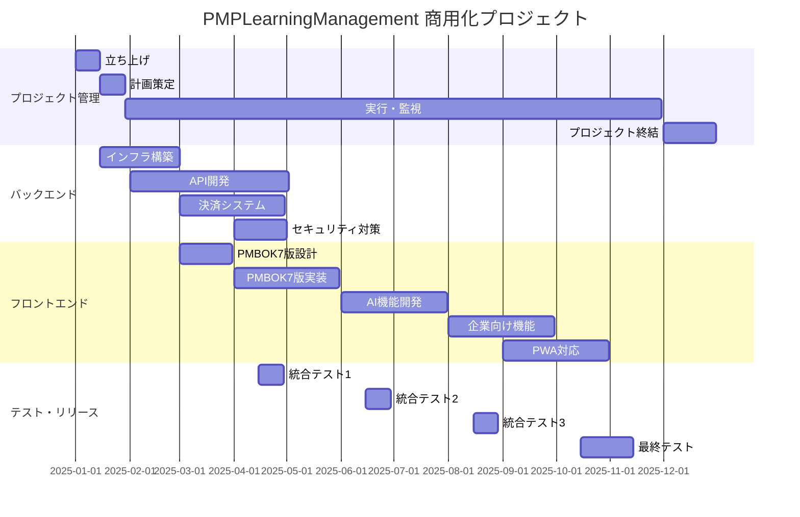
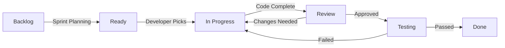

# Planning Documentation

<!-- Consolidated on: 2025-08-09T15:12:24.899Z -->
<!-- Source files: PROJECT_MANAGEMENT_PLAN.md, SPRINT_PLAN.md, GITHUB_ISSUE_MANAGEMENT_PLAN.md, PRODUCT_ROADMAP.md, MIGRATION_ROADMAP.md -->

## Table of Contents

1. [PROJECT MANAGEMENT PLAN](#project-management-plan)
2. [SPRINT PLAN](#sprint-plan)
3. [GITHUB ISSUE MANAGEMENT PLAN](#github-issue-management-plan)
4. [PRODUCT ROADMAP](#product-roadmap)
5. [MIGRATION ROADMAP](#migration-roadmap)

---

## PROJECT MANAGEMENT PLAN

_Source: `docs/guides/PROJECT_MANAGEMENT_PLAN.md`_

**プロジェクト名:** PMPLearningManagement 商用化プロジェクト  
**計画書作成日:** 2025年1月9日  
**プロジェクト期間:** 2025年1月1日 - 2025年12月31日  
**総予算:** 3,000万円  
**プロジェクトマネージャー:** [PM名]

---

## 1. プロジェクト憲章

### 1.1 プロジェクト目的

PMBOK学習支援WebアプリケーションをGitHub Pages上の無料版から、モノリスファーストアプローチで商用サービスへ段階的に進化させ、持続可能なビジネスモデルを確立する。

### 1.2 プロジェクト目標

#### ビジネス目標（現実的に修正）

- **収益目標:** 初年度売上高2,000万円達成
- **顧客獲得:** 有料会員500名獲得（年度末時点）
- **市場シェア:** 国内PMP学習アプリ市場シェア5%獲得
- **損益分岐:** 8-10ヶ月で達成

#### プロダクト目標

- **MAU:** Q4時点で20,000人達成
- **有料転換率:** 10%以上維持
- **NPS:** 40以上達成
- **顧客満足度:** 4.5/5.0以上

### 1.3 スコープ定義

#### インスコープ

1. **モノリスMVP構築（3ヶ月）**
   - Next.js 14への移行
   - NextAuth.js認証システム
   - Stripe基本統合
   - PostgreSQLデータベース実装
   - LocalStorageデータ移行

2. **機能拡張（4-6ヶ月）**
   - PMBOK第7版対応
   - OpenAI APIを使ったAIアシスタント
   - 基本的な企業向け機能
   - PWA化

3. **運用基盤**
   - Sentry + Vercel Analytics
   - GitHub Actions CI/CD
   - Vercelホスティング

#### アウトオブスコープ

- ネイティブモバイルアプリ開発（iOS/Android） - 将来検討
- マイクロサービス化 - 必要に応じて
- オンプレミス対応 - 将来検討
- カスタマイズ型企業研修システム - 将来検討

### 1.4 成功基準

| カテゴリ | 成功基準           | 測定指標          |
| -------- | ------------------ | ----------------- |
| 財務     | 損益分岐点達成     | 月額売上500万円   |
| 顧客     | 顧客満足度向上     | NPS 40以上        |
| 品質     | システム安定性     | 可用性99.5%以上   |
| 納期     | マイルストーン遵守 | 遅延率10%以下     |
| チーム   | 生産性向上         | ベロシティ20%向上 |

### 1.5 制約条件（現実的に修正）

- **予算制約:** 初期開発600-900万円
- **人的リソース:** 2-3名のフルスタックエンジニア
- **技術制約:** 既存30+のReactコンポーネントの活用必須
- **法規制:** 個人情報保護法、特定商取引法準拠
- **インフラ:** 初期は$0-20/月、成長に応じて段階的拡張

### 1.6 前提条件

- 既存のGitHub Pages環境は継続利用（無料版用）
- 開発チームのReact/Node.js技術スキル保有
- Stripe決済システムのAPI利用可能
- AWS/GCPのクラウド環境利用可能
- PMBOK第7版の日本語資料入手可能

---

## 2. WBS（作業分解構造）

### 2.1 プロジェクト管理

```
1.0 プロジェクト管理
├── 1.1 プロジェクト立ち上げ
│   ├── 1.1.1 キックオフ会議
│   ├── 1.1.2 チーム編成
│   └── 1.1.3 開発環境構築
├── 1.2 計画
│   ├── 1.2.1 詳細計画策定
│   ├── 1.2.2 リスク分析
│   └── 1.2.3 品質計画
├── 1.3 実行・監視
│   ├── 1.3.1 進捗管理
│   ├── 1.3.2 品質管理
│   └── 1.3.3 変更管理
└── 1.4 終結
    ├── 1.4.1 プロジェクト評価
    └── 1.4.2 知識移転
```

### 2.2 MVP開発（Month 1-3）

```
2.0 MVP開発
├── 2.1 Next.js移行
│   ├── 2.1.1 環境構築
│   ├── 2.1.2 既存30+コンポーネント移行
│   └── 2.1.3 ルーティング設定
├── 2.2 API開発
│   ├── 2.2.1 tRPC設定
│   ├── 2.2.2 NextAuth.js認証
│   └── 2.2.3 Stripe決済統合
├── 2.3 データベース
│   ├── 2.3.1 Prismaスキーマ設計
│   ├── 2.3.2 PostgreSQLセットアップ
│   └── 2.3.3 データ移行ツール
└── 2.4 デプロイ
    ├── 2.4.1 Vercel設定
    └── 2.4.2 GitHub Actions
```

### 2.3 機能拡張（Month 4-6）

```
3.0 機能拡張
├── 3.1 PMBOK第7版対応
│   ├── 3.1.1 データモデル設計
│   ├── 3.1.2 UI/UX設計
│   └── 3.1.3 実装・テスト
├── 3.2 AI学習アシスタント
│   ├── 3.2.1 OpenAI API統合
│   ├── 3.2.2 プロンプト設計
│   └── 3.2.3 チャットUI実装
├── 3.3 PMIS機能
│   ├── 3.3.1 プロジェクト管理
│   ├── 3.3.2 タスク管理
│   └── 3.3.3 リソース管理
└── 3.4 PWA対応
    ├── 3.4.1 Service Worker
    └── 3.4.2 オフライン機能
```

### 2.4 主要マイルストーン（現実的なスケジュール）

| マイルストーン       | 完了予定日 | 成果物            |
| -------------------- | ---------- | ----------------- |
| M1: プロジェクト開始 | 2025/01/15 | キックオフ完了    |
| M2: Next.js環境構築  | 2025/02/15 | 開発環境完成      |
| M3: MVPリリース      | 2025/04/15 | 基本機能実装完了  |
| M4: 機能拡張完了     | 2025/06/30 | PMBOK7版、AI機能  |
| M5: 本格リリース     | 2025/07/31 | v1.0正式リリース  |
| M6: 成長フェーズ     | 2025/10/31 | ユーザー500名達成 |
| M7: 年度評価         | 2025/12/31 | 次年度計画策定    |

---

## 3. スケジュール計画

### 3.1 マスタースケジュール



### 3.2 クリティカルパス

以下の作業がクリティカルパスを構成:

1. **インフラ構築** → **認証API開発** → **決済API統合** → **MVP版リリース**
2. **PMBOK7版データ設計** → **実装** → **AI基盤統合** → **v2.5リリース**

**クリティカルパス期間:** 240日  
**総バッファ:** 30日（12.5%）

### 3.3 バッファ管理

| バッファ種別           | 配置           | 日数 | 用途           |
| ---------------------- | -------------- | ---- | -------------- |
| プロジェクトバッファ   | 最終工程       | 30日 | 全体遅延吸収   |
| フィーディングバッファ | 各統合ポイント | 7日  | 統合リスク対応 |
| リソースバッファ       | 外部連携作業   | 5日  | 調整遅延対応   |

---

## 4. リソース計画

### 4.1 組織体制（現実的な体制）

```
プロジェクトスポンサー
        │
プロジェクトマネージャー（パートタイム）
        └── 開発チーム
            ├── フルスタックエンジニア（2名）
            └── 外部リソース
                └── UIデザイナー（必要時のみ）

※ 成長に応じて段階的に体制拡大
```

### 4.2 必要スキルマトリックス

| 役割             | 必要スキル                 | レベル   | 人数 | 調達方法 |
| ---------------- | -------------------------- | -------- | ---- | -------- |
| PM               | PMP、アジャイル            | 上級     | 1    | 内部     |
| テクニカルリード | React、Node.js、AWS        | 上級     | 1    | 内部     |
| バックエンド     | Node.js、PostgreSQL、Redis | 中級以上 | 2    | 内部     |
| フロントエンド   | React、TypeScript、D3.js   | 中級以上 | 2    | 内部     |
| フルスタック     | React、Node.js、DevOps     | 中級     | 1    | 内部     |
| QA               | 自動テスト、性能テスト     | 中級     | 1    | 内部     |
| UIデザイナー     | Figma、Web デザイン        | 中級     | 1    | 外部     |

### 4.3 RACI マトリックス

| タスク       | PM  | TL  | 開発 | QA  | スポンサー |
| ------------ | --- | --- | ---- | --- | ---------- |
| 要件定義     | A   | R   | C    | C   | I          |
| 設計承認     | R   | A   | C    | I   | I          |
| 実装         | I   | C   | R    | I   | -          |
| テスト       | C   | I   | C    | R/A | -          |
| リリース承認 | R   | C   | I    | C   | A          |
| 予算承認     | R   | C   | I    | -   | A          |

**凡例:** R=実行責任、A=説明責任、C=協議先、I=情報共有先

### 4.4 調達計画

| 調達項目         | 予算       | 調達時期   | 調達方法 |
| ---------------- | ---------- | ---------- | -------- |
| AWS インフラ     | 360万円/年 | 2025/01    | 直接契約 |
| Stripe決済       | 手数料3.6% | 2025/03    | API契約  |
| OpenAI API       | 60万円/年  | 2025/06    | 従量課金 |
| セキュリティ診断 | 150万円    | 2025/04    | 外注     |
| UIデザイン       | 120万円    | 2025/02-10 | 業務委託 |

---

## 5. 予算計画

### 5.1 コスト見積もり（現実的な予算）

| カテゴリ               | 項目                                | 金額（万円） | 構成比   |
| ---------------------- | ----------------------------------- | ------------ | -------- |
| **人件費**             |                                     | **600**      | **67%**  |
|                        | フルスタックエンジニア（2名×3ヶ月） | 450          |          |
|                        | PM（パートタイム×3ヶ月）            | 150          |          |
| **外注費**             |                                     | **100**      | **11%**  |
|                        | UIデザイン（必要時）                | 50           |          |
|                        | その他外注                          | 50           |          |
| **インフラ費**         |                                     | **60**       | **7%**   |
|                        | Vercel/Supabase（初期は無料枠）     | 0            |          |
|                        | 将来のインフラ予備                  | 60           |          |
| **ツール・ライセンス** |                                     | **60**       | **7%**   |
|                        | 開発ツール                          | 30           |          |
|                        | 外部API（OpenAI等）                 | 30           |          |
| **予備費**             |                                     | **80**       | **8%**   |
| **合計**               |                                     | **900**      | **100%** |

※ 6ヶ月での予算は1,500-1,800万円を想定

### 5.2 予算配分（四半期別）

| 四半期 | 予算（万円） | 主要支出項目                           |
| ------ | ------------ | -------------------------------------- |
| Q1     | 900          | 初期投資、インフラ構築、チーム立ち上げ |
| Q2     | 800          | MVP開発、セキュリティ対策              |
| Q3     | 700          | 機能拡張、AI統合                       |
| Q4     | 600          | 企業向け機能、最適化                   |

### 5.3 コストベースライン

```
累積コスト（万円）
3000 |                                    ●
2500 |                              ●
2000 |                        ●
1500 |                  ●
1000 |            ●
 500 |      ●
   0 |●
     +----+----+----+----+----+----+----+
     1月  3月  5月  7月  9月  11月 12月
```

**EV管理指標:**

- CPI（コスト効率）目標: 0.95以上
- SPI（スケジュール効率）目標: 0.90以上

---

## 6. 品質管理計画

### 6.1 品質基準

| 品質特性             | 基準値         | 測定方法         |
| -------------------- | -------------- | ---------------- |
| **機能性**           |                |                  |
| 機能網羅率           | 100%           | 要件カバレッジ   |
| バグ密度             | <5件/KLOC      | 静的解析         |
| **信頼性**           |                |                  |
| 可用性               | 99.5%以上      | 監視ツール       |
| MTBF                 | >720時間       | 障害記録         |
| MTTR                 | <2時間         | 障害記録         |
| **使用性**           |                |                  |
| ユーザビリティスコア | 80/100以上     | ユーザーテスト   |
| 学習曲線             | 1時間以内      | 新規ユーザー調査 |
| **効率性**           |                |                  |
| 応答時間             | <2秒（95%ile） | APM              |
| 同時接続数           | 1000以上       | 負荷テスト       |
| **保守性**           |                |                  |
| コードカバレッジ     | 80%以上        | テストツール     |
| 技術的負債           | <10%           | SonarQube        |

### 6.2 品質保証活動

| フェーズ | QA活動                         | 成果物         |
| -------- | ------------------------------ | -------------- |
| 要件定義 | 要件レビュー                   | レビュー記録   |
| 設計     | 設計レビュー、プロトタイプ評価 | 設計書承認     |
| 実装     | コードレビュー、単体テスト     | テスト結果     |
| 統合     | 統合テスト、性能テスト         | テスト報告書   |
| リリース | 受入テスト、セキュリティ診断   | リリース判定書 |
| 運用     | 監視、インシデント管理         | 運用報告書     |

### 6.3 品質管理活動

**テスト戦略:**

| テストレベル       | カバレッジ目標 | 自動化率 |
| ------------------ | -------------- | -------- |
| 単体テスト         | 80%            | 100%     |
| 統合テスト         | 70%            | 80%      |
| E2Eテスト          | 60%            | 70%      |
| 性能テスト         | 主要シナリオ   | 100%     |
| セキュリティテスト | OWASP Top10    | 50%      |

**品質メトリクス収集:**

- 週次: コードカバレッジ、静的解析結果
- スプリント毎: バグ発見率、修正率
- リリース毎: 品質スコアカード

---

## 7. リスク管理計画

### 7.1 リスク識別

| ID  | リスク                 | カテゴリ | 発生確率 | 影響度 | リスク値 |
| --- | ---------------------- | -------- | -------- | ------ | -------- |
| R01 | 技術者の離職           | 人的     | 中       | 高     | 9        |
| R02 | AWS障害                | 技術     | 低       | 高     | 6        |
| R03 | 決済システム統合遅延   | 外部     | 中       | 中     | 6        |
| R04 | PMBOK7版仕様変更       | 要件     | 低       | 中     | 4        |
| R05 | セキュリティ脆弱性発覚 | 技術     | 中       | 高     | 9        |
| R06 | 競合サービス出現       | 市場     | 高       | 中     | 9        |
| R07 | 予算超過               | 財務     | 中       | 高     | 9        |
| R08 | 法規制変更             | 外部     | 低       | 高     | 6        |

### 7.2 リスク分析（定量分析）

**モンテカルロシミュレーション結果:**

- プロジェクト完了確率（12月31日）: 75%
- 予算内完了確率: 70%
- 期待金額価値（EMV）: -180万円

### 7.3 リスク対応計画

| リスクID | 対応戦略 | 具体的対応                     | 責任者     | トリガー     |
| -------- | -------- | ------------------------------ | ---------- | ------------ |
| R01      | 軽減     | ナレッジ共有、バックアップ体制 | PM         | 離職率5%超   |
| R02      | 転嫁     | マルチリージョン構成、保険     | TL         | SLA違反      |
| R03      | 軽減     | 早期POC、代替手段準備          | 開発リード | 2週間遅延    |
| R05      | 回避     | セキュアコーディング、定期診断 | QA         | 脆弱性検出   |
| R06      | 受容     | 差別化強化、アジャイル対応     | PM         | 競合リリース |
| R07      | 軽減     | 週次予算管理、早期アラート     | PM         | 10%超過      |

### 7.4 リスク監視

- **リスクレビュー頻度:** 隔週
- **リスク指標:**
  - リスク露出額（月次更新）
  - リスク発生率
  - 対策実施率
- **エスカレーション基準:** リスク値12以上

---

## 8. コミュニケーション計画

### 8.1 ステークホルダー分析

| ステークホルダー       | 影響力 | 関心度 | 戦略           |
| ---------------------- | ------ | ------ | -------------- |
| スポンサー（経営層）   | 高     | 高     | 重点管理       |
| 開発チーム             | 中     | 高     | 十分な情報提供 |
| エンドユーザー         | 低     | 高     | 情報提供維持   |
| 営業・マーケティング   | 中     | 中     | 満足維持       |
| 法務・コンプライアンス | 高     | 低     | 監視継続       |

### 8.2 コミュニケーションマトリックス

| 情報               | 送信者     | 受信者             | 頻度 | 方法           | 目的         |
| ------------------ | ---------- | ------------------ | ---- | -------------- | ------------ |
| ステータス報告     | PM         | スポンサー         | 週次 | メール/会議    | 進捗共有     |
| 技術レビュー       | TL         | 開発チーム         | 週次 | 会議           | 技術課題解決 |
| スプリントレビュー | 開発チーム | 全体               | 隔週 | デモ会議       | 成果確認     |
| リスク報告         | PM         | スポンサー         | 月次 | 文書           | リスク管理   |
| リリース通知       | PM         | 全ステークホルダー | 都度 | メール         | 情報共有     |
| 振り返り           | チーム     | チーム             | 隔週 | ワークショップ | 改善         |

### 8.3 会議体

| 会議名                 | 頻度 | 参加者         | 所要時間 | アジェンダ             |
| ---------------------- | ---- | -------------- | -------- | ---------------------- |
| デイリースクラム       | 日次 | 開発チーム     | 15分     | 進捗、課題、予定       |
| 週次PM会議             | 週次 | PM、TL         | 60分     | 進捗、リスク、決定事項 |
| ステアリング会議       | 月次 | PM、スポンサー | 90分     | 全体進捗、予算、承認   |
| スプリントプランニング | 隔週 | 開発チーム     | 120分    | スプリント計画         |
| レトロスペクティブ     | 隔週 | 開発チーム     | 90分     | 振り返り、改善         |

### 8.4 報告書テンプレート

**週次ステータス報告:**

1. エグゼクティブサマリー
2. 進捗状況（計画vs実績）
3. 主要成果
4. 課題と対策
5. 次週予定
6. リスク状況
7. 予算消化状況

---

## 9. 変更管理計画

### 9.1 変更管理プロセス

```
変更要求 → 影響分析 → CCB審査 → 承認/却下 → 実装 → 検証
   ↑                                    ↓
   └──────────── フィードバック ←─────────┘
```

### 9.2 変更管理委員会（CCB）

| 役割     | メンバー               | 権限       |
| -------- | ---------------------- | ---------- |
| 議長     | プロジェクトスポンサー | 最終承認   |
| 副議長   | PM                     | 提案、調整 |
| メンバー | TL                     | 技術評価   |
| メンバー | QAリード               | 品質評価   |
| メンバー | 財務担当               | コスト評価 |

**CCB開催:** 隔週（緊急時は臨時開催）

### 9.3 変更カテゴリと権限

| カテゴリ | 影響範囲            | 承認権限    | SLA      |
| -------- | ------------------- | ----------- | -------- |
| 軽微     | 1人日以内           | TL          | 2営業日  |
| 中程度   | 5人日以内           | PM          | 5営業日  |
| 重大     | 5人日超 or 予算影響 | CCB         | 10営業日 |
| 緊急     | システム停止リスク  | PM→事後承認 | 即時     |

### 9.4 変更影響分析項目

- スコープへの影響
- スケジュールへの影響
- コストへの影響
- 品質への影響
- リスクへの影響
- 他機能への影響
- 技術的実現可能性

---

## 10. 実行・監視計画

### 10.1 KPI/メトリクス

| カテゴリ             | KPI                           | 目標値 | 測定頻度   | アクション閾値 |
| -------------------- | ----------------------------- | ------ | ---------- | -------------- |
| **スケジュール**     |                               |        |            |                |
| SPI                  | スケジュール効率              | ≥0.90  | 週次       | <0.85          |
| マイルストーン達成率 | 期日遵守率                    | 90%    | 月次       | <80%           |
| **コスト**           |                               |        |            |                |
| CPI                  | コスト効率                    | ≥0.95  | 週次       | <0.90          |
| 予算消化率           | 計画vs実績                    | ±10%   | 週次       | ±15%           |
| **品質**             |                               |        |            |                |
| 欠陥密度             | バグ/KLOC                     | <5     | スプリント | >8             |
| テストカバレッジ     | コード網羅率                  | >80%   | 日次       | <70%           |
| **生産性**           |                               |        |            |                |
| ベロシティ           | ストーリーポイント/スプリント | 40     | スプリント | <30            |
| サイクルタイム       | 要求→本番                     | <10日  | 週次       | >15日          |

### 10.2 進捗管理手法

**アジャイル×ウォーターフォールのハイブリッド管理:**

| レベル           | 手法               | ツール     | 更新頻度     |
| ---------------- | ------------------ | ---------- | ------------ |
| プロジェクト全体 | ウォーターフォール | MS Project | 週次         |
| 開発作業         | スクラム           | Jira       | 日次         |
| タスク管理       | カンバン           | Trello     | リアルタイム |
| 進捗可視化       | バーンダウン       | Jira       | 日次         |

### 10.3 ダッシュボード構成

**エグゼクティブダッシュボード:**

- 全体進捗率（計画vs実績）
- 予算消化状況
- 主要マイルストーン状況
- リスクヒートマップ
- 品質スコア

**開発チームダッシュボード:**

- スプリントバーンダウン
- ベロシティトレンド
- バグ状況
- ビルド成功率
- コードカバレッジ

### 10.4 是正措置プロセス

```
問題検知 → 原因分析 → 対策立案 → 承認 → 実施 → 効果測定
   ↑                                          ↓
   └────────── 不十分な場合は再検討 ←──────────┘
```

**エスカレーション基準:**

| レベル  | 条件                 | エスカレーション先 |
| ------- | -------------------- | ------------------ |
| Level 1 | SPI/CPI < 0.90       | PM                 |
| Level 2 | 2週間以上の遅延      | ステアリング委員会 |
| Level 3 | 予算20%超過リスク    | スポンサー         |
| Level 4 | プロジェクト中止検討 | 経営会議           |

### 10.5 継続的改善

**改善サイクル（2週間スプリント）:**

1. **計測（Measure）**
   - KPI収集
   - 問題点識別

2. **分析（Analyze）**
   - 根本原因分析
   - 改善機会特定

3. **改善（Improve）**
   - 改善策実施
   - プロセス最適化

4. **統制（Control）**
   - 効果測定
   - 標準化

---

## 11. 移行・終結計画

### 11.1 本番移行計画

| フェーズ       | 期間          | 主要活動                 |
| -------------- | ------------- | ------------------------ |
| 移行準備       | 2025/11/01-15 | 環境準備、データ移行計画 |
| パイロット運用 | 2025/11/16-30 | 限定ユーザーでの運用     |
| 段階移行       | 2025/12/01-14 | 順次ユーザー移行         |
| 全面移行       | 2025/12/15    | 全ユーザー移行完了       |
| 安定化         | 2025/12/16-31 | 運用安定化、最適化       |

### 11.2 プロジェクト終結活動

**終結チェックリスト:**

- [ ] 全成果物の納品完了
- [ ] 受入テスト合格
- [ ] ドキュメント完成
- [ ] 知識移転完了
- [ ] 運用引き継ぎ完了
- [ ] 契約終了処理
- [ ] プロジェクト評価実施
- [ ] 教訓の文書化
- [ ] リソース解放
- [ ] 最終報告書作成

### 11.3 成功基準の評価

| 評価項目         | 目標         | 実績 | 達成率 |
| ---------------- | ------------ | ---- | ------ |
| スケジュール遵守 | 2025/12/31   | -    | -      |
| 予算遵守         | 3,000万円    | -    | -      |
| 品質基準達成     | 全項目達成   | -    | -      |
| 顧客満足度       | NPS 40以上   | -    | -      |
| ROI              | 初年度黒字化 | -    | -      |

---

## 12. 付録

### 12.1 用語集

| 用語 | 定義                                               |
| ---- | -------------------------------------------------- |
| MVP  | Minimum Viable Product（実用最小限の製品）         |
| SPI  | Schedule Performance Index（スケジュール効率指数） |
| CPI  | Cost Performance Index（コスト効率指数）           |
| CCB  | Change Control Board（変更管理委員会）             |
| RACI | Responsible, Accountable, Consulted, Informed      |
| PWA  | Progressive Web App                                |
| MTBF | Mean Time Between Failures（平均故障間隔）         |
| MTTR | Mean Time To Repair（平均修復時間）                |

### 12.2 参照文書

1. PMBOKガイド第6版・第7版
2. アジャイル実務ガイド
3. 既存システム設計書（CLAUDE.md）
4. ビジネスケース文書
5. 組織のプロジェクト管理規程

### 12.3 承認

| 役職                     | 氏名 | 署名 | 日付 |
| ------------------------ | ---- | ---- | ---- |
| プロジェクトスポンサー   |      |      |      |
| プロジェクトマネージャー |      |      |      |
| テクニカルリード         |      |      |      |
| 財務責任者               |      |      |      |

---

**文書管理情報:**

- バージョン: 1.0
- 作成日: 2025年1月9日
- 最終更新日: 2025年1月9日
- 次回レビュー予定: 2025年2月1日
- 配布先: プロジェクトチーム、ステークホルダー

---

_本計画書は、プロジェクトの進行に応じて定期的に見直し、必要に応じて更新されます。_

---

## SPRINT PLAN

_Source: `docs/SPRINT_PLAN.md`_

## プロジェクト概要

- **期間**: 12週間 (3ヶ月)
- **スプリント**: 6スプリント × 2週間
- **チーム**: 6名
- **目標**: PMPLearningManagement MVP バックエンド完成

## 全体スケジュール

```
Week 1-2  | Sprint 1: 基盤設計・認証システム
Week 3-4  | Sprint 2: コアAPI・ユーザー管理
Week 5-6  | Sprint 3: 学習機能・決済システム
Week 7-8  | Sprint 4: 通知・データ統合
Week 9-10 | Sprint 5: AI・高度機能
Week 11-12| Sprint 6: 最適化・リリース準備
```

## Sprint 1: 基盤設計・認証システム (Week 1-2)

### 🎯 Sprint Goal

アプリケーションの基盤となる認証システムとプロジェクト構造を確立する

### 📋 User Stories & Tasks

#### Epic 1: プロジェクト基盤構築

**Story Points: 13**

| Task                     | 担当者 | SP  | 優先度 | 詳細                                    |
| ------------------------ | ------ | --- | ------ | --------------------------------------- |
| プロジェクト構造設計     | リード | 3   | P0     | Next.js 14 + TypeScript + tRPC 基盤設計 |
| 開発環境セットアップ     | DevOps | 2   | P0     | Docker, CI/CDパイプライン初期設定       |
| ESLint/Prettier設定      | リード | 1   | P1     | コード品質標準化                        |
| データベース設計レビュー | API    | 2   | P0     | Prismaスキーマ最適化                    |
| 型定義基盤構築           | API    | 2   | P0     | TypeScript型定義とzod schema            |
| ログ・監視基盤           | DevOps | 3   | P1     | ログ収集、メトリクス設定                |

#### Epic 2: 認証・認可システム

**Story Points: 21**

| Task                     | 担当者 | SP  | 優先度 | 詳細                       |
| ------------------------ | ------ | --- | ------ | -------------------------- |
| NextAuth.js設定          | 認証   | 5   | P0     | Google/GitHub OAuth設定    |
| JWT実装・検証            | 認証   | 3   | P0     | トークン管理・リフレッシュ |
| RBAC権限システム         | 認証   | 5   | P0     | Role-Based Access Control  |
| セキュリティミドルウェア | 認証   | 3   | P0     | 認証・認可チェック         |
| パスワード管理           | 認証   | 2   | P1     | ハッシュ化・検証・リセット |
| セッション管理           | 認証   | 3   | P1     | セッション永続化・無効化   |

### 📊 Sprint 1 Capacity Planning

- **Total Story Points**: 34
- **Team Capacity**: 6名 × 10SP = 60SP (余裕率考慮)
- **Focus Factor**: 0.8 (新規プロジェクトのため)

### 🚀 Sprint 1 Deliverables

1. ✅ Next.js 14 + TypeScript プロジェクト構造
2. ✅ NextAuth.js 認証システム動作
3. ✅ RBAC権限管理システム
4. ✅ 基本的なCI/CDパイプライン
5. ✅ 開発環境Docker設定
6. ✅ ログ・監視基盤

---

## Sprint 2: コアAPI・ユーザー管理 (Week 3-4)

### 🎯 Sprint Goal

ユーザー管理APIと基本的なCRUD操作を実装する

### 📋 User Stories & Tasks

#### Epic 3: ユーザー管理API

**Story Points: 18**

| Task                   | 担当者 | SP  | 優先度 | 詳細                         |
| ---------------------- | ------ | --- | ------ | ---------------------------- |
| ユーザーモデル実装     | API    | 3   | P0     | Prismaユーザースキーマ詳細化 |
| プロファイル管理API    | API    | 5   | P0     | CRUD操作・プロファイル更新   |
| 権限管理API            | 認証   | 3   | P0     | 役割変更・権限チェック       |
| アカウント設定API      | API    | 2   | P1     | 設定保存・通知設定           |
| ユーザー検索・フィルタ | API    | 3   | P1     | 管理者向け検索機能           |
| アバター・ファイル管理 | 統合   | 2   | P2     | 画像アップロード・圧縮       |

#### Epic 4: tRPCルーター基盤

**Story Points: 16**

| Task                    | 担当者 | SP  | 優先度 | 詳細                                 |
| ----------------------- | ------ | --- | ------ | ------------------------------------ |
| tRPC設定・ミドルウェア  | リード | 4   | P0     | 基本ルーター設定・エラーハンドリング |
| 入力検証システム        | API    | 3   | P0     | Zod schemaによる型安全な検証         |
| レスポンス標準化        | API    | 2   | P0     | 統一的なAPIレスポンス形式            |
| エラーハンドリング      | リード | 3   | P0     | グローバルエラーハンドラー           |
| APIドキュメント自動生成 | API    | 2   | P1     | OpenAPIドキュメント生成              |
| API Rate Limiting       | 認証   | 2   | P1     | レート制限・DoS防護                  |

### 🚀 Sprint 2 Deliverables

1. ✅ 完全な ユーザー管理API (CRUD)
2. ✅ tRPC基盤とルーティング
3. ✅ 入力検証・エラーハンドリング
4. ✅ API ドキュメント自動生成
5. ✅ 基本的なセキュリティ対策

---

## Sprint 3: 学習機能・決済システム (Week 5-6)

### 🎯 Sprint Goal

学習進捗管理と決済システムのコア機能を実装する

### 📋 User Stories & Tasks

#### Epic 5: 学習進捗管理

**Story Points: 20**

| Task                   | 担当者   | SP  | 優先度 | 詳細                         |
| ---------------------- | -------- | --- | ------ | ---------------------------- |
| 学習進捗データモデル   | ビジネス | 3   | P0     | 進捗・統計・実績モデル       |
| 進捗追跡API            | ビジネス | 5   | P0     | 学習状態更新・取得           |
| 統計・分析機能         | ビジネス | 4   | P0     | 完了率・時間・スコア分析     |
| 学習パス管理           | ビジネス | 3   | P1     | カスタム学習経路             |
| 実績・バッジシステム   | ビジネス | 3   | P1     | 達成度・ゲーミフィケーション |
| 学習データエクスポート | ビジネス | 2   | P2     | CSV・PDF出力                 |

#### Epic 6: 模擬試験システム

**Story Points: 15**

| Task                 | 担当者   | SP  | 優先度 | 詳細                       |
| -------------------- | -------- | --- | ------ | -------------------------- |
| 試験問題データモデル | ビジネス | 2   | P0     | 問題・選択肢・解説管理     |
| 模擬試験エンジン     | ビジネス | 5   | P0     | タイマー・採点・結果管理   |
| 結果分析機能         | ビジネス | 3   | P0     | 知識エリア別分析・弱点抽出 |
| 問題ランダム化       | ビジネス | 2   | P1     | 問題シャッフル・重複回避   |
| 試験履歴管理         | ビジネス | 3   | P1     | 受験履歴・進歩追跡         |

#### Epic 7: 決済システム (Stripe)

**Story Points: 18**

| Task                   | 担当者 | SP  | 優先度 | 詳細                         |
| ---------------------- | ------ | --- | ------ | ---------------------------- |
| Stripe統合基盤         | 統合   | 4   | P1     | Stripe API・SDK設定          |
| サブスクリプション管理 | 統合   | 5   | P1     | プラン管理・課金サイクル     |
| 支払い処理             | 統合   | 3   | P1     | 一時決済・定期課金           |
| WebHook処理            | 統合   | 3   | P1     | 支払い成功・失敗・キャンセル |
| 請求書管理             | 統合   | 2   | P1     | 請求書生成・送信             |
| 返金処理               | 統合   | 1   | P2     | 部分・全額返金               |

### 🚀 Sprint 3 Deliverables

1. ✅ 学習進捗管理システム
2. ✅ 模擬試験エンジン
3. ✅ Stripe決済システム統合
4. ✅ サブスクリプション管理
5. ✅ 統計・分析API

---

## Sprint 4: 通知・データ統合 (Week 7-8)

### 🎯 Sprint Goal

通知システムとデータ統合機能を完成させる

### 📋 User Stories & Tasks

#### Epic 8: 通知システム

**Story Points: 17**

| Task               | 担当者 | SP  | 優先度 | 詳細                         |
| ------------------ | ------ | --- | ------ | ---------------------------- |
| 通知エンジン設計   | 統合   | 3   | P1     | 通知タイプ・テンプレート管理 |
| メール通知システム | 統合   | 4   | P1     | SMTP・テンプレートエンジン   |
| Push通知実装       | 統合   | 3   | P1     | Web Push・モバイル対応       |
| 通知設定管理       | 統合   | 2   | P1     | ユーザー設定・購読管理       |
| 通知キュー処理     | 統合   | 3   | P1     | 非同期処理・再送機能         |
| 通知テンプレート   | 統合   | 2   | P1     | 多言語対応・カスタマイズ     |

#### Epic 9: データ統合・移行

**Story Points: 14**

| Task                   | 担当者 | SP  | 優先度 | 詳細                     |
| ---------------------- | ------ | --- | ------ | ------------------------ |
| LocalStorage移行ツール | API    | 4   | P1     | 既存データ移行スクリプト |
| データバリデーション   | API    | 3   | P1     | 移行データ整合性チェック |
| バックアップシステム   | DevOps | 3   | P1     | 自動バックアップ・復元   |
| データエクスポート機能 | API    | 2   | P1     | ユーザーデータ出力       |
| データインポート機能   | API    | 2   | P2     | 外部データ取り込み       |

#### Epic 10: ファイル管理システム

**Story Points: 12**

| Task                 | 担当者 | SP  | 優先度 | 詳細                     |
| -------------------- | ------ | --- | ------ | ------------------------ |
| ファイルアップロード | 統合   | 3   | P1     | 画像・文書アップロード   |
| ファイル最適化       | 統合   | 2   | P1     | 圧縮・リサイズ・変換     |
| CDN統合              | DevOps | 2   | P1     | CloudFront・配信最適化   |
| ファイル権限管理     | 統合   | 2   | P1     | アクセス制御・共有設定   |
| ストレージ管理       | DevOps | 2   | P2     | 容量制限・クリーンアップ |
| メタデータ管理       | 統合   | 1   | P2     | ファイル情報・検索       |

### 🚀 Sprint 4 Deliverables

1. ✅ 完全な通知システム
2. ✅ データ移行ツール
3. ✅ ファイル管理システム
4. ✅ 自動バックアップ機能

---

## Sprint 5: AI・高度機能 (Week 9-10)

### 🎯 Sprint Goal

AI学習アシスタントと高度な分析機能を実装する

### 📋 User Stories & Tasks

#### Epic 11: AI学習アシスタント

**Story Points: 19**

| Task              | 担当者   | SP  | 優先度 | 詳細                     |
| ----------------- | -------- | --- | ------ | ------------------------ |
| OpenAI API統合    | 統合     | 4   | P2     | GPT-4・Assistant API統合 |
| 学習推奨エンジン  | ビジネス | 5   | P2     | パーソナライズド推奨     |
| 質問応答システム  | ビジネス | 4   | P2     | PMBOKに特化したQ&A       |
| 学習計画生成      | ビジネス | 3   | P2     | AI による学習パス提案    |
| 弱点分析・対策    | ビジネス | 2   | P2     | 学習データ分析・改善提案 |
| AI チャットボット | 統合     | 1   | P3     | リアルタイム学習サポート |

#### Epic 12: 高度分析・レポート

**Story Points: 16**

| Task                   | 担当者   | SP  | 優先度 | 詳細                     |
| ---------------------- | -------- | --- | ------ | ------------------------ |
| 学習分析ダッシュボード | ビジネス | 4   | P2     | 包括的分析表示           |
| 予測分析機能           | ビジネス | 4   | P2     | 合格予測・学習時間予測   |
| 比較分析機能           | ビジネス | 3   | P2     | 他ユーザー・平均との比較 |
| カスタムレポート       | ビジネス | 3   | P2     | ユーザー定義レポート     |
| データ可視化API        | API      | 2   | P2     | グラフ・チャート データ  |

#### Epic 13: PMIS基本機能

**Story Points: 15**

| Task                     | 担当者   | SP  | 優先度 | 詳細                       |
| ------------------------ | -------- | --- | ------ | -------------------------- |
| プロジェクト管理API      | ビジネス | 5   | P2     | 基本的なプロジェクト管理   |
| タスク管理システム       | ビジネス | 4   | P2     | タスク・マイルストーン管理 |
| 文書管理システム         | 統合     | 3   | P2     | バージョン管理・共同編集   |
| 時間追跡機能             | ビジネス | 2   | P2     | 作業時間記録・分析         |
| プロジェクトテンプレート | ビジネス | 1   | P3     | PMBOK準拠テンプレート      |

### 🚀 Sprint 5 Deliverables

1. ✅ AI学習アシスタント (基本機能)
2. ✅ 高度分析・予測機能
3. ✅ PMIS基本機能
4. ✅ カスタムレポート機能

---

## Sprint 6: 最適化・リリース準備 (Week 11-12)

### 🎯 Sprint Goal

パフォーマンス最適化と本番リリース準備を完了する

### 📋 User Stories & Tasks

#### Epic 14: パフォーマンス最適化

**Story Points: 15**

| Task               | 担当者 | SP  | 優先度 | 詳細                       |
| ------------------ | ------ | --- | ------ | -------------------------- |
| データベース最適化 | API    | 4   | P0     | インデックス・クエリ最適化 |
| キャッシュシステム | API    | 3   | P0     | Redis実装・キャッシュ戦略  |
| API最適化          | リード | 3   | P0     | N+1問題解決・バッチ処理    |
| ファイル配信最適化 | DevOps | 2   | P1     | CDN・圧縮・キャッシュ      |
| メモリ最適化       | リード | 2   | P1     | メモリリーク対策・GC最適化 |
| 並行処理最適化     | 統合   | 1   | P1     | 非同期処理・ワーカー最適化 |

#### Epic 15: セキュリティ強化

**Story Points: 12**

| Task                   | 担当者 | SP  | 優先度 | 詳細                     |
| ---------------------- | ------ | --- | ------ | ------------------------ |
| セキュリティ監査       | 認証   | 3   | P0     | OWASP Top 10対策確認     |
| ペネトレーションテスト | 認証   | 3   | P0     | 脆弱性テスト・修正       |
| セキュリティヘッダー   | 認証   | 2   | P0     | HTTPS・CSP・HSTS設定     |
| データ暗号化強化       | 認証   | 2   | P1     | 機密データ暗号化         |
| ログ監視強化           | DevOps | 1   | P1     | セキュリティイベント監視 |
| バックアップ暗号化     | DevOps | 1   | P1     | バックアップデータ保護   |

#### Epic 16: 本番環境準備

**Story Points: 18**

| Task               | 担当者 | SP  | 優先度 | 詳細                           |
| ------------------ | ------ | --- | ------ | ------------------------------ |
| 本番デプロイ準備   | DevOps | 4   | P0     | 本番環境構築・設定             |
| 監視・アラート設定 | DevOps | 3   | P0     | Prometheus・Grafana・PagerDuty |
| ロードバランサ設定 | DevOps | 2   | P0     | 負荷分散・ヘルスチェック       |
| SSL/TLS設定        | DevOps | 2   | P0     | 証明書・暗号化通信             |
| 本番データ移行     | API    | 3   | P0     | データ移行・検証               |
| 災害復旧計画       | DevOps | 2   | P1     | DR・BCP策定                    |
| 運用手順書作成     | 全員   | 2   | P1     | 運用・保守ドキュメント         |

#### Epic 17: 品質保証・テスト

**Story Points: 16**

| Task                   | 担当者 | SP  | 優先度 | 詳細                           |
| ---------------------- | ------ | --- | ------ | ------------------------------ |
| 統合テスト完了         | 全員   | 4   | P0     | E2E・システムテスト            |
| パフォーマンステスト   | DevOps | 3   | P0     | 負荷テスト・ストレステスト     |
| セキュリティテスト     | 認証   | 2   | P0     | 自動化されたセキュリティテスト |
| 回帰テスト             | 全員   | 2   | P0     | 機能退行チェック               |
| アクセシビリティテスト | API    | 2   | P1     | WCAG 2.1対応確認               |
| ブラウザ互換性テスト   | 統合   | 2   | P1     | 主要ブラウザ動作確認           |
| モバイル対応テスト     | 統合   | 1   | P1     | レスポンシブ・タッチ操作       |

### 🚀 Sprint 6 Deliverables

1. ✅ 本番環境完全構築
2. ✅ パフォーマンス最適化完了
3. ✅ セキュリティ監査・対策完了
4. ✅ 包括的テスト完了
5. ✅ 運用ドキュメント完備
6. ✅ **MVP リリース準備完了**

---

## リスク管理・緊急時計画

### 高リスク項目と対策

#### 技術的リスク

1. **AI API制限・コスト**
   - 対策: フォールバック機能・キャッシュ戦略
   - 責任: 統合担当・リード

2. **パフォーマンス問題**
   - 対策: 早期ベンチマーク・段階的最適化
   - 責任: API担当・DevOps

3. **セキュリティ脆弱性**
   - 対策: 継続的セキュリティテスト・監査
   - 責任: 認証担当

#### プロジェクトリスク

1. **スケジュール遅延**
   - 対策: 機能優先度調整・並行開発
   - 責任: リード

2. **統合問題**
   - 対策: 継続的統合・早期統合テスト
   - 責任: 全員

### 成功指標 (OKR)

#### Objective: PMPLearningManagement MVP 成功リリース

**Key Results:**

1. **機能完成度**: P0機能100%、P1機能80%実装
2. **品質**: テストカバレッジ80%、バグ密度<0.5/KLoC
3. **パフォーマンス**: API応答p95<200ms、稼働率99.9%
4. **セキュリティ**: OWASP Top 10完全対応、脆弱性0件
5. **チーム**: 全スプリント目標達成、チーム満足度>8/10

この計画により、効率的で高品質なバックエンド開発を実現し、MVP目標を達成します。

---

## GITHUB ISSUE MANAGEMENT PLAN

_Source: `docs/GITHUB_ISSUE_MANAGEMENT_PLAN.md`_

## Overview

Comprehensive GitHub Issues strategy for managing feature development, bug tracking, and project coordination for the PMP Learning Management System.

## Issue Labeling Strategy

### Category Labels (Type)

| Label                 | Color   | Description                | Usage              |
| --------------------- | ------- | -------------------------- | ------------------ |
| `type:feature`        | #0E8A16 | New feature or enhancement | New functionality  |
| `type:bug`            | #D73A4A | Something isn't working    | Defects and errors |
| `type:security`       | #FF0000 | Security vulnerability     | Security issues    |
| `type:performance`    | #FBCA04 | Performance improvement    | Optimization needs |
| `type:documentation`  | #0075CA | Documentation updates      | Docs and guides    |
| `type:test`           | #7057FF | Testing related            | Test coverage      |
| `type:refactor`       | #008672 | Code refactoring           | Code improvement   |
| `type:infrastructure` | #C5DEF5 | Infrastructure changes     | DevOps, CI/CD      |

### Priority Labels

| Label               | Color   | Description                  | SLA      |
| ------------------- | ------- | ---------------------------- | -------- |
| `priority:critical` | #B60205 | Show-stopper, blocks release | 24 hours |
| `priority:high`     | #D93F0B | Major impact on users        | 3 days   |
| `priority:medium`   | #FBCA04 | Normal priority              | 1 week   |
| `priority:low`      | #0E8A16 | Nice to have                 | 2 weeks  |

### Status Labels

| Label                | Color   | Description               |
| -------------------- | ------- | ------------------------- |
| `status:ready`       | #0E8A16 | Ready for development     |
| `status:in-progress` | #FBCA04 | Currently being worked on |
| `status:blocked`     | #D73A4A | Blocked by dependency     |
| `status:review`      | #0075CA | In code review            |
| `status:testing`     | #7057FF | In testing phase          |
| `status:done`        | #008672 | Completed                 |

### Area Labels

| Label                | Color   | Description              |
| -------------------- | ------- | ------------------------ |
| `area:ui`            | #BFD4F2 | User interface           |
| `area:backend`       | #D4C5F9 | Backend services         |
| `area:mobile`        | #F9D0C4 | Mobile application       |
| `area:pwa`           | #FEF2C0 | Progressive Web App      |
| `area:learning`      | #C2E0C6 | Learning features        |
| `area:visualization` | #BFDADC | Data visualization       |
| `area:collaboration` | #E99695 | Collaboration features   |
| `area:payment`       | #F9C0C4 | Payment and subscription |

### Additional Labels

| Label              | Color   | Description              |
| ------------------ | ------- | ------------------------ |
| `good-first-issue` | #7057FF | Good for newcomers       |
| `help-wanted`      | #008672 | Extra attention needed   |
| `duplicate`        | #CFD3D7 | Duplicate issue          |
| `wontfix`          | #FFFFFF | Will not be worked on    |
| `epic`             | #3E4B9E | Large feature group      |
| `needs-design`     | #F442D1 | Requires design work     |
| `needs-discussion` | #FFEB3B | Requires team discussion |
| `breaking-change`  | #FF5722 | Breaking API change      |

## Milestones

### Q1 2025 Milestones

| Milestone                     | Due Date     | Description                          | Key Features                 |
| ----------------------------- | ------------ | ------------------------------------ | ---------------------------- |
| v2.1.0 - Security Enhancement | Jan 31, 2025 | Security and authentication features | 2FA, SSO prep, audit logging |
| v2.2.0 - AI Learning          | Feb 28, 2025 | AI-powered learning features         | Adaptive paths, AI tutor     |
| v2.3.0 - Premium Launch       | Mar 31, 2025 | Monetization and premium features    | Subscriptions, payments      |

### Q2 2025 Milestones

| Milestone                 | Due Date     | Description                | Key Features              |
| ------------------------- | ------------ | -------------------------- | ------------------------- |
| v3.0.0 - Mobile Launch    | Apr 30, 2025 | Native mobile applications | iOS/Android apps          |
| v3.1.0 - International    | May 31, 2025 | Multi-language support     | i18n, regional payments   |
| v3.2.0 - Offline Complete | Jun 30, 2025 | Full offline capability    | Sync, conflict resolution |

## Issue Templates

### 1. Feature Request Template

```markdown
---
name: Feature Request
about: Suggest a new feature for PMP Learning Management
title: '[FEATURE] '
labels: 'type:feature, status:ready'
assignees: ''
---

## Feature Description

## User Story

As a [type of user], I want [goal] so that [benefit].

## Acceptance Criteria

- [ ] Criterion 1
- [ ] Criterion 2
- [ ] Criterion 3

## Technical Requirements

## Design Mockups

## Priority and Impact

- **Priority**: [Critical/High/Medium/Low]
- **Estimated Users Affected**: [Number or percentage]
- **Business Value**: [High/Medium/Low]

## Implementation Approach

## Dependencies

## Success Metrics
```

### 2. Bug Report Template

```markdown
---
name: Bug Report
about: Report a bug in PMP Learning Management
title: '[BUG] '
labels: 'type:bug, status:ready'
assignees: ''
---

## Bug Description

## Steps to Reproduce

1. Go to '...'
2. Click on '...'
3. Scroll down to '...'
4. See error

## Expected Behavior

## Actual Behavior

## Screenshots

## Environment

- **Browser**: [e.g., Chrome 96]
- **OS**: [e.g., Windows 11]
- **Device**: [e.g., Desktop/Mobile]
- **Version**: [e.g., v2.0.0]

## Severity

- [ ] Critical - System unusable
- [ ] High - Major feature broken
- [ ] Medium - Minor feature issue
- [ ] Low - Cosmetic issue

## Additional Context

## Possible Solution
```

### 3. Epic Template

```markdown
---
name: Epic
about: Large feature or initiative
title: '[EPIC] '
labels: 'epic'
assignees: ''
---

## Epic Overview

## Business Objective

## Success Criteria

## User Stories

- [ ] #issue_number - User story 1
- [ ] #issue_number - User story 2
- [ ] #issue_number - User story 3

## Technical Approach

## Timeline

- **Start Date**:
- **Target Completion**:
- **Milestones**:
  - [ ] Milestone 1 - Date
  - [ ] Milestone 2 - Date

## Resources Required

- **Engineering**: X developers
- **Design**: X designers
- **QA**: X testers

## Risks and Mitigation

| Risk   | Impact | Mitigation |
| ------ | ------ | ---------- |
| Risk 1 | High   | Strategy   |

## Dependencies

## Success Metrics

- KPI 1: Target value
- KPI 2: Target value
```

## Priority Matrix for Q1 2025

### Critical Priority Issues (Immediate)

```yaml
- title: 'Implement Two-Factor Authentication'
  labels: ['type:security', 'priority:critical', 'area:backend']
  milestone: 'v2.1.0'
  assignee: 'security-team'

- title: 'Fix Memory Leak in Learning Dashboard'
  labels: ['type:bug', 'priority:critical', 'area:ui']
  milestone: 'v2.1.0'
  assignee: 'frontend-team'

- title: 'Payment Processing Integration'
  labels: ['type:feature', 'priority:critical', 'area:payment']
  milestone: 'v2.3.0'
  assignee: 'backend-team'
```

### High Priority Issues (This Sprint)

```yaml
- title: 'Spaced Repetition Algorithm Implementation'
  labels: ['type:feature', 'priority:high', 'area:learning']
  milestone: 'v2.2.0'
  epic: 'AI-Powered Learning'

- title: 'Real-time Collaboration WebSocket Setup'
  labels: ['type:feature', 'priority:high', 'area:collaboration']
  milestone: 'v2.2.0'

- title: 'Performance Optimization for Large Datasets'
  labels: ['type:performance', 'priority:high', 'area:visualization']
  milestone: 'v2.1.0'
```

### Medium Priority Issues (This Quarter)

```yaml
- title: 'Add Spanish Localization'
  labels: ['type:feature', 'priority:medium', 'area:ui']
  milestone: 'v3.1.0'

- title: 'Implement Learning Analytics Dashboard'
  labels: ['type:feature', 'priority:medium', 'area:learning']
  milestone: 'v2.2.0'

- title: 'Create API Documentation'
  labels: ['type:documentation', 'priority:medium']
  milestone: 'v2.3.0'
```

## Sprint Planning Process

### Sprint Cadence

- **Sprint Duration**: 2 weeks
- **Sprint Planning**: Monday, Week 1
- **Daily Standups**: 9:00 AM daily
- **Sprint Review**: Friday, Week 2
- **Sprint Retrospective**: Friday, Week 2

### Issue Workflow



### Definition of Ready

- [ ] User story is clear and complete
- [ ] Acceptance criteria defined
- [ ] Dependencies identified
- [ ] Estimated (story points)
- [ ] Design approved (if needed)
- [ ] Technical approach agreed

### Definition of Done

- [ ] Code complete and pushed
- [ ] Unit tests written and passing
- [ ] Code reviewed and approved
- [ ] Integration tests passing
- [ ] Documentation updated
- [ ] Deployed to staging
- [ ] QA tested and approved
- [ ] Product owner accepted

## Automation Rules

### GitHub Actions Automation

```yaml
- paths:
    - 'src/components/**'
  labels: ['area:ui']

- paths:
    - 'server/**'
  labels: ['area:backend']

- paths:
    - 'docs/**'
  labels: ['type:documentation']

- label: 'area:ui'
  assignees: ['frontend-team']

- label: 'area:backend'
  assignees: ['backend-team']

- label: 'type:security'
  assignees: ['security-team']

- daysUntilStale: 60
  daysUntilClose: 7
  staleLabel: 'stale'
  exemptLabels: ['priority:critical', 'priority:high', 'epic']
```

### Issue Lifecycle Automation

```yaml

on:
  issues:
    types: [assigned]
  action:
    - add-label: 'status:in-progress'
    - remove-label: 'status:ready'

on:
  pull_request:
    types: [opened]
  action:
    - add-label: 'status:review'
    - remove-label: 'status:in-progress'

on:
  pull_request:
    types: [closed]
  condition:
    merged: true
  action:
    - close-issue: linked
    - add-label: 'status:done'
```

## Metrics and Reporting

### Key Metrics to Track

```typescript
interface IssueMetrics {
  velocity: {
    averageCompletionTime: number
    issuesPerSprint: number
    storyPointsPerSprint: number
  }
  quality: {
    bugsCreated: number
    bugsResolved: number
    bugEscapeRate: number
    regressionRate: number
  }
  efficiency: {
    cycleTime: number
    leadTime: number
    blockedTime: number
    reworkRate: number
  }
  health: {
    openIssues: number
    ageOfOldestIssue: number
    stalledIssues: number
    technicalDebt: number
  }
}
```

### Weekly Report Template

```markdown
## Summary

- **Issues Created**: X
- **Issues Closed**: X
- **In Progress**: X
- **Blocked**: X

## Velocity

- **Story Points Completed**: X
- **Average Cycle Time**: X days
- **Sprint Burndown**: On Track/Behind/Ahead

## Critical Issues

| Issue | Status  | Blocker        | Action            |
| ----- | ------- | -------------- | ----------------- |
| #123  | Blocked | API dependency | Meeting scheduled |

## Upcoming Priorities

1. Issue #456 - Feature X
2. Issue #789 - Bug Y
3. Issue #012 - Enhancement Z

## Risks and Concerns

- Risk 1: Description and mitigation
- Risk 2: Description and mitigation

## Team Health

- **Morale**: High/Medium/Low
- **Blockers Resolved**: X
- **Help Needed**: Areas requiring assistance
```

## Issue Creation Guidelines

### Best Practices

1. **Clear Titles**: Use descriptive, action-oriented titles
2. **Complete Description**: Provide all necessary context
3. **Proper Labels**: Apply all relevant labels
4. **Assign Milestone**: Link to appropriate milestone
5. **Set Priority**: Indicate urgency level
6. **Link Dependencies**: Reference related issues
7. **Add Estimates**: Include story points or time estimates

### Common Pitfalls to Avoid

- ❌ Vague descriptions
- ❌ Missing acceptance criteria
- ❌ No assigned milestone
- ❌ Incorrect priority level
- ❌ Missing technical details
- ❌ No success metrics

## Communication Guidelines

### Issue Comments

- Use @mentions for specific people
- Update status in comments
- Document decisions and changes
- Link to relevant resources
- Keep discussions focused

### Status Updates

```markdown
## Status Update - [Date]

**Progress**:

- Completed X
- Working on Y
- Blocked by Z

**Next Steps**:

- Action 1
- Action 2

**ETA**: [Date]
```

## Tools and Integrations

### Recommended Tools

1. **GitHub CLI**: Quick issue management from terminal
2. **GitHub Desktop**: Visual issue tracking
3. **Slack Integration**: Real-time notifications
4. **Project Boards**: Kanban visualization
5. **GitHub Mobile**: On-the-go management

### CLI Commands

```bash

gh issue create --title "Feature X" --label "type:feature,priority:high"

gh issue list --assignee @me

gh issue view 123

gh issue close 123 --comment "Fixed in PR #456"
```

## Success Metrics

### Team Performance KPIs

- **Issue Resolution Time**: < 5 days average
- **Bug Fix Rate**: 90% within SLA
- **Sprint Completion**: 85% of planned work
- **Code Review Time**: < 24 hours
- **Customer Issues**: < 5 per release

### Project Health Indicators

- **Technical Debt Ratio**: < 20%
- **Test Coverage**: > 80%
- **Documentation Coverage**: 100% for public APIs
- **Security Issues**: 0 critical, < 5 high
- **Performance Benchmarks**: All green

## Continuous Improvement

### Monthly Retrospective Topics

1. Issue management efficiency
2. Label usage and clarity
3. Automation effectiveness
4. Communication quality
5. Process bottlenecks

### Quarterly Review Actions

1. Update label taxonomy
2. Refine issue templates
3. Adjust automation rules
4. Review and update priorities
5. Optimize workflow processes

---

**Last Updated**: January 2025
**Owner**: Project Management Team
**Review Cycle**: Monthly

---

## PRODUCT ROADMAP

_Source: `docs/PRODUCT_ROADMAP.md`_

## Executive Summary

Strategic product roadmap for transforming PMP Learning Management from a feature-rich learning tool into a market-leading certification preparation platform with sustainable revenue growth.

## Vision Statement

**"To become the global standard for PMP certification preparation, empowering 100,000+ project managers to achieve certification success through innovative, accessible, and collaborative learning experiences."**

## Strategic Objectives

1. **User Growth**: Achieve 50,000 active users by end of 2025
2. **Revenue Target**: Reach $100K MRR by Q4 2025
3. **Market Position**: Become top 3 PMP preparation platform globally
4. **User Success**: Maintain 85%+ exam pass rate for active users
5. **Platform Excellence**: Achieve 99.9% uptime and <2s load times

---

## Q1 2025: Foundation & Enhancement

**Theme: "Solidify Core, Prepare for Scale"**

### January 2025 - Sprint 1 & 2

#### Week 1-2: Security & Performance Hardening

- [ ] **Two-Factor Authentication** (High Priority)
  - TOTP implementation
  - SMS backup option
  - Recovery codes generation
  - **Success Metric**: 30% adoption rate

- [ ] **Performance Optimization**
  - Implement React 18 Suspense boundaries
  - Optimize bundle splitting
  - Add resource hints (preload, prefetch)
  - **Success Metric**: Core Web Vitals all green

#### Week 3-4: Learning Enhancement

- [ ] **Spaced Repetition Algorithm** (Critical)
  - Implement SM-2 algorithm
  - Integrate with flashcard system
  - Add learning scheduler
  - **Success Metric**: 20% improvement in retention

### February 2025 - Sprint 3 & 4

#### Week 5-6: AI-Powered Features

- [ ] **Adaptive Learning Path Beta** (High Priority)
  - Initial assessment module
  - Learning style detection
  - Personalized recommendations
  - **Success Metric**: 50% of new users complete assessment

- [ ] **AI Study Assistant** (Experimental)
  - GPT-4 integration for Q&A
  - Concept explanations
  - Practice question generation
  - **Success Metric**: 1000+ interactions/week

#### Week 7-8: Collaboration Features

- [ ] **Real-time Study Groups** (High Priority)
  - WebSocket implementation
  - Shared whiteboard
  - Voice chat integration
  - **Success Metric**: 100+ active groups

### March 2025 - Sprint 5 & 6

#### Week 9-10: Monetization Launch

- [ ] **Premium Tier Launch** (Critical)
  - Payment processing setup
  - Subscription management
  - Feature gating implementation
  - **Success Metric**: 500 paid subscribers

- [ ] **Enterprise Pilot Program**
  - SSO integration (SAML 2.0)
  - Team management dashboard
  - Volume licensing
  - **Success Metric**: 5 enterprise customers

#### Week 11-12: Analytics & Insights

- [ ] **Advanced Analytics Dashboard**
  - Learning pattern analysis
  - Predictive success metrics
  - Comparative analytics
  - **Success Metric**: 80% user engagement

### Q1 Deliverables

- ✅ Enhanced security with 2FA
- ✅ AI-powered learning features
- ✅ Premium subscription model
- ✅ Real-time collaboration
- ✅ Enterprise pilot program

### Q1 Key Metrics

- **Users**: 10,000 → 20,000
- **Revenue**: $0 → $10K MRR
- **NPS Score**: 45 → 55
- **Pass Rate**: 80% → 85%

---

## Q2 2025: Expansion & Mobile

**Theme: "Go Mobile, Go Global"**

### April 2025 - Sprint 7 & 8

#### Mobile Development Phase 1

- [ ] **React Native Setup**
  - Environment configuration
  - Component library migration
  - Navigation implementation
  - **Milestone**: Basic app running

- [ ] **Core Features Port**
  - Flashcards
  - Practice exams
  - Progress tracking
  - **Milestone**: MVP complete

### May 2025 - Sprint 9 & 10

#### Mobile Development Phase 2

- [ ] **Native Features**
  - Push notifications
  - Offline sync
  - Biometric authentication
  - **Milestone**: Beta release

- [ ] **App Store Preparation**
  - iOS submission
  - Google Play submission
  - Marketing materials
  - **Milestone**: Store approval

### June 2025 - Sprint 11 & 12

#### International Expansion

- [ ] **Multi-language Support**
  - Spanish localization
  - Portuguese localization
  - French localization
  - **Success Metric**: 20% international users

- [ ] **Regional Payment Methods**
  - Local payment gateways
  - Currency support
  - Tax compliance
  - **Success Metric**: 15% international revenue

### Q2 Deliverables

- ✅ Native mobile apps (iOS & Android)
- ✅ Multi-language support (3 languages)
- ✅ International payment processing
- ✅ Offline learning capability
- ✅ Push notification system

### Q2 Key Metrics

- **Users**: 20,000 → 35,000
- **Revenue**: $10K → $30K MRR
- **Mobile Users**: 0% → 40%
- **International**: 5% → 20%

---

## Q3 2025: Intelligence & Integration

**Theme: "Smart Learning, Connected Ecosystem"**

### July 2025 - Sprint 13 & 14

#### Advanced AI Features

- [ ] **Intelligent Tutoring System**
  - Real-time mistake correction
  - Concept prerequisite mapping
  - Adaptive difficulty adjustment
  - **Success Metric**: 30% faster mastery

- [ ] **Exam Prediction Model**
  - ML-based success prediction
  - Weak area identification
  - Study time optimization
  - **Success Metric**: 90% prediction accuracy

### August 2025 - Sprint 15 & 16

#### Platform Integrations

- [ ] **LMS Integrations**
  - Moodle plugin
  - Canvas integration
  - Blackboard compatibility
  - **Success Metric**: 50 institutional customers

- [ ] **Productivity Tool Integrations**
  - Slack bot
  - Microsoft Teams app
  - Calendar sync
  - **Success Metric**: 5000+ integrations active

### September 2025 - Sprint 17 & 18

#### Content Expansion

- [ ] **Video Learning Library**
  - 100+ tutorial videos
  - Interactive transcripts
  - Practice exercises
  - **Success Metric**: 4.5+ rating

- [ ] **Community Content Platform**
  - User-generated flashcards
  - Shared study guides
  - Peer review system
  - **Success Metric**: 1000+ contributions

### Q3 Deliverables

- ✅ Advanced AI tutoring system
- ✅ Platform integrations ecosystem
- ✅ Video learning library
- ✅ Community content platform
- ✅ Predictive analytics engine

### Q3 Key Metrics

- **Users**: 35,000 → 50,000
- **Revenue**: $30K → $60K MRR
- **Content Items**: 1K → 10K
- **Engagement**: 30min → 45min daily

---

## Q4 2025: Innovation & Optimization

**Theme: "Next-Gen Learning, Market Leadership"**

### October 2025 - Sprint 19 & 20

#### Emerging Technologies

- [ ] **VR Learning Experiences**
  - 3D process visualization
  - Virtual study rooms
  - Immersive simulations
  - **Success Metric**: 1000+ VR sessions

- [ ] **Blockchain Certificates**
  - Verifiable credentials
  - Achievement NFTs
  - Skill verification
  - **Success Metric**: 500+ certificates issued

### November 2025 - Sprint 21 & 22

#### Platform Optimization

- [ ] **Performance at Scale**
  - CDN implementation
  - Database sharding
  - Microservices migration
  - **Success Metric**: <1s global load time

- [ ] **Advanced Security**
  - Zero-trust architecture
  - E2E encryption
  - Compliance certifications
  - **Success Metric**: SOC 2 compliance

### December 2025 - Sprint 23 & 24

#### 2026 Planning

- [ ] **Platform 2.0 Design**
  - User research
  - Architecture planning
  - Roadmap development
  - **Deliverable**: 2026 strategy document

- [ ] **Market Expansion Strategy**
  - Partnership development
  - Acquisition targets
  - IPO readiness assessment
  - **Deliverable**: Growth strategy

### Q4 Deliverables

- ✅ VR learning modules
- ✅ Blockchain certification
- ✅ Global CDN deployment
- ✅ Enterprise security features
- ✅ 2026 strategic plan

### Q4 Key Metrics

- **Users**: 50,000 → 75,000
- **Revenue**: $60K → $100K MRR
- **Enterprise**: 10 → 50 customers
- **Market Position**: Top 3 globally

---

## Release Strategy

### Release Cadence

- **Major Releases**: Quarterly (v2.0, v3.0, v4.0, v5.0)
- **Minor Releases**: Monthly (v2.1, v2.2, etc.)
- **Patches**: As needed (v2.1.1, v2.1.2, etc.)
- **Hotfixes**: Within 24 hours for critical issues

### Feature Flags Strategy

```javascript
const featureFlags = {
  'ai-tutoring': {
    enabled: true,
    rollout: 0.25, // 25% of users
    groups: ['beta-testers', 'premium-users'],
    regions: ['US', 'UK', 'CA'],
  },
  'vr-learning': {
    enabled: false,
    rollout: 0.0,
    requirements: ['vr-headset', 'premium-subscription'],
  },
}
```

### Rollout Process

1. **Alpha Testing**: Internal team (1 week)
2. **Beta Testing**: Selected users (2 weeks)
3. **Staged Rollout**: 10% → 25% → 50% → 100%
4. **Monitoring**: Real-time metrics and rollback capability
5. **Post-Release**: User feedback and iteration

---

## Risk Management

### Technical Risks

| Risk               | Impact    | Probability | Mitigation                          |
| ------------------ | --------- | ----------- | ----------------------------------- |
| Scalability Issues | High      | Medium      | Progressive infrastructure scaling  |
| Security Breach    | Very High | Low         | Security audits, bug bounty program |
| Platform Outage    | High      | Low         | Multi-region deployment, DR plan    |
| Tech Debt          | Medium    | High        | 20% sprint capacity for refactoring |

### Business Risks

| Risk           | Impact | Probability | Mitigation                                 |
| -------------- | ------ | ----------- | ------------------------------------------ |
| Low Conversion | High   | Medium      | A/B testing, user research                 |
| Competition    | Medium | High        | Unique features, fast iteration            |
| Market Changes | Medium | Medium      | Flexible architecture, pivoting capability |
| Regulatory     | Low    | Low         | Legal consultation, compliance tracking    |

### Mitigation Strategies

- **Weekly Risk Reviews**: Identify and address emerging risks
- **Contingency Planning**: Alternative paths for each major feature
- **User Feedback Loops**: Continuous validation of assumptions
- **Financial Buffer**: 6-month runway maintained
- **Technical Debt Budget**: 20% of development capacity

---

## Success Metrics & KPIs

### North Star Metrics

1. **Monthly Active Users (MAU)**: Target 50,000 by EOY
2. **Monthly Recurring Revenue (MRR)**: Target $100K by EOY
3. **User Success Rate**: Maintain 85%+ exam pass rate
4. **Net Promoter Score (NPS)**: Achieve 60+ score

### Product Metrics

```typescript
interface ProductKPIs {
  acquisition: {
    signups: number // Target: 500/day
    activation: number // Target: 60% complete onboarding
    referrals: number // Target: 20% refer friends
  }
  engagement: {
    dau_mau: number // Target: 40% (Daily/Monthly Active)
    sessionLength: number // Target: 30+ minutes
    features_used: number // Target: 5+ features/session
  }
  retention: {
    day1: number // Target: 80%
    day7: number // Target: 60%
    day30: number // Target: 40%
    day90: number // Target: 30%
  }
  revenue: {
    arpu: number // Target: $2/user
    ltv: number // Target: $50/user
    cac: number // Target: <$10/user
    payback: number // Target: <3 months
  }
}
```

### OKRs (Objectives and Key Results)

#### Q1 2025 OKRs

**Objective**: Establish Premium Business Model

- KR1: Launch subscription tiers with 500+ paid users
- KR2: Achieve $10K MRR
- KR3: Maintain 90% subscriber retention

#### Q2 2025 OKRs

**Objective**: Dominate Mobile Learning

- KR1: Launch iOS and Android apps
- KR2: Achieve 40% mobile usage
- KR3: 4.5+ app store rating

#### Q3 2025 OKRs

**Objective**: Build Learning Intelligence

- KR1: Deploy AI tutoring to 100% of users
- KR2: Improve learning efficiency by 30%
- KR3: Achieve 90% prediction accuracy

#### Q4 2025 OKRs

**Objective**: Achieve Market Leadership

- KR1: Reach 75,000 active users
- KR2: Generate $100K MRR
- KR3: Become top 3 PMP platform

---

## Resource Requirements

### Team Scaling Plan

| Quarter | Engineering | Product | Design | QA  | DevOps | Total |
| ------- | ----------- | ------- | ------ | --- | ------ | ----- |
| Q1 2025 | 6           | 2       | 2      | 2   | 1      | 13    |
| Q2 2025 | 8           | 2       | 2      | 3   | 2      | 17    |
| Q3 2025 | 10          | 3       | 3      | 3   | 2      | 21    |
| Q4 2025 | 12          | 3       | 3      | 4   | 3      | 25    |

### Budget Allocation

```yaml
Q1_2025:
  development: $150,000
  infrastructure: $20,000
  marketing: $30,000
  operations: $25,000
  total: $225,000

Q2_2025:
  development: $200,000
  infrastructure: $30,000
  marketing: $50,000
  operations: $35,000
  total: $315,000

Q3_2025:
  development: $250,000
  infrastructure: $40,000
  marketing: $75,000
  operations: $45,000
  total: $410,000

Q4_2025:
  development: $300,000
  infrastructure: $50,000
  marketing: $100,000
  operations: $55,000
  total: $505,000
```

---

## Communication & Stakeholder Management

### Internal Communication

- **Daily Standups**: 9:00 AM team sync
- **Weekly Reviews**: Friday retrospectives
- **Monthly All-Hands**: Company updates
- **Quarterly Planning**: OKR setting sessions

### External Communication

- **User Updates**: Bi-weekly newsletter
- **Feature Announcements**: Blog posts
- **Community Engagement**: Discord/Slack channels
- **Investor Updates**: Monthly reports

### Feedback Channels

- **In-app Feedback**: Widget for instant feedback
- **User Surveys**: Monthly NPS surveys
- **Feature Requests**: Public roadmap voting
- **Support Tickets**: 24-hour response SLA
- **Community Forums**: Moderated discussions

---

## Conclusion

This roadmap represents our commitment to building the world's best PMP certification preparation platform. Through systematic execution, continuous iteration, and unwavering focus on user success, we will achieve our vision of empowering project managers globally.

### Key Success Factors

1. **User-Centric Development**: Every feature validated by user need
2. **Data-Driven Decisions**: Metrics guide all product choices
3. **Rapid Iteration**: Ship fast, learn faster
4. **Quality Excellence**: Never compromise on user experience
5. **Team Collaboration**: Success through collective effort

### Next Steps

1. Review and approve Q1 priorities
2. Allocate resources and budget
3. Set up tracking dashboards
4. Communicate roadmap to team
5. Begin Sprint 1 planning

**Last Updated**: January 2025
**Next Review**: March 2025
**Owner**: Product Management Team

---

## MIGRATION ROADMAP

_Source: `docs/architecture/MIGRATION_ROADMAP.md`_

## エグゼクティブサマリー

現在のReact SPAから Next.js 14 + TypeScript モノリスアーキテクチャへの段階的移行計画。
既存の33コンポーネントと機能を維持しながら、パフォーマンス、型安全性、スケーラビリティを向上させます。

## 移行目標

### 主要目標

- **パフォーマンス**: 初期ロード時間を50-70%短縮
- **型安全性**: TypeScriptによる実行時エラーの削減
- **SEO**: サーバーサイドレンダリングによる検索エンジン最適化
- **スケーラビリティ**: モノリスアーキテクチャによる段階的拡張

### 成功指標

- Lighthouse スコア: 90+
- TypeScriptカバレッジ: 100%
- テストカバレッジ: 80%+
- ビルド時間: 3分以内

## フェーズ別実装計画

### フェーズ1: 基盤構築（Week 1-2）

#### Week 1: プロジェクトセットアップ

**Day 1-2: Next.js初期化**

```bash

npx create-next-app@14 . --typescript --tailwind --app --src-dir

npm install @prisma/client prisma
npm install @trpc/server @trpc/client @trpc/react-query
npm install next-auth @auth/prisma-adapter
npm install zustand @tanstack/react-query
npm install zod react-hook-form
npm install d3 d3-sankey recharts
```

**Day 3-4: 設定ファイル整備**

- [x] next.config.mjs
- [x] tsconfig.json
- [x] tailwind.config.ts
- [ ] prettier.config.js
- [ ] eslint.config.js
- [ ] jest.config.js

**Day 5: ディレクトリ構造作成**

- [x] 基本ディレクトリ作成
- [ ] パスエイリアス設定
- [ ] gitignore更新

#### Week 2: データベース・認証基盤

**Day 6-7: Prisma設定**

```typescript
// prisma/schema.prisma
- [x] スキーマ定義
- [ ] マイグレーション作成
- [ ] シードデータ作成
```

**Day 8-9: 認証システム**

```typescript
// lib/auth/nextauth.ts
- [ ] NextAuth.js設定
- [ ] プロバイダー設定（Google, GitHub）
- [ ] セッション管理
```

**Day 10: API基盤**

```typescript
// server/trpc/trpc.ts
- [ ] tRPC初期設定
- [ ] コンテキスト作成
- [ ] ミドルウェア設定
```

### フェーズ2: コンポーネント移行（Week 3-4）

#### Week 3: UIコンポーネント移行

**既存コンポーネントのTypeScript化**

優先度1: 基本コンポーネント

- [ ] Navigation.jsx → Navigation.tsx
- [ ] Home.jsx → Home.tsx
- [ ] PageTransition.jsx → PageTransition.tsx

優先度2: 学習機能

- [ ] LearningProgressDashboard.jsx → LearningProgressDashboard.tsx
- [ ] MockExam.jsx → MockExam.tsx
- [ ] FlashCardLearning.jsx → FlashCardLearning.tsx
- [ ] PMPGlossary.jsx → PMPGlossary.tsx

優先度3: 視覚化コンポーネント

- [ ] PMBOKMatrix.jsx → PMBOKMatrix.tsx
- [ ] ITTOForceGraph.jsx → ITTOForceGraph.tsx
- [ ] EnhancedNetworkGraph.jsx → EnhancedNetworkGraph.tsx
- [ ] SankeyDiagram.jsx → SankeyDiagram.tsx

**型定義作成**

```typescript
// types/pmbok.ts
export interface Process {
  id: string
  name: string
  nameJa: string
  knowledgeArea: KnowledgeArea
  processGroup: ProcessGroup
  inputs: ITTO[]
  tools: ITTO[]
  outputs: ITTO[]
}
```

#### Week 4: Shadcn/ui統合

**UIライブラリ移行**

```bash

npx shadcn-ui@latest init
npx shadcn-ui@latest add button card dialog tabs
npx shadcn-ui@latest add form input select checkbox
npx shadcn-ui@latest add toast alert badge avatar
```

**コンポーネント置換マップ**
| 現在 | 移行先 |
|------|--------|
| カスタムButton | shadcn/ui Button |
| カスタムCard | shadcn/ui Card |
| カスタムModal | shadcn/ui Dialog |
| カスタムForm | shadcn/ui Form + react-hook-form |

### フェーズ3: API実装（Week 5-6）

#### Week 5: tRPCルーター実装

**ルーター構成**

```typescript
// server/trpc/router/index.ts
export const appRouter = router({
  auth: authRouter,
  progress: progressRouter,
  exam: examRouter,
  collaboration: collaborationRouter,
  pmbok: pmbokRouter,
})
```

**エンドポイント実装優先順位**

1. 認証関連
   - [ ] register
   - [ ] login
   - [ ] logout
   - [ ] session

2. 学習進捗
   - [ ] getProgress
   - [ ] updateProgress
   - [ ] getStatistics
   - [ ] resetProgress

3. 試験機能
   - [ ] startExam
   - [ ] submitAnswer
   - [ ] finishExam
   - [ ] getResults

#### Week 6: サービス層実装

**ビジネスロジック移行**

```typescript
// server/services/progress/ProgressService.ts
export class ProgressService {
  async updateProgress(userId: string, processId: string, data: UpdateProgressDto) {
    // トランザクション処理
    // キャッシュ更新
    // 通知送信
  }
}
```

**リポジトリ層実装**

```typescript
// server/repositories/ProgressRepository.ts
export class ProgressRepository {
  async findByUserId(userId: string) {
    return await prisma.progress.findMany({
      where: { userId },
      include: {
        /* relations */
      },
    })
  }
}
```

### フェーズ4: 統合・最適化（Week 7-8）

#### Week 7: 機能統合

**ページ実装**

- [ ] app/(public)/page.tsx - ホームページ
- [ ] app/(public)/pmbok/matrix/page.tsx - PMBOKマトリックス
- [ ] app/(auth)/dashboard/page.tsx - ダッシュボード
- [ ] app/(learning)/exam/page.tsx - 模擬試験

**データフェッチング最適化**

```typescript
// React Query設定
const queryClient = new QueryClient({
  defaultOptions: {
    queries: {
      staleTime: 5 * 60 * 1000,
      refetchOnWindowFocus: false,
    },
  },
})
```

#### Week 8: テスト・デプロイ

**テスト実装**

```typescript
// tests/unit/components/PMBOKMatrix.test.tsx
describe('PMBOKMatrix', () => {
  it('should render all 49 processes', () => {
    // テスト実装
  })
})
```

**E2Eテスト**

```typescript
// tests/e2e/learning-flow.spec.ts
test('complete learning flow', async ({ page }) => {
  // ログイン
  // 学習開始
  // 進捗確認
  // 試験実施
})
```

## リスク管理

### 技術的リスク

| リスク             | 影響度 | 発生確率 | 対策                           |
| ------------------ | ------ | -------- | ------------------------------ |
| D3.js互換性問題    | 高     | 中       | 段階的移行、代替ライブラリ検討 |
| パフォーマンス劣化 | 高     | 低       | プロファイリング、最適化       |
| 型定義の複雑性     | 中     | 高       | 段階的型付け、any許容          |
| データ移行エラー   | 高     | 低       | バックアップ、ロールバック計画 |

### ビジネスリスク

| リスク       | 影響度 | 発生確率 | 対策                       |
| ------------ | ------ | -------- | -------------------------- |
| 開発期間超過 | 中     | 中       | バッファ期間確保、MVP優先  |
| 機能欠落     | 高     | 低       | 詳細なテスト、段階リリース |
| ユーザー影響 | 高     | 低       | A/Bテスト、段階的切り替え  |

## チェックリスト

### 移行前チェックリスト

- [ ] 全コンポーネントのバックアップ
- [ ] 依存関係の互換性確認
- [ ] テストケースの準備
- [ ] ロールバック計画の策定

### 各フェーズ完了条件

**フェーズ1完了条件**

- [ ] Next.js 14が正常に起動
- [ ] TypeScript設定完了
- [ ] Prismaデータベース接続確認
- [ ] 基本的な認証フロー動作

**フェーズ2完了条件**

- [ ] 全コンポーネントのTypeScript化
- [ ] Shadcn/ui統合完了
- [ ] コンポーネントテスト通過
- [ ] Storybookで確認可能

**フェーズ3完了条件**

- [ ] 全APIエンドポイント実装
- [ ] データベース操作正常
- [ ] 認証・認可機能動作
- [ ] APIテスト通過

**フェーズ4完了条件**

- [ ] 全機能の統合完了
- [ ] E2Eテスト通過
- [ ] パフォーマンス目標達成
- [ ] 本番環境デプロイ成功

## コマンドリファレンス

### 開発コマンド

```bash

npm run dev

npm run type-check

npm run test
npm run test:e2e

npm run build
npm run build:analyze
```

### データベースコマンド

```bash

npx prisma migrate dev
npx prisma migrate deploy

npx prisma db push

npx prisma studio
```

### デプロイコマンド

```bash

npm run build:production

npm run deploy:production
```

## サポートリソース

### ドキュメント

- [Next.js 14 App Router](https://nextjs.org/docs/app)
- [TypeScript Migration Guide](https://www.typescriptlang.org/docs/handbook/migrating-from-javascript.html)
- [Prisma with Next.js](https://www.prisma.io/nextjs)
- [tRPC with Next.js](https://trpc.io/docs/nextjs)

### 内部ドキュメント

- `/docs/architecture/DIRECTORY_STRUCTURE.md` - ディレクトリ構成
- `/docs/architecture/SYSTEM_ARCHITECTURE_PLAN.md` - システムアーキテクチャ
- `/docs/api/BACKEND_ARCHITECTURE.md` - バックエンドアーキテクチャ
- `/docs/security/SECURITY_IMPLEMENTATION_PLAN.md` - セキュリティ実装

## 連絡先

技術的な質問や課題については、以下のチャンネルで連絡してください：

- Slackチャンネル: #pmp-migration
- 技術リード: tech-lead@example.com
- プロジェクトマネージャー: pm@example.com

---
