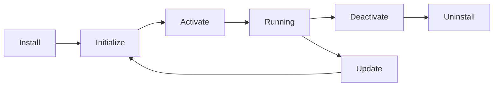

# 🔌 PMPLearningManagement プラグイン開発ガイド

## 概要

PMPLearningManagementは、拡張可能なアーキテクチャを採用しており、カスタムプラグインを通じて機能を拡張できます。本ガイドでは、プラグイン開発の全プロセスを解説します。

## 🏗️ プラグインアーキテクチャ

### コアコンセプト

```javascript
// プラグインの基本構造
export default class MyPlugin {
  static metadata = {
    name: 'my-plugin',
    version: '1.0.0',
    author: 'Your Name',
    description: 'Plugin description',
    dependencies: ['core@^2.0.0'],
    permissions: ['user:read', 'data:write']
  };

  constructor(context) {
    this.context = context;
    this.api = context.api;
    this.config = context.config;
  }

  async initialize() {
    // プラグイン初期化
  }

  async activate() {
    // プラグイン有効化
  }

  async deactivate() {
    // プラグイン無効化
  }
}
```

### プラグインライフサイクル



## 🚀 クイックスタート

### 1. 開発環境セットアップ

```bash
# PLM CLI のインストール
npm install -g @plm/cli

# プラグインプロジェクトの作成
plm create-plugin my-awesome-plugin

# プロジェクトディレクトリに移動
cd my-awesome-plugin

# 依存関係のインストール
npm install

# 開発サーバーの起動
npm run dev
```

### 2. プラグイン構造

```
my-awesome-plugin/
├── src/
│   ├── index.js           # エントリーポイント
│   ├── components/        # UIコンポーネント
│   ├── services/          # ビジネスロジック
│   ├── hooks/             # カスタムフック
│   └── styles/            # スタイルシート
├── public/
│   └── assets/            # 静的リソース
├── tests/
│   ├── unit/              # ユニットテスト
│   └── integration/       # 統合テスト
├── docs/
│   └── README.md          # ドキュメント
├── package.json
├── plm.config.json        # PLM設定
└── manifest.json          # プラグインマニフェスト
```

## 📚 API リファレンス

### Core API

#### データアクセス

```javascript
// ユーザーデータの取得
const user = await this.api.users.getCurrentUser();

// プロジェクトデータの取得
const projects = await this.api.projects.list({
  filter: { status: 'active' },
  sort: { createdAt: 'desc' },
  limit: 10
});

// カスタムデータの保存
await this.api.storage.set('my-plugin-data', {
  settings: { theme: 'dark' },
  lastSync: Date.now()
});
```

#### UI拡張

```javascript
// メニュー項目の追加
this.api.ui.menu.add({
  id: 'my-plugin-menu',
  label: 'My Plugin',
  icon: 'puzzle',
  path: '/plugins/my-plugin',
  position: 'sidebar'
});

// ダッシュボードウィジェットの登録
this.api.ui.dashboard.registerWidget({
  id: 'my-widget',
  title: 'My Custom Widget',
  component: MyWidgetComponent,
  defaultSize: { w: 4, h: 3 },
  minSize: { w: 2, h: 2 }
});

// 通知の表示
this.api.ui.notify({
  type: 'success',
  title: 'Operation Complete',
  message: 'Your data has been saved successfully'
});
```

#### イベントシステム

```javascript
// イベントリスナーの登録
this.api.events.on('project:created', async (project) => {
  console.log('New project created:', project);
  await this.handleNewProject(project);
});

// カスタムイベントの発火
this.api.events.emit('my-plugin:action', {
  action: 'data-processed',
  timestamp: Date.now(),
  data: processedData
});

// イベントの購読解除
const unsubscribe = this.api.events.on('user:login', handler);
// 後でクリーンアップ
unsubscribe();
```

### Hook System

```javascript
// フックの登録
this.api.hooks.add('before:save:project', async (project) => {
  // プロジェクト保存前の処理
  if (!project.name) {
    throw new Error('Project name is required');
  }
  return {
    ...project,
    modifiedBy: this.context.currentUser.id,
    modifiedAt: new Date().toISOString()
  };
});

// フィルターの追加
this.api.hooks.addFilter('project:list:query', (query) => {
  // クエリの修正
  return {
    ...query,
    customField: 'customValue'
  };
});
```

## 🎨 UI コンポーネント開発

### React コンポーネント

```jsx
import React, { useState, useEffect } from 'react';
import { usePlugin } from '@plm/plugin-sdk';
import { Card, Button, Input } from '@plm/ui';

export function MyPluginComponent() {
  const { api, config } = usePlugin();
  const [data, setData] = useState(null);

  useEffect(() => {
    loadData();
  }, []);

  const loadData = async () => {
    const result = await api.data.fetch('/my-endpoint');
    setData(result);
  };

  return (
    <Card title="My Plugin">
      <div className="p-4">
        <h2>Welcome to My Plugin</h2>
        {data && <pre>{JSON.stringify(data, null, 2)}</pre>}
        <Button onClick={loadData}>Refresh Data</Button>
      </div>
    </Card>
  );
}
```

### スタイリング

```css
/* Tailwind CSS クラスの使用 */
.my-plugin-container {
  @apply p-4 bg-white dark:bg-gray-800 rounded-lg shadow-md;
}

/* カスタムCSS変数 */
:root {
  --my-plugin-primary: #3b82f6;
  --my-plugin-secondary: #10b981;
}
```

## 🔒 セキュリティ

### パーミッション

```javascript
// manifest.json でパーミッションを宣言
{
  "permissions": [
    "user:read",
    "project:write",
    "api:external",
    "storage:unlimited"
  ]
}

// 実行時のパーミッションチェック
if (await this.api.permissions.check('project:delete')) {
  // 削除処理を実行
} else {
  throw new Error('Permission denied');
}
```

### データ検証

```javascript
import { z } from 'zod';

// スキーマ定義
const ProjectSchema = z.object({
  name: z.string().min(1).max(100),
  description: z.string().optional(),
  startDate: z.date(),
  budget: z.number().positive()
});

// バリデーション
try {
  const validatedData = ProjectSchema.parse(inputData);
  await this.api.projects.create(validatedData);
} catch (error) {
  console.error('Validation failed:', error.errors);
}
```

## 🧪 テスティング

### ユニットテスト

```javascript
import { describe, it, expect, beforeEach } from 'vitest';
import { MyPlugin } from '../src/index';
import { createMockContext } from '@plm/testing';

describe('MyPlugin', () => {
  let plugin;
  let context;

  beforeEach(() => {
    context = createMockContext();
    plugin = new MyPlugin(context);
  });

  it('should initialize correctly', async () => {
    await plugin.initialize();
    expect(plugin.isInitialized).toBe(true);
  });

  it('should handle data processing', async () => {
    const input = { value: 42 };
    const result = await plugin.processData(input);
    expect(result.processed).toBe(true);
    expect(result.value).toBe(84);
  });
});
```

### 統合テスト

```javascript
import { test, expect } from '@playwright/test';

test('plugin functionality', async ({ page }) => {
  // PLMアプリケーションにログイン
  await page.goto('http://localhost:5173');
  await page.fill('[name="email"]', 'test@example.com');
  await page.fill('[name="password"]', 'password');
  await page.click('button[type="submit"]');

  // プラグインページに移動
  await page.click('text=My Plugin');
  
  // 機能テスト
  await expect(page.locator('h1')).toContainText('My Plugin');
  await page.click('button:has-text("Load Data")');
  await expect(page.locator('.data-container')).toBeVisible();
});
```

## 📦 パブリッシング

### 1. ビルド

```bash
# プロダクションビルド
npm run build

# バンドルサイズの確認
npm run analyze
```

### 2. バージョニング

```bash
# セマンティックバージョニング
npm version patch  # 1.0.0 -> 1.0.1
npm version minor  # 1.0.0 -> 1.1.0
npm version major  # 1.0.0 -> 2.0.0
```

### 3. パブリッシュ

```bash
# PLM Registry への公開
plm publish

# プライベートレジストリへの公開
plm publish --registry https://your-registry.com
```

## 🛠️ 開発ツール

### PLM CLI コマンド

```bash
# プラグインの作成
plm create-plugin <name>

# 開発サーバー
plm dev

# ビルド
plm build

# テスト
plm test

# リント
plm lint

# 公開
plm publish

# プラグインのインストール
plm install <plugin-name>

# プラグインの更新
plm update <plugin-name>

# プラグインの削除
plm uninstall <plugin-name>
```

### VS Code 拡張

PLM開発を効率化するVS Code拡張機能：

- **PLM IntelliSense**: API自動補完
- **PLM Snippets**: コードスニペット
- **PLM Debugger**: デバッグツール
- **PLM Validator**: リアルタイム検証

## 📖 ベストプラクティス

### パフォーマンス

1. **遅延ロード**: 必要な時にのみリソースをロード
2. **メモ化**: 計算結果のキャッシュ
3. **仮想化**: 大量データの効率的な表示
4. **Web Worker**: 重い処理のバックグラウンド実行

### UX設計

1. **一貫性**: PLMのデザインシステムに準拠
2. **レスポンシブ**: モバイルデバイス対応
3. **アクセシビリティ**: WCAG 2.1 AA準拠
4. **国際化**: 多言語対応

### エラーハンドリング

```javascript
class PluginError extends Error {
  constructor(message, code, details) {
    super(message);
    this.name = 'PluginError';
    this.code = code;
    this.details = details;
  }
}

try {
  await riskyOperation();
} catch (error) {
  // ユーザーフレンドリーなエラー表示
  this.api.ui.notify({
    type: 'error',
    title: 'Operation Failed',
    message: 'Please try again later'
  });
  
  // 詳細なログ記録
  this.api.logger.error('Operation failed', {
    error,
    context: getCurrentContext()
  });
}
```

## 🤝 コミュニティ

### リソース

- **開発者フォーラム**: [forum.pmlearning.com/developers](https://forum.pmlearning.com/developers)
- **GitHub**: [github.com/pmlearning/plugins](https://github.com/pmlearning/plugins)
- **Discord**: [discord.gg/pmlearning](https://discord.gg/pmlearning)
- **Stack Overflow**: タグ `plm-plugin`

### サンプルプラグイン

- [Calendar Integration](https://github.com/pmlearning/plugin-calendar)
- [Advanced Analytics](https://github.com/pmlearning/plugin-analytics)
- [AI Assistant](https://github.com/pmlearning/plugin-ai)
- [Custom Reports](https://github.com/pmlearning/plugin-reports)

## 📞 サポート

### 技術サポート

- **Email**: plugin-support@pmlearning.com
- **Slack**: pmlearning.slack.com #plugin-dev
- **Office Hours**: 毎週水曜日 15:00-17:00 (JST)

---

*最終更新: 2025-08-16*
*Plugin Development Guide v2.0*