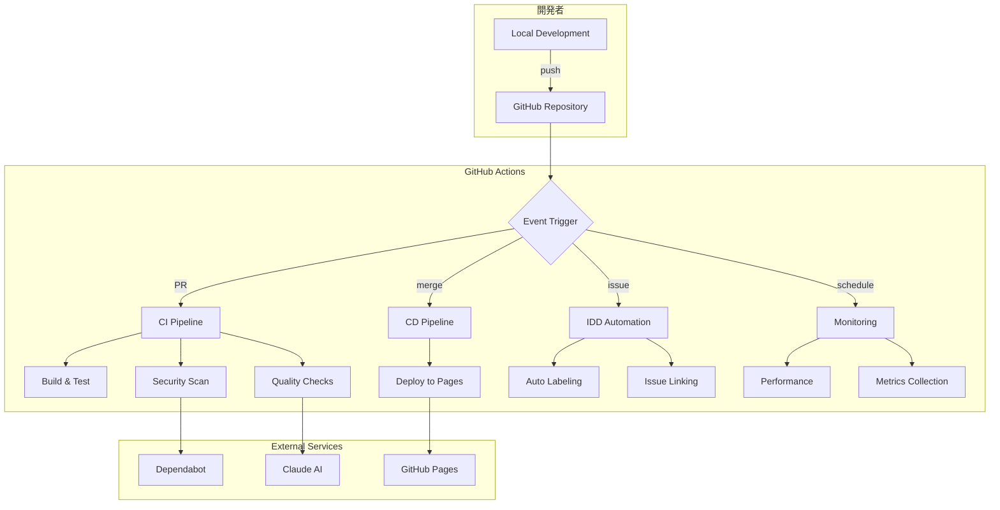
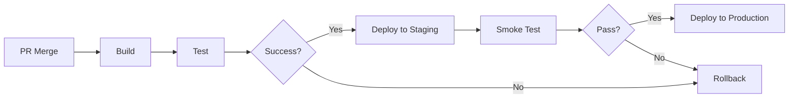
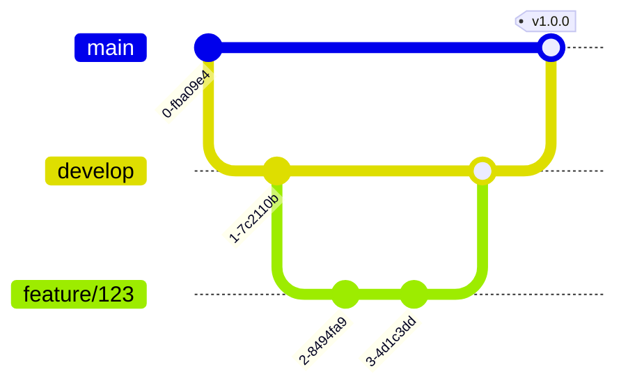

# DevOps基盤 包括的ガイド

## 📋 目次

1. [概要](#概要)
2. [アーキテクチャ](#アーキテクチャ)
3. [ワークフロー体系](#ワークフロー体系)
4. [自動化機能](#自動化機能)
5. [開発フロー](#開発フロー)
6. [モニタリング](#モニタリング)
7. [トラブルシューティング](#トラブルシューティング)
8. [ベストプラクティス](#ベストプラクティス)

## 概要

本プロジェクトのDevOps基盤は、GitHub Actionsを中心とした完全自動化されたCI/CDパイプラインを提供します。Issue-Driven Development (IDD)を基本とし、コード品質、セキュリティ、パフォーマンスを継続的に監視・改善する仕組みを実装しています。

### 主要な特徴

- **完全自動化**: Issue作成からデプロイまでの全プロセスを自動化
- **IDD準拠**: すべての変更がIssueと紐付けられた追跡可能な開発
- **品質保証**: 多層的な品質チェックと自動修正
- **AI統合**: Claude AIによる自動レビューと提案
- **可観測性**: 包括的なメトリクスとログ収集

## アーキテクチャ

### システム構成図



### コンポーネント構成

| コンポーネント | 役割 | 主要ワークフロー |
|--------------|------|-----------------|
| CI Pipeline | ビルド・テスト実行 | ci-*.yml |
| CD Pipeline | デプロイメント管理 | cd-*.yml |
| Quality Assurance | 品質チェック | qa-*.yml |
| Security | セキュリティスキャン | sec-*.yml |
| Performance | パフォーマンス監視 | perf-*.yml |
| IDD Management | Issue管理 | idd-*.yml |
| AI Integration | Claude AI統合 | ai-*.yml |
| DevOps Tools | インフラ・監視 | ops-*.yml |

## ワークフロー体系

### 命名規則

すべてのワークフローは以下の命名規則に従います：

```
[カテゴリ]-[番号]-[説明].yml
```

例：
- `ci-01-basic-checks.yml`
- `sec-02-devsecops.yml`
- `ai-03-claude-review.yml`

### カテゴリ一覧

| プレフィックス | カテゴリ | 用途 |
|--------------|---------|------|
| ci- | Continuous Integration | ビルド、テスト、検証 |
| cd- | Continuous Deployment | デプロイメント |
| qa- | Quality Assurance | 品質保証 |
| sec- | Security | セキュリティ |
| perf- | Performance | パフォーマンス |
| idd- | Issue-Driven Dev | Issue管理 |
| ai- | AI Integration | AI統合 |
| ops- | DevOps/Infrastructure | 運用・インフラ |
| meta- | Meta/Management | 管理・調整 |
| reusable- | Reusable Workflows | 再利用可能 |
| docs- | Documentation | ドキュメント |
| misc- | Miscellaneous | その他 |

### 主要ワークフロー

#### CI/CDパイプライン

1. **ci-01-basic-checks.yml**
   - ESLint/Prettier検証
   - TypeScriptコンパイル
   - 基本的な単体テスト

2. **ci-06-integration-test.yml**
   - E2Eテスト実行
   - 統合テスト
   - ブラウザ互換性テスト

3. **cd-01-deploy-pages.yml**
   - GitHub Pagesへのデプロイ
   - ビルド成果物の公開
   - デプロイ通知

#### 品質保証

1. **qa-02-quality-assurance.yml**
   - コードカバレッジ測定
   - 複雑度分析
   - 重複コード検出

2. **qa-07-lighthouse-ci.yml**
   - Core Web Vitals測定
   - アクセシビリティチェック
   - SEO最適化確認

#### セキュリティ

1. **sec-01-basic-scan.yml**
   - 依存関係の脆弱性スキャン
   - ライセンスチェック
   - セキュリティヘッダー確認

2. **sec-02-devsecops.yml**
   - SAST (静的解析)
   - シークレットスキャン
   - コンテナスキャン

## 自動化機能

### Issue管理の自動化

#### 自動ラベリング
```yaml
# idd-05-auto-labeling.yml
- Issue/PR作成時に内容を解析
- 適切なラベルを自動付与
- 優先度・カテゴリを自動分類
```

#### Issue-PR自動リンク
```yaml
# idd-06-pr-issue-link.yml
- PR内のIssue番号を検出
- 自動的にIssueとリンク
- クローズキーワードの自動追加
```

### コードレビューの自動化

#### Claude AIレビュー
```yaml
# ai-claude-comprehensive-review.yml
- PR作成時に自動レビュー
- セキュリティ・パフォーマンス分析
- 改善提案の自動生成
- 品質スコアリング
```

コマンドトリガー：
- `@claude review` - 包括的レビュー
- `@claude security` - セキュリティ重点
- `@claude performance` - パフォーマンス分析
- `@claude architecture` - アーキテクチャ準拠
- `@claude accessibility` - アクセシビリティ
- `@claude mobile` - モバイル対応

### デプロイメントの自動化

#### 自動デプロイフロー


## 開発フロー

### 標準開発プロセス

1. **Issue作成**
   ```bash
   # GitHubでIssueを作成
   # 適切なテンプレートを選択
   # ラベルが自動付与される
   ```

2. **ブランチ作成**
   ```bash
   git checkout -b feature/123-add-new-feature
   # Issue番号を含むブランチ名
   ```

3. **開発・コミット**
   ```bash
   # 開発作業
   git add .
   git commit -m "feat: 新機能追加 #123"
   # Issue番号を含むコミットメッセージ
   ```

4. **PR作成**
   ```bash
   git push origin feature/123-add-new-feature
   # GitHub上でPR作成
   # 自動的にIssueがリンクされる
   ```

5. **自動チェック**
   - CI/CDパイプライン実行
   - Claude AIレビュー
   - 品質チェック

6. **マージ・デプロイ**
   - レビュー承認後にマージ
   - 自動デプロイ実行
   - Issueが自動クローズ

### ブランチ戦略



- **main**: 本番環境
- **develop**: 開発環境
- **feature/[issue-number]**: 機能開発
- **hotfix/[issue-number]**: 緊急修正

## モニタリング

### メトリクス収集

#### パフォーマンスメトリクス
- ビルド時間
- テスト実行時間
- デプロイ時間
- バンドルサイズ

#### 品質メトリクス
- コードカバレッジ
- 技術的負債
- 循環的複雑度
- 重複コード率

#### 運用メトリクス
- デプロイ頻度
- 平均修復時間 (MTTR)
- 変更失敗率
- リードタイム

### アラート設定

```yaml
# 閾値設定例
alerts:
  build_time: > 10分
  test_coverage: < 80%
  bundle_size: > 5MB
  vulnerability: critical
```

## トラブルシューティング

### よくある問題と解決策

#### 1. ワークフローが実行されない

**原因**: 権限不足、YAMLシンタックスエラー
**解決**:
```bash
# YAML検証
yamllint .github/workflows/*.yml

# 権限確認
gh workflow list
```

#### 2. デプロイ失敗

**原因**: ビルドエラー、権限エラー
**解決**:
```bash
# ローカルでビルド確認
npm run build

# デプロイトークン確認
gh secret list
```

#### 3. テスト失敗

**原因**: 環境差異、依存関係
**解決**:
```bash
# 依存関係クリーンインストール
rm -rf node_modules package-lock.json
npm install

# テスト実行
npm test
```

### デバッグ方法

#### ワークフローデバッグ
```yaml
# デバッグモード有効化
env:
  ACTIONS_RUNNER_DEBUG: true
  ACTIONS_STEP_DEBUG: true
```

#### ローカル実行
```bash
# act を使用したローカル実行
act -j build
```

## ベストプラクティス

### コミットメッセージ

```
<type>: <description> #<issue-number>

[optional body]

[optional footer]
```

例：
```
feat: ユーザー認証機能を追加 #123

- JWTトークンベースの認証
- リフレッシュトークン対応
- セッション管理改善

Closes #123
```

### PR作成

1. **適切なサイズ**: 1PRあたり200-400行以内
2. **明確な説明**: 変更内容と理由を記載
3. **テスト追加**: 新機能には必ずテスト
4. **ドキュメント更新**: 必要に応じて更新

### ワークフロー作成

1. **再利用性**: 共通処理は reusable workflow化
2. **並列実行**: 独立したジョブは並列化
3. **キャッシュ活用**: 依存関係をキャッシュ
4. **条件付き実行**: 不要な実行を避ける

### セキュリティ

1. **シークレット管理**: GitHub Secretsを使用
2. **最小権限**: 必要最小限の権限設定
3. **監査ログ**: すべての操作を記録
4. **定期スキャン**: 脆弱性の定期チェック

## 参考リンク

- [GitHub Actions ドキュメント](https://docs.github.com/actions)
- [IDD実装ガイド](../idd/IDD_IMPLEMENTATION_STATUS.md)
- [ワークフロー仕様書](./WORKFLOW_SPECIFICATIONS.md)
- [Claude統合ガイド](../guides/CLAUDE_INTEGRATION_GUIDE.md)

## 更新履歴

- 2024-01-13: 初版作成
- [今後の更新はここに記載]

---

*このドキュメントは継続的に更新されます。最新情報は[GitHubリポジトリ](https://github.com/yusuke-kurosawa/PMPLearningManagement)を確認してください。*