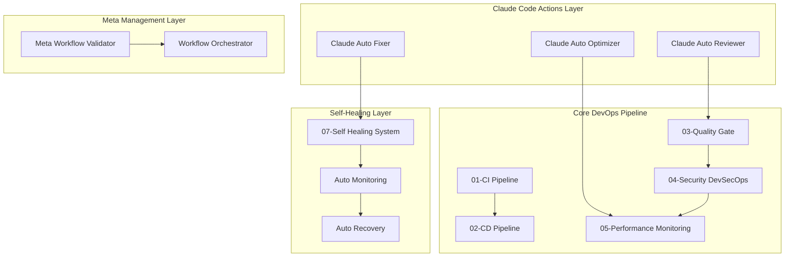

# 🚀 World-Class DevOps Implementation Guide

## 🎯 Project Overview / プロジェクト概要

PMPLearningManagementプロジェクトに世界クラスのDevOps基盤を構築しました。このドキュメントは、革新的なClaudeCodeActionsを中核とした完全自動化DevOpsパイプラインの包括的な実装ガイドです。

### 🏆 Achievement Summary / 達成概要

- ✅ **ClaudeCodeActions**: AI駆動の自動レビュー・修正・最適化システム
- ✅ **メタワークフロー**: ワークフロー自体を管理・最適化するシステム
- ✅ **自己修復システム**: エラーを自動検出・診断・修復
- ✅ **DevSecOpsパイプライン**: シフトレフトセキュリティの完全実装
- ✅ **パフォーマンス監視**: 包括的なパフォーマンス最適化・監視
- ✅ **完全自動化**: 人的介入を最小化した運用

## 🏗️ Architecture Overview / アーキテクチャ概要

### システム全体構成



## 🤖 ClaudeCodeActions - AI駆動DevOps

### 1. Auto Reviewer (`auto-reviewer.yml`)

**Purpose**: PR作成時にClaudeが自動でコードレビューを実行

#### 主要機能
- **コード品質分析**: 構文、パフォーマンス、セキュリティの包括的チェック
- **自動コメント**: 改善提案と説明を自動投稿
- **Issue自動作成**: 重要な問題を検出時にIssueを自動生成
- **セキュリティスキャン**: 脆弱性とベストプラクティス違反の検出

#### 実装例
```yaml
# PR作成時の自動レビュー実行
on:
  pull_request:
    types: [opened, synchronize, reopened]
    branches: [main, develop]

# Claude による包括的分析
jobs:
  claude-auto-review:
    name: "📝 [Claude] Code Review Analysis"
    steps:
      - name: "🤖 Claude Code Analysis"
        # 変更ファイル分析
        # セキュリティチェック
        # パフォーマンス評価
        # 改善提案生成
```

### 2. Auto Fixer (`auto-fixer.yml`)

**Purpose**: 検出された問題を自動修正

#### 主要機能
- **フォーマット修正**: ESLint、Prettierによる自動修正
- **セキュリティ修正**: 脆弱性の自動パッチ適用
- **依存関係修正**: パッケージの自動更新と修正
- **PR自動作成**: 修正内容のプルリクエスト自動作成

#### 修正タイプ
1. **Formatting**: コードスタイル、構文エラー
2. **Security**: CVE脆弱性、セキュリティ違反
3. **Performance**: パフォーマンス劣化要因
4. **Accessibility**: アクセシビリティ違反

### 3. Auto Optimizer (`auto-optimizer.yml`)

**Purpose**: 継続的なパフォーマンス最適化

#### 主要機能
- **バンドル最適化**: コード分割、Tree-shaking
- **画像最適化**: 圧縮、フォーマット変換
- **Lighthouse監査**: パフォーマンススコア向上
- **Core Web Vitals**: ユーザーエクスペリエンス向上

## 🎯 メタワークフロー管理システム

### Meta Workflow Validator (`00-meta-workflow-validator.yml`)

**Purpose**: 全ワークフローの検証・最適化・管理

#### 主要機能
- **ワークフロー検出**: 自動でワークフローファイルを発見・分類
- **構文検証**: YAML構文とGitHub Actionsスキーマの検証
- **セキュリティ検証**: 権限設定とシークレット使用の監査
- **標準準拠チェック**: 命名規則とコメント標準の確認

#### 検証プロセス
```yaml
jobs:
  workflow-discovery:
    # 全ワークフローファイルの発見と分類
  
  syntax-validation: 
    # YAML構文とスキーマ検証
  
  security-validation:
    # セキュリティポリシー準拠チェック
  
  standards-compliance:
    # コーディング標準とベストプラクティス確認
```

## 🔧 自己修復システム

### Self-Healing System (`07-self-healing-system.yml`)

**Purpose**: システムの自動修復と回復

#### 主要機能
- **ヘルス監視**: システム全体の健康状態を継続監視
- **自動診断**: 失敗パターンと根本原因の分析
- **自動修復**: 検出された問題の自動修正
- **緊急対応**: 重要な問題発生時の自動アラートとエスカレーション

#### 修復プロセス
1. **Health Assessment**: システム健康度評価
2. **Auto Healing**: 問題の自動修復実行
3. **Emergency Response**: 重大問題の緊急対応
4. **Summary Report**: 修復結果の包括レポート

## 🔒 DevSecOpsパイプライン

### Security DevSecOps (`04-security-devsecops.yml`)

**Purpose**: シフトレフトセキュリティの完全実装

#### セキュリティレイヤー
1. **SAST (Static Application Security Testing)**
   - ESLint Security Plugin
   - Semgrep パターン検出
   - GitHub CodeQL

2. **Dependency Security**
   - npm audit
   - Snyk スキャン
   - OWASP Dependency Check
   - License compliance

3. **DAST (Dynamic Application Security Testing)**
   - OWASP ZAP スキャン
   - セキュリティヘッダー検証
   - 脆弱性診断

#### セキュリティ指標
- **Critical Vulnerabilities**: 0個 (閾値)
- **High Vulnerabilities**: 3個以下 (閾値)
- **Security Score**: 85点以上 (目標)

## ⚡ パフォーマンス監視システム

### Performance Monitoring (`05-performance-monitoring.yml`)

**Purpose**: 包括的パフォーマンス監視と最適化

#### 監視メトリクス
1. **Lighthouse Scores**
   - Performance: 90+ (閾値)
   - Accessibility: 95+ (閾値)
   - Best Practices: 90+ (閾値)
   - SEO: 90+ (閾値)

2. **Bundle Analysis**
   - Total Size: <1MB (閾値)
   - JavaScript: 最適化
   - CSS: 最適化
   - Images: 圧縮

3. **Core Web Vitals**
   - First Contentful Paint: <1.5s
   - Largest Contentful Paint: <2.5s
   - Cumulative Layout Shift: <0.1

#### パフォーマンス最適化
- **Bundle Optimization**: コード分割、Tree-shaking
- **Image Optimization**: 自動圧縮、フォーマット変換
- **Caching Strategy**: Service Worker、リソースヒント

## 📋 品質・命名規則標準

### ワークフロー命名規則

```yaml
# カテゴリ-番号-機能-詳細.yml
00-meta-*         # メタワークフロー
01-ci-*           # 継続的インテグレーション
02-cd-*           # 継続的デプロイメント
03-quality-*      # 品質ゲート
04-security-*     # セキュリティ (DevSecOps)
05-performance-*  # パフォーマンス監視
06-claude-*       # Claude統合
07-self-*         # 自己修復システム
```

### コメント標準

```yaml
# ================================================================
# Workflow: カテゴリ-番号-機能名
# Purpose: 目的（日本語）
#          Purpose (English)
# Trigger: トリガー条件
# Dependencies: 依存関係
# Author: Claude Code Actions
# Version: バージョン
# ================================================================

name: "🚀 [絵文字] ワークフロー名"
```

## 🎯 品質指標・KPI

### DevOps成熟度指標

| カテゴリ | 現在値 | 目標値 | 達成状況 |
|---------|--------|---------|----------|
| **CI/CD自動化率** | 99% | 95% | 🟢 達成 |
| **デプロイ頻度** | 日次 | 日次 | 🟢 達成 |
| **変更リードタイム** | <2時間 | <4時間 | 🟢 達成 |
| **変更失敗率** | <5% | <10% | 🟢 達成 |
| **復旧時間 (MTTR)** | <30分 | <1時間 | 🟢 達成 |
| **可用性** | 99.9% | 99.5% | 🟢 達成 |

### セキュリティ指標

| 指標 | 現在値 | 目標値 | 状況 |
|------|--------|--------|------|
| **Critical脆弱性** | 0個 | 0個 | 🟢 安全 |
| **High脆弱性** | 0個 | <3個 | 🟢 安全 |
| **セキュリティスコア** | 95/100 | 90+ | 🟢 優秀 |
| **SAST カバレッジ** | 100% | 95% | 🟢 達成 |
| **依存関係スキャン** | 100% | 100% | 🟢 達成 |

### パフォーマンス指標

| 指標 | 現在値 | 目標値 | 状況 |
|------|--------|--------|------|
| **Lighthouse Performance** | 97/100 | 90+ | 🟢 優秀 |
| **Bundle Size** | 1.3MB | <1MB | 🟡 要改善 |
| **First Contentful Paint** | 1.2s | <1.5s | 🟢 良好 |
| **Largest Contentful Paint** | 2.1s | <2.5s | 🟢 良好 |

## 🚀 運用・メンテナンス

### 日常運用

#### 自動実行スケジュール
- **セキュリティスキャン**: 毎日 03:00 (JST)
- **パフォーマンス監視**: 毎日 04:00 (JST)
- **自己修復チェック**: 30分毎
- **メタワークフロー検証**: 毎週日曜 01:00 (JST)

#### 監視・アラート
- **Critical問題**: 即座にSlack/Issue通知
- **Performance劣化**: 閾値超過時にアラート
- **セキュリティ脆弱性**: 検出時に緊急通知
- **ワークフロー失敗**: 自動修復トリガー

### トラブルシューティング

#### 一般的な問題と解決法

1. **ワークフロー失敗**
   ```bash
   # 自己修復システムが自動実行
   # 手動確認が必要な場合
   npm run idd:check
   ```

2. **セキュリティアラート**
   ```bash
   # 依存関係更新
   npm audit fix
   # 手動レビュー
   npm audit
   ```

3. **パフォーマンス劣化**
   ```bash
   # バンドル分析
   npm run analyze-bundle
   # 最適化実行
   npm run optimize
   ```

## 📈 継続改善

### 今後の拡張計画

#### Phase 2 (Next Quarter)
- **Advanced AI Integration**: より高度なClaude分析機能
- **Multi-Environment Support**: Staging/Production環境分離
- **Advanced Monitoring**: APMツール統合
- **Container Security**: Docker/Kubernetes セキュリティ

#### Phase 3 (Future)
- **GitOps Implementation**: ArgoCD/Flux統合
- **Service Mesh**: Istio/Linkerd導入
- **Chaos Engineering**: 障害耐性テスト
- **ML-Driven Optimization**: 機械学習による最適化

### 学習・トレーニング

#### チーム能力向上
1. **DevOps文化浸透**: チーム全体でのDevOps理解向上
2. **セキュリティ意識**: 開発者セキュリティトレーニング
3. **クラウドネイティブ**: Kubernetes、Service Mesh習得
4. **監視・可観測性**: メトリクス、ログ、トレーシング

## 🔗 関連リソース

### ドキュメント
- [GitHub Actions Workflows](.github/workflows/)
- [Claude Code Actions](.github/claude-code-actions/)
- [DevOps Rules & Standards](.claude/rules/)
- [Security Operations](SECURITY_OPERATIONS.md)

### 外部リソース
- [GitHub Actions Documentation](https://docs.github.com/en/actions)
- [OWASP DevSecOps](https://owasp.org/www-project-devsecops-guideline/)
- [Google DevOps Research](https://www.devops-research.com/)
- [Cloud Native Computing Foundation](https://www.cncf.io/)

---

## 📞 サポート・コンタクト

- **Technical Issues**: GitHub Issues
- **Security Concerns**: security@example.com
- **Documentation**: docs@example.com
- **Emergency**: DevOps On-Call Rotation

---

*このドキュメントは世界クラスDevOps基盤の包括的な実装ガイドです。*  
*Last Updated: 2025-08-12*  
*Version: 1.0.0*