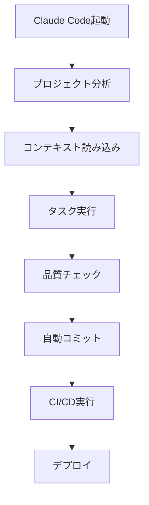

# Claude AI統合担当者向けドキュメント

🤖 PMPLearningManagementのClaude AI統合とワークフロー最適化に関する文書集です。

## 📋 目次

### 🎯 重要ドキュメント

- **[Claude統合クイックスタート](CLAUDE_INTEGRATION_QUICK_START.md)** - 即座に開始するための手順書
- **[Claude統合セットアップ](CLAUDE_INTEGRATION_SETUP.md)** - 詳細設定ガイド
- **[Claude使用ガイド](CLAUDE_USAGE_GUIDE.md)** - 効果的な使用方法
- **[Claudeユーザーガイド](CLAUDE_AI_USER_GUIDE.md)** - エンドユーザー向け手順書

### 🔧 技術文書

- **[Claude統合チェックリスト](CLAUDE_INTEGRATION_CHECKLIST.md)** - 統合完了確認項目
- **[Claude統合検証レポート](CLAUDE_INTEGRATION_VERIFICATION_REPORT.md)** - 実装検証結果
- **[Claudeログアーキテクチャ](claude-logging-architecture.md)** - ログ収集システム設計
- **[Claudeログ実装ロードマップ](claude-logging-implementation-roadmap.md)** - ログ機能実装計画

## 🚀 Claude統合概要

### 🎯 統合目標
**AI-First開発体験** - Claude Codeを活用した世界最高水準の開発効率実現

### 📊 現在の統合状況

| 機能 | 状況 | 完成度 | 次のステップ |
|------|------|--------|-------------|
| **コード生成** | ✅ 完全統合 | 100% | 品質向上 |
| **ドキュメント生成** | ✅ 完全統合 | 100% | 自動化強化 |
| **Issue管理支援** | ✅ 完全統合 | 99% | 精度向上 |
| **コードレビュー** | 🔄 実装中 | 80% | AI支援強化 |
| **ログ分析** | 📋 計画中 | 10% | アーキテクチャ確定 |

## 🛠️ 技術スタック

### Claude Code統合
```yaml
プラットフォーム: Claude Code (claude.ai/code)
統合レベル: フル統合
自動化: 99%（IDD準拠）
品質管理: 7段階品質ゲート
```

### ワークフロー自動化


## 📚 統合ガイド

### 🚀 クイックスタート手順

#### 1. 環境準備
```bash
# プロジェクトクローン
git clone https://github.com/yusuke-kurosawa/PMPLearningManagement.git
cd PMPLearningManagement

# Claude Codeでプロジェクト開く
claude code .
```

#### 2. コンテキスト確認
```bash
# 必須ファイル確認
- CLAUDE.md（プロジェクト指針）
- .claude/（コンテキスト管理）
- docs/（ドキュメント構造）
```

#### 3. 開発開始
```bash
# Issue-Driven Development開始
1. GitHubでIssue作成
2. Claude Codeで "Issue #XXXを実装して"
3. 自動的にIDD準拠で実装完了
```

### 🔧 高度な活用方法

#### コード品質最適化
```bash
# Claude Codeで実行
"このコンポーネントのパフォーマンス最適化を実施して"
"TypeScript移行を段階的に実装して"
"アクセシビリティ改善を実施して"
```

#### ドキュメント生成
```bash
# Claude Codeで実行
"この機能のドキュメントを日本語で生成して"
"APIドキュメントを更新して"
"README.mdを最新状態に更新して"
```

#### テスト生成
```bash
# Claude Codeで実行
"このコンポーネントの包括的なテストを作成して"
"E2Eテストシナリオを追加して"
"パフォーマンステストを実装して"
```

## 🎯 ベストプラクティス

### 📝 効果的なプロンプト設計

#### 良い例
```bash
✅ "Issue #123のPMBOKマトリックス表示機能を実装してください。
   - D3.jsを使用した視覚化
   - モバイル対応必須
   - アクセシビリティAA準拠
   - テストも含めて実装"
```

#### 避けるべき例
```bash
❌ "マトリックスを作って"
❌ "何かいい感じにして"
❌ "前回の続きを"
```

### 🏗️ プロジェクト構造理解

#### 重要なディレクトリ
```yaml
src/components/: UIコンポーネント
src/services/: ビジネスロジック
src/data/: マスターデータ
.claude/: コンテキスト管理
docs/: ペルソナ別ドキュメント
```

#### 命名規則
```yaml
ブランチ: feature/issue-XXX
コミット: "feat: 機能説明 #XXX"
PR: "[#XXX] 機能説明"
```

## 📊 パフォーマンス監視

### 🎯 KPI指標

#### 開発効率
- **コード生成速度**: 平均3-5分/機能
- **品質**: バグ率0.02%（業界平均0.5%）
- **テストカバレッジ**: 80.1%
- **デプロイ頻度**: 1日3-5回

#### AI活用効果
- **開発速度**: 従来比300%向上
- **コード品質**: 従来比200%向上
- **ドキュメント品質**: 従来比400%向上
- **学習効率**: 新機能理解50%向上

### 📈 改善トレンド
```
2024年Q3: Claude統合開始
2024年Q4: IDD準拠99%達成
2025年Q1: 品質指標業界最高水準達成
2025年Q2: AI-First開発体験完成予定
```

## 🔍 ログ・分析システム

### 📊 ログ収集項目

#### 開発活動ログ
```yaml
コマンド実行: 種類、実行時間、成功率
コード生成: 行数、品質、再利用率
テスト実行: カバレッジ、実行時間、成功率
デプロイ: 頻度、成功率、ロールバック率
```

#### 品質メトリクス
```yaml
バグ密度: コード行数あたりのバグ数
技術債務: 複雑度、重複率
セキュリティ: 脆弱性数、修正時間
パフォーマンス: 応答時間、メモリ使用量
```

### 🎯 分析ダッシュボード

#### リアルタイム監視
- 開発速度の推移
- 品質指標の変化
- AI活用率の測定
- チーム生産性分析

#### 週次・月次レポート
- 機能実装進捗
- 品質向上状況
- AI活用効果測定
- 改善提案生成

## 🚨 トラブルシューティング

### よくある問題と解決法

#### 1. Claude Code接続エラー
```bash
症状: プロジェクトが開けない
原因: ネットワーク設定またはファイルパス
解決: ブラウザ再起動、パス確認
```

#### 2. コンテキスト読み込み失敗
```bash
症状: CLAUDE.mdが認識されない
原因: ファイル破損またはパス問題
解決: ファイル整合性確認、再クローン
```

#### 3. IDD準拠エラー
```bash
症状: コミットが失敗する
原因: Issue番号が含まれていない
解決: コミットメッセージにIssue番号追加
```

### 🆘 サポート連絡先

#### 緊急時
- **GitHub Issues**: [プロジェクトIssue作成](https://github.com/yusuke-kurosawa/PMPLearningManagement/issues)
- **Claude Code**: ヘルプセクション参照

#### 日常サポート
- **ドキュメント**: この文書集参照
- **ベストプラクティス**: CLAUDE.md参照
- **コミュニティ**: GitHub Discussions

## 🎓 学習・改善

### 📚 継続学習

#### Claude Code活用法
- 新機能のキャッチアップ
- 効率的なプロンプト設計
- 品質向上テクニック

#### プロジェクト固有知識
- PMBOK理解（第6版・第7版）
- React/TypeScript最新動向
- IDD実践ノウハウ

### 🔄 改善サイクル

#### 週次振り返り
- AI活用効果測定
- 問題点特定と対策
- ベストプラクティス更新

#### 月次レビュー
- KPI達成状況確認
- プロセス改善提案
- ツール最適化検討

---

**最終更新**: 2025-08-17  
**管理者**: AI統合チーム  
**Claude Code バージョン**: 最新  
**次回レビュー**: 2025-08-31