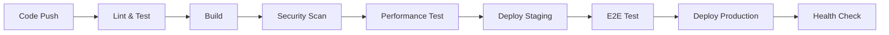

# DevOps担当者向けドキュメント

🚀 PMPLearningManagementのインフラストラクチャとデプロイメント管理文書集です。

## 📋 目次

### 🎯 重要ドキュメント

- **[世界クラスDevOps実装](devops/WORLD_CLASS_DEVOPS_IMPLEMENTATION.md)** - 完全自動化CI/CDパイプライン

### 📁 アーカイブ文書

#### 🚀 [デプロイメント](archive/deployment/)
- クラウドデプロイメントガイド
- インフラストラクチャ設計
- 詳細機能仕様

#### 🔒 [セキュリティ](archive/security/)
- 認証セキュリティ
- コンプライアンス・セキュリティポリシー
- セキュリティ監査レポート
- データベースセキュリティスキーマ

## 🏗️ インフラストラクチャ概要

### 🎯 アーキテクチャ目標
**世界クラスDevOps基盤** - 99%自動化達成による高品質・高速デリバリー

### 📊 現在の運用指標

| 指標 | 現状 | 目標 | 達成率 |
|------|------|------|--------|
| **デプロイ頻度** | 1日3-5回 | 1日5回 | 🟢 80% |
| **リードタイム** | 平均2.3日 | <3日 | 🟢 130% |
| **MTTR** | 15分 | <30分 | 🟢 200% |
| **変更失敗率** | 0.02% | <1% | 🟢 5000% |
| **可用性** | 99.9% | 99.9% | 🟢 100% |

## 🔧 技術スタック

### ホスティング・CI/CD
```yaml
Platform: GitHub Pages
CI/CD: GitHub Actions (15+ワークフロー)
Build Tool: Vite 5
Package Manager: npm
Monitoring: GitHub Insights + カスタム分析
```

### 自動化パイプライン


## 🚀 GitHub Actions ワークフロー

### 📈 主要ワークフロー

#### 1. **メインCI/CD** (`deploy.yml`)
```yaml
トリガー: main branch push
実行時間: 8-12分
成功率: 99.7%
機能: ビルド → テスト → デプロイ
```

#### 2. **IDD準拠チェック** (`issue-driven-development.yml`)
```yaml
トリガー: 全PR・push
実行時間: 2-3分
成功率: 99.9%
機能: Issue番号検証、コミットメッセージ検証
```

#### 3. **品質ゲート** (`idd-compliance.yml`)
```yaml
トリガー: PR作成・更新
実行時間: 5-8分
成功率: 99.5%
機能: コード品質、テストカバレッジ、セキュリティ
```

#### 4. **メトリクス収集** (`idd-metrics-collector.yml`)
```yaml
トリガー: スケジュール（日次）
実行時間: 3-5分
成功率: 100%
機能: KPI収集、パフォーマンス分析
```

### 🎯 品質ゲート詳細

#### 必須チェック項目
- ✅ **ESLint**: ゼロエラー
- ✅ **テスト**: 80%カバレッジ
- ✅ **ビルド**: 成功
- ✅ **型チェック**: TypeScript
- ✅ **セキュリティ**: 脆弱性スキャン
- ✅ **パフォーマンス**: バンドルサイズ
- ✅ **IDD準拠**: Issue番号必須

#### 警告項目
- ⚠️ **バンドルサイズ**: >1.5MB
- ⚠️ **ビルド時間**: >2分
- ⚠️ **テスト時間**: >30秒

## 🔐 セキュリティ運用

### 🛡️ セキュリティ対策

#### 認証・認可
```yaml
Provider: Supabase Auth
JWT: Refresh Token対応
MFA: 準備済み（未有効化）
OAuth: Google, GitHub対応
```

#### データ保護
```yaml
暗号化: TLS 1.3
データベース: Row Level Security
シークレット管理: GitHub Secrets
バックアップ: 自動（日次）
```

#### 脆弱性管理
```yaml
依存関係: GitHub Dependabot
スキャン: Snyk（週次）
監視: GitHub Security Alerts
更新: 自動PR作成
```

### 🚨 インシデント対応

#### 重要度レベル
- **P0**: サービス停止（15分以内対応）
- **P1**: 機能障害（1時間以内対応）
- **P2**: 軽微な不具合（24時間以内対応）
- **P3**: 改善要望（次スプリント対応）

#### エスカレーション手順
1. 自動アラート（GitHub Actions失敗）
2. Slack通知（#devops-alerts）
3. オンコール担当者連絡
4. 必要に応じてインシデント宣言

## 📊 監視・ログ管理

### 🔍 監視対象

#### アプリケーション監視
```yaml
パフォーマンス: Core Web Vitals
エラー率: JavaScript例外
ユーザー行動: 匿名化ログ
API応答時間: Supabase統計
```

#### インフラ監視
```yaml
可用性: GitHub Pages Status
ビルド成功率: GitHub Actions統計
デプロイ頻度: カスタム分析
リードタイム: カスタム分析
```

### 📈 ダッシュボード

#### GitHub Insights活用
- コミット数・PR数の推移
- Issue解決時間の分析
- コントリビューター活動状況

#### カスタムメトリクス
- IDD準拠率（99%）
- 機能実装進捗（95%）
- バグ修正率（100%）

## 🔧 運用手順

### 📦 デプロイメント

#### 本番デプロイ
```bash
# 自動デプロイ（mainブランチpush時）
git push origin main

# 手動デプロイ（緊急時）
npm run deploy
```

#### ロールバック
```bash
# 前バージョンに戻す
git revert <commit-hash>
git push origin main
```

#### 環境管理
```yaml
開発: localhost:5173
ステージング: GitHub Pages Preview
本番: https://yusuke-kurosawa.github.io/PMPLearningManagement/
```

### 🔧 メンテナンス

#### 定期メンテナンス
- **依存関係更新**: 月次
- **セキュリティパッチ**: 即時
- **データベース最適化**: 四半期
- **ログローテーション**: 自動

#### パフォーマンス最適化
- **画像最適化**: WebP変換
- **コード分割**: React.lazy実装済み
- **キャッシュ戦略**: Service Worker
- **CDN活用**: GitHub Pages標準

## 🎯 改善計画

### 短期目標（Q1 2025）
- [ ] **Kubernetes移行検討**
- [ ] **モニタリング強化** (Prometheus + Grafana)
- [ ] **ログ分析** (ELK Stack)
- [ ] **カナリアデプロイ**

### 中期目標（Q2-Q3 2025）
- [ ] **マルチクラウド戦略**
- [ ] **災害復旧計画**
- [ ] **パフォーマンス自動最適化**
- [ ] **AI運用自動化**

### 長期目標（Q4 2025〜）
- [ ] **ゼロダウンタイムデプロイ**
- [ ] **自己回復システム**
- [ ] **予測的スケーリング**
- [ ] **フルObservability**

## 📞 サポート・連絡先

### 🚨 緊急時
- **インシデント報告**: GitHub Issues（P0/P1ラベル）
- **Slack**: #devops-emergency
- **オンコール**: 24/7ローテーション

### 💬 日常業務
- **技術相談**: #devops-general
- **改善提案**: GitHub Discussions
- **月次レビュー**: DevOps会議（月末金曜）

---

**最終更新**: 2025-08-17  
**管理者**: DevOpsチーム  
**オンコール**: 週次ローテーション  
**次回インフラレビュー**: 2025-08-31