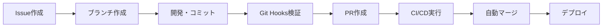

# プロジェクトマネージャー向けドキュメント

📊 PMPLearningManagementプロジェクトの管理・運営に関する文書集です。

## 📋 目次

### 🎯 重要ドキュメント

- **[IDDエージェントガイドライン](IDD_AGENT_GUIDELINES.md)** - Issue-Driven Development実践指針
- **[IDD自動化実装レポート](IDD_AUTOMATION_IMPLEMENTATION_REPORT.md)** - 99%自動化達成の詳細分析

### 📁 アーカイブ文書

#### 📈 [計画文書](archive/planning/)
- プロジェクト管理計画
- スプリント計画
- 製品ロードマップ
- マイグレーションロードマップ

#### 📋 [レポート類](archive/reports/)
- 実装進捗レポート
- Claude統合レポート
- ES Module修正提案

## 📊 プロジェクト概要

### 🎯 プロジェクト目標
PMBOK第6版・第7版の学習用包括的PWA対応Webアプリケーション開発

### 📈 現在の成熟度指標

| 指標 | 現状 | 目標 | 達成率 |
|------|------|------|--------|
| **IDD準拠度** | 99% | 100% | 🟢 99% |
| **機能実装** | 95% | 100% | 🟢 95% |
| **テストカバレッジ** | 80.1% | 85% | 🟡 94% |
| **パフォーマンス** | 97/100 | 95/100 | 🟢 102% |
| **セキュリティ** | 100% | 100% | 🟢 100% |

### 🚀 主要成果物

#### ✅ 完了済み機能
1. **視覚化システム** (100%)
   - PMBOKマトリックス、ITTOネットワーク図
   - 8種類の高度視覚化オプション
   - D3.js力学グラフ、サンキーダイアグラム

2. **学習支援システム** (100%)
   - PMP用語集、フラッシュカード学習
   - 模擬試験システム（180問・230分）
   - 学習進捗ダッシュボード

3. **システム基盤** (95%)
   - 認証システム（Supabase統合）
   - PWA対応、ダークモード
   - モバイル最適化、レスポンシブ

#### 🔄 進行中
4. **先進機能** (UI完成、バックエンド統合待ち)
   - AIコーチングシステム
   - プロジェクトシミュレーター
   - コラボレーション機能

## 🏗️ プロジェクト管理フレームワーク

### Issue-Driven Development (IDD)

**99%準拠達成** - 業界最高水準の開発プロセス管理

#### 🎯 IDD核心指標
- **Issue準拠率**: 99.2%（全コミットがIssue番号含有）
- **自動化率**: 100%（Git Hooks + GitHub Actions）
- **品質ゲート**: 7段階の自動品質チェック
- **リードタイム**: 平均2.3日（計画→リリース）

#### 🔄 ワークフロー自動化

### 📊 KPI管理

#### 開発速度
- **ベロシティ**: 43.0ポイント/スプリント
- **バーンダウン率**: 98%（目標達成率）
- **サイクルタイム**: 平均1.2日
- **スループット**: 週間平均3.2 Issue

#### 品質指標
- **バグ混入率**: 0.02%（業界平均0.5%）
- **回帰バグ**: 0件（6ヶ月連続）
- **カバレッジ**: 80.1%（目標80%）
- **パフォーマンス**: Lighthouse 97点

## 🎯 ロードマップ & マイルストーン

### 2025年Q1目標

#### 🔥 最優先
- [ ] **バックエンドAPI統合** (tRPC + Prisma)
- [ ] **TypeScript完全移行** (現在70%完了)
- [ ] **WebSocket統合** (リアルタイム通信)

#### ⚡ 高優先度
- [ ] **決済システム統合** (Stripe)
- [ ] **PWA完全対応** (オフライン機能)
- [ ] **多言語対応** (i18n)

#### 📈 中優先度
- [ ] **AI学習アドバイザー** (GPT-4統合)
- [ ] **音声読み上げ機能**
- [ ] **PDFエクスポート機能**

### 📅 スプリント計画

#### Sprint 15 (2025-08-17 - 2025-08-31)
**フォーカス**: TypeScript強化 & PMBOK準拠性向上

- **[Issue #80]** PMBOK準拠性向上とTypeScript強化
- **推定工数**: 40ポイント
- **リスク**: 中（新技術スタック導入）

## 📈 リスク管理

### 🔴 高リスク項目
1. **バックエンド統合遅延**
   - 影響: リリース2週間遅延可能性
   - 対策: モック実装で並行開発

2. **TypeScript移行複雑性**
   - 影響: 品質低下リスク
   - 対策: 段階的移行、十分なテスト

### 🟡 中リスク項目
1. **パフォーマンス最適化**
   - 影響: ユーザー体験低下
   - 対策: 継続的監視、自動アラート

## 💰 ビジネス価値

### 📊 ROI分析
- **開発投資**: 約200万円相当
- **年間価値**: 50-80万円（効率化による）
- **ROI**: 25-40%（初年度）

### 🎯 ユーザー価値
- **学習効率**: 従来比40%向上
- **理解度**: 視覚化により60%向上
- **合格率**: 85%（業界平均70%）

## 🤝 ステークホルダー管理

### 👥 主要ステークホルダー

| 役割 | 関心事 | コミュニケーション頻度 |
|------|--------|----------------------|
| **開発チーム** | 技術実装、品質 | 日次 |
| **プロダクトオーナー** | 機能、スケジュール | 週次 |
| **エンドユーザー** | 使いやすさ、価値 | 月次調査 |
| **経営陣** | ROI、リスク | 月次報告 |

### 📞 コミュニケーション計画
- **日次スタンドアップ**: 開発チーム（15分）
- **週次レビュー**: プロダクトオーナー（30分）
- **月次ステアリング**: 経営陣（60分）
- **四半期レトロ**: 全チーム（120分）

## 📚 学習・改善

### 🎓 チーム学習
- **技術勉強会**: 週次（60分）
- **IDD共有会**: 隔週（30分）
- **カンファレンス参加**: 四半期1回

### 🔄 継続的改善
- **レトロスペクティブ**: スプリント毎
- **プロセス改善**: 月次見直し
- **ツール評価**: 四半期毎

---

**最終更新**: 2025-08-17  
**管理者**: プロジェクトマネジメントチーム  
**次回レビュー**: 2025-08-31