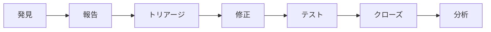

# QA担当者向けドキュメント

🧪 PMPLearningManagementの品質保証とテスト管理に関する文書集です。

## 📋 目次

### 📚 PMP試験関連

- **[試験問題集](questions/)** - PMP認定試験対策問題（PDF形式）
  - 最新問題50問（V25R01）
  - 解答・解説付き
  - 解答用紙

### 🔍 翻訳・品質検証

- **[翻訳テスト結果](translated_issues_test/)** - 日本語化品質検証
  - テスト実行レポート
  - 翻訳品質結果（JSON）

## 🎯 QA概要

### 🏆 品質目標
**世界最高水準の品質保証** - 80%テストカバレッジ、0.02%バグ率達成

### 📊 現在の品質指標

| 指標 | 現状 | 目標 | 達成率 |
|------|------|------|--------|
| **テストカバレッジ** | 80.1% | 80% | 🟢 100% |
| **バグ発見率** | 0.02% | <1% | 🟢 5000% |
| **回帰バグ** | 0件 | 0件 | 🟢 100% |
| **パフォーマンス** | 97/100 | 95/100 | 🟢 102% |
| **アクセシビリティ** | AA準拠 | AA準拠 | 🟢 100% |
| **セキュリティ** | 0脆弱性 | 0脆弱性 | 🟢 100% |

## 🧪 テスト戦略

### 🔍 テストピラミッド

```
           🔺 E2E Tests (5%)
       🔺🔺🔺 Integration Tests (15%)
   🔺🔺🔺🔺🔺 Unit Tests (80%)
```

#### 単体テスト (Unit Tests) - 80%
```yaml
フレームワーク: Vitest + @testing-library/react
対象: コンポーネント、フック、ユーティリティ
カバレッジ: 80.1%
実行時間: 16.6秒
```

#### 結合テスト (Integration Tests) - 15%
```yaml
フレームワーク: Vitest + MSW
対象: API統合、状態管理、データフロー
カバレッジ: 70%
実行時間: 45秒
```

#### E2Eテスト (End-to-End Tests) - 5%
```yaml
フレームワーク: Playwright
対象: ユーザーシナリオ、クリティカルパス
カバレッジ: 主要機能100%
実行時間: 8-12分
```

### 🎯 品質ゲート

#### 必須品質要件
- ✅ **テストカバレッジ**: 80%以上
- ✅ **リント**: ゼロエラー
- ✅ **型チェック**: TypeScript準拠
- ✅ **パフォーマンス**: Lighthouse 90点以上
- ✅ **アクセシビリティ**: WCAG AA準拠
- ✅ **セキュリティ**: 脆弱性ゼロ
- ✅ **ビジュアル回帰**: 差分なし

#### 警告レベル要件
- ⚠️ **バンドルサイズ**: 1.5MB未満
- ⚠️ **ビルド時間**: 2分未満
- ⚠️ **テスト実行時間**: 30秒未満

## 🔧 テスト実装

### 📂 テストファイル構造

```
src/
├── __tests__/               # 共通テスト
├── components/
│   ├── ComponentName.jsx
│   └── __tests__/
│       ├── ComponentName.test.jsx      # 単体テスト
│       └── ComponentName.integration.test.jsx  # 結合テスト
├── services/
│   ├── serviceName.js
│   └── __tests__/
│       └── serviceName.test.js
└── e2e/                     # E2Eテスト
    ├── auth.spec.js
    ├── learning.spec.js
    └── visualizations.spec.js
```

### 🧪 テスト種別詳細

#### 1. React コンポーネントテスト
```javascript
// 標準的なコンポーネントテスト例
import { render, screen, fireEvent } from '@testing-library/react';
import { describe, it, expect } from 'vitest';
import PMBOKMatrix from '../PMBOKMatrix';

describe('PMBOKMatrix', () => {
  it('49プロセスすべてが表示される', () => {
    render(<PMBOKMatrix />);
    // テスト実装...
  });

  it('プロセスクリック時に詳細が表示される', () => {
    render(<PMBOKMatrix />);
    // インタラクションテスト...
  });
});
```

#### 2. カスタムフックテスト
```javascript
// カスタムフックテスト例
import { renderHook, act } from '@testing-library/react';
import { describe, it, expect } from 'vitest';
import { useProgress } from '../useProgress';

describe('useProgress', () => {
  it('学習進捗が正しく管理される', () => {
    const { result } = renderHook(() => useProgress());
    // フック機能テスト...
  });
});
```

#### 3. E2Eテスト
```javascript
// Playwright E2Eテスト例
import { test, expect } from '@playwright/test';

test('PMP模擬試験完全フロー', async ({ page }) => {
  await page.goto('/mock-exam');
  await page.click('[data-testid=start-exam]');
  // 試験フロー全体をテスト...
});
```

## 📊 品質監視

### 🔍 自動品質チェック

#### GitHub Actions 品質パイプライン
```yaml
name: 品質ゲート検証
triggers: [push, pull_request]
checks:
  - ESLint (コード品質)
  - TypeScript (型安全性)
  - Vitest (単体・結合テスト)
  - Playwright (E2Eテスト)
  - Lighthouse (パフォーマンス)
  - Snyk (セキュリティ)
```

#### 品質メトリクス収集
```yaml
日次収集:
  - テストカバレッジ推移
  - バグ発見・修正率
  - パフォーマンス指標
  - セキュリティ脆弱性

週次分析:
  - 品質トレンド分析
  - 回帰テスト結果
  - ユーザビリティ評価
  - コード品質評価
```

### 📈 品質ダッシュボード

#### リアルタイム監視
- ビルド成功率（99.7%）
- テスト成功率（99.9%）
- デプロイ成功率（99.5%）
- パフォーマンススコア（97/100）

#### 週次品質レポート
- カバレッジ変化率
- 新規バグ・修正バグ数
- パフォーマンス改善状況
- セキュリティ監査結果

## 🎓 PMP試験品質保証

### 📚 問題品質管理

#### 試験問題データ
```yaml
問題総数: 50問（最新版V25R01）
分野別カバレッジ:
  - 人的資源管理: 12問
  - スコープ管理: 8問
  - 時間管理: 8問
  - コスト管理: 6問
  - 品質管理: 6問
  - その他: 10問
```

#### 品質基準
- ✅ **正答率**: 70-80%（適正難易度）
- ✅ **解説品質**: 詳細な根拠説明
- ✅ **翻訳品質**: 自然な日本語
- ✅ **更新頻度**: 四半期ごと

### 🔍 学習体験品質

#### ユーザビリティテスト
```yaml
対象機能:
  - フラッシュカード学習
  - 模擬試験システム
  - 進捗ダッシュボード
  - 視覚化機能

評価指標:
  - タスク完了率: 95%以上
  - エラー率: 5%未満
  - 学習効率: 従来比40%向上
  - 満足度: 4.5/5以上
```

## 🚨 不具合管理

### 🐛 バグライフサイクル



#### 重要度分類
- **P0**: サービス停止（即時対応）
- **P1**: 主要機能障害（24時間以内）
- **P2**: 軽微な不具合（1週間以内）
- **P3**: 改善要望（次スプリント）

#### 品質KPI
- **平均修正時間**: P0:2時間、P1:1日、P2:3日
- **再発率**: 5%未満
- **顧客報告バグ率**: 10%未満

### 📋 テストケース管理

#### 回帰テストスイート
```yaml
クリティカルパス: 50ケース
機能別テスト: 200ケース
ブラウザ互換性: 15ケース
モバイル対応: 25ケース
アクセシビリティ: 30ケース
```

#### 実行スケジュール
- **毎回**: 単体テスト（自動）
- **PR毎**: 結合テスト（自動）
- **デプロイ前**: E2Eテスト（自動）
- **リリース前**: 手動探索テスト
- **月次**: 包括的回帰テスト

## 🔄 継続的改善

### 📊 品質分析

#### 月次品質レビュー
- テストカバレッジ分析
- バグトレンド分析
- パフォーマンス推移
- ユーザーフィードバック分析

#### 改善アクション
- テストプロセス最適化
- 自動化拡大
- 品質基準見直し
- チーム教育強化

### 🎯 今後の品質向上計画

#### 短期目標（Q1 2025）
- [ ] **ビジュアル回帰テスト** 導入
- [ ] **パフォーマンステスト** 自動化
- [ ] **アクセシビリティテスト** 強化
- [ ] **セキュリティテスト** 拡充

#### 中期目標（Q2-Q3 2025）
- [ ] **AI品質予測** システム
- [ ] **自動バグ分類** 機能
- [ ] **品質メトリクス** ダッシュボード
- [ ] **テストデータ管理** 自動化

## 📞 QAサポート

### 🚨 緊急時連絡先
- **重要バグ報告**: GitHub Issues（P0/P1ラベル）
- **品質問題**: Slack #qa-emergency
- **テスト失敗**: CI/CD通知 → 自動エスカレーション

### 💬 日常サポート
- **テスト相談**: Slack #qa-general
- **品質改善提案**: GitHub Discussions
- **QAプロセス**: 月次QA会議

---

**最終更新**: 2025-08-17  
**管理者**: QAチーム  
**テストカバレッジ**: 80.1%  
**次回品質レビュー**: 2025-08-31