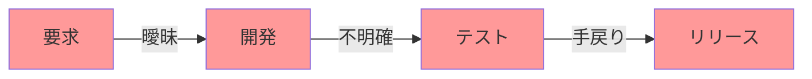
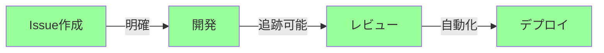
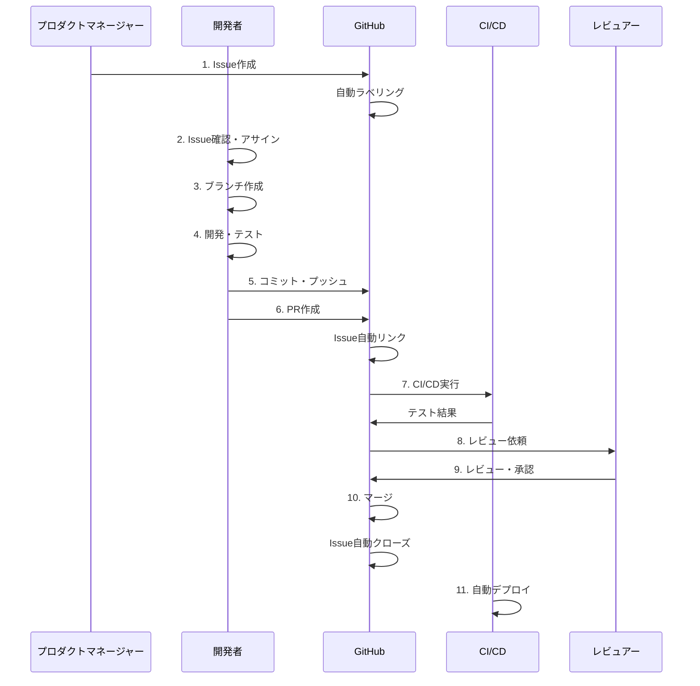
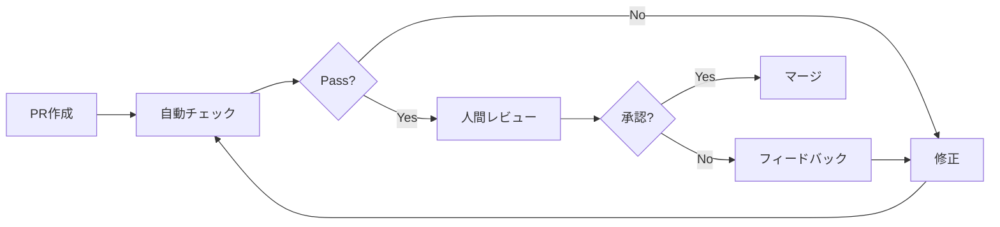
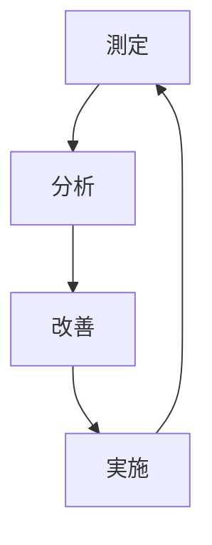

# Issue-Driven Development (IDD) 開発フローガイド

## 📋 目次

1. [IDDとは](#iddとは)
2. [なぜIDDなのか](#なぜiddなのか)
3. [IDD開発フロー](#idd開発フロー)
4. [Issueの作成と管理](#issueの作成と管理)
5. [ブランチ戦略](#ブランチ戦略)
6. [コミット規則](#コミット規則)
7. [PR作成とレビュー](#pr作成とレビュー)
8. [自動化機能](#自動化機能)
9. [ベストプラクティス](#ベストプラクティス)
10. [トラブルシューティング](#トラブルシューティング)

## IDDとは

Issue-Driven Development (IDD) は、すべての開発作業をIssueと紐付けて管理する開発手法です。コードの変更履歴と要求仕様を明確に関連付けることで、プロジェクトの透明性と追跡可能性を高めます。

### 基本原則

1. **No Issue, No Code**: Issueなしにコードを書かない
2. **Traceability**: すべての変更が追跡可能
3. **Documentation**: Issueが生きたドキュメントとなる
4. **Collaboration**: チーム全体で情報共有

## なぜIDDなのか

### 従来の開発の問題点



- 変更の理由が不明確
- 要求と実装の乖離
- コミュニケーション不足
- 手戻りの発生

### IDD導入後の改善



- すべての変更に明確な理由
- 要求と実装の一致
- 透明なコミュニケーション
- 自動化による効率化

## IDD開発フロー

### 完全な開発サイクル



### 各ステップの詳細

#### 1. Issue作成
要求や問題を明確に定義

#### 2. Issue確認・アサイン
開発者が内容を確認し、自身にアサイン

#### 3. ブランチ作成
Issue番号を含むブランチを作成

#### 4. 開発・テスト
実装とテストの作成

#### 5. コミット・プッシュ
Issue番号を含むコミット

#### 6. PR作成
Issueと紐付けたPR

#### 7. CI/CD実行
自動テストと品質チェック

#### 8. レビュー依頼
チームメンバーへのレビュー依頼

#### 9. レビュー・承認
コードレビューと承認

#### 10. マージ
mainブランチへのマージ

#### 11. 自動デプロイ
本番環境への自動デプロイ

## Issueの作成と管理

### Issueテンプレート

本プロジェクトでは以下のIssueテンプレートを提供：

| テンプレート | 用途 | ラベル |
|------------|------|--------|
| 01_bug_report.yml | バグ報告 | 種類:バグ |
| 02_feature_request.yml | 機能要望 | 種類:新機能 |
| 03_improvement.yml | 改善提案 | 種類:改善 |
| 04_learning_content.yml | 学習コンテンツ | 領域:学習機能 |
| 05_documentation.yml | ドキュメント | 種類:ドキュメント |
| 06_question_support.yml | 質問・サポート | 種類:質問 |

### Issue作成のベストプラクティス

#### 良いIssueの例

```markdown
## 概要
ユーザー一覧画面でページネーションが正しく動作しない

## 再現手順
1. ユーザー一覧画面を開く
2. 2ページ目をクリック
3. 1ページ目と同じデータが表示される

## 期待される動作
2ページ目には11-20件目のユーザーが表示される

## 実際の動作
1ページ目と同じ1-10件目が表示される

## 環境
- ブラウザ: Chrome 120
- OS: Windows 11
- 発生日時: 2024-01-13 10:30
```

#### 悪いIssueの例

```markdown
ページネーションが動かない
```

### ラベル体系

#### カテゴリ別ラベル

**種類 (Type)**
- `種類:バグ` - バグ修正
- `種類:新機能` - 新機能追加
- `種類:改善` - 既存機能の改善
- `種類:ドキュメント` - ドキュメント更新
- `種類:リファクタリング` - コード改善
- `種類:テスト` - テスト追加・修正

**優先度 (Priority)**
- `優先度:緊急` - 即座に対応が必要
- `優先度:高` - 早期対応が必要
- `優先度:中` - 通常対応
- `優先度:低` - 時間があるときに対応

**領域 (Area)**
- `領域:UI/UX` - ユーザーインターフェース
- `領域:フロントエンド` - React/TypeScript
- `領域:バックエンド` - API/サーバー
- `領域:DevOps` - CI/CD/インフラ
- `領域:AI/ML` - AI機能

**状態 (Status)**
- `状態:新規` - 新規Issue
- `状態:進行中` - 作業中
- `状態:レビュー待ち` - レビュー待機
- `状態:完了` - 完了
- `状態:保留` - 一時保留

## ブランチ戦略

### ブランチ命名規則

```
<type>/<issue-number>-<description>
```

例：
- `feature/123-add-user-auth`
- `fix/456-pagination-bug`
- `docs/789-update-readme`

### ブランチタイプ

| タイプ | 用途 | マージ先 |
|-------|------|---------|
| feature/ | 新機能開発 | develop |
| fix/ | バグ修正 | develop/main |
| docs/ | ドキュメント | develop |
| refactor/ | リファクタリング | develop |
| test/ | テスト追加 | develop |
| hotfix/ | 緊急修正 | main |

### ブランチ作成コマンド

```bash
# Issue #123 の機能開発
git checkout -b feature/123-add-new-feature

# Issue #456 のバグ修正
git checkout -b fix/456-fix-pagination

# Issue #789 のドキュメント更新
git checkout -b docs/789-update-guide
```

## コミット規則

### コミットメッセージフォーマット

```
<type>(<scope>): <subject> #<issue-number>

[optional body]

[optional footer]
```

### コミットタイプ

| タイプ | 説明 | 例 |
|-------|------|-----|
| feat | 新機能 | feat: ユーザー認証機能を追加 #123 |
| fix | バグ修正 | fix: ページネーションの不具合を修正 #456 |
| docs | ドキュメント | docs: READMEを更新 #789 |
| style | フォーマット | style: コードフォーマットを修正 #012 |
| refactor | リファクタリング | refactor: 認証ロジックを改善 #345 |
| test | テスト | test: ユーザーAPIのテストを追加 #678 |
| chore | 雑務 | chore: 依存関係を更新 #901 |

### 良いコミットメッセージの例

```bash
git commit -m "feat(auth): JWT認証機能を実装 #123

- JWTトークンの生成・検証
- リフレッシュトークンの実装
- セッション管理の改善

Closes #123"
```

### 悪いコミットメッセージの例

```bash
# 悪い例
git commit -m "fix"
git commit -m "更新"
git commit -m "WIP"
```

## PR作成とレビュー

### PR作成時の自動処理

1. **Issue自動リンク**
   - PR内のIssue番号を検出
   - 自動的にIssueとリンク
   - クローズキーワードの追加

2. **自動ラベリング**
   - 内容からラベルを推定
   - 適切なラベルを自動付与

3. **CI/CD実行**
   - テスト自動実行
   - 品質チェック
   - セキュリティスキャン

4. **Claude AIレビュー**
   - 自動コードレビュー
   - 改善提案
   - 品質スコアリング

### PRテンプレート活用

PRテンプレートの主要セクション：

```markdown
## 📋 概要・変更内容
[変更内容の説明]

## 🔗 関連Issue
- Closes #123
- Related to #456

## 🧪 テスト内容
- [ ] Unit Tests
- [ ] Integration Tests
- [ ] Manual Testing

## 📱 動作環境
- [ ] Chrome
- [ ] Firefox
- [ ] Safari
- [ ] Mobile

## ✅ チェックリスト
- [ ] コード規約準拠
- [ ] テスト追加
- [ ] ドキュメント更新
```

### レビュープロセス



## 自動化機能

### 自動ラベリング

```yaml
# キーワードベースの自動ラベリング
keywords:
  bug: ["バグ", "不具合", "エラー"]
  feature: ["新機能", "追加", "実装"]
  docs: ["ドキュメント", "README", "ガイド"]
```

### Issue-PR自動リンク

```yaml
# PR本文のパターン
patterns:
  - "Closes #(\d+)"
  - "Fixes #(\d+)"
  - "Resolves #(\d+)"
  - "Related to #(\d+)"
```

### IDD準拠チェック

```yaml
# チェック項目
checks:
  - Issue参照の有無
  - コミットメッセージ形式
  - ブランチ名規則
  - PR本文の完成度
```

## ベストプラクティス

### 1. Issue First


**常にIssueから始める**
- 思いつきで直接コードを書かない
- まずIssueで議論し、合意を得る
- 明確な要求定義後に開発開始

### 2. Atomic Commits

```bash
# 良い例: 1コミット1目的
git commit -m "feat: ユーザー登録APIを追加 #123"
git commit -m "test: ユーザー登録のテストを追加 #123"
git commit -m "docs: API仕様書を更新 #123"

# 悪い例: 複数の変更を1コミット
git commit -m "いろいろ修正 #123"
```

### 3. Small PRs

**小さくて頻繁なPR**
- 1 PR = 1 Issue が理想
- 200-400行以内を目安
- レビューしやすいサイズ
- 早期フィードバック

### 4. Descriptive Issues

**詳細で明確なIssue**
- 背景と目的を明記
- 具体的な要求仕様
- 受け入れ条件の定義
- 関連情報のリンク

## トラブルシューティング

### よくある問題と解決策

#### 1. Issue番号を忘れた

**問題**: コミットメッセージにIssue番号を含め忘れた

**解決**:
```bash
# 直前のコミットを修正
git commit --amend -m "feat: 新機能追加 #123"

# 過去のコミットを修正
git rebase -i HEAD~3
# 'reword'を選択して修正
```

#### 2. 間違ったIssueにリンク

**問題**: PRが間違ったIssueにリンクされた

**解決**:
```markdown
# PR本文を編集
正しいIssue:
- Closes #456 (正しい番号)

間違ったリンクの削除:
- ~Closes #123~ (取り消し線)
```

#### 3. IDD準拠チェック失敗

**問題**: CI/CDでIDD準拠チェックが失敗

**解決**:
```bash
# ローカルでチェック
npm run idd:check

# Issue参照を追加
git commit -m "fix: エラー修正 #789"

# PRタイトルを更新
"[#789] エラー修正"
```

### デバッグコマンド

```bash
# IDD準拠状況確認
npm run idd:status

# Issue-コミット関連確認
git log --grep="#[0-9]"

# ブランチとIssueの関連確認
git branch -a | grep "[0-9]"
```

## メトリクスとKPI

### 測定指標

| 指標 | 目標値 | 測定方法 |
|-----|-------|---------|
| IDD準拠率 | > 95% | コミット中のIssue参照率 |
| Issue解決時間 | < 3日 | Issue作成からクローズまで |
| PR承認時間 | < 1日 | PR作成から承認まで |
| デプロイ頻度 | > 5回/週 | mainブランチへのマージ回数 |

### 改善サイクル



## 参考リンク

- [IDD実装ステータス](./IDD_IMPLEMENTATION_STATUS.md)
- [DevOps基盤ガイド](../devops/DEVOPS_FOUNDATION_GUIDE.md)
- [GitHub Actions仕様書](../workflows/WORKFLOW_SPECIFICATIONS.md)
- [プロジェクトガイドライン](../../CLAUDE.md)

## 更新履歴

- 2024-01-13: 初版作成
- [今後の更新はここに記載]

---

*このガイドは継続的に改善されます。フィードバックは[Issue](https://github.com/yusuke-kurosawa/PMPLearningManagement/issues)でお寄せください。*