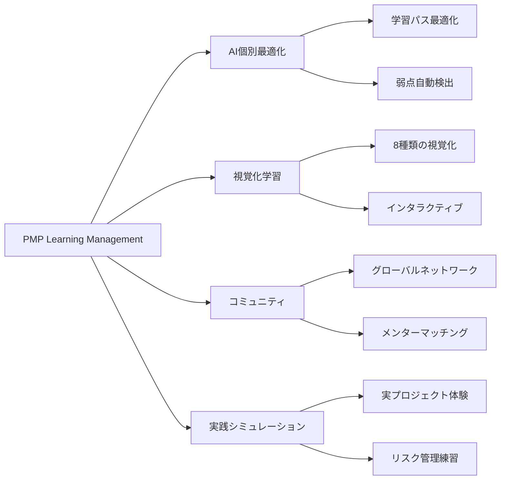

# 🚀 PMP Learning Management - プロダクトビジョン 2030

## エグゼクティブサマリー

PMP Learning Managementは、プロジェクトマネジメント教育のグローバルリーダーとなることを目指しています。AI駆動の個別最適化学習と、世界中のPMコミュニティをつなぐプラットフォームとして、2030年までに100万人のPMP合格者を輩出します。

## 🎯 ミッションステートメント

> **私たちのミッション**  
> すべてのプロジェクトマネジメント実践者に、最高品質の学習体験と成長機会を提供し、グローバルなPMコミュニティの発展に貢献する

## 🌟 ビジョン2030

### 2030年の姿

**グローバルインパクト**
- 100万人以上のアクティブユーザー
- 50カ国以上でサービス展開
- 15言語対応
- 業界標準の学習プラットフォーム

**イノベーション**
- AI個別最適化学習の完全実装
- VR/AR学習体験の標準化
- リアルタイムメンタリング
- 予測的キャリアガイダンス

**コミュニティ**
- 10万人のアクティブメンター
- 毎月1000以上のバーチャルイベント
- グローバル知識共有ネットワーク
- 業界別専門コミュニティ

## 📊 戦略的目標

### 短期目標（2025-2026）

| 目標 | KPI | 現状 | ターゲット |
|------|-----|------|------------|
| ユーザー獲得 | MAU | 5,000 | 50,000 |
| 合格率向上 | 平均合格率 | 87% | 90% |
| 満足度 | NPS | 45 | 60 |
| 収益成長 | ARR | $100K | $1M |

### 中期目標（2027-2028）

| 目標 | KPI | ターゲット |
|------|-----|------------|
| 市場シェア | 日本市場 | 25% |
| グローバル展開 | 対応国数 | 10カ国 |
| プロダクト拡張 | 認定資格数 | 5種類 |
| パートナーシップ | 企業提携 | 50社 |

### 長期目標（2029-2030）

| 目標 | KPI | ターゲット |
|------|-----|------------|
| グローバルリーダー | 世界シェア | Top 3 |
| 社会的インパクト | 合格者数 | 100万人 |
| イノベーション | 特許取得 | 10件 |
| サステナビリティ | カーボンニュートラル | 達成 |

## 🎨 プロダクト戦略

### 1. コア価値提案

**For PMP受験者**
- 業界最高の合格率（90%+）
- 学習時間の35%削減
- パーソナライズされた学習体験
- 手頃な価格設定

**For 企業研修担当者**
- 従業員のスキル向上可視化
- カスタマイズ可能な研修プログラム
- ROI測定ツール
- 進捗レポートダッシュボード

**For 現役PM**
- 継続的な学習機会
- 実践的なケーススタディ
- ピアラーニング
- PDU取得サポート

### 2. 差別化要因

### 3. 成長戦略

**Phase 1: Product-Market Fit（2025）**
- コア機能の完成度向上
- ユーザーフィードバック反映
- 初期ユーザー獲得

**Phase 2: Growth（2026-2027）**
- マーケティング強化
- パートナーシップ構築
- 機能拡張

**Phase 3: Expansion（2028-2029）**
- 国際展開
- 新認定資格対応
- エンタープライズ機能

**Phase 4: Market Leadership（2030）**
- 業界標準確立
- イノベーション推進
- エコシステム構築

## 💰 ビジネスモデル

### 収益モデル

1. **サブスクリプション（70%）**
   - Basic: $29/月
   - Professional: $49/月
   - Enterprise: カスタム価格

2. **企業向けライセンス（20%）**
   - 年間契約
   - ボリュームディスカウント
   - カスタマイズサポート

3. **付加サービス（10%）**
   - 1対1メンタリング
   - 集中講座
   - 認定証発行

### ユニットエコノミクス

| 指標 | 現在 | 目標（2030） |
|------|------|-------------|
| CAC | $50 | $30 |
| LTV | $500 | $1,500 |
| LTV/CAC | 10x | 50x |
| Churn Rate | 5%/月 | 2%/月 |
| Gross Margin | 70% | 85% |

## 🏆 成功指標

### North Star Metric
**週間アクティブ学習時間（WAL）**
- 現在: 3.5時間/週
- 2030目標: 7時間/週

### Supporting Metrics

**エンゲージメント**
- DAU/MAU比率: 60%以上
- セッション時間: 45分以上
- 完了率: 80%以上

**品質**
- 合格率: 90%以上
- NPS: 70以上
- サポート満足度: 95%以上

**成長**
- MoM成長率: 10%以上
- オーガニック獲得率: 60%以上
- リファラル率: 30%以上

## 🗺️ ロードマップ

### 2025 Q3-Q4
- [ ] AIコーチング v2.0
- [ ] モバイルアプリ正式版
- [ ] 企業向け機能

### 2026 Q1-Q2
- [ ] 多言語対応（英語、中国語）
- [ ] API公開
- [ ] パートナープログラム

### 2026 Q3-Q4
- [ ] VR学習体験ベータ
- [ ] グローバルメンターネットワーク
- [ ] エンタープライズ分析

### 2027-2030
- [ ] グローバル展開（10→50カ国）
- [ ] 新資格対応（CAPM、PgMP、PMI-ACP）
- [ ] AI完全自動化
- [ ] 業界別専門化

## 🤝 ステークホルダー価値

### ユーザー
- キャリア成長の加速
- 学習効率の最大化
- グローバルネットワーク構築

### 投資家
- 高成長市場でのポジション
- スケーラブルなビジネスモデル
- 強固なユニットエコノミクス

### パートナー
- 新規顧客獲得チャネル
- ブランド価値向上
- 共同イノベーション

### 社会
- PM人材の育成
- 産業の生産性向上
- 知識の民主化

## 🌍 社会的インパクト

### SDGs貢献

**Goal 4: 質の高い教育**
- アクセシブルな学習機会
- 個別最適化された教育
- 生涯学習の促進

**Goal 8: 働きがいと経済成長**
- プロフェッショナルスキル向上
- キャリア機会の拡大
- 生産性の向上

**Goal 10: 不平等の是正**
- グローバルアクセス
- 手頃な価格設定
- 多言語対応

### インクルージョン

- **アクセシビリティ**: WCAG 2.1 AA準拠
- **多様性**: 50%以上の女性ユーザー
- **奨学金**: 年間1000名への無料提供

## 📈 リスクと緩和策

| リスク | 影響度 | 可能性 | 緩和策 |
|--------|--------|--------|--------|
| 競合の参入 | 高 | 中 | 差別化強化、特許取得 |
| 技術的負債 | 中 | 低 | 継続的リファクタリング |
| 規制変更 | 中 | 低 | コンプライアンス体制 |
| 市場飽和 | 低 | 低 | 新市場開拓 |

## 🎯 コミットメント

私たちは以下にコミットします：

1. **ユーザー第一**: すべての決定はユーザー価値を中心に
2. **継続的革新**: 常に最先端の学習体験を提供
3. **透明性**: オープンなコミュニケーション
4. **持続可能性**: 長期的な価値創造
5. **社会貢献**: PM教育の民主化

---

**作成日**: 2025-08-16  
**次回レビュー**: 2025-10-01  
**承認者**: Product Leadership Team

> 💡 **Call to Action**: このビジョンの実現に向けて、全員が一丸となって取り組みましょう！