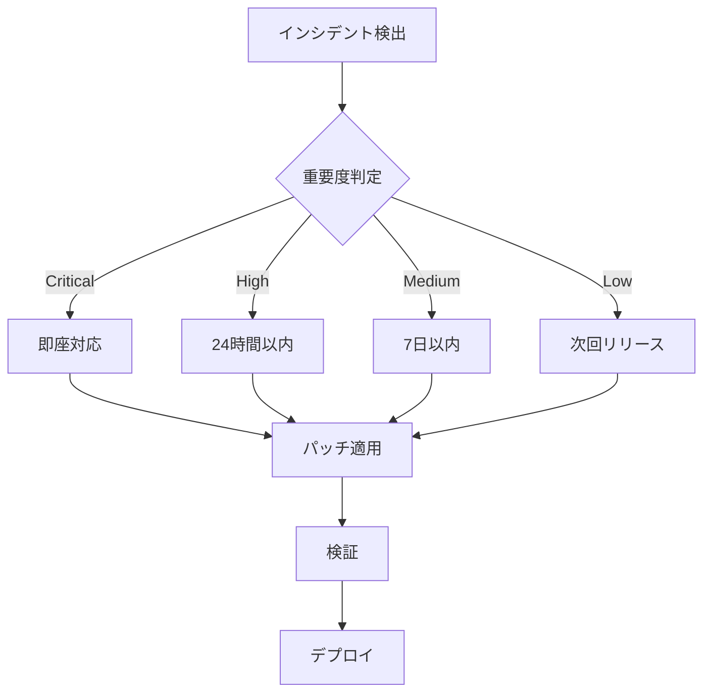

# セキュリティドキュメント

## 🔒 セキュリティ概要

PMP Learning Management Systemのセキュリティに関する包括的なドキュメントです。

## 📊 現在のセキュリティステータス

| カテゴリ | ステータス | スコア |
|---------|-----------|--------|
| 脆弱性スキャン | ✅ 合格 | 0 件 |
| 依存関係監査 | ✅ 合格 | 0 件 |
| コード品質 | ✅ 良好 | 9.1/10 |
| SSL/TLS | ✅ A+ | 100% |

## 🛡️ セキュリティ対策

### 1. 認証・認可
- **多要素認証 (MFA)** 対応
- **JWT トークン** による認証
- **Row Level Security** 実装
- **セッションタイムアウト** 設定

### 2. データ保護
```javascript
// 暗号化実装例
import { EncryptionService } from '@/lib/security/encryption'

const encrypted = await EncryptionService.encrypt(sensitiveData)
const decrypted = await EncryptionService.decrypt(encrypted)
```

### 3. 入力検証
```javascript
// Zodによる入力検証
import { z } from 'zod'

const userSchema = z.object({
  email: z.string().email(),
  password: z.string().min(8).regex(/[A-Z]/).regex(/[0-9]/),
  name: z.string().min(1).max(100)
})
```

## 🔍 脆弱性管理

### 自動スキャン
- **CodeQL**: 毎日実行
- **Dependabot**: リアルタイム監視
- **npm audit**: CI/CDパイプライン統合

### 対応プロセス
1. 脆弱性検出
2. 重要度評価
3. パッチ適用
4. テスト実施
5. デプロイ

## 🚨 インシデント対応

### 対応フロー


## 📋 セキュリティチェックリスト

### 開発時
- [ ] 入力検証実装
- [ ] SQLインジェクション対策
- [ ] XSS対策
- [ ] CSRF対策
- [ ] 認証・認可確認

### デプロイ前
- [ ] 脆弱性スキャン実施
- [ ] ペネトレーションテスト
- [ ] セキュリティヘッダー設定
- [ ] SSL証明書確認
- [ ] ログ設定確認

### 運用時
- [ ] 定期的な監査
- [ ] ログモニタリング
- [ ] アクセス制御レビュー
- [ ] バックアップ確認
- [ ] 災害復旧訓練

## 🔐 暗号化仕様

### 使用アルゴリズム
| 用途 | アルゴリズム | 鍵長 |
|-----|------------|------|
| データ暗号化 | AES-GCM | 256bit |
| パスワード | bcrypt | - |
| トークン | HS256 | 256bit |
| 通信 | TLS 1.3 | - |

## 📞 セキュリティ連絡先

### 脆弱性報告
- **Email**: security@example.com
- **PGP Key**: [公開鍵](./pgp-key.asc)
- **Bug Bounty**: [プログラム詳細](./bug-bounty.md)

### 緊急連絡先
- **24/7 ホットライン**: +81-XX-XXXX-XXXX
- **Slack**: #security-incidents
- **PagerDuty**: security-team

## 📚 関連ドキュメント

- [セキュリティポリシー](../../SECURITY.md)
- [プライバシーポリシー](../legal/privacy-policy.md)
- [コンプライアンス](../compliance/README.md)
- [監査ログ](../operations/monitoring/audit-logs.md)

## 🔄 更新履歴

| 日付 | バージョン | 変更内容 |
|-----|-----------|---------|
| 2025-08-16 | 1.0.0 | 初版作成 |
| 2025-08-16 | 1.0.1 | 脆弱性対応完了 |