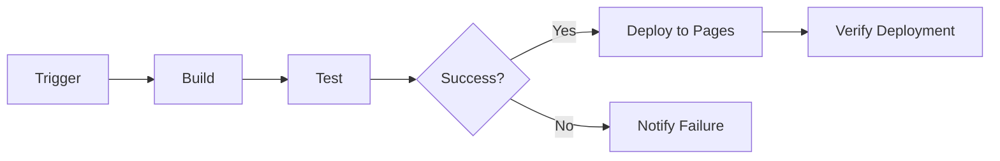
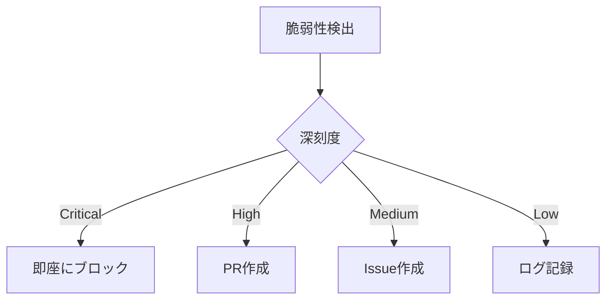

# GitHub Actions ワークフロー仕様書

## 📋 目次

1. [概要](#概要)
2. [ワークフロー一覧](#ワークフロー一覧)
3. [CI/CDワークフロー](#cicdワークフロー)
4. [品質保証ワークフロー](#品質保証ワークフロー)
5. [セキュリティワークフロー](#セキュリティワークフロー)
6. [パフォーマンスワークフロー](#パフォーマンスワークフロー)
7. [IDD管理ワークフロー](#idd管理ワークフロー)
8. [AI統合ワークフロー](#ai統合ワークフロー)
9. [共通設定](#共通設定)
10. [トラブルシューティング](#トラブルシューティング)

## 概要

本仕様書は、PMPLearningManagementプロジェクトで使用されるGitHub Actionsワークフローの詳細な仕様を定義します。

### ワークフロー設計原則

1. **単一責任**: 各ワークフローは1つの明確な目的を持つ
2. **再利用性**: 共通処理はreusableワークフローとして定義
3. **並列実行**: 独立したジョブは並列化して高速化
4. **キャッシュ活用**: 依存関係やビルド成果物をキャッシュ
5. **条件付き実行**: 不要な実行を避けて効率化

## ワークフロー一覧

### カテゴリ別分類

| カテゴリ | プレフィックス | ワークフロー数 | 主要用途 |
|---------|--------------|-------------|---------|
| CI/CD | ci-, cd- | 11 | ビルド、テスト、デプロイ |
| 品質保証 | qa- | 7 | 品質チェック、テスト |
| セキュリティ | sec- | 5 | セキュリティスキャン |
| パフォーマンス | perf- | 6 | パフォーマンス監視 |
| IDD | idd- | 7 | Issue管理、自動化 |
| AI統合 | ai- | 13 | Claude AI連携 |
| 運用 | ops- | 10 | インフラ、監視 |
| メタ | meta- | 7 | 管理、調整 |
| その他 | misc-, docs- | 3 | その他、ドキュメント |

## CI/CDワークフロー

### ci-01-basic-checks.yml

**目的**: 基本的なコード品質チェック

**トリガー**:
```yaml
on:
  pull_request:
    types: [opened, synchronize]
  push:
    branches: [main, develop]
```

**主要ジョブ**:
```yaml
jobs:
  lint:
    name: ESLint & Prettier Check
    steps:
      - Checkout
      - Setup Node.js
      - Install Dependencies
      - Run ESLint
      - Run Prettier Check
  
  typecheck:
    name: TypeScript Check
    steps:
      - Checkout
      - Setup Node.js
      - Install Dependencies
      - Run TypeScript Compiler
```

**成功条件**:
- ESLintエラーが0
- Prettierフォーマット違反が0
- TypeScriptコンパイルエラーが0

### ci-06-integration-test.yml

**目的**: 統合テストとE2Eテストの実行

**トリガー**:
```yaml
on:
  pull_request:
    branches: [main]
  schedule:
    - cron: '0 2 * * *'  # 毎日2時
```

**主要ジョブ**:
```yaml
jobs:
  integration-test:
    name: Integration Tests
    strategy:
      matrix:
        node: [18, 20]
        os: [ubuntu-latest, windows-latest]
    steps:
      - Run Integration Tests
      - Upload Test Results
  
  e2e-test:
    name: E2E Tests
    services:
      playwright:
        image: mcr.microsoft.com/playwright
    steps:
      - Install Playwright
      - Run E2E Tests
      - Upload Screenshots
```

### cd-01-deploy-pages.yml

**目的**: GitHub Pagesへのデプロイ

**トリガー**:
```yaml
on:
  push:
    branches: [main]
  workflow_dispatch:
```

**デプロイプロセス**:


**環境変数**:
```yaml
env:
  NODE_ENV: production
  PUBLIC_URL: https://yusuke-kurosawa.github.io/PMPLearningManagement
```

## 品質保証ワークフロー

### qa-02-quality-assurance.yml

**目的**: コード品質の包括的チェック

**メトリクス収集**:
- コードカバレッジ（目標: 80%以上）
- 循環的複雑度（目標: 10以下）
- 重複コード率（目標: 5%以下）
- 技術的負債（目標: 5日以下）

**レポート出力**:
```yaml
- name: Generate Quality Report
  run: |
    npm run quality:report
    npm run coverage:report
    npm run complexity:report
```

### qa-07-lighthouse-ci.yml

**目的**: Core Web Vitalsとアクセシビリティチェック

**測定項目**:
```yaml
lighthouse:
  assertions:
    categories:performance: [0.9, 1]
    categories:accessibility: [0.9, 1]
    categories:best-practices: [0.9, 1]
    categories:seo: [0.9, 1]
    first-contentful-paint: [2000, 3000]
    speed-index: [3000, 4000]
    largest-contentful-paint: [2500, 4000]
    cumulative-layout-shift: [0.1, 0.25]
```

## セキュリティワークフロー

### sec-01-basic-scan.yml

**目的**: 基本的なセキュリティスキャン

**スキャン項目**:
1. 依存関係の脆弱性
2. ライセンス準拠性
3. セキュリティヘッダー
4. ハードコードされた認証情報

**実行コマンド**:
```bash
npm audit
npm run license-check
npm run security-headers
npm run secrets-scan
```

### sec-02-devsecops.yml

**目的**: 包括的なDevSecOps実装

**セキュリティチェック**:
```yaml
security-checks:
  - SAST (Static Application Security Testing)
  - DAST (Dynamic Application Security Testing)
  - SCA (Software Composition Analysis)
  - Container Scanning
  - Infrastructure as Code Scanning
```

**脆弱性対応**:


## パフォーマンスワークフロー

### perf-01-optimization.yml

**目的**: パフォーマンス最適化

**最適化項目**:
- バンドルサイズ削減
- 画像最適化
- コード分割
- Tree Shaking
- Dead Code Elimination

### perf-05-budget.yml

**目的**: パフォーマンス予算の監視

**予算設定**:
```json
{
  "bundles": {
    "main.js": { "maxSize": "200KB" },
    "vendor.js": { "maxSize": "500KB" },
    "main.css": { "maxSize": "50KB" }
  },
  "metrics": {
    "FCP": { "max": 2000 },
    "LCP": { "max": 2500 },
    "CLS": { "max": 0.1 },
    "FID": { "max": 100 }
  }
}
```

## IDD管理ワークフロー

### idd-05-auto-labeling.yml

**目的**: Issue/PRの自動ラベリング

**ラベリングルール**:
```yaml
rules:
  - pattern: "bug|バグ|不具合"
    label: "種類:バグ"
  - pattern: "feat|新機能|feature"
    label: "種類:新機能"
  - pattern: "urgent|緊急|critical"
    label: "優先度:緊急"
```

### idd-06-pr-issue-link.yml

**目的**: PRとIssueの自動リンク

**リンクパターン**:
```yaml
patterns:
  close: ["Closes #", "Fixes #", "Resolves #"]
  relate: ["Related to #", "Part of #", "See #"]
```

**自動処理**:
1. Issue番号の抽出
2. Issue情報の取得
3. PR本文の更新
4. ラベルの同期

## AI統合ワークフロー

### ai-claude-comprehensive-review.yml

**目的**: Claude AIによる包括的コードレビュー

**レビュー観点**:
- アーキテクチャ準拠
- ベストプラクティス
- セキュリティ
- パフォーマンス
- アクセシビリティ
- 保守性

**トリガーコマンド**:
```markdown
@claude review       # 包括的レビュー
@claude security    # セキュリティ重点
@claude performance # パフォーマンス分析
@claude architecture # アーキテクチャ準拠
```

**スコアリング**:
```yaml
scoring:
  security: 1-5
  performance: 1-5
  maintainability: 1-5
  test_coverage: 1-5
  overall: (average)
```

## 共通設定

### 環境変数

**グローバル環境変数**:
```yaml
env:
  NODE_VERSION: '18'
  PNPM_VERSION: '8'
  TIMEZONE: 'Asia/Tokyo'
  CI: true
```

### シークレット

**必須シークレット**:
| 名前 | 用途 | スコープ |
|-----|------|---------|
| GITHUB_TOKEN | GitHub API | 自動提供 |
| DEPLOY_TOKEN | デプロイ認証 | Repository |
| CLAUDE_API_KEY | Claude AI | Organization |
| SONAR_TOKEN | SonarCloud | Repository |

### キャッシュ戦略

**キャッシュ対象**:
```yaml
cache:
  - path: ~/.npm
    key: npm-${{ hashFiles('package-lock.json') }}
  - path: ~/.cache/playwright
    key: playwright-${{ runner.os }}
  - path: node_modules
    key: modules-${{ hashFiles('package-lock.json') }}
```

### 並列実行設定

**マトリックス戦略**:
```yaml
strategy:
  matrix:
    os: [ubuntu-latest, windows-latest, macos-latest]
    node: [18, 20]
    browser: [chrome, firefox, safari]
  max-parallel: 4
  fail-fast: false
```

## トラブルシューティング

### よくあるエラーと対処法

#### 1. Permission Denied

**エラー**:
```
Error: HttpError: Resource not accessible by integration
```

**解決**:
```yaml
permissions:
  contents: read
  pull-requests: write
  issues: write
```

#### 2. Cache Miss

**エラー**:
```
Cache not found for input keys
```

**解決**:
```yaml
- uses: actions/cache@v3
  with:
    path: node_modules
    key: ${{ runner.os }}-node-${{ hashFiles('**/package-lock.json') }}
    restore-keys: |
      ${{ runner.os }}-node-
      ${{ runner.os }}-
```

#### 3. Timeout

**エラー**:
```
The job running on runner has exceeded the maximum execution time of 360 minutes
```

**解決**:
```yaml
jobs:
  test:
    timeout-minutes: 30  # ジョブレベル
    steps:
      - name: Run Tests
        timeout-minutes: 10  # ステップレベル
```

### デバッグ方法

**デバッグ出力有効化**:
```yaml
env:
  ACTIONS_RUNNER_DEBUG: true
  ACTIONS_STEP_DEBUG: true
```

**ステップデバッグ**:
```yaml
- name: Debug Info
  run: |
    echo "Event: ${{ github.event_name }}"
    echo "Ref: ${{ github.ref }}"
    echo "SHA: ${{ github.sha }}"
    echo "Actor: ${{ github.actor }}"
```

**ローカル実行**:
```bash
# actを使用
act -j test
act pull_request
act -s GITHUB_TOKEN=$GITHUB_TOKEN
```

## パフォーマンス最適化

### 実行時間短縮

1. **依存関係キャッシュ**
```yaml
- uses: actions/setup-node@v4
  with:
    cache: 'npm'
```

2. **条件付き実行**
```yaml
if: |
  github.event_name == 'pull_request' &&
  contains(github.event.pull_request.labels.*.name, 'ready')
```

3. **早期終了**
```yaml
continue-on-error: false
fail-fast: true
```

### リソース最適化

**ランナー選択**:
```yaml
runs-on: ${{ matrix.os }}
# または
runs-on: ubuntu-latest  # 最速
runs-on: self-hosted    # カスタムランナー
```

## 更新履歴

- 2024-01-13: 初版作成
- [今後の更新はここに記載]

## 参考リンク

- [GitHub Actions公式ドキュメント](https://docs.github.com/actions)
- [DevOps基盤ガイド](../devops/DEVOPS_FOUNDATION_GUIDE.md)
- [IDD開発フローガイド](../idd/IDD_DEVELOPMENT_FLOW_GUIDE.md)
- [プロジェクトガイドライン](../../CLAUDE.md)

---

*この仕様書は継続的に更新されます。最新情報は[GitHubリポジトリ](https://github.com/yusuke-kurosawa/PMPLearningManagement)を確認してください。*